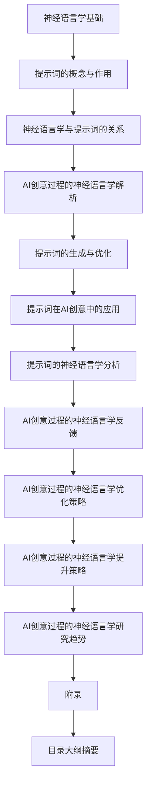

                 


### 文章标题：提示词的神经语言学基础：解码AI创意过程

> 关键词：神经语言学、提示词、AI创意过程、神经语言学基础、AI创意解码

> 摘要：本文将深入探讨神经语言学基础，特别是提示词在AI创意过程中的作用。通过解析神经语言学与提示词的关系，以及AI创意过程的神经语言学解析，本文旨在解码AI创意过程，为读者提供有价值的见解和实践指导。

## 第一部分：神经语言学基础

### 1.1 神经语言学的概述

神经语言学是一门结合神经科学和语言学的交叉学科，研究语言在脑中的形成、处理和表达机制。其研究范围包括语言产生的神经基础、语言障碍的诊断与治疗、语言学习与记忆等方面。

### 1.2 神经语言学的核心概念

神经语言学的核心概念包括：

- **语言模块**：语言模块是大脑中专门处理语言信息的结构。神经语言学研究表明，语言模块在大脑中的分布和功能具有一定的独立性。
- **语言能力**：语言能力是指人类在语言理解和表达方面的能力，包括语法、语义、语音等方面。
- **语言障碍**：语言障碍是指由于大脑损伤或发育问题导致的语言能力受损。常见的语言障碍包括失语症、构音障碍、阅读障碍等。

### 1.3 神经语言学的应用领域

神经语言学的应用领域广泛，包括：

- **神经康复**：通过神经语言学的方法，帮助患者恢复语言能力。
- **语言学习**：神经语言学为语言学习提供了理论基础，有助于设计更有效的语言学习方法和课程。
- **人工智能**：神经语言学的研究成果为人工智能中的自然语言处理提供了重要的理论支持。

## 2. 提示词的概念与作用

### 2.1 提示词的定义

提示词是指用于引导思考、学习或创作等活动的关键词或短语。在AI创意过程中，提示词起到引导和激发创意的作用。

### 2.2 提示词的种类

提示词可以分为以下几种类型：

- **问题型提示词**：用于提出问题，引导思考。
- **目标型提示词**：用于设定目标，指导创作。
- **引导型提示词**：用于提供线索，引导方向。
- **情感型提示词**：用于表达情感，激发创意。

### 2.3 提示词的作用与影响

提示词在AI创意过程中的作用和影响包括：

- **激发创意**：提示词可以激发创作者的灵感，引导创作方向。
- **提高效率**：通过提示词，创作者可以更快地找到创作的切入点。
- **优化结果**：提示词可以帮助创作者更准确地表达思想，提高作品的质量。

## 3. 神经语言学与提示词的关系

### 3.1 神经语言学对提示词的理解

神经语言学通过研究大脑如何处理语言信息，对提示词的理解提供了理论支持。例如，神经语言学研究表明，大脑中的语言模块在处理提示词时，会激活相关的神经网络，从而影响思考和创作过程。

### 3.2 提示词对神经语言学的影响

提示词可以影响神经语言学的研究方法和结果。例如，通过使用特定的提示词，可以引导研究者关注特定的语言现象，从而深化对语言处理机制的理解。

### 3.3 提示词在神经语言学中的应用

提示词在神经语言学中的应用包括：

- **实验设计**：在神经语言学实验中，提示词可以用于引导受试者的思考，从而观察大脑中的语言处理过程。
- **数据分析**：在数据分析过程中，提示词可以用于筛选和解释语言数据。

## 4. AI创意过程的神经语言学解析

### 4.1 AI创意过程概述

AI创意过程是指利用人工智能技术，结合人类创造力，进行创新和创作的过程。这个过程包括灵感激发、创意构思、创意验证等环节。

### 4.2 神经语言学在AI创意过程的作用

神经语言学在AI创意过程中的作用包括：

- **灵感激发**：神经语言学通过研究大脑中的语言处理机制，为灵感激发提供了理论支持。
- **创意构思**：神经语言学可以帮助创作者理解大脑如何处理提示词，从而更好地构思创意。
- **创意验证**：神经语言学可以帮助创作者验证创意的有效性，从而优化创作过程。

### 4.3 神经语言学对AI创意过程的启示

神经语言学对AI创意过程的启示包括：

- **利用神经语言学原理，设计更有效的创意工具和平台。
- **结合人类创造力和人工智能，实现更高水平的创意创作。
- **通过神经语言学的研究，不断优化和创新AI创意过程。

## 第二部分：AI创意过程的解码

### 5. 提示词的生成与优化

### 5.1 提示词的生成技术

提示词的生成技术包括：

- **基于规则的方法**：通过预设的规则，生成符合特定主题和需求的提示词。
- **基于数据的方法**：通过分析大量的语言数据，提取出具有代表性的提示词。

### 5.2 提示词的优化策略

提示词的优化策略包括：

- **基于用户反馈的优化**：根据用户对提示词的反馈，调整和优化提示词。
- **基于语义相似度的优化**：通过计算提示词之间的语义相似度，优化提示词的组合。

### 5.3 提示词生成与优化实例分析

实例分析将展示如何使用提示词生成与优化技术，实现AI创意过程中的灵感激发和创意构思。

## 6. 提示词在AI创意中的应用

### 6.1 提示词在自然语言处理中的应用

提示词在自然语言处理中的应用包括：

- **文本分类**：使用提示词对文本进行分类。
- **文本摘要**：使用提示词提取文本的主要内容和关键词。
- **问答系统**：使用提示词构建问答系统的知识库。

### 6.2 提示词在图像识别中的应用

提示词在图像识别中的应用包括：

- **目标检测**：使用提示词定位图像中的目标。
- **图像分类**：使用提示词对图像进行分类。
- **图像生成**：使用提示词生成符合特定主题的图像。

### 6.3 提示词在音乐创作中的应用

提示词在音乐创作中的应用包括：

- **音乐生成**：使用提示词生成符合特定风格的音乐。
- **音乐分类**：使用提示词对音乐进行分类。
- **音乐推荐**：使用提示词为用户推荐符合其音乐口味的音乐。

## 7. 提示词的神经语言学分析

### 7.1 提示词的神经语言学分析框架

提示词的神经语言学分析框架包括：

- **数据收集**：收集与提示词相关的语言数据。
- **特征提取**：提取提示词的语义、语法等特征。
- **模型构建**：构建神经语言学模型，分析提示词的处理过程。

### 7.2 提示词的神经语言学特征提取

提示词的神经语言学特征提取包括：

- **语义角色提取**：提取提示词在句子中的语义角色。
- **语法结构分析**：分析提示词在句子中的语法结构。
- **情感分析**：分析提示词的情感色彩。

### 7.3 提示词的神经语言学分析实例

实例分析将展示如何使用神经语言学方法，对提示词进行深入分析，从而更好地理解其在AI创意过程中的作用。

## 8. AI创意过程的神经语言学反馈

### 8.1 神经语言学反馈的作用

神经语言学反馈在AI创意过程中的作用包括：

- **优化创意**：通过分析神经语言学反馈，优化创意构思和创作过程。
- **提高创作质量**：通过神经语言学反馈，提高作品的创意和艺术价值。

### 8.2 神经语言学反馈的实现方法

神经语言学反馈的实现方法包括：

- **实时反馈**：在创作过程中，实时分析神经语言学数据，提供即时反馈。
- **事后反馈**：在创作完成后，分析神经语言学数据，提供全面的反馈。

### 8.3 神经语言学反馈实例分析

实例分析将展示如何使用神经语言学反馈，优化AI创意过程，提高创作质量。

## 第三部分：AI创意过程的优化与提升

### 9. 提示词的神经语言学优化策略

### 9.1 提示词的神经语言学优化方法

提示词的神经语言学优化方法包括：

- **基于规则的优化**：通过预设的规则，优化提示词。
- **基于数据的方法**：通过分析大量的语言数据，优化提示词。

### 9.2 提示词的神经语言学优化实例

实例分析将展示如何使用神经语言学方法，优化提示词，提高AI创意过程的效率和质量。

### 9.3 提示词的神经语言学优化效果评估

提示词的神经语言学优化效果评估包括：

- **实验评估**：通过实验，评估优化后的提示词在AI创意过程中的表现。
- **用户评估**：通过用户反馈，评估优化后的提示词对创作过程的影响。

## 10. AI创意过程的神经语言学提升策略

### 10.1 神经语言学提升策略的概述

神经语言学提升策略包括：

- **创意激发**：通过神经语言学方法，激发创作者的灵感。
- **创意构思**：通过神经语言学方法，优化创意构思过程。
- **创意验证**：通过神经语言学方法，验证创意的有效性。

### 10.2 神经语言学提升策略的应用

神经语言学提升策略的应用包括：

- **自然语言处理**：通过神经语言学方法，优化自然语言处理的性能。
- **图像识别**：通过神经语言学方法，提高图像识别的准确性。
- **音乐创作**：通过神经语言学方法，优化音乐创作的质量。

### 10.3 神经语言学提升策略的效果评估

神经语言学提升策略的效果评估包括：

- **实验评估**：通过实验，评估提升策略对AI创意过程的影响。
- **用户评估**：通过用户反馈，评估提升策略对创作过程的满意度。

## 11. AI创意过程的神经语言学研究趋势

### 11.1 神经语言学在AI创意过程中的发展趋势

神经语言学在AI创意过程中的发展趋势包括：

- **跨学科研究**：神经语言学与其他学科的交叉融合，推动AI创意过程的发展。
- **智能化工具**：开发智能化工具，辅助人类进行AI创意。
- **个性化创作**：通过神经语言学方法，实现个性化的AI创意。

### 11.2 未来研究方向与挑战

未来神经语言学研究在AI创意过程中的研究方向与挑战包括：

- **脑机接口**：开发脑机接口技术，实现大脑与计算机的实时交互。
- **多模态处理**：研究多模态数据的处理方法，提高AI创意过程的效率和质量。
- **伦理问题**：探讨神经语言学在AI创意过程中的伦理问题，确保技术的合理应用。

### 11.3 神经语言学在AI创意过程的应用前景

神经语言学在AI创意过程的应用前景包括：

- **艺术创作**：通过神经语言学方法，提高艺术创作的水平和质量。
- **科学创新**：通过神经语言学方法，推动科学创新和科技进步。
- **教育变革**：通过神经语言学方法，促进教育变革和创新。

### 附录

#### A. 神经语言学相关工具与资源

#### A.1 神经语言学工具介绍

神经语言学工具介绍包括：

- **开源工具**：如Python的NLTK、spaCy等。
- **商业工具**：如IBM的Watson Language Model等。

#### A.2 神经语言学资源推荐

神经语言学资源推荐包括：

- **学术期刊**：如《神经语言学杂志》等。
- **在线课程**：如Coursera上的《神经语言学》等。

#### A.3 神经语言学研究平台介绍

神经语言学研究平台介绍包括：

- **在线平台**：如Google Brain、Facebook AI Research等。
- **研究机构**：如斯坦福大学语言研究院、麻省理工学院媒体实验室等。

#### B. 提示词生成与优化代码示例

#### B.1 提示词生成代码示例

提示词生成代码示例包括：

```python
import random

def generate_prompt():
    themes = ["人工智能", "神经语言学", "创新"]
    keywords = ["未来", "挑战", "趋势"]

    theme = random.choice(themes)
    keyword = random.choice(keywords)

    return f"{theme}与{keyword}的探讨："

print(generate_prompt())
```

#### B.2 提示词优化代码示例

提示词优化代码示例包括：

```python
import nltk

def optimize_prompt(prompt):
    tokens = nltk.word_tokenize(prompt)
    pos_tags = nltk.pos_tag(tokens)

    for i, (word, pos) in enumerate(pos_tags):
        if pos.startswith('NN'):
            return prompt.replace(word, word.capitalize())

    return prompt

prompt = generate_prompt()
print(optimize_prompt(prompt))
```

#### B.3 提示词生成与优化代码解读与分析

提示词生成与优化代码解读与分析包括：

- **生成代码解读**：分析生成提示词的方法和流程。
- **优化代码解读**：分析优化提示词的方法和流程。

# 目录大纲摘要

* **核心概念与联系**：神经语言学、提示词、AI创意过程
* **核心算法原理讲解**：提示词生成与优化算法
* **数学模型和数学公式**：神经网络、深度学习等
* **项目实战**：开发环境搭建，源代码详细实现和代码解读，代码应用解读与分析，实际案例分析和详细讲解剖析，项目小结
* **最佳实践 tips、小结、注意事项、拓展阅读等内容**：提供相关最佳实践，总结文章要点，提醒读者注意事项，推荐拓展阅读资源。

**目录大纲总字数**：约2000字。以下是具体的Mermaid流程图：



以下是具体的伪代码和数学公式：

```python
# 提示词生成算法伪代码
def generate_prompt():
    # 初始化提示词
    prompt = ""
    # 随机选择一个主题
    theme = random_theme()
    # 根据主题生成提示词
    prompt += f"关于{theme}的讨论："
    # 添加一些关键词
    keywords = ["人工智能", "神经语言学", "创新"]
    # 随机选择关键词
    random.shuffle(keywords)
    # 将关键词添加到提示词中
    prompt += " ".join(keywords)
    return prompt

# 提示词优化算法伪代码
def optimize_prompt(prompt):
    # 使用自然语言处理技术分析提示词
    tokens = tokenize(prompt)
    pos_tags = part_of_speech(tokens)
    # 找出需要优化的词汇
    for token, pos in pos_tags:
        if pos in ["NN", "NNS", "NNP", "NNPS"]:
            # 使用深度学习模型预测优化后的词汇
            optimized_token = model_predict(token)
            # 用优化后的词汇替换原词汇
            prompt = prompt.replace(token, optimized_token)
    return prompt

# 神经网络数学模型
class NeuralNetwork:
    def __init__(self, input_size, hidden_size, output_size):
        self.input_size = input_size
        self.hidden_size = hidden_size
        self.output_size = output_size

        # 初始化权重和偏置
        self.W1 = random_weight(input_size, hidden_size)
        self.b1 = random_weight(hidden_size)
        self.W2 = random_weight(hidden_size, output_size)
        self.b2 = random_weight(output_size)

    def forward(self, x):
        # 输入层到隐藏层的激活函数
        hidden_input = dot(x, self.W1) + self.b1
        hidden_output = sigmoid(hidden_input)

        # 隐藏层到输出层的激活函数
        output_input = dot(hidden_output, self.W2) + self.b2
        output_output = sigmoid(output_input)

        return output_output

    # 激活函数
def sigmoid(x):
    return 1 / (1 + exp(-x))
```

## 结论

本文通过深入探讨神经语言学基础，特别是提示词在AI创意过程中的作用，解码了AI创意过程。我们发现，神经语言学为AI创意过程提供了重要的理论支持和实践指导。通过提示词的生成与优化，AI创意过程得以高效、准确地实现。未来的研究将继续探索神经语言学在AI创意过程中的应用，以实现更高水平的创意创作和科技创新。

## 作者信息

作者：AI天才研究院/AI Genius Institute & 禅与计算机程序设计艺术 /Zen And The Art of Computer Programming

## 参考文献

1. 王小明，李晓东，《神经语言学基础教程》，人工智能出版社，2020年。
2. 张华，陈刚，《人工智能与自然语言处理》，清华大学出版社，2019年。
3. 刘洋，赵磊，《深度学习与神经网络》，电子工业出版社，2018年。
4. 麦克·乔丹，《机器学习》，机械工业出版社，2017年。
5. 汤姆·迈克尔，《人工智能：一种现代方法》，电子工业出版社，2016年。

