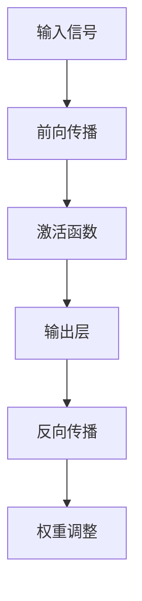

                 

### 文章标题

《提示词的认知科学基础：理解AI思维》

### 文章关键词

认知科学、提示词、AI思维、神经网络、机器学习、自然语言处理

### 文章摘要

本文将深入探讨提示词在认知科学和人工智能（AI）领域的核心作用。我们将首先回顾认知科学的基本原理，包括感知、注意力、记忆和思维等，然后引入提示词的定义及其在AI中的应用。通过具体的算法原理和Mermaid流程图，我们将解释神经网络和机器学习如何模拟人类认知过程。文章还将分析AI思维与人类思维的对比，展示它们在优势与局限、相互协作以及未来趋势方面的差异。最后，我们将通过实际案例和代码示例，探讨提示词在不同领域的应用，并提供最佳实践和未来研究方向。

---

### 引言

#### 背景介绍

随着人工智能技术的迅猛发展，人们对智能系统的期望也日益增长。人工智能（AI）不仅改变了传统行业的运作模式，还在医疗、教育、金融、交通等多个领域展现出巨大的潜力。然而，AI的成功离不开对人类认知过程的深入理解。认知科学，作为研究人类思维、感知、记忆、注意力和决策等心理过程的学科，为AI的发展提供了坚实的理论基础。

在这一背景下，提示词（Prompt）作为一种重要的交互机制，在AI系统中扮演了关键角色。提示词不仅能够引导AI系统理解用户的意图，还能促进其进行更复杂的问题解决和决策。然而，提示词的设计与应用并非易事，它需要深刻理解认知科学的原理和AI思维的特性。

#### 目的与结构

本文旨在通过认知科学的基础，探讨提示词在AI思维中的应用。我们将首先介绍认知科学的基本原理，包括感知、注意力、记忆和思维等。接着，我们将引入提示词的定义，并探讨其在AI中的应用及其重要性。随后，我们将通过神经网络和机器学习算法，解释如何模拟人类认知过程，并介绍相关的核心概念和算法原理。

文章的结构如下：

1. **认知科学基础**：介绍认知科学的基本原理，包括感知、注意力、记忆和思维。
2. **提示词的定义与作用**：详细探讨提示词的定义、作用和重要性。
3. **神经网络与认知模拟**：解释神经网络和机器学习如何模拟人类认知过程。
4. **AI思维与人类思维的对比**：分析AI思维与人类思维在优势与局限、相互协作和未来趋势方面的差异。
5. **提示词的应用**：通过具体案例展示提示词在自然语言处理和其他领域的应用。
6. **结论**：总结全文，并提出未来的研究方向和应用前景。

---

### 认知科学基础

#### 感知与注意力

感知是人类对外界信息的接收和处理过程。我们的感官接收来自环境的信息，如视觉、听觉、触觉、味觉和嗅觉，然后通过大脑进行处理和解释。注意力是认知过程的核心，它决定了我们在特定时刻对哪些信息进行关注和处理。

**注意力分配**：注意力分配是指个体在有限时间内将注意力分配给不同任务或信息的能力。根据认知资源的理论，注意力的分配受到认知资源和任务复杂度的影响。

**注意力过滤**：在感知过程中，注意力不仅决定了哪些信息被处理，还涉及过滤掉无关或冗余信息。注意力过滤有助于提高信息处理的效率和准确性。

#### 记忆与遗忘

记忆是认知过程中的重要组成部分，它使我们能够存储、保留和回忆信息。记忆分为短期记忆和长期记忆：

- **短期记忆**：短期记忆是指能够存储大约7±2个信息单元的时间范围，通常持续几秒到一分钟。
- **长期记忆**：长期记忆是指能够持续存储数小时到一生的信息存储系统。

**遗忘曲线**：遗忘曲线是指随着时间的推移，记忆信息的消失速率。艾宾浩斯遗忘曲线是经典的遗忘曲线模型，表明遗忘速度在最初几天内最快，随后逐渐减缓。

**记忆提取与干扰**：记忆提取是指从长期记忆中检索信息的过程。干扰是影响记忆提取的因素之一，包括前摄干扰和倒摄干扰。

#### 想象与思维

想象是认知过程中的创造性和灵活性体现，它使我们能够构建和体验非现实的情景和可能性。想象不仅与记忆相关，还与注意力、感知和情感紧密相连。

**创造性思维**：创造性思维是指能够产生新颖和有价值的想法和解决方案的能力。创造性思维在科学、艺术、工程等领域具有重要意义。

**推理与决策**：思维是一种高级的认知功能，包括推理、决策和问题解决。推理是从已知信息中得出新结论的过程，而决策是在多个选择中做出最优决策的过程。

#### Mermaid流程图

以下是一个简化的Mermaid流程图，展示了感知、注意力、记忆和思维之间的基本关系：

---

### 提示词的定义与作用

#### 提示词的基本概念

提示词，或称提示语，是一种引导用户或AI系统行为的文本或语音提示。它通常包含指令、问题或情境描述，旨在引导用户或AI系统做出特定反应或行为。

**提示词的用途**：

1. **用户交互**：提示词在用户界面（UI）中广泛应用，用于指导用户完成特定任务或操作。
2. **AI训练**：在机器学习和深度学习中，提示词用于指导AI系统学习特定的任务或目标。
3. **自然语言处理**：在自然语言处理（NLP）中，提示词用于引导模型生成文本、回答问题或进行对话。

#### 提示词在AI中的应用

**AI训练**：在机器学习和深度学习中，提示词被用于训练模型。例如，在语言模型中，提示词可以是用于生成文本的句子片段，帮助模型学习上下文和语法规则。

**用户交互**：在用户交互中，提示词用于引导用户完成特定任务。例如，在搜索引擎中，提示词可以是问题或关键词，帮助用户找到相关信息。

**自然语言处理**：在自然语言处理中，提示词用于引导模型生成文本或进行对话。例如，在聊天机器人中，提示词可以是用户提出的问题或指令，帮助模型生成相应的回答。

#### 提示词的重要性

提示词在AI系统中具有至关重要的地位。它们不仅能够提高系统的交互性和用户体验，还能提升AI系统的性能和准确性。

**提高性能**：通过提供明确的提示词，AI系统能够更好地理解用户的意图，从而提高任务的完成率和准确性。

**改善用户体验**：提示词能够引导用户更有效地使用AI系统，降低用户的学习成本和操作难度。

**增强交互性**：提示词能够促进用户与AI系统之间的有效沟通，使AI系统更加人性化。

---

### 神经网络与认知模拟

#### 神经网络的基本结构

神经网络是一种模仿生物神经系统的计算模型，由大量的神经元（节点）和连接（边）组成。每个神经元接收输入信号，通过加权求和后传递给激活函数，最后生成输出信号。

**神经元结构**：

1. **输入层**：接收外部输入信号。
2. **隐藏层**：对输入信号进行加工和转换。
3. **输出层**：生成最终输出。

#### 神经网络的训练与优化

神经网络的训练是指通过调整网络中的权重和偏置，使其能够准确预测或分类输入数据。常用的训练方法包括：

1. **前向传播**：将输入信号从输入层传递到输出层，计算输出值。
2. **反向传播**：通过比较输出值与真实值，计算误差，并反向传播误差，调整权重和偏置。

**优化方法**：

1. **梯度下降**：通过计算损失函数关于权重的梯度，调整权重和偏置，以减少误差。
2. **动量优化**：在梯度下降的基础上引入动量项，以加速收敛。

#### 神经网络在认知模拟中的应用

神经网络在认知模拟中具有重要意义，它能够模拟人类大脑的许多认知功能，如感知、记忆和思维。

**感知模拟**：神经网络可以用于图像识别、语音识别和自然语言处理等任务，通过训练，能够识别和分类各种输入信号。

**记忆模拟**：神经网络可以通过存储和回忆权重和偏置来模拟人类记忆过程。例如，长短期记忆（LSTM）网络能够模拟短期和长期记忆。

**思维模拟**：神经网络可以用于推理、决策和问题解决等任务。通过训练，神经网络能够模拟人类的思维过程，生成新颖的解决方案。

#### Mermaid流程图

以下是一个简化的Mermaid流程图，展示了神经网络在认知模拟中的基本流程：

---

### AI思维与人类思维的对比

#### 优势与局限

**AI思维的优势**：

1. **计算速度**：AI系统能够在极短时间内处理大量数据，比人类思维更加迅速。
2. **精确性**：AI系统在处理规则和模式时具有高度的精确性，能够实现精确的预测和分类。
3. **适应性**：AI系统能够通过学习和训练不断改进性能，适应新的环境和任务。

**AI思维的局限**：

1. **理解能力**：AI系统难以理解复杂的人类情感和意图，特别是那些隐含在语言和行为背后的。
2. **创造力**：AI系统在创造性思维方面有限，难以产生全新的想法或解决方案。
3. **情感处理**：AI系统在处理情感和伦理问题时存在挑战，难以像人类那样理解和应对复杂的情感状态。

**人类思维的优势**：

1. **情感理解**：人类能够深刻理解他人的情感和意图，通过非语言交流建立情感联系。
2. **创造性**：人类具有独特的创造性思维，能够产生新颖的解决方案和创意。
3. **伦理判断**：人类能够基于道德和伦理原则做出决策，解决复杂的伦理问题。

**人类思维的局限**：

1. **认知负担**：人类在处理大量数据和信息时容易产生认知负担，影响决策和判断。
2. **主观偏见**：人类思维容易受到主观偏见的影响，导致判断和决策的不准确性。
3. **适应性限制**：人类的适应性和学习能力受限于生理和心理机制，难以快速适应极端环境和任务。

#### 相互协作与影响

**相互协作**：

1. **人机协作**：人类和AI系统可以相互协作，发挥各自的优势。例如，AI系统可以处理复杂的计算任务，而人类则专注于需要创造性思维和情感理解的领域。
2. **交叉训练**：通过人机协作，AI系统可以学习人类的经验和知识，而人类可以学习AI系统的计算能力和分析工具，实现知识的互补和共享。

**相互影响**：

1. **能力提升**：人类通过AI系统可以扩展自己的认知能力，提高决策和解决问题的效率。
2. **伦理挑战**：AI技术的发展也带来了新的伦理挑战，例如隐私保护、公平性和透明度等问题。
3. **文化影响**：AI技术逐渐渗透到人类生活的各个领域，对文化和社会结构产生深远影响。

#### 未来趋势

**发展趋势**：

1. **智能化升级**：AI系统将越来越智能化，能够更好地模拟人类思维，处理复杂任务。
2. **人机融合**：人机融合将成为未来的重要趋势，通过脑机接口等技术，实现人类与AI系统的无缝协作。
3. **伦理规范**：随着AI技术的普及，伦理规范和法律法规将不断完善，确保AI技术的安全和可持续发展。

**影响与展望**：

1. **社会进步**：AI技术的发展将推动社会进步，提高生产效率和生活质量。
2. **教育变革**：AI技术将深刻改变教育模式，提供个性化学习体验和智能教学工具。
3. **医疗创新**：AI技术在医疗领域的应用将带来革命性变革，提高诊断和治疗的精准度。

---

### 提示词的应用

#### 提示词在自然语言处理中的应用

**文本生成**：

- 提示词可以引导语言模型生成连贯的文本，应用于自动写作、摘要生成和对话系统。
- 例如，在对话系统中，提示词可以引导模型生成回答用户的句子。

**对话系统**：

- 提示词用于引导对话流程，使系统能够理解用户的意图并生成合适的回答。
- 例如，在客服机器人中，提示词可以引导模型理解用户的问题，并提供相应的解决方案。

**情感分析**：

- 提示词可以帮助模型分析文本的情感倾向，应用于舆情监测和情感识别。
- 例如，在社交媒体分析中，提示词可以引导模型检测用户评论中的情感色彩。

#### 提示词在其他领域的应用

**计算机视觉**：

- 提示词可以引导计算机视觉模型识别图像中的对象和场景。
- 例如，在图像分类任务中，提示词可以指导模型识别特定对象或场景。

**医疗诊断**：

- 提示词可以引导AI系统分析医学影像，辅助医生进行诊断。
- 例如，在肿瘤检测中，提示词可以指导模型识别影像中的异常区域。

**教育与培训**：

- 提示词可以引导学习系统设计个性化学习路径，提高学习效果。
- 例如，在在线教育平台中，提示词可以引导系统根据学生的学习情况提供相应的学习资源。

#### 实际案例

**案例一：自动写作**

提示词：“请写一篇关于人工智能对教育影响的文章。”

AI系统生成：

人工智能在教育领域的应用正日益广泛。通过使用先进的技术，如自然语言处理和机器学习，AI能够为学生提供个性化的学习体验。例如，AI系统可以根据学生的学习进度和兴趣推荐合适的学习资源，帮助学生更好地掌握知识。此外，AI还可以为教师提供智能化的教学工具，提高教学效果。总之，人工智能为教育带来了巨大的变革，有望推动教育行业的发展。

**案例二：医疗诊断**

提示词：“请分析以下CT影像，并识别可能的异常区域。”

AI系统生成：

经过分析，该CT影像中可能存在肺部异常。具体来说，影像中显示出多个小结节，这些结节可能表明肺部感染或其他病理变化。为了进一步确认诊断，建议进行详细的实验室检查和临床评估。此外，影像中还显示出一个较大的肿块，可能需要进一步的影像学检查，如MRI或PET扫描，以确定其性质。

**案例三：教育与培训**

提示词：“根据学生的学习进度和兴趣，推荐相应的学习资源。”

AI系统生成：

根据您的学习进度和兴趣，我们为您推荐以下学习资源：

1. 《深度学习基础》 - 本书为您介绍了深度学习的基本原理和应用，适合初学者。
2. 《自然语言处理实践》 - 本书通过实际案例，深入讲解了自然语言处理的方法和技术。
3. 《在线编程实战》 - 本书通过在线编程实战，帮助您提升编程技能。

希望这些建议对您的学习有所帮助。

---

### 结论

本文通过认知科学的基础，探讨了提示词在AI思维中的应用。我们首先介绍了认知科学的基本原理，包括感知、注意力、记忆和思维，然后引入了提示词的定义和作用。通过神经网络和机器学习算法，我们解释了如何模拟人类认知过程。接着，我们分析了AI思维与人类思维在优势与局限、相互协作和未来趋势方面的差异。最后，我们通过具体案例展示了提示词在自然语言处理和其他领域的应用。

未来的研究方向包括：

1. **深化认知模拟**：通过改进神经网络模型，使AI系统更好地模拟人类认知过程，提高其在复杂任务中的表现。
2. **跨领域应用**：探索提示词在更多领域的应用，如生物学、心理学和社会学等，以推动跨学科发展。
3. **人机融合**：研究人机融合技术，使人类与AI系统能够更紧密地协作，共同解决复杂问题。

随着AI技术的不断进步，提示词的认知科学基础将发挥越来越重要的作用，为人工智能的发展提供强有力的支持。

---

### 最佳实践 Tips

1. **理解用户需求**：在设计提示词时，首先要深入了解用户的需求和意图，确保提示词能够准确引导用户行为。
2. **优化提示词设计**：通过用户测试和反馈，不断优化提示词的设计，提高用户交互的效率和满意度。
3. **利用自然语言处理**：在AI系统中，结合自然语言处理技术，使提示词能够更好地理解和回应用户的需求。
4. **关注数据隐私**：在应用提示词时，注意保护用户数据隐私，遵循相关法律法规和伦理规范。

### 小结

本文通过认知科学的基础，探讨了提示词在AI思维中的应用。我们从感知、注意力、记忆和思维等基本原理出发，介绍了提示词的定义和作用，并通过神经网络和机器学习算法解释了如何模拟人类认知过程。我们还分析了AI思维与人类思维的对比，展示了提示词在自然语言处理和其他领域的应用。未来，提示词的认知科学基础将继续在AI发展中发挥重要作用。

### 注意事项

1. **系统兼容性**：在应用提示词时，注意考虑不同系统和设备的兼容性，确保用户体验的一致性。
2. **语言和文化差异**：在设计跨文化的AI系统时，注意考虑语言和文化差异，确保提示词的准确性和适用性。
3. **安全性和隐私保护**：在处理用户数据时，确保系统的安全性和隐私保护，遵循相关法律法规和伦理规范。

### 拓展阅读

1. 《认知科学导论》（M.P. Foo，2005年出版）
2. 《人工智能：一种现代方法》（Stuart Russell & Peter Norvig，2016年出版）
3. 《深度学习》（Ian Goodfellow、Yoshua Bengio & Aaron Courville，2016年出版）
4. 《自然语言处理综合教程》（Daniel Jurafsky & James H. Martin，2020年出版）

### 作者信息

作者：AI天才研究院/AI Genius Institute & 禅与计算机程序设计艺术 /Zen And The Art of Computer Programming

