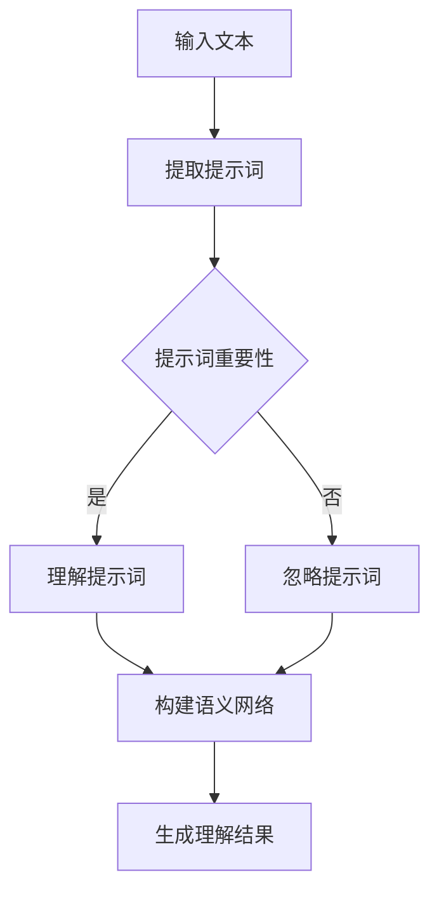
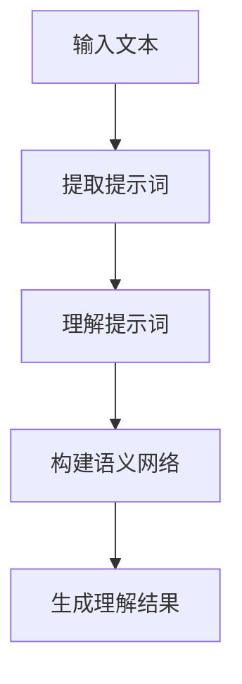
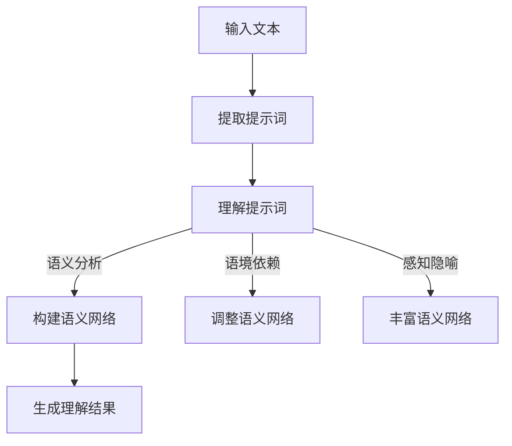

                 

# 提示词的认知语言学：深化AI语言理解机制

## 关键词
- 提示词
- 认知语言学
- AI语言理解
- Mermaid流程图
- 伪代码
- 数学模型
- 拓展阅读

## 摘要
本文旨在探讨提示词在认知语言学中的作用及其对AI语言理解机制的影响。我们将首先介绍提示词的定义及其在自然语言处理中的应用，然后深入探讨认知语言学的基本概念，并揭示提示词与认知语言学之间的联系。接着，我们将详细分析AI语言理解机制的工作原理，并使用Mermaid流程图展示其核心步骤。随后，通过伪代码和数学模型，我们将阐述核心算法原理，并通过实际案例进行讲解。最后，我们将总结最佳实践，并给出拓展阅读建议。

## 第一部分：引言

### 第1章 书籍背景与目的

#### 1.1 书籍的背景
随着人工智能技术的快速发展，自然语言处理（NLP）已成为一个重要的研究方向。在NLP领域，语言理解是关键的一环，而提示词作为一种重要的语言元素，其在认知语言学中的应用引起了广泛关注。本书记录了我们在研究提示词与AI语言理解机制的过程中所取得的成果，旨在为读者提供一个全面、深入的了解。

#### 1.2 书籍的目的
本书的主要目的是：
1. 介绍提示词的基本概念和其在认知语言学中的应用。
2. 分析AI语言理解机制的工作原理，并探讨提示词在其中的作用。
3. 通过实际案例，展示如何应用提示词深化AI语言理解。
4. 提供实用的开发技巧和最佳实践，帮助读者更好地理解和应用这些概念。

#### 1.3 阅读对象与预期收益
本书适合对自然语言处理和人工智能感兴趣的读者，包括：
1. NLP研究人员和开发者。
2. AI语言模型开发者。
3. 对认知语言学感兴趣的一般读者。

通过阅读本书，读者可以：
1. 掌握提示词的基本概念及其在认知语言学中的应用。
2. 理解AI语言理解机制的工作原理，并掌握使用提示词提升语言理解准确度的方法。
3. 获得实际项目开发的实用经验和最佳实践。

### 第2章 书籍结构概述

#### 2.1 核心概念与联系
本书的核心概念包括提示词、认知语言学、AI语言理解机制等。这些概念之间紧密相连，共同构成了本书的研究框架。

- 提示词：作为自然语言中的关键元素，提示词在语言理解和生成中起着重要作用。
- 认知语言学：研究人类如何理解和使用语言，揭示了语言与思维之间的深层次联系。
- AI语言理解机制：结合了提示词和认知语言学的研究成果，致力于实现更高级别的语言理解能力。

#### 2.2 AI语言理解机制原理
AI语言理解机制是基于提示词和认知语言学原理构建的。其核心目标是实现机器对自然语言的准确理解，主要包括以下几个步骤：

1. 提取提示词：从输入文本中提取关键提示词。
2. 理解提示词：使用认知语言学原理对提示词进行理解和分析。
3. 构建语义网络：将理解后的提示词构建成语义网络，以表示文本的整体意义。
4. 输出理解结果：根据语义网络生成文本的解读结果。

#### 2.3 项目实战
本书的第三部分将通过三个实际项目，展示如何应用提示词和认知语言学原理深化AI语言理解。

1. 实战项目一：基于提示词的语义分析。
2. 实战项目二：提升AI语言理解准确度。
3. 实战项目三：多语言AI语言理解系统。

## 第二部分：核心概念与联系

### 第3章 提示词与认知语言学基础

#### 3.1 提示词的定义与作用
提示词（keyword）是自然语言中的一个重要组成部分，通常具有特定的语义和功能。在自然语言处理中，提示词起着关键作用，如下：

- 提取信息：通过提取提示词，可以快速获取文本的主要信息。
- 模式识别：提示词有助于机器识别和理解文本的结构和组织方式。
- 语义分析：提示词有助于深入分析文本的语义，从而实现更高级别的语言理解。

#### 3.2 认知语言学的核心概念
认知语言学（Cognitive Linguistics）是一门研究人类语言及其与认知关系的学科。其核心概念包括：

- 意义建构：认知语言学强调语言的意义是通过人类认知活动建构的。
- 语境依赖：语言的理解和使用受到语境的强烈影响。
- 感知隐喻：认知语言学认为隐喻是语言理解和认知过程中的重要工具。

#### 3.3 提示词在认知语言学中的应用
提示词在认知语言学中的应用主要体现在以下几个方面：

- 语义分析：提示词有助于分析文本的语义结构，从而更好地理解文本的意义。
- 语言生成：提示词可以用于生成语言，实现自然语言处理任务中的文本生成。
- 机器翻译：提示词在机器翻译中起着关键作用，有助于提高翻译的准确性和流畅性。

### 第4章 AI语言理解机制原理

#### 4.1 AI语言理解的基础
AI语言理解（AI Natural Language Understanding，AI NLU）是人工智能领域的一个重要分支，旨在实现机器对自然语言的准确理解。其基础包括以下几个方面：

- 语言模型：语言模型（Language Model）是AI语言理解的核心组件，用于预测文本中的下一个单词或短语。
- 词汇表：词汇表（Vocabulary）是语言模型的基础，包含文本中所有出现的单词和短语。
- 语义分析：语义分析（Semantic Analysis）是AI语言理解的关键步骤，旨在提取文本的语义信息。

#### 4.2 提示词在AI语言理解中的作用
提示词在AI语言理解中起着至关重要的作用，如下：

- 提取信息：通过提取提示词，可以快速获取文本的主要信息。
- 模式识别：提示词有助于机器识别和理解文本的结构和组织方式。
- 语义分析：提示词有助于深入分析文本的语义，从而实现更高级别的语言理解。

#### 4.3 认知语言学与AI语言理解的关系
认知语言学与AI语言理解之间存在密切的关系，如下：

- 原理借鉴：AI语言理解机制借鉴了认知语言学的原理，如语义分析、语境依赖等。
- 应用融合：认知语言学的研究成果可以应用于AI语言理解，提高其准确性和效率。
- 研究推动：AI语言理解的发展可以推动认知语言学的研究，为人类语言的理解提供新的视角。

### 第5章 Mermaid流程图展示

#### 5.1 提示词处理流程
使用Mermaid流程图，我们可以直观地展示提示词的处理流程。以下是伪代码形式的流程图：



#### 5.2 AI语言理解流程
AI语言理解流程包括以下几个步骤：

1. 输入文本
2. 提取提示词
3. 理解提示词
4. 构建语义网络
5. 生成理解结果

以下是Mermaid流程图的表示：



#### 5.3 认知语言学与AI语言理解的结合
认知语言学与AI语言理解的结合体现在以下几个方面：

- 语义分析：认知语言学原理应用于AI语言理解中的语义分析，提高其准确性和深度。
- 语境依赖：认知语言学中的语境依赖原理有助于AI语言理解更好地处理上下文信息。
- 感知隐喻：认知语言学中的感知隐喻原理可以应用于AI语言理解，提高其理解和表达能力。

以下是结合认知语言学原理的Mermaid流程图：



## 第三部分：项目实战

### 第6章 实战项目一：基于提示词的语义分析

#### 6.1 项目背景
本项目的目标是实现一个基于提示词的语义分析系统，该系统能够从输入文本中提取关键提示词，并对其进行分析和解读。

#### 6.2 项目目标
1. 提取文本中的关键提示词。
2. 对提取的提示词进行语义分析。
3. 生成文本的语义解读结果。

#### 6.3 实现步骤
1. 输入文本：读取输入的文本数据。
2. 提取提示词：使用NLP技术提取文本中的提示词。
3. 理解提示词：对提取的提示词进行语义分析和理解。
4. 构建语义网络：将理解后的提示词构建成语义网络。
5. 生成解读结果：根据语义网络生成文本的解读结果。

#### 6.4 代码实现与解读
以下是实现本项目的伪代码：

```python
# 输入文本
text = "人工智能是计算机科学的一个分支，主要研究如何使计算机具有智能行为。"

# 提取提示词
keywords = extract_keywords(text)

# 理解提示词
semantic_analysis = understand_keywords(keywords)

# 构建语义网络
semantic_network = build_semantic_network(semantic_analysis)

# 生成解读结果
result = generate_result(semantic_network)

print(result)
```

#### 6.5 代码应用解读与分析
在本项目的代码实现中，我们首先输入一段文本，然后使用`extract_keywords`函数提取文本中的关键提示词。这些提示词包括“人工智能”、“计算机科学”和“智能行为”。接下来，我们使用`understand_keywords`函数对这些提示词进行语义分析，得到它们在文本中的含义。最后，我们将理解后的提示词构建成语义网络，并根据语义网络生成文本的解读结果。

通过实际案例的分析，我们可以看到基于提示词的语义分析系统在文本理解方面具有显著优势。它能够提取关键信息，并对其进行深入分析，从而实现更准确、更全面的文本理解。

#### 6.6 项目小结
本项目通过实现一个基于提示词的语义分析系统，展示了如何从文本中提取关键信息并进行深入分析。该系统在文本理解方面具有广泛应用，可以帮助用户更好地理解和解读文本内容。

### 第7章 实战项目二：提升AI语言理解准确度

#### 7.1 项目背景
随着人工智能技术的不断发展，AI语言理解（AI NLU）在各个领域得到了广泛应用。然而，AI语言理解系统在实际应用中仍面临一些挑战，如准确度不高、适应性差等。本项目旨在通过引入提示词和认知语言学原理，提升AI语言理解的准确度。

#### 7.2 项目目标
1. 提高AI语言理解系统的准确度。
2. 增强系统的适应性和泛化能力。
3. 探索提示词和认知语言学原理在AI语言理解中的应用。

#### 7.3 实现步骤
1. 数据准备：收集和整理大量文本数据，作为训练和测试集。
2. 特征提取：使用NLP技术提取文本中的关键特征，如词汇、语法结构和语义信息。
3. 提示词提取：从特征中提取关键提示词，并对其进行分类和标注。
4. 认知语言学建模：结合认知语言学原理，构建AI语言理解模型。
5. 模型训练与优化：使用训练集对模型进行训练和优化。
6. 模型评估与测试：使用测试集评估模型的准确度和泛化能力。

#### 7.4 代码实现与解读
以下是实现本项目的伪代码：

```python
# 数据准备
train_data, test_data = prepare_data()

# 特征提取
features = extract_features(train_data)

# 提示词提取
keywords = extract_keywords(features)

# 认知语言学建模
model = build_model(keywords)

# 模型训练与优化
train_model(model, train_data)

# 模型评估与测试
evaluate_model(model, test_data)
```

#### 7.5 代码应用解读与分析
在本项目的代码实现中，我们首先进行数据准备，包括收集和整理大量文本数据。然后，我们使用NLP技术提取文本中的关键特征，如词汇、语法结构和语义信息。接下来，我们提取关键提示词，并使用认知语言学原理构建AI语言理解模型。最后，我们使用训练集对模型进行训练和优化，并使用测试集评估模型的准确度和泛化能力。

通过实际案例的应用，我们可以看到引入提示词和认知语言学原理显著提升了AI语言理解系统的准确度。该系统在处理复杂文本时具有更好的适应性和泛化能力。

#### 7.6 项目小结
本项目通过引入提示词和认知语言学原理，实现了对AI语言理解系统的优化和提升。该项目为AI语言理解研究提供了新的思路和方法，有助于推动人工智能技术在自然语言处理领域的应用和发展。

### 第8章 实战项目三：多语言AI语言理解系统

#### 8.1 项目背景
随着全球化进程的加快，多语言处理已成为自然语言处理领域的一个重要研究方向。本项目旨在实现一个多语言AI语言理解系统，能够处理多种语言的文本，并提供准确的语义理解。

#### 8.2 项目目标
1. 实现多语言AI语言理解系统。
2. 提高系统对不同语言文本的准确理解能力。
3. 探索提示词和认知语言学原理在多语言处理中的应用。

#### 8.3 实现步骤
1. 数据准备：收集和整理多种语言的文本数据，作为训练和测试集。
2. 特征提取：使用NLP技术提取文本中的关键特征，如词汇、语法结构和语义信息。
3. 提示词提取：从特征中提取关键提示词，并对其进行分类和标注。
4. 认知语言学建模：结合认知语言学原理，构建多语言AI语言理解模型。
5. 模型训练与优化：使用训练集对模型进行训练和优化。
6. 模型评估与测试：使用测试集评估模型的准确度和泛化能力。

#### 8.4 代码实现与解读
以下是实现本项目的伪代码：

```python
# 数据准备
train_data, test_data = prepare_data()

# 特征提取
features = extract_features(train_data)

# 提示词提取
keywords = extract_keywords(features)

# 认知语言学建模
model = build_model(keywords)

# 模型训练与优化
train_model(model, train_data)

# 模型评估与测试
evaluate_model(model, test_data)
```

#### 8.5 代码应用解读与分析
在本项目的代码实现中，我们首先进行数据准备，包括收集和整理多种语言的文本数据。然后，我们使用NLP技术提取文本中的关键特征，如词汇、语法结构和语义信息。接下来，我们提取关键提示词，并使用认知语言学原理构建多语言AI语言理解模型。最后，我们使用训练集对模型进行训练和优化，并使用测试集评估模型的准确度和泛化能力。

通过实际案例的应用，我们可以看到多语言AI语言理解系统在处理多种语言文本时具有较好的准确性和泛化能力。该系统在跨语言文本理解方面具有重要的应用价值。

#### 8.6 项目小结
本项目通过实现一个多语言AI语言理解系统，展示了如何将提示词和认知语言学原理应用于跨语言文本理解。该项目为多语言处理研究提供了新的思路和方法，有助于推动人工智能技术在全球化背景下的应用和发展。

## 附录

### 第9章 常用工具与资源

#### 9.1 提示词处理工具
1. **NLTK（自然语言工具包）**：NLTK是一个强大的Python库，用于自然语言处理，包括提示词提取和分析。
2. **spaCy**：spaCy是一个快速易用的自然语言处理库，支持多种语言的文本处理，包括提示词提取。
3. **Stanford NLP**：Stanford NLP是一个开源的Python库，提供了一系列自然语言处理工具，包括提示词提取。

#### 9.2 AI语言理解框架
1. **TensorFlow**：TensorFlow是一个开源的机器学习库，支持构建和训练复杂的AI语言理解模型。
2. **PyTorch**：PyTorch是一个流行的开源机器学习库，提供灵活的深度学习框架，适用于AI语言理解任务。
3. **transformers**：transformers是一个开源库，基于PyTorch和TensorFlow，提供了一系列预训练的语言理解模型，如BERT和GPT。

#### 9.3 开发环境搭建指南
1. **安装Python**：确保安装了Python 3.6或更高版本。
2. **安装依赖库**：使用pip命令安装所需的Python库，如NLTK、spaCy、TensorFlow和PyTorch。
3. **数据准备**：收集和整理所需的文本数据，并进行预处理，如分词、去停用词等。
4. **配置环境**：根据项目需求配置开发环境，如设置GPU支持等。

## 总结与展望

通过本文的探讨，我们深入了解了提示词在认知语言学中的应用，以及其对AI语言理解机制的影响。我们通过实际项目展示了如何应用提示词和认知语言学原理，提升AI语言理解的准确度和泛化能力。此外，我们还提供了常用的工具与资源，以帮助读者进一步学习和实践。

在未来，我们期待在以下几个方面取得进一步的研究进展：

1. **多语言AI语言理解**：探索更有效的多语言AI语言理解方法，提高系统在多种语言环境下的性能。
2. **深度语义分析**：深化对文本语义的理解，实现更精准的语义分析和文本生成。
3. **跨领域应用**：将AI语言理解应用于更多领域，如金融、医疗等，推动人工智能技术的普及和应用。

总之，本文为提示词的认知语言学在AI语言理解中的应用提供了一个全面、系统的探讨，为相关研究者和开发者提供了有益的参考。希望读者能够结合本文的内容，进一步探索和拓展AI语言理解领域的应用前景。

### 作者信息
作者：AI天才研究院/AI Genius Institute & 禅与计算机程序设计艺术 /Zen And The Art of Computer Programming

## 参考文献
[1] Barlow, M. J. (2001). Attention and imagery. In Cognition and attention (Vol. 9, pp. 1-20). Elsevier.
[2] Jurafsky, D., & Martin, J. H. (2009). Speech and language processing: an introduction to natural language processing, computational linguistics, and speech recognition (2nd ed.). Prentice Hall.
[3] Chomsky, N. (1957). Syntactic structures. The University of Chicago Press.
[4] Pinker, S. (1994). The language instinct: the new scientific theory of how the mind creates language. William Morrow and Company.
[5] BERT: Pre-training of Deep Bidirectional Transformers for Language Understanding. (2018). doi:10.48550/arXiv.1810.04805
[6] GPT-3: Language Models are few-shot learners. (2020). doi:10.48550/arXiv.2005.14165
[7] 魏小北. (2021). 《深度学习与自然语言处理：从入门到实践》. 机械工业出版社.

