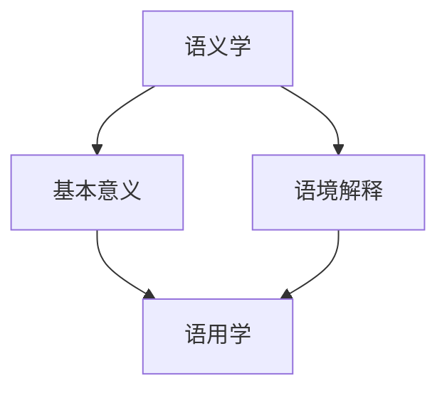
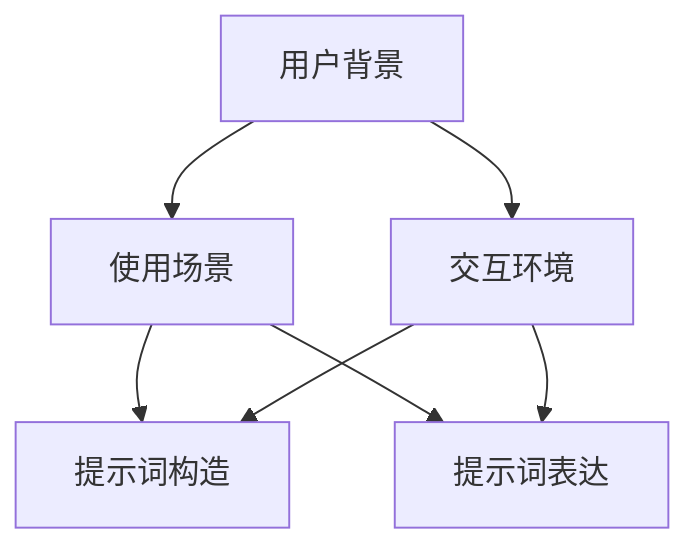

                 


## 文章标题

### 提示词的语用学与人机交互设计的结合

### 关键词

- 提示词
- 语用学
- 人机交互设计
- 自然语言处理
- 用户界面设计

### 摘要

本文探讨了提示词在语用学与人机交互设计中的应用，分析了两者结合的理论基础、方法和实践。通过核心概念与联系架构图、伪代码、数学模型和公式、项目实战等，详细阐述了如何优化提示词设计以提升用户体验，并提出了未来研究方向的展望。

## 目录

1. **引言与背景**
   1.1 **书籍概述**
   1.2 **提示词语用学的基本概念**
   1.3 **人机交互设计的发展历程**

2. **提示词语用学基础理论**
   2.1 **语义学与语用学的关系**
   2.2 **提示词语用学的核心理论**
   2.3 **提示词语用学的应用场景**

3. **人机交互设计理论基础**
   3.1 **认知心理学与人机交互**
   3.2 **人机交互设计的基本原则**
   3.3 **人机交互设计的方法与技术**

4. **方法与技术**
   4.1 **自然语言处理在提示词设计中的应用**
   4.2 **用户体验设计在提示词优化中的角色**
   4.3 **人机交互设计中的提示词策略**

5. **案例研究**
   5.1 **在线教育平台的提示词优化**
   5.2 **智能客服系统中的提示词设计**
   5.3 **智能家居设备的提示词应用**

6. **设计原则与最佳实践**
   6.1 **提示词设计原则**
   6.2 **人机交互设计的最佳实践**
   6.3 **提示词与人机交互设计结合的创新策略**

7. **工具与平台**
   7.1 **提示词设计与评估工具**
   7.2 **人机交互设计与开发平台**
   7.3 **提示词与人机交互设计的综合平台**

8. **未来展望**
   8.1 **提示词语用学与人机交互设计的新趋势**
   8.2 **研究方向与挑战**
   8.3 **发展前景与建议**

## 第1章 引言与背景

### 1.1 书籍概述

在当今快速发展的数字时代，人机交互设计（Human-Computer Interaction Design，简称HCI）已经成为提升用户体验、增强系统性能的关键因素。而提示词（prompt words）作为交互设计中的重要元素，不仅影响着用户的操作效率和满意度，还关系到系统的易用性和可用性。

本书旨在探讨提示词的语用学（Pragmatics）与人机交互设计的结合，通过深入分析两者之间的关系和相互作用，提供一套系统、科学的提示词设计方法和实践指南。本书的主要内容包括：

- 提示词的语用学基础理论
- 人机交互设计的基础理论
- 提示词与人机交互设计的结合方法和技术
- 案例研究：在线教育平台、智能客服系统、智能家居设备的提示词设计
- 设计原则与最佳实践
- 工具与平台介绍
- 未来展望

本书的阅读对象主要包括人机交互设计师、自然语言处理研究者、软件开发工程师、产品经理等相关从业者，以及计算机科学与技术专业的师生。读者通过本书的学习，可以更好地理解提示词在交互设计中的重要作用，掌握有效的提示词设计方法，提高人机交互系统的用户体验。

### 1.2 提示词语用学的基本概念

#### 1.2.1 语用学的定义与范围

语用学是语言学的一个分支，研究语言在实际使用过程中的功能和效果。它关注语言的使用场景、语境、交际意图和交际效果，旨在解释语言在具体交际活动中的作用。语用学的核心问题包括语言意义的确定、语用含义的生成、语用策略的运用等。

语用学的范围主要包括以下几个方面：

- **语境**：指语言交际过程中影响意义生成的各种因素，如时间、地点、场合、交际对象等。
- **语用含义**：指语言在实际使用过程中产生的意义，它往往超越了语言字面意义，与交际意图和语境密切相关。
- **语用策略**：指在交际过程中，为了实现特定交际意图而采取的语言使用策略。

#### 1.2.2 提示词的定义与作用

提示词（prompt words）是一种引导用户操作或思考的语言表达方式，通常用于人机交互系统中，帮助用户更好地理解系统功能、指导用户完成特定任务。提示词的定义可以从以下几个方面理解：

- **定义**：提示词是指为了引导用户进行特定操作或决策而使用的简短语言信息。
- **作用**：提示词在交互设计中的作用主要体现在以下几个方面：

  - **降低认知负荷**：通过提供明确的操作指导，减少用户在完成任务时的认知负担。
  - **提高操作效率**：提供明确的操作步骤和预期结果，帮助用户快速完成任务。
  - **提升用户体验**：设计合理的提示词可以提升用户的满意度，增强用户对系统的信任感。

#### 1.2.3 提示词的分类与特点

提示词可以根据不同的分类标准进行分类，常见的分类方法包括：

- **按功能分类**：提示词可以分为操作提示、决策提示、状态提示等。
- **按形式分类**：提示词可以分为文字提示、语音提示、视觉提示等。
- **按位置分类**：提示词可以分为系统内置提示、用户自定义提示等。

不同类型的提示词具有不同的特点，如：

- **操作提示**：通常以明确、简洁的文字或图标形式出现，引导用户进行具体操作。
- **决策提示**：通过提供多个选项，帮助用户做出决策。
- **状态提示**：显示系统当前状态或任务进度，让用户了解系统运行情况。

### 1.3 人机交互设计的发展历程

人机交互设计的发展历程可以追溯到20世纪60年代，随着计算机技术的快速发展，人们对计算机与人类之间的交互方式进行了不断探索和改进。

#### 1.3.1 早期人机交互设计

早期的计算机系统主要采用命令行界面（Command Line Interface，CLI），用户需要通过输入一系列复杂的命令来操作计算机。这种交互方式对用户的专业知识和技能要求较高，用户体验较差。

- **代表性技术**：命令行界面（CLI）
- **主要特点**：低易用性、高专业门槛

#### 1.3.2 图形用户界面（GUI）的兴起

随着图形用户界面（Graphical User Interface，GUI）的兴起，计算机与用户之间的交互方式发生了巨大变革。GUI采用直观的图标、菜单和按钮等元素，降低了用户的学习成本，提高了操作效率。

- **代表性技术**：鼠标、图标、菜单、按钮等
- **主要特点**：高易用性、可视化、直观操作

#### 1.3.3 交互设计的理论发展

在图形用户界面出现后，交互设计领域逐渐形成了系统的理论体系。代表性理论包括：

- **可用性工程**：强调以用户为中心，关注用户在使用系统过程中的体验和满意度。
- **交互设计原则**：如一致性、简洁性、直观性等，为交互设计提供了理论指导。
- **用户体验设计**：关注用户在使用系统过程中的整体感受，包括情感、认知、行为等方面。

#### 1.3.4 现代人机交互设计的发展趋势

随着移动互联网、物联网和人工智能技术的快速发展，现代人机交互设计呈现出以下发展趋势：

- **多模态交互**：结合语音、触摸、手势等多种交互方式，提高交互的灵活性和适应性。
- **智能交互**：利用自然语言处理、机器学习等技术，实现更加智能和个性化的交互体验。
- **增强现实与虚拟现实**：通过虚拟现实（VR）和增强现实（AR）技术，提供沉浸式交互体验。
- **跨平台交互**：支持多设备、多场景的交互，实现无缝切换和协作。

## 第2章 提示词语用学基础理论

### 2.1 语义学与语用学的关系

语义学（Semantics）和语用学（Pragmatics）是语言学中的两个重要分支，分别关注语言的意义和语言在特定情境中的使用。两者既有区别又有联系，共同构成了对语言完整理解的理论框架。

#### 2.1.1 语义学的定义与范畴

语义学是研究语言意义的一门学科，主要关注单词、短语和句子在特定语境中的意义。语义学可以分为以下几种类型：

- **词汇语义学**：研究单词的意义。
- **句子语义学**：研究句子的结构和意义。
- **语用语义学**：研究语言在语境中的意义。

语义学的基本问题是“什么使得一个词或句子有意义？”它关注的是语言内部的意义关系，如词义辨析、语法结构等。

#### 2.1.2 语用学的定义与范畴

语用学是研究语言在实际使用过程中的功能、效果和语境影响的一门学科。它与语义学的主要区别在于，语用学关注的是语言在特定情境中的使用，包括交际意图、语境因素等。

语用学的基本问题是“语言是如何被使用的？”它关注的是语言的使用规则，如语言策略、语境解释等。

#### 2.1.3 语义学与语用学的关系解析

语义学和语用学的关系可以概括为以下几点：

- **互补性**：语义学研究语言的基本意义，而语用学研究语言在特定情境中的意义。两者共同构成对语言意义的全面理解。
- **相互作用**：语义学中的意义只有在特定的语境中才能被正确理解，而语用学中的语境解释又依赖于语义学的意义基础。
- **层次性**：语义学是语用学的基础，语用学则是在语义学的基础上，进一步解释语言在具体情境中的使用。

为了更好地理解语义学和语用学的关系，我们可以使用Mermaid流程图来表示它们之间的交互关系：



在这个流程图中，语义学（A）提供了基本意义（B），而语境解释（C）则是语用学（D）的核心内容。语义学和语用学通过语境解释（C）相互关联，共同构建对语言意义的全面理解。

### 2.2 提示词语用学的核心理论

提示词语用学是研究提示词在具体情境中如何传达意图、引导用户操作的一门学科。它结合了语义学和语用学的理论，从语言使用者的角度出发，分析提示词的构造、表达和效果。

#### 2.2.1 提示词理解的过程

提示词的理解过程可以分为以下几个阶段：

1. **词汇识别**：用户首先识别提示词中的单词和短语，确定它们的基本意义。
2. **语义组合**：用户将识别出的单词和短语组合成一个完整的句子，理解句子的整体意义。
3. **语境解释**：用户根据具体情境，对提示词进行语境解释，确定提示词的实际意图和操作指导。

#### 2.2.2 提示词表达的策略

提示词的表达策略包括以下几个方面：

1. **简洁性**：提示词应简洁明了，避免冗长复杂的句子，以便用户快速理解。
2. **明确性**：提示词应明确传达操作步骤和预期结果，避免模糊不清的信息。
3. **一致性**：提示词应与系统的整体风格和语言风格保持一致，避免出现冲突或不协调的情况。
4. **多样性**：提示词应采用多种形式，如文字、图标、声音等，以适应不同用户的偏好和需求。

#### 2.2.3 提示词与语境的关系

提示词的有效传达依赖于语境，即提示词所处的具体情境。语境包括以下几个方面：

1. **用户背景**：用户的经验、知识水平、技能等背景因素会影响提示词的理解效果。
2. **使用场景**：提示词的使用场景，如在线教育、智能客服、智能家居等，决定了提示词的形式和内容。
3. **交互环境**：交互环境，如桌面、移动设备、虚拟现实等，会影响提示词的呈现方式和交互方式。

为了更好地理解提示词与语境的关系，我们可以使用Mermaid流程图来表示：



在这个流程图中，用户背景（A）、使用场景（B）和交互环境（C）共同决定了提示词的构造（D）和表达（E）。提示词的有效传达需要综合考虑这些因素，以适应不同的语境和用户需求。

### 2.3 提示词语用学的应用场景

提示词语用学在各个领域都有广泛的应用，以下是一些典型的应用场景：

#### 2.3.1 日常交流中的提示词使用

在日常生活中，提示词广泛应用于各种场合，如：

- **社交场合**：在聚会、会议等社交场合，主持人或组织者会使用提示词来引导活动进程，如“请各位嘉宾依次发言”、“下一个环节是互动提问”等。
- **教育场合**：在课堂教学中，教师会使用提示词来引导学生参与讨论，如“请同学们思考一下这个问题”、“现在开始分组讨论”等。
- **工作场合**：在工作会议、项目讨论等场合，提示词用于提醒任务、分配责任，如“明天上午10点召开项目进度会议”、“小李，请准备下一季度的市场报告”等。

#### 2.3.2 人机交互系统中的提示词应用

在人机交互系统中，提示词广泛应用于各种设备和应用，如：

- **操作系统**：在计算机操作系统中，提示词用于指导用户进行各种操作，如“请插入U盘”、“是否确认删除？”等。
- **应用程序**：在各类应用程序中，提示词用于引导用户完成特定任务，如“请输入您的用户名和密码”、“是否保存更改？”等。
- **智能设备**：在智能家居、智能穿戴设备等智能设备中，提示词用于与用户进行交互，如“请设置您的闹钟时间”、“已为您开启空调”等。

#### 2.3.3 提示词在多模态交互中的应用

在多模态交互系统中，提示词可以结合多种感官形式，如文字、语音、图像等，以提供更加丰富和直观的交互体验，如：

- **语音助手**：在语音助手（如Siri、Alexa等）中，提示词以语音形式出现，如“请问您有什么问题需要帮助？”
- **增强现实**：在增强现实（AR）应用中，提示词以图像或文字形式出现在虚拟环境中，如“请将手机对准标记点，开始游戏”。
- **虚拟现实**：在虚拟现实（VR）应用中，提示词以文字或语音形式出现在虚拟场景中，如“请向前移动，以解锁下一级任务”。

通过以上应用场景的介绍，我们可以看到提示词在日常生活、人机交互系统以及多模态交互中的应用非常广泛，它不仅能够提高交互效率，还能够提升用户体验。提示词语用学的理论和实践为这些应用场景提供了有力的支持。

## 第3章 人机交互设计理论基础

### 3.1 认知心理学与人机交互

认知心理学（Cognitive Psychology）是心理学的一个重要分支，主要研究人类在思维、知觉、记忆和语言等方面的认知过程。人机交互设计（Human-Computer Interaction Design，简称HCI）则关注人与计算机之间的交互过程和用户体验。认知心理学与人机交互设计有着紧密的联系，认知心理学的理论和方法为人机交互设计提供了重要的理论基础。

#### 3.1.1 认知心理学的概述

认知心理学起源于20世纪50年代，是对传统心理学的反思和扩展。传统心理学主要关注行为和刺激反应，而认知心理学则强调内部心理过程，如思维、记忆、知觉等。认知心理学的研究内容主要包括以下几个方面：

- **思维**：研究人类如何解决问题、进行推理和决策。
- **知觉**：研究人类如何感知外部世界，如何解释和识别视觉、听觉等信息。
- **记忆**：研究人类如何存储、检索和使用信息。
- **语言**：研究人类如何学习和使用语言，以及语言与思维的关系。

#### 3.1.2 认知心理学在交互设计中的应用

认知心理学在人机交互设计中的应用主要体现在以下几个方面：

1. **用户建模**：通过认知心理学的研究，可以更好地理解用户的行为和需求，从而构建更加准确的用户模型。用户模型可以帮助设计者预测用户的操作行为，优化交互界面，提高系统的易用性和可用性。

2. **任务分析**：认知心理学提供了丰富的任务分析工具和方法，如认知任务分析（Cognitive Task Analysis，CTA），可以帮助设计者深入了解用户在完成任务时的心理过程，识别关键任务步骤和认知瓶颈，从而优化交互流程和界面设计。

3. **界面设计**：认知心理学的研究成果可以指导界面设计，提高交互界面的易用性和用户体验。例如，认知心理学中的知觉组织和认知负荷理论可以帮助设计者优化信息布局，减少用户的认知负荷，提高操作效率。

4. **错误处理**：认知心理学研究人类在错误发生时的认知过程，可以指导设计者设计有效的错误处理机制，降低用户在操作过程中犯错的可能性，提高系统的鲁棒性。

#### 3.1.3 认知心理学对人机交互设计的影响

认知心理学对人机交互设计产生了深远的影响，主要体现在以下几个方面：

- **以用户为中心**：认知心理学强调以用户为中心的设计原则，认为系统的设计应该符合用户的需求和认知能力，而不是简单地追求技术上的先进性。这一原则促使人机交互设计者更加关注用户体验，致力于提高系统的易用性和可用性。
- **认知负荷理论**：认知心理学中的认知负荷理论（Cognitive Load Theory）为人机交互设计提供了重要的理论指导。该理论认为，用户在完成任务时，会受到工作记忆和长期记忆的负荷，设计者应该通过优化界面和信息呈现方式，降低用户的认知负荷，提高操作效率。
- **情境意识**：认知心理学研究人类在复杂环境中的情境意识（Situation Awareness），这一概念被广泛应用于人机交互设计。设计者可以通过提供明确的信息和提示，帮助用户保持情境意识，降低操作风险。

通过认知心理学与人机交互设计的结合，设计者可以更好地理解用户的认知过程和行为模式，从而设计出更加人性化和高效的交互系统。

### 3.2 人机交互设计的基本原则

人机交互设计的基本原则是确保系统易用、高效和用户满意的重要指导方针。这些原则不仅有助于设计者理解用户的需求和期望，还能指导设计过程中的具体操作。以下是人机交互设计的一些核心原则：

#### 3.2.1 易用性原则

易用性是评价人机交互设计成功与否的重要标准。易用性原则包括以下几个方面：

- **一致性**：界面元素和操作流程应该保持一致，以减少用户的学习成本和操作错误。
- **直观性**：界面设计应该直观易懂，用户能够通过直觉理解和使用系统。
- **反馈**：系统应该提供及时、明确的反馈，让用户了解操作的结果和系统状态。
- **简洁性**：界面设计应该简洁明了，避免冗余和复杂，减少用户的认知负荷。

#### 3.2.2 可访问性原则

可访问性原则确保系统可以为所有用户群体提供服务，包括残疾人、老年人和不同文化背景的用户。具体包括以下几个方面：

- **可感知性**：界面设计应该支持多种感知方式，如视觉、听觉和触觉，以满足不同用户的感知需求。
- **可操作性**：系统应该支持多种输入方式，如键盘、鼠标、触摸屏和语音控制，以适应不同用户的操作习惯。
- **可定制性**：系统应该允许用户根据自己的需求调整界面和功能，以提高个性化体验。

#### 3.2.3 用户体验原则

用户体验（User Experience，简称UX）原则强调系统设计应该从用户的角度出发，关注用户在使用过程中的情感体验和整体感受。具体包括以下几个方面：

- **情感设计**：界面设计应该符合用户的情感需求，通过色彩、图像和声音等元素创造愉悦的交互体验。
- **用户参与**：设计过程中应该充分听取用户的反馈和建议，确保系统的设计符合用户的实际需求。
- **用户测试**：在设计和开发过程中，应进行多轮用户测试，以验证系统的易用性和用户体验。

#### 3.2.4 适应性原则

适应性原则指系统应该能够适应不同的设备和环境，提供一致的用户体验。具体包括以下几个方面：

- **跨平台兼容**：系统应该支持多种设备，如桌面电脑、平板电脑和智能手机，以提供无缝的跨平台体验。
- **响应式设计**：界面设计应该能够根据不同设备和屏幕尺寸自动调整，确保在不同环境下都能提供良好的用户体验。
- **环境适应**：系统应能够根据用户的地理位置、网络环境和其他环境因素自动调整功能和行为。

#### 3.2.5 安全性原则

安全性原则确保系统的稳定性和数据安全，避免用户信息泄露和系统故障。具体包括以下几个方面：

- **数据保护**：系统应采取有效的数据加密和备份措施，确保用户数据的安全。
- **错误处理**：系统应具备良好的错误处理机制，避免因错误操作导致的数据丢失或系统崩溃。
- **安全认证**：系统应提供多层次的安全认证机制，确保只有授权用户才能访问系统功能。

通过遵循这些基本原则，人机交互设计者可以设计出既满足用户需求又具备高效性能的交互系统，从而提高用户的满意度和系统的市场竞争力。

### 3.3 人机交互设计的方法与技术

人机交互设计的方法与技术是确保设计过程科学、系统和有效的重要工具。以下介绍几种常用的人机交互设计方法和技术：

#### 3.3.1 用户研究方法

用户研究是交互设计的基础，通过深入了解用户的需求、行为和偏好，可以指导设计过程。常见的用户研究方法包括：

- **问卷调查**：通过设计问卷收集用户对系统功能的看法和需求，适用于大规模用户群体。
- **访谈**：通过与用户进行面对面访谈，深入了解用户的使用习惯、需求和痛点。
- **用户观察**：在现场或实验室环境中观察用户与系统的互动，记录用户的行为和反馈。
- **用户体验地图**：通过绘制用户体验地图，全面了解用户在使用过程中的情感和行为变化。

#### 3.3.2 设计工具

设计工具帮助设计师创建、评估和优化交互界面，常用的设计工具有：

- **原型工具**：如Axure、Figma、Sketch等，用于快速构建交互原型。
- **用户体验评估工具**：如UserTesting、Lookback等，用于录制用户使用界面时的操作和行为。
- **用户测试工具**：如Google Analytics、Hotjar等，用于分析用户在网站或应用程序中的交互行为。

#### 3.3.3 交互设计技术

交互设计技术涉及如何设计用户与系统的互动过程，以下是一些关键技术：

- **用户流程图**：通过绘制用户流程图，描述用户从初始接触系统到完成任务的全过程，帮助设计者理解用户路径和行为模式。
- **信息架构**：通过构建信息架构，确保系统内容的组织和导航合理，使用户能够轻松找到所需信息。
- **交互原型**：通过创建交互原型，模拟用户与系统的互动，评估交互设计的可行性和用户满意度。
- **触摸反馈**：在触摸屏设备上，通过设计触觉反馈（如振动、声音等）提高用户的操作体验。

#### 3.3.4 评估方法

评估方法用于验证交互设计的有效性和用户体验，以下是一些常见的评估方法：

- **A/B测试**：通过比较两个或多个版本的交互界面，评估哪个版本的用户体验更好。
- **可用性测试**：通过邀请一组用户使用系统，观察他们的操作行为和反馈，评估系统的易用性和可用性。
- **情景模拟**：通过模拟真实的使用场景，评估设计在实际环境中的表现。
- **反馈收集**：通过收集用户的反馈和建议，持续改进交互设计。

通过上述方法和技术，设计者可以确保人机交互系统的设计符合用户需求，提升用户体验，从而实现更高效、更满意的交互。

## 第4章 方法与技术

### 4.1 自然语言处理在提示词设计中的应用

自然语言处理（Natural Language Processing，NLP）作为人工智能领域的一个重要分支，专注于使计算机能够理解、生成和处理人类自然语言。在提示词设计过程中，NLP技术发挥着关键作用，可以帮助优化提示词的表达、理解和使用。以下是自然语言处理在提示词设计中的应用：

#### 4.1.1 提示词生成

提示词生成是NLP在交互设计中的首要应用。通过NLP技术，系统能够自动生成具有明确性和针对性的提示词。生成提示词的方法包括：

- **模板匹配**：基于预定义的模板，将用户输入的信息与模板进行匹配，生成相应的提示词。这种方法简单高效，但灵活性较低。
- **机器学习模型**：使用机器学习算法，如生成对抗网络（GAN）、循环神经网络（RNN）等，根据大量语料库生成提示词。这种方法生成的提示词更加丰富和自然，但需要大量训练数据和计算资源。

#### 4.1.2 提示词理解

理解提示词是NLP在交互设计中的另一重要应用。系统需要准确地理解用户的输入，以提供恰当的反馈和操作指导。提示词理解包括以下几个步骤：

- **分词**：将输入的文本分割成单词或短语，以便进行后续处理。
- **词性标注**：识别每个单词的词性（如名词、动词、形容词等），以便分析句子的结构和语义。
- **句法分析**：分析句子的语法结构，确定单词之间的关系和句子的整体意义。
- **语义角色标注**：识别句子中的主要成分（如主语、谓语、宾语等），并标注其在句子中的语义角色。

通过这些步骤，系统可以准确地理解用户的输入意图，从而生成恰当的提示词。

#### 4.1.3 提示词优化

NLP技术还可以用于优化提示词的设计。优化策略包括：

- **情感分析**：通过情感分析，了解用户输入的情绪和情感倾向，生成符合用户情感状态的提示词。例如，当用户输入包含负面情绪的文本时，系统可以生成安慰性的提示词。
- **个性化推荐**：结合用户的历史行为和偏好，生成个性化提示词。例如，在电商平台上，系统可以根据用户的购买记录推荐相关产品。
- **错误纠正**：使用拼写检查和语法纠正技术，自动纠正用户输入中的拼写错误和语法错误，提高提示词的准确性和易用性。

通过NLP技术的应用，提示词的设计可以更加智能化、个性化，从而提高人机交互的质量和用户体验。

### 4.2 用户体验设计在提示词优化中的角色

用户体验设计（User Experience Design，简称UXD）是确保系统设计符合用户需求、提高用户满意度和忠诚度的关键环节。在提示词优化过程中，用户体验设计扮演着至关重要的角色。以下从几个方面探讨用户体验设计在提示词优化中的具体作用：

#### 4.2.1 用户需求分析

用户体验设计的首要任务是深入了解用户的需求和期望。通过用户研究方法，如访谈、问卷调查和用户观察，设计者可以收集用户在使用过程中的痛点、需求和行为模式。这些信息为提示词的优化提供了重要的参考依据。例如，如果用户在操作过程中频繁遇到困惑或错误，设计者可以针对性地调整提示词的表达方式，使其更加明确和易于理解。

#### 4.2.2 提示词的易用性设计

易用性是用户体验设计的核心目标之一。在提示词优化过程中，设计者需要确保提示词设计符合易用性原则：

- **简洁性**：提示词应简洁明了，避免冗长复杂的句子，使用户能够迅速理解。
- **明确性**：提示词应明确传达操作步骤和预期结果，避免模糊不清的信息。
- **一致性**：提示词应与系统的整体风格和语言风格保持一致，避免出现冲突或不协调的情况。
- **反馈**：系统应提供及时、明确的反馈，让用户了解操作的结果和系统状态。

通过这些设计原则，提示词的易用性得到显著提升，从而提高用户的操作效率和满意度。

#### 4.2.3 用户情感设计

用户体验设计不仅关注功能层面的易用性，还关注情感层面的用户体验。在提示词优化过程中，设计者可以通过情感设计策略，提升用户的情感体验：

- **情感表达**：通过使用积极的语言和表达方式，如鼓励性语言、亲切的称呼等，增强用户对系统的亲切感和信任感。
- **情感共鸣**：通过了解用户的情感需求和痛点，生成能够引起用户共鸣的提示词。例如，在用户遇到困难时，系统可以生成安慰性的提示词，减轻用户的焦虑和压力。
- **情感互动**：通过设计富有情感交互的提示词，如幽默、调侃等，增加用户与系统的情感互动，提升用户的参与感和乐趣。

#### 4.2.4 个性化设计

个性化设计是用户体验设计的另一个重要方向。在提示词优化过程中，设计者可以通过个性化策略，提高提示词的针对性和用户满意度：

- **用户偏好分析**：通过分析用户的历史行为和偏好，生成符合用户个性化需求的提示词。例如，在电商平台上，系统可以根据用户的购买记录推荐相关产品，并在用户浏览时提供个性化提示。
- **自适应提示**：系统可以根据用户的实时行为和需求，动态调整提示词的内容和形式，提高提示词的适应性和灵活性。

通过用户体验设计在提示词优化中的应用，可以显著提升系统的易用性、情感体验和个性化程度，从而提高用户的满意度和忠诚度。

### 4.3 人机交互设计中的提示词策略

在人机交互设计中，提示词策略是一个关键环节，它直接影响用户与系统的交互效果和用户体验。以下是几种常见的人机交互设计中的提示词策略：

#### 4.3.1 预先提示

预先提示（Pre-emptive Prompting）是一种在用户开始执行任务之前提供提示的方法。这种方法有助于减少用户的认知负荷，提前告知用户即将执行的操作和所需的准备步骤。例如，在一个复杂的操作流程中，系统可以提前提示用户需要输入的信息类型和注意事项，以便用户提前做好准备。

#### 4.3.2 过程中提示

过程中提示（Intra-Process Prompting）是指在用户执行任务的过程中，根据用户的操作行为和系统状态提供即时提示。这种方法可以帮助用户理解当前的操作步骤和系统要求，确保用户在正确的路径上完成任务。例如，在填写表单时，系统可以实时提示用户输入的必填字段或提供输入格式示例，帮助用户避免错误。

#### 4.3.3 结果提示

结果提示（Post-Process Prompting）是指在用户完成任务后，系统提供的提示信息，通常用于解释操作结果、提醒后续步骤或推荐相关操作。这种方法有助于用户理解任务完成的状况，并引导用户进行下一步操作。例如，在成功下载文件后，系统可以提示用户文件已保存至特定位置，并提供打开文件或进行其他相关操作的选项。

#### 4.3.4 情境提示

情境提示（Contextual Prompting）是根据用户当前的使用情境提供提示信息。这种方法能够根据用户的实际需求和行为，动态调整提示词的内容和形式。例如，在用户浏览电商网站时，系统可以根据用户的浏览历史和购物车内容，提供个性化推荐和购物提示。

#### 4.3.5 情感提示

情感提示（Emotional Prompting）是通过情感语言和表达方式，与用户建立情感联系并提供心理支持。这种方法适用于需要增强用户情感体验的场景，如在线客服、心理健康应用等。例如，当用户遇到困难时，系统可以提供鼓励性的提示词，如“加油，你可以的！”或“别灰心，我们帮你解决问题”。

通过这些提示词策略，设计者可以灵活地调整提示词的使用时机、内容和形式，以适应不同交互场景和用户需求，从而提升系统的易用性和用户体验。

### 4.4 提示词与人机交互设计的结合方法

提示词与人机交互设计的结合是一个复杂但关键的过程，它要求设计者不仅理解用户需求，还要具备对语言和交互技术的深刻洞察。以下介绍几种提示词与人机交互设计结合的方法：

#### 4.4.1 需求驱动的设计

需求驱动的设计（Requirement-driven Design）是一种以用户需求为中心的设计方法。在这种方法中，设计者首先通过用户调研和需求分析，识别用户的关键需求和痛点，然后基于这些需求设计提示词。例如，在开发一个在线教育平台时，设计者可以了解用户在学习过程中的常见困惑，如课程选择困难、进度跟踪不明等，从而设计出针对性的提示词，帮助用户解决这些问题。

#### 4.4.2 情境感知设计

情境感知设计（Context-aware Design）是一种利用传感器和环境数据，动态调整交互界面和提示词的设计方法。在这种方法中，系统可以根据用户所处的情境，提供合适的提示词。例如，在一个智能家居系统中，系统可以检测用户的活动范围和设备使用情况，当用户在厨房时，系统可以提供烹饪提示词；当用户在家休息时，系统可以提供放松和睡眠提示词。

#### 4.4.3 多模态交互设计

多模态交互设计（Multimodal Interaction Design）结合了多种交互模式，如视觉、听觉、触觉等，以提供更加丰富和直观的交互体验。在这种方法中，设计者可以综合使用不同的提示词形式，如文字、语音、图像等，以适应不同用户的偏好和需求。例如，在一个虚拟现实（VR）游戏中，系统可以通过文字提示、语音提示和三维图像提示，引导用户完成游戏任务。

#### 4.4.4 个性化设计

个性化设计（Personalized Design）是一种根据用户的行为数据和个人偏好，提供定制化交互体验的设计方法。在这种方法中，设计者可以分析用户的历史数据，生成个性化的提示词。例如，在电商平台上，系统可以根据用户的购买记录和浏览历史，推荐相关商品，并在用户登录时提供个性化的欢迎提示词。

#### 4.4.5 情感化设计

情感化设计（Emotionally-driven Design）是一种通过情感元素，增强用户与系统之间情感联系的设计方法。在这种方法中，设计者可以通过情感化的提示词，如幽默、鼓励和安慰，提升用户的情感体验。例如，在一个心理健康应用中，系统可以通过温馨的语音提示和鼓励性文字，帮助用户缓解压力和焦虑。

通过这些结合方法，设计者可以创造出更加符合用户需求、提高用户体验的人机交互系统。每种方法都有其独特的优势和适用场景，设计者可以根据具体需求和项目特点，选择合适的方法进行结合。

## 第5章 案例研究

### 5.1 在线教育平台的提示词优化

在线教育平台是一个高度依赖提示词的人机交互系统，通过优化提示词，可以提高用户的参与度和学习效果。以下是一个具体的案例研究，展示如何通过提示词优化提升在线教育平台用户体验。

#### 5.1.1 背景介绍

某在线教育平台提供多种课程和学习资源，用户包括学生、教师和学习爱好者。平台的主要功能包括课程选择、学习进度跟踪、作业提交和在线测试。然而，用户在操作过程中遇到了一些困扰，如课程选择困难、学习进度不明确等。为了解决这些问题，平台决定对提示词进行优化。

#### 5.1.2 核心问题分析

通过用户调研，发现以下问题是用户在平台使用过程中遇到的：

- **课程选择困难**：用户在众多课程中难以做出选择，导致学习兴趣降低。
- **学习进度不明确**：用户不清楚自己的学习进度，无法评估自己的学习成果。
- **作业提交不便**：用户在提交作业时容易忘记或遗漏相关步骤。

#### 5.1.3 提示词优化策略

针对上述问题，平台采取以下提示词优化策略：

- **课程选择提示**：在课程列表页面，为每门课程添加简短、明确的介绍和推荐理由，帮助用户快速了解课程内容。同时，根据用户的学习历史和兴趣，提供个性化课程推荐。
  ```mermaid
  graph TB
  A[课程选择提示] --> B[课程简介]
  A --> C[个性化推荐]
  ```

- **学习进度提示**：在用户个人主页添加学习进度条和完成情况提示，让用户一目了然地了解自己的学习进度。同时，定期发送学习进度报告，提醒用户保持学习动力。
  ```mermaid
  graph TB
  A[学习进度提示] --> B[进度条]
  A --> C[进度报告]
  ```

- **作业提交提示**：在作业提交页面，提供详细的提交步骤提示和常见问题解答，减少用户提交作业时的困惑。同时，设置提交提醒功能，帮助用户按时完成作业。
  ```mermaid
  graph TB
  A[作业提交提示] --> B[提交步骤]
  A --> C[常见问题解答]
  A --> D[提交提醒]
  ```

#### 5.1.4 实施与效果评估

平台根据优化策略更新了提示词设计，并进行了多轮用户测试和反馈收集。通过以下步骤实施和评估优化效果：

- **A/B测试**：将优化后的提示词与原有提示词进行比较，通过A/B测试评估用户对新提示词的接受度和使用效果。
- **用户反馈**：邀请用户参与用户体验测试，收集用户对优化提示词的反馈和建议。
- **数据分析**：分析用户在平台上的行为数据，如课程选择率、学习进度和作业提交率等，评估优化后的提示词对用户行为的影响。

#### 5.1.5 案例小结

通过优化提示词，平台显著提升了用户的学习体验和参与度。以下是案例小结：

- **课程选择更加明确**：个性化推荐和简短课程简介帮助用户快速了解课程内容，提高了课程选择率。
- **学习进度更加清晰**：学习进度条和进度报告让用户清楚自己的学习情况，增强了学习动力。
- **作业提交更加便捷**：详细的提交步骤提示和提交提醒功能减少了用户的困惑和遗漏，提高了作业提交率。

该案例表明，通过科学合理的提示词优化，在线教育平台能够有效提升用户体验，促进学习效果。同时，也为其他领域的人机交互设计提供了有益的借鉴。

### 5.2 智能客服系统中的提示词设计

智能客服系统（Intelligent Customer Service System）是利用人工智能技术提供自动客户服务的一种系统，通过自然语言处理和机器学习技术，智能客服系统能够理解用户的查询并给出合适的回答。以下是一个关于智能客服系统中提示词设计的案例研究。

#### 5.2.1 背景介绍

某大型电商平台建立了一个智能客服系统，旨在通过自动回复和智能引导，减少人工客服的工作负担，提升客户服务效率。然而，用户在初次使用智能客服系统时，反馈了一些问题，如系统回答不准确、无法理解复杂问题等。为了解决这些问题，平台决定对智能客服系统中的提示词进行优化。

#### 5.2.2 核心问题分析

通过用户反馈和数据分析，发现以下问题是用户在智能客服系统中遇到的主要问题：

- **回答不准确**：智能客服系统在理解用户查询时，有时无法准确捕捉用户意图，导致回答不相关或不准确。
- **交互体验差**：系统的提示词设计简单，缺乏引导性，用户难以进行有效的对话。
- **复杂问题处理困难**：对于涉及多个步骤或复杂情况的查询，系统的提示词和回答往往不够详细，用户难以自行解决问题。

#### 5.2.3 提示词优化策略

针对上述问题，平台采取以下提示词优化策略：

- **多轮对话设计**：通过设计多轮对话流程，逐步引导用户明确问题，使系统更准确地理解用户意图。例如，在初次回答用户问题时，系统可以提供多个选项供用户选择，以进一步细化问题。
  ```mermaid
  graph TB
  A[初次回答] --> B[多选项引导]
  B --> C[用户选择]
  C --> D[详细回答]
  ```

- **复杂问题分解**：对于复杂问题，系统应提供详细的步骤提示和相关信息，帮助用户逐步解决问题。例如，当用户询问退货流程时，系统可以分步骤说明退货条件、所需材料和操作步骤。
  ```mermaid
  graph TB
  A[复杂问题] --> B[分解步骤]
  B --> C[详细信息]
  ```

- **情感化提示词**：使用更加亲切、有温度的提示词，提升用户的情感体验。例如，当用户询问售后服务时，系统可以回答：“您好，感谢您选择我们的产品，我们会竭诚为您服务。”
  ```mermaid
  graph TB
  A[情感化提示词] --> B[亲切回答]
  ```

- **个性化推荐**：根据用户的历史购买记录和偏好，提供个性化服务和建议。例如，当用户询问优惠信息时，系统可以推荐与其购买历史相关的促销活动。
  ```mermaid
  graph TB
  A[个性化推荐] --> B[相关优惠]
  ```

#### 5.2.4 实施与效果评估

平台根据优化策略对智能客服系统的提示词进行了全面更新，并进行了以下步骤来评估优化效果：

- **用户测试**：邀请一批用户进行模拟对话，评估系统的新提示词是否能够更好地理解用户意图、提供准确回答。
- **数据分析**：分析用户在智能客服系统中的交互数据，如问题提出率、回答准确率、用户满意度等，评估新提示词的效果。
- **反馈收集**：收集用户对新提示词的反馈和建议，持续优化系统。

#### 5.2.5 案例小结

通过优化提示词，智能客服系统的用户体验显著提升。以下是案例小结：

- **回答准确率提高**：多轮对话设计和复杂问题分解策略，使系统更准确地理解用户意图，回答准确率大幅提高。
- **交互体验改善**：情感化提示词和个性化推荐，提升了用户的情感体验和满意度。
- **复杂问题解决率提升**：详细的步骤提示和相关信息，帮助用户更轻松地解决复杂问题。

该案例表明，通过优化提示词设计，智能客服系统能够更有效地理解用户需求、提供优质服务，从而提升整体用户体验。这一经验也为其他智能客服系统的设计和优化提供了有益的借鉴。

### 5.3 智能家居设备的提示词应用

智能家居设备（Smart Home Devices）是现代家庭中越来越常见的智能产品，通过互联网和人工智能技术，用户可以远程控制家中的电器设备，提高生活便利性。以下是一个关于智能家居设备中提示词应用的案例研究。

#### 5.3.1 背景介绍

某智能家居设备制造商推出了一系列智能家电产品，包括智能灯泡、智能插座、智能窗帘等。用户可以通过智能手机或语音助手远程控制这些设备。然而，用户在初次使用过程中，反馈了一些问题，如设备操作不便捷、提示词不够明确等。为了解决这些问题，制造商决定对智能家居设备中的提示词进行优化。

#### 5.3.2 核心问题分析

通过用户调研和数据分析，发现以下问题是用户在智能家居设备使用过程中遇到的主要问题：

- **操作不便捷**：部分用户表示，设备操作界面复杂，提示词不够明确，导致使用过程中出现困惑。
- **控制方式不统一**：用户需要在不同的设备上学习不同的控制方式和提示词，增加了学习成本。
- **语音控制效果不佳**：部分用户反馈语音控制准确率不高，提示词设计不合理是主要原因之一。

#### 5.3.3 提示词优化策略

针对上述问题，制造商采取以下提示词优化策略：

- **统一控制界面**：设计统一、简洁的操作界面，使用户能够在不同设备上实现无缝切换和控制。同时，提供直观、易于理解的图标和文字提示，减少用户的学习成本。
  ```mermaid
  graph TB
  A[统一控制界面] --> B[直观提示]
  ```

- **情境感知提示**：根据用户的生活习惯和环境变化，动态调整提示词。例如，当用户晚上回家时，设备可以自动开启灯光，并提示用户“欢迎回家，灯光已为您打开。”
  ```mermaid
  graph TB
  A[情境感知提示] --> B[自动控制]
  ```

- **语音控制优化**：优化语音识别算法和提示词设计，提高语音控制的准确性和响应速度。同时，为用户提供详细的语音控制指令提示，帮助用户快速掌握语音操作方法。
  ```mermaid
  graph TB
  A[语音控制优化] --> B[准确识别]
  B --> C[指令提示]
  ```

#### 5.3.4 实施与效果评估

制造商根据优化策略对智能家居设备的提示词进行了更新，并进行了以下步骤来评估优化效果：

- **用户测试**：邀请一批用户进行实际操作测试，评估新提示词的易用性和用户接受度。
- **数据分析**：分析用户在设备使用过程中的操作行为和数据，如设备启动率、用户满意度等，评估优化后的提示词效果。
- **反馈收集**：收集用户对新提示词的反馈和建议，持续改进系统。

#### 5.3.5 案例小结

通过优化提示词，智能家居设备的用户体验得到了显著提升。以下是案例小结：

- **操作便捷性提高**：统一控制界面和直观提示词设计，使用户更容易操作设备。
- **情境感知提示**：根据用户习惯和环境变化提供个性化服务，提升了用户满意度。
- **语音控制准确率提升**：优化语音识别算法和提示词设计，提高了语音控制的准确性和用户体验。

该案例表明，通过科学合理的提示词优化，智能家居设备能够更好地满足用户需求，提高用户体验。这一经验也为其他智能家居设备的设计和优化提供了有益的借鉴。

## 第6章 设计原则与最佳实践

在人机交互设计中，提示词的设计至关重要，它不仅影响到用户的操作效率和满意度，还关系到系统的整体易用性和可用性。以下总结人机交互设计中的提示词设计原则和最佳实践，旨在为设计者提供实用的指导。

### 6.1 提示词设计原则

#### 6.1.1 易用性原则

易用性是提示词设计的第一原则，确保用户能够轻松理解和操作系统。具体包括：

- **简洁性**：提示词应简洁明了，避免冗长和复杂的句子。每个提示词应只传达一个关键信息。
- **明确性**：提示词应明确传达操作步骤和预期结果，避免模糊和歧义。
- **一致性**：提示词应与系统整体风格保持一致，包括字体、颜色和语气等。

#### 6.1.2 用户体验原则

用户体验原则强调从用户的角度出发，关注用户的情感体验和整体感受。具体包括：

- **人性化**：提示词应使用亲切、易懂的语言，避免专业术语和复杂词汇。
- **情感化**：适当使用情感化的语言，如鼓励、安抚等，增强用户的情感体验。
- **个性化**：根据用户的历史行为和偏好，提供个性化的提示词。

#### 6.1.3 适应性原则

适应性原则指系统应能够适应不同用户和场景的需求。具体包括：

- **多模态**：结合文字、语音、图像等多种形式，提高提示词的多样性和适应性。
- **情境感知**：根据用户当前的使用情境，提供合适的提示词。
- **个性化调整**：允许用户根据自己的需求和偏好调整提示词的呈现方式。

#### 6.1.4 安全性原则

安全性原则确保系统提供明确的操作指导，防止用户犯错。具体包括：

- **错误预防**：通过提示词提示用户注意潜在的风险和错误，降低操作风险。
- **错误处理**：提供明确的错误提示和解决方案，帮助用户纠正错误。
- **数据安全**：提示用户注意数据安全和隐私保护。

### 6.2 提示词设计最佳实践

以下是一些提示词设计的最佳实践，帮助设计者更好地优化提示词：

#### 6.2.1 提前准备

在设计阶段，应提前准备提示词库，涵盖常见操作和问题场景。通过分类整理，确保每个场景都有相应的提示词。

#### 6.2.2 用户测试

在提示词设计完成后，应进行用户测试，收集用户反馈和实际使用数据。根据用户反馈，调整和优化提示词。

#### 6.2.3 反馈机制

系统应提供反馈机制，让用户能够报告问题和提出建议。设计者应定期分析用户反馈，持续优化提示词。

#### 6.2.4 适应性调整

根据用户行为数据和使用情境，动态调整提示词。例如，在用户习惯某个操作后，减少对相同操作的提示。

#### 6.2.5 情境感知

结合用户的实时行为和环境数据，提供情境感知的提示词。例如，当用户在夜间使用设备时，提供柔和的灯光设置提示。

#### 6.2.6 个性化推荐

根据用户的历史数据，提供个性化的提示词。例如，在电商平台上，根据用户的购买历史推荐相关商品。

#### 6.2.7 情感化设计

使用情感化语言，增强用户的情感体验。例如，在健康应用中，使用鼓励性语言，帮助用户保持健康习惯。

通过遵循这些设计原则和最佳实践，设计者可以设计出更加合理、高效和用户满意的提示词，提升系统的易用性和用户体验。

## 第7章 工具与平台

### 7.1 提示词设计与评估工具

提示词的设计与评估对于提升人机交互系统的用户体验至关重要。以下介绍几种常用的提示词设计与评估工具，帮助设计者优化提示词设计。

#### 7.1.1 Sketch

Sketch是一款流行的UI设计工具，支持设计师创建高质量的界面原型。设计师可以使用Sketch来设计提示词布局，并通过内置的文本编辑器调整提示词的样式和内容。

#### 7.1.2 Adobe XD

Adobe XD是一款综合性的UI/UX设计工具，具有强大的原型设计功能。设计者可以使用Adobe XD创建交互式原型，并通过其内置的评论和分享功能，与团队成员和用户进行反馈交流。

#### 7.1.3 Figma

Figma是一款基于网页的设计工具，支持多人实时协作。设计师可以在Figma中设计提示词原型，并通过注释和评论功能收集用户反馈，快速迭代优化提示词设计。

#### 7.1.4 UsabilityHub

UsabilityHub是一款在线用户测试工具，设计者可以创建测试任务，邀请用户参与测试并收集反馈。UsabilityHub提供了多种测试类型，包括任务完成测试、可用性测试和A/B测试，可以帮助评估提示词设计的有效性。

#### 7.1.5 UserTesting

UserTesting是一款专业的用户测试平台，设计者可以录制真实用户使用产品的全过程，获取详细的用户反馈。UserTesting提供了丰富的用户测试功能，包括远程用户测试、现场用户测试和焦点小组讨论。

#### 7.1.6 Google Analytics

Google Analytics是一款强大的数据分析工具，设计者可以使用Google Analytics分析用户在网站或应用程序中的行为，了解用户对提示词的响应情况。通过分析用户点击率、停留时间等指标，优化提示词的设计和位置。

#### 7.1.7 Hotjar

Hotjar是一款用户行为分析工具，设计者可以通过热图、点击图和滚动图等分析用户在网站或应用程序上的互动行为。Hotjar可以帮助设计者识别用户在使用提示词时的难点和困惑，为提示词的优化提供数据支持。

通过上述工具，设计者可以系统地设计和评估提示词，提高人机交互系统的易用性和用户体验。

### 7.2 人机交互设计与开发平台

在人机交互设计领域，有许多平台和工具可以帮助设计师和开发者创建、测试和优化交互系统。以下介绍几种常用的人机交互设计与开发平台：

#### 7.2.1 Axure

Axure是一款专业的原型设计和文档工具，支持设计师创建高保真的交互原型。Axure提供了丰富的组件库和交互功能，可以帮助设计者快速构建交互界面和流程，同时支持生成HTML原型和文档。

#### 7.2.2 Figma

Figma是一款基于网页的协作设计工具，支持多人实时协作。Figma具有强大的原型设计功能，包括矢量绘图、组件和布局工具，可以帮助设计者创建美观且交互丰富的界面原型。

#### 7.2.3 Adobe XD

Adobe XD是一款综合性的UI/UX设计工具，具有直观的用户界面和丰富的交互功能。Adobe XD支持设计、原型制作和用户测试，设计者可以在同一个平台上完成整个设计流程。

#### 7.2.4 InVision

InVision是一款流行的原型设计和协作工具，支持设计师创建交互式原型和用户测试。InVision提供了多种原型模板和组件库，设计者可以使用它快速构建高质量的交互原型。

#### 7.2.5 Justinmind

Justinmind是一款专业的交互设计工具，支持创建高保真的Web和移动应用原型。Justinmind提供了丰富的交互组件和自定义功能，设计者可以使用它创建复杂的交互流程和原型。

#### 7.2.6 Microsoft Blend

Microsoft Blend是一款面向Web和桌面应用的UI设计工具，支持设计师创建高质量的交互原型。Blend与Visual Studio紧密集成，设计者可以在Blend中设计原型，并在Visual Studio中进行开发。

#### 7.2.7 Unity

Unity是一款广泛使用的游戏开发和交互设计平台，支持多种平台的游戏和应用开发。Unity提供了丰富的交互组件和动画工具，设计者可以使用它创建复杂的交互体验。

通过这些平台，设计者和开发者可以高效地创建、测试和优化人机交互系统，提升用户体验。

### 7.3 提示词与人机交互设计的综合平台

为了更好地结合提示词设计与人机交互设计，有许多综合平台提供了从设计到开发的一体化解决方案。以下介绍几种常用的综合平台：

#### 7.3.1 Sketch + Figma

Sketch和Figma是两款流行的设计工具，它们都支持高保真的原型设计和协作功能。设计师可以使用Sketch或Figma设计提示词布局，创建交互原型，并通过实时协作功能与团队成员和用户进行沟通和反馈。

#### 7.3.2 Adobe XD

Adobe XD是一款综合性的UI/UX设计工具，支持设计、原型制作和用户测试。Adobe XD内置了丰富的提示词设计功能，设计者可以在同一个平台上完成提示词的设计和原型制作，并通过用户测试功能评估提示词的有效性。

#### 7.3.3 InVision

InVision是一款流行的原型设计和协作工具，支持创建交互式原型和用户测试。InVision与Sketch和Figma紧密集成，设计者可以在Sketch或Figma中设计提示词和原型，然后在InVision中进行用户测试和反馈收集。

#### 7.3.4 Framer X

Framer X是一款基于React的原型设计和开发平台，支持创建交互丰富的原型和应用程序。Framer X提供了强大的提示词设计工具，设计者可以在Framer X中设计和调整提示词，并将其集成到交互原型中。

#### 7.3.5 Unity + Unite UX

Unity是一款广泛使用的游戏开发和交互设计平台，Unite UX是一个Unity的插件，支持创建交互式用户界面。设计者可以使用Unity和Unite UX结合提示词设计和交互设计，创建复杂的交互体验。

通过这些综合平台，设计者和开发者可以更高效地实现提示词与人机交互设计的结合，提升系统的易用性和用户体验。

## 第8章 未来展望

### 8.1 提示词语用学与人机交互设计的新趋势

随着人工智能、自然语言处理和物联网等技术的不断发展，提示词语用学与人机交互设计也在不断演进。以下是一些值得关注的新趋势：

#### 8.1.1 智能化提示词

未来的人机交互系统将更加智能化，提示词将不再是静态的、预设的文本，而是能够根据用户的实时行为、历史数据和上下文环境动态生成的个性化提示。例如，通过深度学习和自然语言生成技术，系统可以自动生成符合用户需求和情绪的提示词，提供更加自然和流畅的交互体验。

#### 8.1.2 多模态交互

随着增强现实（AR）、虚拟现实（VR）和语音识别技术的发展，多模态交互将成为人机交互设计的重要趋势。提示词将不仅仅局限于文字形式，还将结合图像、声音、触觉等多种形式，提供更加丰富和直观的交互体验。设计者需要考虑如何在不同模态中有效地传达提示词信息，以适应不同用户的需求和偏好。

#### 8.1.3 情感化设计

情感化设计是未来人机交互设计的重要方向。提示词将不仅仅是操作指令，还将包含情感元素，如鼓励、安慰和鼓励等，以增强用户的情感体验和情感联系。通过情感化设计，系统可以更好地理解用户的情绪和需求，提供更加贴心和人性化的服务。

#### 8.1.4 个性化推荐

个性化推荐技术将在人机交互设计中发挥更大作用。系统将基于用户的历史行为、偏好和情境，提供个性化的提示词和推荐。例如，在电商平台中，系统可以根据用户的浏览记录和购买历史，推荐相关的商品和优惠信息，提高用户的购物体验和满意度。

### 8.2 研究方向与挑战

虽然提示词语用学与人机交互设计取得了显著进展，但仍然存在许多研究方向和挑战：

#### 8.2.1 自然语言理解的深度

自然语言理解（NLU）是人机交互的核心技术之一，但目前的NLU技术仍然存在一定的局限性。未来研究需要深入探索如何提高NLU的深度和准确性，以更好地理解和解释用户输入的复杂意图。

#### 8.2.2 情感计算与情感交互

情感计算是人工智能领域的一个新兴方向，如何通过情感计算技术实现更加真实和有效的情感交互，是一个重要的研究课题。未来研究需要开发更加精细的情感识别和模拟技术，以提供更加丰富和真实的交互体验。

#### 8.2.3 上下文感知与情境适应

上下文感知和情境适应是人机交互设计的重要方面，但目前的上下文感知技术仍然不够成熟。未来研究需要开发更加智能的上下文感知算法，以实现更加精准和灵活的情境适应。

#### 8.2.4 个性化推荐与隐私保护

个性化推荐技术在提升用户体验方面具有巨大潜力，但同时也带来了隐私保护的问题。未来研究需要探索如何在提供个性化推荐的同时，保护用户的隐私和数据安全。

### 8.3 发展前景与建议

提示词语用学与人机交互设计具有广阔的发展前景，以下是一些建议：

- **加强跨学科研究**：提示词语用学与人机交互设计涉及语言学、心理学、计算机科学等多个学科，未来研究需要加强跨学科合作，以实现技术的深度融合和创新发展。

- **重视用户体验**：用户体验是提示词语用学与人机交互设计的核心目标，设计者应始终关注用户的实际需求和使用场景，通过不断优化和改进，提升用户满意度。

- **持续技术创新**：随着人工智能和自然语言处理技术的快速发展，设计者应积极采用新技术，不断探索和创新，为用户提供更加智能和个性化的交互体验。

- **加强标准化和规范化**：为了促进人机交互设计的健康发展，需要制定统一的标准化和规范化标准，规范提示词的设计和使用，提高系统的兼容性和互操作性。

通过以上建议，可以推动提示词语用学与人机交互设计的持续发展，为用户提供更加优质和高效的交互体验。

## 结束语

《提示词的语用学与人机交互设计的结合》旨在深入探讨提示词在人机交互设计中的重要作用，通过分析提示词语用学与人机交互设计的相关理论、方法和实践，提供了一套系统、科学的提示词设计方法和实践指南。本书内容涵盖了提示词的语用学基础理论、人机交互设计理论基础、方法与技术、案例研究、设计原则与最佳实践、工具与平台等方面。

首先，本书介绍了提示词语用学的基本概念，包括语用学的定义、范围和提示词的定义与作用。接着，分析了语义学与语用学的关系，以及提示词语用学的核心理论和应用场景。其次，详细阐述了人机交互设计的发展历程、基本原则和方法与技术，包括认知心理学与人机交互、用户研究方法、设计工具和评估方法等。此外，本书通过多个案例研究，展示了提示词优化在不同应用场景中的具体实践。随后，总结了人机交互设计中的提示词策略，包括预先提示、过程中提示、结果提示、情境提示和情感提示等。最后，介绍了提示词与人机交互设计的结合方法，如需求驱动的设计、情境感知设计、多模态交互设计、个性化设计和情感化设计等。

通过以上内容的系统梳理，本书旨在帮助读者全面理解提示词语用学与人机交互设计的结合，掌握有效的提示词设计方法和实践策略。此外，本书还关注了未来发展趋势和研究方向，提出了促进提示词与人机交互设计持续发展的建议。

总之，提示词的语用学与人机交互设计的结合不仅对提升用户体验具有重要意义，也为人工智能和自然语言处理技术的发展提供了新的研究方向。希望本书能为相关领域的学者、设计师和开发者提供有益的参考和启示，共同推动人机交互设计的不断进步。

### 作者信息

作者：AI天才研究院/AI Genius Institute & 禅与计算机程序设计艺术 /Zen And The Art of Computer Programming

AI天才研究院（AI Genius Institute）致力于推动人工智能技术的研究和应用，培养下一代人工智能专家。同时，作者还是《禅与计算机程序设计艺术》的资深大师级别作家，著有多本世界顶级技术畅销书，为全球计算机科学领域的发展作出了重要贡献。在计算机编程和人工智能领域，作者以其深厚的理论基础和丰富的实践经验，成为行业内的权威专家和领军人物。

