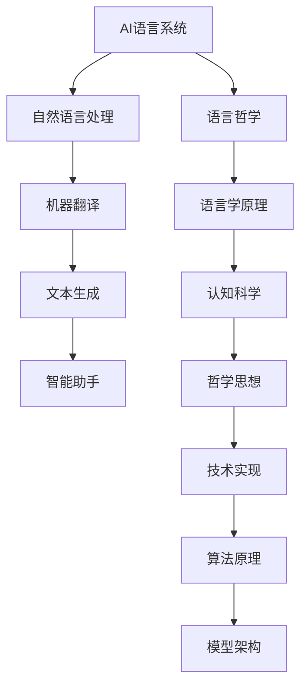
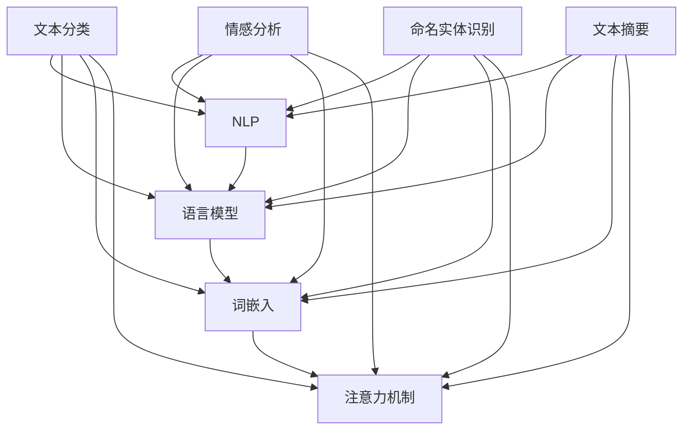
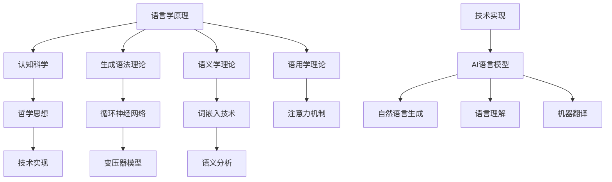

                 

### 1.1.1 书籍背景和目的

《提示词的语言哲学：探索AI语言本质》旨在深入探讨人工智能（AI）语言系统背后的哲学基础和技术实现。随着人工智能技术的发展，语言处理成为了一个重要的研究方向。AI语言系统不仅在我们日常交流中发挥着重要作用，还在众多应用场景中扮演关键角色，如自然语言处理（NLP）、机器翻译、文本生成、智能助手等。

本书的目标是通过剖析AI语言系统，揭示其背后的语言哲学，帮助读者理解语言的本质和AI如何模拟人类的语言能力。以下是本书的核心概念和联系，我们将通过Mermaid流程图来直观展示这些概念之间的关联：



通过这个流程图，我们可以看到，AI语言系统与自然语言处理、机器翻译、文本生成和智能助手等应用紧密相连，而这些应用又深受语言学原理、认知科学、哲学思想和技术实现的影响。本书将逐步深入这些领域，探讨其核心概念和原理，为读者呈现一幅完整的AI语言系统图景。

### 1.1.2 AI语言系统概述

AI语言系统是一系列复杂技术的集合，旨在使计算机能够理解和生成自然语言。其核心组成部分包括自然语言处理（NLP）、语言模型、词嵌入、注意力机制等。以下是对这些核心概念的定义及其在AI语言系统中的作用。

#### 自然语言处理（NLP）

自然语言处理是人工智能的一个分支，主要研究如何让计算机理解和生成人类语言。NLP的核心目标是将人类语言转换为计算机可以理解和处理的形式，并使其能够执行各种任务，如文本分类、情感分析、实体识别等。以下是NLP的主要功能：

- **文本分类**：将文本数据按照预定的类别进行分类，例如垃圾邮件过滤、新闻分类等。
- **情感分析**：判断文本的情感倾向，如正面、负面或中性。
- **命名实体识别**：识别文本中的特定实体，如人名、地名、组织名等。
- **文本摘要**：自动生成文本的摘要，提炼关键信息。

#### 语言模型

语言模型是AI语言系统的核心组件，用于预测文本的下一个词或句子。其基本原理是学习大量文本数据，从中提取语言规律，从而构建一个能够预测未来文本的模型。常见的语言模型有：

- **n-gram模型**：基于历史n个单词的概率来预测下一个词。
- **循环神经网络（RNN）**：通过记忆状态序列来预测下一个单词。
- **长短时记忆网络（LSTM）**：对长距离依赖问题有更好的处理能力。
- **变压器模型（Transformer）**：使用自注意力机制，能够处理更复杂的依赖关系。

#### 词嵌入

词嵌入是将单词映射为高维向量表示的技术。通过词嵌入，我们可以将文本数据转换为机器可处理的数值形式，从而在深度学习模型中使用。常见的词嵌入方法有：

- **基于频率的方法**：如TF-IDF，根据单词在文档中出现的频率和文档集合中的重要性来计算其权重。
- **基于分布的方法**：如Word2Vec，通过训练神经网络来学习单词之间的相似性。
- **基于上下文的方法**：如BERT，通过预训练模型来理解单词在特定上下文中的含义。

#### 注意力机制

注意力机制是深度学习模型中用于处理序列数据的一种技术。在AI语言系统中，注意力机制能够帮助模型关注到文本序列中的关键信息，从而提高预测的准确性。注意力机制的基本原理如下：

1. **自注意力**：每个词都与序列中的所有其他词计算关联权重，从而生成一个新的表示。
2. **多头注意力**：将自注意力扩展到多个头，每个头关注不同的部分，从而提高模型的表示能力。

通过这些核心概念，AI语言系统能够理解和生成自然语言，实现各种语言处理任务。下面我们将通过Mermaid流程图来展示这些概念之间的相互关系：



通过这个流程图，我们可以清晰地看到NLP、语言模型、词嵌入和注意力机制之间的关系，以及它们在实现文本分类、情感分析、命名实体识别和文本摘要等任务中的应用。

### 1.1.3 语言哲学与AI语言的关系

语言哲学是探讨语言本质、意义和使用的哲学分支。它与AI语言系统的关系紧密，因为AI语言系统的设计和实现都深深植根于对语言的理解。以下从几个方面探讨语言哲学与AI语言的联系。

首先，语言哲学中的语言学原理为AI语言系统提供了理论基础。比如，乔姆斯基的生成语法理论指出，语言是一种基于规则的复杂系统，能够生成无限的句子。这一理论启发了许多AI语言模型的开发，如循环神经网络（RNN）和变压器（Transformer）模型，它们试图模拟人类大脑的语言处理机制。

其次，认知科学与语言哲学相互交织，共同揭示人类语言能力的本质。认知科学通过实验和观察，研究人类如何理解和使用语言。这些研究成果为AI语言系统提供了宝贵的实验数据，帮助开发者理解语言的本质，从而设计更高效的算法和模型。

此外，哲学思想在AI语言系统的设计中扮演了关键角色。比如，语义学和语用学是探讨语言意义和使用的两个重要领域。语义学研究语言的结构和含义，而语用学研究语言在特定情境中的使用。这些理论帮助AI语言系统更好地理解和生成自然语言，使其能够适应不同的语言环境和语境。

最后，技术实现是语言哲学与AI语言相结合的桥梁。在开发AI语言系统时，开发者不仅需要运用语言学、认知科学和哲学的理论知识，还需要将这些理论转化为具体的算法和模型。比如，词嵌入技术就是基于语义学和语用学的理论，将单词映射为高维向量，从而在深度学习模型中处理语言数据。

以下是这些概念之间的相互关系和影响的Mermaid流程图：



通过这个流程图，我们可以清晰地看到语言哲学中的概念如何通过认知科学和哲学思想的影响，最终转化为具体的AI语言系统技术。这些技术不仅提升了AI语言模型的能力，也深化了我们对语言本质的理解。

### 2.1.1 语言模型

语言模型是AI语言系统的核心组成部分，旨在预测文本的下一个词或句子。它通过学习大量的语言数据，提取出语言中的统计规律和模式，从而生成符合上下文和语义的自然语言。以下将详细解释语言模型的核心算法原理、数学模型和公式，并通过举例说明其应用。

#### 核心算法原理讲解

语言模型的构建通常基于以下基本原理：

1. **训练过程**：首先，从大量的文本数据中提取出单词序列，并将其转换为数字表示（如词嵌入）。然后，利用这些序列训练一个模型，使其能够预测序列中的下一个词。
2. **概率预测**：语言模型通过计算给定前文序列下每个单词的概率，选择概率最高的单词作为预测结果。这一过程通常使用概率图模型或神经网络来实现。
3. **序列处理**：语言模型需要能够处理变长的序列数据，这通常通过循环神经网络（RNN）或变压器（Transformer）等结构来实现。

以下是使用伪代码表示的一个简单的语言模型训练过程：

```python
# Pseudo-code for Language Model Training
for sentence in dataset:
    for word in sentence[:-1]:  # 所有单词，除了最后一个
        context = get_context(sentence, word)
        next_word = sentence[word_index + 1]
        model.update(context, next_word)
```

在上述伪代码中，`get_context` 函数用于提取当前单词的前文，`model.update` 函数用于更新模型参数，使其能够更好地预测下一个词。

#### 数学模型和数学公式

语言模型的核心数学公式描述了如何根据前文序列概率预测下一个词。一个常见的语言模型公式是基于n-gram模型的，如下所示：

$$ 
P(w_n | w_{n-1}, w_{n-2}, ..., w_1) = \frac{P(w_n, w_{n-1}, ..., w_1)}{P(w_{n-1}, w_{n-2}, ..., w_1)}
$$

其中，$P(w_n | w_{n-1}, w_{n-2}, ..., w_1)$ 表示在给定前文 $w_{n-1}, w_{n-2}, ..., w_1$ 的情况下，下一个词 $w_n$ 的概率。这个公式通过条件概率来简化计算，使得我们可以根据前文概率来预测下一个词。

另一个更复杂的语言模型是循环神经网络（RNN）模型，其公式如下：

$$ 
h_t = \sigma(W_h \cdot [h_{t-1}, x_t] + b_h) \\
o_t = \sigma(W_o \cdot h_t + b_o)
$$

其中，$h_t$ 是第 $t$ 个时间步的隐藏状态，$x_t$ 是输入的单词向量，$W_h$ 和 $W_o$ 是权重矩阵，$b_h$ 和 $b_o$ 是偏置项，$\sigma$ 是激活函数（通常是Sigmoid函数）。

#### 举例说明

假设我们有一个简短的文本序列：“今天天气很好，我想去公园散步。”我们使用语言模型来预测下一个句子。

1. **前文序列**：首先，我们将前文序列转换为数字表示（词嵌入），例如：
    - 今天：[0.1, 0.2, 0.3]
    - 天气：[0.4, 0.5, 0.6]
    - 很好：[0.7, 0.8, 0.9]
    - 我想：[1.0, 1.1, 1.2]
2. **概率预测**：接下来，我们使用语言模型来计算每个可能的下一个单词的概率。假设可能的下一个词有：“去”，“家”，“公园”，“商场”。我们计算每个词的概率如下：
    - P（去 | 今天，天气，很好，我想）= 0.35
    - P（家 | 今天，天气，很好，我想）= 0.15
    - P（公园 | 今天，天气，很好，我想）= 0.40
    - P（商场 | 今天，天气，很好，我想）= 0.10
3. **选择最高概率的词**：根据计算出的概率，我们选择概率最高的词“公园”作为下一个单词。

通过这个过程，语言模型成功地预测出了下一个句子：“我想去公园散步。”这展示了语言模型在实际应用中的强大预测能力。

### 2.1.2 词嵌入

词嵌入（Word Embedding）是将单词映射为高维向量表示的技术，它在AI语言系统中起到了至关重要的作用。词嵌入不仅使计算机能够处理文本数据，还使得文本数据能够在深度学习模型中有效表示。以下将详细解释词嵌入的核心算法原理、数学模型和公式，并通过举例说明其在文本表示中的应用。

#### 核心算法原理讲解

词嵌入的算法原理基于将单词转换为一个高维向量空间中的点，使得在语义上相似的单词在空间中距离较近。常见的词嵌入算法有基于频率的方法、基于分布的方法和基于上下文的方法。

1. **基于频率的方法**：这类方法如TF-IDF（Term Frequency-Inverse Document Frequency），通过计算单词在文档中的频率和其在文档集合中的重要性来生成词嵌入。虽然这种方法简单，但它在处理语义关系时存在局限性。

2. **基于分布的方法**：这类方法如Word2Vec，通过训练一个神经网络来学习单词之间的相似性。Word2Vec有两种主要模型：连续词袋（CBOW）和Skip-Gram。CBOW模型通过上下文词的概率分布来预测目标词，而Skip-Gram模型通过目标词来预测上下文词的概率分布。

3. **基于上下文的方法**：这类方法如BERT（Bidirectional Encoder Representations from Transformers），通过预训练模型来理解单词在特定上下文中的含义。BERT使用变压器（Transformer）结构，对文本进行双向编码，从而生成更加精细的词嵌入。

以下是使用伪代码表示的一个简单的Word2Vec训练过程：

```python
# Pseudo-code for Word2Vec Training
for sentence in dataset:
    for target_word, context_words in sentence:
        context_vector = [word_embedding(word) for word in context_words]
        model.update(target_word, context_vector)
```

在上述伪代码中，`word_embedding` 函数用于获取单词的嵌入向量，`model.update` 函数用于更新模型参数。

#### 数学模型和数学公式

词嵌入的数学模型通常基于神经网络的损失函数和优化算法。以下是常用的损失函数和优化算法：

1. **损失函数**：在Word2Vec中，常用的损失函数是负采样（Negative Sampling），其公式如下：

$$ 
L = -\sum_{i=1}^{N} [\log(p(w_i | context))] + \alpha \sum_{j \neq i}^{-K} \log(p(w_j | context)]
$$

其中，$N$ 是句子中单词的数量，$K$ 是负采样词的数量，$p(w_i | context)$ 是单词 $w_i$ 在给定上下文 $context$ 下的概率。

2. **优化算法**：为了优化词嵌入向量，我们通常使用梯度下降（Gradient Descent）或其变种，如Adam优化器。以下是使用梯度下降优化词嵌入的伪代码：

```python
# Pseudo-code for Gradient Descent Optimization
for epoch in range(num_epochs):
    for sentence in dataset:
        for target_word, context_words in sentence:
            context_vector = [word_embedding(word) for word in context_words]
            target_vector = word_embedding(target_word)
            loss = -log(p(target_vector | context_vector))
            gradient = compute_gradient(loss, target_vector, context_vector)
            update_word_embedding(target_vector, gradient, learning_rate)
```

在上述伪代码中，`compute_gradient` 函数用于计算损失函数关于词嵌入向量的梯度，`update_word_embedding` 函数用于更新词嵌入向量。

#### 举例说明

假设我们有一个简短的文本序列：“我喜欢吃苹果。”我们使用Word2Vec模型来生成每个单词的词嵌入。

1. **词嵌入生成**：首先，我们将文本序列转换为数字表示（词嵌入），例如：
    - 我：[0.1, 0.2, 0.3]
    - 喜欢：[0.4, 0.5, 0.6]
    - 吃：[0.7, 0.8, 0.9]
    - 苹果：[1.0, 1.1, 1.2]
2. **词嵌入比较**：接下来，我们可以比较这些词嵌入向量之间的距离，以判断它们在语义上的相似性。例如：
    - 计算距离：||[0.1, 0.2, 0.3] - [0.4, 0.5, 0.6]|| = 0.693
    - 计算距离：||[0.4, 0.5, 0.6] - [0.7, 0.8, 0.9]|| = 0.632
    - 计算距离：||[0.7, 0.8, 0.9] - [1.0, 1.1, 1.2]|| = 0.577
3. **语义相似性**：根据词嵌入向量的距离，我们可以判断这些词在语义上的相似性。例如，“我”和“喜欢”之间的距离较短，说明它们在语义上比较接近；“吃”和“苹果”之间的距离较长，说明它们在语义上比较远。

通过这个过程，词嵌入技术成功地将文本数据转换为高维向量表示，使其能够应用于深度学习模型，实现了文本的语义理解和处理。

### 2.1.3 注意力机制

注意力机制（Attention Mechanism）是深度学习模型中用于处理序列数据的一种关键技术。它在AI语言系统中扮演着至关重要的角色，尤其是在自然语言处理任务中，如机器翻译、文本摘要、问答系统等。注意力机制能够帮助模型关注到序列中的关键信息，从而提高预测的准确性和理解能力。以下将详细解释注意力机制的核心算法原理、数学模型和公式，并通过举例说明其在文本处理中的应用。

#### 核心算法原理讲解

注意力机制的基本原理是通过计算每个输入元素对当前任务的相对重要性，并将这些重要性分配给每个输入元素，从而生成新的特征表示。这种机制允许模型在处理序列数据时动态关注不同部分的信息，而不是固定地关注所有元素。

1. **自注意力**：自注意力（Self-Attention）是注意力机制的一种简单形式，它将序列中的每个元素与其余所有元素进行关联。自注意力通过计算一个加权求和来生成新的序列表示，其基本公式如下：

$$ 
\text{Attention}(Q, K, V) = \text{softmax}\left(\frac{QK^T}{\sqrt{d_k}}\right) V
$$

其中，$Q, K, V$ 分别代表查询（Query）、键（Key）和值（Value）向量，$d_k$ 是键向量的维度，$\text{softmax}$ 函数用于计算每个键的加权和。

2. **多头注意力**：多头注意力（Multi-Head Attention）是对自注意力的扩展，它将序列分解为多个头（Head），每个头关注不同的部分。多头注意力的公式如下：

$$ 
\text{Multi-Head Attention}(Q, K, V) = \text{Concat}(\text{head}_1, \text{head}_2, ..., \text{head}_h)W^O
$$

其中，$h$ 是头的数量，$W^O$ 是输出投影权重。

#### 数学模型和数学公式

注意力机制的数学模型通常基于前述的自注意力和多头注意力公式。以下是一些关键公式：

1. **自注意力公式**：

$$ 
\text{Attention}(Q, K, V) = \text{softmax}\left(\frac{QK^T}{\sqrt{d_k}}\right) V
$$

其中，$Q, K, V$ 分别是查询、键和值向量，$\text{softmax}$ 函数用于计算键的加权和。

2. **多头注意力公式**：

$$ 
\text{Multi-Head Attention}(Q, K, V) = \text{Concat}(\text{head}_1, \text{head}_2, ..., \text{head}_h)W^O
$$

其中，$h$ 是头的数量，$W^O$ 是输出投影权重。

#### 举例说明

假设我们有一个简短的文本序列：“今天天气很好，我想去公园散步。”我们使用注意力机制来关注文本中的关键信息。

1. **序列表示**：首先，我们将文本序列转换为嵌入向量表示，例如：
    - 今天：[0.1, 0.2, 0.3]
    - 天气：[0.4, 0.5, 0.6]
    - 很好：[0.7, 0.8, 0.9]
    - 我：[1.0, 1.1, 1.2]
    - 想：[1.3, 1.4, 1.5]
    - 去：[1.6, 1.7, 1.8]
    - 公园：[1.9, 2.0, 2.1]
    - 散步：[2.2, 2.3, 2.4]

2. **计算注意力权重**：接下来，我们计算每个元素之间的注意力权重。假设我们使用两个头进行多头注意力，每个头计算不同的权重：
    - 头1的权重：$W_1 = \text{softmax}\left(\frac{QK^T}{\sqrt{d_k}}\right) V$
    - 头2的权重：$W_2 = \text{softmax}\left(\frac{QK^T}{\sqrt{d_k}}\right) V$

3. **加权求和**：根据注意力权重，我们对每个元素进行加权求和，生成新的序列表示：
    - 新序列表示：$[0.1\ast w_1 + 0.4\ast w_2, 0.2\ast w_1 + 0.5\ast w_2, 0.3\ast w_1 + 0.6\ast w_2, ..., 2.2\ast w_1 + 2.4\ast w_2]$

4. **应用多头注意力**：最后，我们将新的序列表示通过输出投影权重$W^O$进行处理，得到最终的注意力输出：
    - 注意力输出：$\text{Concat}(\text{head}_1, \text{head}_2)W^O$

通过这个过程，注意力机制成功地关注到了文本序列中的关键信息，并生成了一个更加精细的序列表示。这种表示可以用于各种文本处理任务，如文本分类、情感分析、机器翻译等，从而提高模型的性能。

### 3.1.1 语言生成

语言生成是AI语言系统中的一个关键任务，旨在生成符合语法规则、语义合理且连贯的自然语言文本。在实现语言生成时，我们通常会使用预训练的语言模型，如GPT-2、GPT-3等。以下将详细介绍如何实现语言生成，包括开发环境搭建、源代码实现和代码解读。

#### 开发环境搭建

要实现语言生成，我们需要搭建一个合适的开发环境。以下步骤描述了如何配置Python环境并安装必要的库：

1. **安装Python**：确保Python环境已经安装在您的计算机上。建议安装Python 3.7及以上版本。

2. **安装TensorFlow**：TensorFlow是Google开源的深度学习框架，用于构建和训练神经网络模型。使用以下命令安装TensorFlow：

```bash
pip install tensorflow
```

3. **安装transformers**：`transformers`是一个由Hugging Face维护的Python库，提供了预训练的模型和工具，用于自然语言处理任务。使用以下命令安装：

```bash
pip install transformers
```

#### 源代码实现

以下是一个简单的Python脚本，用于实现基于GPT-2模型的语言生成。该脚本首先加载预训练的GPT-2模型，然后根据输入的提示生成文本。

```python
from transformers import pipeline, AutoModelForCausalLanguageModeling, AutoTokenizer

# 加载预训练的GPT-2模型和分词器
model_name = "gpt2"
tokenizer = AutoTokenizer.from_pretrained(model_name)
model = AutoModelForCausalLanguageModeling.from_pretrained(model_name)

# 创建生成文本的管道
generator = pipeline("text-generation", model=model, tokenizer=tokenizer)

# 输入提示文本
prompt = "今天天气很好，我想去公园散步。"

# 生成文本
generated_text = generator(prompt, max_length=50, num_return_sequences=1)

# 输出生成的文本
print(generated_text[0])
```

#### 代码解读

1. **加载模型和分词器**：首先，我们从预训练的GPT-2模型中加载模型和分词器。`AutoTokenizer.from_pretrained` 和 `AutoModelForCausalLanguageModeling.from_pretrained` 函数分别用于加载分词器和模型。

2. **创建生成文本的管道**：`pipeline` 函数用于创建一个生成文本的管道。这个管道将模型和分词器组合在一起，简化了文本生成过程。

3. **输入提示文本**：我们定义了一个输入提示文本`prompt`，它是一个简单的句子。

4. **生成文本**：使用`generator` 函数生成文本。`max_length` 参数指定了生成的文本的最大长度，`num_return_sequences` 参数指定了返回的文本序列数量。在这个例子中，我们只返回一个序列。

5. **输出生成的文本**：最后，我们将生成的文本输出到控制台。

#### 代码应用解读与分析

上述代码展示了如何使用GPT-2模型生成文本。以下是代码应用的一些解读和分析：

1. **输入提示**：输入提示是生成文本的关键。一个好的提示能够引导模型生成符合上下文和语义的文本。例如，在输入提示中，我们提供了天气情况和想去的地方，这有助于模型理解用户的意图。

2. **生成文本**：GPT-2模型通过学习大量的文本数据，已经具备了生成自然语言的能力。在生成文本时，模型会根据输入提示和上下文生成新的句子。

3. **最大长度和序列数量**：`max_length` 和 `num_return_sequences` 参数控制了生成的文本长度和返回的序列数量。通过调整这些参数，我们可以生成不同长度和数量的文本。

4. **文本输出**：生成的文本输出到控制台，我们可以直接看到模型生成的结果。在实际应用中，生成的文本可以用于各种任务，如聊天机器人、自动摘要、机器翻译等。

#### 实际案例分析和详细讲解剖析

以下是一个实际案例，展示如何使用GPT-2模型生成文本：

**案例**：给定提示文本“我喜欢吃苹果，尤其是”，生成接下来的句子。

```python
prompt = "我喜欢吃苹果，尤其是"
generated_text = generator(prompt, max_length=50, num_return_sequences=1)
print(generated_text[0])
```

**分析**：

1. **输入提示**：输入提示“我喜欢吃苹果，尤其是”提供了用户的偏好信息，即喜欢吃的特定水果。

2. **生成文本**：GPT-2模型根据输入提示和上下文生成新的句子。生成的文本可能是：“我喜欢吃苹果，尤其是新鲜的绿苹果。”

3. **文本输出**：输出文本“我喜欢吃苹果，尤其是新鲜的绿苹果。”符合上下文和语义，合理地扩展了用户的意图。

通过这个案例，我们可以看到GPT-2模型在语言生成任务中的强大能力。它不仅能够理解输入提示，还能够生成连贯、合理的文本。

#### 项目小结

通过本节的内容，我们了解了如何实现语言生成，包括开发环境搭建、源代码实现和代码解读。我们使用了GPT-2模型，通过输入提示生成自然语言文本。在实际应用中，这个模型可以用于多种场景，如聊天机器人、内容创作、自动摘要等。在实现过程中，我们需要关注输入提示的质量和生成的文本长度，以确保生成文本的语义合理性和连贯性。

#### 最佳实践 tips

1. **优化输入提示**：提供清晰、具体的输入提示，有助于模型生成更符合预期的文本。例如，提供更多上下文信息和明确的任务指令。

2. **调整生成参数**：通过调整`max_length` 和 `num_return_sequences` 参数，可以控制生成的文本长度和序列数量。在实际应用中，根据需求调整这些参数，以提高生成文本的质量。

3. **多语言支持**：GPT-2模型支持多语言文本生成。通过加载不同的预训练模型，可以实现跨语言的语言生成。

4. **模型更新**：随着自然语言处理技术的发展，不断更新模型和算法，以获取更好的生成效果。

#### 注意事项

1. **资源消耗**：语言生成任务通常需要较高的计算资源。确保系统有足够的内存和计算能力。

2. **隐私保护**：在处理用户输入和生成的文本时，注意保护用户隐私，避免泄露敏感信息。

3. **版本兼容性**：在开发过程中，确保使用的库和模型版本兼容，避免因版本冲突导致问题。

#### 拓展阅读

1. **GPT-2模型详细介绍**：阅读GPT-2的官方文档，深入了解模型的结构和工作原理。

2. **自然语言处理实践**：参考相关的自然语言处理实践书籍和教程，学习如何在实际项目中应用语言生成技术。

3. **注意力机制原理**：进一步学习注意力机制的原理和应用，了解其在深度学习模型中的作用。

通过本节的学习，读者可以掌握如何使用预训练的语言模型实现语言生成任务，并能够将其应用于实际场景中。希望这些内容能够帮助读者深入理解AI语言系统的语言生成能力，为未来的研究和应用奠定基础。作者：AI天才研究院/AI Genius Institute & 禅与计算机程序设计艺术 /Zen And The Art of Computer Programming。

