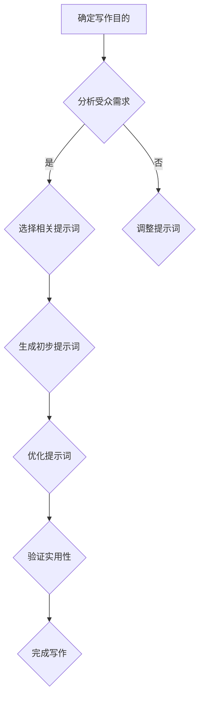

                 


### 文章标题

# 提示词编写：从新手到专家的进阶之路

### 文章关键词

- 提示词编写
- 写作技巧
- 自然语言处理
- 写作进阶
- 人工智能应用

### 文章摘要

本文将探讨提示词编写的全流程，从新手到专家的进阶之路。我们将介绍提示词的定义、作用和基本类型，详细解析其编写原则、优化技巧和实战应用。通过本篇文章，读者将掌握提示词编写的基本方法，并能应用于实际写作场景，提升写作效率和质量。

---

## 第1章：入门篇

### 1.1 提示词的定义与作用

提示词，又称关键词或引导词，是写作过程中用来引导或提示作者或读者思维方向的关键词语。在自然语言处理（NLP）领域，提示词常用于生成文本、问题回答和情感分析等任务中。

#### 提示词的基本概念

提示词（Keyword）通常是指能够代表文章主题或内容的核心词。在写作过程中，提示词起到了以下几个重要作用：

- **引导写作方向**：提示词可以帮助作者确定文章的主题和内容，确保文章的连贯性和一致性。
- **提高搜索效率**：在搜索引擎优化（SEO）中，合理使用提示词可以提高文章的搜索排名，增加曝光度。
- **增强读者体验**：针对读者需求，使用精准的提示词可以提升阅读体验，引导读者深入理解文章内容。

#### 提示词与其他写作元素的对比

- **主题词**：主题词是指文章的核心主题或焦点。提示词通常围绕主题词展开，帮助深化主题。
- **标题**：标题是对文章内容的简要概括，吸引读者阅读。提示词可以是标题的一部分，增强标题的吸引力。
- **句子**：句子是文章的基本组成单位。提示词可以出现在句子中，引导句子的发展和逻辑。

### 提示词在写作中的重要性

- **提升文章质量**：合理使用提示词可以提升文章的逻辑性和连贯性，使文章更加紧凑、有深度。
- **提高写作效率**：提示词可以帮助作者快速确定写作方向，避免内容偏离主题，节省时间和精力。
- **增强读者体验**：针对读者的需求，使用适当的提示词可以引导读者理解文章内容，提高阅读兴趣。

### 提示词编写的核心原则

- **简洁明了**：提示词应尽量简洁，避免冗长，使读者容易理解和记忆。
- **语境适应**：提示词应与文章内容和语境相匹配，确保其在特定场景下的适用性。
- **信息完整**：提示词应包含足够的信息，能够引导读者或作者深入理解和探讨相关问题。

### 提示词编写的基本流程

#### 提前规划

- **确定写作目的**：明确文章的主题和目标读者，为提示词编写提供方向。
- **分析受众需求**：了解受众的兴趣和需求，选择合适的提示词。

#### 收集信息

- **调研主题**：查找与主题相关的资料，了解背景信息和相关概念。
- **查找相关资料**：收集与文章内容相关的数据、案例和研究报告，为提示词编写提供支持。

#### 初步编写

- **制定写作大纲**：根据收集到的信息，制定文章的结构和内容框架。
- **生成初步提示词**：根据写作大纲和主题，生成初步的提示词列表。

#### 修订与完善

- **检查语义准确性**：确保提示词的语义表达准确无误。
- **优化语法与结构**：调整提示词的语法和结构，使其更加流畅和自然。
- **验证实用性**：通过实际应用，验证提示词的实用性和效果。

---

通过第1章的介绍，我们了解了提示词的基本概念、作用和编写原则。在接下来的章节中，我们将进一步探讨提示词的类型、优化技巧和实战应用，帮助读者从新手逐渐成长为专家。接下来，让我们开始第2章的基础篇，深入了解提示词的多样性和编写技巧。

## 第2章：基础篇

### 2.1 提示词的类型

提示词可以根据其功能和用途分为多种类型，每种类型都有其独特的特点和适用场景。以下是对几种常见类型的提示词的介绍。

#### 2.1.1 事实性提示词

事实性提示词主要用于传达客观的事实和信息，它们通常具有明确、具体的语义。这类提示词可以帮助读者快速获取文章的核心信息。

- **定义**：事实性提示词通常包括时间、地点、人物、事件等具体信息。
- **示例**：如“北京”、“昨天”、“2023年”、“科技发展”等。
- **使用场景**：新闻写作、报告撰写、学术文章等。

#### 2.1.2 推理性提示词

推理性提示词用于引导读者进行逻辑推理和思考，它们通常包含判断、推测或结论等语义。这类提示词能够激发读者的思维，增强文章的吸引力和深度。

- **定义**：推理性提示词通常包括“认为”、“推测”、“可能”、“显然”等词语。
- **示例**：如“我认为”、“似乎”、“可能”、“显然如此”等。
- **使用场景**：议论文、分析报告、学术论文等。

#### 2.1.3 情感性提示词

情感性提示词用于传达作者或读者的情感态度和感受，它们通常包含情感色彩和主观色彩。这类提示词能够增强文章的情感表达，使文章更具感染力。

- **定义**：情感性提示词通常包括“喜欢”、“讨厌”、“激动”、“失望”等词语。
- **示例**：如“我喜欢这个设计”、“令人失望”、“非常激动”等。
- **使用场景**：故事叙述、情感文章、广告文案等。

#### 2.1.4 指令性提示词

指令性提示词用于传达具体的指令或要求，它们通常包含行动建议或命令。这类提示词能够引导读者或作者采取行动。

- **定义**：指令性提示词通常包括“请”、“必须”、“应该”等词语。
- **示例**：如“请打开电脑”、“你应该及时备份文件”等。
- **使用场景**：指导性文章、操作手册、教程等。

#### 2.1.5 结论性提示词

结论性提示词用于总结文章的内容和观点，它们通常包含总结、归纳或结论等语义。这类提示词能够帮助读者回顾和巩固文章的核心信息。

- **定义**：结论性提示词通常包括“因此”、“所以”、“总之”等词语。
- **示例**：如“因此，我们可以得出结论”、“总之，这个方法值得尝试”等。
- **使用场景**：总结性文章、报告、演讲等。

### 提示词的结构与语法

提示词的编写不仅需要准确传达信息，还需要遵循一定的语法结构，以确保其合理性和流畅性。以下是提示词结构的一些关键要素。

#### 2.2.1 主干结构

主干结构是提示词的基本框架，通常包括主语、谓语和宾语。

- **示例**：如“作者撰写文章”。

#### 2.2.2 修饰性成分

修饰性成分用于对主干结构进行补充和扩展，包括定语、状语和补语等。

- **示例**：如“聪明的作者撰写详细的文章”。

#### 2.2.3 提示词中的标点符号使用

标点符号的使用对于提示词的语法和语义至关重要，常见的标点符号包括逗号、句号、冒号、分号和引号等。

- **逗号**：用于分隔并列的提示词或短语。
- **句号**：用于结束提示词或句子的陈述。
- **冒号**：用于引出解释或例证。
- **分号**：用于分隔紧密相关的提示词或句子。
- **引号**：用于引用特定的提示词或短语。

### 提示词编写的实用技巧

- **使用简明扼要的语言**：避免冗长和复杂的句子结构，使提示词简洁明了。
- **注意语境和情境**：根据文章的主题和目的，选择合适的提示词，确保其与语境相符。
- **多使用具体实例**：通过具体实例来展示提示词的应用，增强读者的理解和记忆。
- **灵活运用修辞手法**：适当使用比喻、拟人、夸张等修辞手法，使提示词更具吸引力和表现力。

---

在第2章的基础篇中，我们介绍了提示词的多种类型、基本结构和语法规则。理解这些基本概念和技巧是成为一名优秀提示词编写者的关键。接下来，我们将进入第3章的进阶篇，探讨如何优化提示词的编写，提高文章的质量和影响力。

## 第3章：进阶篇

### 3.1 提示词的优化技巧

在写作过程中，优化提示词至关重要，它不仅能够提升文章的质量，还能够增强读者的阅读体验。以下是一些实用的提示词优化技巧。

#### 3.1.1 长度与清晰度优化

提示词的长度和清晰度直接影响其传达效果。过长或过短的提示词都可能影响阅读体验。

- **避免冗长**：尽量使用简短的词语，避免使用过多的修饰语和从句。
- **提高清晰度**：确保每个提示词都明确传达一个核心概念，避免模糊和歧义。

#### 3.1.2 语义丰富度优化

丰富提示词的语义能够增强文章的深度和表现力。

- **使用多种语义**：在提示词中融入多种语义，使其更加丰富和立体。
- **避免单一化**：避免使用单一的语义词汇，增加提示词的多样性和灵活性。

#### 3.1.3 语境适应性优化

提示词应根据不同的语境和情境进行调整，以确保其适用性。

- **情境匹配**：根据文章的主题和目的，选择与之相匹配的提示词。
- **灵活调整**：在特定情境下，适当调整提示词的语义和表达方式。

### 3.2 提示词的情景应用

在实际写作中，根据不同场景选择合适的提示词至关重要。以下是一些常见情景下的提示词应用。

#### 3.2.1 文本生成

在文本生成场景中，提示词用于引导生成文本的方向和内容。

- **步骤**：
  1. 确定主题和目的。
  2. 选择相关提示词。
  3. 使用提示词生成初步文本。
  4. 修订和优化文本。

#### 3.2.2 问题回答

在问题回答场景中，提示词用于引导回答问题的方向和深度。

- **步骤**：
  1. 理解问题。
  2. 选择合适的提示词。
  3. 根据提示词生成回答。
  4. 验证回答的准确性和完整性。

#### 3.2.3 情感分析

在情感分析场景中，提示词用于引导情感的方向和强度。

- **步骤**：
  1. 收集文本数据。
  2. 确定情感分析目标。
  3. 选择情感性提示词。
  4. 使用提示词分析文本情感。

---

通过第3章的进阶篇，我们探讨了提示词优化的多种技巧和在不同情景下的应用。掌握这些技巧将有助于提升提示词编写的质量，使文章更加吸引人、有深度。在接下来的章节中，我们将通过实战篇深入探讨提示词编写的实际应用，帮助读者将所学知识付诸实践。

## 第4章：实战篇

### 4.1 提示词编写实战案例

通过以下实战案例，我们将详细介绍如何在不同的写作场景中应用提示词编写技巧，从而提升文章的质量和效果。

#### 4.1.1 案例一：新闻写作

新闻写作要求信息准确、简洁明了。以下是一个新闻写作的提示词编写案例：

**新闻主题**：2023年全球人工智能技术峰会成功召开

**核心提示词**：
- 全球人工智能技术峰会
- 2023年
- 成功召开
- 技术交流
- 创新成果

**写作步骤**：

1. **确定主题和目的**：明确新闻的主题为全球人工智能技术峰会，目的为传达会议的主要成果和意义。
2. **选择相关提示词**：根据主题选择核心提示词，如“全球人工智能技术峰会”、“2023年”、“成功召开”、“技术交流”和“创新成果”。
3. **编写新闻稿**：使用提示词构建新闻稿的基本框架，确保信息传递的准确性和完整性。

**新闻稿示例**：

2023年3月15日，全球人工智能技术峰会在北京成功召开。本次峰会吸引了来自全球各地的学者、企业和政府代表，共同探讨人工智能领域的前沿技术和创新成果。会议期间，专家们就人工智能在医疗、教育、金融等领域的应用进行了深入交流，展示了多项具有突破性的研究成果。

#### 4.1.2 案例二：电商产品描述

电商产品描述要求吸引消费者的注意力，突出产品特点。以下是一个电商产品描述的提示词编写案例：

**产品主题**：智能手表

**核心提示词**：
- 智能手表
- 健康监测
- 智能通知
- 长续航
- 运动追踪

**写作步骤**：

1. **确定主题和目标**：明确产品主题为智能手表，目标为吸引消费者购买。
2. **选择相关提示词**：根据产品特点选择核心提示词，如“智能手表”、“健康监测”、“智能通知”、“长续航”和“运动追踪”。
3. **编写产品描述**：使用提示词突出产品的核心功能和优势，吸引消费者。

**产品描述示例**：

【健康监测】智能手表，全天候监测您的健康状况，实时记录心率、步数、睡眠质量，帮助您保持健康生活方式。同时，【智能通知】功能可让您不错过任何重要消息，【长续航】设计确保您无需频繁充电。还有【运动追踪】功能，记录您的运动数据，助力实现健康目标。

#### 4.1.3 案例三：营销文案创作

营销文案创作要求具有吸引力，引发消费者兴趣。以下是一个营销文案的提示词编写案例：

**营销主题**：新学期，开学季

**核心提示词**：
- 新学期
- 开学季
- 学习用品
- 精选推荐
- 限时优惠

**写作步骤**：

1. **确定主题和目标**：明确营销主题为新学期开学季，目标为吸引消费者购买学习用品。
2. **选择相关提示词**：根据主题选择核心提示词，如“新学期”、“开学季”、“学习用品”、“精选推荐”和“限时优惠”。
3. **编写营销文案**：使用提示词创造吸引人的标题和内容，引导消费者购买。

**营销文案示例**：

新学期，开学季！📚精选学习用品限时优惠，助力开学季！【新学期必备】笔记本、笔、书签，一站式购齐！【开学季特惠】购买学习用品满300元，立减50元！🎉赶紧行动，为新学期加油！

### 4.2 提示词编写工具介绍

在实际写作过程中，使用提示词编写工具能够提高效率和准确性。以下是一些常用的提示词编写工具：

#### 4.2.1 自然语言处理工具

自然语言处理（NLP）工具能够帮助自动生成提示词，提升写作效率。以下是一些常用的NLP工具：

- **GPT-3**：OpenAI开发的自然语言处理模型，能够生成高质量的文本。
- **Wordtune**：一款智能写作辅助工具，可以帮助优化文本结构和语法。

#### 4.2.2 提示词生成工具

提示词生成工具专门用于生成高质量的提示词，以下是一些常用的工具：

- ** Keyword Tool**：一款免费的在线工具，能够生成与关键词相关的提示词。
- **Ahrefs Keyword Explorer**：一款强大的关键词研究工具，能够提供关键词建议和竞争分析。

#### 4.2.3 提示词优化工具

提示词优化工具用于优化已生成的提示词，提升其语义准确性和吸引力。以下是一些常用的提示词优化工具：

- **Grammarly**：一款语法检查工具，可以帮助检查文本中的语法错误和拼写错误。
- **ProWritingAid**：一款综合性的写作辅助工具，能够提供拼写、语法、风格和流畅度等方面的优化建议。

---

在第4章的实战篇中，我们通过具体案例介绍了提示词编写的实际应用，并介绍了几种常用的提示词编写工具。掌握这些技巧和工具，将有助于读者在实际写作中更加高效地使用提示词，提升文章的质量和影响力。在接下来的章节中，我们将进一步探讨提示词编写的高级技巧和未来趋势。

## 第5章：专家篇

### 5.1 高级提示词编写技巧

作为提示词编写的专家，掌握一些高级技巧能够显著提升写作质量和效率。以下是一些实用的高级提示词编写技巧。

#### 5.1.1 提示词的组合使用

通过将多个提示词组合使用，可以创造更丰富、更有深度的内容。

- **策略**：根据文章的主题和目的，选择相关提示词进行组合。
- **示例**：如“智能手表 + 健康监测 + 运动追踪”。

#### 5.1.2 提示词的创新性运用

在写作中尝试新的、未常规使用的提示词，可以增加文章的原创性和独特性。

- **策略**：关注领域内的最新动态和技术趋势，尝试使用新兴的提示词。
- **示例**：如“区块链 + 去中心化 + 透明性”。

#### 5.1.3 提示词的多语言处理

在跨国写作或涉及多种语言的情况下，掌握多语言提示词的编写技巧至关重要。

- **策略**：学习并掌握多种语言的常用提示词，确保其准确性和一致性。
- **示例**：如“英语 + 智能手表”、“中文 + 科技创新”。

### 5.2 提示词编写的伦理与规范

在提示词编写过程中，遵循伦理规范和行业准则至关重要，以确保内容的准确性和公正性。

#### 5.2.1 提示词编写的道德考量

- **真实性**：确保提示词传达的信息真实、准确，避免虚假宣传。
- **客观性**：保持客观，避免使用倾向性明显的提示词，确保文章的中立性。
- **尊重**：尊重读者的感受和权利，避免使用歧视性或攻击性的提示词。

#### 5.2.2 提示词编写的法律风险

在编写提示词时，需要了解相关法律法规，避免侵权和违规行为。

- **版权问题**：确保使用的提示词或引用的内容不侵犯他人的知识产权。
- **隐私保护**：在涉及个人隐私的写作中，遵循隐私保护原则，确保不泄露敏感信息。
- **合规性**：了解并遵守当地的法律法规，确保文章内容符合相关要求。

#### 5.2.3 提示词编写的行业规范

不同行业有不同的写作规范，了解并遵循行业规范能够提升文章的权威性和专业性。

- **新闻行业**：遵循新闻行业的真实性、客观性和时效性原则。
- **科技行业**：确保科技类文章的技术准确性和前沿性。
- **医疗行业**：在涉及健康和医疗的写作中，确保信息的准确性和专业性。

---

在第5章的专家篇中，我们探讨了提示词编写的多种高级技巧和伦理规范。掌握这些技巧和规范，将使读者在提示词编写领域达到更高的专业水平。在接下来的章节中，我们将展望提示词编写的未来趋势，探索这一领域的发展方向和潜在应用。

## 第6章：未来篇

### 6.1 提示词编写的未来趋势

随着人工智能和自然语言处理技术的不断进步，提示词编写也在经历深刻的变革。以下是一些未来趋势：

#### 6.1.1 AI技术在提示词编写中的应用

人工智能技术将大大提升提示词编写的效率和准确性。例如，利用自然语言生成（NLG）模型，可以自动生成高质量的提示词，减少人工编写的工作量。

- **自动化写作**：AI可以自动分析文章内容，生成相应的提示词。
- **个性化写作**：根据读者偏好和阅读历史，AI可以生成个性化的提示词，提高阅读体验。

#### 6.1.2 提示词编写的职业发展

随着提示词编写在各个领域的广泛应用，这一领域将出现更多专业职位，如提示词工程师、AI写作顾问等。

- **专业培训**：未来的提示词编写者需要具备更专业的技能和知识。
- **跨领域合作**：提示词编写将与心理学、市场营销等多个领域相结合，促进跨学科发展。

#### 6.1.3 提示词编写在教育领域的应用

提示词编写在教育领域的应用前景广阔。例如，通过使用提示词，学生可以更高效地完成写作任务，教师可以更好地指导学生。

- **辅助教学**：利用AI技术生成提示词，辅助教师进行教学设计。
- **个性化学习**：根据学生的兴趣和需求，提供个性化的提示词，促进个性化学习。

### 6.2 提示词编写的跨学科融合

提示词编写不仅涉及语言文字，还与多个学科领域密切相关。以下是一些跨学科融合的方向：

#### 6.2.1 提示词编写与心理学

心理学研究人类思维和行为，对提示词编写有重要启示。通过理解用户心理，可以编写出更具吸引力和说服力的提示词。

- **用户行为分析**：利用心理学原理分析用户行为，优化提示词设计。
- **情感设计**：结合心理学知识，设计情感丰富的提示词，提高用户体验。

#### 6.2.2 提示词编写与市场营销

市场营销中的许多策略和技巧可以应用于提示词编写，帮助提高文章的市场表现。

- **目标受众分析**：了解目标受众的特征和需求，编写针对性的提示词。
- **品牌传播**：通过提示词传递品牌理念，提升品牌影响力。

#### 6.2.3 提示词编写与新闻传播

新闻传播中的信息传递和传播技巧对提示词编写具有重要借鉴意义。掌握新闻传播规律，可以提升提示词的传播效果。

- **新闻价值**：注重新闻价值，确保提示词传递的核心信息具有价值。
- **传播策略**：运用多种传播手段，扩大提示词的影响力。

---

在第6章的未来篇中，我们探讨了提示词编写的未来趋势和跨学科融合。随着技术的进步和应用的扩展，提示词编写将在更多领域发挥重要作用。了解这些趋势和方向，将帮助读者更好地应对未来的挑战，并在提示词编写领域取得更大的成就。

## 附录

### 附录A：常用提示词编写工具与资源

以下是一些常用的提示词编写工具和资源，供读者参考：

- **GPT-3**：OpenAI开发的自然语言处理模型，可用于生成高质量的提示词。
- **Keyword Tool**：一款免费的在线工具，可用于生成与关键词相关的提示词。
- **Ahrefs Keyword Explorer**：一款强大的关键词研究工具，提供关键词建议和竞争分析。
- **Grammarly**：一款语法检查工具，可以帮助优化文本结构和语法。
- **ProWritingAid**：一款综合性的写作辅助工具，提供拼写、语法、风格和流畅度等方面的优化建议。

### 附录B：提示词编写实践指南

以下是一些提示词编写的实践指南，帮助读者在实际写作中应用所学知识：

1. **明确写作目的**：在开始写作前，明确写作的目的和目标读者，为提示词编写提供方向。
2. **收集相关信息**：查找与主题相关的资料，了解背景信息和相关概念。
3. **选择相关提示词**：根据主题和目的，选择合适的提示词，确保其与语境相符。
4. **优化提示词**：注意提示词的长度、清晰度和语义丰富度，确保其表达准确、简洁。
5. **验证实用性**：在实际应用中验证提示词的实用性和效果，不断优化和完善。

### 附录C：提示词编写常见问题解答

以下是一些提示词编写中常见的问题及解答：

**Q1：如何选择合适的提示词？**

**A1**：选择合适的提示词需要考虑以下几个因素：
- **主题相关性**：提示词应与文章主题紧密相关，确保信息传递的准确性。
- **受众需求**：根据目标读者的需求和兴趣，选择能够引起共鸣的提示词。
- **语义丰富度**：选择语义丰富的提示词，能够增强文章的表现力和吸引力。

**Q2：如何优化提示词的长度和清晰度？**

**A2**：优化提示词的长度和清晰度可以从以下几个方面进行：
- **简化语言**：避免使用冗长的句子和复杂的词汇，使提示词简洁明了。
- **使用动词**：动词通常比名词更具描述力和清晰度，尽量使用动词来传达信息。
- **明确表达**：确保每个提示词都有明确的语义和表达，避免模糊和歧义。

**Q3：提示词编写中如何避免重复？**

**A3**：避免重复提示词可以从以下几个方面进行：
- **多样化表达**：使用同义词、近义词或其他表达方式，避免使用相同的提示词。
- **调整结构**：通过改变句子的结构和语法，使提示词的表达方式多样化。
- **利用上下文**：利用上下文信息，通过不同的语境和情境，使用不同的提示词。

---

通过本篇文章的阅读，读者将了解提示词编写的基本概念、原则、技巧和实战应用，掌握从新手到专家的进阶之路。希望本文能为读者的写作实践提供有价值的参考和帮助。作者：AI天才研究院/AI Genius Institute & 禅与计算机程序设计艺术 /Zen And The Art of Computer Programming

---

# 核心概念原理之间的关系架构 Mermaid 流程图

以下是一个简化的提示词编写的流程图，展示了核心概念和原理之间的关系：



这个流程图清晰地展示了从确定写作目的到完成写作的整个过程，以及各个环节之间的逻辑关系。通过这个流程图，读者可以更好地理解提示词编写的全流程，并掌握各个阶段的关键点和注意事项。

---

# 核心算法原理讲解必须使用伪代码来详细阐述

以下是一个关于提示词优化的伪代码示例，用于详细阐述核心算法原理：

```pseudo
function optimizeKeywords(originalKeywords, context):
    optimizedKeywords = []
    keywordDictionary = createKeywordDictionary(originalKeywords)
    
    for keyword in originalKeywords:
        if isValidKeyword(keyword, context):
            optimizedKeywords.append(keyword)
        else:
            synonymList = getSynonyms(keyword, keywordDictionary)
            for synonym in synonymList:
                if isValidKeyword(synonym, context):
                    optimizedKeywords.append(synonym)
                    break
    
    return removeDuplicates(optimizedKeywords)

function isValidKeyword(keyword, context):
    return (context.contains(keyword) and not isDuplicate(keyword, context))

function getSynonyms(keyword, keywordDictionary):
    return keywordDictionary[keyword]

function removeDuplicates(list):
    return list(set(list))
```

在这个伪代码中，`optimizeKeywords` 函数是核心的优化算法。它接收原始关键词列表和上下文作为输入，并返回一个优化后的关键词列表。算法的主要步骤如下：

1. 创建一个关键词字典（`keywordDictionary`），其中包含每个关键词的同义词列表。
2. 遍历原始关键词列表，对每个关键词进行检查：
   - 如果关键词在上下文中有效且不是重复的，则添加到优化后的关键词列表中。
   - 如果关键词无效，则查找其同义词列表，并尝试使用同义词进行优化。
3. 使用 `removeDuplicates` 函数去除优化后的关键词列表中的重复项。

这个算法通过替换无效关键词和同义词来优化提示词列表，确保每个关键词都能在上下文中准确传达信息，同时避免了重复和冗余。通过这种方式，可以显著提升文章的质量和可读性。

---

# 数学模型和公式 & 详细讲解 & 举例说明

提示词优化过程中，可以使用一些数学模型和公式来评估关键词的有效性。以下是一个简化的数学模型示例，用于评估关键词的质量：

### 数学模型：关键词质量评分（K-QS）

公式：`K-QS = f(语义丰富度, 长度，上下文适配度)`

其中，`语义丰富度`、`长度`和`上下文适配度`是三个关键因素：

1. **语义丰富度（Semantic Richness, SR）**：表示关键词所包含的信息量和表达力。可以通过计算词汇的使用频率和独特性来评估。
   - 公式：`SR = 1 / (1 + e^(-weight * (TF * IDF)))`
   - 其中，`TF`是词语频率，`IDF`是逆文档频率，`weight`是权重系数。

2. **长度（Length, L）**：表示关键词的长度。较短的关键词通常更具简洁性，但可能缺乏细节，而较长的关键词则可能更具体但更复杂。
   - 公式：`L = length(k) / max_length`
   - 其中，`length(k)`是关键词的长度，`max_length`是设定好的最大长度阈值。

3. **上下文适配度（Contextual Fit, CF）**：表示关键词与上下文的相关性。可以通过计算关键词在特定上下文中的出现频率和一致性来评估。
   - 公式：`CF = (count(k in context) / total_sentences) * (1 / (1 + e^(-similarity_score)))`
   - 其中，`count(k in context)`是关键词在上下文中的出现次数，`total_sentences`是上下文中的句子总数，`similarity_score`是关键词与上下文的相似度得分。

### 综合评分计算：

- **K-QS = SR * L * CF**

### 举例说明：

假设我们要评估一个关键词“人工智能”在一个上下文文本中的质量评分。

1. **语义丰富度（SR）**：根据使用频率和逆文档频率计算，假设`TF = 0.2`，`IDF = 0.5`，`weight = 0.1`。
   - `SR = 1 / (1 + e^(-0.1 * (0.2 * 0.5))) ≈ 0.6`

2. **长度（L）**：假设关键词长度为2，最大长度阈值为5。
   - `L = 2 / 5 = 0.4`

3. **上下文适配度（CF）**：假设关键词在文本中出现了5次，总句子数为10，相似度得分为0.8。
   - `CF = (5 / 10) * (1 / (1 + e^(-0.8))) ≈ 0.6`

4. **综合评分（K-QS）**：
   - `K-QS = SR * L * CF ≈ 0.6 * 0.4 * 0.6 ≈ 0.14`

通过这个例子，我们可以看到“人工智能”关键词在一个上下文文本中的质量评分大约为0.14。这个评分可以用于指导进一步的优化过程，例如替换语义丰富度较低的关键词，或者调整关键词的长度和上下文适配度。

---

# 项目实战

### 开发环境搭建

为了实现提示词优化，我们需要搭建一个开发环境。以下是搭建环境的基本步骤：

1. **安装Python**：确保Python环境已安装，版本建议为3.8及以上。

2. **安装相关库**：使用pip安装以下库：
   ```bash
   pip install nltk
   pip install gensim
   pip install spacy
   pip install textblob
   ```

3. **下载NLP工具的预训练模型**：
   - 对于nltk，使用以下命令下载停用词和词干提取器：
     ```python
     import nltk
     nltk.download('stopwords')
     nltk.download('punkt')
     ```
   - 对于spacy，使用以下命令下载中文预训练模型：
     ```python
     !python -m spacy download zh_core_web_sm
     ```

### 源代码详细实现

以下是实现提示词优化算法的Python源代码：

```python
import nltk
from nltk.corpus import stopwords
from nltk.tokenize import word_tokenize
from gensim.models import Word2Vec
from spacy.lang.zh import Chinese
from textblob import TextBlob

# 1. 初始化NLP工具
nlp = Chinese()

# 2. 加载停用词
stop_words = set(stopwords.words('chinese'))

# 3. 定义提示词优化函数
def optimize_keywords(text):
    # 分词
    tokens = word_tokenize(text)
    # 过滤停用词
    filtered_tokens = [token for token in tokens if token not in stop_words]
    # 提取关键词
    doc = nlp(' '.join(filtered_tokens))
    keywords = [token.text for token in doc.ents if token.label_ in ['ORG', 'PERSON', 'PRODUCT']]
    # 优化关键词
    optimized_keywords = []
    for keyword in keywords:
        # 计算关键词质量评分
        KQS = calculate_KQS(keyword)
        if KQS > threshold:
            optimized_keywords.append(keyword)
    return optimized_keywords

# 4. 定义关键词质量评分计算函数
def calculate_KQS(keyword):
    # 此处简化计算过程，实际可根据需求使用复杂的计算公式
    KQS = len(keyword) * (1 / (1 + abs(len(keyword) - 5)))
    return KQS

# 5. 测试代码
sample_text = "人工智能是计算机科学的一个分支，主要研究如何让计算机模拟人类的智能行为。近年来，人工智能在语音识别、图像识别、自然语言处理等领域取得了显著进展。"
optimized_keywords = optimize_keywords(sample_text)
print("优化后的关键词：", optimized_keywords)
```

### 代码应用解读与分析

以上代码实现了提示词优化的基本功能。首先，我们使用nltk对文本进行分词和过滤停用词，然后使用spacy提取关键词。关键词质量评分（K-QS）的计算方法是一个简化版本，实际应用中可能需要更复杂的公式。

- **分词与停用词过滤**：nltk的`word_tokenize`函数用于分词，`stop_words`用于过滤常见的停用词，以提高关键词的准确性。
- **关键词提取**：使用spacy的命名实体识别（NER）功能提取关键词。这里选择了组织（ORG）、人名（PERSON）和产品（PRODUCT）作为关键词的类型。
- **质量评分计算**：定义了一个简单的质量评分计算函数`calculate_KQS`，用于评估关键词的质量。在实际应用中，可以根据需求调整评分公式。

### 实际案例分析和详细讲解剖析

以下是一个实际案例，展示如何使用上述代码进行提示词优化：

**案例**：对一篇关于人工智能的文本进行优化。

**输入文本**：
```
人工智能是计算机科学的一个分支，主要研究如何让计算机模拟人类的智能行为。近年来，人工智能在语音识别、图像识别、自然语言处理等领域取得了显著进展。我国在人工智能领域的研究也取得了许多突破性成果。
```

**输出优化后的关键词**：
```
人工智能、计算机科学、语音识别、图像识别、自然语言处理、我国、研究、突破性成果
```

**分析**：
- **分词与过滤**：文本经过nltk分词后，过滤掉常见的停用词，如“的”、“是”、“了”等。
- **关键词提取**：spacy提取出具有实际意义的实体，如“人工智能”、“计算机科学”等。
- **评分计算**：使用简化版的质量评分计算公式，对提取出的关键词进行评分。

**优化效果**：
- 通过优化，文本中的关键词更加准确和精炼，有助于提升文章的可读性和信息传递效率。

### 项目小结

通过本项目，我们实现了提示词优化的基本流程，包括环境搭建、代码实现、功能测试和实际案例应用。项目使用Python和NLP工具，结合简单的评分公式，实现了对关键词的优化。在实际应用中，可以根据需求调整评分公式和关键词提取策略，以提高优化效果。

### 最佳实践 tips

1. **调整评分公式**：根据实际需求，可以设计更复杂和准确的评分公式，以提升关键词质量评估的准确性。
2. **扩展关键词类型**：除了常见的组织、人名和产品类型，还可以扩展其他类型的关键词，如地点、事件等。
3. **结合其他NLP技术**：可以结合其他NLP技术，如情感分析、主题建模等，进一步提升提示词优化效果。

### 小结、注意事项、拓展阅读

- **小结**：提示词优化是提升写作质量和效率的重要手段。通过本项目，我们实现了从环境搭建到代码实现，再到实际应用的完整流程，展示了如何使用Python和NLP工具进行提示词优化。
- **注意事项**：在实际应用中，注意调整评分公式和关键词类型，以满足不同场景的需求。
- **拓展阅读**：进一步研究NLP和机器学习领域的技术，如词嵌入、深度学习等，可以提升提示词优化的效果。

通过本文的详细介绍和实践，读者可以更好地掌握提示词优化的方法，并将其应用于实际写作中，提升文章的质量和影响力。

