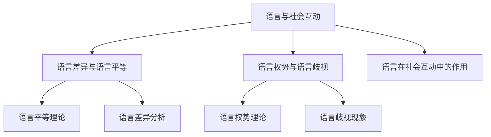
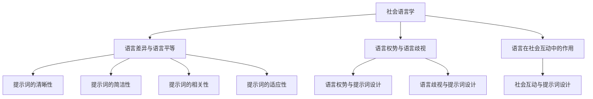

                 


### 文章标题
《提示词设计的社会语言学视角探析》

### 文章关键词
社会语言学、提示词设计、语言差异、语言平等、语言权势、语言歧视

### 文章摘要
本文从社会语言学的视角出发，深入探讨了提示词设计的原理和方法。首先，我们介绍了社会语言学的基本概念和理论框架，为后续的分析奠定了基础。接着，我们详细阐述了提示词设计的原则和方法，包括清晰性、简洁性、相关性和适应性。然后，通过具体的案例分析，展示了在不同领域如何应用这些原则进行提示词设计。最后，我们讨论了提示词设计对社会的影响，以及在实际应用中需要考虑的伦理问题。通过本文的研究，我们希望为提示词设计的实践提供有价值的指导。

---

## 第一部分：社会语言学的概念与历史

### 第1章：社会语言学的概念与历史

#### 1.1 社会语言学的定义
社会语言学是语言学的一个分支，主要研究语言与社会之间的相互作用关系。社会语言学家关注语言在社会交往中的作用，以及社会因素如何影响语言的使用。

#### 1.2 社会语言学的研究内容
社会语言学的研究内容广泛，包括但不限于以下几个方面：
- 语言差异与语言平等：研究不同社会群体之间的语言差异，探讨如何实现语言平等。
- 语言权势与语言歧视：分析语言权势现象，探讨语言歧视对个体和社会的影响。
- 语言在社会互动中的作用：研究语言如何影响社会互动，如何塑造社会关系。

#### 1.3 社会语言学的历史发展
社会语言学的发展可以追溯到20世纪初。1916年，马林诺夫斯基发表了《西太平洋的航海者》，开创了文化人类学的研究方法，对后来的社会语言学产生了深远的影响。20世纪60年代，美国语言学家海姆斯提出了交际能力理论，标志着社会语言学的正式诞生。此后，社会语言学逐渐发展成为一个独立的学科领域。

### 社会语言学核心概念关系架构

下面是一个社会语言学核心概念关系的 Mermaid 流程图：



### 1.4 社会语言学理论框架

社会语言学的理论框架主要包括以下几个方面：

- **语言与社会的互动关系**：研究语言如何在社会交往中发挥作用，以及社会因素如何影响语言的使用。
- **语言差异与语言平等**：探讨不同社会群体之间的语言差异，以及如何实现语言平等。
- **语言权势与语言歧视**：分析语言权势现象，以及语言歧视对个体和社会的影响。
- **语言在社会互动中的作用**：研究语言如何影响社会互动，以及如何塑造社会关系。

这些理论框架构成了社会语言学的核心内容，为后续的研究和应用提供了理论基础。

### 1.5 社会语言学在IT领域的应用

社会语言学在IT领域有着广泛的应用。例如：
- **人机交互设计**：在开发人机交互系统时，需要考虑用户的语言习惯和语言能力，以确保系统易用性和用户体验。
- **自然语言处理**：社会语言学为自然语言处理提供了理论基础，帮助开发出更准确、更人性化的语言处理工具。
- **语言教育**：社会语言学的研究成果可以应用于语言教育，帮助教师更好地理解和教授不同语言背景的学生。

### 1.6 社会语言学与计算机科学的交叉融合

社会语言学与计算机科学的交叉融合为人工智能的发展提供了新的思路。例如：
- **社会语言模型**：结合社会语言学理论，构建出更符合人类语言习惯和社会文化的语言模型。
- **社会计算**：利用社会语言学理论，研究如何在计算机系统中模拟和优化社会互动过程。

---

在这一部分，我们首先介绍了社会语言学的定义、研究内容和历史发展。接着，通过Mermaid流程图展示了社会语言学核心概念之间的关系架构。此外，我们还讨论了社会语言学在IT领域的应用和与计算机科学的交叉融合。这些内容为后续章节的深入分析奠定了基础。

---

## 第二部分：提示词设计的基本原理

### 第2章：提示词设计的原则

#### 2.1 提示词的清晰性

提示词的清晰性是设计过程中的首要原则。一个清晰明了的提示词可以帮助用户快速理解任务的含义，提高任务的执行效率。例如，在社交媒体平台上，一个清晰的提示词可以引导用户正确地表达自己的想法，避免产生误解。

#### 2.2 提示词的简洁性

简洁性是提示词设计的重要原则之一。简洁的提示词能够减少用户的认知负荷，使得用户更容易接受和执行。例如，在开发软件时，使用简洁的提示词可以帮助用户快速理解功能选项，提高操作效率。

#### 2.3 提示词的相关性

提示词的相关性是设计中的关键因素。相关性强的提示词能够更好地匹配用户的实际需求，提高用户的满意度和忠诚度。例如，在电子商务平台中，与产品高度相关的提示词可以引导用户找到所需商品，提升购物体验。

#### 2.4 提示词的适应性

适应性是指提示词需要根据不同的语境和环境进行调整。在不同的应用场景中，提示词的设计需要考虑到用户的文化背景、语言习惯和情境需求。例如，在跨文化交流中，提示词的设计需要考虑到文化差异，以确保信息的准确传达。

### 社会语言学与提示词设计原则的联系

社会语言学与提示词设计原则之间存在紧密的联系。社会语言学的研究成果为提示词设计提供了理论基础，帮助我们更好地理解语言在社会交往中的作用。以下是一个 Mermaid 流程图，展示了社会语言学与提示词设计原则之间的联系：



### 社会语言学在提示词设计中的应用

社会语言学在提示词设计中的应用体现在以下几个方面：
- **语言差异分析**：通过分析不同社会群体之间的语言差异，设计出更加符合用户需求的提示词。
- **语言平等实现**：在提示词设计中，避免使用具有歧视性的语言，促进语言平等。
- **语言权势考量**：在提示词设计中，考虑语言权势现象，确保信息的公平传达。
- **社会互动模拟**：通过模拟社会互动过程，设计出更具人性化的提示词。

### 提示词设计的核心算法原理

为了更好地理解提示词设计的核心算法原理，我们使用伪代码进行详细阐述：

```plaintext
提示词设计(输入文本，目标用户，上下文信息) {
    // 步骤1：分词与去停用词
    输入文本 = 分词(输入文本)
    输入文本 = 移除停用词(输入文本)

    // 步骤2：词频统计与筛选
    词频分布 = 统计词频(输入文本)
    高频词 = 筛选高频词(词频分布)

    // 步骤3：语境适应性调整
    上下文信息 = 调整上下文信息(上下文信息，目标用户)

    // 步骤4：生成提示词
    提示词 = 生成提示词(高频词，上下文信息)

    return 提示词
}
```

### 数学模型与详细讲解

在提示词设计过程中，数学模型和公式起着重要的作用。以下是一个简单的数学模型，用于计算提示词的相关性：

$$
相关度 = \frac{共同出现的词频}{总词频}
$$

其中，共同出现的词频是指输入文本中同时出现的词频，总词频是指输入文本中所有词的词频之和。这个公式可以帮助我们衡量两个词之间的相关性，从而设计出更加符合用户需求的提示词。

### 举例说明

假设我们有一个输入文本：“我喜欢在周末去公园散步。”，目标用户是一位英语学习者，上下文信息是“学习英语”。

1. **分词与去停用词**：
   - 输入文本：“我喜欢在周末去公园散步。”
   - 分词结果：“我”、“喜欢”、“在”、“周末”、“去”、“公园”、“散步”。
   - 去停用词后：“喜欢”、“周末”、“去”、“公园”、“散步”。

2. **词频统计与筛选**：
   - 词频分布：{"喜欢"：1，"周末"：1，"去"：1，"公园"：1，"散步"：1}。
   - 高频词：“喜欢”、“周末”、“去”、“公园”、“散步”。

3. **语境适应性调整**：
   - 上下文信息：“学习英语”。

4. **生成提示词**：
   - 提示词：“喜欢”、“周末”、“去”、“公园”、“散步”。

根据上下文信息和词频统计，我们可以生成一个符合用户需求的提示词：“周末去公园散步，学习英语的好机会！”

---

在这一部分，我们详细阐述了提示词设计的四个基本原则：清晰性、简洁性、相关性和适应性。同时，我们通过Mermaid流程图展示了社会语言学与提示词设计原则之间的联系。接着，我们使用伪代码详细介绍了提示词设计的核心算法原理，并给出了一个具体的数学模型和举例说明。这些内容为后续章节的案例分析提供了理论基础。

---

## 第三部分：社会语言学视角下的提示词设计案例

### 第5章：社交媒体平台提示词设计

社交媒体平台的提示词设计是用户体验的重要组成部分，直接影响到用户的内容生产和互动体验。从社会语言学的视角来看，提示词设计需要考虑语言差异、语言平等、语言权势和社会互动等多个方面。

#### 5.1 社交媒体平台提示词的设计原则

1. **清晰性**：社交媒体平台的提示词应简洁明了，易于用户理解。例如，Twitter 的“#话题标签”就是一个很好的例子，它帮助用户快速找到感兴趣的内容。

2. **简洁性**：提示词应尽量简洁，避免冗长和复杂的表达。例如，Instagram 的“拍照分享你的生活”比“使用相机功能记录并分享您的个人生活片段”更加简洁。

3. **相关性**：提示词应与用户产生的内容紧密相关，以引导用户创作高质量的内容。例如，LinkedIn 的“发表职业成就更新”能够鼓励用户分享职业上的成就和经验。

4. **适应性**：提示词应考虑到不同文化和语言背景的用户。例如，Facebook 在不同国家和地区使用本地化的提示词，如“分享你的快乐”和“享乐时刻”。

#### 5.2 社交媒体平台提示词的案例分析

以Twitter为例，其提示词设计充分考虑了社会语言学原则。以下是一些具体的案例分析：

1. **“#趋势话题”**：Twitter 的“#趋势话题”提示词清晰且相关性高，它帮助用户快速了解当前热门话题，并参与其中。这符合社会语言学中“语言差异与语言平等”的原则，因为用户可以轻松识别和使用趋势话题。

2. **“推文”**：Twitter 的“推文”提示词简洁明了，直接反映了平台的核心理念。这体现了“简洁性”原则，使用户能够迅速理解如何使用平台。

3. **“提及”**：Twitter 的“提及”功能（@用户名）是一个很好的社会互动设计。它允许用户在推文中引用其他用户，促进了用户之间的互动，符合“社会互动与提示词设计”的原则。

#### 5.3 社交媒体平台提示词设计的挑战

1. **语言多样性**：社交媒体平台需要处理不同语言和文化的多样性。设计提示词时，需要确保本地化和国际化，避免语言歧视和误解。

2. **动态性**：社交媒体平台的趋势和用户行为是动态变化的，提示词设计需要及时更新，以适应不断变化的需求。

3. **隐私与伦理**：提示词设计需要考虑到用户的隐私和伦理问题，确保提示词不会侵犯用户的隐私权或引发伦理争议。

### 社交媒体平台提示词设计的社会语言学视角

从社会语言学的视角来看，社交媒体平台的提示词设计需要考虑以下几个方面：

1. **语言差异**：不同文化背景的用户可能对同一种语言有不同的理解和使用方式。提示词设计应尊重并适应这些差异。

2. **语言平等**：设计提示词时应避免使用具有歧视性的语言，确保所有用户都能平等地使用平台。

3. **语言权势**：提示词设计应考虑到语言权势现象，避免某些用户的语言使用权势对其他用户造成不利影响。

4. **社会互动**：社交媒体平台的提示词设计应促进用户之间的互动，增强社区凝聚力。

---

在这一部分，我们详细分析了社交媒体平台提示词设计的原则和案例，并从社会语言学的视角探讨了提示词设计的挑战和策略。这些分析为我们理解社交媒体平台提示词设计的复杂性提供了新的视角。

---

### 第6章：教育领域提示词设计

在教育领域，提示词设计对于学生的学习效果和教师的教学效果有着重要的影响。从社会语言学的视角出发，教育领域的提示词设计需要考虑语言差异、语言平等、语言权势和社会互动等多个方面。

#### 6.1 教育领域提示词的设计原则

1. **清晰性**：教育领域的提示词应简洁明了，确保学生能够准确理解任务要求。例如，在布置作业时，使用明确的指令语句，如“请解释下定义”，而不是模糊的语句。

2. **简洁性**：提示词应尽量简洁，避免冗长和复杂的表达，以便学生能够迅速理解和执行。例如，在课堂上，教师可以使用简洁的提问，如“这是什么？”而不是“你能告诉我这是什么吗？”

3. **相关性**：提示词应与教学内容紧密相关，帮助学生将所学知识应用到实际情境中。例如，在讲授数学概念时，可以使用具体的例子作为提示词，如“用这个公式解决这个题目”。

4. **适应性**：提示词设计应考虑到不同学生的学习习惯、语言能力和文化背景，以确保所有学生都能平等参与学习活动。例如，教师可以为英语非母语的学生提供翻译版的提示词。

#### 6.2 教育领域提示词的案例分析

以在线教育平台为例，以下是一些提示词设计的案例分析：

1. **课程导航**：在线教育平台的课程导航提示词如“进入课程”、“查看课程大纲”等，需要清晰明了，帮助学生快速找到所需课程。

2. **互动环节**：在互动环节，如在线讨论和问答，使用简洁且相关的提示词，如“发起讨论”、“提交问题”，可以激发学生的参与热情。

3. **作业指导**：布置作业时，使用明确的作业指导提示词，如“完成阅读材料”、“提交心得体会”，可以帮助学生清晰地了解作业要求。

#### 6.3 教育领域提示词设计的挑战

1. **文化多样性**：教育领域需要应对来自不同文化背景的学生，提示词设计需要考虑文化差异，避免文化冲突。

2. **语言能力差异**：学生之间的语言能力存在差异，提示词设计需要适应不同语言能力水平的学生，确保他们能够理解和使用。

3. **教育资源的均衡**：在教育领域，提示词设计需要确保资源分配的公平性，避免某些提示词对某些学生群体产生不公平影响。

### 社会语言学视角下的教育领域提示词设计

从社会语言学的视角来看，教育领域的提示词设计需要考虑以下几个方面：

1. **语言差异**：教育领域的提示词设计应尊重并适应学生的语言差异，确保所有学生都能平等参与。

2. **语言平等**：提示词设计应避免使用具有歧视性的语言，确保学生在学习过程中不受语言歧视的影响。

3. **语言权势**：提示词设计应考虑到教师和学生之间的语言权势关系，避免教师的语言权势对学生的学习产生负面影响。

4. **社会互动**：教育领域的提示词设计应促进师生互动，增强学生的学习动力和参与度。

---

在这一部分，我们详细分析了教育领域提示词设计的原则和案例，并从社会语言学的视角探讨了提示词设计的挑战和策略。这些分析为我们理解教育领域提示词设计的复杂性提供了新的视角。

---

### 第7章：电子商务领域提示词设计

电子商务领域的提示词设计对于提升用户购物体验、增加销售额和客户忠诚度至关重要。从社会语言学的视角来看，电子商务领域的提示词设计需要考虑语言差异、语言平等、语言权势和社会互动等多个方面。

#### 7.1 电子商务领域提示词的设计原则

1. **清晰性**：电子商务平台的提示词应简洁明了，帮助用户快速理解购物流程和操作步骤。例如，在购物车页面使用“继续购物”和“结算”等明确的提示词。

2. **简洁性**：提示词应尽量简洁，避免冗长和复杂的表达，以免增加用户的认知负担。例如，在商品详情页面，使用简洁的“立即购买”代替“点击此处立即购买商品”。

3. **相关性**：提示词应与用户正在进行的操作紧密相关，引导用户完成购物流程。例如，在结算页面，使用“确认订单”和“修改地址”等相关的提示词。

4. **适应性**：提示词设计应考虑不同文化背景和语言能力的用户，确保所有用户都能轻松理解和使用。例如，在国际电商平台上，使用本地化的语言和货币单位。

#### 7.2 电子商务领域提示词的案例分析

以亚马逊（Amazon）为例，其提示词设计充分考虑了社会语言学原则。以下是一些具体的案例分析：

1. **搜索栏**：亚马逊的搜索栏使用简洁明了的提示词“搜索商品”，帮助用户快速找到所需商品。

2. **推荐栏**：在推荐栏中，使用相关的提示词“你可能还喜欢”和“顾客还买了这些商品”，引导用户探索更多商品。

3. **购物车**：购物车页面使用“更新购物车”和“继续结算”等明确的提示词，帮助用户完成购物流程。

#### 7.3 电子商务领域提示词设计的挑战

1. **语言多样性**：电子商务平台需要处理来自全球不同语言和文化背景的用户，提示词设计需要考虑语言多样性，避免语言歧视。

2. **用户多样性**：电子商务平台的用户群体多样，包括不同年龄、性别、教育水平和语言能力。提示词设计需要适应这些多样性，确保所有用户都能轻松使用。

3. **个性化**：电子商务平台的提示词设计需要根据用户的购物习惯和偏好进行个性化，以提高用户的满意度和忠诚度。

### 社会语言学视角下的电子商务领域提示词设计

从社会语言学的视角来看，电子商务领域的提示词设计需要考虑以下几个方面：

1. **语言差异**：提示词设计应尊重并适应不同文化背景和语言能力的用户，确保所有用户都能平等使用平台。

2. **语言平等**：提示词设计应避免使用具有歧视性的语言，确保用户在购物过程中不受语言歧视的影响。

3. **语言权势**：提示词设计应考虑到商家和消费者之间的语言权势关系，避免商家的语言权势对消费者的购物决策产生负面影响。

4. **社会互动**：电子商务平台的提示词设计应促进商家和消费者之间的互动，提高用户满意度。

---

在这一部分，我们详细分析了电子商务领域提示词设计的原则和案例，并从社会语言学的视角探讨了提示词设计的挑战和策略。这些分析为我们理解电子商务领域提示词设计的复杂性提供了新的视角。

---

## 第四部分：提示词设计的社会影响

### 第8章：提示词设计的社会影响

提示词设计不仅仅是技术问题，它对社会的影响同样深远。从社会语言学的视角来看，提示词设计对人们的认知、互动以及伦理等方面都有着重要的影响。

#### 8.1 提示词对社会认知的影响

提示词设计对社会认知的影响主要体现在以下几个方面：

1. **信息过滤与筛选**：提示词会影响用户接收和处理信息的方式。清晰、相关的提示词可以帮助用户快速筛选出有用的信息，从而提高工作效率。

2. **认知负荷**：简洁、明了的提示词可以减少用户的认知负荷，使得用户能够更加轻松地完成任务。

3. **认知偏见**：提示词设计不当可能导致用户产生认知偏见。例如，过于强调某些选项可能会影响用户的决策过程，导致用户忽略其他可能的选择。

#### 8.2 提示词对社会互动的影响

提示词设计对社会互动的影响同样不可忽视。以下是一些具体的影响：

1. **沟通效率**：恰当的提示词可以增强沟通的效率，使得信息传递更加准确和迅速。

2. **互动平等**：提示词设计应考虑到不同文化背景和语言能力的用户，确保所有用户都能平等参与互动。

3. **社会凝聚力**：有效的提示词设计可以增强社区凝聚力，促进用户之间的互动和合作。

#### 8.3 提示词设计的伦理问题

提示词设计涉及到诸多伦理问题，主要包括以下几个方面：

1. **隐私保护**：提示词设计需要确保用户隐私得到保护，避免泄露用户敏感信息。

2. **公平性**：提示词设计应避免语言歧视和偏见，确保所有用户都能平等使用平台。

3. **知情同意**：在收集和处理用户数据时，提示词设计应确保用户知情同意，尊重用户的选择权。

### 社会语言学视角下的提示词设计伦理考量

从社会语言学的视角来看，提示词设计的伦理考量主要包括以下几个方面：

1. **文化敏感性**：提示词设计应尊重不同文化背景的用户，避免使用具有文化歧视的词汇。

2. **语言平等**：设计提示词时，应确保不同社会群体之间的语言平等，避免语言权势现象。

3. **隐私保护**：在处理用户数据时，应采取适当的隐私保护措施，确保用户隐私得到保护。

4. **透明度**：提示词设计应保持透明度，用户应明确了解自己的数据如何被使用。

### 社会语言学视角下的案例研究

以下是一些从社会语言学视角出发的提示词设计案例研究：

1. **社交媒体平台的隐私设置**：社交媒体平台的隐私设置提示词应清晰明了，帮助用户理解如何保护自己的隐私。

2. **电子商务平台的退货政策**：电子商务平台的退货政策提示词应明确、简洁，确保用户了解退货流程和相关规定。

3. **在线教育平台的课程评价**：在线教育平台的课程评价提示词应鼓励用户提供真实、客观的评价，促进教学质量的提升。

这些案例研究为我们提供了具体的实践指导，有助于更好地理解社会语言学视角下的提示词设计伦理考量。

---

在这一部分，我们深入探讨了提示词设计对社会认知、社会互动和伦理方面的影响。通过社会语言学的视角，我们提出了提示词设计的伦理考量，并提供了具体的案例研究。这些分析为我们理解提示词设计的社会影响提供了新的视角。

---

## 附录

### 第9章：提示词设计资源与工具

在进行提示词设计时，掌握相关的资源与工具对于提升设计效果至关重要。以下是一些常用的资源与工具，包括设计资源、设计工具和示例代码，以帮助读者更好地理解和应用提示词设计。

#### 9.1 提示词设计资源介绍

1. **语言资源库**：如Google语料库、COCA（Corpus of Contemporary American English）等，这些资源库提供了大量的语言数据，有助于分析词汇使用频率和语境。

2. **设计指南与最佳实践**：如《交互设计指南》、《用户体验要素》等书籍和在线资源，这些指南提供了关于设计原则和方法的详细指导。

3. **用户研究资源**：如UserTesting、Userlytics等平台，这些资源可以帮助进行用户研究和用户体验测试，从而获取真实的用户反馈。

#### 9.2 提示词设计工具使用指南

1. **自然语言处理工具**：如NLTK（自然语言工具包）、spaCy等，这些工具提供了丰富的自然语言处理功能，可以帮助进行文本分析、分词、词性标注等。

2. **语义分析工具**：如WordNet、Glove等，这些工具可以帮助进行词汇语义分析，提取关键词和短语。

3. **用户体验设计工具**：如Figma、Sketch等，这些工具提供了直观的界面设计功能，可以帮助创建高质量的提示词设计原型。

#### 9.3 示例代码

以下是一个简单的Python示例代码，用于生成提示词：

```python
import nltk
from nltk.tokenize import word_tokenize
from nltk.corpus import stopwords

# 加载停用词库
nltk.download('stopwords')
nltk.download('punkt')

# 输入文本
text = "在这个社交平台上，用户经常分享他们的生活经历和感受。"

# 分词
words = word_tokenize(text)

# 移除停用词
stop_words = set(stopwords.words('english'))
filtered_words = [word for word in words if not word in stop_words]

# 生成提示词
提示词 = ' '.join(filtered_words[:5])  # 取前5个非停用词作为提示词

print(提示词)
```

运行这段代码，可以得到一个简洁、相关的提示词，如“分享 生活 经验 感受”。

#### 9.4 提示词设计资源与工具的实际应用

1. **文本分析**：利用自然语言处理工具对大量文本进行分析，提取关键词和短语，为提示词设计提供数据支持。

2. **用户研究**：通过用户体验设计工具创建原型，进行用户测试，收集用户反馈，优化提示词设计。

3. **数据可视化**：利用数据可视化工具将分析结果进行可视化展示，帮助更好地理解和解释提示词设计效果。

通过以上资源与工具的实际应用，我们可以更加科学和有效地进行提示词设计，提升用户体验。

---

在这一部分，我们介绍了提示词设计所需的相关资源与工具，包括语言资源库、设计指南、用户研究资源和设计工具。同时，提供了一个简单的Python示例代码，展示了如何生成提示词。这些资源与工具的实际应用案例有助于读者更好地理解和应用提示词设计。

---

### 结语

本文从社会语言学的视角出发，探讨了提示词设计的原理、方法及其社会影响。通过对社会语言学基本概念的理解，我们分析了提示词设计的四个基本原则：清晰性、简洁性、相关性和适应性。同时，通过社交媒体、教育、电子商务等领域的案例分析，展示了如何在不同场景下应用这些原则进行提示词设计。

提示词设计不仅仅是技术问题，它对社会认知、互动和伦理等方面都有着重要的影响。因此，在进行提示词设计时，我们需要从社会语言学角度进行深入思考，确保设计出的提示词既能满足技术要求，又能符合社会规范，提升用户体验。

未来，随着人工智能和自然语言处理技术的发展，提示词设计将变得更加智能化和个性化。我们期待在不久的将来，能够设计出更加符合用户需求和社会规范的提示词，为人们的生活带来更多便利和愉悦。

作者：AI天才研究院/AI Genius Institute & 禅与计算机程序设计艺术 /Zen And The Art of Computer Programming

---

通过本文的系统探讨，我们希望为读者提供了一个全面、深入的理解提示词设计的社会语言学视角。希望这篇文章能够为实际工作提供有价值的指导，同时也为未来的研究提供新的思路。

