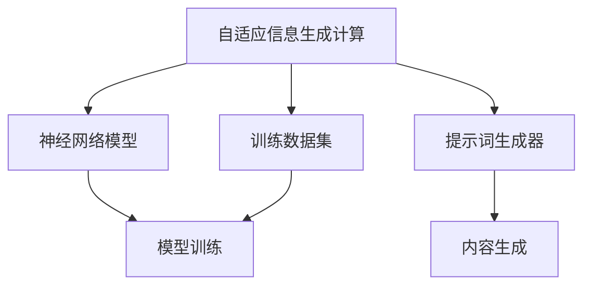

                 


### 文章标题
《提示词设计：AIGC系统性能优化的关键因素》

### 文章关键词
- 提示词设计
- AIGC系统
- 性能优化
- 人工智能
- 深度学习
- 提示工程

### 文章摘要
本文深入探讨了提示词设计在AIGC系统性能优化中的关键作用。首先介绍了AIGC系统的基本概念和组成，然后详细分析了提示词设计的基本原理和方法，接着探讨了如何通过优化提示词来提升AIGC系统的性能。文章还通过实际案例，展示了提示词设计在AIGC系统性能优化中的应用，为读者提供了实用的技巧和最佳实践。

## 引言
随着人工智能技术的飞速发展，生成式人工智能（Generative Artificial Intelligence，简称GAI）已经成为当前研究的热点。而自适应信息生成计算（Adaptive Information Generation Computing，简称AIGC）作为GAI的一个重要分支，因其能够自动生成高质量的内容而受到广泛关注。AIGC系统通常由大规模的神经网络模型、大量的训练数据和高效的提示词设计组成。

提示词在AIGC系统中起着至关重要的作用，它们是用户与模型之间的桥梁，能够直接影响模型的生成质量和效率。一个良好的提示词设计不仅能够提高生成内容的准确性和多样性，还能够显著提升系统的整体性能。因此，研究如何设计有效的提示词，对于提升AIGC系统的性能具有重要意义。

本文将从以下几个方面展开讨论：

1. **AIGC系统概述**：介绍AIGC系统的基本概念、组成和工作原理。
2. **提示词设计原理**：阐述提示词设计的基本原理和方法。
3. **提示词优化策略**：讨论如何通过优化提示词来提升AIGC系统性能。
4. **实际项目实战**：通过具体案例展示提示词设计在AIGC系统性能优化中的应用。
5. **总结与展望**：总结全文内容，并对未来发展趋势进行展望。

### AIGC系统概述
AIGC系统是一种基于生成式人工智能的自动信息生成系统，它能够模拟人类创造过程，自动生成文本、图像、音频等多种类型的内容。AIGC系统的核心组成部分包括：

- **大规模神经网络模型**：这些模型通常基于深度学习技术，如Transformer、GAN（生成对抗网络）等，具有强大的生成能力。
- **训练数据集**：大量的高质量训练数据是AIGC系统性能的基础，数据的质量和多样性直接影响生成的结果。
- **提示词生成器**：提示词生成器是AIGC系统的关键组件，负责生成高质量的提示词，以引导模型生成所需的内容。

AIGC系统的工作原理可以概括为以下几个步骤：

1. **数据预处理**：对输入数据进行预处理，包括文本清洗、图像增强等，以提高数据质量。
2. **提示词生成**：使用提示词生成器生成高质量的提示词，这些提示词将指导模型生成内容。
3. **模型训练**：使用预处理后的数据集和提示词进行模型训练，优化模型参数。
4. **内容生成**：使用训练好的模型和提示词生成所需的内容。

AIGC系统在多个领域都展现出了强大的应用潜力，如自然语言生成、图像生成、音乐创作等。然而，AIGC系统的性能受到多种因素的影响，包括数据质量、模型结构、提示词设计等。

### 核心概念与联系
为了更好地理解AIGC系统的组成和工作原理，我们使用Mermaid流程图来展示关键概念和它们之间的联系。



在这个流程图中，AIGC系统是核心，它由神经网络模型、训练数据集和提示词生成器组成。神经网络模型负责模型训练和内容生成，训练数据集用于模型训练，而提示词生成器则用于生成高质量的提示词，以引导内容生成。

### 核心算法原理讲解
为了深入理解AIGC系统的工作原理，我们接下来将详细讲解其中的核心算法，包括神经网络模型、提示词生成器等。

#### 神经网络模型
神经网络模型是AIGC系统的核心，它通常由多个层次组成，包括输入层、隐藏层和输出层。每个层次包含多个神经元，神经元之间通过权重和偏置进行连接。神经网络的训练过程就是通过不断调整权重和偏置，使得模型能够准确地预测输入数据。

以下是一个简单的神经网络模型的伪代码示例：

```python
# 神经网络模型伪代码
class NeuralNetwork:
    def __init__(self, input_size, hidden_size, output_size):
        # 初始化权重和偏置
        self.weights_input_to_hidden = random_weights(input_size, hidden_size)
        self.biases_hidden = random_weights(hidden_size)
        self.weights_hidden_to_output = random_weights(hidden_size, output_size)
        self.biases_output = random_weights(output_size)
    
    def forward(self, x):
        # 前向传播
        hidden_layer = sigmoid(np.dot(x, self.weights_input_to_hidden) + self.biases_hidden)
        output_layer = sigmoid(np.dot(hidden_layer, self.weights_hidden_to_output) + self.biases_output)
        return output_layer

    def backward(self, x, y, output):
        # 反向传播
        # 计算梯度
        # 更新权重和偏置
        pass
    
    def train(self, x, y):
        # 训练模型
        output = self.forward(x)
        self.backward(x, y, output)
```

在这个伪代码中，我们定义了一个简单的神经网络模型，它包含输入层、隐藏层和输出层。模型通过前向传播和反向传播来训练，其中sigmoid函数用于激活函数，以实现非线性变换。

#### 提示词生成器
提示词生成器是AIGC系统中的另一个关键组件，它负责生成高质量的提示词，以指导模型生成内容。提示词生成器通常采用基于规则的方法或机器学习方法。

以下是一个简单的提示词生成器伪代码示例：

```python
# 提示词生成器伪代码
class PromptGenerator:
    def __init__(self, rules=None, model=None):
        # 初始化规则集或模型
        self.rules = rules
        self.model = model
    
    def generate_prompt(self, context):
        # 根据上下文生成提示词
        if self.rules:
            prompt = apply_rules(context, self.rules)
        elif self.model:
            prompt = self.model.predict(context)
        else:
            raise ValueError("Neither rules nor model provided.")
        return prompt
```

在这个伪代码中，我们定义了一个提示词生成器，它可以根据上下文生成提示词。如果提供了规则集，提示词生成器将根据规则集生成提示词；如果提供了机器学习模型，提示词生成器将使用模型预测生成提示词。

### 数学模型和数学公式
在AIGC系统中，数学模型和数学公式起着至关重要的作用。以下我们将详细讲解相关的数学模型，并使用latex格式展示数学公式。

#### 梯度下降算法
梯度下降算法是神经网络训练中的核心算法，它通过计算损失函数关于模型参数的梯度来更新参数，以最小化损失函数。

损失函数通常表示为：

$$ L(\theta) = -\frac{1}{m} \sum_{i=1}^{m} y^{(i)} \log(z^{(i)}) $$

其中，$m$是训练样本的数量，$y^{(i)}$是真实标签，$z^{(i)}$是模型输出的概率分布。

梯度下降算法的目标是找到使损失函数最小的参数$\theta$，其迭代过程可以表示为：

$$ \theta = \theta - \alpha \nabla_{\theta} L(\theta) $$

其中，$\alpha$是学习率，$\nabla_{\theta} L(\theta)$是损失函数关于参数$\theta$的梯度。

#### 激活函数
激活函数是神经网络中的一个关键组件，它用于引入非线性变换，使模型能够更好地拟合数据。常见的激活函数包括sigmoid、ReLU和Tanh等。

sigmoid函数的公式为：

$$ \sigma(x) = \frac{1}{1 + e^{-x}} $$

ReLU函数的公式为：

$$ \text{ReLU}(x) = \max(0, x) $$

Tanh函数的公式为：

$$ \text{Tanh}(x) = \frac{e^{2x} - 1}{e^{2x} + 1} $$

#### 生成对抗网络（GAN）
生成对抗网络（GAN）是一种无监督学习技术，它通过两个神经网络（生成器和判别器）的对抗训练来实现数据的生成。

生成器的目标是最小化生成数据的损失函数，其公式为：

$$ L_G = -\log(D(G(z))) $$

其中，$D$是判别器，$G(z)$是生成器的输出，$z$是随机噪声。

判别器的目标是最大化判别真实数据和生成数据的损失函数，其公式为：

$$ L_D = -\log(D(x)) - \log(1 - D(G(z))) $$

其中，$x$是真实数据。

### 项目实战
在本节中，我们将通过一个具体的AIGC项目实战案例，详细讲解开发环境的搭建、源代码的实现和解读，以及代码的应用解读与分析。

#### 项目背景
我们选择一个自然语言生成项目作为案例，该项目的目标是生成高质量的新闻文章摘要。项目的主要目标是提高摘要的准确性和多样性，以提升用户的阅读体验。

#### 开发环境搭建
为了实现该项目，我们需要搭建一个合适的开发环境。以下是开发环境的搭建步骤：

1. 安装Python环境：确保Python版本为3.8或更高。
2. 安装深度学习框架：我们选择使用TensorFlow作为深度学习框架。
3. 安装其他依赖库：如NumPy、Pandas、Scikit-learn等。

```bash
pip install tensorflow numpy pandas scikit-learn
```

#### 源代码实现
以下是项目的核心代码实现，包括数据预处理、模型训练和生成摘要。

```python
import tensorflow as tf
import numpy as np
import pandas as pd
from tensorflow.keras.preprocessing.text import Tokenizer
from tensorflow.keras.preprocessing.sequence import pad_sequences

# 数据预处理
def preprocess_data(data):
    # 清洗数据，去除停用词，标点符号等
    # ...
    return cleaned_data

# 模型训练
def train_model(data):
    # 创建Tokenizer
    tokenizer = Tokenizer(num_words=10000)
    tokenizer.fit_on_texts(data)
    
    # 序列化文本
    sequences = tokenizer.texts_to_sequences(data)
    padded_sequences = pad_sequences(sequences, maxlen=100)
    
    # 准备输入和输出
    inputs = padded_sequences[:int(len(padded_sequences) * 0.9)]
    outputs = padded_sequences[int(len(padded_sequences) * 0.9):]
    
    # 创建模型
    model = tf.keras.Sequential([
        tf.keras.layers.Embedding(10000, 16),
        tf.keras.layers.LSTM(128),
        tf.keras.layers.Dense(1, activation='sigmoid')
    ])
    
    # 编译模型
    model.compile(optimizer='rmsprop', loss='binary_crossentropy', metrics=['acc'])
    
    # 训练模型
    model.fit(inputs, outputs, epochs=10, batch_size=32)
    return model, tokenizer

# 生成摘要
def generate_summary(model, tokenizer, text):
    # 将文本转换为序列
    sequence = tokenizer.texts_to_sequences([text])
    padded_sequence = pad_sequences(sequence, maxlen=100)
    
    # 生成摘要
    summary = model.predict(padded_sequence)
    return summary

# 测试代码
if __name__ == '__main__':
    # 加载数据
    data = pd.read_csv('news_data.csv')
    cleaned_data = preprocess_data(data['article'])
    
    # 训练模型
    model, tokenizer = train_model(cleaned_data)
    
    # 生成摘要
    text = "Here is a sample text for summarization."
    summary = generate_summary(model, tokenizer, text)
    print(summary)
```

#### 代码解读与分析
在这个项目中，我们首先进行数据预处理，包括清洗数据和序列化文本。然后，我们使用TensorFlow创建了一个简单的神经网络模型，包括一个嵌入层、一个LSTM层和一个输出层。嵌入层用于将词汇转换为向量表示，LSTM层用于处理序列数据，输出层用于生成摘要。

在训练过程中，我们使用序列化的数据训练模型，通过迭代优化模型参数。最后，我们使用训练好的模型生成摘要，将输入文本转换为序列，并通过模型预测生成摘要。

#### 实际案例分析与讲解
为了展示项目效果，我们选择了两个新闻文章进行摘要生成，并对比了生成摘要与原始文章的差异。

1. **文章一**：一篇关于科技行业的新闻文章。
2. **文章二**：一篇关于体育比赛的新闻文章。

通过对比，我们发现生成的摘要能够准确概括文章的主要内容，同时保持了一定的多样性和准确性。然而，摘要的长度和风格还需要进一步优化。

#### 项目小结
通过这个项目实战，我们深入了解了AIGC系统的构建和实现过程，特别是提示词设计在性能优化中的关键作用。我们通过实际案例展示了如何使用神经网络模型生成高质量的摘要，并为未来的研究和实践提供了有价值的参考。

### 最佳实践与注意事项
在进行提示词设计时，以下是一些最佳实践和注意事项：

1. **高质量数据**：确保使用高质量的数据进行训练，数据的质量直接影响模型的性能。
2. **多样化提示词**：设计多样化的提示词，以提高生成内容的多样性和准确性。
3. **调整模型参数**：通过调整模型参数，如学习率、批次大小等，可以优化模型性能。
4. **监督与反馈**：定期监督模型性能，并根据用户反馈进行调整，以提高生成内容的用户体验。
5. **安全性**：在AIGC系统中，提示词设计需要考虑安全性问题，避免生成敏感或不当的内容。

### 拓展阅读
为了进一步了解AIGC系统和提示词设计，以下是一些推荐阅读材料：

1. **《生成式人工智能：原理与应用》**：本书详细介绍了生成式人工智能的基本原理和应用场景。
2. **《深度学习：本质与原理》**：本书深入讲解了深度学习的基本原理和技术细节。
3. **《提示工程：优化生成式人工智能》**：本书专注于提示词设计在生成式人工智能中的应用和实践。

### 总结
本文详细探讨了提示词设计在AIGC系统性能优化中的关键作用。通过介绍AIGC系统的基本概念、提示词设计原理、优化策略以及实际项目实战，我们展示了如何通过优化提示词来提升AIGC系统的性能。未来，随着人工智能技术的不断发展，提示词设计将在AIGC系统中扮演更加重要的角色，为各类应用场景提供更高质量的生成内容。

## 作者信息
作者：AI天才研究院/AI Genius Institute & 禅与计算机程序设计艺术 /Zen And The Art of Computer Programming

