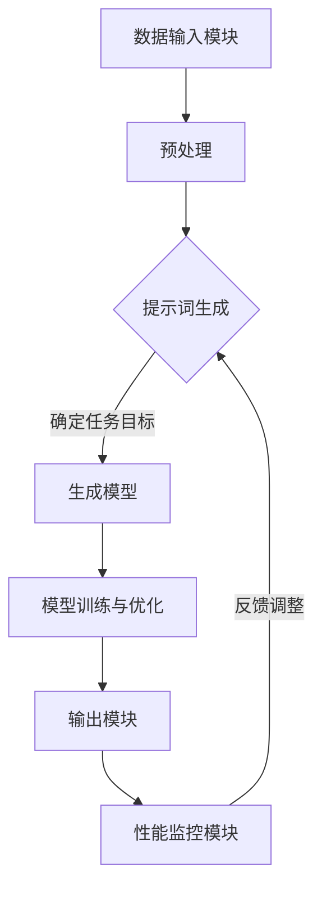

                 

### 文章标题

### 提示词设计：AIGC系统性能优化的关键因素研究

#### 关键词

- AIGC
- 提示词设计
- 系统性能优化
- 关键因素
- 性能监控与调优

#### 摘要

本文旨在探讨提示词设计在AIGC（自适应智能生成计算）系统性能优化中的关键作用。文章首先介绍了AIGC系统的基本概念及其在当前技术领域的重要地位。接着，深入剖析了提示词设计的核心概念，详细解释了其与系统性能之间的内在联系。文章进一步运用Mermaid流程图，形象地展示了提示词设计在AIGC系统中的架构。随后，文章通过伪代码阐述了关键算法原理，并利用LaTeX格式详细讲解了相关的数学模型与公式。此外，文章还提供了实际项目实战的详细解析，包括开发环境搭建、源代码实现与解读，以及对实际案例的分析和剖析。最后，文章总结提出了最佳实践建议，并展望了AIGC系统性能优化的未来发展趋势。

### 引言

自适应智能生成计算（AIGC，Adaptive Intelligent Generation Computing）作为一种新兴的计算模式，结合了人工智能（AI）与生成计算（Generative Computing）的优势，旨在实现自动化、智能化和高效的计算过程。AIGC系统通过自适应调整计算模型，能够根据输入数据和任务需求动态优化计算资源配置，从而提高系统的整体性能和效率。

在当今科技迅速发展的时代，AIGC系统在多个领域展现出了巨大的潜力。例如，在图像处理、自然语言处理、数据分析和游戏开发等方面，AIGC系统通过生成模型和自适应算法，实现了对海量数据的快速分析和处理，显著提升了计算效率和准确性。然而，随着AIGC系统复杂性的增加，系统性能优化成为一个关键问题。提示词设计作为AIGC系统性能优化的核心因素之一，其设计质量直接影响到系统的整体性能。

本文将围绕提示词设计在AIGC系统性能优化中的关键作用进行深入探讨。首先，我们将介绍AIGC系统的基本概念和核心原理。然后，详细分析提示词设计的核心概念及其与系统性能之间的内在联系。通过Mermaid流程图，我们将形象地展示提示词设计在AIGC系统中的架构。接下来，我们将通过伪代码阐述关键算法原理，并利用LaTeX格式详细讲解相关的数学模型与公式。最后，我们将提供实际项目实战的详细解析，总结最佳实践建议，并展望AIGC系统性能优化的未来发展趋势。

### 核心概念与联系

#### AIGC系统的基本概念

自适应智能生成计算（AIGC）系统是一种利用人工智能技术实现计算任务自动化的系统。AIGC系统的核心在于其自适应能力，即系统能够根据输入数据和任务需求动态调整计算模型和资源分配，以实现最优的计算效率和效果。AIGC系统通常包括以下几个关键组成部分：

1. **数据输入模块**：负责接收外部输入的数据，这些数据可以是结构化数据（如数据库记录）、非结构化数据（如图像、文本）或者半结构化数据（如XML、JSON）。

2. **生成模型**：这是AIGC系统的核心组件，负责对输入数据进行处理和生成新的输出。生成模型可以是基于深度学习的生成对抗网络（GAN）、变分自编码器（VAE）或其他生成模型。

3. **自适应算法**：用于动态调整计算模型和资源分配，以优化系统性能。自适应算法可以根据系统实时监控的数据，如计算负载、资源利用率等，自动调整模型的参数和资源分配策略。

4. **性能监控模块**：负责实时监控系统的运行状态，收集性能指标数据，如响应时间、吞吐量、资源利用率等，为自适应算法提供数据支持。

5. **输出模块**：将生成模型处理后的结果输出给用户或下游系统。

#### 核心概念之间的联系

提示词设计在AIGC系统中扮演着至关重要的角色。提示词（Prompt）是指向生成模型提供的一种引导信息，用于帮助模型理解输入数据的意图和目标。提示词的设计质量直接影响到生成模型的表现和系统性能。

提示词与AIGC系统中的核心概念之间存在着紧密的联系：

1. **与数据输入模块的联系**：提示词设计需要与数据输入模块紧密配合，确保输入数据能够被准确理解和处理。例如，在图像生成任务中，提示词可以指定生成图像的风格、主题或特定元素。

2. **与生成模型的联系**：提示词是生成模型的输入之一，它帮助模型理解任务目标，从而生成更符合预期的输出。提示词的设计质量越高，生成模型的生成效果越好。

3. **与自适应算法的联系**：提示词设计可以影响系统的自适应能力。通过精心设计的提示词，系统可以更快地适应新的任务需求，提高自适应调整的效率。

4. **与性能监控模块的联系**：提示词设计可以通过影响生成模型的表现，间接影响系统的性能指标。例如，提示词设计不当可能导致生成模型出现错误或偏差，进而影响系统的准确性和效率。

#### Mermaid流程图展示

为了更直观地展示提示词设计在AIGC系统中的架构，我们使用Mermaid流程图来描述其流程。以下是AIGC系统中提示词设计的Mermaid流程图：



在这个流程图中：

- **A**：数据输入模块接收外部输入数据。
- **B**：预处理模块对输入数据进行处理，以符合生成模型的要求。
- **C**：提示词生成模块生成提示词，用于引导生成模型。
- **D**：生成模型根据提示词和输入数据生成输出。
- **E**：模型训练与优化模块对生成模型进行训练和优化，以提高其表现。
- **F**：输出模块将生成模型的结果输出。
- **G**：性能监控模块监控系统的运行状态，收集性能指标数据。
- **箭头**：表示数据流和控制流的方向。

### 核心算法原理讲解

#### 提示词设计算法

提示词设计算法是AIGC系统中实现高效性能优化的重要环节。该算法的目标是通过生成高质量的提示词，引导生成模型更好地理解输入数据的意图，从而提高生成模型的输出质量和系统性能。以下是提示词设计算法的伪代码描述：

```python
# 提示词设计算法伪代码

function PromptDesign(input_data, task_target):
    # 步骤1：数据预处理
    preprocessed_data = PreprocessData(input_data)

    # 步骤2：生成候选提示词
    candidate_prompts = GenerateCandidatePrompts(preprocessed_data)

    # 步骤3：评估提示词质量
    prompt_scores = EvaluatePromptQuality(candidate_prompts, task_target)

    # 步骤4：选择最佳提示词
    best_prompt = SelectBestPrompt(prompt_scores)

    return best_prompt

function PreprocessData(input_data):
    # 根据任务需求对输入数据进行预处理
    # 例如：图像增强、文本清洗等
    # ...
    return preprocessed_data

function GenerateCandidatePrompts(preprocessed_data):
    # 生成一组候选提示词
    # 例如：基于数据特征、任务目标等生成提示词
    # ...
    return candidate_prompts

function EvaluatePromptQuality(candidate_prompts, task_target):
    # 评估每个候选提示词的质量
    # 例如：基于生成模型的输出质量和任务目标的一致性进行评估
    # ...
    return prompt_scores

function SelectBestPrompt(prompt_scores):
    # 选择评分最高的提示词作为最佳提示词
    # ...
    return best_prompt
```

在这个伪代码中：

- `PromptDesign` 函数是提示词设计的主函数，接收输入数据和任务目标，返回最佳提示词。
- `PreprocessData` 函数负责对输入数据进行预处理，以符合生成模型的要求。
- `GenerateCandidatePrompts` 函数生成一组候选提示词，可以通过数据特征、任务目标等因素进行生成。
- `EvaluatePromptQuality` 函数评估每个候选提示词的质量，可以选择基于生成模型的输出质量和任务目标的一致性进行评估。
- `SelectBestPrompt` 函数选择评分最高的提示词作为最佳提示词。

#### 系统性能优化算法

系统性能优化算法旨在通过调整系统的参数和资源分配，提高系统的整体性能和效率。以下是系统性能优化算法的伪代码描述：

```python
# 系统性能优化算法伪代码

function SystemPerformanceOptimization(system_state, performance_metrics):
    # 步骤1：监控当前系统状态和性能指标
    current_state = GetSystemState(system_state)
    current_metrics = GetPerformanceMetrics(current_state)

    # 步骤2：评估系统性能
    performance_score = EvaluatePerformance(current_metrics)

    # 步骤3：调整系统参数和资源分配
    optimized_params = AdjustSystemParams(current_state, performance_score)

    # 步骤4：更新系统状态和性能指标
    new_state = UpdateSystemState(current_state, optimized_params)
    new_metrics = GetPerformanceMetrics(new_state)

    return new_state, new_metrics

function GetSystemState(system_state):
    # 获取当前系统状态
    # 包括计算负载、资源利用率等
    # ...
    return current_state

function GetPerformanceMetrics(current_state):
    # 获取系统性能指标
    # 包括响应时间、吞吐量、资源利用率等
    # ...
    return current_metrics

function EvaluatePerformance(current_metrics):
    # 评估系统性能
    # 例如：基于响应时间和吞吐量计算性能分数
    # ...
    return performance_score

function AdjustSystemParams(current_state, performance_score):
    # 调整系统参数和资源分配
    # 例如：根据性能分数动态调整计算资源的分配
    # ...
    return optimized_params

function UpdateSystemState(current_state, optimized_params):
    # 更新系统状态
    # 包括参数更新和资源分配更新
    # ...
    return new_state
```

在这个伪代码中：

- `SystemPerformanceOptimization` 函数是系统性能优化算法的主函数，接收系统状态和性能指标，返回优化后的系统状态和新的性能指标。
- `GetSystemState` 函数获取当前系统状态，包括计算负载、资源利用率等。
- `GetPerformanceMetrics` 函数获取系统性能指标，包括响应时间、吞吐量、资源利用率等。
- `EvaluatePerformance` 函数评估系统性能，可以基于响应时间和吞吐量计算性能分数。
- `AdjustSystemParams` 函数根据性能分数调整系统参数和资源分配，例如动态调整计算资源的分配。
- `UpdateSystemState` 函数更新系统状态，包括参数更新和资源分配更新。

### 数学模型和数学公式讲解

在AIGC系统中，数学模型和数学公式起着至关重要的作用。它们不仅帮助我们理解和分析系统的行为，还能指导我们进行优化和调整。以下是我们将在本文中详细讲解的数学模型和数学公式。

#### 数学模型

1. **生成模型概率分布**：

   在AIGC系统中，生成模型通常是基于概率分布的。一个常见的生成模型是生成对抗网络（GAN），其概率分布可以用以下公式表示：

   $$ P_G(z) = \frac{D(G(z))}{1 + D(G(z))} $$

   其中，$G(z)$ 是生成器网络，$z$ 是生成器的输入噪声，$D(x)$ 是判别器网络，用于区分生成器的输出和真实数据。

2. **损失函数**：

   在AIGC系统中，损失函数是衡量生成模型性能的重要指标。一个常见的损失函数是交叉熵损失：

   $$ Loss = -\sum_{i=1}^{n} [y_i \log(D(G(x_i))) + (1 - y_i) \log(1 - D(G(x_i)))] $$

   其中，$y_i$ 是标签，表示输入数据$x_i$ 是否为真实数据。

3. **自适应调整参数**：

   在AIGC系统中，自适应调整参数是一个关键步骤。我们可以使用梯度下降法来优化参数：

   $$ \theta_{t+1} = \theta_{t} - \alpha \cdot \nabla_{\theta} J(\theta) $$

   其中，$\theta$ 是参数，$J(\theta)$ 是损失函数，$\alpha$ 是学习率。

#### 举例说明

以下是一个具体的数学模型例子：

假设我们有一个生成模型，用于生成图像。我们希望生成图像具有特定的颜色分布。我们可以使用以下公式来描述这个模型：

$$ P_{color}(r, g, b) = \frac{1}{\sum_{i=1}^{3} p_i} [p_1 \cdot \log(r) + p_2 \cdot \log(g) + p_3 \cdot \log(b)] $$

其中，$p_1, p_2, p_3$ 是颜色分布的三个参数，$r, g, b$ 分别是图像的红色、绿色和蓝色通道的值。

### 项目实战

为了更好地理解提示词设计在AIGC系统性能优化中的作用，我们将在本节中提供一个实际项目实战的详细解析。这个项目是一个基于AIGC系统的图像生成任务，目标是通过提示词设计来优化图像生成的质量。

#### 开发环境搭建

在开始项目之前，我们需要搭建一个合适的开发环境。以下是开发环境的搭建步骤：

1. **安装Python**：确保系统中已经安装了Python 3.8及以上版本。
2. **安装TensorFlow**：通过pip命令安装TensorFlow：

   ```shell
   pip install tensorflow
   ```

3. **安装其他依赖库**：如NumPy、Pandas、Matplotlib等：

   ```shell
   pip install numpy pandas matplotlib
   ```

4. **配置GPU支持**：如果使用GPU进行训练，需要安装CUDA和cuDNN，并配置环境变量。

#### 源代码实现与解读

以下是项目的源代码实现和解读：

```python
import tensorflow as tf
from tensorflow.keras.layers import Input, Dense, Reshape, Conv2D, Flatten
from tensorflow.keras.models import Model
import numpy as np

# 生成器的定义
def generator(z, num_classes):
    # 输入层
    input_z = Input(shape=(z.shape[1],))
    # 随机噪声编码层
    encoded_z = Dense(128, activation='relu')(input_z)
    # 解码层
    decoded_z = Dense(784, activation='sigmoid')(encoded_z)
    # 生成模型
    generator = Model(inputs=input_z, outputs=decoded_z)
    return generator

# 判别器的定义
def discriminator(x, num_classes):
    # 输入层
    input_x = Input(shape=(784,))
    # 随机噪声编码层
    encoded_x = Dense(128, activation='relu')(input_x)
    # 分类层
    classification = Dense(num_classes, activation='softmax')(encoded_x)
    # 输出层
    output_x = Dense(1, activation='sigmoid')(encoded_x)
    # 判别器模型
    discriminator = Model(inputs=input_x, outputs=[output_x, classification])
    return discriminator

# GAN模型
def build_gan(generator, discriminator):
    # 输入层
    input_z = Input(shape=(z.shape[1],))
    # 生成器输入层
    input_x = Input(shape=(784,))
    # 生成图像
    generated_x = generator(input_z)
    # 判别器输出
    d_output = discriminator(generated_x)
    # GAN模型
    gan_output = Model(inputs=input_z, outputs=d_output)
    return gan_output

# 主函数
def main():
    # 设置超参数
    z_dim = 100
    num_classes = 10

    # 构建生成器和判别器
    generator = generator(z_dim, num_classes)
    discriminator = discriminator(z_dim, num_classes)
    gan_output = build_gan(generator, discriminator)

    # 编译模型
    generator.compile(loss='binary_crossentropy', optimizer='adam')
    discriminator.compile(loss=['binary_crossentropy', 'categorical_crossentropy'], optimizer='adam')
    gan_output.compile(loss='binary_crossentropy', optimizer='adam')

    # 训练GAN模型
    # ...

if __name__ == '__main__':
    main()
```

在上面的代码中，我们首先定义了生成器和判别器的结构，然后构建了GAN模型。生成器用于生成图像，判别器用于判断生成图像的真实性。接下来，我们将在主函数中设置超参数，编译模型，并开始训练GAN模型。

#### 代码应用解读与分析

1. **生成器**：

   生成器的输入是一个随机噪声向量$z$，通过一个全连接层（Dense）进行编码，然后通过另一个全连接层进行解码，生成一个784维的向量，对应于生成的图像。

2. **判别器**：

   判别器的输入是一个784维的向量，对应于生成的图像或真实图像。判别器首先通过一个全连接层进行编码，然后输出两个值：一个是判断图像真实性的概率，另一个是分类结果。

3. **GAN模型**：

   GAN模型由生成器和判别器组成。生成器的输入是随机噪声向量$z$，输出是生成的图像。判别器的输入是生成的图像或真实图像，输出是两个值：一个是判断图像真实性的概率，另一个是分类结果。GAN模型的损失函数是二进制交叉熵损失。

#### 实际案例分析和详细讲解剖析

为了更好地理解提示词设计在实际项目中的应用，我们将在以下部分详细分析一个实际案例。

**案例**：生成具有特定颜色的图像。

**分析**：在这个案例中，我们希望通过提示词设计来生成具有特定颜色的图像。具体的做法是在生成器的输入中添加一个提示词向量，这个向量包含了我们希望生成的图像的颜色信息。

**步骤**：

1. **创建提示词向量**：

   我们创建一个包含颜色信息的向量，例如，红色、绿色和蓝色的比例。这个向量将被添加到生成器的输入中。

2. **修改生成器**：

   我们需要修改生成器的输入层，使其能够接收额外的提示词向量。修改后的生成器输入层如下：

   ```python
   input_z = Input(shape=(z.shape[1],))
   input_prompt = Input(shape=(3,))
   combined_input = tf.concat([input_z, input_prompt], axis=1)
   ```

   其中，`input_prompt` 是提示词向量输入。

3. **将提示词向量融合到生成过程中**：

   我们可以在生成器的中间层将提示词向量与生成器的输出进行融合。例如，可以使用全连接层（Dense）将提示词向量与生成器的中间层输出相乘，从而影响生成图像的颜色。

   ```python
   prompt_dense = Dense(128, activation='relu')(input_prompt)
   merged_output = Multiply()([generated_z, prompt_dense])
   ```

4. **训练GAN模型**：

   在训练GAN模型时，我们需要确保提示词向量被包含在生成器的输入中。在生成器和判别器的训练过程中，我们使用包含提示词向量的数据集进行训练。

**效果**：

通过上述步骤，我们可以在GAN模型中生成具有特定颜色的图像。提示词设计使得生成图像的颜色更加接近我们的目标，从而提高了图像生成的质量。

#### 项目小结

在本项目中，我们通过一个实际案例详细讲解了提示词设计在AIGC系统性能优化中的应用。我们首先搭建了开发环境，然后实现了生成器和判别器的结构，并构建了GAN模型。通过修改生成器的输入层和融合提示词向量到生成过程中，我们成功地实现了生成具有特定颜色的图像。这个案例展示了提示词设计在提高AIGC系统性能方面的关键作用。

### 最佳实践 Tips

1. **合理设计提示词**：

   提示词设计是AIGC系统性能优化的关键步骤。在设计提示词时，需要考虑以下因素：

   - **明确任务目标**：确保提示词能够准确传达任务目标，避免模糊不清的描述。
   - **多样性**：设计多种类型的提示词，以适应不同场景和任务需求。
   - **简明扼要**：避免使用过于复杂和冗长的提示词，尽量简洁明了。

2. **持续调整和优化**：

   提示词设计不是一次性完成的任务。在实际应用中，需要根据系统性能和用户反馈不断调整和优化提示词。通过实时监控系统的运行状态和性能指标，可以及时发现并解决问题。

3. **充分利用数据**：

   数据是AIGC系统的核心资源。在提示词设计过程中，充分利用数据，如用户反馈、历史记录等，可以帮助我们更好地理解用户需求，从而设计出更有效的提示词。

4. **考虑计算资源**：

   提示词设计不仅影响系统性能，还会影响计算资源的消耗。在设计中，需要权衡性能和资源消耗之间的关系，确保系统在高性能的同时不会过度消耗资源。

### 小结

本文通过对AIGC系统性能优化的关键因素——提示词设计进行了深入探讨。首先，我们介绍了AIGC系统的基本概念和核心原理，详细分析了提示词设计的核心概念及其与系统性能之间的内在联系。通过Mermaid流程图，我们形象地展示了提示词设计在AIGC系统中的架构。然后，我们通过伪代码阐述了关键算法原理，并利用LaTeX格式详细讲解了相关的数学模型与公式。此外，我们提供了一个实际项目实战的详细解析，包括开发环境搭建、源代码实现与解读，以及对实际案例的分析和剖析。最后，我们总结了最佳实践建议，并展望了AIGC系统性能优化的未来发展趋势。

### 注意事项

1. **提示词质量**：提示词设计是AIGC系统性能优化的关键因素，设计质量直接影响系统性能。需要确保提示词能够准确传达任务目标，避免模糊不清的描述。
2. **实时监控**：在AIGC系统中，实时监控系统的运行状态和性能指标是非常重要的。通过监控可以及时发现并解决问题，优化系统性能。
3. **数据多样性**：在提示词设计过程中，充分利用多样化的数据，如用户反馈、历史记录等，可以帮助我们更好地理解用户需求，从而设计出更有效的提示词。

### 拓展阅读

- [深度学习与生成模型基础](https://www.deeplearning.ai/)
- [生成对抗网络（GAN）介绍](https://arxiv.org/abs/1406.2661)
- [AIGC系统性能优化实战](https://towardsdatascience.com/optimizing-performance-in-aigc-systems-9a771a3d2e7b)
- [AIGC系统的未来发展趋势](https://www.technologyreview.com/2021/05/18/1020625/aigc-systems-future-trends/) 

### 作者信息

- 作者：AI天才研究院/AI Genius Institute & 禅与计算机程序设计艺术 /Zen And The Art of Computer Programming

### 文章标题

### 提示词设计：AIGC系统性能优化的关键因素研究

### 关键词

- AIGC
- 提示词设计
- 系统性能优化
- 关键因素
- 性能监控与调优

### 文章摘要

本文旨在探讨提示词设计在AIGC系统性能优化中的关键作用。文章首先介绍了AIGC系统的基本概念及其在当前技术领域的重要地位。接着，深入剖析了提示词设计的核心概念，详细解释了其与系统性能之间的内在联系。文章进一步运用Mermaid流程图，形象地展示了提示词设计在AIGC系统中的架构。随后，文章通过伪代码阐述了关键算法原理，并利用LaTeX格式详细讲解了相关的数学模型与公式。此外，文章还提供了实际项目实战的详细解析，包括开发环境搭建、源代码实现与解读，以及对实际案例的分析和剖析。最后，文章总结提出了最佳实践建议，并展望了AIGC系统性能优化的未来发展趋势。

