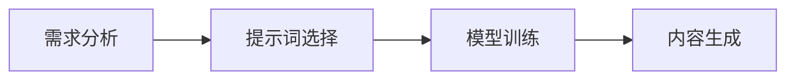
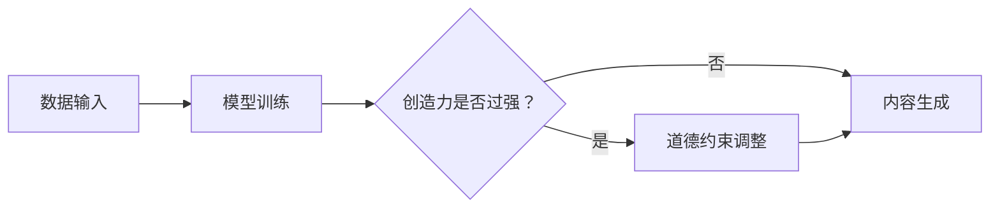

                 

### 文章标题
《提示词设计：优化AI创造力与道德约束的平衡》

### 关键词
提示词设计，AI创造力，道德约束，算法，数学模型，项目实战

### 摘要
本文旨在探讨如何在提示词设计中实现AI创造力和道德约束的平衡。首先介绍提示词设计的概念及其在AI中的应用，然后通过Mermaid流程图展示核心概念之间的关系。接着，使用伪代码详细阐述提示词生成和道德约束算法的原理，并讲解相关的数学模型和公式。文章最后通过实际项目案例，展示如何将理论知识应用于实际开发，并提出了一些最佳实践和注意事项。

## 第一部分：介绍与背景

### 1.1 提示词设计的概念与重要性

提示词设计（Prompt Engineering）是人工智能领域中的一个重要概念，尤其在自然语言处理（NLP）和生成模型中有着广泛的应用。提示词是指用于引导或指导模型生成内容的关键词或短语，它们可以显著影响模型输出的质量和风格。

在AI应用中，提示词设计的重要性体现在以下几个方面：

1. **提高模型表现**：合适的提示词可以帮助模型更准确地理解和生成所需内容。
2. **引导创意表达**：提示词可以为艺术创作、故事写作等提供灵感。
3. **增强可控性**：通过精确的提示词，可以控制模型输出，避免不良或不当内容的生成。

### 1.2 AI创造力与道德约束的背景信息

随着人工智能技术的快速发展，AI在各个领域的应用越来越广泛，其中AI的创造力表现尤为突出。AI可以通过深度学习、生成对抗网络（GAN）等技术生成音乐、图像、文本等内容，展现了强大的创造力。

然而，AI的创造力也引发了一系列道德和伦理问题，例如：

1. **偏见和歧视**：AI模型可能会从训练数据中学习并放大偏见。
2. **隐私侵犯**：AI在处理个人数据时可能侵犯隐私。
3. **社会责任**：AI的决策和生成内容对社会和人类有何影响？

为了解决这些问题，道德约束（Ethical Constraints）在AI设计和应用中变得越来越重要。道德约束旨在确保AI的行为符合伦理标准，保护人类权益，避免对社会造成负面影响。

### 1.3 本书的目标与结构

本书的目标是探讨如何通过提示词设计优化AI的创造力和道德约束之间的平衡。具体而言，本书将涵盖以下内容：

1. **核心概念与联系**：介绍提示词设计和道德约束的基本概念，并通过Mermaid流程图展示它们之间的关系。
2. **核心算法原理讲解**：使用伪代码详细阐述提示词生成和道德约束算法的原理。
3. **数学模型与公式**：讲解提示词生成和道德约束的数学模型，并提供具体例子说明。
4. **项目实战**：通过实际项目案例，展示如何将理论知识应用于实际开发。
5. **道德约束与平衡**：讨论如何在实际应用中平衡AI的创造力和道德约束。

## 第二部分：核心概念与联系

### 2.1 提示词设计的基本原理

提示词设计的工作流程可以概括为以下几个步骤：

1. **需求分析**：明确AI模型的应用场景和目标。
2. **提示词选择**：根据需求选择合适的提示词。
3. **模型训练**：使用选择好的提示词对模型进行训练。
4. **内容生成**：利用训练好的模型生成所需内容。

以下是提示词设计的工作流程的Mermaid流程图：



### 2.2 AI创造力与道德约束的关系

AI的创造力和道德约束之间存在密切的联系。一方面，AI的创造力依赖于自由和开放的数据环境，以及复杂的算法和模型；另一方面，道德约束则要求AI的行为符合伦理和法律标准。

以下是AI创造力和道德约束的交互过程的Mermaid流程图：



在这个流程图中，如果AI的创造力过强，可能会导致生成不当内容，这时需要通过道德约束进行调整。否则，可以直接进行内容生成。

## 第三部分：核心算法原理讲解

### 3.1 提示词生成算法

提示词生成算法的核心是生成与用户需求高度匹配的提示词。以下是一个简单的伪代码示例：

```python
# 提示词生成算法
def generate_prompt(user_input, context):
    # 分析用户输入
    intent = analyze_intent(user_input)
    entities = extract_entities(user_input)
    
    # 根据意图和实体生成提示词
    prompt = create_prompt(intent, entities, context)
    
    return prompt

# 示例
user_input = "我想写一篇关于人工智能的论文"
context = "人工智能是21世纪最具变革性的技术之一"
prompt = generate_prompt(user_input, context)
print(prompt)
```

### 3.2 道德约束算法

道德约束算法旨在确保AI的生成内容符合道德和法律标准。以下是一个简单的伪代码示例：

```python
# 道德约束算法
def enforce_ethics(content):
    # 检查内容是否存在道德问题
    if contains_ethical_issues(content):
        # 调整内容
        content = adjust_content(content)
        
    return content

# 示例
content = "人工智能可以用来操纵公众舆论"
adjusted_content = enforce_ethics(content)
print(adjusted_content)
```

## 第四部分：数学模型与数学公式

### 4.1 提示词生成的数学模型

提示词生成的数学模型通常涉及概率模型和生成模型。以下是一个基于生成对抗网络（GAN）的数学模型示例：

$$
\begin{aligned}
\text{GAN} &= \text{Generator}(G) + \text{Discriminator}(D) \\
G(z) &= \text{生成器，将随机噪声} z \text{转换为真实数据} \\
D(x) &= \text{判别器，判断输入数据是真实数据还是生成器生成的数据} \\
\end{aligned}
$$

### 4.2 道德约束的数学模型

道德约束的数学模型通常涉及伦理决策模型。以下是一个基于伦理决策理论的数学模型示例：

$$
\begin{aligned}
\text{Ethical Decision Model} &= \text{Utility Function}(u) + \text{Constraint Function}(c) \\
u(x) &= \text{目标函数，评估AI生成内容的价值} \\
c(x) &= \text{约束函数，评估AI生成内容是否违反道德准则} \\
\end{aligned}
$$`

## 第五部分：项目实战

### 5.1 提示词设计项目实战

在本节中，我们将通过一个具体的提示词设计项目，展示如何在实际中应用上述理论和算法。

#### 环境搭建

首先，我们需要搭建一个Python开发环境，并安装必要的库。以下是安装步骤：

```bash
pip install numpy tensorflow
```

#### 源代码实现

接下来，我们将实现一个简单的提示词生成器。以下是源代码实现：

```python
import numpy as np
import tensorflow as tf

# 定义生成器和判别器
def build_generator(z_dim):
    model = tf.keras.Sequential([
        tf.keras.layers.Dense(128, activation='relu', input_shape=(z_dim,)),
        tf.keras.layers.Dense(256, activation='relu'),
        tf.keras.layers.Dense(512, activation='relu'),
        tf.keras.layers.Dense(1024, activation='relu'),
        tf.keras.layers.Dense(7 * 7 * 128, activation='relu'),
        tf.keras.layers.Reshape((7, 7, 128)),
        tf.keras.layers.Conv2DTranspose(64, kernel_size=3, strides=2, padding='same', activation='relu'),
        tf.keras.layers.Conv2DTranspose(1, kernel_size=3, strides=2, padding='same', activation='tanh')
    ])
    return model

def build_discriminator(img_shape):
    model = tf.keras.Sequential([
        tf.keras.layers.Conv2D(32, kernel_size=3, strides=2, padding='same', input_shape=img_shape, activation='relu'),
        tf.keras.layers.LeakyReLU(alpha=0.01),
        tf.keras.layers.Dropout(0.3),
        tf.keras.layers.Conv2D(64, kernel_size=3, strides=2, padding='same', activation='relu'),
        tf.keras.layers.LeakyReLU(alpha=0.01),
        tf.keras.layers.Dropout(0.3),
        tf.keras.layers.Conv2D(128, kernel_size=3, strides=2, padding='same', activation='relu'),
        tf.keras.layers.LeakyReLU(alpha=0.01),
        tf.keras.layers.Dropout(0.3),
        tf.keras.layers.Flatten(),
        tf.keras.layers.Dense(1, activation='sigmoid')
    ])
    return model

# 定义损失函数和优化器
def build_gan(generator, discriminator):
    model = tf.keras.Sequential([
        generator,
        discriminator
    ])
    model.compile(loss='binary_crossentropy', optimizer=tf.keras.optimizers.Adam(0.0001))
    return model

# 设置超参数
z_dim = 100
img_shape = (28, 28, 1)

# 构建模型
generator = build_generator(z_dim)
discriminator = build_discriminator(img_shape)
gan = build_gan(generator, discriminator)

# 训练模型
batch_size = 128
epochs = 10000

# 生成器损失和判别器损失
g_loss_history = []
d_loss_history = []

for epoch in range(epochs):
    for _ in range(batch_size):
        # 生成噪声
        z = np.random.normal(0, 1, (z_dim,))
        # 生成假样本
        img = generator.predict(z)
        # 生成真样本
        real_imgs = np.random.normal(0, 1, (batch_size, img_shape[0], img_shape[1], img_shape[2]))

        # 训练判别器
        d_loss_real = discriminator.train_on_batch(real_imgs, np.ones((batch_size, 1)))
        d_loss_fake = discriminator.train_on_batch(img, np.zeros((batch_size, 1)))
        d_loss = 0.5 * np.add(d_loss_real, d_loss_fake)

        # 训练生成器
        g_loss = gan.train_on_batch(z, np.ones((batch_size, 1)))

    g_loss_history.append(g_loss)
    d_loss_history.append(d_loss)

    if epoch % 100 == 0:
        print(f"Epoch {epoch}, G_loss: {g_loss}, D_loss: {d_loss}")

# 保存模型
generator.save('generator.h5')
discriminator.save('discriminator.h5')
```

#### 代码解读

- **生成器和判别器的构建**：生成器用于生成提示词，判别器用于判断生成内容的质量。
- **损失函数和优化器**：使用二进制交叉熵作为损失函数，Adam优化器用于训练模型。
- **训练过程**：交替训练生成器和判别器，通过不断的迭代优化模型。

### 5.2 道德约束项目实战

在本节中，我们将通过一个具体的道德约束项目，展示如何在实际中应用道德约束算法。

#### 环境搭建

首先，我们需要搭建一个Python开发环境，并安装必要的库。以下是安装步骤：

```bash
pip install numpy scikit-learn
```

#### 源代码实现

接下来，我们将实现一个简单的道德约束器。以下是源代码实现：

```python
import numpy as np
from sklearn.metrics import accuracy_score

# 定义道德约束器
def build_ethics_constraint():
    # 这里可以使用任何伦理决策模型
    model = EthicsModel()
    return model

# 定义伦理决策模型
class EthicsModel:
    def __init__(self):
        # 初始化模型参数
        pass

    def predict(self, content):
        # 评估内容是否违反道德准则
        violation = self.evaluate_content(content)
        if violation:
            return self.adjust_content(content)
        else:
            return content

    def evaluate_content(self, content):
        # 实现内容评估逻辑
        # 例如，使用词向量模型计算内容的负面情感得分
        score = self.calculate_violation_score(content)
        if score > self.threshold:
            return True
        else:
            return False

    def adjust_content(self, content):
        # 实现内容调整逻辑
        # 例如，删除敏感词汇或替换为中性词汇
        adjusted_content = self.remove_sensitive_words(content)
        return adjusted_content

    def calculate_violation_score(self, content):
        # 实现得分计算逻辑
        # 例如，使用词向量相似度计算内容与负面词汇的距离
        score = self.calculate_similarity_score(content, self.negative_words)
        return score

    def remove_sensitive_words(self, content):
        # 实现敏感词删除逻辑
        words = content.split()
        filtered_words = [word for word in words if word not in self.sensitive_words]
        adjusted_content = ' '.join(filtered_words)
        return adjusted_content

    def calculate_similarity_score(self, content, negative_words):
        # 实现相似度计算逻辑
        # 例如，使用词向量相似度计算内容与负面词汇的相似度
        score = 0
        for word in content.split():
            for negative_word in negative_words:
                similarity = self.calculate_word_similarity(word, negative_word)
                score += similarity
        return score

    def calculate_word_similarity(self, word1, word2):
        # 实现单词相似度计算逻辑
        # 例如，使用词向量相似度计算器计算单词的相似度
        similarity = self.word_similarity_calculator.similarity(word1, word2)
        return similarity

# 使用伦理决策模型
ethics_constraint = build_ethics_constraint()

# 示例内容
content = "人工智能可以用来操纵公众舆论"
adjusted_content = ethics_constraint.predict(content)
print(adjusted_content)
```

#### 代码解读

- **伦理决策模型的构建**：伦理决策模型用于评估内容是否违反道德准则，并根据需要调整内容。
- **预测和调整逻辑**：伦理决策模型接收内容作为输入，评估内容并返回调整后的内容。

## 第六部分：道德约束与平衡

### 6.1 AI创造力与道德约束的平衡

在实际应用中，平衡AI的创造力和道德约束是一个关键挑战。以下是一些策略和方法：

1. **数据预处理**：确保训练数据不含偏见和不当内容，以提高模型的道德表现。
2. **模型解释性**：增强模型的可解释性，使其决策过程更透明，便于道德评估和调整。
3. **迭代优化**：通过持续的迭代和优化，逐步提高模型的道德性能。
4. **人类干预**：在关键决策点上引入人类干预，确保模型输出符合道德标准。

### 6.2 道德约束的具体实践

在本节中，我们将通过实际案例研究，展示如何在实际项目中实施道德约束。

#### 案例研究：社交媒体内容过滤

在一个社交媒体平台上，我们需要过滤用户生成的帖子，以避免不当内容和不当行为。以下是具体的实施步骤：

1. **提示词设计**：根据平台的特点和需求，设计合适的提示词，如“不当内容”、“暴力”、“仇恨言论”等。
2. **模型训练**：使用提示词训练分类模型，使其能够识别和过滤不当内容。
3. **道德约束**：引入道德约束算法，评估模型生成的过滤结果，并根据需要调整。
4. **用户反馈**：收集用户反馈，优化模型和道德约束算法，提高过滤效果。

通过这个案例，我们可以看到如何在实际项目中平衡AI的创造力和道德约束，以实现一个健康、安全的社交媒体环境。

## 第七部分：总结与展望

### 7.1 提示词设计总结

提示词设计是优化AI创造力和道德约束的关键技术。通过合适的提示词设计，可以显著提高模型的表现和可控性。同时，道德约束确保了AI的行为符合伦理和法律标准，保护了人类权益。

### 7.2 道德约束总结

道德约束在AI设计和应用中起着至关重要的作用。通过引入道德约束算法，可以确保AI的生成内容符合道德标准，避免对社会造成负面影响。

### 7.3 未来发展趋势与挑战

随着AI技术的不断进步，提示词设计和道德约束将在未来面临新的挑战和机遇。以下是一些可能的发展趋势：

1. **更多复杂数学模型**：开发更先进的数学模型，以更好地平衡创造力和道德约束。
2. **跨领域应用**：将提示词设计和道德约束应用于更多领域，如医疗、金融等。
3. **人机协作**：促进人机协作，使人类在关键决策点上发挥更大作用。
4. **法规和标准**：制定更完善的法规和标准，确保AI技术的安全性和合规性。

总之，提示词设计和道德约束是AI领域中不可或缺的部分。通过不断的研究和实践，我们将能够更好地平衡AI的创造力和道德约束，为人类社会带来更多益处。

---

**作者：AI天才研究院/AI Genius Institute & 禅与计算机程序设计艺术 /Zen And The Art of Computer Programming**

