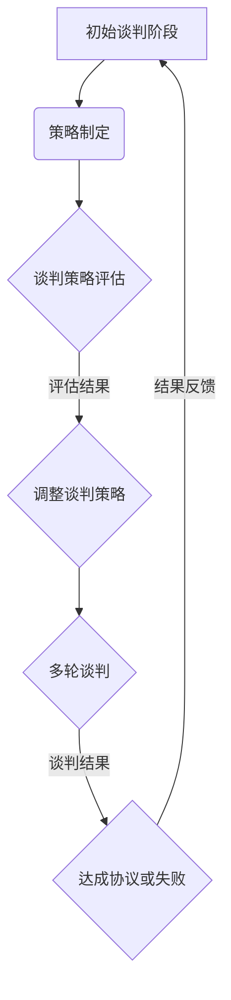

                 

# 文章标题：提示词设计：优化AI多轮谈判策略

> 关键词：AI谈判、提示词设计、多轮谈判策略、优化、自然语言处理、机器学习、深度学习

> 摘要：本文将深入探讨AI谈判中的提示词设计，分析其在优化AI多轮谈判策略中的作用。通过介绍AI谈判的基本概念、相关技术以及提示词设计的基本原则，本文将逐步构建谈判策略模型，并探讨多轮谈判策略的优化方法。同时，通过案例分析，我们将展示如何在实际项目中应用这些策略，并对未来的发展方向和挑战进行展望。

## 第一部分：AI谈判概述

### 第1章 AI谈判的概念与背景

#### 1.1 AI谈判的定义与原理

AI谈判是指利用人工智能技术，模拟人类谈判过程，自动进行谈判决策和策略制定。它基于自然语言处理（NLP）、机器学习（ML）和深度学习（DL）等技术，通过处理和分析谈判双方的语言和行为数据，实现自动化的谈判过程。

AI谈判的基本原理可以概括为以下几个步骤：

1. **数据收集**：收集谈判双方的文字和语音数据，包括历史谈判记录、电子邮件、会议纪要等。
2. **数据预处理**：对收集到的数据进行清洗、去噪和格式化，以便后续处理。
3. **语言理解**：利用NLP技术对谈判文本进行分词、词性标注、实体识别等，提取出关键信息。
4. **策略制定**：基于机器学习和深度学习模型，分析谈判双方的意图、需求和策略，制定相应的谈判策略。
5. **决策与执行**：根据制定的谈判策略，自动生成回复，模拟谈判过程，直至达成协议。

#### 1.2 AI谈判的发展背景

随着信息技术的飞速发展，人工智能技术在各个领域的应用越来越广泛。尤其是在金融、贸易、法律等领域，谈判活动的规模和复杂性不断增加，传统的手工谈判方式已经难以满足需求。AI谈判的出现，不仅提高了谈判的效率，还增强了谈判的决策能力，降低了谈判成本。

AI谈判的发展背景主要包括以下几个方面：

1. **数据积累**：随着互联网和大数据技术的发展，越来越多的谈判数据可以被收集和存储，为AI谈判提供了丰富的数据基础。
2. **算法进步**：机器学习和深度学习算法的不断发展，使得AI能够更好地理解和模拟人类的谈判过程。
3. **市场需求**：企业对高效、智能化的谈判工具的需求不断增长，推动了AI谈判技术的发展。

#### 1.3 AI谈判的优势与应用领域

AI谈判相比传统的手工谈判，具有以下几个显著优势：

1. **高效性**：AI可以处理大量的谈判数据，快速分析谈判双方的信息，制定谈判策略，大大提高谈判效率。
2. **准确性**：AI通过机器学习和深度学习模型，可以精确地识别谈判双方的意图和需求，避免人为误判。
3. **一致性**：AI谈判可以确保谈判策略的一致性，避免因人为因素导致的不一致。
4. **成本节约**：AI谈判可以自动化地进行谈判过程，减少人力成本，提高谈判效率。

AI谈判的应用领域主要包括：

1. **国际贸易**：通过AI谈判，可以自动化处理大量的国际贸易合同，提高谈判效率，降低谈判成本。
2. **企业并购**：AI谈判可以帮助企业在并购过程中快速评估对方的需求和意图，制定最优谈判策略。
3. **金融谈判**：AI谈判可以自动化处理金融交易中的谈判过程，提高交易效率，降低风险。

### 第2章 AI谈判的关键技术

#### 2.1 自然语言处理（NLP）

##### 2.1.1 NLP的基本概念

自然语言处理（NLP）是人工智能的一个重要分支，旨在让计算机理解和生成人类语言。NLP涉及到语言学、计算机科学、认知科学等多个领域的知识。

NLP的基本概念包括：

1. **文本预处理**：对文本进行清洗、分词、词性标注、命名实体识别等处理，为后续分析做准备。
2. **语言模型**：通过大量的语言数据进行训练，生成语言模型，用于预测文本的下一个词或句子。
3. **语义理解**：通过分析文本的语义，理解文本的含义，包括情感分析、实体识别、关系抽取等。

##### 2.1.2 NLP的关键技术

NLP的关键技术包括：

1. **分词**：将文本划分为有意义的词语单元。
2. **词性标注**：为每个词语标注其词性，如名词、动词、形容词等。
3. **命名实体识别**：识别文本中的命名实体，如人名、地名、组织名等。
4. **情感分析**：分析文本的情感倾向，如正面、负面、中性等。
5. **语义分析**：通过语义角色标注、实体关系抽取等，理解文本的深层含义。

##### 2.1.3 NLP在AI谈判中的应用

NLP在AI谈判中的应用主要包括：

1. **文本分析**：对谈判文本进行分析，提取关键信息，如对方的需求、意图等。
2. **语言生成**：自动生成谈判回复，模拟谈判过程。
3. **情感识别**：识别谈判双方的语气和情感，调整谈判策略。

#### 2.2 机器学习（ML）

##### 2.2.1 ML的基本概念

机器学习（ML）是使计算机通过数据学习，并对未知数据做出预测或决策的技术。ML主要包括监督学习、无监督学习和强化学习等。

1. **监督学习**：通过已有标签的数据进行训练，用于预测未知数据的标签。
2. **无监督学习**：在没有标签的数据上进行训练，用于发现数据中的模式或结构。
3. **强化学习**：通过与环境的交互进行学习，用于决策和策略优化。

##### 2.2.2 ML的关键算法

ML的关键算法包括：

1. **线性回归**：用于预测连续值。
2. **逻辑回归**：用于分类问题。
3. **决策树**：通过树形结构对数据进行分类或回归。
4. **支持向量机（SVM）**：用于分类问题，通过找到最优的超平面进行分类。
5. **神经网络**：通过多层神经元对数据进行处理和预测。

##### 2.2.3 ML在AI谈判中的应用

ML在AI谈判中的应用主要包括：

1. **策略优化**：通过监督学习，优化谈判策略，提高谈判成功率。
2. **意图识别**：通过分类算法，识别谈判双方的意图，调整谈判策略。
3. **风险控制**：通过风险模型，预测谈判过程中的潜在风险，采取相应的应对措施。

#### 2.3 深度学习（DL）

##### 2.3.1 DL的基本概念

深度学习（DL）是一种基于多层神经网络的学习方法，通过多层神经元对数据进行处理和预测。DL的核心是神经网络，特别是卷积神经网络（CNN）和循环神经网络（RNN）。

1. **卷积神经网络（CNN）**：主要用于图像和视频数据处理。
2. **循环神经网络（RNN）**：主要用于序列数据处理。
3. **长短时记忆网络（LSTM）**：RNN的改进版，能够处理长序列数据。

##### 2.3.2 DL的关键模型

DL的关键模型包括：

1. **卷积神经网络（CNN）**：通过卷积操作提取图像特征。
2. **循环神经网络（RNN）**：通过循环结构处理序列数据。
3. **长短时记忆网络（LSTM）**：通过门机制控制信息的流动，处理长序列数据。
4. **生成对抗网络（GAN）**：通过生成器和判别器之间的对抗训练，生成高质量的数据。

##### 2.3.3 DL在AI谈判中的应用

DL在AI谈判中的应用主要包括：

1. **文本生成**：通过DL模型，生成高质量的谈判文本，模拟真实的谈判过程。
2. **情感识别**：通过DL模型，识别谈判双方的语气和情感，为谈判策略提供依据。
3. **风险预测**：通过DL模型，预测谈判过程中的潜在风险，采取预防措施。

## 第二部分：AI谈判策略设计

### 第3章 提示词设计的基本原则

#### 3.1 提示词的定义与作用

提示词（Prompt Word）是在AI谈判过程中，用于引导谈判方向、激发对方思考和回应的关键词语。提示词的设计直接关系到谈判的效果和成功率。

提示词的作用包括：

1. **引导谈判方向**：通过选择合适的提示词，可以引导谈判朝着预期的方向发展。
2. **激发对方思考**：提示词可以激发对方的思考和回应，促进双方的沟通和交流。
3. **优化谈判策略**：提示词的设计可以优化谈判策略，提高谈判的成功率。

#### 3.2 提示词设计的原则

提示词设计需要遵循以下原则：

1. **针对性**：提示词需要针对具体的谈判场景和目标，确保其具有针对性。
2. **灵活性**：提示词需要具有一定的灵活性，能够适应不同的谈判情境和对方的行为。
3. **连贯性**：提示词需要与谈判内容保持连贯性，确保谈判过程的自然流畅。
4. **多样性**：提示词的设计需要多样化，避免单一的提示词导致谈判僵局。

#### 3.3 提示词设计的方法

提示词设计的方法包括：

1. **基于规则的提示词设计**：通过预设的规则和逻辑，生成提示词。
2. **基于数据的提示词设计**：通过分析历史谈判数据和对方的行为，生成提示词。
3. **基于机器学习的提示词设计**：利用机器学习模型，自动生成高质量的提示词。

### 第4章 AI谈判策略模型构建

#### 4.1 谈判策略模型的概念与分类

谈判策略模型是指用于指导AI谈判系统制定谈判策略的数学模型。谈判策略模型可以分为以下几类：

1. **基于规则的谈判策略模型**：通过预设的规则和逻辑，指导谈判系统的决策。
2. **基于模型的谈判策略模型**：通过机器学习模型，对谈判数据进行分析和预测，制定谈判策略。
3. **混合型谈判策略模型**：结合基于规则和基于模型的策略，优化谈判系统的决策。

#### 4.2 谈判策略模型的设计方法

谈判策略模型的设计方法包括：

1. **基于规则的谈判策略模型设计**：
    - **规则制定**：根据谈判经验，制定具体的谈判规则。
    - **规则集成**：将多个规则进行集成，形成完整的谈判策略模型。

2. **基于模型的谈判策略模型设计**：
    - **数据收集**：收集大量的历史谈判数据，包括文本、语音、图像等。
    - **特征提取**：从谈判数据中提取关键特征，用于训练模型。
    - **模型训练**：使用机器学习算法，训练谈判策略模型。

3. **混合型谈判策略模型设计**：
    - **规则与模型结合**：将基于规则和基于模型的策略进行结合，优化谈判系统的决策。

#### 4.3 谈判策略模型的评估与优化

谈判策略模型的评估与优化主要包括以下步骤：

1. **模型评估**：通过评估指标（如准确率、召回率、F1值等）评估谈判策略模型的效果。
2. **模型优化**：根据评估结果，对谈判策略模型进行优化，提高其性能。
3. **迭代优化**：通过不断迭代优化，使谈判策略模型更加准确、高效。

### 第5章 多轮谈判策略优化

#### 5.1 多轮谈判的基本流程

多轮谈判是指谈判双方通过多次交流，逐步达成协议的过程。多轮谈判的基本流程包括：

1. **初始谈判**：双方进行初步交流，明确谈判目标和范围。
2. **轮次交流**：双方轮流提出意见和建议，进行讨论和协商。
3. **方案调整**：根据对方的反馈，调整自己的谈判策略和方案。
4. **达成协议**：双方就关键问题达成一致，签订协议。

#### 5.2 多轮谈判策略的优化目标

多轮谈判策略的优化目标主要包括：

1. **谈判效率**：提高谈判速度，缩短谈判周期。
2. **谈判成功率**：提高谈判的成功率，达成预期的协议。
3. **谈判质量**：确保谈判协议的质量，满足双方的需求。

#### 5.3 多轮谈判策略的优化方法

多轮谈判策略的优化方法包括：

1. **基于规则的优化**：通过预设的规则，指导谈判系统的决策，提高谈判效率。
2. **基于数据的优化**：通过分析历史谈判数据和对方的行为，生成优化的谈判策略。
3. **基于机器学习的优化**：利用机器学习模型，自动生成优化的谈判策略。

### 第6章 AI谈判策略案例分析

#### 6.1 案例背景介绍

在本案例中，我们以一家中国公司和一家美国公司之间的国际贸易谈判为例。两家公司计划合作开展一项高科技项目的研发，但双方在项目投资、利润分成等方面存在较大分歧，需要进行多轮谈判以达成协议。

#### 6.2 案例谈判过程分析

在第一轮谈判中，中国公司提出了项目投资的初步方案，并表达了在利润分成方面希望获得更大份额的意愿。美国公司则对投资方案表示认同，但在利润分成方面提出了更高的要求。

在第二轮谈判中，中国公司根据美国公司的反馈，调整了投资方案，并提出了一些附加条件，如技术支持和市场推广。美国公司则对这些附加条件表示认同，但在利润分成方面依然坚持原有要求。

在随后的几轮谈判中，双方在投资方案、利润分成、技术支持等方面进行了多次讨论和协商。通过不断的调整和妥协，双方逐渐接近了共识，但在最后一轮谈判中，双方在利润分成方面依然存在分歧。

#### 6.3 案例谈判策略优化

针对上述案例，我们可以从以下几个方面对谈判策略进行优化：

1. **提示词设计**：针对谈判中的关键问题，设计具有针对性的提示词，引导谈判方向，促进双方的沟通和交流。
2. **策略调整**：根据谈判对手的行为和反馈，及时调整谈判策略，避免陷入僵局。
3. **数据支持**：利用历史谈判数据和数据分析，为谈判策略提供依据，提高谈判成功率。
4. **沟通技巧**：提高谈判人员的沟通技巧，增强谈判的说服力和影响力。

### 第7章 AI谈判系统的架构设计

#### 7.1 系统架构的概念与分类

系统架构是指系统的整体结构和组件之间的组织方式。根据系统的功能需求和性能要求，系统架构可以分为以下几类：

1. **层次化架构**：将系统划分为不同的层次，每个层次负责特定的功能，层次之间通过接口进行通信。
2. **分布式架构**：将系统分布在多个节点上，通过计算机网络进行通信和协作。
3. **面向服务架构（SOA）**：将系统划分为多个服务模块，通过服务接口进行通信和协作。

#### 7.2 AI谈判系统的设计原则

AI谈判系统的设计原则主要包括：

1. **模块化**：将系统划分为多个功能模块，每个模块独立实现，便于系统的维护和扩展。
2. **可扩展性**：系统设计应考虑未来的扩展需求，确保系统可以在不进行大规模修改的情况下，适应新的功能需求。
3. **稳定性**：系统设计应保证稳定性，避免因系统故障导致谈判失败。
4. **安全性**：系统设计应考虑安全性，防止恶意攻击和数据泄露。

#### 7.3 AI谈判系统的关键技术

AI谈判系统的关键技术主要包括：

1. **自然语言处理（NLP）**：用于处理谈判文本，提取关键信息，理解谈判双方的意图。
2. **机器学习（ML）和深度学习（DL）**：用于训练谈判策略模型，生成谈判策略。
3. **分布式计算**：用于处理大规模的谈判数据，提高系统的处理速度和性能。

### 第8章 AI谈判系统的开发与测试

#### 8.1 系统开发环境搭建

AI谈判系统的开发环境搭建主要包括以下几个方面：

1. **硬件环境**：选择高性能的计算机服务器，用于系统的运行和数据处理。
2. **软件环境**：安装必要的开发工具和软件，如Python、TensorFlow、Keras等。
3. **数据集**：收集大量的历史谈判数据，用于训练和测试谈判策略模型。

#### 8.2 系统功能模块实现

AI谈判系统的功能模块实现主要包括以下几个方面：

1. **文本处理模块**：负责处理谈判文本，提取关键信息，生成文本摘要。
2. **策略生成模块**：基于机器学习和深度学习模型，生成谈判策略。
3. **谈判模拟模块**：模拟谈判过程，自动生成谈判回复。
4. **结果评估模块**：评估谈判策略的效果，提供反馈和优化建议。

#### 8.3 系统测试与性能评估

AI谈判系统的测试与性能评估主要包括以下几个方面：

1. **功能测试**：验证系统的各个功能模块是否正常工作。
2. **性能测试**：评估系统在处理大量谈判数据时的性能，如响应时间、吞吐量等。
3. **稳定性测试**：评估系统在长时间运行和大量并发请求下的稳定性。
4. **安全性测试**：评估系统的安全性，防止恶意攻击和数据泄露。

### 第9章 AI谈判系统的部署与应用

#### 9.1 系统部署方案

AI谈判系统的部署方案主要包括以下几个方面：

1. **服务器部署**：将系统部署在云端服务器或本地服务器上，提供高效稳定的运行环境。
2. **数据存储**：使用数据库或数据仓库，存储谈判数据和相关模型。
3. **接口部署**：部署RESTful API或WebSocket接口，实现与外部系统的集成。

#### 9.2 系统应用场景分析

AI谈判系统的应用场景主要包括以下几个方面：

1. **国际贸易**：自动化处理国际贸易谈判，提高谈判效率，降低成本。
2. **企业并购**：协助企业进行并购谈判，提供智能化的谈判策略和建议。
3. **金融谈判**：协助金融机构进行金融谈判，优化谈判结果，降低风险。

#### 9.3 系统维护与更新

AI谈判系统的维护与更新主要包括以下几个方面：

1. **系统监控**：监控系统的运行状态，确保系统稳定运行。
2. **数据备份**：定期备份谈判数据和模型，防止数据丢失。
3. **模型更新**：根据新的谈判数据和用户反馈，更新谈判策略模型，提高系统的性能和准确性。
4. **用户培训**：提供用户培训和技术支持，帮助用户更好地使用系统。

### 第10章 未来展望与挑战

#### 10.1 AI谈判的未来发展趋势

随着人工智能技术的不断进步，AI谈判在未来将呈现以下几个发展趋势：

1. **智能化水平提高**：AI谈判系统将具备更高的智能化水平，能够更好地模拟人类的谈判过程。
2. **定制化需求增强**：根据不同行业和场景的需求，AI谈判系统将提供更加定制化的解决方案。
3. **跨界融合**：AI谈判将与大数据、物联网、区块链等技术进行深度融合，形成更加智能化、高效的谈判体系。

#### 10.2 AI谈判面临的挑战与解决方案

尽管AI谈判具有巨大的潜力，但同时也面临着一些挑战：

1. **数据隐私和安全**：在收集和处理谈判数据时，需要确保数据的安全性和隐私性。
2. **算法公平性**：确保AI谈判系统在不同群体中的公平性，避免算法偏见。
3. **法律和伦理问题**：AI谈判涉及法律和伦理问题，需要制定相应的规范和标准。

为了应对这些挑战，可以采取以下解决方案：

1. **数据安全与隐私保护**：采用数据加密、访问控制等技术，确保数据的安全和隐私。
2. **算法公平性检测**：通过算法公平性检测工具，识别和消除算法偏见。
3. **法律和伦理规范**：制定相关的法律和伦理规范，引导AI谈判的发展。

### 附录

#### 附录A：参考文献

1. **Allen, J. B. (2003). Natural Language Understanding. MIT Press.**
2. **Bishops, C. M. (2006). Neural Networks for Machine Learning. Springer.**
3. **Goodfellow, I., Bengio, Y., & Courville, A. (2016). Deep Learning. MIT Press.**

#### 附录B：常用工具与资源

1. **NLP相关工具**：
    - **NLTK**：Python自然语言处理库
    - **spaCy**：高效的Python自然语言处理库
    - **Stanford NLP**：斯坦福大学自然语言处理工具包

2. **ML与DL相关工具**：
    - **TensorFlow**：Google开发的深度学习框架
    - **PyTorch**：Facebook开发的深度学习框架
    - **Scikit-learn**：Python机器学习库

3. **谈判策略设计相关资源**：
    - **《谈判的艺术》**：作者：克里斯·沃斯
    - **《商业谈判》**：作者：哈佛商学院
    - **《谈判心理学》**：作者：乔治·米勒

### Mermaid 流程图示例



### 核心算法原理讲解

#### 2.2.2 机器学习的关键算法

##### K近邻算法（KNN）

K近邻算法（KNN）是一种简单但有效的分类算法，其核心思想是在训练集找到与测试样本最近的K个邻居，然后通过这些邻居的标签来预测测试样本的标签。

**算法原理**：

1. **计算距离**：对于新的测试样本，计算其在特征空间中与训练集中每个样本的距离。
2. **选择邻居**：选择距离测试样本最近的K个邻居。
3. **预测标签**：根据这些邻居的标签进行多数表决，选择出现次数最多的标签作为测试样本的预测标签。

**伪代码**：

```python
def predict(x, train_data, labels, k):
    # 计算x与train_data中每个样本的距离
    distances = [distance(x, sample) for sample in train_data]
    # 选择距离最近的K个样本
    neighbors = [train_data[i] for i in.argsort(distances)[:k]]
    # 计算这K个样本的标签的多数表决
    predictions = [labels[i] for i in neighbors]
    most_common = Counter(predictions).most_common(1)[0][0]
    return most_common
```

##### 支持向量机（SVM）

支持向量机（SVM）是一种强大的分类和回归算法，其核心思想是找到最优的超平面，使得不同类别的数据点在超平面两侧的距离最大化。

**数学模型**：

$$
\min_{w, b} \frac{1}{2} ||w||^2
$$

$$
s.t. y_i (w \cdot x_i + b) \geq 1
$$

**算法原理**：

1. **寻找超平面**：通过优化目标函数，找到最优的超平面。
2. **支持向量**：在最优超平面上，与超平面距离最近的样本点称为支持向量。
3. **分类决策**：新的测试样本通过计算其到超平面的距离，判断其类别。

**伪代码**：

```python
from cvxpy import *

def train_svm(x_train, y_train):
    n_samples, n_features = x_train.shape
    # 创建决策变量
    w = Variable(n_features)
    b = Variable()
    # 定义优化目标
    objective = Minimize(0.5 * norm(w)**2)
    # 定义约束条件
    constraints = [y_train[i] * (w @ x_train[i] + b) >= 1 for i in range(n_samples)]
    # 求解优化问题
    problem = Problem(objective, constraints)
    problem.solve()
    return w.value, b.value
```

### 数学模型和数学公式示例

#### 3.2 谈判策略模型的设计方法

##### 3.2.1 贝叶斯决策理论

贝叶斯决策理论是一种基于概率的决策方法，其核心公式为：

$$
\hat{y} = \arg\max_{y} P(y) \cdot P(x|y)
$$

其中，$P(y)$ 是先验概率，$P(x|y)$ 是条件概率。

贝叶斯决策理论的应用包括：

1. **分类问题**：通过最大化后验概率，确定新的测试样本的类别。
2. **风险最小化**：通过计算后验概率和损失函数，确定最优的决策策略。

**示例**：

假设有两个类别$A$和$B$，其先验概率分别为$P(A) = 0.6$ 和$P(B) = 0.4$。给定一个测试样本$x$，其条件概率为$P(x|A) = 0.8$ 和$P(x|B) = 0.3$。使用贝叶斯决策理论，我们可以计算后验概率：

$$
P(A|x) = \frac{P(x|A) \cdot P(A)}{P(x|A) \cdot P(A) + P(x|B) \cdot P(B)} = \frac{0.8 \cdot 0.6}{0.8 \cdot 0.6 + 0.3 \cdot 0.4} = 0.75
$$

$$
P(B|x) = \frac{P(x|B) \cdot P(B)}{P(x|A) \cdot P(A) + P(x|B) \cdot P(B)} = \frac{0.3 \cdot 0.4}{0.8 \cdot 0.6 + 0.3 \cdot 0.4} = 0.25
$$

根据后验概率，我们可以确定测试样本$x$的类别：

$$
\hat{y} = \arg\max_{y} P(y) \cdot P(x|y) = A
$$

因此，测试样本$x$被分类为类别$A$。

