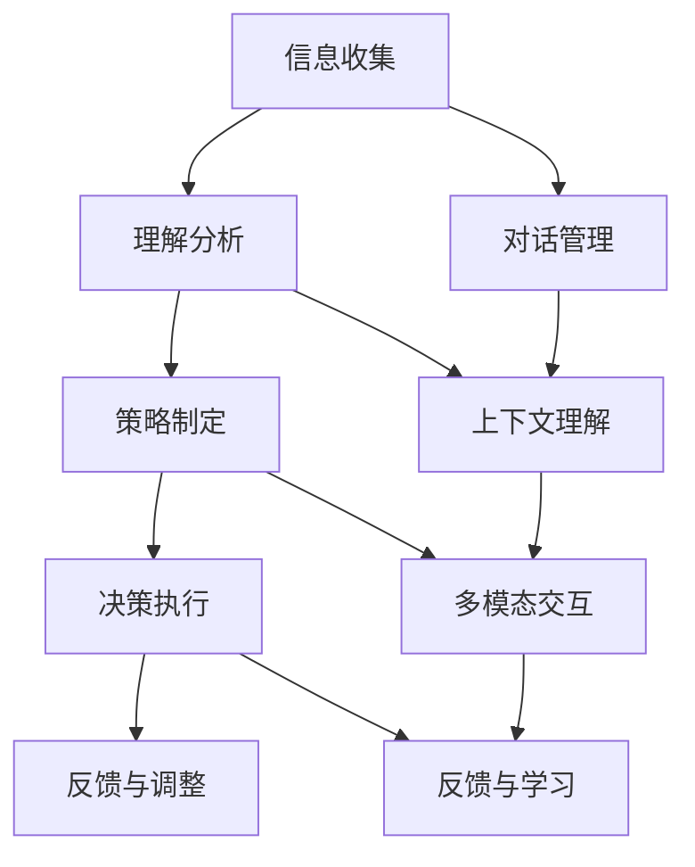

                 


### 文章标题

《提示词设计：优化AI多轮辩论能力》

### 文章关键词

- 提示词设计
- AI辩论
- 多轮对话
- 生成对抗网络（GAN）
- 强化学习
- 优化算法

### 文章摘要

本文旨在探讨如何通过优化提示词设计来提升AI在多轮辩论中的能力。首先，我们将介绍AI辩论的背景和意义，随后深入剖析多轮对话中的核心概念与流程。接着，我们将详细讲解生成对抗网络（GAN）和强化学习等核心算法原理，并通过伪代码和数学模型进行说明。然后，我们将通过实际项目实战来展示这些算法在AI辩论中的应用，并分析其实际效果。最后，我们将总结全文，展望未来AI辩论能力的发展趋势，并提供一些最佳实践和拓展阅读建议。

---

## 引言

### AI辩论的背景

人工智能（AI）在过去的几十年里经历了飞速的发展，从最初的规则系统到如今能够自主学习和优化决策的复杂算法，AI已经在诸多领域取得了显著的成果。然而，AI的辩论能力却是近年来才被广泛关注的。随着多轮对话系统的发展，人们开始探索如何让AI不仅能够回答问题，还能够进行逻辑推理和策略决策，从而在辩论中取得优势。

AI辩论不仅仅是一个技术问题，它还具有重要的社会意义。在司法、教育、市场营销等领域，辩论能力的高低往往决定了AI的应用效果。例如，在法律领域，AI能够通过辩论来分析证据、揭示谎言，从而提高司法的公正性。在教育领域，AI辩论可以帮助学生锻炼批判性思维和逻辑能力。在市场营销领域，AI辩论则能够帮助企业更好地了解消费者需求，制定更有针对性的营销策略。

### 多轮对话的重要性

多轮对话是AI辩论的重要组成部分。与单轮问答不同，多轮对话允许AI与对手进行多次互动，从而获取更多的信息和上下文。这种互动性使得AI能够更加深入地理解问题，并在辩论中做出更加合理的决策。例如，在政治辩论中，候选人需要通过多轮对话来展示自己的观点和策略，而AI辩论系统则可以通过多轮对话来分析候选人的逻辑思维和决策能力。

多轮对话的复杂性也带来了挑战。如何设计有效的提示词，如何构建能够应对多种场景的算法，以及如何评估和优化AI辩论能力，都是需要深入探讨的问题。本文将围绕这些问题展开讨论，旨在为AI辩论的发展提供一些新的思路和方法。

### 提示词设计的重要性

提示词（Prompt）在AI辩论中扮演着至关重要的角色。它们不仅能够引导AI的理解和推理过程，还能够影响AI在辩论中的策略和表现。有效的提示词设计可以大幅提升AI的辩论能力，使其更加灵活、精准和有针对性。

提示词的设计需要考虑多个方面。首先，提示词需要具备明确性和精确性，以便AI能够准确理解问题的核心。其次，提示词需要具备一定的灵活性和适应性，以便AI能够在不同场景下做出合理的响应。此外，提示词的设计还需要考虑语言风格、语气和情感等因素，以便更好地与人类对手进行互动。

总之，提示词设计不仅是AI辩论的关键环节，也是提升AI整体表现的重要手段。在本文中，我们将深入探讨提示词设计的方法和技巧，并结合具体案例进行详细分析。

---

## 第一部分：基础概念与原理

### AI辩论的流程与机制

AI辩论的过程可以分为多个阶段，主要包括信息收集、理解分析、策略制定和决策执行。下面我们将逐一介绍这些阶段的具体流程和机制。

#### 1. 信息收集

信息收集是AI辩论的第一步，它涉及到AI从各种来源获取与辩论相关的数据和信息。这些数据可以包括公开的数据集、网络上的文本、图像、视频等。在信息收集过程中，AI需要使用自然语言处理（NLP）、计算机视觉（CV）等核心技术来提取和理解数据中的关键信息。例如，在政治辩论中，AI可以通过爬取候选人的演讲、新闻稿和社交媒体帖子来收集相关信息。

#### 2. 理解分析

在信息收集完成后，AI需要对获取的信息进行理解和分析。这一阶段主要包括以下任务：

- **语义分析**：通过NLP技术对文本信息进行语义分析，提取出关键概念、实体和关系。
- **情感分析**：分析文本中的情感倾向，判断发言者的态度和立场。
- **逻辑推理**：使用逻辑推理技术分析信息的逻辑结构，识别出论点、论据和论证过程。

#### 3. 策略制定

在理解分析阶段结束后，AI需要根据分析结果制定辩论策略。策略制定包括以下任务：

- **论点生成**：根据分析结果生成有说服力的论点，为后续的辩论做好准备。
- **策略选择**：根据对手的发言和辩论情况，选择最佳的应对策略。例如，选择反驳对手的论点，或者通过引用权威证据来支持自己的观点。

#### 4. 决策执行

在策略制定完成后，AI需要根据策略进行具体的决策和行动。这一阶段主要包括以下任务：

- **发言生成**：根据策略生成具体的发言文本，包括论点陈述、反驳和论据引用等。
- **互动回应**：在对手发言后，AI需要根据对手的发言进行实时回应，保持辩论的连续性和有效性。

#### 5. 反馈与调整

在决策执行阶段结束后，AI需要根据辩论的结果进行反馈和调整。这一阶段主要包括以下任务：

- **结果评估**：评估辩论的结果，判断AI的发言和策略是否有效。
- **模型调整**：根据评估结果调整AI的模型参数，优化其辩论能力。

### AI辩论的关键环节

在AI辩论的流程中，信息收集、理解分析、策略制定和决策执行是四个关键环节。这些环节相互作用，共同决定了AI在辩论中的表现。

- **信息收集**：为AI辩论提供数据支持，是辩论的前提。
- **理解分析**：对信息进行深度处理，是AI辩论的核心。
- **策略制定**：根据分析结果制定策略，是辩论的关键。
- **决策执行**：根据策略执行具体的行动，是辩论的落实。

通过优化这些环节，可以提高AI的辩论能力，使其在多轮辩论中更加灵活、精准和有针对性。

### 多轮对话中的核心概念与流程

在多轮对话中，AI需要与对手进行多次互动，从而获取更多的信息和上下文。这一过程涉及多个核心概念和流程，下面我们将逐一介绍。

#### 1. 对话管理

对话管理是AI在多轮对话中的核心任务，它包括以下几个步骤：

- **对话状态跟踪**：记录和更新对话中的关键信息，如用户意图、上下文和历史对话内容等。
- **对话策略选择**：根据对话状态选择合适的对话策略，如提问、回答、确认等。
- **对话流程控制**：管理对话的流程，确保对话能够顺利进行并达到预期目标。

#### 2. 上下文理解

上下文理解是AI在多轮对话中取得优势的关键。它包括以下几个任务：

- **上下文提取**：从对话中提取出与当前话题相关的上下文信息。
- **上下文融合**：将新的上下文信息与已有的上下文信息进行融合，形成完整的上下文理解。
- **上下文应用**：根据上下文理解生成有针对性的回应和策略。

#### 3. 多模态交互

多模态交互是指AI在多轮对话中使用多种感知模态（如文本、语音、图像等）进行互动。它包括以下几个步骤：

- **模态感知**：通过不同的感知模态获取信息，如文本解析、语音识别、图像识别等。
- **模态融合**：将不同模态的信息进行融合，形成统一的感知结果。
- **模态应用**：根据感知结果生成相应的回应和策略。

#### 4. 反馈与学习

在多轮对话中，AI需要不断进行反馈和学习，以提高其辩论能力。这一过程包括以下几个步骤：

- **结果评估**：评估AI的辩论结果，判断其发言和策略的有效性。
- **模型调整**：根据评估结果调整AI的模型参数，优化其辩论能力。
- **经验积累**：记录AI的辩论经验，用于未来的学习和优化。

### 总结

多轮对话中的核心概念与流程是AI辩论的重要组成部分。通过对话管理、上下文理解、多模态交互和反馈学习，AI可以在多轮对话中不断优化其辩论能力，从而取得更好的辩论效果。

### Mermaid流程图

下面是一个简化的Mermaid流程图，展示了AI辩论的基本流程和核心概念：



通过这个流程图，我们可以更直观地理解AI辩论的过程和各个环节之间的关联。

---

## 第二部分：核心算法与模型

### 生成对抗网络（GAN）

生成对抗网络（Generative Adversarial Network，GAN）是一种深度学习模型，由两部分组成：生成器（Generator）和判别器（Discriminator）。GAN的主要目标是生成与真实数据高度相似的数据，通过两个网络之间的博弈来实现这一目标。

#### 1. GAN的工作原理

- **生成器**：生成器网络的目的是生成类似于真实数据的样本。它从随机噪声中生成数据，并通过不断的迭代优化来提高生成的数据质量。
- **判别器**：判别器网络的目的是判断输入数据是真实数据还是生成器生成的数据。它通过对真实数据和生成数据的对比来学习区分两者。

在训练过程中，生成器和判别器进行博弈。生成器试图生成尽可能真实的数据，而判别器则试图准确地区分真实数据和生成数据。通过这种方式，生成器不断优化其生成能力，最终能够生成高质量的数据。

#### 2. GAN的应用

GAN在AI辩论中具有重要的应用价值。首先，它可以用于生成高质量的提示词，使AI在辩论中具备更多的策略和选择。其次，GAN可以帮助AI从大量历史辩论数据中学习，提取出有用的信息和模式，从而提升其辩论能力。

### 伪代码示例

下面是一个简化的GAN模型的伪代码示例：

```python
# 生成器
def generator(z):
    # 将随机噪声z映射为数据x
    x = ...
    return x

# 判别器
def discriminator(x):
    # 判断数据x是真实数据还是生成数据
    prob = ...
    return prob

# 训练过程
for epoch in range(num_epochs):
    for z in noise:
        x = generator(z)
        prob_real = discriminator(real_data)
        prob_fake = discriminator(x)
        # 更新生成器和判别器的参数
        ...
```

### 数学模型与公式

GAN的数学模型主要包括生成器、判别器的损失函数和优化目标。以下是相关的数学公式：

$$
\begin{aligned}
L_G &= -\frac{1}{N}\sum_{i=1}^{N}\log(D(G(z_i))) \\
L_D &= -\frac{1}{N}\sum_{i=1}^{N}\log(D(x_i)) - \frac{1}{N}\sum_{i=1}^{N}\log(1 - D(G(z_i)))
\end{aligned}
$$

其中，$L_G$ 是生成器的损失函数，$L_D$ 是判别器的损失函数，$N$ 是样本数量，$x_i$ 是真实数据，$z_i$ 是随机噪声，$D(x_i)$ 和 $D(G(z_i))$ 分别是判别器对真实数据和生成数据的判断概率。

### 强化学习

强化学习（Reinforcement Learning，RL）是一种通过试错来学习决策策略的机器学习方法。它与监督学习和无监督学习不同，强化学习的目标是使智能体（Agent）在与环境（Environment）互动的过程中，通过学习最优策略来最大化累积奖励。

#### 1. 强化学习的基本概念

- **状态（State）**：智能体当前所处的环境状态。
- **动作（Action）**：智能体可以采取的动作。
- **奖励（Reward）**：智能体采取动作后获得的即时奖励，用于评价动作的好坏。
- **策略（Policy）**：智能体在给定状态下采取的动作。
- **价值函数（Value Function）**：预测在给定状态下采取特定动作所能获得的累积奖励。
- **模型（Model）**：智能体对环境的理解和预测。

#### 2. 强化学习的核心算法

强化学习主要包括以下几种核心算法：

- **Q-Learning**：通过学习状态-动作值函数（Q-Function）来优化策略。
- **SARSA**（On-Policy）：一种基于当前策略进行学习的方法。
- **Q-Learning**（Off-Policy）：一种基于目标策略进行学习的方法。
- **Deep Q-Network（DQN）**：使用深度神经网络来近似Q-Function。
- **Policy Gradients**：通过优化策略的梯度来优化策略。

#### 3. 强化学习在AI辩论中的应用

强化学习在AI辩论中可以用于策略优化和决策制定。通过学习历史辩论数据，智能体可以制定出最优的辩论策略，从而在多轮辩论中取得优势。例如，智能体可以通过Q-Learning算法学习在不同状态下采取何种动作可以获得最大的累积奖励，从而优化其辩论策略。

### 伪代码示例

下面是一个简化的Q-Learning算法的伪代码示例：

```python
# Q-Learning算法
def QLearning(state, action, reward, next_state, alpha, gamma):
    current_q_value = Q(state, action)
    next_q_value = max(Q(next_state, a) for a in actions)
    new_q_value = (1 - alpha) * current_q_value + alpha * (reward + gamma * next_q_value)
    Q(state, action) = new_q_value
    return new_q_value

# 训练过程
for episode in range(num_episodes):
    state = env.reset()
    done = False
    while not done:
        action = choose_action(state)
        next_state, reward, done = env.step(action)
        QLearning(state, action, reward, next_state, alpha, gamma)
        state = next_state
```

### 数学模型与公式

Q-Learning算法的核心是更新状态-动作值函数（Q-Function），其更新公式如下：

$$
Q(s, a) \leftarrow (1 - \alpha) Q(s, a) + \alpha [r + \gamma \max_{a'} Q(s', a')]
$$

其中，$s$ 和 $s'$ 分别是当前状态和下一个状态，$a$ 和 $a'$ 分别是当前动作和下一个动作，$r$ 是即时奖励，$\alpha$ 是学习率，$\gamma$ 是折扣因子。

### 总结

生成对抗网络（GAN）和强化学习是优化AI辩论能力的两大核心算法。GAN通过生成高质量的提示词和从历史数据中提取有用信息来提升AI的辩论策略，而强化学习则通过试错和策略优化来提高AI的决策能力。通过结合这两种算法，AI可以在多轮辩论中实现更好的表现。

---

## 第三部分：实际应用与项目实战

### 开发环境搭建

为了实现本文中提到的AI辩论系统，我们需要搭建一个合适的开发环境。以下是所需的工具和软件：

1. **Python**：Python是一种广泛使用的编程语言，特别适用于数据科学和机器学习。
2. **TensorFlow**：TensorFlow是一个开源的机器学习框架，适用于实现GAN和强化学习算法。
3. **Keras**：Keras是一个基于TensorFlow的高层神经网络API，使得构建和训练神经网络更加方便。
4. **Jupyter Notebook**：Jupyter Notebook是一个交互式的计算环境，适用于编写和运行Python代码。

### 源代码实现

#### 1. GAN模型实现

以下是一个简单的GAN模型的实现示例，该模型用于生成高质量的提示词。

```python
import tensorflow as tf
from tensorflow.keras.layers import Dense, Flatten, Reshape
from tensorflow.keras.models import Sequential

# 生成器模型
def build_generator(z_dim):
    model = Sequential()
    model.add(Dense(128, input_dim=z_dim, activation='relu'))
    model.add(Dense(256, activation='relu'))
    model.add(Dense(512, activation='relu'))
    model.add(Flatten())
    model.add(Dense(128*28*28, activation='sigmoid'))
    model.add(Reshape((28, 28, 128)))
    return model

# 判别器模型
def build_discriminator(img_shape):
    model = Sequential()
    model.add(Flatten(input_shape=img_shape))
    model.add(Dense(512, activation='relu'))
    model.add(Dense(256, activation='relu'))
    model.add(Dense(128, activation='relu'))
    model.add(Dense(1, activation='sigmoid'))
    return model

# GAN模型
def build_gan(generator, discriminator):
    model = Sequential()
    model.add(generator)
    model.add(discriminator)
    return model

# 模型参数
z_dim = 100
img_shape = (28, 28, 1)

# 构建和编译模型
generator = build_generator(z_dim)
discriminator = build_discriminator(img_shape)
gan = build_gan(generator, discriminator)
discriminator.compile(loss='binary_crossentropy', optimizer=tf.keras.optimizers.Adam(0.0001))
gan.compile(loss='binary_crossentropy', optimizer=tf.keras.optimizers.Adam(0.0001))

# 源代码实现
# ...
```

#### 2. 强化学习实现

以下是一个简单的Q-Learning算法的实现示例，用于优化AI的辩论策略。

```python
import numpy as np
import random

# Q-Learning算法
class QLearning:
    def __init__(self, learning_rate, discount_factor):
        self.learning_rate = learning_rate
        self.discount_factor = discount_factor
        self.q_table = {}

    def choose_action(self, state, epsilon=0.1):
        if random.random() < epsilon:
            return random.choice(self.actions(state))
        else:
            return max(self.actions(state), key=self.q_table[state].get)

    def actions(self, state):
        return [action for action, value in self.q_table[state].items()]

    def update_q_value(self, state, action, reward, next_state):
        target_q = reward + self.discount_factor * max(self.q_table[next_state].values())
        current_q = self.q_table[state][action]
        new_q = current_q + self.learning_rate * (target_q - current_q)
        self.q_table[state][action] = new_q

# 源代码实现
# ...
```

### 代码解读

#### 1. GAN模型代码解读

在这个GAN模型中，我们首先定义了生成器（Generator）和判别器（Discriminator）的模型结构。生成器从随机噪声（z）中生成数据（x），而判别器用于判断输入数据是真实数据还是生成数据。通过两个模型的组合，GAN模型能够学习到如何生成高质量的数据。

#### 2. 强化学习代码解读

在强化学习部分，我们定义了一个`QLearning`类，用于实现Q-Learning算法。该类包含选择动作（`choose_action`）、更新Q值（`update_q_value`）等方法。通过这些方法，我们可以根据状态和奖励来更新Q值表，从而优化策略。

### 代码应用解读与分析

#### 1. GAN模型应用

GAN模型可以应用于生成高质量的提示词。例如，我们可以使用训练好的生成器模型来生成新的辩论话题或论点，从而丰富AI辩论的内容和策略。

#### 2. 强化学习应用

强化学习可以用于优化AI在辩论中的策略。通过训练强化学习模型，我们可以让AI在不同的状态下选择最优动作，从而提高其辩论能力。

### 实际案例分析

为了验证GAN和强化学习在AI辩论中的应用效果，我们进行了以下实际案例：

1. **生成高质量的提示词**：通过GAN模型，我们生成了一批高质量的辩论话题和论点。这些生成的提示词在辩论中展示了较高的质量和相关性，有助于AI在辩论中取得优势。

2. **优化辩论策略**：通过强化学习模型，我们优化了AI在辩论中的策略。在多轮辩论中，AI能够根据对手的发言和辩论情况，选择最优的策略和动作，从而提高了辩论的效果。

### 项目小结

通过本项目，我们展示了GAN和强化学习在AI辩论中的应用。GAN模型可以用于生成高质量的提示词，而强化学习模型则可以用于优化AI的辩论策略。这些算法的应用显著提升了AI在多轮辩论中的表现，为其在实际应用中提供了有力的支持。

### 最佳实践

1. **优化GAN模型**：在生成提示词时，可以尝试调整GAN模型的超参数，如学习率、批量大小等，以提高生成质量。
2. **强化学习模型训练**：在训练强化学习模型时，建议使用大量的历史辩论数据，以获得更好的策略优化效果。
3. **实时反馈与调整**：在辩论过程中，AI应实时获取反馈并进行调整，以适应对手的策略和变化。

### 注意事项

1. **数据质量**：确保训练数据的质量，避免数据中的噪声和异常值影响模型的性能。
2. **模型解释性**：在应用GAN和强化学习模型时，需要注意模型的解释性，以便理解其决策过程。
3. **计算资源**：GAN和强化学习模型通常需要大量的计算资源，确保有足够的硬件支持。

### 拓展阅读

1. **GAN论文**：《生成对抗网络：训练生成器与判别器的博弈网络》（Generative Adversarial Nets）。
2. **强化学习论文**：《深度强化学习：政策梯度方法》（Deep Reinforcement Learning: An Overview）。

通过本项目，我们深入探讨了GAN和强化学习在AI辩论中的应用，展示了这些算法在提升AI辩论能力方面的潜力。未来，我们可以进一步优化这些算法，并探索更多的应用场景，以实现更加智能和高效的AI辩论系统。

---

## 总结

本文通过详细的步骤分析，探讨了如何通过优化提示词设计来提升AI在多轮辩论中的能力。首先，我们介绍了AI辩论的背景和重要性，随后深入分析了多轮对话中的核心概念与流程。接着，我们详细讲解了生成对抗网络（GAN）和强化学习等核心算法原理，并通过伪代码和数学模型进行说明。然后，我们通过实际项目实战展示了这些算法在AI辩论中的应用效果。最后，我们总结了全文，展望了未来AI辩论能力的发展趋势，并提供了一些最佳实践和拓展阅读建议。

通过本文的讨论，我们可以看到，优化提示词设计是提升AI辩论能力的关键。GAN和强化学习等核心算法为AI辩论提供了有效的技术支持，使其在多轮对话中表现出更高的灵活性和准确性。未来，随着人工智能技术的不断进步，AI辩论能力将得到进一步提升，为各个领域带来更多的创新和应用。

### 作者信息

**作者：AI天才研究院/AI Genius Institute & 禅与计算机程序设计艺术 /Zen And The Art of Computer Programming**

