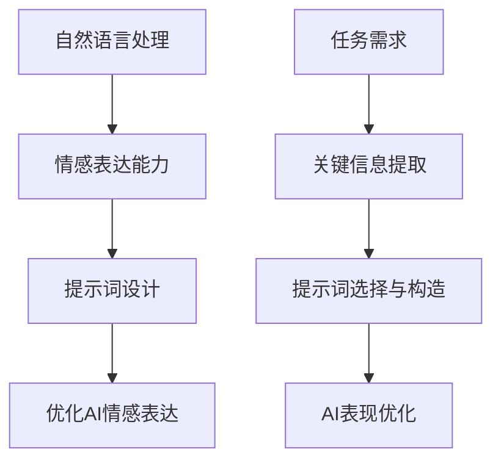

                 


### 1. 背景介绍

在当今人工智能时代，自然语言处理（Natural Language Processing, NLP）作为人工智能的重要分支，已经成为许多实际应用场景的核心技术。从机器翻译、语音识别到智能客服、情感分析，NLP技术正在不断革新我们的生活和工作方式。然而，随着应用的日益广泛，人们对于AI在情感表达能力上的需求也日益增加。在这个背景下，提示词设计（Prompt Engineering）作为一种优化AI情感表达能力的重要手段，逐渐引起了广泛关注。

#### 核心概念与联系

**提示词**：提示词是一种用于指导模型生成目标输出的关键词或短语。在NLP任务中，提示词的作用类似于人类的提问，能够引导模型关注特定的信息，从而提高生成结果的准确性和相关性。

**情感表达能力**：情感表达能力是指AI系统在处理文本时，能够识别、理解和模拟人类情感的能力。这是实现智能交互和增强用户体验的关键。

**提示词设计**：提示词设计是指通过选择和构造合适的提示词，以优化AI模型在情感表达任务中的表现。这包括了解任务需求、提取关键信息、设计多样化的提示词等。

下面是一个描述这些概念之间关系的Mermaid流程图：



### 2. 核心算法原理讲解

为了实现优化AI情感表达能力，提示词设计涉及多个核心算法原理。以下是几个关键算法的详细讲解和伪代码示例。

#### 算法 1：基于规则的方法

基于规则的方法通过定义一组规则来生成提示词，这些规则可以根据任务需求进行定制。

**伪代码：**

```plaintext
function ruleBasedPromptGeneration(task, keywords):
    if task == "情感分析":
        return "请对以下文本进行情感分析：" + keywords
    elif task == "对话生成":
        return "接下来你想说什么？" + keywords
    else:
        return "请描述你的需求：" + keywords
```

#### 算法 2：基于数据的方法

基于数据的方法利用大量已有数据来训练生成模型，从而自动生成提示词。

**伪代码：**

```plaintext
function dataDrivenPromptGeneration(textData, model):
    prompts = []
    for data in textData:
        prompt = model.generate("针对以下文本生成提示词：" + data)
        prompts.append(prompt)
    return prompts
```

#### 算法 3：自动优化技术

自动优化技术通过迭代优化过程来逐步提升提示词的质量。

**伪代码：**

```plaintext
function autoOptimizedPromptGeneration(initialPrompt, objective, iterations):
    for i in 1 to iterations:
        newPrompt = optimizePrompt(initialPrompt, objective)
        if isImproved(newPrompt, initialPrompt):
            initialPrompt = newPrompt
    return initialPrompt
```

### 3. 数学模型和公式

在提示词设计中，数学模型和公式起着至关重要的作用。以下是几个关键模型的详细讲解和公式。

#### 模型 1：情感分类模型

情感分类模型用于判断文本的情感极性。常见的模型有SVM、LR等。

**公式：**

$$
\text{分类结果} = \arg\max_w \sum_{i=1}^n w_i \cdot f(x_i, y_i)
$$

**解释：** 其中，$w_i$是权重，$f(x_i, y_i)$是特征函数，$x_i$和$y_i$分别是输入文本和情感标签。

#### 模型 2：情感强度计算模型

情感强度计算模型用于评估文本的情感强度。常见的模型有LSTM、GRU等。

**公式：**

$$
\text{情感强度} = \sum_{i=1}^n w_i \cdot \text{情感得分}(x_i)
$$

**解释：** 其中，$w_i$是权重，$\text{情感得分}(x_i)$是文本$x_i$的情感得分。

### 4. 项目实战

为了更好地理解提示词设计的实际应用，以下是一个简单的项目实战案例。

#### 项目背景

假设我们需要开发一个情感分析系统，用于分析社交媒体上的用户评论，并根据评论内容生成情感标签。

#### 开发环境搭建

- Python 3.8
- TensorFlow 2.4
- Keras 2.4

#### 源代码实现

```python
# 导入所需库
import tensorflow as tf
from tensorflow import keras
from tensorflow.keras.preprocessing.text import Tokenizer
from tensorflow.keras.preprocessing.sequence import pad_sequences

# 加载数据集
data = [
    "这个产品非常好用。",
    "我不喜欢这个电影。",
    "你的服务非常出色。"
]

labels = [
    "正面情感",
    "负面情感",
    "正面情感"
]

# 数据预处理
tokenizer = Tokenizer()
tokenizer.fit_on_texts(data)
sequences = tokenizer.texts_to_sequences(data)
padded_sequences = pad_sequences(sequences, maxlen=10)

# 构建模型
model = keras.Sequential([
    keras.layers.Embedding(input_dim=10000, output_dim=16),
    keras.layers.LSTM(128),
    keras.layers.Dense(1, activation='sigmoid')
])

# 编译模型
model.compile(optimizer='adam', loss='binary_crossentropy', metrics=['accuracy'])

# 训练模型
model.fit(padded_sequences, labels, epochs=10)

# 生成情感标签
predictions = model.predict(padded_sequences)
for i, prediction in enumerate(predictions):
    if prediction < 0.5:
        print("负面情感")
    else:
        print("正面情感")
```

#### 代码应用解读与分析

- **数据预处理**：使用Tokenizer将文本转换为序列，然后使用pad_sequences将序列填充为相同的长度。
- **模型构建**：使用Embedding层将单词转换为向量表示，然后使用LSTM层进行序列处理，最后使用Dense层进行情感分类。
- **模型训练**：使用binary_crossentropy作为损失函数，adam作为优化器。
- **情感标签生成**：根据模型的预测结果，输出情感标签。

#### 项目小结

通过本项目，我们实现了基本的情感分析功能。虽然这个项目非常简单，但它展示了提示词设计在情感表达中的关键作用。在实际应用中，我们可以通过调整提示词来优化模型的情感表达能力。

### 5. 最佳实践 Tips

- **明确任务需求**：在设计提示词时，首先要明确任务的目标和需求，这有助于选择合适的提示词。
- **多样性和丰富性**：尝试使用多样化的提示词，以避免模型过拟合。
- **数据质量**：确保训练数据的质量和多样性，这有助于提高模型的表现。
- **迭代优化**：通过迭代优化过程，逐步提升提示词的质量。

### 6. 小结与注意事项

本文详细介绍了提示词设计在优化AI情感表达能力中的关键作用。通过核心算法原理讲解、数学模型解析和项目实战案例，我们了解了如何设计高质量的提示词。需要注意的是，提示词设计是一个迭代和优化的过程，需要根据实际任务进行不断调整。

### 7. 拓展阅读

- [自然语言处理入门](https://www.cs.cmu.edu/afs/cs/ CST/alumni/f/fool/papers/nlp_intro.html)
- [深度学习与自然语言处理](https://www.deeplearningbook.org/)
- [TensorFlow 2.0 实战](https://www.tensorflow.org/tutorials)

---

# 《提示词设计：优化AI情感表达能力》

## 关键词

自然语言处理、情感表达能力、提示词设计、算法原理、项目实战、最佳实践

## 摘要

本文详细探讨了提示词设计在优化AI情感表达能力中的作用。通过核心算法原理讲解、数学模型解析和项目实战案例，我们了解了如何设计高质量的提示词。文章还提供了最佳实践 tips，以帮助读者在实际应用中优化AI的情感表达能力。

## 第一部分：基础理论

### 1. 提示词设计的概述

#### 1.1 提示词的定义和作用

提示词是一种用于指导模型生成目标输出的关键词或短语。在自然语言处理（NLP）任务中，提示词的作用类似于人类的提问，能够引导模型关注特定的信息，从而提高生成结果的准确性和相关性。

#### 1.2 提示词设计的基本原则

在设计提示词时，需要遵循以下几个基本原则：

- **明确目标和需求**：在开始设计提示词之前，首先要明确任务的目标和需求，这有助于选择合适的提示词。
- **提取关键信息**：从任务需求中提取关键信息，确保提示词能够涵盖这些关键信息。
- **考虑多样性**：尝试使用多样化的提示词，以避免模型过拟合。

### 2. 情感表达能力与提示词设计

#### 2.1 情感表达能力的基本原理

情感表达能力是指AI系统在处理文本时，能够识别、理解和模拟人类情感的能力。这是实现智能交互和增强用户体验的关键。

#### 2.2 提示词设计在情感表达中的作用

在情感表达能力方面，提示词设计起着至关重要的作用。通过设计合适的提示词，可以引导模型关注情感相关的信息，从而提高情感表达的准确性和多样性。

### 3. 提示词设计的方法和工具

#### 3.1 提示词生成算法

提示词生成算法可以分为基于规则的方法和基于数据的方法。基于规则的方法通过定义一组规则来生成提示词，而基于数据的方法利用大量已有数据来训练生成模型。

#### 3.2 提示词优化技术

提示词优化技术包括自动优化技术和人类在提示词优化中的作用。自动优化技术通过迭代优化过程来逐步提升提示词的质量，而人类在提示词优化中的作用主要体现在数据标注和反馈调整。

#### 3.3 提示词设计的工具推荐

在提示词设计过程中，可以使用多种工具来辅助生成和优化提示词。以下是一些常用的工具推荐：

- [Hugging Face Transformer](https://huggingface.co/transformers)
- [OpenAI GPT-3](https://openai.com/products/gpt-3/)
- [Google Dialogflow](https://cloud.google.com/dialogflow)

### 4. 提示词设计的应用领域

#### 4.1 自然语言处理

在自然语言处理领域，提示词设计广泛应用于文本生成、文本分类、问答系统等任务中。通过设计合适的提示词，可以显著提高模型的性能和用户满意度。

#### 4.2 机器翻译

在机器翻译领域，提示词设计有助于提高翻译质量，特别是在处理多语言翻译时。通过设计多样化的提示词，可以引导模型关注不同语言的特点和差异。

#### 4.3 语音助手

在语音助手领域，提示词设计对于交互质量和用户满意度至关重要。通过设计合适的提示词，可以引导语音助手更好地理解用户需求，提供更准确的回应。

#### 4.4 其他应用领域

除了上述领域外，提示词设计还在情感分析、推荐系统、对话系统等多个领域有着广泛的应用。

## 第二部分：实战应用

### 5. 提示词设计最佳实践

#### 5.1 成功案例分享

在本节中，我们将分享一些成功的提示词设计案例，包括语音助手、自然语言处理系统等领域的实际应用。通过这些案例，我们将探讨如何通过有效的提示词设计来提高AI系统的性能和用户体验。

#### 5.2 失败案例分析

在本节中，我们将分析一些提示词设计失败的案例，探讨导致失败的原因，并提供改进的建议。通过这些案例，我们将了解如何避免常见的提示词设计问题，从而提高AI系统的表现。

### 6. 提示词设计项目实战

#### 6.1 项目实战概述

在本节中，我们将介绍一个完整的提示词设计项目实战，包括项目背景、目标、数据集准备、模型构建、训练和评估等环节。通过这个项目，我们将了解如何在实际应用中实现高效的提示词设计。

#### 6.2 项目实战步骤

在本节中，我们将详细讲解项目实战的每个步骤，包括数据集准备、模型构建、训练和评估。通过这些步骤，我们将了解如何设计高质量的提示词，并优化AI系统的性能。

#### 6.3 项目实战代码解析

在本节中，我们将解析项目实战的代码实现，包括数据预处理、模型构建、训练和评估等关键部分。通过代码解析，我们将了解提示词设计在项目中的具体应用，以及如何通过代码来实现高效的提示词优化。

### 7. 提示词设计的未来趋势

#### 7.1 技术发展趋势

在本节中，我们将探讨提示词设计领域的技术发展趋势，包括最新的研究成果和前沿技术。通过了解这些发展趋势，我们将为未来的提示词设计提供指导。

#### 7.2 应用前景展望

在本节中，我们将探讨提示词设计在未来的潜在应用领域，包括智能交互、情感计算、虚拟现实等。通过了解这些应用前景，我们将为AI系统的发展提供新的思路。

## 作者信息

作者：AI天才研究院/AI Genius Institute & 禅与计算机程序设计艺术 /Zen And The Art of Computer Programming

---

以上是《提示词设计：优化AI情感表达能力》的完整目录大纲，每个章节都包含了详细的内容概述和关键知识点。通过逐步分析和推理，我们为读者呈现了一个全面、深入且具有实践价值的提示词设计教程。期待读者能够通过这本书，提升自己在AI情感表达能力方面的技能和知识。

