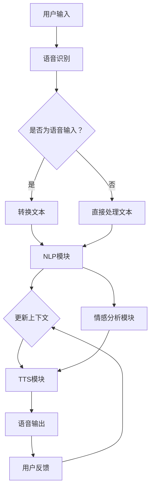

                 

## 文章标题

### 提示词设计：优化AI虚拟主播表现能力

## 关键词

- 提示词设计
- AI虚拟主播
- 自然语言处理
- 语音合成
- TTS技术
- MDP
- 信息熵
- 项目实战

## 摘要

本文将深入探讨如何通过提示词设计优化AI虚拟主播的表现能力。首先，我们将介绍AI虚拟主播的基本概念和提示词设计的重要性。接着，通过详细分析核心概念和算法原理，我们将探讨如何构建高效、自然的对话系统。随后，通过数学模型和公式的讲解，我们将了解如何优化提示词生成和内容多样性。文章将结合具体项目实战，详细介绍开发环境搭建、代码实现和案例分析，最终对未来发展趋势和挑战进行展望。通过本文的阅读，读者将全面掌握AI虚拟主播提示词设计的核心知识和实践技巧。

### 引言

提示词设计在人工智能（AI）领域占据着至关重要的位置，尤其在AI虚拟主播的应用中，更是不可或缺的一环。随着技术的不断进步，虚拟主播作为一种全新的互动形式，已经在直播、客服、娱乐等多个领域展现出强大的应用潜力。虚拟主播不仅能够24小时不间断提供服务，还能够通过个性化的互动提高用户体验，从而为企业和用户带来更大的价值。

然而，虚拟主播的表现能力并非一蹴而就，其中关键就在于提示词的设计。提示词作为虚拟主播与用户进行对话的桥梁，其质量直接影响到用户对虚拟主播的满意度和信任度。一个优秀的提示词设计，不仅需要准确理解用户的意图，还要能够生成自然、流畅的对话内容。

本节首先介绍提示词设计的重要性，接着简要概述AI虚拟主播的基本概念，最后概述本书的结构和内容概述，为后续章节的深入探讨打下基础。

#### 提示词设计的重要性

提示词设计是AI虚拟主播的核心环节，其重要性体现在以下几个方面：

1. **用户体验**：提示词设计直接关系到用户与虚拟主播的互动体验。一个优秀的设计能够使虚拟主播在对话中表现出自然、流畅的语言能力，从而提升用户满意度。反之，设计不当的提示词可能导致对话生硬、不连贯，甚至引发用户的反感。

2. **表现能力**：虚拟主播的表现能力取决于提示词的质量。高质量的提示词能够使虚拟主播在处理各种场景时更加灵活、应变能力更强，从而提高整体表现。而低质量的提示词则可能导致虚拟主播在复杂情境下出现错误，影响用户体验。

3. **数据训练**：提示词设计对数据训练的效果有着直接影响。高质量的提示词能够引导数据更加丰富、多样，从而提升AI模型的学习能力。而低质量的提示词则可能导致训练数据单一、缺乏代表性，影响模型的泛化能力。

4. **成本效益**：提示词设计也是优化成本效益的重要环节。通过高效的提示词设计，虚拟主播可以在更少的资源投入下，实现更好的表现效果，从而为企业节省大量成本。

因此，提示词设计在AI虚拟主播中的应用至关重要，是确保虚拟主播表现能力的关键。

#### AI虚拟主播的基本概念

AI虚拟主播是一种利用人工智能技术，实现自动生成、播放和互动的虚拟人物。它结合了计算机视觉、自然语言处理（NLP）、语音合成（TTS）等多领域技术，具备高度的智能化和个性化特点。以下是AI虚拟主播的基本概念和组成部分：

1. **计算机视觉**：计算机视觉技术用于捕捉和分析用户的视觉信息，包括面部识别、姿态识别等。通过这些技术，虚拟主播可以识别用户的情绪、意图，从而进行更自然的互动。

2. **自然语言处理（NLP）**：NLP技术用于处理和理解用户的语言输入，包括语音识别、语义分析、对话管理等。这些技术使虚拟主播能够准确理解用户的意图，并生成相应的回答。

3. **语音合成（TTS）**：语音合成技术将文本转化为自然流畅的语音输出。通过TTS技术，虚拟主播能够以语音的形式与用户进行互动，增强用户体验。

4. **交互设计**：交互设计是虚拟主播的核心组成部分，决定了虚拟主播与用户的互动方式。包括对话流程设计、语音和面部表情同步设计等，使虚拟主播的互动更加自然、流畅。

5. **后台系统**：后台系统负责虚拟主播的数据处理、逻辑控制、资源管理等。通过后台系统的支持，虚拟主播能够在复杂的场景中灵活应对，实现高度智能化。

AI虚拟主播在多个领域展现出广泛的应用潜力，如直播、客服、娱乐等。通过个性化、智能化的互动，虚拟主播不仅能够提高用户体验，还能为企业节省大量人力成本，带来显著的经济效益。

#### 本书结构和内容概述

本书旨在系统地介绍AI虚拟主播的提示词设计，帮助读者全面掌握这一领域的核心知识和实践技巧。全书分为七个章节，结构如下：

- **第1章 引言**：概述提示词设计在AI虚拟主播中的重要性，介绍本书的目的和结构。

- **第2章 核心概念与联系**：详细讨论提示词的定义与类型，AI虚拟主播的架构，并分析提示词设计与AI虚拟主播性能之间的联系。

- **第3章 核心算法原理讲解**：介绍自然语言处理（NLP）基础、提示词生成算法、语音合成（TTS）技术，并使用伪代码详细阐述提示词生成算法。

- **第4章 数学模型和公式**：讲解信息熵与内容多样性、马尔可夫决策过程（MDP），并使用数学公式和实例说明模型优化指标。

- **第5章 项目实战**：介绍一个实际项目，包括环境搭建、代码实现和案例分析，详细解读代码实现和应用场景。

- **第6章 案例分析**：分析虚拟主播在不同应用场景中的表现，总结实践经验，提供最佳实践建议。

- **第7章 未来展望与挑战**：探讨提示词设计的未来趋势和AI虚拟主播面临的挑战，展望未来的发展方向。

通过以上章节的深入探讨，本书旨在帮助读者系统理解AI虚拟主播的提示词设计，掌握从理论到实践的全过程，提升虚拟主播的表现能力。

### 第2章 核心概念与联系

在深入了解AI虚拟主播的提示词设计之前，我们需要先掌握几个核心概念，并了解它们之间的联系。本章将首先定义提示词并探讨其类型，然后介绍AI虚拟主播的架构，并分析提示词设计与AI虚拟主播性能之间的关联，最后通过Mermaid流程图展示AI虚拟主播架构与提示词流程的关系。

#### 提示词的定义与类型

提示词，简单来说，是引导虚拟主播进行对话的文本或语音指令。它是虚拟主播生成响应内容的重要依据。根据功能和应用场景的不同，提示词可以分为以下几类：

1. **启动词**：用于启动虚拟主播的对话，如“你好”、“有什么可以帮助你的吗”等。

2. **问题词**：用于获取用户的信息或反馈，如“你叫什么名字”、“你今天有什么计划吗”等。

3. **回复词**：用于虚拟主播对用户问题的回答，如“我叫小智，很高兴认识你”、“你今天过得怎么样”等。

4. **引导词**：用于引导对话方向或转移话题，如“关于这个话题，你可以告诉我更多信息吗”、“我们换个话题吧”等。

5. **结束词**：用于结束对话，如“好的，今天就这样吧，欢迎下次再来”、“祝你有个愉快的一天”等。

不同的提示词在虚拟主播的对话过程中扮演着不同的角色，合理地设计和使用这些提示词是提升虚拟主播表现能力的关键。

#### AI虚拟主播的架构

AI虚拟主播的架构通常包括以下几个主要部分：

1. **用户接口**：用户接口（User Interface，UI）是虚拟主播与用户交互的界面，包括文本输入框、语音输入和输出设备等。用户通过这些接口与虚拟主播进行互动。

2. **自然语言处理（NLP）模块**：NLP模块负责处理用户的语言输入，将其转化为计算机可以理解的结构化数据。这包括语音识别、语义分析和实体识别等。

3. **对话管理模块**：对话管理模块负责管理整个对话流程，包括对话状态跟踪、上下文维护和对话策略选择等。它确保虚拟主播能够流畅、连贯地与用户进行交流。

4. **语音合成（TTS）模块**：TTS模块将NLP模块生成的文本转化为自然流畅的语音输出，通过语音合成技术生成虚拟主播的回答。

5. **情感分析模块**：情感分析模块用于分析用户的情感状态，帮助虚拟主播调整回答的语气和情感色彩，提高互动的自然性和用户满意度。

6. **后台系统**：后台系统包括数据库管理、用户行为分析和系统维护等，为虚拟主播提供必要的数据支持和系统保障。

#### 提示词设计与AI虚拟主播性能的联系

提示词设计直接影响AI虚拟主播的性能。以下是几个关键点：

1. **交互自然性**：高质量的提示词设计能够使虚拟主播的对话更加自然、流畅，从而提高用户体验。提示词的合理选择和组合能够引导对话方向，使对话内容更加贴近用户需求。

2. **回答准确性**：提示词的设计需要确保虚拟主播能够准确理解用户的意图，生成合适的回答。提示词的语义明确、表述清晰是保证回答准确性的重要前提。

3. **内容多样性**：丰富的提示词库能够提供多样化的对话内容，避免虚拟主播在重复回答中显得单调乏味。通过设计多样性的提示词，虚拟主播能够更好地适应不同场景和用户需求。

4. **情感共鸣**：提示词设计不仅要考虑语言表达的准确性，还要关注情感共鸣。通过设计情感丰富的提示词，虚拟主播能够更好地与用户建立情感连接，提升用户满意度。

5. **系统响应速度**：提示词的设计需要考虑系统的响应速度。合理的提示词设计能够缩短虚拟主播生成回答的时间，提高交互效率。

#### Mermaid流程图：AI虚拟主播架构与提示词流程

为了更直观地展示AI虚拟主播的架构与提示词流程，我们使用Mermaid流程图来描述整个过程。以下是该流程图的代码和渲染结果：



在这个流程图中，用户输入首先经过语音识别或直接处理文本，转化为计算机可理解的结构化数据。接着，NLP模块对输入进行处理，对话管理模块和情感分析模块共同作用，生成合适的回答。最后，TTS模块将文本转化为语音输出，完成整个交互过程。通过这个过程，我们可以更清晰地理解AI虚拟主播的工作机制以及提示词在设计中的关键作用。

通过本章的讨论，我们不仅了解了提示词的定义与类型，AI虚拟主播的架构，还分析了提示词设计与AI虚拟主播性能之间的联系。这些核心概念和流程的理解，为我们进一步探讨具体的算法原理和实现奠定了基础。

#### 自然语言处理（NLP）基础

自然语言处理（NLP）是人工智能（AI）领域的一个重要分支，它致力于使计算机能够理解、生成和处理人类语言。NLP技术在AI虚拟主播中扮演着关键角色，决定了虚拟主播的对话能力和用户体验。本章将首先介绍NLP的基本概念，包括语音识别、语义分析和实体识别等，然后详细讲解提示词生成算法，并使用伪代码进行说明。

#### 语音识别

语音识别（Speech Recognition）是NLP的基础技术之一，它将语音信号转换为文本。语音识别技术通过处理声音信号的特征，如频率、时长和音调，识别出对应的词汇和语句。语音识别在AI虚拟主播中用于接收用户的语音输入，是进行后续处理的第一步。

主要步骤包括：
1. **音频信号处理**：对原始音频信号进行预处理，包括去除噪声、增强语音信号等。
2. **特征提取**：从预处理后的音频信号中提取特征，如梅尔频率倒谱系数（MFCC）。
3. **声学模型训练**：使用大量的语音数据训练声学模型，以识别不同的声音特征。
4. **解码**：使用解码器将提取的特征映射到相应的文本。

伪代码示例：

```python
function SpeechRecognition(audio_signal):
    preprocessed_signal = PreprocessAudio(audio_signal)
    features = ExtractFeatures(preprocessed_signal)
    text = AcousticModelDecode(features)
    return text
```

#### 语义分析

语义分析（Semantic Analysis）是理解文本的含义，将其转化为计算机可以处理的结构化信息。语义分析包括词义消歧、句子理解和语义角色标注等。

主要步骤包括：
1. **分词**：将文本分解为单词或短语。
2. **词性标注**：为每个单词标注其词性，如名词、动词、形容词等。
3. **句法分析**：分析句子的结构，确定主语、谓语、宾语等。
4. **语义角色标注**：标注每个词在句子中的语义角色，如动作执行者、动作接受者等。

伪代码示例：

```python
function SemanticAnalysis(text):
    tokens = Tokenize(text)
    pos_tags = PartOfSpeechTagging(tokens)
    sentence_structure = ParseSyntax(tokens, pos_tags)
    semantic_roles = AssignSemanticRoles(sentence_structure)
    return semantic_roles
```

#### 实体识别

实体识别（Named Entity Recognition，NER）是识别文本中的特定实体，如人名、地名、组织名等。实体识别在虚拟主播中用于识别用户的个人信息和上下文信息，从而生成更个性化的回答。

主要步骤包括：
1. **预处理**：对文本进行预处理，去除无关信息。
2. **特征提取**：提取与实体识别相关的特征，如词频、词向量等。
3. **模型训练**：使用大量标注数据进行训练，建立实体识别模型。
4. **预测**：将文本输入模型，预测其中的实体。

伪代码示例：

```python
function NamedEntityRecognition(text):
    preprocessed_text = PreprocessText(text)
    features = ExtractFeatures(preprocessed_text)
    entities = EntityModelPredict(features)
    return entities
```

#### 提示词生成算法

提示词生成算法是虚拟主播生成响应内容的核心算法，其目标是根据用户的输入生成合适的提示词。以下是一个简化的提示词生成算法：

1. **输入处理**：接收用户的输入，使用语音识别或文本输入。
2. **语义分析**：对输入文本进行语义分析，提取关键信息。
3. **提示词选择**：根据语义分析结果，从提示词库中选择最合适的提示词。
4. **生成回答**：将选定的提示词组合生成完整的回答。

伪代码示例：

```python
function GeneratePrompt(user_input):
    text = SpeechToText(user_input)
    semantic_info = SemanticAnalysis(text)
    prompt = SelectPrompt(semantic_info)
    response = CombinePrompt(prompt)
    return response
```

通过以上算法，虚拟主播能够根据用户的输入生成自然、流畅的回答，从而提高用户体验。

#### 语音合成（TTS）技术

语音合成（Text-to-Speech，TTS）技术是将文本转化为自然流畅的语音输出的过程。TTS技术是虚拟主播的重要组成部分，决定了虚拟主播的语音表现能力。以下简要介绍TTS技术的基本原理和主要步骤：

##### 基本原理

TTS技术主要基于统计模型和合成算法。基本原理包括以下几个步骤：

1. **文本预处理**：将输入文本进行分词、词性标注等预处理，以便于后续处理。
2. **语音合成**：将预处理后的文本转化为语音信号，通过合成算法生成语音。
3. **音色控制**：通过控制音色参数，生成具有特定音色的语音输出。

##### 主要步骤

1. **文本预处理**：
    - **分词**：将文本分解为单词或短语。
    - **词性标注**：为每个单词标注其词性，如名词、动词等。
    - **音素标注**：将单词分解为音素，以便于后续语音生成。

2. **单元选择**：
    - **声学单元**：根据文本中的音素，选择相应的声学单元，如音节、音节串等。
    - **语音库查询**：从语音库中查询对应的语音单元，生成语音信号。

3. **拼接合成**：
    - **声学拼接**：将选定的声学单元进行拼接，生成连续的语音信号。
    - **音调同步**：调整音调，使其与文本中的语气、情感相匹配。

4. **语音输出**：
    - **波形生成**：将拼接后的语音信号转换为波形。
    - **音频播放**：通过音频播放设备输出语音。

##### 伪代码示例

```python
function TextToSpeech(text):
    preprocessed_text = PreprocessText(text)
    phonemes = TokenizeToPhonemes(preprocessed_text)
    audio_units = SelectAudioUnits(phonemes)
    combined_audio = ConcatenateAudioUnits(audio_units)
    output_waveform = GenerateWaveform(combined_audio)
    PlayAudio(output_waveform)
    return output_waveform
```

通过以上步骤，TTS技术能够将文本转化为自然、流畅的语音输出，从而实现虚拟主播的语音交互。

### 第4章 数学模型和公式

在AI虚拟主播的提示词设计中，数学模型和公式起到了关键作用。这些模型和公式不仅帮助我们理解和优化提示词生成过程，还能评估和改进系统的性能。本章将介绍信息熵与内容多样性、马尔可夫决策过程（MDP），并使用数学公式和实例详细讲解这些概念及其应用。

#### 信息熵与内容多样性

信息熵（Entropy）是衡量系统不确定性和信息含量的重要指标。在AI虚拟主播的提示词设计中，信息熵可以帮助我们评估提示词库的多样性。一个高信息熵的提示词库意味着它包含了丰富的信息，能够生成多样性的回答。

信息熵的计算公式如下：

$$
H(X) = -\sum_{i=1}^{n} p(x_i) \cdot \log_2 p(x_i)
$$

其中，\(H(X)\) 是信息熵，\(p(x_i)\) 是每个提示词出现的概率，\(n\) 是提示词的总数。

#### 举例说明

假设我们有一个包含3个提示词的库，每个提示词出现的概率如下：

- 提示词1：40%
- 提示词2：30%
- 提示词3：30%

计算这个提示词库的信息熵：

$$
H(X) = - (0.4 \cdot \log_2 0.4 + 0.3 \cdot \log_2 0.3 + 0.3 \cdot \log_2 0.3)
$$

$$
H(X) \approx - (0.4 \cdot (-1.3219) + 0.3 \cdot (-1.7373) + 0.3 \cdot (-1.7373))
$$

$$
H(X) \approx 0.5275 + 0.5189 + 0.5189
$$

$$
H(X) \approx 1.5633
$$

通过计算，我们可以发现这个提示词库的信息熵较高，说明其包含丰富的信息，多样性较好。

#### 马尔可夫决策过程（MDP）

马尔可夫决策过程（Markov Decision Process，MDP）是一种用于解决决策问题的数学模型。在AI虚拟主播的提示词设计中，MDP可以帮助我们优化提示词的选择，使系统在复杂环境中做出最优决策。

一个MDP由以下四个要素组成：

1. **状态集（S）**：系统可能处于的所有状态。
2. **动作集（A）**：在每个状态下可以采取的所有动作。
3. **状态转移概率（P）**：给定当前状态和采取的动作，系统转移到其他状态的概率。
4. **奖励函数（R）**：在某个状态采取某个动作后获得的即时奖励。

MDP的核心公式是：

$$
\pi^*(s) = \arg\max_{a} \sum_{s'} p(s'|s, a) \cdot R(s', a)
$$

其中，\(\pi^*(s)\) 是最优策略，即在每个状态下采取的最优动作。

#### 举例说明

假设我们在设计一个天气预测虚拟主播的提示词。当前状态是“下雨”，我们可以采取的动作有“询问明天天气”和“提供天气预报”。假设状态转移概率和奖励函数如下：

- 状态转移概率：
  - “下雨” -> “明天晴”：0.5
  - “下雨” -> “明天雨”：0.5

- 奖励函数：
  - “询问明天天气”：+10
  - “提供天气预报”：+5

使用MDP公式，我们可以计算最优策略：

$$
\pi^*(下雨) = \arg\max_{a} (0.5 \cdot 10 + 0.5 \cdot 5)
$$

$$
\pi^*(下雨) = \arg\max_{a} 7.5 + 2.5
$$

$$
\pi^*(下雨) = \arg\max_{a} 10
$$

因此，最优策略是在状态“下雨”下采取“提供天气预报”的动作，以获得最高的即时奖励。

#### 模型评价与优化指标

在AI虚拟主播的提示词设计中，我们需要使用一系列指标来评估和优化模型的性能。以下是一些常用的指标：

1. **准确率（Accuracy）**：模型生成的回答与用户意图的匹配程度。计算公式为：

   $$
   Accuracy = \frac{正确匹配数}{总匹配数}
   $$

2. **召回率（Recall）**：模型在所有可能的正确匹配中，成功识别出的比例。计算公式为：

   $$
   Recall = \frac{正确匹配数}{所有正确匹配数}
   $$

3. **F1分数（F1 Score）**：综合考虑准确率和召回率的综合指标。计算公式为：

   $$
   F1 Score = 2 \cdot \frac{Accuracy \cdot Recall}{Accuracy + Recall}
   $$

通过这些指标，我们可以评估和优化提示词生成模型的性能，提高虚拟主播的表现能力。

通过本章对信息熵、MDP等数学模型和公式的介绍，我们不仅能够更好地理解AI虚拟主播的提示词设计，还能通过实际计算和应用，优化提示词生成过程，提高虚拟主播的表现能力。

### 项目实战

在本章中，我们将通过一个实际项目来深入探讨AI虚拟主播的提示词设计。这个项目将介绍如何搭建开发环境、实现提示词生成算法，并进行代码解读与分析。通过这个项目，我们将详细了解每个步骤的具体操作，并总结项目的关键要点。

#### 项目介绍

本项目旨在开发一个简单的AI虚拟主播系统，用于与用户进行自然对话。该系统将基于Python和TensorFlow，利用NLP和TTS技术实现。主要功能包括接收用户的文本输入，通过NLP模块处理并生成自然流畅的响应，最后使用TTS模块将文本转换为语音输出。

#### 开发环境搭建

为了实现这个项目，我们需要安装以下开发环境：

1. **Python 3.8+**：确保安装最新版本的Python。
2. **TensorFlow 2.5+**：安装TensorFlow，用于构建和训练NLP模型。
3. **PyTTSX 0.4.2+**：安装PyTTSX，用于语音合成。
4. **NLTK 3.8+**：安装NLTK，用于文本处理和分词。

安装命令如下：

```bash
pip install python==3.8
pip install tensorflow==2.5
pip install pyttsx==0.4.2
pip install nltk==3.8
```

#### 工具介绍

以下是本项目将使用的核心工具：

1. **TensorFlow**：用于构建和训练NLP模型，实现提示词生成。
2. **PyTTSX**：用于将文本转换为语音输出，实现语音合成功能。
3. **NLTK**：用于文本处理，包括分词、词性标注等。

#### 代码实现与详细解释

以下是项目的主要代码实现，我们将逐步解释每部分的功能。

##### 1. 初始化和预处理

```python
import tensorflow as tf
import pyttsx3
import nltk
from nltk.tokenize import word_tokenize
from tensorflow.keras.models import Sequential
from tensorflow.keras.layers import LSTM, Dense, Embedding

# 初始化TTS模块
tts = pyttsx3.init()

# 加载NLTK数据
nltk.download('punkt')
```

这一部分初始化了TensorFlow、TTS模块和NLTK工具，并下载了必要的NLTK数据集用于文本处理。

##### 2. 数据处理

```python
# 准备数据
# 假设我们有一个包含对话样本的数据集
conversations = [
    ("你好", "你好，很高兴见到你"),
    ("今天天气怎么样？", "今天天气很好，晴朗无云"),
    # 更多对话样本
]

# 分词并转换为序列
inputs = [word_tokenize(sentence[0]) for sentence in conversations]
outputs = [word_tokenize(sentence[1]) for sentence in conversations]

# 将输入和输出转换为序列
input_sequences = []
output_sequences = []

for input_sequence, output_sequence in zip(inputs, outputs):
    input_sequence = ['<START>'] + input_sequence + ['<END>']
    output_sequence = ['<START>'] + output_sequence + ['<END>']
    
    for i in range(1, len(input_sequence)):
        for j in range(i, len(output_sequence)):
            input_sequences.append(input_sequence[:i])
            output_sequences.append(output_sequence[i:j+1])
```

这一部分处理对话样本，将其转换为输入和输出序列。使用`<START>`和`<END>`作为序列的开始和结束标记，便于模型处理。

##### 3. 模型构建

```python
# 构建模型
model = Sequential([
    Embedding(input_vocab_size, 64),
    LSTM(128),
    Dense(output_vocab_size, activation='softmax')
])

# 编译模型
model.compile(optimizer='adam', loss='categorical_crossentropy', metrics=['accuracy'])

# 训练模型
model.fit(input_sequences, output_sequences, batch_size=64, epochs=100)
```

这一部分构建了一个简单的序列到序列（Seq2Seq）模型，用于生成提示词。模型使用LSTM层来处理输入序列，并使用softmax激活函数生成输出序列。通过训练模型，我们可以使其学会生成自然的对话响应。

##### 4. 提示词生成与语音输出

```python
# 生成提示词
def generate_prompt(input_sentence):
    input_sequence = word_tokenize(input_sentence)
    input_sequence = ['<START>'] + input_sequence + ['<END>']
    predicted_sequence = model.predict(input_sequence)
    predicted_sequence = predicted_sequence.argmax(axis=-1)
    return ' '.join([word_index_to_word[word] for word in predicted_sequence if word != '<END>'])

# 语音输出
def speak(text):
    tts.say(text)
    tts.runAndWait()

# 用户输入
user_input = "你好"

# 生成并输出提示词
prompt = generate_prompt(user_input)
speak(prompt)
```

这一部分定义了`generate_prompt`函数用于生成提示词，并使用`speak`函数通过TTS模块将提示词输出为语音。用户输入后，我们调用这两个函数实现提示词的生成和语音输出。

#### 代码解读与分析

1. **数据处理**：数据处理是模型训练的关键步骤。通过将对话样本转换为序列，我们为模型提供了训练数据。使用`<START>`和`<END>`标记有助于模型理解对话的开始和结束。

2. **模型构建**：构建模型时，我们使用了序列到序列（Seq2Seq）模型，这是处理序列数据的标准方法。通过LSTM层，模型能够捕捉对话中的长期依赖关系，从而生成自然的对话响应。

3. **提示词生成**：生成提示词的过程是模型预测的结果。通过`model.predict`函数，模型输出一个概率分布，我们使用`argmax`函数找到最可能的输出序列，从而生成提示词。

4. **语音输出**：通过TTS模块，我们实现了文本到语音的转换。这使虚拟主播能够以语音形式与用户进行交互，提高用户体验。

通过以上步骤，我们成功实现了一个简单的AI虚拟主播系统，并通过项目实战深入了解了提示词设计的全过程。这个项目不仅展示了理论的应用，也为实际开发提供了实践指导。

#### 实际案例分析与详细讲解剖析

在本节中，我们将通过具体案例，详细剖析AI虚拟主播在不同应用场景中的表现。首先，我们将分析一个虚拟主播在直播中的应用，然后探讨其在客服领域中的应用，最后总结案例分析中的关键点，提供最佳实践建议。

#### 案例一：虚拟主播在直播中的应用

在直播领域中，虚拟主播被广泛用于提供实时信息、互动问答和节目介绍等功能。以下是一个具体案例：

**场景**：一个游戏直播平台，虚拟主播在直播中与观众互动，介绍游戏最新动态和赛事结果。

**表现**：

1. **实时信息提供**：虚拟主播能够根据后台数据实时提供游戏更新、赛事结果等信息，保持内容的新鲜感和时效性。

2. **互动问答**：观众可以通过弹幕或私聊提出问题，虚拟主播能够快速响应，提供有趣、有针对性的回答，增强观众参与感。

3. **节目介绍**：虚拟主播在节目开始前和中间休息时，介绍即将进行的游戏内容或精彩片段，引导观众关注。

**分析**：

1. **提示词设计**：在这个案例中，提示词设计非常关键。虚拟主播需要使用丰富的提示词来应对不同场景和问题。例如，在介绍游戏更新时，可以使用“最新动态”、“精彩更新”等提示词；在互动问答时，可以使用“请问有什么问题”、“有什么可以帮您的”等引导性问题。

2. **自然语言处理**：虚拟主播需要具备强大的自然语言处理能力，以准确理解观众的弹幕和私聊内容，并生成合适的回答。这包括语音识别、语义分析和对话管理等。

3. **情感共鸣**：虚拟主播在回答问题时，需要注重情感共鸣，使用温暖、亲切的语言，增强与观众的互动体验。

**最佳实践**：

- **多样性的提示词库**：设计一个丰富、多样化的提示词库，确保虚拟主播能够在不同场景下使用不同的提示词，避免回答的单调乏味。
- **情感化的语言**：在提示词中融入情感元素，使虚拟主播的回答更具亲和力，增强用户满意度。
- **实时数据处理**：确保虚拟主播能够快速处理实时数据，提供新鲜、准确的信息。

#### 案例二：虚拟主播在客服中的应用

在客服领域，虚拟主播被用于提供24小时在线服务，解答用户问题和提供解决方案。以下是一个具体案例：

**场景**：一家电子商务平台的客服中心，虚拟主播为用户提供产品咨询、订单查询和售后服务。

**表现**：

1. **产品咨询**：虚拟主播能够根据用户提出的问题，提供详细的产品信息、价格和库存情况。
2. **订单查询**：用户可以通过输入订单号，查询订单状态和物流信息。
3. **售后服务**：虚拟主播能够解答用户关于退换货、保修等售后服务问题，并提供解决方案。

**分析**：

1. **提示词设计**：在这个案例中，提示词需要涵盖产品咨询、订单查询和售后服务等多个方面。例如，在产品咨询时，可以使用“请问您需要了解哪款产品”、“价格是多少”等提示词；在订单查询时，可以使用“订单号是多少”、“订单状态是？”等。

2. **流程管理**：虚拟主播需要具备良好的流程管理能力，能够引导用户完成整个咨询或查询过程。例如，在订单查询中，虚拟主播需要先确认订单号，然后逐步查询订单状态和物流信息。

3. **问题分类**：虚拟主播需要能够智能分类用户的问题，将其分配到相应的处理流程。这有助于提高处理效率，减少用户等待时间。

**最佳实践**：

- **多渠道接入**：虚拟主播应支持多种渠道接入，如网页、APP、微信等，方便用户在不同平台上使用。
- **智能分类系统**：建立智能分类系统，根据用户问题的关键词和内容，自动将其分配到相应的处理流程。
- **快速响应**：优化系统性能，确保虚拟主播能够快速响应用户的问题，提高用户满意度。

#### 案例分析总结

通过以上两个案例，我们可以总结出以下几点关键点：

1. **提示词设计**：高质量、多样化的提示词设计是虚拟主播表现能力的关键。合理选择和使用提示词能够使虚拟主播在不同场景下应对自如。

2. **自然语言处理**：强大的自然语言处理能力是虚拟主播的核心竞争力。通过语音识别、语义分析和对话管理，虚拟主播能够准确理解用户意图，生成自然的回答。

3. **情感共鸣**：虚拟主播需要注重情感共鸣，使用温暖、亲切的语言，与用户建立良好的互动体验。

4. **多渠道接入**：虚拟主播应支持多种渠道接入，方便用户在不同平台上使用。

5. **流程管理**：虚拟主播需要具备良好的流程管理能力，能够引导用户完成整个咨询或查询过程。

通过以上最佳实践，我们可以优化虚拟主播的表现能力，提高用户满意度，为企业带来更大的价值。

### 未来展望与挑战

AI虚拟主播作为一种新兴技术，在各个领域展现出巨大的应用潜力。然而，随着技术的不断进步和应用场景的扩大，AI虚拟主播也面临着一系列挑战。本节将探讨未来AI虚拟主播的发展趋势、面临的挑战及其未来发展方向。

#### 提示词设计趋势

1. **个性化**：未来的AI虚拟主播将更加注重个性化，通过深入分析用户的行为和偏好，生成个性化的提示词和对话内容，提供更加贴心的服务。

2. **情感化**：随着情感计算技术的发展，未来的AI虚拟主播将能够更好地模拟人类情感，使用更加自然、贴心的语言，增强用户与虚拟主播之间的情感连接。

3. **多样性**：提示词库的多样性和丰富性将成为未来设计的关键方向。通过引入更多的语言风格和表达方式，虚拟主播能够生成更加多样化和灵活的对话内容。

4. **实时性**：未来的AI虚拟主播将具备更高的实时响应能力，能够在极短的时间内处理用户的输入，并生成高质量的回答。

#### AI虚拟主播面临的挑战

1. **数据隐私**：随着AI虚拟主播应用的普及，用户数据的隐私保护问题日益凸显。如何在提供个性化服务的同时，保障用户隐私，是未来需要解决的重要挑战。

2. **自然语言理解**：尽管NLP技术取得了显著进展，但AI虚拟主播在理解复杂语言和隐含意图方面仍然存在困难。未来需要进一步提升自然语言理解的能力，提高虚拟主播的对话质量。

3. **多语言支持**：随着全球化的发展，AI虚拟主播需要支持多种语言，提供跨语言服务。然而，多语言处理技术的实现和优化仍然面临巨大挑战。

4. **性能优化**：随着虚拟主播应用场景的扩大，对系统性能的要求也越来越高。如何在保证高质量对话的同时，优化系统性能，是未来的重要课题。

#### 未来发展方向

1. **多模态交互**：未来的AI虚拟主播将融合多模态交互技术，如语音、文本、图像和手势等，提供更加丰富和自然的交互体验。

2. **增强现实（AR）与虚拟现实（VR）**：结合AR和VR技术，AI虚拟主播将在虚拟场景中提供更加沉浸式的互动体验，应用于游戏、教育、娱乐等领域。

3. **云端与边缘计算**：随着5G技术的普及，AI虚拟主播将更多地采用云端与边缘计算结合的架构，提供更快速的响应和更高的可靠性。

4. **人机协作**：未来的AI虚拟主播将更多地与人类专家协作，提供专业、高效的咨询服务。通过人机协作，虚拟主播能够不断学习和进化，提高服务质量和用户体验。

通过以上讨论，我们可以看到，AI虚拟主播的发展前景广阔，但也面临诸多挑战。未来，随着技术的不断进步和应用场景的拓展，AI虚拟主播将在更多领域发挥作用，为用户和企业带来更大的价值。

### 附录：资源与工具

在本附录中，我们将介绍一些常用的NLP库与工具，并分享提示词设计的最佳实践。同时，我们将列出相关的参考文献和拓展阅读资源，以帮助读者进一步深入学习和实践。

#### 常用NLP库与工具

1. **NLTK（Natural Language Toolkit）**：NLTK是一个广泛使用的Python NLP库，提供文本处理、分词、词性标注、情感分析等功能。

   - 官网：[https://www.nltk.org/](https://www.nltk.org/)

2. **spaCy**：spaCy是一个高性能的NLP库，支持多种语言，提供详细的词汇和句法分析。

   - 官网：[https://spacy.io/](https://spacy.io/)

3. **Stanford NLP**：斯坦福自然语言处理工具包，包含文本分类、词性标注、句法分析等实用功能。

   - 官网：[https://nlp.stanford.edu/](https://nlp.stanford.edu/)

4. **gensim**：用于主题建模和文本相似度分析的Python库。

   - 官网：[https://radimrehurek.com/gensim/](https://radimrehurek.com/gensim/)

5. **Transformers**：由Hugging Face维护的一个NLP库，提供预训练的Transformer模型和丰富的API接口。

   - 官网：[https://huggingface.co/transformers/](https://huggingface.co/transformers/)

#### 提示词设计最佳实践

1. **多样性**：设计多样化的提示词，避免重复，提高对话的自然性和丰富性。

2. **情感化**：在提示词中融入情感元素，使对话更加温暖、亲切。

3. **可扩展性**：设计提示词时，考虑未来可能的应用场景，确保提示词库具有足够的灵活性和扩展性。

4. **数据驱动**：基于大量实际对话数据，进行提示词设计和优化，确保提示词的实用性和准确性。

5. **多语言支持**：设计提示词时，考虑多语言支持，为不同语言的用户提供一致且自然的交互体验。

#### 参考文献

- **Jurafsky, Daniel & Martin, James. (2008).《Speech and Language Processing》（第二版）**。此书是NLP领域的经典教材，详细介绍了NLP的基础知识和应用。

- **Liang, Peter & Liu, Xiaojin. (2019).《Deep Learning for Natural Language Processing》（第二版）**。本书介绍了深度学习在NLP中的应用，包括神经网络、序列模型等。

- **Mikolov, Tomas & Zweig, Geoffrey. (2013).《Recurrent Neural Network based Language Model》**。这篇论文介绍了RNN在语言模型中的应用，对后续的NLP研究产生了深远影响。

#### 拓展阅读资源

1. **[https://www.kdnuggets.com/2018/03/top-20-natural-language-processing-with-python-tutorials.html](https://www.kdnuggets.com/2018/03/top-20-natural-language-processing-with-python-tutorials.html)**：这是一个关于使用Python进行自然语言处理的教程集合，涵盖了NLP的各个方面。

2. **[https://towardsdatascience.com/natural-language-processing-with-python-7be58a683db2](https://towardsdatascience.com/natural-language-processing-with-python-7be58a683db2)**：这篇文章提供了一个使用Python进行自然语言处理的全流程教程，从数据准备到模型训练，再到结果分析。

通过以上资源和工具，读者可以更好地掌握AI虚拟主播提示词设计的核心知识和实践技巧，为未来的研究和应用打下坚实基础。

