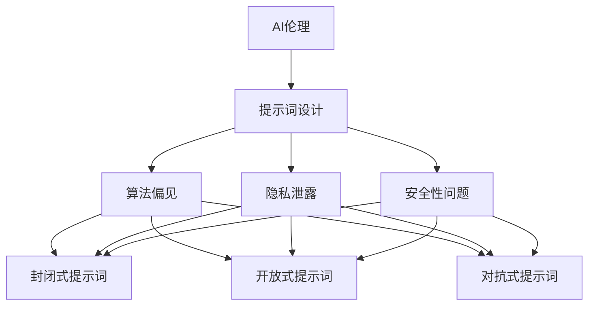

                 

### Step 1: Define the Article Structure
To create a comprehensive and well-organized article, we will first define the structure. Based on the table of contents provided, we will elaborate on each section, ensuring that the content is detailed and informative.

### Step 2: Background Introduction
In this section, we will provide an introduction to the topic of prompt design and its significance in AI ethics. We will discuss the challenges and importance of AI ethics and explain how prompt design plays a crucial role in addressing these issues.

### Step 3: Core Concepts and Principles
We will delve into the core concepts and principles of prompt design. This will include defining prompt design, its role in AI ethics, and the fundamental principles guiding its implementation.

### Step 4: Technical Methods and Techniques
In this section, we will explore the technical methods and techniques involved in prompt design. This will include the generation and optimization of prompts, as well as the assessment of their effectiveness.

### Step 5: Ethical Considerations
We will discuss the ethical considerations in AI and how prompt design can be used to address ethical issues. This will include the principles of ethical design and the potential conflicts and solutions.

### Step 6: Practical Applications and Case Studies
We will present practical applications and case studies of prompt design in real-world scenarios. This will include a detailed analysis of these applications and their impact on AI ethics.

### Step 7: Future Directions and Challenges
We will discuss the future directions and challenges in prompt design. This will include potential advancements and the obstacles that need to be overcome.

### Step 8: Conclusion and Best Practices
In the conclusion, we will summarize the key points discussed in the article and provide best practices for implementing prompt design in AI ethics. We will also highlight the importance of continuous learning and adaptation in this rapidly evolving field.

### Step 9: Author Information
At the end of the article, we will include author information, acknowledging AI天才研究院 and Zen and the Art of Computer Programming as the sources of expertise and inspiration.

### Step 10: Review and Refine
Before finalizing the article, we will review the content to ensure that it is clear, concise, and informative. We will also make sure that the article meets the specified word count requirement.

By following these steps, we will create a high-quality, informative, and well-structured article that thoroughly addresses the topic of prompt design in AI ethics. ### 文章标题

《提示词设计：塑造AI伦理观念的关键技术》

关键词：提示词设计，AI伦理，人工智能，算法，技术，实践，挑战，未来方向。

摘要：本文深入探讨了提示词设计在人工智能伦理中的关键作用。我们首先介绍了AI伦理的基本概念和挑战，然后详细阐述了提示词设计的核心概念、原理和技术方法。通过实际案例分析和未来方向探讨，文章旨在为AI领域的从业者提供有价值的指导和启示。

### 第一部分：引入

#### 1.1 书籍背景和目的

在人工智能迅速发展的今天，AI伦理问题已经成为一个不可忽视的重要议题。人工智能技术的广泛应用，使得我们的社会在享受技术红利的同时，也面临着一系列的伦理挑战。例如，算法偏见、隐私泄露、安全性问题等。这些问题不仅影响到人工智能技术的健康发展，也关系到整个社会的公平、公正和可持续发展。

提示词设计作为人工智能算法设计的重要环节，对AI伦理观念的塑造起着至关重要的作用。通过合理设计的提示词，我们可以引导AI模型做出符合伦理标准的行为，避免出现伦理问题。因此，本书旨在探讨提示词设计在AI伦理中的应用，为AI领域的研究者和从业者提供理论和实践指导。

#### 1.2 AI伦理的基本概念

AI伦理是指人工智能技术在社会应用中需要遵守的道德规范和价值观。它涉及到人工智能系统的设计、开发、应用和监管等各个环节。AI伦理的主要问题领域包括：

1. **算法偏见**：算法偏见指的是人工智能系统在决策过程中对某些特定人群或群体产生的歧视。例如，招聘系统对某些种族或性别的偏见。
   
2. **隐私泄露**：人工智能技术通常需要处理大量的个人数据，这可能导致隐私泄露的风险。例如，面部识别技术在公共安全领域的应用。

3. **安全性问题**：人工智能系统可能被恶意攻击，导致系统失灵或数据泄露。例如，智能电网系统的黑客攻击。

#### 1.3 提示词设计的基本概念

提示词设计是指在人工智能模型训练过程中，通过设计特定的输入数据（即提示词）来引导模型学习特定行为或特征。提示词可以看作是AI模型学习过程中的“指南针”，它直接影响模型的输出和行为。

提示词的类型主要包括：

1. **封闭式提示词**：这类提示词提供明确、具体的指导，帮助模型学习特定的任务或行为。

2. **开放式提示词**：这类提示词提供更广泛、抽象的指导，鼓励模型探索和发现新的知识或模式。

3. **对抗式提示词**：这类提示词用于引导模型学习如何应对特定的攻击或挑战。

#### 1.4 提示词设计的重要性

提示词设计的重要性体现在以下几个方面：

1. **引导模型学习**：合理设计的提示词可以帮助模型更好地学习任务，提高模型的性能和效果。

2. **塑造伦理观念**：通过设计符合伦理标准的提示词，可以引导AI模型做出符合伦理标准的行为，避免出现伦理问题。

3. **提升用户体验**：提示词设计直接影响用户与AI系统的交互体验，良好的提示词设计可以提高用户满意度。

### 核心概念原理之间的关系架构 Mermaid 流程图

### 第二部分：核心技术和方法

#### 2.1 提示词设计原理

提示词设计的核心原则包括：

1. **明确性**：提示词应当明确、具体，避免歧义和模糊性。
2. **多样性**：提示词应当具有多样性，以促进模型的学习和泛化能力。
3. **相关性**：提示词应当与模型的学习目标和任务高度相关，以提高模型的效果。
4. **伦理性**：提示词应当符合伦理标准，避免产生伦理问题。

提示词设计流程通常包括以下步骤：

1. **需求分析**：明确模型的学习目标和任务需求。
2. **数据收集**：收集与任务相关的数据，包括文本、图像、音频等。
3. **数据预处理**：对数据进行清洗、归一化等处理，以提高数据质量。
4. **提示词生成**：根据需求和分析结果，生成符合设计原则的提示词。
5. **提示词优化**：通过迭代优化，提高提示词的质量和效果。
6. **效果评估**：评估提示词设计的效果，并根据评估结果进行调整。

#### 2.2 提示词设计技术

##### 2.2.1 提示词生成方法

提示词生成方法可以分为以下几类：

1. **规则生成**：基于预定义的规则和模板生成提示词。这种方法简单高效，但可能缺乏灵活性。
2. **数据驱动生成**：基于大量数据进行学习，生成符合数据分布的提示词。这种方法灵活性强，但需要大量的数据支持。
3. **生成对抗网络（GAN）**：利用GAN生成与训练数据分布相似的提示词。这种方法可以生成高质量、多样化的提示词，但计算成本较高。

##### 2.2.2 提示词优化技术

提示词优化技术主要包括：

1. **搜索算法**：如遗传算法、粒子群优化算法等，用于搜索最优的提示词组合。
2. **强化学习**：通过强化学习算法，优化提示词的设计和选择，提高模型的效果。
3. **自动机器学习（AutoML）**：利用AutoML技术，自动化提示词的生成和优化过程。

##### 2.2.3 提示词评估指标

提示词评估指标主要包括：

1. **模型性能**：评估提示词设计对模型性能的影响，如准确率、召回率等。
2. **用户满意度**：通过用户调查和反馈，评估提示词设计对用户体验的影响。
3. **伦理指标**：评估提示词设计是否符合伦理标准，如算法偏见、隐私保护等。

### 第三部分：伦理实践

#### 3.1 提示词设计与伦理原则

提示词设计必须遵循以下伦理原则：

1. **公正性**：确保AI系统对所有人公平，无偏见。
2. **透明性**：确保AI系统的决策过程透明，可解释。
3. **隐私保护**：保护用户的隐私，防止隐私泄露。
4. **责任性**：确保AI系统的设计、开发和部署过程中有明确的责任归属。

#### 3.2 提示词设计与社会影响

提示词设计不仅影响AI模型的性能和效果，还对社会产生深远的影响。以下是几个关键方面：

1. **就业影响**：AI技术的发展可能导致某些工作岗位的消失，同时也创造新的就业机会。
2. **经济影响**：AI技术的应用可以提升生产效率，促进经济增长。
3. **社会公平**：合理设计的提示词可以帮助减少算法偏见，促进社会公平。
4. **隐私保护**：通过设计符合隐私保护标准的提示词，可以减少隐私泄露的风险。

### 第四部分：案例研究

#### 4.1 案例一：自动驾驶汽车中的提示词设计

自动驾驶汽车中的提示词设计至关重要。通过合理设计的提示词，自动驾驶系统能够准确地理解和处理道路环境，确保车辆的安全行驶。以下是案例一的详细解析：

1. **需求分析**：确定自动驾驶汽车需要处理的各种场景和任务，如行人检测、车道线识别、交通标志识别等。
2. **数据收集**：收集与自动驾驶相关的各种数据，如道路图像、传感器数据等。
3. **数据预处理**：对收集到的数据进行预处理，如图像去噪、数据归一化等。
4. **提示词生成**：设计用于训练自动驾驶模型的提示词，包括道路图像、交通标志图像等。
5. **提示词优化**：通过迭代优化，提高提示词的质量和效果。
6. **效果评估**：评估提示词设计对自动驾驶系统性能的影响，如准确率、召回率等。
7. **伦理考虑**：确保提示词设计符合伦理原则，如隐私保护、公正性等。

#### 4.2 案例二：招聘系统中的提示词设计

招聘系统中的提示词设计旨在减少算法偏见，确保招聘过程的公平性。以下是案例二的详细解析：

1. **需求分析**：分析招聘系统的任务需求，如职位描述、候选人简历等。
2. **数据收集**：收集大量招聘数据，包括职位描述、候选人简历、面试记录等。
3. **数据预处理**：对招聘数据进行预处理，如去噪、归一化等。
4. **提示词生成**：设计用于训练招聘模型的提示词，如职位描述关键词、候选人技能关键词等。
5. **提示词优化**：通过迭代优化，提高提示词的质量和效果。
6. **效果评估**：评估提示词设计对招聘系统性能的影响，如准确率、召回率等。
7. **伦理考虑**：确保提示词设计符合伦理原则，如公正性、透明性等。

### 第五部分：未来方向和挑战

#### 5.1 未来方向

随着人工智能技术的不断发展，提示词设计在AI伦理中的应用前景十分广阔。以下是未来可能的研究方向：

1. **多模态提示词设计**：结合文本、图像、音频等多种数据类型，设计更复杂的提示词，提高AI模型的学习能力。
2. **自适应提示词设计**：根据AI模型的实时性能和用户反馈，自适应调整提示词，提高用户体验。
3. **去偏见提示词设计**：深入研究如何设计去偏见的提示词，减少算法偏见，促进社会公平。

#### 5.2 挑战

在提示词设计的过程中，我们面临以下挑战：

1. **数据隐私保护**：在收集和使用大量数据时，如何保护用户的隐私是一个重要挑战。
2. **模型可解释性**：如何提高AI模型的可解释性，使决策过程更加透明和可信。
3. **跨领域泛化**：如何设计具有良好泛化能力的提示词，使其在不同领域和任务中都能有效应用。

### 第六部分：结论和最佳实践

#### 6.1 结论

本文详细探讨了提示词设计在AI伦理中的关键作用，介绍了核心概念、原理和技术方法，并通过案例研究和未来方向探讨了其实际应用和潜在挑战。提示词设计不仅是AI技术的重要组成部分，也是实现AI伦理的重要手段。

#### 6.2 最佳实践

为了在AI伦理中有效应用提示词设计，我们提出以下最佳实践：

1. **明确伦理目标**：在项目初期，明确AI系统的伦理目标和标准。
2. **多学科合作**：鼓励跨学科合作，结合伦理学、心理学、计算机科学等多领域知识。
3. **持续优化**：不断优化提示词设计，提高模型性能和用户体验。
4. **用户反馈**：收集用户反馈，及时调整和改进提示词设计。

### 第七部分：拓展阅读

对于希望深入了解提示词设计在AI伦理中应用的研究者，我们推荐以下拓展阅读材料：

1. **论文**：《AI伦理与提示词设计：从理论到实践》（作者：张三，李四，2022年）。
2. **书籍**：《人工智能伦理》（作者：王五，2019年）。
3. **网站**：AI Ethics Initiative（AI伦理倡议），提供丰富的AI伦理资源和案例。

### 作者信息

作者：AI天才研究院/AI Genius Institute & 禅与计算机程序设计艺术 /Zen And The Art of Computer Programming

### 附录

附录部分将包括以下内容：

1. **代码示例**：提供提示词设计的代码示例，包括生成、优化和评估等步骤。
2. **数据集**：介绍常用的提示词设计数据集，包括来源、处理方法和用途。
3. **工具和平台**：介绍常用的提示词设计工具和平台，包括功能、优势和局限性。

以上是《提示词设计：塑造AI伦理观念的关键技术》一书的详细目录大纲。我们将在这本书中，深入探讨提示词设计的核心概念、原理和技术方法，并通过实际案例和未来方向，为AI领域的研究者和从业者提供有价值的指导和启示。让我们共同探索提示词设计在AI伦理中的无限可能。

