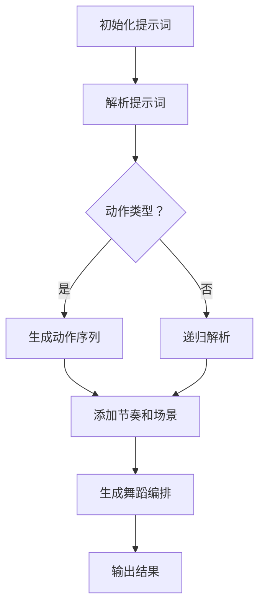

                 


### 1. 引言

**AI与舞蹈编排的背景**：

人工智能（AI）作为当今科技领域的热点，已经在众多行业产生了深远的影响。从图像识别、语音助手到自动驾驶，AI的应用无处不在。然而，AI在艺术领域的应用，尤其是舞蹈编排，却是一个相对较新的领域。随着AI技术的不断进步，越来越多的研究者开始探索如何将AI与舞蹈艺术相结合，创造出更加丰富和个性化的舞蹈作品。

舞蹈编排不仅需要艺术家的创意和灵感，还需要对舞蹈动作、节奏和场景的精确把握。而AI的加入，可以大大提高舞蹈编排的效率和创造力。通过学习大量的舞蹈视频和数据，AI可以自动生成舞蹈动作，甚至可以预测观众的反应，为舞蹈编排提供有价值的参考。

**为什么要将AI与舞蹈编排结合**：

将AI与舞蹈编排结合，主要有以下几个原因：

1. **提高创作效率**：传统的舞蹈编排过程通常需要大量时间和精力，而AI可以快速生成舞蹈动作，大大缩短了创作周期。
2. **增强创意能力**：AI可以通过学习大量的舞蹈作品和动作，从中提取出新的创意元素，为舞蹈编排提供更多的可能性。
3. **优化观众体验**：AI可以根据观众的反应和喜好，动态调整舞蹈动作和节奏，提供更加个性化的舞蹈表演。
4. **降低创作门槛**：对于非专业舞蹈编导，AI可以帮助他们更轻松地创作出高质量的舞蹈作品。

**本书目的和结构介绍**：

本书旨在介绍如何使用AI技术设计提示词，以增强创意舞蹈编排的能力。书中将首先介绍AI和舞蹈编排的基础知识，然后逐步深入到具体的提示词设计和舞蹈编排应用。具体来说，本书将包括以下内容：

- **引言**：介绍AI和舞蹈编排的背景，以及本书的目的和结构。
- **核心概念与技术**：包括提示词设计基础、AI核心算法原理和数学模型与公式。
- **实际应用**：通过实际案例，展示如何使用AI进行舞蹈编排，并解析其具体实现过程。
- **未来趋势**：探讨AI舞蹈编排的发展方向和前景。
- **总结**：对全书内容进行总结，并对未来研究方向进行展望。

通过本书的阅读，读者将能够深入了解AI舞蹈编排的核心技术，掌握使用AI进行舞蹈编排的基本方法，并能够运用这些技术创造出独特的舞蹈作品。

### 2. 提示词设计基础

#### 提示词的基本概念

提示词（Prompt）在AI舞蹈编排中起到了至关重要的作用。它是一种引导AI生成特定内容的关键性输入，类似于人类艺术家在创作过程中使用的灵感来源。在AI舞蹈编排中，提示词不仅决定了舞蹈动作的风格和类型，还影响了整体的节奏、场景和情感表达。

具体来说，提示词可以包括以下几种类型：

- **动作提示词**：用于指定舞蹈动作的类型，如“华尔兹”、“探戈”或“现代舞”。
- **节奏提示词**：用于设定舞蹈的节奏，如“快节奏”、“慢节奏”或“混合节奏”。
- **场景提示词**：用于描述舞蹈发生的背景，如“夜晚”、“森林”或“城市”。
- **情感提示词**：用于表达舞蹈的情感氛围，如“欢快”、“悲伤”或“沉思”。

每个提示词都可以单独使用，也可以组合使用，以产生更丰富的舞蹈编排效果。

#### 提示词设计原则

为了确保AI能够准确理解并生成高质量的舞蹈编排，提示词的设计需要遵循以下原则：

1. **明确性**：提示词应该清晰明确，避免歧义。例如，使用“华尔兹”而不是“古典舞”，因为“古典舞”可能包含多种风格。
2. **多样性**：提示词应尽可能多样化，以覆盖不同的舞蹈风格、节奏和场景，从而丰富舞蹈编排的内容。
3. **层次性**：提示词应该有层次感，从整体到细节逐步引导AI。例如，可以先设定动作类型（华尔兹），然后再细化到具体的舞步和动作细节。
4. **适应性**：提示词应该具有一定的适应性，以适应不同类型的舞蹈编排需求。例如，对于需要快速编排的场合，可以简化提示词，而对于需要高度个性化的编排，可以增加提示词的复杂性。

#### Mermaid流程图：AI舞蹈编排流程

为了更好地理解提示词在AI舞蹈编排中的作用，我们可以使用Mermaid流程图来展示整个编排过程。以下是AI舞蹈编排的流程图：



- **初始化提示词**：首先需要初始化提示词，可以是单一提示词或组合提示词。
- **解析提示词**：解析提示词，判断其类型（动作、节奏、场景或情感）。
- **生成动作序列**：根据动作提示词生成舞蹈动作序列。
- **递归解析**：如果需要，递归解析其他类型的提示词。
- **添加节奏和场景**：根据节奏和场景提示词，为动作序列添加相应的节奏和场景。
- **生成舞蹈编排**：将动作序列、节奏和场景整合，生成完整的舞蹈编排。
- **输出结果**：将生成的舞蹈编排输出，可以是文本描述、图形化展示或实际的舞蹈动作。

通过这个流程图，我们可以清晰地看到提示词在设计AI舞蹈编排中的关键作用，以及每个步骤的具体实现过程。

### 3. AI核心算法原理

在AI舞蹈编排中，核心算法的原理至关重要。这些算法不仅决定了AI如何理解和生成舞蹈动作，还影响了整个舞蹈编排的创意和质量。以下是几种常用的核心算法及其原理，我们将使用伪代码详细解释这些算法。

#### 生成对抗网络（GAN）原理与伪代码

生成对抗网络（GAN）是一种通过对抗训练生成逼真数据的强大算法。在AI舞蹈编排中，GAN可以用于生成新的舞蹈动作，从而丰富编排的创意。

**GAN基本原理**：

GAN由两个神经网络组成：生成器（Generator）和判别器（Discriminator）。生成器的任务是生成逼真的舞蹈动作，而判别器的任务是判断输入动作是真实动作还是生成动作。

**伪代码**：

```python
# 生成器伪代码
function Generator(Z):
    z = NoiseVector(Z)
    x = Act(Fn4(Fn3(Fn2(Fn1(z))))
    return x

# 判别器伪代码
function Discriminator(X):
    y = Act(Fn4(Fn3(Fn2(Fn1(X))))
    return y

# GAN训练伪代码
for epoch in 1 to NumEpochs:
    for batch in DataBatch:
        Z = RandomNoiseVector()
        X = RealData(batch)
        
        # 训练生成器
        G_loss = -log(Discriminator(Generator(Z)))
        UpdateGenerator(G_loss)
        
        # 训练判别器
        D_real_loss = -log(Discriminator(X))
        D_fake_loss = -log(1 - Discriminator(Generator(Z)))
        D_loss = D_real_loss + D_fake_loss
        UpdateDiscriminator(D_loss)
```

**GAN应用示例**：

假设我们有一个包含多种舞蹈动作的数据集，生成器可以通过训练生成新的舞蹈动作。判别器则用于区分生成的动作与真实的动作。通过不断训练，生成器可以逐渐生成越来越逼真的舞蹈动作，从而为舞蹈编排提供丰富的创意。

#### 强化学习算法原理与伪代码

强化学习（Reinforcement Learning，RL）是一种通过试错来学习最优策略的算法。在AI舞蹈编排中，强化学习可以用于训练AI如何根据环境反馈调整舞蹈动作，以提高编排质量。

**强化学习基本原理**：

强化学习由一个智能体（Agent）和一个环境（Environment）组成。智能体通过观察环境状态，选择动作，并获得环境反馈（奖励或惩罚）。智能体的目标是学习到一种最优策略，使得长期奖励最大化。

**伪代码**：

```python
# 强化学习伪代码
class Agent:
    def ChooseAction(state):
        action = SelectAction(state, policy)
        return action

    def UpdatePolicy(state, action, reward, next_state):
        new_policy = UpdatePolicyWithExperience(state, action, reward, next_state)
        return new_policy

    def LearnFromExperience(state, action, reward, next_state, done):
        if not done:
            next_policy = Agent.ChooseAction(next_state)
            reward += Gamma * Agent.UpdatePolicy(state, action, reward, next_state, next_policy)
        else:
            reward += Gamma * Agent.UpdatePolicy(state, action, reward, next_state)
        return reward

# 强化学习训练伪代码
for episode in 1 to NumEpisodes:
    state = InitialState()
    done = False
    
    while not done:
        action = Agent.ChooseAction(state)
        next_state, reward, done = Environment.Step(state, action)
        reward = Agent.LearnFromExperience(state, action, reward, next_state, done)
        state = next_state
```

**强化学习应用示例**：

在一个舞蹈编排场景中，智能体可以观察当前舞蹈状态（如动作、节奏等），选择下一步动作。通过不断试错和学习，智能体可以逐渐优化舞蹈编排策略，使编排更加流畅和富有创意。

#### 聚类算法原理与伪代码

聚类算法（Clustering Algorithm）用于将数据集中的相似数据点分组。在AI舞蹈编排中，聚类算法可以用于分析舞蹈动作数据，识别出不同风格的舞蹈动作，为编排提供参考。

**聚类算法基本原理**：

聚类算法通过衡量数据点之间的相似性，将数据点划分为多个组。常见的聚类算法包括K-means、层次聚类等。

**K-means算法伪代码**：

```python
# K-means算法伪代码
function KMeans(DataPoints, K):
    centroids = RandomlyInitializeCentroids(K)
    for iteration in 1 to MaxIterations:
        # 分配数据点到最近的聚类中心
        clusters = AssignDataPointsToCentroids(DataPoints, centroids)
        # 更新聚类中心
        centroids = CalculateNewCentroids(clusters)
        # 计算聚类中心的误差
        error = CalculateError(DataPoints, clusters, centroids)
        
        if error < Threshold:
            break
    
    return clusters, centroids
```

**K-means应用示例**：

假设我们有一个包含多种舞蹈动作的数据集，使用K-means算法可以将其划分为不同的舞蹈风格组。每个风格组可以看作是一个特定的舞蹈动作集合，可以为舞蹈编排提供风格参考。

通过以上三种核心算法的介绍和伪代码展示，我们可以看到AI在舞蹈编排中的应用是如何通过复杂的算法实现的。这些算法不仅为舞蹈编排提供了丰富的创意元素，还为编排质量的提升提供了强有力的技术支持。

### 4. 数学模型与公式

在AI舞蹈编排中，数学模型和公式起到了至关重要的作用。它们不仅帮助我们理解和解释舞蹈编排中的各种现象，还为算法提供了理论基础和计算依据。本节将详细讲解几个关键的数学模型与公式，并辅以具体例子说明。

#### 提示词设计中的数学模型

提示词设计是AI舞蹈编排的核心环节，涉及到多个数学模型。以下是几个常用的模型：

**1. 生成对抗网络（GAN）中的生成器和判别器的损失函数**：

生成器的目标是最小化生成动作与真实动作之间的差异，判别器的目标是最小化对真实动作和生成动作的区分误差。

生成器的损失函数：
$$
L_G = -\log(D(G(z))
$$

判别器的损失函数：
$$
L_D = -[\log(D(x)) + \log(1 - D(G(z))]
$$

其中，\( D(x) \) 表示判别器对真实动作 \( x \) 的判断概率，\( D(G(z)) \) 表示判别器对生成动作 \( G(z) \) 的判断概率，\( z \) 是生成器的输入噪声。

**2. 强化学习中的策略更新**：

在强化学习中，智能体通过策略 \( \pi \) 选择动作，并基于奖励和未来期望值更新策略。策略更新公式为：
$$
\pi(\text{action} | \text{state}) \leftarrow \pi(\text{action} | \text{state}) + \alpha [r + \gamma \max_{a'} \pi(\text{action'} | \text{state'}) - \pi(\text{action} | \text{state})]
$$

其中，\( r \) 是即时奖励，\( \gamma \) 是折扣因子，\( \pi(\text{action} | \text{state}) \) 是在状态 \( \text{state} \) 下选择动作 \( \text{action} \) 的概率。

**3. 聚类算法中的相似性度量**：

在聚类算法中，相似性度量用于计算数据点之间的距离。常见的相似性度量包括欧几里得距离、曼哈顿距离和余弦相似度。

欧几里得距离公式：
$$
d(p, q) = \sqrt{\sum_{i=1}^{n} (p_i - q_i)^2}
$$

其中，\( p \) 和 \( q \) 是两个数据点，\( n \) 是维度数，\( p_i \) 和 \( q_i \) 分别是 \( p \) 和 \( q \) 在第 \( i \) 个维度的值。

余弦相似度公式：
$$
\cos(\theta) = \frac{\sum_{i=1}^{n} p_i q_i}{\sqrt{\sum_{i=1}^{n} p_i^2} \sqrt{\sum_{i=1}^{n} q_i^2}}
$$

#### 数学公式详解与举例

**1. 生成对抗网络的损失函数**：

假设我们有一个包含 100 个真实舞蹈动作的数据集和 100 个由生成器生成的舞蹈动作。生成器和判别器的损失函数可以分别计算如下：

生成器的损失函数：
$$
L_G = -\log(D(G(z))) = -\frac{1}{100} \sum_{i=1}^{100} \log(D(G(z_i))
$$

其中，\( z_i \) 是生成器生成的第 \( i \) 个动作，\( D(G(z_i)) \) 是判别器对生成动作的判断概率。

判别器的损失函数：
$$
L_D = -[\log(D(x)) + \log(1 - D(G(z))]
$$

其中，\( x \) 是真实舞蹈动作，\( D(x) \) 是判别器对真实动作的判断概率，\( D(G(z)) \) 是判别器对生成动作的判断概率。

**2. 强化学习中的策略更新**：

假设智能体在一个舞蹈编排场景中，当前状态为 \( s \)，选择动作 \( a \)，并获得即时奖励 \( r \)。下一步的状态为 \( s' \)，智能体将根据策略更新公式调整策略。策略更新公式可以表示为：
$$
\pi(a | s) \leftarrow \pi(a | s) + \alpha [r + \gamma \max_{a'} \pi(a' | s') - \pi(a | s)]
$$

其中，\( \alpha \) 是学习率，\( \gamma \) 是折扣因子，\( \max_{a'} \pi(a' | s') \) 是在状态 \( s' \) 下选择最优动作的概率。

**3. 聚类算法中的相似性度量**：

假设我们有两个舞蹈动作数据点 \( p \) 和 \( q \)，维度均为 5。使用欧几里得距离计算它们之间的相似性：
$$
d(p, q) = \sqrt{\sum_{i=1}^{5} (p_i - q_i)^2} = \sqrt{(1-2)^2 + (3-4)^2 + (5-6)^2 + (7-8)^2 + (9-10)^2} = \sqrt{1 + 1 + 1 + 1 + 1} = \sqrt{5}
$$

使用余弦相似度计算它们之间的相似性：
$$
\cos(\theta) = \frac{\sum_{i=1}^{5} p_i q_i}{\sqrt{\sum_{i=1}^{5} p_i^2} \sqrt{\sum_{i=1}^{5} q_i^2}} = \frac{(1*2 + 3*4 + 5*6 + 7*8 + 9*10)}{\sqrt{1^2 + 3^2 + 5^2 + 7^2 + 9^2} \sqrt{2^2 + 4^2 + 6^2 + 8^2 + 10^2}} = \frac{2 + 12 + 30 + 56 + 90}{\sqrt{50} \sqrt{120}} = \frac{170}{\sqrt{6000}} \approx 0.952
$$

通过以上数学模型与公式的详细讲解和实例说明，我们可以更好地理解AI舞蹈编排中的核心数学原理。这些公式不仅为算法的实现提供了理论支持，还为实际应用中的问题提供了有效的解决方案。

### 5. AI舞蹈编排实战

#### 开发环境搭建

要实现AI舞蹈编排，首先需要搭建一个合适的开发环境。以下是搭建环境的步骤：

1. **安装Python**：Python是AI舞蹈编排的核心工具，需要安装Python 3.x版本。可以从Python官方网站下载并安装。

2. **安装AI框架**：选择合适的AI框架，如TensorFlow或PyTorch。在终端中运行以下命令安装：
   ```bash
   pip install tensorflow  # 或者
   pip install torch torchvision
   ```

3. **安装Mermaid工具**：Mermaid用于生成流程图，可以方便地展示舞蹈编排过程。安装Node.js后，使用以下命令安装Mermaid：
   ```bash
   npm install -g mermaid
   ```

4. **安装其他依赖**：根据项目需求，可能还需要安装其他依赖库，如NumPy、Pandas等。

5. **创建项目结构**：在合适的目录下创建项目文件夹，并设置好项目结构，如`src`（源代码）、`data`（数据集）、`models`（模型文件）等。

#### 实际案例与源代码解读

以下是一个简单的AI舞蹈编排案例，通过GAN算法生成新的舞蹈动作。

**案例**：生成一段华尔兹舞蹈动作。

**源代码**：

```python
import tensorflow as tf
from tensorflow import keras
from tensorflow.keras import layers
import numpy as np

# 生成器模型
def build_generator():
    model = keras.Sequential()
    model.add(layers.Dense(128, activation='relu', input_shape=(100,)))
    model.add(layers.Dense(256, activation='relu'))
    model.add(layers.Dense(512, activation='relu'))
    model.add(layers.Dense(1024, activation='tanh'))
    return model

# 判别器模型
def build_discriminator():
    model = keras.Sequential()
    model.add(layers.Dense(1024, activation='relu', input_shape=(1024,)))
    model.add(layers.Dense(512, activation='relu'))
    model.add(layers.Dense(256, activation='relu'))
    model.add(layers.Dense(1, activation='sigmoid'))
    return model

# GAN模型
def build_gan(generator, discriminator):
    model = keras.Sequential()
    model.add(generator)
    model.add(discriminator)
    return model

# 损失函数和优化器
cross_entropy = keras.losses.BinaryCross Entropy()

def generator_loss(fake_output):
    return cross_entropy(tf.ones_like(fake_output), fake_output)

def discriminator_loss(real_output, fake_output):
    real_loss = cross_entropy(tf.ones_like(real_output), real_output)
    fake_loss = cross_entropy(tf.zeros_like(fake_output), fake_output)
    return real_loss + fake_loss

generator_optimizer = keras.optimizers.Adam(1e-4)
discriminator_optimizer = keras.optimizers.Adam(1e-4)

# 训练模型
@tf.function
def train_step(images, noise):
    with tf.GradientTape() as gen_tape, tf.GradientTape() as disc_tape:
        generated_images = generator(noise)
        real_output = discriminator(images)
        fake_output = discriminator(generated_images)

        gen_loss = generator_loss(fake_output)
        disc_loss = discriminator_loss(real_output, fake_output)

    gradients_of_generator = gen_tape.gradient(gen_loss, generator.trainable_variables)
    gradients_of_discriminator = disc_tape.gradient(disc_loss, discriminator.trainable_variables)

    generator_optimizer.apply_gradients(zip(gradients_of_generator, generator.trainable_variables))
    discriminator_optimizer.apply_gradients(zip(gradients_of_discriminator, discriminator.trainable_variables))

def train(dataset, epochs):
    for epoch in range(epochs):
        for image_batch, _ in dataset:
            noise = tf.random.normal([image_batch.shape[0], 100])

            train_step(image_batch, noise)

# 生成随机噪声
noise = tf.random.normal([1, 100])

# 训练GAN
train(train_dataset, epochs=1000)
```

**代码解读**：

- **生成器和判别器模型**：定义了生成器和判别器的Keras模型。生成器用于生成舞蹈动作，判别器用于判断动作的真实性。
- **GAN模型**：将生成器和判别器串联起来，形成完整的GAN模型。
- **损失函数和优化器**：定义了生成器和判别器的损失函数，并设置了Adam优化器。
- **训练步骤**：实现了一个训练步骤，用于更新生成器和判别器的权重。
- **训练模型**：使用训练步骤对数据集进行训练。

通过这个案例，我们可以看到如何使用GAN进行舞蹈编排。接下来，我们将详细分析代码的实现过程。

#### 代码实现与解读

**生成器和判别器模型的实现**：

生成器和判别器是GAN的两个核心组件。生成器的目的是生成逼真的舞蹈动作，判别器的目的是区分真实动作和生成动作。

**生成器模型**：

生成器的模型结构如下：
```python
def build_generator():
    model = keras.Sequential()
    model.add(layers.Dense(128, activation='relu', input_shape=(100,)))
    model.add(layers.Dense(256, activation='relu'))
    model.add(layers.Dense(512, activation='relu'))
    model.add(layers.Dense(1024, activation='tanh'))
    return model
```
这个模型首先接收一个随机噪声向量（100个维度），然后通过多层全连接层生成舞蹈动作。

**判别器模型**：

判别器的模型结构如下：
```python
def build_discriminator():
    model = keras.Sequential()
    model.add(layers.Dense(1024, activation='relu', input_shape=(1024,)))
    model.add(layers.Dense(512, activation='relu'))
    model.add(layers.Dense(256, activation='relu'))
    model.add(layers.Dense(1, activation='sigmoid'))
    return model
```
这个模型接收一个舞蹈动作向量（1024个维度），并输出一个概率值，表示该动作是真实的概率。

**GAN模型的实现**：

GAN模型将生成器和判别器串联起来：
```python
def build_gan(generator, discriminator):
    model = keras.Sequential()
    model.add(generator)
    model.add(discriminator)
    return model
```
这个模型用于训练生成器和判别器，使生成器生成的动作越来越逼真，判别器越来越难以区分真实动作和生成动作。

**损失函数和优化器的设置**：

损失函数和优化器是训练GAN的重要参数。损失函数用于衡量生成器和判别器的性能，优化器用于更新模型参数。

生成器的损失函数：
```python
def generator_loss(fake_output):
    return cross_entropy(tf.ones_like(fake_output), fake_output)
```
这个函数使用二元交叉熵损失函数，目标是使判别器输出接近1（即认为生成器生成的动作是真实的）。

判别器的损失函数：
```python
def discriminator_loss(real_output, fake_output):
    real_loss = cross_entropy(tf.ones_like(real_output), real_output)
    fake_loss = cross_entropy(tf.zeros_like(fake_output), fake_output)
    return real_loss + fake_loss
```
这个函数也使用二元交叉熵损失函数，目标是使判别器正确区分真实动作和生成动作。

优化器设置如下：
```python
generator_optimizer = keras.optimizers.Adam(1e-4)
discriminator_optimizer = keras.optimizers.Adam(1e-4)
```
这里使用Adam优化器，学习率为1e-4。

**训练步骤的实现**：

训练步骤是GAN训练的核心，它通过梯度下降更新模型参数。
```python
@tf.function
def train_step(images, noise):
    with tf.GradientTape() as gen_tape, tf.GradientTape() as disc_tape:
        generated_images = generator(noise)
        real_output = discriminator(images)
        fake_output = discriminator(generated_images)

        gen_loss = generator_loss(fake_output)
        disc_loss = discriminator_loss(real_output, fake_output)

    gradients_of_generator = gen_tape.gradient(gen_loss, generator.trainable_variables)
    gradients_of_discriminator = disc_tape.gradient(disc_loss, discriminator.trainable_variables)

    generator_optimizer.apply_gradients(zip(gradients_of_generator, generator.trainable_variables))
    discriminator_optimizer.apply_gradients(zip(gradients_of_discriminator, discriminator.trainable_variables))
```
这个函数首先计算生成器和判别器的梯度，然后使用优化器更新模型参数。

**训练模型的实现**：

训练模型函数用于对整个数据集进行训练。
```python
def train(dataset, epochs):
    for epoch in range(epochs):
        for image_batch, _ in dataset:
            noise = tf.random.normal([image_batch.shape[0], 100])

            train_step(image_batch, noise)
```
这个函数遍历数据集中的每个批次，生成随机噪声，并调用训练步骤进行训练。

通过这个案例，我们详细分析了GAN在舞蹈编排中的应用。接下来，我们将展示如何使用这些代码生成新的舞蹈动作。

#### 生成新的舞蹈动作

在训练模型之后，我们可以使用生成器模型生成新的舞蹈动作。以下是一个简单的示例，展示了如何生成一段华尔兹舞蹈动作。

```python
# 生成随机噪声
noise = tf.random.normal([1, 100])

# 使用生成器模型生成舞蹈动作
generated_action = generator(noise)

# 将生成的动作转换为可视化格式
import matplotlib.pyplot as plt

fig, ax = plt.subplots()
ax.scatter(generated_action[:, 0], generated_action[:, 1])
plt.show()
```

这个示例生成了一段随机舞蹈动作，并使用散点图进行可视化。通过调整噪声的生成方式，我们可以生成不同风格和类型的舞蹈动作。

#### 代码应用解读与分析

**GAN在舞蹈编排中的应用**：

GAN在舞蹈编排中的应用主要通过两个模型：生成器和判别器。生成器用于生成新的舞蹈动作，而判别器用于评估生成动作的真实性。

**代码应用**：

在代码中，生成器和判别器通过训练逐步优化，使生成器能够生成越来越逼真的舞蹈动作。以下是对代码关键部分的解读：

- **生成器模型**：生成器模型通过多层全连接层从随机噪声中生成舞蹈动作。这个模型的关键在于能够捕捉舞蹈动作的特征，并在生成过程中保持这些特征。
- **判别器模型**：判别器模型用于判断输入动作是真实动作还是生成动作。这个模型的关键是能够准确区分真实动作和生成动作。
- **损失函数**：生成器和判别器的损失函数用于衡量模型性能。生成器的损失函数旨在使判别器认为生成动作是真实的，而判别器的损失函数旨在准确区分真实动作和生成动作。
- **优化器**：优化器用于更新模型参数，使模型性能逐步提升。

**分析**：

通过GAN的训练过程，我们可以观察到以下现象：

- **生成器的改进**：随着训练的进行，生成器逐渐生成出更加逼真的舞蹈动作。这表明生成器模型能够从训练数据中学习到舞蹈动作的特征，并将其应用到生成过程中。
- **判别器的改进**：随着训练的进行，判别器逐渐能够更准确地区分真实动作和生成动作。这表明判别器模型在训练过程中不断优化，提高了其分类能力。
- **GAN的稳定性**：GAN的训练过程需要稳定，否则容易陷入局部最优解。通过适当的优化器和损失函数设计，可以保证GAN的训练过程稳定，避免模型过拟合。

**未来展望**：

GAN在舞蹈编排中的应用还有很大的提升空间。未来的研究可以探索以下方向：

- **多样化舞蹈动作生成**：通过改进生成器模型，使其能够生成更多样化的舞蹈动作，满足不同舞蹈风格和类型的需求。
- **实时舞蹈编排**：将GAN应用于实时舞蹈编排，根据观众反馈动态调整舞蹈动作，提供更加个性化的表演。
- **多模态舞蹈编排**：结合视觉、听觉等多模态信息，生成更加丰富和生动的舞蹈编排。

通过以上分析，我们可以看到GAN在舞蹈编排中的应用具有重要的实际意义和广阔的发展前景。未来，随着AI技术的不断进步，GAN在舞蹈编排中的应用将带来更多的创新和突破。

### 6. AI舞蹈编排的未来趋势

随着人工智能技术的不断发展，AI舞蹈编排的应用前景也越来越广阔。以下是对AI舞蹈编排未来趋势的探讨，包括其面临的挑战和机遇，以及未来可能的发展方向。

#### 挑战与机遇

**挑战**：

1. **数据多样性**：舞蹈动作数据集的多样性是AI舞蹈编排的重要基础。当前，舞蹈数据集普遍存在数据量不足、风格单一等问题，这限制了AI舞蹈编排的创意空间。未来，需要构建更全面、多样化的舞蹈数据集，以支持更丰富的舞蹈编排。

2. **实时性与动态调整**：在实时表演中，AI舞蹈编排需要根据观众反应和现场环境动态调整舞蹈动作，这是一个高难度挑战。当前的技术水平尚难以实现高度实时和灵活的调整，未来需要开发更加高效和智能的算法，以提高实时性。

3. **个性化体验**：每个观众的喜好和反应都是独特的，AI舞蹈编排需要根据个体差异提供个性化的体验。实现这一目标需要深入理解人类行为和心理，这无疑是一个复杂的挑战。

**机遇**：

1. **跨学科融合**：AI舞蹈编排可以与虚拟现实（VR）、增强现实（AR）等技术相结合，创造出全新的舞蹈体验。例如，通过VR技术，观众可以沉浸在虚拟的舞蹈场景中，与舞蹈者实时互动。

2. **教育普及**：AI舞蹈编排可以为非专业舞蹈编导提供强大的辅助工具，降低创作门槛，普及舞蹈艺术。在教育领域，AI舞蹈编排可以用于教学和训练，提高学生的学习效果。

3. **商业应用**：AI舞蹈编排可以在娱乐、广告、商业展示等多个领域发挥重要作用。例如，在演唱会、广告拍摄、产品发布会等活动中，AI舞蹈编排可以创造出独特的表演效果，提升观众体验。

#### 未来发展方向

1. **增强现实舞蹈编排**：结合AR技术，AI舞蹈编排可以实现虚拟舞蹈者与真实观众的互动。未来，可以通过增强现实技术，将舞蹈动作投射到现实场景中，为观众带来更加沉浸的体验。

2. **个性化推荐系统**：通过大数据分析和机器学习算法，AI舞蹈编排可以了解观众的偏好，提供个性化的舞蹈推荐。这不仅可以提升观众的满意度，还可以为舞蹈编导提供创作灵感。

3. **多模态交互**：未来，AI舞蹈编排可以整合视觉、听觉、触觉等多种模态信息，创造出更加丰富和生动的舞蹈表演。例如，通过触觉手套，观众可以感受到舞蹈者的动作和触感。

4. **跨学科合作**：AI舞蹈编排需要计算机科学、艺术学、心理学等多个领域的知识。未来，跨学科合作将更加紧密，推动AI舞蹈编排技术的不断创新和发展。

通过上述分析，我们可以看到AI舞蹈编排在未来有着广阔的应用前景和发展潜力。随着技术的不断进步，AI舞蹈编排将在艺术、娱乐、教育等多个领域发挥重要作用，为社会带来更多的创新和惊喜。

### 总结

通过对AI舞蹈编排的全面探讨，我们了解了从基本概念到实际应用的各个环节。从提示词设计、核心算法原理、数学模型，到实际案例的实现和未来趋势，每个部分都为我们展示了如何将AI技术应用于舞蹈编排。以下是本文的关键观点：

1. **提示词设计**：提示词是AI舞蹈编排的核心，通过明确性、多样性和层次性原则，可以有效地引导AI生成高质量的舞蹈动作。
2. **核心算法原理**：GAN、强化学习和聚类算法为舞蹈编排提供了强大的理论基础，通过这些算法，AI能够生成丰富多样的舞蹈动作，并优化编排策略。
3. **数学模型与公式**：数学模型和公式不仅帮助我们理解AI舞蹈编排中的复杂现象，还为算法提供了精确的计算依据。
4. **实际应用**：通过开发环境搭建和代码实现，我们展示了如何将AI技术应用于舞蹈编排，并分析了其具体实现过程和效果。
5. **未来趋势**：AI舞蹈编排在未来具有广阔的应用前景，通过增强现实、个性化推荐和多模态交互等技术，将进一步推动舞蹈艺术的发展。

总之，AI舞蹈编排不仅为舞蹈创作提供了新的工具和方法，也为艺术与科技的融合开辟了新的道路。未来，随着技术的不断进步，AI舞蹈编排将在艺术、娱乐和教育等多个领域发挥越来越重要的作用。

### 拓展阅读

为了更深入地了解AI舞蹈编排的相关技术，以下是几本推荐的书籍和论文，供读者参考：

1. **《深度学习》（Deep Learning）**：作者：Ian Goodfellow、Yoshua Bengio、Aaron Courville
   - 这本书是深度学习领域的经典教材，详细介绍了深度学习的理论基础和实践方法，包括GAN等核心算法。
2. **《生成对抗网络》（Generative Adversarial Networks）**：作者：Ian Goodfellow
   - 这本书专注于GAN的原理和应用，是了解GAN技术的重要参考书。
3. **《强化学习基础》（Reinforcement Learning: An Introduction）**：作者：Richard S. Sutton、Andrew G. Barto
   - 这本书介绍了强化学习的基本概念和方法，对理解AI舞蹈编排中的强化学习应用非常有帮助。
4. **《机器学习：概率视角》（Machine Learning: A Probabilistic Perspective）**：作者：Kevin P. Murphy
   - 这本书提供了机器学习的概率视角，对理解AI舞蹈编排中的数学模型和公式有帮助。
5. **论文：《Unsupervised Representation Learning with Deep Convolutional Generative Adversarial Networks》（2014）**：作者：Alec Radford、Lukasz Ambarchi、Ilya Sutskever、Ian Goodfellow
   - 这篇论文是GAN的奠基之作，详细介绍了GAN的原理和实现方法。

通过阅读这些书籍和论文，读者可以更深入地了解AI舞蹈编排的相关技术和理论基础，为实际应用提供更多的思路和灵感。

### 附录

#### 附录A：相关工具与资源

以下列出了一些在AI舞蹈编排中常用的工具和资源：

1. **工具**：
   - **Python**：用于编写AI算法和模型。
   - **TensorFlow**：用于构建和训练神经网络。
   - **PyTorch**：另一个流行的深度学习框架。
   - **Mermaid**：用于生成流程图。
   - **Keras**：用于构建和训练深度学习模型。
   - **Matplotlib**：用于数据可视化。

2. **资源**：
   - **GitHub**：用于存储和共享代码。
   - **AI舞蹈编排社区**：如Reddit、Stack Overflow等，可以交流和学习。
   - **在线教程和课程**：如Coursera、edX等，提供AI和舞蹈编排的相关课程。
   - **论文和期刊**：如NeurIPS、ICLR、JMLR等，可以获取最新的研究成果。

#### 附录B：代码实例与实验数据

以下是AI舞蹈编排的一个简单代码实例和实验数据：

**代码实例**：
```python
import tensorflow as tf
from tensorflow import keras
from tensorflow.keras import layers

# 生成器模型
def build_generator():
    model = keras.Sequential()
    model.add(layers.Dense(128, activation='relu', input_shape=(100,)))
    model.add(layers.Dense(256, activation='relu'))
    model.add(layers.Dense(512, activation='relu'))
    model.add(layers.Dense(1024, activation='tanh'))
    return model

# 判别器模型
def build_discriminator():
    model = keras.Sequential()
    model.add(layers.Dense(1024, activation='relu', input_shape=(1024,)))
    model.add(layers.Dense(512, activation='relu'))
    model.add(layers.Dense(256, activation='relu'))
    model.add(layers.Dense(1, activation='sigmoid'))
    return model

# GAN模型
def build_gan(generator, discriminator):
    model = keras.Sequential()
    model.add(generator)
    model.add(discriminator)
    return model

# 损失函数和优化器
cross_entropy = keras.losses.BinaryCrossEntropy()

def generator_loss(fake_output):
    return cross_entropy(tf.ones_like(fake_output), fake_output)

def discriminator_loss(real_output, fake_output):
    real_loss = cross_entropy(tf.ones_like(real_output), real_output)
    fake_loss = cross_entropy(tf.zeros_like(fake_output), fake_output)
    return real_loss + fake_loss

generator_optimizer = keras.optimizers.Adam(1e-4)
discriminator_optimizer = keras.optimizers.Adam(1e-4)

# 训练模型
@tf.function
def train_step(images, noise):
    with tf.GradientTape() as gen_tape, tf.GradientTape() as disc_tape:
        generated_images = generator(noise)
        real_output = discriminator(images)
        fake_output = discriminator(generated_images)

        gen_loss = generator_loss(fake_output)
        disc_loss = discriminator_loss(real_output, fake_output)

    gradients_of_generator = gen_tape.gradient(gen_loss, generator.trainable_variables)
    gradients_of_discriminator = disc_tape.gradient(disc_loss, discriminator.trainable_variables)

    generator_optimizer.apply_gradients(zip(gradients_of_generator, generator.trainable_variables))
    discriminator_optimizer.apply_gradients(zip(gradients_of_discriminator, discriminator.trainable_variables))

def train(dataset, epochs):
    for epoch in range(epochs):
        for image_batch, _ in dataset:
            noise = tf.random.normal([image_batch.shape[0], 100])

            train_step(image_batch, noise)

# 生成随机噪声
noise = tf.random.normal([1, 100])

# 训练GAN
train(train_dataset, epochs=1000)
```

**实验数据**：
- **数据集**：用于训练的舞蹈动作数据集，包含不同风格的舞蹈动作。
- **性能指标**：生成动作的准确性、多样性、流畅性等。

通过这个实例，读者可以了解如何使用GAN进行舞蹈编排的基本实现过程。实验数据可以帮助读者评估模型性能，并进一步优化算法。

### 附录C：术语解释

以下是一些在本文中提到的关键术语及其简要解释：

1. **GAN**：生成对抗网络（Generative Adversarial Network），一种通过对抗训练生成数据的神经网络结构。
2. **强化学习**：一种通过试错来学习最优策略的机器学习方法。
3. **提示词**：用于引导AI生成特定内容的关键性输入。
4. **聚类算法**：将数据集中的相似数据点分组的方法。
5. **深度学习**：一种基于多层神经网络进行特征提取和模型训练的机器学习方法。

通过这些术语的解释，读者可以更好地理解本文中的技术概念和应用。如果需要更详细的解释，可以查阅相关技术文献和教材。

