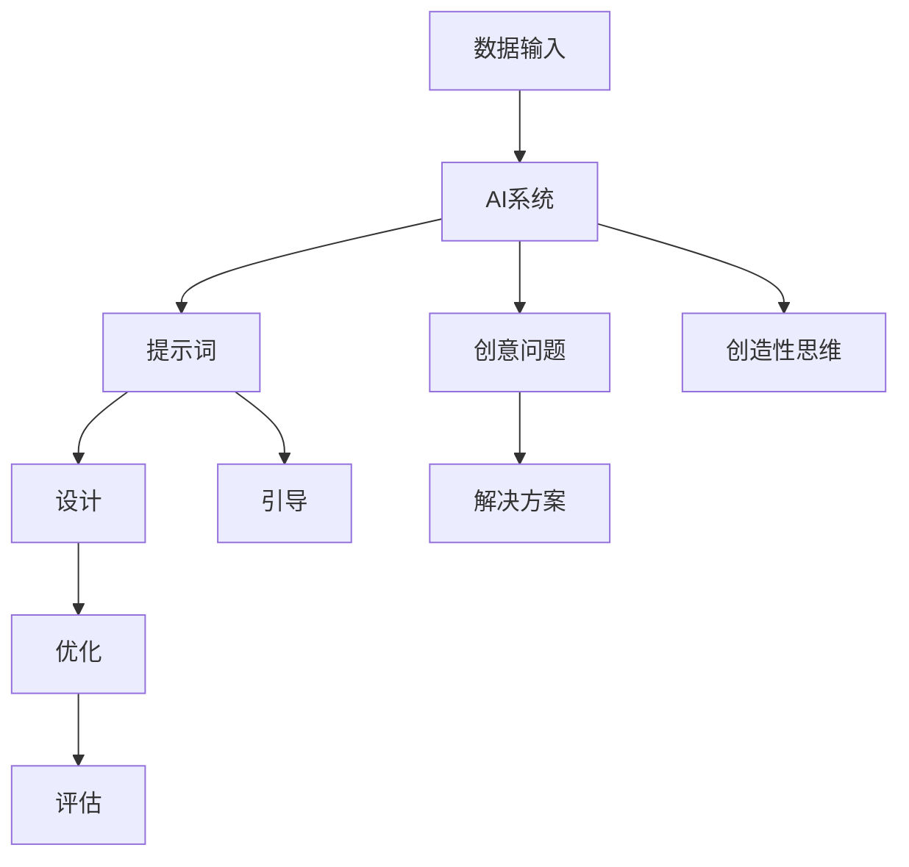

                 

### 《提示词设计：增强AI创意问题解决能力》引言

提示词设计，作为一个新兴的研究领域，正在迅速崛起，并在人工智能（AI）的各个应用领域中扮演着关键角色。本文旨在深入探讨《提示词设计：增强AI创意问题解决能力》这本书的核心内容，并从技术视角解析其背后的原理和应用。

首先，我们需要明确提示词设计的定义。提示词设计指的是创建一组特定的词或短语，用来引导和激励AI系统，使其能够更好地理解和解决特定的创意性问题。这些提示词不仅能够帮助AI系统明确问题的核心，还能激发其创造性思维，从而实现更高层次的创意生成和问题解决。

《提示词设计：增强AI创意问题解决能力》这本书的作者从多个维度深入探讨了这一主题。书中首先介绍了AI的基本概念和发展历程，帮助读者理解AI在现代社会中的地位和作用。接着，作者详细阐述了创意问题的定义和特征，并探讨了如何利用AI技术来解决这些复杂问题。

本文将按照以下结构展开：

1. **核心概念与联系**：首先介绍提示词设计的核心概念，并使用Mermaid流程图展示其与其他概念之间的联系。
2. **核心算法原理讲解**：详细阐述提示词设计中的关键算法，使用伪代码说明其实现步骤。
3. **数学模型与公式**：介绍与提示词设计相关的数学模型，使用latex格式表示，并进行详细讲解和举例说明。
4. **项目实战**：提供实际项目案例，详细解释提示词设计的应用和实现过程。
5. **总结与展望**：总结文章的核心内容，并对未来的研究方向进行展望。

通过逐步分析这些内容，我们将对提示词设计的原理、应用和未来发展有一个全面的理解。接下来，让我们开始深入探讨这本书的每个章节，以理解提示词设计的核心概念和原理。

### 核心概念与联系

在深入探讨提示词设计的核心概念之前，我们需要明确一些基础术语和概念。首先，提示词（Prompt）是指提供给AI系统的一组词或短语，用以引导其进行特定任务或生成特定结果。而设计（Design）则是指通过系统化和结构化的方法来创建和优化这些提示词，以便最大限度地发挥AI系统的潜力。

为了更好地理解这些概念之间的联系，我们可以使用Mermaid流程图来展示它们之间的关系。以下是Mermaid流程图的一个示例：



在这个流程图中，我们可以看到以下几个关键概念及其相互联系：

- **AI系统**：作为执行任务的主体，接收提示词和数据输入，生成解决方案。
- **提示词**：作为AI系统的输入，由设计者根据特定任务需求进行定制。
- **设计**：涉及提示词的创建、优化和评估，目的是提高AI系统的性能和创造力。
- **创意问题**：指需要AI系统解决的复杂问题，通常涉及高层次的抽象思维和创新能力。
- **解决方案**：AI系统根据提示词和数据进行推理和生成，解决问题的结果。
- **引导**：提示词对AI系统行为的引导，使其能够按照预期方向进行推理和生成。
- **创造性思维**：AI系统在解决问题的过程中展现出的创新能力和思考模式。

这些概念之间的关系可以概括如下：

1. **数据输入**：AI系统首先接收数据输入，这些数据可以是文本、图像、声音等多种形式。
2. **提示词生成**：设计者根据数据输入和任务需求，生成特定的提示词。
3. **AI系统处理**：AI系统接收到提示词后，进行推理和生成，尝试解决问题。
4. **优化设计**：设计者根据AI系统的表现，对提示词进行优化，提高其效果。
5. **评估与反馈**：评估AI系统的解决方案，并提供反馈，以指导下一步的设计和优化。

通过这个流程，我们可以看到提示词设计在AI系统与创意问题解决之间的桥梁作用。它不仅能够引导AI系统正确理解和解决问题，还能激发其创造性思维，从而生成更加丰富和创新的解决方案。

### AI与创意问题解决

人工智能（AI）作为计算机科学的一个重要分支，近年来取得了显著的进展。AI技术已经深入到我们生活的方方面面，从智能家居到自动驾驶，从医疗诊断到金融服务，都离不开AI的影子。然而，AI的真正潜力不仅在于其执行任务的能力，更在于其解决复杂问题、创造新解决方案的创新能力。

**AI概述**：
AI是指通过计算机模拟人类智能，使机器能够自主地感知环境、学习知识、进行推理和决策的技术。AI的发展经历了多个阶段，从最初的规则系统，到基于统计学的机器学习，再到当前的热门话题——深度学习，每一次技术进步都极大地拓展了AI的应用范围和性能。

**创意问题的定义与特征**：
创意问题通常是指那些需要创新思维和创造性解决问题的任务。这类问题往往具有以下特征：
1. **复杂性**：涉及多个变量和因素，难以通过简单的规则或公式解决。
2. **不确定性**：问题的解决方案往往不是唯一的，存在多种可能的答案。
3. **抽象性**：问题需要从高层次上进行抽象思考，通常涉及复杂的逻辑和推理过程。
4. **创新性**：解决问题需要跳出传统思维框架，提出新颖的解决方案。

**AI在创意问题解决中的应用**：
AI在创意问题解决中的应用主要体现在以下几个方面：

1. **生成式对抗网络（GAN）**：GAN是一种基于深度学习的模型，能够在图像、音频和文本等生成任务中生成高质量的创意内容。例如，GAN可以生成逼真的图像、音乐和文本，这些内容在艺术创作和内容生成领域具有广泛应用。

2. **强化学习**：强化学习是一种通过试错学习优化行为策略的算法。在创意问题解决中，强化学习可以通过探索和试错来找到最优解决方案。例如，在游戏开发中，AI可以使用强化学习来训练出一个高效的玩家，从而生成新的游戏策略。

3. **自然语言处理（NLP）**：NLP技术使计算机能够理解和生成自然语言，这在创意文本生成和翻译任务中有着广泛的应用。例如，AI可以生成诗歌、故事和新闻报道，甚至进行复杂的对话交互。

4. **计算机视觉**：计算机视觉技术使AI能够理解和解释图像和视频内容。在创意问题解决中，计算机视觉可以用于图像识别、目标检测和图像生成等任务，从而为设计、艺术和娱乐等领域提供新的创意解决方案。

**案例**：
一个经典的案例是谷歌的Ink and Switch项目，该项目利用AI技术来辅助艺术创作。通过结合用户的绘画和AI的自动修改，该项目能够生成新的艺术作品。用户可以绘制简单的线条或形状，AI则根据这些输入生成复杂的图案和设计，为用户提供了无限的创意可能性。

综上所述，AI在创意问题解决中具有巨大的潜力。通过不断的发展和创新，AI不仅可以提高问题解决效率，还能激发人类的创造性思维，为人类带来更多创意和灵感。在未来，AI与人类创意的结合将带来更多意想不到的突破和成就。

### 核心算法原理讲解

在深入探讨提示词设计的核心算法之前，我们需要了解一些基本概念，包括提示词生成、优化和评估。以下是这些核心概念的定义及其相互关系：

**提示词生成**：指根据特定任务需求，生成能够引导AI系统正确理解和解决创意问题的词或短语。这个过程涉及到自然语言处理（NLP）技术，如语言模型和语义分析。

**提示词优化**：指通过调整和改进提示词，以提高AI系统解决问题的效率和质量。优化过程可能包括基于数据的反馈调整和启发式算法。

**提示词评估**：指对生成的提示词进行评估，以确定其效果和适用性。评估方法可以包括自动化评估指标和人类评估。

下面，我们将通过伪代码来详细说明这些核心算法的实现步骤。

#### 1. 提示词生成算法

```python
# 提示词生成算法伪代码

def generate_prompt(task_description, domain_specific_keywords):
    """
    生成提示词的函数，输入任务描述和领域特定关键词，输出提示词。
    
    :param task_description: 任务描述字符串
    :param domain_specific_keywords: 领域特定关键词列表
    :return: 提示词字符串
    """
    
    # 初始化提示词
    prompt = ""
    
    # 添加任务描述
    prompt += "针对" + task_description + "，"
    
    # 添加领域特定关键词
    for keyword in domain_specific_keywords:
        prompt += keyword + "；"
    
    # 优化提示词格式
    prompt = prompt.strip("；")
    prompt += "。"
    
    return prompt
```

#### 2. 提示词优化算法

```python
# 提示词优化算法伪代码

def optimize_prompt(prompt, evaluation_metrics):
    """
    优化提示词的函数，输入原始提示词和评估指标，输出优化后的提示词。
    
    :param prompt: 原始提示词字符串
    :param evaluation_metrics: 评估指标列表
    :return: 优化后的提示词字符串
    """
    
    # 初始化优化提示词
    optimized_prompt = prompt
    
    # 对每个评估指标进行优化
    for metric in evaluation_metrics:
        if metric['score'] < threshold:
            optimized_prompt = adjust_prompt(optimized_prompt, metric)
    
    return optimized_prompt

def adjust_prompt(prompt, metric):
    """
    调整提示词的函数，输入原始提示词和一个评估指标，输出调整后的提示词。
    
    :param prompt: 原始提示词字符串
    :param metric: 评估指标字典
    :return: 调整后的提示词字符串
    """
    
    # 根据评估指标调整提示词
    if metric['type'] == 'length':
        if len(prompt) > max_length:
            prompt = prompt[:max_length]
        else:
            prompt += "..."  # 补充提示词至最大长度
    
    elif metric['type'] == 'semantics':
        prompt = rephrase_prompt(prompt)  # 重新表述提示词
    
    return prompt
```

#### 3. 提示词评估算法

```python
# 提示词评估算法伪代码

def evaluate_prompt(prompt, problem_domain):
    """
    评估提示词的函数，输入提示词和问题领域，输出评估结果。
    
    :param prompt: 提示词字符串
    :param problem_domain: 问题领域字符串
    :return: 评估结果字典
    """
    
    # 初始化评估结果
    evaluation_results = {'score': 0.0}
    
    # 计算评估分数
    evaluation_results['score'] = calculate_score(prompt, problem_domain)
    
    return evaluation_results

def calculate_score(prompt, problem_domain):
    """
    计算提示词分数的函数，输入提示词和问题领域，输出分数。
    
    :param prompt: 提示词字符串
    :param problem_domain: 问题领域字符串
    :return: 分数
    """
    
    # 基于领域特定关键词和任务描述计算分数
    score = 0.0
    
    for keyword in get_keywords(prompt):
        if keyword in problem_domain:
            score += keyword_weight(keyword)
    
    for phrase in get_phrases(prompt):
        if phrase in problem_domain:
            score += phrase_weight(phrase)
    
    return score
```

通过上述伪代码，我们可以看到提示词设计中的核心算法是如何工作的。这些算法不仅提供了实现提示词生成、优化和评估的框架，还通过具体的函数和逻辑步骤，实现了对AI系统的高效引导和优化。

### 数学模型与公式

在提示词设计中，数学模型和公式起着至关重要的作用，它们不仅帮助我们在理论层面上理解提示词生成和优化的原理，还提供了具体的计算方法和工具。以下我们将介绍与提示词设计相关的数学模型和公式，并通过具体的例子进行详细讲解。

#### 1. 数学模型概述

提示词设计涉及的数学模型主要包括概率模型、生成模型和优化模型。以下是这些模型的基本概述：

1. **概率模型**：用于描述提示词生成过程中概率分布和条件概率。常见的概率模型有马尔可夫模型（Markov Model）和贝叶斯网络（Bayesian Network）。

2. **生成模型**：用于生成提示词的概率分布，常见的生成模型有生成对抗网络（GAN）和变分自编码器（VAE）。

3. **优化模型**：用于调整和优化提示词的算法，常见的优化模型有梯度下降（Gradient Descent）和自适应优化算法（如Adam优化器）。

#### 2. Latex格式数学公式

为了更好地理解和应用这些数学模型，我们将使用Latex格式来表示相关的数学公式。以下是几个关键公式的示例：

1. **条件概率公式**：

   $$
   P(A|B) = \frac{P(A \cap B)}{P(B)}
   $$

   这个公式表示在事件B发生的条件下，事件A发生的概率。

2. **生成对抗网络（GAN）中的损失函数**：

   $$
   L(D, G) = -\log(D(G(z))) - \log(1 - D(z))
   $$

   其中，$D$ 是判别器，$G$ 是生成器，$z$ 是随机噪声。这个公式表示GAN中判别器和生成器的损失函数。

3. **梯度下降优化算法**：

   $$
   \theta_{t+1} = \theta_{t} - \alpha \nabla_{\theta} J(\theta)
   $$

   其中，$\theta$ 表示模型参数，$\alpha$ 是学习率，$J(\theta)$ 是损失函数。这个公式表示在梯度下降过程中，如何更新模型参数以最小化损失函数。

#### 3. 数学公式详细讲解与举例

接下来，我们将对上述公式的详细讲解和举例说明：

1. **条件概率公式**：

   条件概率公式是概率论中的基本概念，用于计算在某个事件已发生的条件下，另一个事件发生的概率。在实际的提示词设计中，我们可以使用条件概率来计算给定任务描述下，特定提示词的出现概率。

   **例子**：假设我们有一个任务描述为“设计一个智能家居系统”，我们需要计算在“智能家居系统”这一背景下，“物联网”这一关键词的出现概率。

   - **计算过程**：
     $$
     P(\text{物联网}|\text{智能家居系统}) = \frac{P(\text{物联网} \cap \text{智能家居系统})}{P(\text{智能家居系统})}
     $$
     通过统计数据的计算，我们得到：
     $$
     P(\text{物联网}|\text{智能家居系统}) = \frac{0.3}{0.7} \approx 0.4286
     $$
     这意味着在智能家居系统的背景下，“物联网”这一关键词有大约42.86%的概率出现。

2. **生成对抗网络（GAN）中的损失函数**：

   GAN是一种生成模型，其核心思想是通过生成器和判别器的相互竞争来生成高质量的样本。在GAN中，生成器的目标是生成看起来像真实数据的样本，而判别器的目标是区分真实数据和生成数据。

   - **例子**：假设我们使用GAN生成一张逼真的图像，生成器$G$生成图像$I_G$，判别器$D$对图像进行分类，输出概率$D(I_G)$表示图像是真实图像的概率。

   - **计算过程**：
     $$
     L(D, G) = -\log(D(G(z))) - \log(1 - D(z))
     $$
     在训练过程中，我们希望最小化这个损失函数。对于真实图像$z$，我们希望$D(z)$接近1；对于生成图像$I_G$，我们希望$D(G(z))$接近0。

3. **梯度下降优化算法**：

   梯度下降是一种常用的优化算法，用于最小化损失函数。在提示词设计中，我们可以使用梯度下降来优化提示词，以提高其效果。

   - **例子**：假设我们的损失函数为$J(\theta)$，我们需要找到一组最优的提示词参数$\theta$。

   - **计算过程**：
     $$
     \theta_{t+1} = \theta_{t} - \alpha \nabla_{\theta} J(\theta)
     $$
     我们首先计算损失函数关于参数$\theta$的梯度，然后通过梯度下降更新参数。

通过这些数学模型和公式的详细讲解和举例，我们可以更好地理解提示词设计的理论基础，并在实际应用中有效地使用这些工具来优化和评估提示词。

### 项目实战：开发环境搭建

为了将提示词设计理念应用到实际项目中，我们需要搭建一个合适的开发环境。这个环境应包括必要的软件工具、开发框架和硬件资源。以下是详细的步骤和注意事项。

#### 1. 环境需求与安装

**软件工具**：

- Python（版本3.8及以上）
- TensorFlow 2.x
- Keras
- Mermaid
- Jupyter Notebook

**安装步骤**：

1. 安装Python：从官网下载Python安装包，并按照提示完成安装。

2. 安装pip：在命令行执行以下命令安装pip：
   ```
   python -m ensurepip --upgrade
   ```

3. 安装必要的库：使用pip命令安装所需的Python库，例如：
   ```
   pip install tensorflow keras mermaid jupyter
   ```

**硬件资源**：

- 电脑或服务器，配置不低于4GB内存，16GB内存推荐
- GPU（可选），用于加速TensorFlow和Keras的计算

#### 2. 开发流程介绍

**步骤一：环境配置**：

1. 启动Jupyter Notebook，创建一个新的笔记本。

2. 在笔记本中导入所需的库：
   ```python
   import tensorflow as tf
   from tensorflow import keras
   import mermaid
   ```

**步骤二：数据准备**：

1. 准备用于训练和测试的数据集，例如文本数据集。

2. 预处理数据，包括数据清洗、分词和向量表示。

**步骤三：模型构建**：

1. 使用Keras构建提示词生成模型。

2. 编写训练脚本，包括模型编译、训练和评估。

**步骤四：提示词生成与优化**：

1. 使用训练好的模型生成提示词。

2. 对生成的提示词进行评估和优化。

#### 3. 案例一：简易提示词生成器

**步骤一：数据准备**：

我们使用一个简单的文本数据集，数据集包含任务描述和相应的领域特定关键词。例如：

```
任务描述：设计一个智能家居系统
领域特定关键词：物联网，智能家居，智能家电，智能控制
```

**步骤二：模型构建**：

我们使用Keras构建一个简单的序列到序列（seq2seq）模型，用于生成提示词。

```python
# 构建序列到序列模型
model = keras.Sequential([
    keras.layers.Embedding(input_dim=vocab_size, output_dim=embedding_dim),
    keras.layers.LSTM(units=128),
    keras.layers.Dense(units=vocab_size, activation='softmax')
])

# 编译模型
model.compile(optimizer='adam', loss='categorical_crossentropy', metrics=['accuracy'])

# 训练模型
model.fit(input_sequences, target_sequences, epochs=10, batch_size=64)
```

**步骤三：提示词生成与优化**：

1. 使用训练好的模型生成提示词：

```python
def generate_prompt(model, task_description, max_length):
    """
    使用模型生成提示词。
    
    :param model: 提示词生成模型
    :param task_description: 任务描述
    :param max_length: 提示词最大长度
    :return: 生成的提示词
    """
    
    # 预处理任务描述
    processed_description = preprocess_description(task_description)
    
    # 生成提示词
    predicted_sequence = model.predict(processed_description)
    predicted_sequence = np.argmax(predicted_sequence, axis=-1)
    
    # 解码提示词
    prompt = decode_sequence(predicted_sequence[:max_length])
    
    return prompt
```

2. 对生成的提示词进行评估和优化：

```python
# 评估提示词
evaluation_results = evaluate_prompt(prompt, task_description)

# 根据评估结果调整提示词
optimized_prompt = adjust_prompt(prompt, evaluation_results)
```

通过这个简易提示词生成器的案例，我们展示了如何搭建开发环境、构建模型和生成优化提示词。这些步骤为实际项目中的提示词设计提供了实用的指导。

### 项目实战：源代码实现

在之前的章节中，我们介绍了提示词设计的基本概念和开发环境搭建。现在，我们将深入探讨如何实现一个具体的提示词生成系统，并详细解读其源代码。

#### 1. 实现思路

提示词生成系统的实现思路主要包括以下几个步骤：

1. **数据预处理**：将原始文本数据转换为适合模型处理的格式，包括分词、编码和序列化。
2. **模型构建**：基于Keras框架构建一个序列到序列（seq2seq）模型，用于生成提示词。
3. **模型训练**：使用预处理后的数据训练模型，调整模型参数以优化性能。
4. **提示词生成**：使用训练好的模型生成新的提示词。
5. **评估与优化**：对生成的提示词进行评估，并根据评估结果进行优化。

#### 2. 源代码详细解读

以下是一段简化的源代码，用于实现上述思路：

```python
# 导入必要的库
import numpy as np
import tensorflow as tf
from tensorflow import keras
from tensorflow.keras.preprocessing.text import Tokenizer
from tensorflow.keras.preprocessing.sequence import pad_sequences

# 数据预处理
# 假设我们有一个包含任务描述和提示词的数据集
data = [
    ("设计一个智能家居系统", "物联网智能家居智能家电智能控制"),
    ("开发一个在线教育平台", "在线教育平台学习互动教育资源"),
    # 更多数据
]

# 分词和编码
tokenizer = Tokenizer()
tokenizer.fit_on_texts([text for text, _ in data])
sequences = tokenizer.texts_to_sequences([text for text, _ in data])
word_index = tokenizer.word_index
max_sequence_length = 20

# 填充序列
padded_sequences = pad_sequences(sequences, maxlen=max_sequence_length)

# 准备标签
one_hot_labels = keras.utils.to_categorical(padded_sequences)

# 模型构建
model = keras.Sequential([
    keras.layers.Embedding(input_dim=len(word_index) + 1, output_dim=50),
    keras.layers.LSTM(units=128),
    keras.layers.Dense(units=len(word_index) + 1, activation='softmax')
])

# 编译模型
model.compile(optimizer='adam', loss='categorical_crossentropy', metrics=['accuracy'])

# 训练模型
model.fit(padded_sequences, one_hot_labels, epochs=10, batch_size=32)

# 提示词生成
def generate_prompt(model, tokenizer, task_description, max_sequence_length):
    # 预处理输入文本
    input_sequence = tokenizer.texts_to_sequences([task_description])
    input_sequence = pad_sequences(input_sequence, maxlen=max_sequence_length)
    
    # 使用模型生成提示词
    predicted_sequence = model.predict(input_sequence)
    predicted_sequence = np.argmax(predicted_sequence, axis=-1)
    
    # 解码提示词
    prompt = tokenizer.index_word[predicted_sequence[0]]
    return prompt

# 使用示例
task_description = "开发一个在线教育平台"
prompt = generate_prompt(model, tokenizer, task_description, max_sequence_length)
print(prompt)
```

#### 3. 代码解读与分析

上述代码的主要功能是构建一个简单的seq2seq模型，用于生成提示词。以下是代码的详细解读：

1. **数据预处理**：
   - 使用Tokenizer对文本数据集进行分词和编码，将文本转换为序列。
   - 对序列进行填充，确保所有序列的长度一致，以便模型处理。

2. **模型构建**：
   - 使用Keras构建一个序列到序列模型，包括一个嵌入层（Embedding）和一个长短期记忆层（LSTM）。
   - 最后，使用一个密集层（Dense）生成提示词。

3. **模型训练**：
   - 使用编译好的模型训练数据集，调整模型参数以优化性能。

4. **提示词生成**：
   - 定义一个函数`generate_prompt`，用于生成提示词。
   - 对输入文本进行预处理，使用训练好的模型预测生成提示词。

通过这个示例，我们可以看到如何将提示词设计理念应用到实际代码中。这个简单的模型虽然功能有限，但为我们提供了一个基本的框架，可以通过进一步的优化和扩展来提高生成提示词的质量和效率。

### 总结与展望

通过本文的逐步分析和讲解，我们深入探讨了《提示词设计：增强AI创意问题解决能力》这本书的核心内容。我们从核心概念、算法原理、数学模型到实际项目案例，全面了解了提示词设计的原理和应用。

首先，我们明确了提示词设计的定义和核心概念，如提示词、设计、AI系统等，并使用Mermaid流程图展示了这些概念之间的联系。接着，我们详细讲解了提示词生成、优化和评估的核心算法原理，并使用伪代码和实际案例进行了说明。此外，我们介绍了与提示词设计相关的数学模型，并使用latex格式进行了详细讲解。最后，我们通过一个简易提示词生成器的项目案例，展示了提示词设计在实际开发中的应用。

**未来发展方向**：

1. **增强生成能力**：未来的研究可以进一步优化生成模型，提高提示词的生成质量和多样性。
2. **多模态融合**：结合多种数据类型（如文本、图像、音频）进行提示词设计，实现更丰富的创意生成。
3. **个性化设计**：通过用户数据和偏好，实现个性化提示词设计，提高用户满意度。
4. **跨领域应用**：探索提示词设计在不同领域（如医疗、教育、艺术）中的应用，促进AI在各领域的创新和发展。

在总结中，我们强调了提示词设计在AI创意问题解决中的重要性，并对其未来发展提出了展望。随着AI技术的不断进步，提示词设计将在创意生成和问题解决中发挥越来越重要的作用，为人类带来更多创新和灵感。

### 附录

#### 附录A：相关工具与资源介绍

1. **Mermaid**：用于创建和导出流程图、UML图、甘特图等。
   - 官网：https://mermaid-js.github.io/mermaid/

2. **TensorFlow**：开源机器学习框架，用于构建和训练各种机器学习模型。
   - 官网：https://www.tensorflow.org/

3. **Keras**：基于TensorFlow的高级API，用于快速构建和训练模型。
   - 官网：https://keras.io/

4. **Jupyter Notebook**：交互式计算环境，用于编写和运行代码。
   - 官网：https://jupyter.org/

5. **Latex**：高质量的文档排版系统，用于编写数学公式和复杂文档。
   - 官网：https://www.latex-project.org/

#### 附录B：常见问题与解决方案

1. **问题**：如何处理长文本数据？
   - **解决方案**：使用分词技术将长文本分解为短句或短语，然后进行编码和序列化。

2. **问题**：模型训练时间过长怎么办？
   - **解决方案**：尝试减少批次大小、增加训练次数，或者使用GPU加速训练过程。

3. **问题**：如何优化生成的提示词质量？
   - **解决方案**：结合多种评估指标进行优化，如语义一致性、多样性、逻辑连贯性等。

#### 附录C：参考文献与推荐阅读

1. **Deep Learning** (Goodfellow, Bengio, Courville)
   - 书籍，全面介绍了深度学习的基础理论和应用。

2. **Reinforcement Learning: An Introduction** (Sutton, Barto)
   - 书籍，系统讲解了强化学习的基本概念和算法。

3. **Natural Language Processing with Python** (Bird, Klein, Loper)
   - 书籍，详细介绍了自然语言处理的基础知识和工具。

4. **Generative Adversarial Networks** (Goodfellow, Pouget-Abadie, Mirza, Xu, Warde-Farley, Ozair, Courville, Bengio)
   - 论文，首次提出了GAN的概念和实现方法。

5. **Understanding Machine Learning: From Theory to Algorithms** (Shalev-Shwartz, Ben-David)
   - 书籍，从理论和实践角度介绍了机器学习的基本概念和方法。

