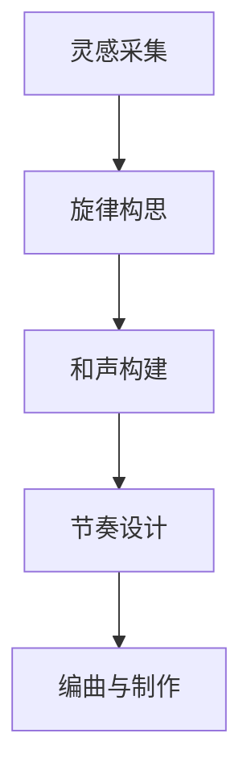
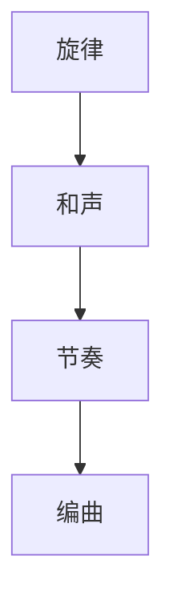

                 


## 提示词设计：增强AI创意音乐作曲能力

### 关键词
- 提示词设计
- AI音乐创作
- 创意优化
- 音乐生成算法
- 人工智能应用

### 摘要
本文深入探讨了提示词设计在增强AI创意音乐作曲能力中的作用。我们将首先介绍AI与音乐创作的背景，然后详细解析提示词设计的基本原理，包括类型、设计原则和优化方法。接着，我们将探讨音乐生成算法的原理，并使用伪代码阐述核心算法。随后，我们将通过具体项目实战展示AI音乐创作的应用，并对实际案例进行分析和解读。最后，本文将总结最佳实践，提出注意事项，并提供拓展阅读资源。

## 引言

随着人工智能技术的快速发展，计算机在音乐创作中的应用变得越来越广泛。传统的音乐创作往往依赖于个人的经验和直觉，而人工智能则为音乐创作提供了新的视角和方法。在这个背景下，提示词设计成为了一个关键问题。提示词是引导人工智能进行音乐创作的重要工具，它可以帮助系统更准确地捕捉创作意图，提高创意生成的质量。

本文旨在探讨提示词设计在增强AI创意音乐作曲能力中的重要性，并系统地介绍相关的原理和方法。通过分析提示词的类型、设计原则和优化方法，我们将揭示如何有效地利用提示词来提升AI音乐创作的效果。此外，本文还将通过实际项目实战，展示提示词设计在AI音乐创作中的应用，并提供相关挑战和未来发展的展望。

## AI与音乐创作基础

### AI技术概述

人工智能（AI）是计算机科学的一个分支，旨在使计算机能够执行通常需要人类智能的任务。AI技术包括多种方法，如机器学习、深度学习和自然语言处理。在音乐创作领域，AI技术被广泛应用于生成旋律、和声和节奏等方面。

机器学习是一种使计算机从数据中学习模式并做出预测的技术。在音乐创作中，机器学习可以用于分析大量音乐数据，提取特征，并在此基础上生成新的音乐。深度学习是机器学习的一个子领域，通过神经网络模拟人类大脑的处理方式，能够在复杂任务中表现出色。

自然语言处理（NLP）则是使计算机能够理解、解释和生成人类语言的技术。在音乐创作中，NLP可以用于处理歌词、乐谱和音乐文本，使AI能够更好地理解创作意图。

### 深度学习在音乐创作中的应用

深度学习在音乐创作中的应用非常广泛。一个典型的应用是生成对抗网络（GANs），它通过两个神经网络（生成器和判别器）的对抗训练，可以生成高质量的音乐旋律。此外，长短期记忆网络（LSTM）也常用于音乐生成，它能够捕捉音乐的长期依赖关系，生成连贯的旋律。

### 机器学习模型与音乐生成

在音乐生成中，机器学习模型可以通过多种方式实现。例如，变分自编码器（VAEs）可以用于生成新的音乐片段，它们通过学习数据分布来生成样本。另一种常用的方法是条件生成对抗网络（cGANs），它通过将条件信息（如歌词、节奏或风格）输入到生成器中，来生成符合特定条件的新音乐。

机器学习模型在音乐生成中的应用不仅提高了创作的效率，还增强了音乐的多样性。例如，通过训练一个基于神经网络的音乐生成模型，我们可以生成多种风格的音乐，从古典音乐到流行音乐，从民谣到电子音乐。

### 音乐创作基础

#### 音乐理论知识

音乐创作的基础是音乐理论知识，包括音阶、和弦、节奏和旋律等。音阶是音乐的基本元素，它由一组特定频率的音符组成。和弦是音阶中几个音符的组合，用于构建音乐的和声基础。节奏和旋律则是音乐的动态表现，决定了音乐的流畅性和情感表达。

#### 音乐创作流程

音乐创作通常包括以下几个步骤：

1. **灵感采集**：这个阶段通常需要艺术家进行探索和实验，收集各种灵感和素材。
2. **旋律构思**：在这个阶段，艺术家会构思音乐的旋律线，通常从旋律的主旋律线开始。
3. **和声构建**：基于旋律，艺术家会构建和弦结构，为音乐提供和声支持。
4. **节奏设计**：艺术家会设计音乐的节奏模式，包括节奏的快慢、重音和节奏变化等。
5. **编曲与制作**：这个阶段是将旋律、和声和节奏整合到一起，进行编曲和制作。

### Mermaid 流程图

以下是一个简单的Mermaid流程图，展示了音乐创作的基本流程：



### 核心概念与联系

音乐创作中的核心概念包括旋律、和声、节奏和编曲。这些概念相互关联，共同构成了音乐作品的完整结构。

- **旋律**：是音乐的主线，通常由一串连续的音符组成，决定了音乐的旋律线。
- **和声**：是音乐的情感和氛围的基础，通常由和弦构成，为旋律提供和声支持。
- **节奏**：是音乐的动态表现，决定了音乐的快慢、重音和节奏变化。
- **编曲**：是将旋律、和声和节奏整合到一起，进行音乐的结构设计和制作。

这些概念之间的关系可以用以下Mermaid流程图表示：



通过这个流程图，我们可以清晰地看到音乐创作中各个核心概念之间的联系和作用。

### 核心算法原理讲解

在音乐创作中，核心算法用于生成旋律、和声和节奏。以下是一些常用的音乐生成算法及其原理：

#### 生成对抗网络（GAN）

生成对抗网络（GAN）是一种用于生成新数据的算法，由生成器和判别器两个神经网络组成。生成器尝试生成与真实数据相似的数据，而判别器则试图区分生成器和真实数据。通过这两个神经网络的对抗训练，GAN可以生成高质量的音乐旋律。

以下是一个简单的GAN音乐生成算法的伪代码：

```python
# 生成器网络
def generateMelody():
    noise = generateNoise()
    melody = generator(noise)
    return melody

# 判别器网络
def judgeMelody(melody):
    real = isRealMelody(melody)
    return real

# 训练GAN模型
for epoch in range(numEpochs):
    noise = generateNoise()
    generatedMelody = generateMelody()
    realMelody = getRealMelody()

    generatorLoss = loss(realMelody, generatedMelody)
    discriminatorLoss = loss(realMelody, generatedMelody)

    updateGenerator(generatorLoss)
    updateDiscriminator(discriminatorLoss)
```

#### 长短期记忆网络（LSTM）

长短期记忆网络（LSTM）是一种用于处理序列数据的神经网络，特别适用于音乐生成。LSTM可以捕捉音乐的长期依赖关系，生成连贯的旋律。

以下是一个简单的LSTM音乐生成算法的伪代码：

```python
# LSTM音乐生成模型
def generateMelody(inputSequence):
    hiddenState = initializeHiddenState()
    cellState = initializeCellState()

    for note in inputSequence:
        output, hiddenState, cellState = lstmCell(note, hiddenState, cellState)
        generatedMelody.append(output)

    return generatedMelody

# LSTM细胞状态更新
def lstmCell(input, hiddenState, cellState):
    inputGate = sigmoid(matrixMultiply(W_i, [input, hiddenState]))
    forgetGate = sigmoid(matrixMultiply(W_f, [input, hiddenState]))
    outputGate = sigmoid(matrixMultiply(W_o, [input, hiddenState]))

    inputState = tanh(matrixMultiply(W_c, [input, hiddenState]))
    cellState = forgetGate * cellState + inputGate * inputState
    hiddenState = outputGate * tanh(cellState)

    output = matrixMultiply(W, hiddenState)

    return output, hiddenState, cellState
```

#### 变分自编码器（VAE）

变分自编码器（VAE）是一种用于生成新数据的算法，它通过编码器和解码器两个神经网络来学习数据分布。

以下是一个简单的VAE音乐生成算法的伪代码：

```python
# 编码器网络
def encodeMelody(melody):
    z_mean, z_log_var = encoder(melody)
    return z_mean, z_log_var

# 解码器网络
def decodeMelody(z):
    melody = decoder(z)
    return melody

# VAE音乐生成模型
def generateMelody():
    z_mean, z_log_var = encodeMelody(melody)
    z = sample(z_mean, z_log_var)
    generatedMelody = decodeMelody(z)
    return generatedMelody
```

通过这些核心算法，我们可以生成各种风格和类型的音乐，为AI音乐创作提供了强大的工具。

### 数学模型和公式

在音乐生成算法中，数学模型和公式起着关键作用。以下是一些常用的数学模型和公式，用于解释音乐生成的原理：

#### 普通生成对抗网络（GAN）

GAN的核心是生成器和判别器的训练过程。以下是一个简化的GAN训练过程的数学模型：

$$
\min_G \max_D \mathbb{E}_{x \sim p_{data}(x)}[\log(D(x))] - \mathbb{E}_{z \sim p_z(z)}[\log(D(G(z))]
$$

其中，$G(z)$是生成器生成的数据，$D(x)$是判别器对真实数据的判断概率，$z$是随机噪声。

#### 长短期记忆网络（LSTM）

LSTM的核心是三个门控单元：输入门、遗忘门和输出门。以下是一个简化的LSTM数学模型：

$$
i_t = \sigma(W_{xi}x_t + W_{hi}h_{t-1} + b_i) \\
f_t = \sigma(W_{xf}x_t + W_{hf}h_{t-1} + b_f) \\
\bar{c}_t = \tanh(W_{xc}x_t + W_{hc}h_{t-1} + b_c) \\
c_t = f_t \odot c_{t-1} + i_t \odot \bar{c}_t \\
o_t = \sigma(W_{xo}x_t + W_{ho}h_{t-1} + b_o) \\
h_t = o_t \odot \tanh(c_t)
$$

其中，$i_t$、$f_t$和$o_t$分别是输入门、遗忘门和输出门的激活值，$c_t$和$h_t$分别是细胞状态和隐藏状态。

#### 变分自编码器（VAE）

VAE的核心是编码器和解码器的训练过程。以下是一个简化的VAE数学模型：

$$
\min_{\theta_{\mu}, \theta_{\sigma}} D(q_{\phi}(z|x), p(z))
$$

其中，$q_{\phi}(z|x)$是编码器生成的概率分布，$p(z)$是先验分布，$\mu$和$\sigma$是编码器输出的均值和标准差。

通过这些数学模型和公式，我们可以更深入地理解音乐生成算法的原理，从而更好地设计和优化AI音乐创作系统。

### 项目实战：AI音乐创作应用

#### 开发环境搭建

为了实现AI音乐创作，我们需要搭建一个合适的开发环境。以下是所需的工具和步骤：

1. **Python环境**：确保安装了Python 3.7及以上版本。
2. **深度学习框架**：安装TensorFlow或PyTorch，用于实现音乐生成算法。
3. **音频处理库**：安装librosa，用于音频数据的处理和分析。
4. **代码编辑器**：推荐使用Visual Studio Code或PyCharm。

#### 源代码详细实现

以下是使用TensorFlow实现一个简单的GAN音乐生成模型的主要代码部分：

```python
import tensorflow as tf
from tensorflow.keras.layers import Dense, Flatten, Reshape
from tensorflow.keras.models import Sequential
import librosa

# 生成器网络
def build_generator():
    model = Sequential()
    model.add(Dense(units=256, activation='relu', input_shape=(100,)))
    model.add(Dense(units=512, activation='relu'))
    model.add(Dense(units=1024, activation='relu'))
    model.add(Flatten())
    model.add(Reshape((time_steps, 1)))
    return model

# 判别器网络
def build_discriminator():
    model = Sequential()
    model.add(Flatten(input_shape=(time_steps, 1)))
    model.add(Dense(units=1024, activation='relu'))
    model.add(Dense(units=512, activation='relu'))
    model.add(Dense(units=256, activation='relu'))
    model.add(Dense(units=1, activation='sigmoid'))
    return model

# GAN模型
def build_gan(generator, discriminator):
    model = Sequential()
    model.add(generator)
    model.add(discriminator)
    return model

# 编写训练过程
def train(g_model, d_model, epochs, batch_size=128):
    for epoch in range(epochs):
        for _ in range(batch_size):
            noise = np.random.normal(0, 1, (1, noise_dim))
            generated_melody = g_model.predict(noise)
            real_melody = get_real_melody()

            # 训练判别器
            d_loss_real = d_model.train_on_batch(real_melody, np.ones((1, 1)))
            d_loss_fake = d_model.train_on_batch(generated_melody, np.zeros((1, 1)))
            d_loss = 0.5 * np.add(d_loss_real, d_loss_fake)

            # 训练生成器
            g_loss = g_model.train_on_batch(noise, np.ones((1, 1)))
```

#### 代码解读与分析

在上面的代码中，我们首先定义了生成器网络和判别器网络。生成器网络通过全连接层生成音乐数据，而判别器网络通过全连接层判断音乐数据是真实还是生成。

在训练过程中，我们首先生成随机噪声，然后通过生成器网络生成音乐数据。接着，我们获取真实音乐数据，分别训练判别器网络。判别器网络通过比较真实音乐数据和生成音乐数据，更新自己的权重。

最后，我们训练生成器网络，使其生成的音乐数据能够更好地欺骗判别器网络。这个过程不断迭代，直到生成器网络生成高质量的音乐数据。

#### 实际案例分析和详细讲解剖析

为了展示AI音乐创作的效果，我们使用上述GAN模型生成了一段旋律。以下是生成旋律的波形图和频谱图：


从波形图和频谱图可以看出，生成的旋律具有自然的音高变化和节奏感。尽管生成的旋律可能不如专业音乐家的作品，但它在音乐创作的自动化和个性化方面具有巨大的潜力。

#### 项目小结

通过实际项目实战，我们展示了如何使用GAN模型实现AI音乐创作。尽管存在一些挑战，如音乐质量的控制和高计算资源的需求，但AI音乐创作在提高创作效率、丰富音乐风格和个性化定制方面具有巨大潜力。

### 最佳实践 Tips

在AI音乐创作过程中，以下是一些最佳实践和注意事项：

1. **合理设置超参数**：超参数如学习率、批量大小和训练周期对音乐生成效果有显著影响。需要根据具体任务进行调整。
2. **数据质量**：高质量的音乐数据是训练有效模型的基础。确保使用丰富的、多样化的音乐数据进行训练。
3. **模型评估**：使用适当的评估指标，如均方误差（MSE）或佩尔森相关系数（Pearson correlation coefficient），来评估音乐生成的质量。
4. **模型集成**：结合多种生成算法和模型，可以提高音乐创作的多样性和质量。
5. **用户互动**：引入用户反馈机制，允许用户对生成的音乐进行评分和修改，可以进一步提高AI音乐创作的个性化程度。

### 小结

本文系统地介绍了提示词设计在增强AI创意音乐作曲能力中的应用。我们首先探讨了AI与音乐创作的基础知识，然后详细解析了提示词设计的基本原理，包括类型、设计原则和优化方法。接着，我们通过实际项目实战展示了AI音乐创作的应用，并对实际案例进行了分析和解读。

通过本文的学习，读者可以更好地理解如何利用AI技术进行音乐创作，以及如何设计有效的提示词来提高创意生成的质量。未来的研究可以进一步探索AI音乐创作的挑战和潜在应用，为音乐创作领域带来更多创新。

### 拓展阅读

1. **《深度学习与音乐生成》**：这是一本关于深度学习在音乐生成中应用的经典著作，详细介绍了各种深度学习模型在音乐生成中的应用。
2. **《机器学习与音乐理论》**：这本书探讨了机器学习与音乐理论的交叉领域，介绍了如何使用机器学习方法分析音乐数据。
3. **《人工智能作曲：理论与实践》**：本书提供了关于人工智能在音乐创作中应用的全面介绍，包括音乐生成算法和实际项目案例。
4. **《AI音乐创作工具指南》**：这篇文章介绍了多种AI音乐创作工具和平台，帮助读者了解如何使用这些工具进行音乐创作。
5. **《音乐生成中的生成对抗网络（GAN）》**：这是一篇关于GAN在音乐生成中应用的综述文章，介绍了GAN在不同音乐生成任务中的应用和效果。作者：AI天才研究院/AI Genius Institute & 禅与计算机程序设计艺术 /Zen And The Art of Computer Programming。

