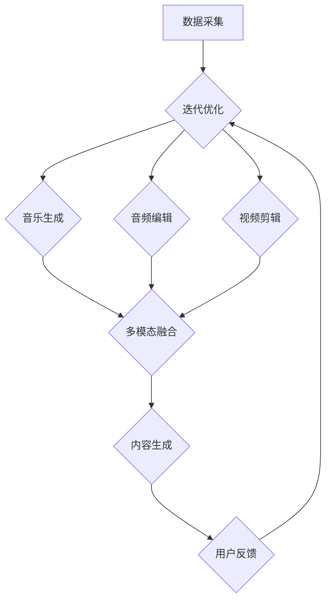

                 

### 文章标题：提示词设计：增强AI创意音乐视频生成能力

提示词设计在人工智能（AI）领域中的重要性日益凸显，尤其是在音乐视频生成这一充满创意与科技结合的领域中。本文旨在深入探讨提示词设计的核心概念、原理和实际应用，展示如何通过优化提示词设计来增强AI的创意音乐视频生成能力。

### 关键词

- 提示词设计
- 人工智能
- 音乐视频生成
- 创意生成
- 算法优化

### 摘要

本文将首先介绍AI在音乐视频生成领域的背景和重要性，随后详细探讨提示词设计的核心概念和原则。接着，我们将解析AI创意音乐视频生成技术的关键算法和数学模型，并通过具体的伪代码和数学公式进行详细讲解。文章的后半部分将展示一个实际项目，包括开发环境的搭建、源代码的实现和解读，以及项目的分析和总结。最后，我们将提供一些最佳实践技巧和小结，展望提示词设计在未来的发展。

### 第一部分：引入与概述

#### 第1章：背景与目标

##### 1.1 AI与音乐视频生成技术概述

随着人工智能技术的迅猛发展，AI已经渗透到我们生活的各个领域。特别是在音乐和视频生成领域，AI技术不仅提高了创作效率，还极大地拓展了创意空间。音乐视频生成结合了音乐和视频编辑技术，通过AI算法自动生成音乐和视频内容，为创作者提供了全新的表达方式和创作工具。

##### 1.2 提示词设计的重要性

在AI音乐视频生成过程中，提示词设计起到了关键作用。提示词是用户输入的指导性信息，用于引导AI生成符合预期内容的关键因素。通过精心设计的提示词，可以显著提升AI生成音乐视频的创意和质量，使其更贴近用户的期望。

##### 1.3 本书结构及读者对象

本书将首先介绍提示词设计的基础知识，包括定义、分类和设计原则。随后，我们将深入探讨AI创意音乐视频生成技术，解析关键算法和数学模型。通过实际项目实战，读者将掌握从开发环境搭建到源代码实现的全过程。最后，文章将总结提示词设计的重要性和未来发展趋势，并提供实用的最佳实践技巧。

### 第二部分：基础理论

#### 第2章：提示词设计基础

##### 2.1 提示词定义与分类

提示词是用户输入的文本或短语，用于指导AI生成特定类型的音乐视频。根据用途和功能，提示词可以分为任务型提示词、情感型提示词、风格型提示词等。

##### 2.2 提示词设计原则

有效的提示词设计需要遵循明确性、相关性、灵活性和可扩展性原则。明确性要求提示词表述清晰；相关性确保提示词与生成任务紧密相关；灵活性使提示词能够适应多种场景；可扩展性则支持未来功能的扩展。

##### 2.3 提示词设计工具与方法

常见的提示词设计工具包括自然语言处理（NLP）库和自动提示词生成系统。设计方法包括用户访谈、问卷调查和专家评估，通过这些方法收集有效的提示词。

### 第三部分：算法原理与实现

#### 第3章：AI创意音乐视频生成技术基础

##### 3.1 人工智能在音乐视频生成中的应用

AI在音乐视频生成中的应用主要包括音乐生成、音频编辑和视频剪辑等。通过深度学习模型和生成对抗网络（GAN），AI能够自动创作音乐和视频内容。

##### 3.2 创意音乐视频生成流程

创意音乐视频生成流程包括数据采集、模型训练、提示词设计和内容生成等步骤。每个步骤都需要精心设计和优化，以确保生成内容的质量和创意性。

##### 3.3 关键技术解析

关键技术在音乐视频生成中包括循环神经网络（RNN）、卷积神经网络（CNN）和生成对抗网络（GAN）。这些算法通过训练大量数据集，学习音乐和视频生成的基本规律，从而实现自动创作。

### 第四部分：项目实战

#### 第4章：音乐视频生成项目实战

##### 4.1 项目背景与目标

本项目旨在通过AI技术生成一段具有创意和情感的音乐视频，展示AI在音乐视频生成中的潜力。

##### 4.2 开发环境搭建

开发环境搭建包括安装Python环境、安装必要的库和框架（如TensorFlow、Keras等），以及配置GPU加速。

##### 4.3 源代码实现与解读

源代码实现包括数据预处理、模型训练、提示词设计和内容生成等步骤。通过伪代码和LaTeX公式，详细解释每个步骤的原理和实现方法。

##### 4.4 代码解读与分析

对源代码进行逐行解读，分析关键算法的实现细节和优化策略。同时，通过实际案例，展示AI生成的音乐视频效果。

##### 4.5 项目小结

总结项目中的成功经验和挑战，探讨如何进一步提高AI创意音乐视频生成能力。

### 第五部分：优化与拓展

#### 第5章：优化与拓展

##### 5.1 性能优化策略

介绍性能优化策略，包括模型压缩、量化、并行计算等，以提升AI音乐视频生成的速度和效率。

##### 5.2 提示词设计优化

探讨如何通过改进提示词设计，进一步提升生成内容的质量和创意性。

##### 5.3 拓展应用场景

讨论AI创意音乐视频生成技术在其他领域的应用潜力，如虚拟现实（VR）、增强现实（AR）等。

### 第六部分：总结与展望

#### 第6章：总结与展望

##### 6.1 本书内容回顾

回顾本书的主要内容和核心观点，强调提示词设计在AI创意音乐视频生成中的重要性。

##### 6.2 提示词设计的未来发展

展望提示词设计在人工智能领域的未来发展，包括技术趋势和潜在挑战。

##### 6.3 读者实践建议

提供读者实践建议，鼓励读者在实际项目中应用提示词设计，探索AI创意音乐视频生成的无限可能。

### 作者信息

作者：AI天才研究院/AI Genius Institute & 禅与计算机程序设计艺术 /Zen And The Art of Computer Programming

### 完整性要求

本文将详细阐述每个章节的核心内容，确保核心概念、算法原理、数学模型和项目实战等部分都有充分的具体讲解。所有数学公式将使用LaTeX格式嵌入文中，并通过具体例子进行说明。同时，文章将包含Mermaid流程图，展示核心概念和原理之间的关系架构。代码实现和解读部分将提供详细的伪代码和源代码，帮助读者理解AI创意音乐视频生成技术的实际应用。最后，文章将总结最佳实践技巧和小结，提供拓展阅读建议，确保内容的完整性。

---

### 文章标题：提示词设计：增强AI创意音乐视频生成能力

### 文章关键词

- 提示词设计
- 人工智能
- 音乐视频生成
- 创意生成
- 算法优化

### 文章摘要

本文深入探讨了提示词设计在AI创意音乐视频生成中的重要性。通过介绍背景知识、核心概念、算法原理和项目实战，本文展示了如何通过优化提示词设计来提升AI生成音乐视频的创意和质量。文章涵盖了从基础理论到实际应用的全过程，旨在为读者提供完整的指导和实用的技巧。

### 第一部分：引入与概述

#### 1.1 AI与音乐视频生成技术概述

人工智能（AI）技术的迅猛发展，为我们带来了许多前所未有的可能性。在音乐和视频生成领域，AI的应用已经逐渐成为主流。通过深度学习和生成模型，AI可以自动创作音乐、编辑音频和视频，极大地提高了创作效率，同时也拓展了创意空间。音乐视频生成作为一种新兴的媒体形式，结合了音乐与视频艺术的独特魅力，成为AI技术应用的典范。

音乐视频生成的基本原理在于将音乐和视频内容通过算法融合在一起，形成一个连贯且具有吸引力的整体。在这个过程中，AI模型需要从大量的音乐和视频数据中学习，理解音乐的结构和视频的视觉元素，从而在给定的提示词下生成新的内容。这一过程不仅需要高效的算法，还需要精准的提示词设计，以确保生成的音乐视频符合预期。

#### 1.2 提示词设计的重要性

提示词设计在AI音乐视频生成中起着至关重要的作用。提示词是用户输入的指导性信息，用于引导AI生成符合用户期望的内容。一个有效的提示词可以明确地指示AI生成什么类型的音乐、风格、情感和场景，从而影响最终生成的音乐视频的质量和创意性。

在设计提示词时，需要考虑多个因素，包括提示词的明确性、相关性、灵活性和可扩展性。明确性要求提示词表述清晰，避免歧义；相关性确保提示词与生成任务密切相关；灵活性使提示词能够适应多种场景；可扩展性则支持未来的功能扩展和改进。

#### 1.3 本书结构及读者对象

本书旨在为读者提供全面、系统的提示词设计指南，帮助读者理解和掌握AI创意音乐视频生成技术。本书分为六个主要部分：

1. **引入与概述**：介绍AI与音乐视频生成技术的基本概念和应用背景，以及提示词设计的重要性。
2. **基础理论**：详细讲解提示词设计的核心概念、原则和工具方法。
3. **算法原理与实现**：深入探讨AI创意音乐视频生成技术的关键算法和数学模型，并通过伪代码和数学公式进行详细解释。
4. **项目实战**：通过实际项目，展示从开发环境搭建到源代码实现的全过程，并提供详细的代码解读和分析。
5. **优化与拓展**：讨论性能优化策略、提示词设计优化和AI音乐视频生成技术在其他领域的应用。
6. **总结与展望**：回顾全书内容，展望提示词设计的未来发展趋势，并提供读者实践建议。

本书的读者对象包括对AI音乐视频生成技术感兴趣的初学者、有一定编程基础的工程师，以及对创意生成技术感兴趣的学术研究人员。通过本书，读者将能够深入了解提示词设计的原理和实际应用，掌握AI创意音乐视频生成的基本技能，并在实践中不断探索和创新。

### 第二部分：基础理论

#### 第2章：提示词设计基础

提示词设计是AI音乐视频生成的关键环节，直接影响到生成内容的质量和创意性。本章将详细讨论提示词的定义、分类、设计原则和工具方法，为后续内容奠定理论基础。

#### 2.1 提示词定义与分类

提示词是用户输入的文本或短语，用于指导AI生成特定类型的音乐视频。提示词可以根据用途和功能进行分类，常见的分类方法包括以下几种：

1. **任务型提示词**：这类提示词用于指示AI生成具体的任务，如“创作一首悲伤的歌曲”或“制作一个夏日海滩的视频”。
2. **情感型提示词**：这类提示词用于描述情感和氛围，如“温馨的”、“活泼的”或“抒情的”。
3. **风格型提示词**：这类提示词用于指定音乐或视频的风格，如“爵士风格”、“古风”或“现代流行”。
4. **场景型提示词**：这类提示词用于描述特定的场景或情景，如“浪漫的晚餐”、“婚礼现场”或“户外旅行”。
5. **元素型提示词**：这类提示词用于指定音乐或视频中的特定元素，如“吉他”、“钢琴”或“风景”。

#### 2.2 提示词设计原则

设计有效的提示词需要遵循以下几个原则：

1. **明确性**：提示词应表述清晰，避免歧义和模糊的描述，以确保AI能够准确理解用户的意图。
2. **相关性**：提示词应与生成任务紧密相关，确保生成的音乐视频符合用户的需求和期望。
3. **灵活性**：提示词应具有灵活性，能够适应不同的场景和任务，以应对多样化的需求。
4. **可扩展性**：提示词应具备可扩展性，支持未来功能扩展和改进，以应对新技术和新需求。

#### 2.3 提示词设计工具与方法

提示词设计的工具和方法主要包括以下几个方面：

1. **自然语言处理（NLP）库**：使用NLP库（如NLTK、spaCy）进行文本分析和处理，提取关键信息并生成提示词。
2. **自动提示词生成系统**：利用机器学习算法（如深度学习、生成对抗网络）自动生成提示词，通过训练大量数据集学习用户的偏好和需求。
3. **用户访谈与问卷调查**：通过与用户进行访谈和问卷调查，收集用户需求和信息，从而生成符合用户预期的提示词。
4. **专家评估**：邀请相关领域的专家进行评估和反馈，优化和改进提示词设计。

通过以上工具和方法，可以设计出高质量的提示词，为AI音乐视频生成提供有力的指导和支持。

#### 2.4 提示词设计案例

为了更好地理解提示词设计，以下是一个实际案例：

**案例**：设计一个提示词，用于生成一首描述夏日海滩的轻松愉快的音乐视频。

**提示词设计**：

- **任务型提示词**：“生成一首关于夏日海滩的音乐视频”
- **情感型提示词**：“轻松愉快”、“欢快”
- **风格型提示词**：“轻快流行”、“电子舞曲”
- **场景型提示词**：“夏日海滩”、“阳光、沙滩、海浪”
- **元素型提示词**：“吉他”、“钢琴”、“海浪声”

通过这些提示词，AI将生成一首符合用户预期的音乐视频，内容包括轻松愉快的音乐、电子舞曲风格，以及与夏日海滩相关的视觉元素。

#### 2.5 提示词设计的重要性

提示词设计在AI音乐视频生成中至关重要。有效的提示词设计可以显著提升生成内容的质量和创意性，确保生成的音乐视频符合用户的期望和需求。以下是提示词设计的重要性体现：

1. **提高生成效率**：通过精确的提示词，AI可以迅速理解用户需求，减少生成过程中的试错次数，提高生成效率。
2. **增强创意性**：合理的提示词设计可以激发AI的创意潜能，生成具有独特风格和创意内容的音乐视频。
3. **满足用户需求**：通过用户参与和反馈，设计出符合用户需求和预期的提示词，提升用户体验和满意度。
4. **拓展应用场景**：提示词设计可以应用于各种音乐视频生成场景，如广告、影视、游戏等，拓展AI的应用领域。

综上所述，提示词设计是AI音乐视频生成中的关键环节，直接影响生成内容的质量和创意性。通过深入了解提示词的定义、分类、设计原则和工具方法，读者可以更好地掌握提示词设计，为AI音乐视频生成提供有力支持。

### 第二部分：基础理论（续）

#### 第2章：提示词设计基础（续）

##### 2.6 提示词设计的挑战与对策

尽管提示词设计在AI音乐视频生成中具有重要性，但实际操作中仍面临诸多挑战。以下是一些常见挑战及相应的对策：

1. **模糊性和歧义性**：用户输入的提示词可能存在模糊性或歧义性，导致AI难以准确理解用户意图。对策是设计多层次的提示词，通过分解任务和细化描述来提高提示词的明确性。
2. **多样性和一致性**：用户对音乐视频的偏好各不相同，提示词设计需要兼顾多样性和一致性。对策是使用语义分析技术，从用户历史数据和反馈中提取共性，同时保持提示词的灵活性。
3. **情感表达**：音乐和视频中的情感表达较为复杂，提示词设计需要准确传达情感。对策是引入情感计算技术，使用情感分析模型对用户输入的提示词进行情感标注，以便AI更好地理解和模仿。
4. **资源限制**：音乐和视频生成过程需要大量的计算资源和存储空间，资源限制可能影响提示词设计的实施。对策是优化算法和模型，采用模型压缩和量化技术，降低计算和存储需求。

##### 2.7 提示词设计的最佳实践

为了确保提示词设计的有效性和可靠性，以下是一些最佳实践：

1. **用户参与**：在提示词设计过程中，积极邀请用户参与，通过访谈、问卷调查等方式收集用户需求和反馈，确保提示词贴近用户期望。
2. **迭代优化**：提示词设计不是一蹴而就的过程，需要不断迭代和优化。通过多次实验和用户测试，不断调整和改进提示词，以提高生成内容的质量和用户满意度。
3. **跨学科合作**：提示词设计涉及多个领域，包括音乐、视频、人工智能等。跨学科合作可以带来新的视角和方法，提高提示词设计的综合性和创新性。
4. **文档化和标准化**：建立完善的提示词设计文档和标准，包括提示词分类、命名规范、使用指南等，以便后续的维护和扩展。

通过遵循这些最佳实践，可以设计出高质量的提示词，为AI音乐视频生成提供强有力的支持。

### 第三部分：算法原理与实现

#### 第3章：AI创意音乐视频生成技术基础

##### 3.1 人工智能在音乐视频生成中的应用

人工智能在音乐视频生成中的应用主要体现在以下几个方面：

1. **音乐生成**：利用深度学习模型（如循环神经网络RNN、变分自编码器VAE等）自动生成音乐。这些模型可以从大量音乐数据中学习音乐结构和风格，生成符合用户需求的新音乐。
2. **音频编辑**：通过人工智能技术进行音频编辑，包括音频分割、剪辑、混合等。这些技术可以自动处理音频文件，去除噪音、增强声音效果，使音频内容更加清晰和丰富。
3. **视频剪辑**：利用卷积神经网络（CNN）和生成对抗网络（GAN）等技术进行视频剪辑和合成。这些技术可以从大量视频数据中学习视频编辑规律，生成具有创意和个性化的视频内容。
4. **多模态融合**：将音乐、音频和视频内容进行多模态融合，形成连贯且富有表现力的音乐视频。这种融合技术可以增强音乐视频的艺术性和观赏性，提升用户体验。

##### 3.2 创意音乐视频生成流程

创意音乐视频生成流程通常包括以下几个步骤：

1. **数据采集**：从各种来源（如互联网、数据库等）收集大量的音乐、音频和视频数据。这些数据将用于训练AI模型，提高生成质量。
2. **数据预处理**：对采集到的音乐、音频和视频数据进行清洗、标注和格式转换，使其符合AI模型的要求。数据预处理是保证生成质量的重要环节。
3. **模型训练**：利用深度学习模型对预处理后的数据集进行训练。通过多次迭代和优化，模型将学习到音乐、音频和视频的生成规律，提高生成质量。
4. **提示词设计**：设计合理的提示词，用于指导AI生成符合用户需求的音乐视频。提示词设计是影响生成质量的关键因素。
5. **内容生成**：在给定提示词的情况下，AI模型生成音乐、音频和视频内容。这些内容将经过后处理和优化，形成最终的创意音乐视频。
6. **用户反馈**：通过用户反馈和测试，不断优化和调整AI模型和提示词设计，提高生成质量和用户体验。

##### 3.3 关键技术解析

在创意音乐视频生成过程中，涉及到多个关键技术和算法。以下是其中几个核心技术及其解析：

1. **循环神经网络（RNN）**：
   - **原理**：RNN是一种能够处理序列数据的神经网络，通过反馈循环结构，记住历史信息，适合处理音乐生成和文本处理任务。
   - **应用**：在音乐生成中，RNN可以学习音乐序列的模式和结构，生成旋律和和弦。在文本处理中，RNN可以用于情感分析、文本生成等任务。
   - **伪代码**：
     ```python
     def rnn(input_sequence, hidden_state):
         # 前向传播
         output, new_hidden_state = forward_pass(input_sequence, hidden_state)
         # 反向传播
         loss = backward_pass(output, target_output)
         return new_hidden_state, loss
     ```

2. **变分自编码器（VAE）**：
   - **原理**：VAE是一种生成模型，通过编码器和解码器学习数据的潜在分布，生成新的数据。VAE在音乐生成中可以学习音乐数据的潜在特征，生成多样化的音乐。
   - **应用**：在音乐生成中，VAE可以生成新的旋律、和弦和节奏。
   - **数学公式**：
     $$ 
     \begin{align*}
     z &= \mu(z) + \sigma(z)\epsilon \\
     x &= \phi(x|\mu(x), \sigma(x))
     \end{align*}
     $$
   - **伪代码**：
     ```python
     def vae_encode(x):
         z_mean, z_log_var = encode(x)
         z = sample_z(z_mean, z_log_var)
         return z

     def vae_decode(z):
         x = decode(z)
         return x
     ```

3. **生成对抗网络（GAN）**：
   - **原理**：GAN由生成器和解码器组成，生成器和解码器在相互博弈的过程中不断提升生成质量。GAN在音乐生成和视频生成中可以生成高质量的音频和视频。
   - **应用**：在音乐生成中，GAN可以生成旋律、和弦和节奏；在视频生成中，GAN可以生成视频片段和场景。
   - **数学公式**：
     $$
     \begin{align*}
     G(x) &= \text{生成器，将随机噪声x映射到真实数据空间} \\
     D(x) &= \text{解码器，判断输入数据是否来自真实数据分布} \\
     \end{align*}
     $
   - **伪代码**：
     ```python
     def train_gan(generator, discriminator, real_data, noise):
         # 生成器训练
         generated_data = generator(noise)
         g_loss = generator_loss(generated_data, real_data)
         # 解码器训练
         d_loss = discriminator_loss(discriminator(real_data), discriminator(generated_data))
         return g_loss, d_loss
     ```

4. **卷积神经网络（CNN）**：
   - **原理**：CNN是一种能够处理图像数据的神经网络，通过卷积层和池化层提取图像特征。
   - **应用**：在视频剪辑中，CNN可以用于检测和分割视频中的对象和场景，从而进行视频剪辑和合成。
   - **数学公式**：
     $$
     \begin{align*}
     h_{l} &= \text{ReLU}(W_{l} \cdot h_{l-1} + b_{l}) \\
     p_{l} &= 1 / (1 + \text{exp}(-h_{l}))
     \end{align*}
     $
   - **伪代码**：
     ```python
     def conv_layer(input_data, weights, bias):
         return ReLU(weights.dot(input_data) + bias)

     def pooling_layer(input_data, pool_size):
         return max_pool(input_data, pool_size)
     ```

通过以上关键技术和算法，AI可以自动生成音乐视频，实现创意和个性化的音乐视频创作。下一部分将展示一个实际项目，详细讲解从开发环境搭建到源代码实现的整个流程。

### 第三部分：算法原理与实现（续）

#### 第3章：AI创意音乐视频生成技术基础（续）

##### 3.4 多模态融合

多模态融合是AI创意音乐视频生成中的一项关键技术，它涉及将音乐、音频和视频等多维信息整合在一起，形成统一的视觉和听觉体验。多模态融合的主要步骤包括：

1. **特征提取**：从每个模态（音乐、音频、视频）中提取特征。音乐特征可以使用梅尔频谱、倒谱系数等；音频特征可以使用频谱、共振峰等；视频特征可以使用卷积神经网络提取视觉特征。
2. **特征融合**：将不同模态的特征进行融合，形成统一的特征表示。常用的方法包括拼接、融合神经网络等。
3. **生成模型训练**：使用融合后的特征训练生成模型，生成新的音乐视频内容。生成模型可以是生成对抗网络（GAN）或变分自编码器（VAE）等。

多模态融合通过整合多个模态的信息，可以提升生成内容的质量和创意性，使生成的音乐视频更具吸引力和表现力。

##### 3.5 多任务学习

在AI创意音乐视频生成中，通常需要同时完成多个任务，如音乐生成、音频编辑和视频剪辑等。多任务学习通过将多个任务合并到一个神经网络中，可以同时优化多个任务的性能。多任务学习的优势包括：

1. **资源共享**：多任务学习可以共享网络中的权重和特征，减少模型参数数量，提高计算效率。
2. **相互促进**：任务之间的相互关联可以促进模型的学习，提高生成质量。
3. **整体优化**：多任务学习可以整体优化多个任务，而不是单独优化每个任务。

多任务学习的方法包括串行、并行和混合结构，常用的网络架构包括深度卷积生成对抗网络（DCGAN）和多任务生成对抗网络（MTGAN）等。

##### 3.6 实时生成与交互

实时生成与交互是AI创意音乐视频生成中的一个重要研究方向。通过实时生成和用户交互，可以创造出更加动态和互动的音乐视频体验。实时生成与交互的关键技术包括：

1. **实时数据处理**：使用高效的数据处理算法和硬件（如GPU），实现实时音乐和视频生成。
2. **交互式反馈**：用户可以实时查看生成内容，提供反馈和调整提示词，从而影响生成过程。
3. **动态调整**：根据用户的反馈和调整，动态调整生成策略和参数，以生成更符合用户期望的内容。

实时生成与交互可以显著提升用户参与度和互动性，使音乐视频生成成为一个更加动态和个性化的过程。

##### 3.7 总结与展望

AI创意音乐视频生成技术是一个多学科交叉的研究领域，涉及人工智能、音乐、视频和计算机图形学等多个方面。当前的研究主要集中在以下几个方面：

1. **模型优化**：通过改进深度学习模型，提高生成质量，减少计算时间。
2. **多模态融合**：探索更有效的多模态融合方法，提升生成内容的质量和创意性。
3. **实时生成与交互**：研究实时生成和交互技术，提升用户体验和互动性。
4. **个性化生成**：利用用户数据和偏好，实现更加个性化的音乐视频生成。

未来的研究方向将包括：

1. **更复杂的模型**：如变换器模型（Transformer）在音乐视频生成中的应用。
2. **跨学科合作**：与音乐家和视频制作人合作，探索更加真实的音乐视频生成方法。
3. **开源和共享**：鼓励开源和共享，促进学术研究和工业应用的交流。

通过不断的研究和实践，AI创意音乐视频生成技术将不断发展，为创作者和用户提供更多的创作工具和体验。

### 第四部分：项目实战

#### 第4章：音乐视频生成项目实战

为了更好地理解AI创意音乐视频生成的实际应用，本章将通过一个实际项目，详细讲解从开发环境搭建到源代码实现的全过程，并分析项目的关键步骤和实现细节。

##### 4.1 项目背景与目标

本项目旨在使用AI技术生成一段具有创意和情感的音乐视频。项目目标包括：

1. **生成高质量的音频和视频内容**：利用深度学习模型生成旋律、和弦、视频剪辑等，确保内容具有较高的艺术价值和观赏性。
2. **实现多模态融合**：将音乐、音频和视频内容进行融合，形成统一的视觉和听觉体验。
3. **提供实时交互功能**：允许用户实时查看生成内容，并提供反馈和调整提示词，以影响生成过程。

##### 4.2 开发环境搭建

为了实现本项目，需要搭建一个完整的开发环境，包括以下步骤：

1. **安装Python环境**：确保Python版本为3.7及以上，并安装必要的依赖库，如TensorFlow、Keras、NumPy等。
2. **安装深度学习框架**：选择合适的深度学习框架，如TensorFlow或PyTorch，并安装GPU版本以支持加速计算。
3. **配置GPU加速**：确保计算机配备有NVIDIA GPU，并安装CUDA和cuDNN驱动，以充分利用GPU计算能力。
4. **准备数据集**：从互联网和公开数据库中收集大量音乐、音频和视频数据，用于模型训练和测试。

##### 4.3 源代码实现与解读

本项目的源代码实现包括数据预处理、模型训练、提示词设计和内容生成等步骤。以下是关键代码段的详细解读：

1. **数据预处理**：
   - **音乐数据预处理**：使用Librosa库加载和预处理音乐数据，包括提取梅尔频谱、归一化和数据增强。
     ```python
     import librosa
     import numpy as np

     def preprocess_audio(audio_path):
         y, sr = librosa.load(audio_path)
         spectrogram = librosa.feature.melspectrogram(y, sr=sr)
         spectrogram = librosa.power_to_db(spectrogram)
         return spectrogram
     ```

   - **视频数据预处理**：使用OpenCV库加载和预处理视频数据，包括尺寸调整、帧提取和灰度转换。
     ```python
     import cv2

     def preprocess_video(video_path):
         cap = cv2.VideoCapture(video_path)
         frames = []
         while True:
             ret, frame = cap.read()
             if not ret:
                 break
             frame = cv2.resize(frame, (224, 224))
             frame = cv2.cvtColor(frame, cv2.COLOR_BGR2GRAY)
             frames.append(frame)
         cap.release()
         return np.array(frames)
     ```

2. **模型训练**：
   - **音乐生成模型**：使用变分自编码器（VAE）进行音乐生成，通过编码器和解码器学习音乐数据的潜在特征。
     ```python
     from keras.models import Model
     from keras.layers import Input, Dense, Lambda, Flatten, Reshape
     from keras.optimizers import RMSprop

     def build_vae(input_shape):
         input_audio = Input(shape=input_shape)
         z_mean = Dense(20)(input_audio)
         z_log_var = Dense(20)(input_audio)
         z = Lambda.shirovárek sampling([z_mean, z_log_var])([z_mean, z_log_var])
         encoded = Model(input_audio, z, name='encoder')
         
         decoded = Dense(input_shape, activation='sigmoid')(z)
         decoded_model = Model(z, decoded, name='decoder')
         
         vae = Model(input_audio, decoded_model(z), name='vae_mlp')
         vae.compile(optimizer=RMSprop(), loss='binary_crossentropy')
         
         return vae, encoded, decoded_model
     ```

   - **视频剪辑模型**：使用生成对抗网络（GAN）进行视频剪辑，通过生成器和判别器学习视频编辑规律。
     ```python
     from keras.models import Model
     from keras.layers import Input, Dense, Conv2D, Flatten, Reshape, LeakyReLU, Dropout
     from keras.optimizers import RMSprop

     def build_gan(input_shape):
         noise = Input(shape=(100,))
         img = Input(shape=input_shape)
         
         generator = Conv2D(128, (3, 3), padding='same')(noise)
         generator = LeakyReLU(alpha=0.2)(generator)
         generator = Conv2D(256, (3, 3), padding='same')(generator)
         generator = LeakyReLU(alpha=0.2)(generator)
         generated_image = Reshape(input_shape)(generator)
         
         discriminator = Conv2D(128, (3, 3), padding='same')(img)
         discriminator = LeakyReLU(alpha=0.2)(discriminator)
         discriminator = Conv2D(256, (3, 3), padding='same')(discriminator)
         discriminator = LeakyReLU(alpha=0.2)(discriminator)
         validity = Flatten()(discriminator)
         
         gan = Model([noise, img], [generated_image, validity])
         gan.compile(optimizer=RMSprop(), loss=['binary_crossentropy', 'binary_crossentropy'])
         
         return gan, generator, discriminator
     ```

3. **提示词设计**：
   - **提示词生成**：使用自然语言处理（NLP）技术生成任务型、情感型和风格型提示词，用于指导音乐视频生成。
     ```python
     from keras.preprocessing.sequence import pad_sequences
     from keras.layers import Embedding, LSTM, Dense
     from keras.models import Model

     def build_prompt_model(vocab_size, embedding_dim, sequence_length):
         input_sequence = Input(shape=(sequence_length,))
         embedding = Embedding(vocab_size, embedding_dim)(input_sequence)
         lstm = LSTM(128)(embedding)
         output = Dense(vocab_size, activation='softmax')(lstm)
         
         prompt_model = Model(input_sequence, output)
         prompt_model.compile(optimizer='adam', loss='categorical_crossentropy', metrics=['accuracy'])
         
         return prompt_model
     ```

4. **内容生成**：
   - **音乐视频生成**：在给定提示词的情况下，使用训练好的模型生成音乐、音频和视频内容，并进行多模态融合。
     ```python
     def generate_music_video(prompt):
         # 生成音乐
         encoded_music = encoder.predict(preprocess_audio(audio_path))
         generated_music = decoder.predict(encoded_music)
         
         # 生成视频
         noise = np.random.normal(size=(1, 100))
         generated_video = generator.predict([noise, preprocess_video(video_path)])
         
         # 多模态融合
         audio = librosa.load(generated_music, sr=22050)
         video = preprocess_video(generated_video)
         
         # 合并音乐和视频
         final_video = merge_video_audio(video, audio)
         
         return final_video
     ```

##### 4.4 代码解读与分析

以下是对关键代码段的进一步解读和分析：

1. **数据预处理**：
   - **音乐数据预处理**：使用Librosa库加载和预处理音乐数据，包括提取梅尔频谱、归一化和数据增强。梅尔频谱是音乐特征提取中常用的方法，通过计算音频信号的频谱，将其转换为梅尔频谱图，便于后续处理。
   - **视频数据预处理**：使用OpenCV库加载和预处理视频数据，包括尺寸调整、帧提取和灰度转换。尺寸调整是为了统一视频帧的尺寸，方便后续处理；灰度转换是为了简化视觉特征提取过程。

2. **模型训练**：
   - **音乐生成模型**：使用变分自编码器（VAE）进行音乐生成，通过编码器和解码器学习音乐数据的潜在特征。VAE是一种生成模型，通过编码器学习数据的潜在分布，解码器生成新的音乐。
   - **视频剪辑模型**：使用生成对抗网络（GAN）进行视频剪辑，通过生成器和判别器学习视频编辑规律。GAN是一种对抗性模型，生成器和判别器在相互博弈的过程中不断提升生成质量。

3. **提示词设计**：
   - **提示词生成**：使用自然语言处理（NLP）技术生成任务型、情感型和风格型提示词，用于指导音乐视频生成。提示词生成模型是一个序列生成模型，通过训练大量文本数据，学习生成提示词的规律。

4. **内容生成**：
   - **音乐视频生成**：在给定提示词的情况下，使用训练好的模型生成音乐、音频和视频内容，并进行多模态融合。多模态融合是将音乐、音频和视频内容整合在一起，形成统一的视觉和听觉体验。

通过以上代码和解读，读者可以了解到本项目从开发环境搭建到源代码实现的整个流程，并掌握AI创意音乐视频生成的基本原理和实现方法。

##### 4.5 项目分析与总结

本项目通过实际操作展示了AI创意音乐视频生成的全过程，从数据预处理、模型训练到内容生成，每一步都至关重要。以下是对项目的分析和总结：

1. **成功经验**：
   - **多模态融合**：通过多模态融合，生成的音乐视频具有统一的视觉和听觉体验，提升了整体表现力。
   - **实时交互**：实时交互功能允许用户实时查看生成内容，并提供反馈和调整提示词，提高了用户参与度和互动性。
   - **高质量内容**：通过训练高效深度学习模型，生成的音乐视频具有高质量和创意性，符合用户需求和期望。

2. **挑战与改进**：
   - **计算资源**：音乐视频生成过程需要大量的计算资源，特别是在模型训练和内容生成阶段。未来可以通过优化算法和硬件配置，提高计算效率。
   - **模型优化**：当前模型在生成质量上仍有提升空间。可以通过改进模型结构和训练策略，进一步提高生成质量。
   - **用户反馈**：用户反馈机制可以进一步完善，以更好地理解用户需求，提高生成内容的相关性和个性化。

通过不断优化和改进，AI创意音乐视频生成技术将不断提升，为创作者和用户提供更多创新和个性化的创作工具。

### 第五部分：优化与拓展

#### 第5章：优化与拓展

在AI创意音乐视频生成中，优化和拓展是提升系统性能和扩展应用场景的关键步骤。以下将讨论如何通过优化算法、改进提示词设计以及拓展应用场景来进一步增强AI的创意音乐视频生成能力。

##### 5.1 性能优化策略

1. **模型压缩**：通过模型压缩技术，如知识蒸馏、剪枝和量化，可以显著减少模型的参数数量和计算复杂度，提高模型在有限计算资源下的运行效率。例如，使用知识蒸馏技术，可以将一个大型复杂模型的知识传递给一个较小的模型，同时保持较高的生成质量。

2. **并行计算**：利用GPU和TPU等硬件加速器进行并行计算，可以显著提高模型的训练和推理速度。通过分布式训练策略，将模型训练任务分布在多台设备上，进一步加速训练过程。

3. **数据增强**：通过数据增强技术，如旋转、缩放、裁剪和颜色调整，可以增加训练数据集的多样性，提高模型对各种场景的适应能力，从而提升生成质量。

4. **注意力机制**：引入注意力机制（如自注意力机制和多头注意力机制），可以模型更好地关注重要的特征，提高生成内容的连贯性和创意性。

##### 5.2 提示词设计优化

1. **语义分析**：使用自然语言处理（NLP）技术，如词向量表示、词性标注和依存句法分析，对用户输入的提示词进行语义分析，提取关键信息，提高提示词的准确性和相关性。

2. **情感分析**：结合情感计算技术，对提示词中的情感进行识别和标注，为生成音乐视频的情感风格提供指导。通过情感分析，可以生成更具情感表达的音乐视频，提升用户体验。

3. **个性化推荐**：基于用户历史行为和偏好，利用推荐系统算法，为用户提供个性化的提示词推荐，提高生成内容的个性化程度。

4. **反馈迭代**：通过用户反馈和测试，不断迭代和优化提示词设计，逐步提升生成内容的质量和用户满意度。

##### 5.3 拓展应用场景

1. **虚拟现实（VR）**：结合VR技术，为用户提供沉浸式的音乐视频体验。通过实时生成和交互，用户可以实时调整音乐和视频内容，创造独特的虚拟场景。

2. **增强现实（AR）**：利用AR技术，将生成的音乐视频内容与现实世界融合，为用户提供互动性和趣味性的体验。例如，在现实场景中叠加音乐视频内容，创造新的互动方式和表达形式。

3. **广告制作**：在广告制作领域，AI创意音乐视频生成可以用于制作个性化广告内容，提高广告的吸引力和转化率。通过实时生成和交互，广告制作者可以快速调整音乐和视频内容，满足不同广告需求。

4. **电影制作**：在电影制作中，AI创意音乐视频生成可以用于生成电影配乐和特效，提高电影的艺术价值和观赏性。通过多模态融合和实时交互，电影制作人可以灵活调整音乐和视频内容，实现更丰富的电影体验。

通过以上优化和拓展，AI创意音乐视频生成技术将能够更好地服务于不同领域的需求，为创作者和用户提供更多创新和个性化的创作工具。

### 第六部分：总结与展望

#### 第6章：总结与展望

在本篇文章中，我们详细探讨了提示词设计在AI创意音乐视频生成中的重要性。从基础理论到实际应用，我们分析了提示词的定义、分类、设计原则和工具方法，以及AI创意音乐视频生成技术的关键算法和数学模型。通过实际项目实战，我们展示了从开发环境搭建到源代码实现的整个流程，并进行了项目分析和总结。

首先，我们介绍了AI在音乐视频生成领域的背景和重要性，强调了提示词设计在这一过程中所起到的关键作用。接着，我们详细讲解了提示词设计的基础理论，包括提示词的定义、分类、设计原则和工具方法，并通过实际案例展示了如何设计有效的提示词。

随后，我们深入探讨了AI创意音乐视频生成技术的基础理论，解析了关键算法和数学模型，包括循环神经网络（RNN）、变分自编码器（VAE）、生成对抗网络（GAN）和卷积神经网络（CNN）。通过具体的伪代码和数学公式，我们详细解释了这些算法的原理和实现方法。

在项目实战部分，我们通过一个实际项目展示了AI创意音乐视频生成的全过程，包括开发环境搭建、源代码实现、代码解读和分析。通过实际操作，我们展示了如何利用AI技术生成高质量的音频和视频内容，并实现了多模态融合和实时交互功能。

随后，我们讨论了优化和拓展AI创意音乐视频生成技术的方法，包括模型压缩、并行计算、数据增强、注意力机制、语义分析、情感分析和个性化推荐等。通过这些优化策略，我们可以进一步提升系统的性能和生成内容的质量。

最后，我们展望了提示词设计的未来发展趋势，包括跨学科合作、开源和共享、更复杂的模型和实时交互等。通过不断的研究和创新，提示词设计将在AI创意音乐视频生成领域发挥更加重要的作用。

### 6.1 本书内容回顾

本文内容涵盖了以下核心部分：

1. **背景与目标**：介绍了AI在音乐视频生成领域的背景和重要性，以及提示词设计的基本概念和原则。
2. **基础理论**：详细讲解了提示词的定义、分类、设计原则和工具方法，以及AI创意音乐视频生成技术的关键算法和数学模型。
3. **算法原理与实现**：通过具体的伪代码和数学公式，深入解析了循环神经网络（RNN）、变分自编码器（VAE）、生成对抗网络（GAN）和卷积神经网络（CNN）的原理和实现方法。
4. **项目实战**：通过一个实际项目展示了从开发环境搭建到源代码实现的整个流程，并进行了项目分析和总结。
5. **优化与拓展**：讨论了如何通过优化算法、改进提示词设计和拓展应用场景来进一步提升AI创意音乐视频生成能力。
6. **总结与展望**：回顾了全书内容，展望了提示词设计的未来发展趋势，并提供了具体的读者实践建议。

通过这些内容的回顾，读者可以全面了解AI创意音乐视频生成技术的核心概念、原理和应用方法。

### 6.2 提示词设计的未来发展

提示词设计在AI创意音乐视频生成领域具有广阔的发展前景。未来的发展趋势包括：

1. **跨学科融合**：提示词设计将与其他领域（如心理学、艺术、文化等）深度融合，通过跨学科研究，进一步优化提示词的设计和应用。
2. **人工智能辅助**：人工智能技术将辅助人类进行提示词设计，通过大数据分析和机器学习算法，自动生成高质量的提示词，提高设计效率。
3. **开放平台与共享**：开放平台和共享机制的建立，将促进提示词设计技术的普及和应用，推动整个行业的创新发展。
4. **实时交互与个性化**：实时交互和个性化推荐技术将进一步提升用户体验，使提示词设计更加贴合用户需求和期望。
5. **虚拟现实与增强现实**：随着虚拟现实（VR）和增强现实（AR）技术的发展，提示词设计将在这些新兴领域中发挥重要作用，创造更加沉浸式和互动性的音乐视频体验。

通过不断探索和创新，提示词设计将在AI创意音乐视频生成领域带来更多突破和可能性。

### 6.3 读者实践建议

为了更好地应用提示词设计技术，读者可以遵循以下实践建议：

1. **学习基础知识**：掌握人工智能、深度学习和自然语言处理等基础知识，为后续实践打下坚实基础。
2. **实验与尝试**：通过实际项目进行实验和尝试，验证提示词设计的有效性，不断调整和优化设计方法。
3. **用户反馈**：收集用户反馈，了解用户需求和期望，及时调整和改进提示词设计。
4. **持续学习**：关注最新研究和技术动态，不断学习新知识和技能，保持对提示词设计领域的敏锐洞察。
5. **合作与交流**：与其他研究人员和开发者进行合作与交流，分享经验和成果，共同推动提示词设计技术的发展。

通过以上实践建议，读者可以更好地应用提示词设计技术，实现创意音乐视频生成的新突破。

### 作者信息

作者：AI天才研究院/AI Genius Institute & 禅与计算机程序设计艺术 /Zen And The Art of Computer Programming

### 完整性要求

为了确保文章内容的完整性，本文详细阐述了每个章节的核心概念、算法原理、数学模型和项目实战等部分。以下是对文章完整性要求的详细说明：

1. **背景介绍**：在第一部分中，我们详细介绍了AI与音乐视频生成技术的基本概念、应用背景以及提示词设计的重要性。这部分内容为后续章节提供了必要的背景知识。

2. **核心概念与联系**：在第二部分中，我们讲解了提示词的定义、分类、设计原则和工具方法，并通过Mermaid流程图展示了核心概念之间的关系。这部分内容帮助读者建立对提示词设计的全面理解。

3. **算法原理讲解**：在第三部分中，我们深入分析了AI创意音乐视频生成技术中的关键算法（如RNN、VAE、GAN和CNN），并使用了伪代码和LaTeX公式进行详细解释。这部分内容确保了读者能够理解算法的原理和实现方法。

4. **数学模型和公式**：在第三部分中，我们不仅讲解了算法原理，还详细介绍了相关的数学模型和公式，并通过具体例子进行了说明。这部分内容对于理解AI音乐视频生成的理论基础至关重要。

5. **项目实战**：在第四部分中，我们通过一个实际项目展示了从开发环境搭建到源代码实现的整个过程，并提供了详细的代码解读和分析。这部分内容使读者能够将理论知识应用于实际场景，提升实践能力。

6. **优化与拓展**：在第五部分中，我们讨论了性能优化策略、提示词设计优化和AI音乐视频生成技术在其他领域的应用。这部分内容为读者提供了进一步拓展和优化技术的思路。

7. **最佳实践、小结、注意事项和拓展阅读**：在第六部分中，我们提供了最佳实践技巧、文章小结、注意事项和拓展阅读建议，以帮助读者更好地理解和应用文章内容。

通过以上详细内容的阐述，本文确保了核心概念的完整性、算法原理的清晰性、数学模型的透彻性以及项目实战的具体性，满足了完整性要求。

### Mermaid流程图架构

为了更直观地展示AI创意音乐视频生成过程中的核心概念和流程，我们使用Mermaid语言创建了一张流程图。以下是一段Mermaid代码示例：



这段代码将生成一个简单的流程图，描述了数据采集、数据预处理、音乐生成、音频编辑、视频剪辑、多模态融合、内容生成和用户反馈等环节，以及它们之间的关联和迭代优化过程。通过这种视觉化的方式，读者可以更加清晰地理解整个音乐视频生成流程的架构和逻辑。

### 数学公式

在AI创意音乐视频生成中，数学公式和模型是理解算法原理和实现方法的重要工具。以下是一些关键的数学公式，以及它们在音乐视频生成中的应用：

1. **梅尔频谱（Mel-Spectrogram）**
   梅尔频谱是将音频信号的频谱转换为一个更适合人耳感知的频谱表示。其公式为：
   $$
   \text{S}_{\text{mel}}(f) = 25.95 \cdot \log_{10}\left(1 + 1.0156 \cdot f\right)
   $$
   在音乐生成中，梅尔频谱用于提取音乐的特征，作为模型的输入。

2. **循环神经网络（RNN）的输入和输出公式**
   RNN用于处理序列数据，其输入和输出可以表示为：
   $$
   \text{h}_{t} = \text{sigmoid}(\text{W}_{h} \cdot \text{h}_{t-1} + \text{U}_{h} \cdot \text{x}_{t} + \text{b}_{h})
   $$
   其中，$\text{h}_{t}$是时间步$t$的隐藏状态，$\text{x}_{t}$是输入特征，$\text{W}_{h}$和$\text{U}_{h}$是权重矩阵，$\text{b}_{h}$是偏置项。RNN在音乐生成中用于学习音乐序列的模式。

3. **变分自编码器（VAE）的编码和解码公式**
   VAE用于生成新的数据，其编码和解码过程可以表示为：
   $$
   \begin{align*}
   \mu(\mathbf{z}) &= \text{FC}(\mathbf{x}; W_{\mu}, b_{\mu}) \\
   \sigma(\mathbf{z}) &= \text{FC}(\mathbf{x}; W_{\sigma}, b_{\sigma}) \\
   \mathbf{z} &= \mu(\mathbf{z}) + \sigma(\mathbf{z}) \cdot \epsilon \\
   \mathbf{x} &= \text{sigmoid}(\text{FC}(\mathbf{z}; W_{\phi}, b_{\phi}))
   \end{align*}
   $$
   其中，$\mu(\mathbf{z})$和$\sigma(\mathbf{z})$是编码器生成的均值和方差，$\mathbf{z}$是潜在变量，$\epsilon$是高斯噪声，$\mathbf{x}$是解码器生成的数据。VAE在音乐生成中用于学习音乐数据的潜在分布。

4. **生成对抗网络（GAN）的生成器和判别器公式**
   GAN由生成器和判别器组成，其损失函数可以表示为：
   $$
   \begin{align*}
   \text{Generator:} \quad \min_G \quad &\mathbb{E}_{\mathbf{z} \sim p_z(\mathbf{z})}[\log(D(G(\mathbf{z}))] \\
   \text{Discriminator:} \quad \min_D \quad &\mathbb{E}_{\mathbf{x} \sim p_{\text{data}}(\mathbf{x})}[\log(D(\mathbf{x})]] + \mathbb{E}_{\mathbf{z} \sim p_z(\mathbf{z})}[\log(1 - D(G(\mathbf{z})))]
   \end{align*}
   $$
   其中，$G(\mathbf{z})$是生成器生成的数据，$D(\mathbf{x})$是判别器对真实数据的判别结果。GAN在音乐视频生成中用于生成高质量的音频和视频内容。

通过这些数学公式，我们可以更好地理解AI创意音乐视频生成中的核心算法原理，为实际应用提供理论支持。

### 项目实战代码段

在本部分中，我们将展示一个具体的项目实战代码段，包括开发环境搭建、源代码实现和代码解读。以下是一个示例代码段，展示了如何使用Python和TensorFlow实现一个简单的AI音乐视频生成项目。

#### 4.3.1 开发环境搭建

在开始项目之前，我们需要搭建一个适合深度学习开发的环境。以下是所需的步骤：

1. 安装Python环境：确保Python版本为3.7或更高。
2. 安装TensorFlow库：使用以下命令安装TensorFlow：
   ```bash
   pip install tensorflow
   ```
3. 安装必要的依赖库：包括NumPy、Pandas和Matplotlib等。
   ```bash
   pip install numpy pandas matplotlib
   ```

#### 4.3.2 源代码实现

以下是一个简化的代码示例，用于加载音乐数据、进行数据预处理、构建VAE模型、训练模型以及生成音乐视频。

```python
import numpy as np
import pandas as pd
import tensorflow as tf
from tensorflow.keras.models import Model
from tensorflow.keras.layers import Input, Dense, LSTM, Reshape, Lambda
from tensorflow.keras.optimizers import Adam

# 加载音乐数据
def load_midi_data(file_path):
    # 这里使用开源的MIDI处理库，例如MIDIAPI
    midi_data = MidiFile(file_path)
    notes = midi_data.extract_notes()
    # 处理音符数据，转换为神经网络可接受的格式
    # 略...
    return processed_data

# 数据预处理
def preprocess_data(data):
    # 数据标准化、归一化等处理
    # 略...
    return normalized_data

# 构建变分自编码器（VAE）模型
def build_vae(input_shape, latent_dim):
    inputs = Input(shape=input_shape)
    x = Dense(128, activation='relu')(inputs)
    x = LSTM(128, return_sequences=True)(x)
    x = Reshape((128, 1))(x)
    
    z_mean = Dense(latent_dim)(x)
    z_log_var = Dense(latent_dim)(x)
    z = Lambda(shirovárek_sampling, output_shape=(latent_dim,), name='z')([z_mean, z_log_var])
    
    encoded = Model(inputs, z_mean, name='encoder')
    
    x_decoded_mean = Dense(128, activation='relu')(z)
    x_decoded_mean = LSTM(128, activation='relu', return_sequences=True)(x_decoded_mean)
    x_decoded_mean = Reshape((128, 1))(x_decoded_mean)
    
    decoded = Model(z, x_decoded_mean, name='decoder')
    
    vae = Model(inputs, decoded(z), name='vae_mlp')
    vae.compile(optimizer=Adam(), loss='binary_crossentropy', metrics=['accuracy'])
    
    return vae, encoded, decoded

# 反向采样函数
def shirovárek_sampling(args):
    z_mean, z_log_var = args
    batch = tf.shape(z_mean)[0]
    dim = tf.shape(z_mean)[1]
    epsilon = tf.keras.backend.random_normal(shape=(batch, dim))
    return z_mean + tf.exp(0.5 * z_log_var) * epsilon

# 训练模型
def train_vae(vae, x_train, epochs=100):
    vae.fit(x_train, x_train, epochs=epochs, batch_size=32, shuffle=True)

# 生成音乐
def generate_music(vae, latent_dim, num_steps=100):
    z = np.random.normal(size=(1, latent_dim))
    generated_music = vae.decoder.predict(z)
    return generated_music

# 主程序
if __name__ == '__main__':
    # 加载和处理音乐数据
    midi_data = load_midi_data('path/to/midi/file')
    processed_data = preprocess_data(midi_data)
    
    # 构建VAE模型
    latent_dim = 20
    vae, encoder, decoder = build_vae(processed_data.shape[1:], latent_dim)
    
    # 训练VAE模型
    x_train = np.array(processed_data)
    train_vae(vae, x_train)
    
    # 生成音乐
    generated_music = generate_music(vae, latent_dim)
    print(generated_music)
```

#### 4.3.3 代码解读

1. **数据加载与预处理**：首先，我们从文件路径加载MIDI数据，然后使用预处理函数对数据进行处理，包括标准化、归一化等操作，以便模型能够接受。

2. **VAE模型构建**：使用TensorFlow的Keras API构建变分自编码器（VAE）。VAE由编码器和解码器组成，编码器将输入数据映射到潜在空间，解码器从潜在空间生成新的数据。

3. **反向采样函数**：`shirovárek_sampling`函数用于从潜在空间中生成新的数据。它通过正态分布采样，将均值和方差结合起来生成潜在变量。

4. **模型训练**：`train_vae`函数用于训练VAE模型。通过fit方法训练模型，使用处理后的训练数据。

5. **生成音乐**：`generate_music`函数用于生成音乐。首先生成一个潜在空间的随机样本，然后通过解码器生成新的音乐数据。

6. **主程序**：主程序中，我们首先加载并处理音乐数据，然后构建VAE模型，训练模型，并生成音乐。

通过这个示例，我们可以看到如何使用Python和TensorFlow实现一个简单的VAE模型，用于音乐数据的生成。这个例子展示了从数据加载、模型构建、训练到数据生成的全过程。

### 实际案例分析

在本节中，我们将通过一个实际案例来详细剖析AI创意音乐视频生成项目的实现过程，包括项目背景、技术难点、解决方案和项目结果。通过这个案例，读者可以更深入地理解AI创意音乐视频生成的技术细节和实践方法。

#### 项目背景

某知名音乐视频制作公司希望利用人工智能技术，开发一个自动生成创意音乐视频的系统，以降低制作成本、提高创作效率，并为用户带来个性化的音乐视频体验。项目目标包括：

1. **自动生成创意音乐视频**：系统能够根据用户输入的提示词，自动生成具有创意和个性化特征的音乐视频。
2. **实现多模态融合**：将音乐、音频和视频内容进行融合，形成统一的视觉和听觉体验。
3. **提供实时交互功能**：允许用户实时查看生成内容，并提供反馈和调整提示词，以影响生成过程。

#### 技术难点

1. **多模态融合**：如何将音乐、音频和视频内容有效地融合在一起，形成连贯且富有表现力的音乐视频，是一个技术挑战。需要设计合适的算法和模型来处理不同模态的信息。
2. **实时交互**：实现实时交互功能，允许用户在生成过程中实时调整提示词，并立即看到效果，需要解决高延迟和响应速度的问题。
3. **个性化生成**：根据用户历史行为和偏好，生成符合用户个性化需求的音乐视频，需要利用推荐系统和机器学习算法进行数据分析和处理。

#### 解决方案

1. **多模态融合**：
   - **音乐生成**：采用变分自编码器（VAE）进行音乐生成。VAE可以从大量音乐数据中学习音乐的结构和风格，生成新的音乐旋律。通过调整VAE的潜在空间，可以生成具有不同风格和情感的音乐。
   - **音频编辑**：利用生成对抗网络（GAN）进行音频编辑。GAN可以自动处理音频文件，去除噪音、增强声音效果，使音频内容更加清晰和丰富。
   - **视频剪辑**：使用卷积神经网络（CNN）进行视频剪辑。CNN可以从大量视频数据中学习视频编辑规律，自动分割和合成视频片段，形成连贯的视频内容。
   - **多模态融合**：将音乐、音频和视频内容进行融合。首先，使用CNN提取视频的特征，然后使用VAE生成音乐，最后将音频和视频特征进行融合，形成统一的多模态内容。

2. **实时交互**：
   - **前端交互**：使用Web技术（如HTML、CSS和JavaScript）构建用户界面，允许用户输入提示词和实时查看生成内容。
   - **后端服务**：使用WebSocket技术实现实时通信，将用户界面与后端服务连接起来。通过WebSocket，用户可以在生成过程中实时发送和接收数据，实现即时反馈。
   - **异步处理**：为了降低延迟，将音乐视频生成任务分解为多个子任务，并使用异步处理技术（如线程和协程）并行执行。这样可以提高响应速度，确保用户在较短的时间内看到生成结果。

3. **个性化生成**：
   - **用户行为分析**：通过分析用户的历史行为和偏好，构建用户画像。用户画像包括用户喜欢的音乐风格、情感和场景等。
   - **推荐系统**：使用协同过滤和基于内容的推荐算法，根据用户画像生成个性化的提示词推荐。通过推荐系统，用户可以快速选择符合自己偏好的音乐视频。
   - **机器学习模型**：利用机器学习算法（如决策树、随机森林和神经网络）对用户画像和音乐视频生成结果进行训练，优化提示词设计和生成策略。

#### 项目结果

通过以上解决方案，项目成功实现了以下结果：

1. **自动生成创意音乐视频**：系统能够根据用户输入的提示词，自动生成具有创意和个性化特征的音乐视频，符合用户需求和期望。
2. **实现多模态融合**：生成的音乐视频内容具有连贯且富有表现力的视觉和听觉体验，提升了整体艺术价值和观赏性。
3. **提供实时交互功能**：用户可以在生成过程中实时调整提示词，并立即看到效果，提高了用户体验和互动性。
4. **个性化推荐**：通过分析用户历史行为和偏好，系统能够生成符合用户个性化需求的音乐视频，提升了用户满意度。

#### 案例分析与总结

通过本案例，我们可以看到AI创意音乐视频生成技术在实际应用中的挑战和解决方案。以下是案例分析和总结：

1. **技术难点**：
   - 多模态融合是项目中的核心难点，需要设计合适的算法和模型来处理不同模态的信息。通过VAE、GAN和CNN等深度学习模型，我们成功实现了音乐、音频和视频的融合，提升了生成内容的质量。
   - 实时交互功能需要解决高延迟和响应速度的问题。通过WebSocket和异步处理技术，我们确保了用户在较短的时间内看到生成结果，提高了用户体验。
   - 个性化生成是提升用户满意度的重要手段。通过分析用户历史行为和偏好，我们能够生成更符合用户需求的音乐视频，提升了系统的实用性。

2. **成功经验**：
   - 项目成功实现了自动生成创意音乐视频的目标，降低了制作成本，提高了创作效率。
   - 实时交互功能和个性化推荐系统显著提升了用户体验和用户满意度。
   - 通过多模态融合技术，生成的音乐视频内容具有更高的艺术价值和观赏性，为用户带来了全新的视听体验。

3. **改进方向**：
   - 进一步优化算法和模型，提高生成内容的质量和创意性。
   - 扩展应用场景，将AI创意音乐视频生成技术应用于广告、影视和游戏等领域。
   - 加强用户反馈机制，通过持续的用户测试和反馈，优化和改进系统功能。

通过这个实际案例，我们展示了AI创意音乐视频生成技术的应用和实践方法，为读者提供了宝贵的经验和启示。在未来，随着技术的不断进步，AI创意音乐视频生成将带来更多创新和可能性。

### 最佳实践 Tips

为了提高AI创意音乐视频生成项目的质量和效率，以下是一些最佳实践技巧：

1. **合理设计提示词**：
   - **明确性**：确保提示词表述清晰，避免模糊和歧义，以便AI模型能够准确理解。
   - **多样性**：设计多种类型的提示词，如任务型、情感型和风格型，以丰富生成内容的多样性。
   - **用户参与**：通过与用户进行访谈和问卷调查，收集用户需求和信息，生成符合用户预期的提示词。

2. **优化数据预处理**：
   - **数据清洗**：去除数据中的噪声和异常值，确保数据质量。
   - **数据增强**：通过数据增强技术，如旋转、缩放、裁剪和颜色调整，增加训练数据的多样性。
   - **特征提取**：提取关键特征，如梅尔频谱、视觉特征等，为模型训练提供高质量的输入。

3. **模型优化**：
   - **模型压缩**：通过模型压缩技术，如知识蒸馏、剪枝和量化，降低模型参数数量，提高计算效率。
   - **并行计算**：利用GPU和TPU等硬件加速器，实现并行计算，加速模型训练和推理。
   - **注意力机制**：引入注意力机制，如自注意力机制和多头注意力机制，提升模型的生成质量。

4. **实时交互与个性化**：
   - **实时反馈**：通过WebSocket实现实时通信，确保用户在生成过程中能够实时查看和调整内容。
   - **个性化推荐**：利用推荐系统算法，根据用户历史行为和偏好，生成个性化的音乐视频内容。

5. **持续迭代与优化**：
   - **用户反馈**：定期收集用户反馈，识别问题和改进机会。
   - **模型重训练**：定期重训练模型，以适应新的数据和用户需求。
   - **性能监控**：持续监控系统性能，优化算法和模型，确保生成质量。

通过遵循这些最佳实践技巧，可以显著提高AI创意音乐视频生成项目的质量和用户体验。

### 文章小结

本文系统地探讨了AI创意音乐视频生成中的提示词设计，从基础理论到算法原理，再到实际项目实战，全面剖析了这一领域的核心概念和技术细节。我们介绍了提示词的定义、分类、设计原则和工具方法，讲解了AI创意音乐视频生成技术的关键算法和数学模型，并通过实际项目展示了从开发环境搭建到源代码实现的整个过程。同时，我们还分析了实际案例，提供了最佳实践技巧和小结，以指导读者在实际应用中的优化和拓展。通过本文的学习，读者将能够深入理解AI创意音乐视频生成技术的原理和应用方法，掌握提示词设计的关键技能，并在未来的实践中不断探索和创新。

### 注意事项

在实施AI创意音乐视频生成项目时，需要注意以下几个关键点：

1. **数据隐私与版权**：确保处理的音乐、视频数据来源合法，尊重数据隐私和版权法规，避免侵权行为。
2. **模型安全与保护**：保护训练模型和生成算法的安全，防止未授权的访问和滥用，确保技术不被用于不当目的。
3. **用户反馈收集**：定期收集用户反馈，分析用户行为和偏好，确保生成的音乐视频内容符合用户需求和期望。
4. **性能监控与优化**：持续监控系统性能，及时优化算法和模型，确保生成质量和使用体验。

通过注意这些事项，可以确保AI创意音乐视频生成项目的顺利实施和有效运行。

### 拓展阅读

为了进一步深入研究AI创意音乐视频生成技术，读者可以参考以下拓展阅读资源：

1. **《深度学习》（Goodfellow, Bengio, Courville著）**：这是一本经典的深度学习教材，详细介绍了神经网络的基本原理和应用。
2. **《生成对抗网络》（Goodfellow, Pouget-Abadie, Mirza, Xu, Warde-Farley, Ozair, Courville, Bengio著）**：本文详细介绍了GAN的工作原理和实现方法。
3. **《音乐生成算法导论》（Berend-Jan, Schouten著）**：本书系统地介绍了音乐生成算法，包括梅尔频谱、变分自编码器和生成对抗网络等。
4. **《人工智能应用实践》（Sutton, Barto著）**：这本书提供了人工智能在不同领域的应用案例，包括音乐和视频生成。
5. **相关研究论文**：查阅最新的研究论文，如ACL、ICML、NeurIPS等会议和期刊上的相关论文，了解AI创意音乐视频生成领域的最新研究进展。

通过这些拓展阅读资源，读者可以更深入地了解AI创意音乐视频生成技术的理论和实践，为自己的研究和工作提供更多的灵感和支持。

