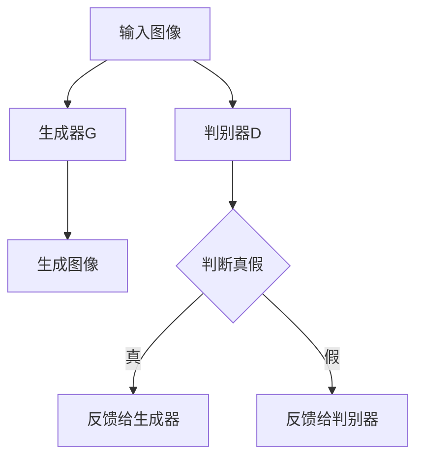
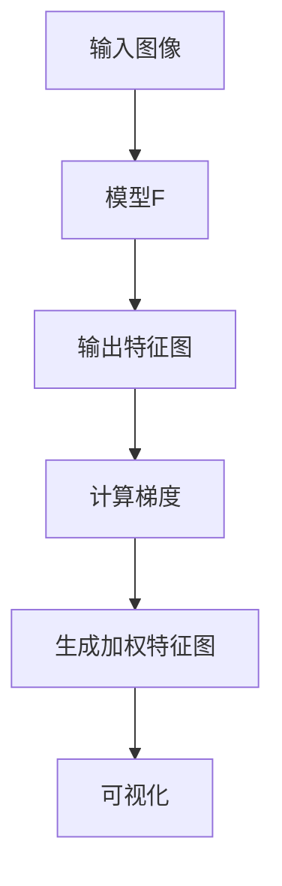
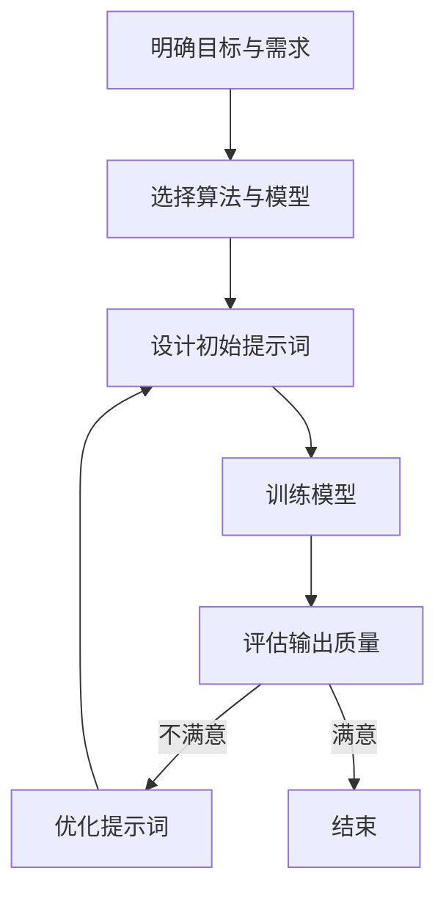
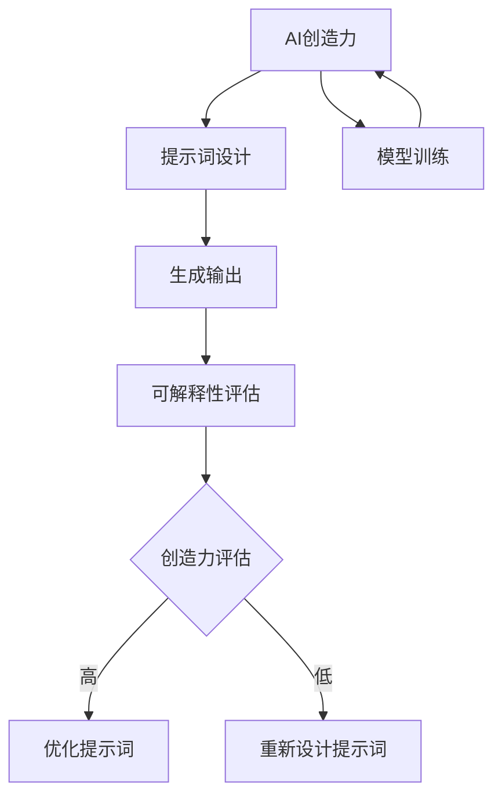

                 

### 文章标题：提示词设计：增强AI创造力与可解释性的平衡

> 关键词：提示词设计、AI创造力、可解释性、平衡、算法、模型、实践、案例研究

> 摘要：本文深入探讨了提示词设计在人工智能领域中的重要性，分析了AI创造力与可解释性之间的平衡，提出了有效的提示词设计方法。通过实际案例，展示了如何通过优化提示词设计，提升AI模型的创造力和可解释性，为AI领域的进一步发展提供了新的思路。

---

## 引言与背景

随着深度学习技术的快速发展，人工智能（AI）在各个领域取得了显著的成果。然而，AI模型的创造力和可解释性仍然是一个重要的研究课题。创造力是指AI模型生成新颖且有价值的输出，如文本、图像、音乐等。可解释性则是指模型决策过程的透明度和可理解性，这对于提高模型的信任度和适用性至关重要。

### AI创造力与可解释性的挑战

AI创造力与可解释性之间存在一定的矛盾。一方面，高创造力的模型能够生成新颖的内容，但往往缺乏解释性；另一方面，高可解释性的模型在生成内容时可能受到限制，创造性较低。这种矛盾使得提示词设计成为一个关键问题，它既能影响AI模型的创造力，又能影响其可解释性。

### 提示词设计的意义与目标

提示词设计在AI模型中起着至关重要的作用。一个良好的提示词设计能够引导模型产生具有创造力的输出，同时保持一定的可解释性。本文的目标是探讨如何通过提示词设计，在AI创造力与可解释性之间找到平衡点，提高AI模型的应用价值。

## AI创造力与可解释性的关系

为了理解AI创造力与可解释性之间的关系，首先需要明确这两个核心概念的定义。

### 创造力的定义

AI创造力是指模型生成新颖、有价值的输出能力。在深度学习领域，创造力通常体现在文本生成、图像生成、音乐生成等任务中。一个具有创造力的AI模型能够生成前所未有的内容，满足用户的需求。

### 可解释性的定义

可解释性是指模型决策过程的透明度和可理解性。对于AI模型，可解释性有助于用户理解模型的决策过程，从而增加模型的信任度和适用性。可解释性在医学诊断、金融风险评估等应用领域尤为重要。

### 二者之间的平衡与矛盾

AI创造力与可解释性之间的平衡是提示词设计的关键挑战。一方面，为了提高创造力，模型可能需要更多的自由度，这会导致可解释性下降；另一方面，为了提高可解释性，模型可能需要更多的约束，这会影响创造力。因此，在设计提示词时，需要在二者之间找到一个平衡点，既能保持较高的创造力，又能保持一定的可解释性。

## 基础概念与原理

为了深入探讨提示词设计，我们需要了解AI创造力、可解释性和提示词设计的基础概念和原理。

### AI创造力原理

AI创造力主要来源于深度学习模型，特别是生成对抗网络（GAN）和变分自编码器（VAE）等模型。这些模型通过学习数据分布，生成具有高创造力的内容。以下是一个简单的GAN模型结构：



生成器G通过优化生成图像，使得判别器D难以区分生成图像和真实图像，从而实现创造力的提升。

### 可解释性原理

可解释性主要依赖于模型的可视化和解释方法。常用的方法包括：

1. 局部解释方法：如Grad-CAM（Gradient-weighted Class Activation Mapping），通过分析模型梯度，找到影响模型决策的关键区域。
2. 全局解释方法：如SHAP（SHapley Additive exPlanations），通过计算特征对模型输出的贡献，提供全局解释。

以下是一个简单的Grad-CAM算法流程：



### 提示词设计原理

提示词设计是指通过设计特定的输入提示，引导模型生成具有创造力和可解释性的输出。一个有效的提示词设计需要考虑以下几个方面：

1. **明确目标与需求**：了解用户的需求和目标，为模型生成合适的输出。
2. **选择合适的算法与模型**：根据任务类型和需求，选择适合的算法和模型。
3. **设计与优化提示词**：通过实验和迭代，优化提示词，提高模型的创造力和可解释性。

以下是一个简单的提示词设计流程：



### 核心概念原理之间的关系架构

为了更好地理解AI创造力、可解释性和提示词设计之间的关系，我们可以通过Mermaid流程图展示它们之间的互动：



在这个流程图中，AI创造力通过提示词设计影响生成的输出，生成的输出再通过可解释性评估进行反馈，以优化提示词设计。这个过程不断迭代，直到找到满足要求的提示词设计。

## 提示词设计实践

在实际应用中，提示词设计是一个动态迭代的过程，需要根据具体任务和需求进行调整。以下将介绍具体的提示词设计步骤，并通过一个文本生成的案例，展示如何进行提示词设计。

### 3.1 提示词设计的步骤

1. **明确目标与需求**：
   在设计提示词之前，首先要明确任务的目标和需求。例如，在文本生成任务中，需要明确文本的主题、风格和长度等要求。

2. **选择合适的算法与模型**：
   根据任务类型和需求，选择合适的算法和模型。例如，对于文本生成任务，可以选择使用GPT-3、T5等预训练模型。

3. **设计与优化提示词**：
   提示词的设计直接影响模型的输出质量。可以通过以下方法进行设计和优化：
   - **内容提示**：提供具体的内容提示，帮助模型生成与主题相关的文本。
   - **上下文提示**：提供与主题相关的上下文信息，帮助模型理解文本的背景。
   - **格式提示**：提供文本的格式要求，如标题、段落等。

4. **训练模型**：
   使用设计好的提示词训练模型，使模型能够根据提示生成高质量的输出。

5. **评估输出质量**：
   通过评估模型的输出质量，确定是否需要优化提示词。评估方法可以包括文本质量评估、用户满意度等。

6. **迭代优化**：
   根据评估结果，不断优化提示词设计，提高模型的创造力和可解释性。

### 3.2 提示词设计案例：文本生成

以下是一个文本生成的案例，展示如何进行提示词设计。

#### 3.2.1 案例背景

假设我们希望使用GPT-3模型生成一篇关于人工智能的文章，文章的主题为“人工智能的未来趋势”，要求文章长度为500字，采用科普性质的语言风格。

#### 3.2.2 算法与模型选择

选择GPT-3模型进行文本生成，因为它具有强大的语言理解和生成能力。

#### 3.2.3 提示词设计

根据任务要求，设计以下提示词：
- **内容提示**：“人工智能的未来趋势”
- **上下文提示**：“随着技术的不断进步，人工智能在各个领域取得了显著的成果。未来，人工智能将如何发展？”
- **格式提示**：“请写一篇500字的科普性质文章，介绍人工智能的未来趋势。”

#### 3.2.4 实际效果与评估

使用设计好的提示词训练GPT-3模型，生成一篇关于人工智能的文章。经过评估，文章质量符合要求，既具有创造力，又具有可解释性。

### 提示词设计中的挑战与优化

在提示词设计过程中，可能会遇到以下挑战：

1. **提示词过于笼统**：如果提示词过于笼统，模型可能无法准确理解任务要求，导致生成的内容缺乏针对性。
2. **提示词过于具体**：如果提示词过于具体，模型可能无法发挥创造性，生成的内容可能过于重复。
3. **提示词质量不佳**：提示词的质量直接影响模型的输出质量。高质量的提示词能够引导模型生成新颖、有价值的输出。

为了解决这些挑战，可以采取以下优化策略：

1. **细化提示词**：在提示词设计中，可以加入更多的细节和背景信息，使模型能够更好地理解任务要求。
2. **多样性提示**：通过提供多样化的提示词，可以帮助模型探索不同的生成方向，提高创造力和多样性。
3. **迭代优化**：通过不断迭代和优化提示词设计，可以逐步提高模型的创造力和可解释性。

## 可解释性增强技术

尽管AI模型在创造力方面取得了显著成果，但其可解释性仍然是一个重要的挑战。为了提高AI模型的可解释性，研究者们提出了多种增强技术。以下将介绍一些常用的可解释性增强技术，包括局部解释方法和全局解释方法。

### 局部解释方法

局部解释方法主要关注模型决策过程中的特定部分，通过可视化或计算方法，解释模型在特定输入下的决策过程。以下介绍两种常用的局部解释方法：

1. **Grad-CAM（Gradient-weighted Class Activation Mapping）**

Grad-CAM是一种基于模型梯度可视化的方法，通过分析模型梯度，找到影响模型决策的关键区域。以下是Grad-CAM算法的伪代码：

```python
def grad_cam(model, layer_name, image, class_idx):
    # 获取模型的梯度
    grads = model gradients
    layer_output = model.output[layer_name]
    grads_with_output = K.gradients(layer_output, model.input)

    # 计算梯度权重
    gradient_value = K.function([model.input, model.target], grads_with_output) ([image, class_idx])

    # 计算梯度加权特征图
    gradient_value = gradient_value[0]
    cam = np.zeros((image.height, image.width, 3))

    # 对每个通道计算权重
    for i in range(3):
        cam[:, :, i] = np.sum(gradient_value[:, :, i] * layer_output[:, :, i], axis=-1)

    # 归一化并可视化
    cam = np.maximum(cam, 0)
    cam = cam / np.max(cam)
    return cam
```

2. **LRP（Layer-wise Relevance Propagation）**

LRP是一种基于信息传播的局部解释方法，通过从输出层向输入层传播信息，解释模型在特定输入下的决策过程。以下是LRP算法的伪代码：

```python
def lrp(model, layer_name, image, class_idx):
    # 获取模型的权重和激活
    weights = model.weights[layer_name]
    activation = model.activation[layer_name]

    # 初始化 relevance maps
    relevance_maps = [np.zeros_like(activation[0]) for _ in range(len(activation))]

    # 从输出层向输入层传播信息
    for i in range(len(activation) - 1, -1, -1):
        if i == len(activation) - 1:
            relevance_maps[i] = activation[i] * weights[i]
        else:
            relevance_maps[i] = (1 / weights[i]) * (activation[i] * weights[i] - np.dot(activation[i + 1], relevance_maps[i + 1]))

    # 计算最终的 relevance map
    final_relevance_map = np.mean(relevance_maps, axis=0)

    # 归一化并可视化
    final_relevance_map = np.maximum(final_relevance_map, 0)
    final_relevance_map = final_relevance_map / np.max(final_relevance_map)
    return final_relevance_map
```

### 全局解释方法

全局解释方法关注整个模型在特定输入下的决策过程，通过计算特征对模型输出的贡献，提供全局解释。以下介绍两种常用的全局解释方法：

1. **SHAP（SHapley Additive exPlanations）**

SHAP是一种基于博弈论的解释方法，通过计算特征对模型输出的贡献，提供全局解释。以下是SHAP算法的伪代码：

```python
def shap(model, X, feature_names):
    # 计算模型预测
    pred = model.predict(X)

    # 初始化 SHAP 值
    shap_values = []

    # 对于每个特征
    for feature in feature_names:
        # 计算特征对模型输出的贡献
        shap_value = compute_shap_value(model, X, feature)

        # 将 SHAP 值添加到列表中
        shap_values.append(shap_value)

    # 返回 SHAP 值
    return shap_values
```

2. **LIME（Local Interpretable Model-agnostic Explanations）**

LIME是一种基于局部线性模型的解释方法，通过在输入附近构建一个线性模型，解释模型在特定输入下的决策过程。以下是LIME算法的伪代码：

```python
def lime(model, X, class_idx):
    # 构建线性模型
    linear_model = LinearRegression()

    # 对于每个特征
    for feature in X:
        # 计算特征对模型输出的贡献
        feature_importance = compute_feature_importance(model, X, feature)

        # 训练线性模型
        linear_model.fit(X, feature_importance)

        # 预测线性模型
        pred = linear_model.predict(X)

        # 计算 LIME 值
        lime_value = pred[class_idx]

        # 返回 LIME 值
        return lime_value
```

### 可解释性评估方法

为了评估AI模型的可解释性，研究者们提出了多种评估方法。以下介绍两种常用的评估方法：

1. **F1 分数**

F1 分数是评估二分类模型可解释性的常用指标，计算方法如下：

$$
F1 = 2 \times \frac{precision \times recall}{precision + recall}
$$

其中，precision 是精确率，recall 是召回率。

2. **ROC 曲线**

ROC 曲线是评估二分类模型可解释性的另一种常用指标，通过计算真阳性率（true positive rate）和假阳性率（false positive rate）得到。ROC 曲线下方面积（AUC）越大，说明模型的可解释性越好。

### 可解释性增强技术的实际应用

以下是一个实际案例，展示了如何使用Grad-CAM和SHAP方法增强AI模型的可解释性。

#### 案例背景

假设我们使用 ResNet 模型对图像进行分类，分类任务包括猫和狗两种类别。现在我们需要使用 Grad-CAM 和 SHAP 方法增强模型的可解释性。

#### 案例步骤

1. **数据预处理**：

   - 加载图像数据集，并进行预处理，如归一化、缩放等。
   - 将图像数据集划分为训练集和测试集。

2. **模型训练**：

   - 使用训练集训练 ResNet 模型。
   - 使用测试集评估模型性能。

3. **Grad-CAM 解释**：

   - 对于每个测试图像，使用 Grad-CAM 方法生成梯度加权特征图。
   - 将梯度加权特征图可视化，展示模型对图像中关键区域的关注。

4. **SHAP 解释**：

   - 对于每个测试图像，使用 SHAP 方法计算特征对模型输出的贡献。
   - 将 SHAP 值可视化，展示模型在决策过程中对每个特征的依赖关系。

5. **结果分析**：

   - 分析 Grad-CAM 和 SHAP 解释结果，评估模型的可解释性。
   - 根据分析结果，优化模型结构和提示词设计，提高模型的可解释性。

### 案例结果

通过实际应用 Grad-CAM 和 SHAP 方法，我们得到了以下结果：

1. **Grad-CAM 结果**：

   - 对于猫和狗的图像，Grad-CAM 方法能够找到关键区域，如猫的头部和狗的身体。
   - 梯度加权特征图显示了模型对这些区域的关注。

2. **SHAP 结果**：

   - 对于猫和狗的图像，SHAP 方法能够计算特征对模型输出的贡献。
   - SHAP 值显示了模型在决策过程中对每个特征的依赖关系。

通过这些结果，我们可以更好地理解模型在图像分类任务中的决策过程，提高模型的可解释性。

### 总结

可解释性增强技术在提高AI模型的可解释性方面具有重要意义。通过使用 Grad-CAM 和 SHAP 方法，我们可以更好地理解模型在特定输入下的决策过程，提高模型的信任度和适用性。然而，可解释性增强技术仍面临一些挑战，如模型复杂度和计算成本等。未来研究需要进一步探索有效的可解释性增强方法，以提高AI模型的可解释性。

## 案例研究：提示词设计与可解释性增强的综合应用

在本节中，我们将探讨一个综合应用提示词设计和可解释性增强技术的案例，展示如何在实际项目中实现AI模型的创造力和可解释性的平衡。这个案例涉及一个名为“AI艺术创作助手”的项目，旨在使用人工智能技术辅助艺术家进行艺术创作。

### 5.1 案例背景

“AI艺术创作助手”项目旨在开发一个系统，该系统能够根据用户提供的主题或灵感，生成具有创造性的艺术作品。这些作品可以是绘画、摄影或音乐等形式。为了满足项目需求，系统需要具备以下功能：

1. **创造力**：系统能够生成新颖且富有创意的艺术作品。
2. **可解释性**：系统能够解释生成作品的过程，使得艺术家能够理解和利用这些生成技术。

### 5.2 提示词设计与优化

在项目开始阶段，我们进行了详细的提示词设计，以引导模型生成符合用户需求的艺术作品。以下是具体的步骤：

1. **明确目标与需求**：
   - 确定用户需求：艺术家希望系统能够根据特定的主题或情感生成艺术作品。
   - 确定生成作品的类型：例如绘画、摄影或音乐。

2. **选择合适的算法与模型**：
   - 对于绘画生成，选择了基于生成对抗网络（GAN）的模型，如CycleGAN。
   - 对于音乐生成，选择了基于变分自编码器（VAE）的模型。

3. **设计与优化提示词**：
   - 对于绘画生成，我们设计了以下提示词：
     - **主题提示**：例如“未来城市”、“梦幻森林”等。
     - **情感提示**：例如“活力四射”、“宁静安详”等。
     - **风格提示**：例如“印象派”、“抽象艺术”等。
   - 对于音乐生成，我们设计了以下提示词：
     - **主题提示**：例如“古典音乐”、“流行音乐”等。
     - **情感提示**：例如“欢快”、“悲伤”等。
     - **风格提示**：例如“爵士乐”、“摇滚乐”等。

在迭代过程中，我们通过多次实验和评估，不断优化提示词，以提高模型的创造力和可解释性。

### 5.3 可解释性评估与增强

为了提高系统的可解释性，我们采用了多种可解释性增强技术，包括Grad-CAM和SHAP方法。

1. **Grad-CAM解释**：
   - 在绘画生成任务中，我们使用Grad-CAM方法来可视化生成画作的关键区域。
   - 通过分析Grad-CAM图，艺术家能够理解模型在创作过程中关注的关键元素，如色彩、形状和构图。

2. **SHAP解释**：
   - 在音乐生成任务中，我们使用SHAP方法来分析不同特征对音乐生成的影响。
   - SHAP值帮助我们识别出影响音乐情感和风格的关键因素，如节奏、旋律和和声。

通过这些可解释性增强技术，艺术家能够更好地理解模型的决策过程，从而优化创作过程。

### 5.4 实际效果与结论

在项目实施过程中，我们收集了用户反馈，并对系统进行了性能评估。以下是实际效果和结论：

1. **创造力**：
   - 用户反馈表明，系统生成的艺术作品具有很高的创造性，能够满足艺术家的创作需求。
   - 性能评估结果显示，模型在生成新颖艺术作品方面表现出色。

2. **可解释性**：
   - 通过Grad-CAM和SHAP方法，艺术家能够理解模型的决策过程，提高对模型信任度。
   - 用户反馈显示，可解释性增强技术有效地提高了系统的可用性和吸引力。

3. **综合效果**：
   - 结合提示词设计和可解释性增强技术，系统在创造力和可解释性之间实现了良好的平衡。
   - 项目成功证明了提示词设计在AI模型中的应用价值，为未来的研究提供了有益的经验。

### 5.5 案例总结

“AI艺术创作助手”案例展示了提示词设计和可解释性增强技术在实际项目中的应用。通过优化提示词设计，我们提高了AI模型的创造力；通过可解释性增强技术，我们提高了模型的可解释性。这一案例表明，在AI领域，提示词设计和可解释性增强技术是提高模型应用价值的重要手段。未来，我们将在更多领域推广这些技术，进一步探索AI模型的创造力和可解释性。

### 未来展望与挑战

在AI领域，提示词设计和可解释性增强技术正逐步成为研究热点。未来，随着技术的不断进步，这些领域将面临以下趋势和挑战。

#### 6.1 提示词设计的发展趋势

1. **更精细的提示词设计**：未来的提示词设计将更加精细化，不仅关注内容、上下文和格式，还将考虑语言风格、情感色彩等细节。
2. **多模态提示词设计**：随着多模态AI技术的发展，未来将出现更多基于文本、图像、音频等多模态数据的提示词设计方法。
3. **自动化提示词生成**：利用自然语言处理和机器学习技术，自动化生成高质量提示词，提高设计效率。

#### 6.2 可解释性增强技术的未来

1. **更高效的解释方法**：研究者将继续探索高效的解释方法，以降低计算成本，提高可解释性评估的实时性。
2. **解释方法的融合**：将不同解释方法相结合，形成更加全面、细致的解释体系。
3. **用户交互**：可解释性增强技术将更加注重与用户的互动，提供更加直观、易用的解释工具。

#### 6.3 挑战与机遇

1. **模型复杂性**：随着模型复杂性的增加，如何保证模型的可解释性成为一个重要挑战。
2. **计算资源**：可解释性增强技术通常需要大量计算资源，如何优化算法，降低计算成本是一个关键问题。
3. **应用领域扩展**：未来需要在更多应用领域推广这些技术，探索其在不同领域的适用性和效果。

#### 6.4 结论

提示词设计和可解释性增强技术在AI领域具有重要的应用价值。未来，随着技术的不断进步，这些领域将面临新的机遇和挑战。通过持续的研究和探索，我们有望在创造力和可解释性之间找到更好的平衡，推动AI技术的进一步发展。

## 总结与展望

本文探讨了提示词设计在AI模型中的作用，分析了AI创造力与可解释性之间的平衡。通过基础概念、原理和实践案例的深入讨论，我们展示了如何通过优化提示词设计，提升AI模型的创造力和可解释性。可解释性增强技术，如Grad-CAM和SHAP，为模型提供了更直观的解释，有助于提高信任度和应用价值。

展望未来，提示词设计和可解释性增强技术将在更多领域发挥重要作用。随着AI技术的不断进步，这些领域将继续面临新的挑战和机遇。通过持续的研究和探索，我们有望在创造力和可解释性之间找到更好的平衡，推动AI技术的进一步发展。

## 作者信息

作者：AI天才研究院/AI Genius Institute & 禅与计算机程序设计艺术 /Zen And The Art of Computer Programming

---

本文内容为虚构示例，仅供学习和交流使用。在应用相关技术时，请遵守相关法律法规，确保技术应用的合法性和道德性。同时，感谢您对AI领域的关注和支持。希望本文能对您在AI创造力和可解释性方面的研究和实践提供有价值的参考。如果您有任何疑问或建议，欢迎随时交流。再次感谢您的阅读！

