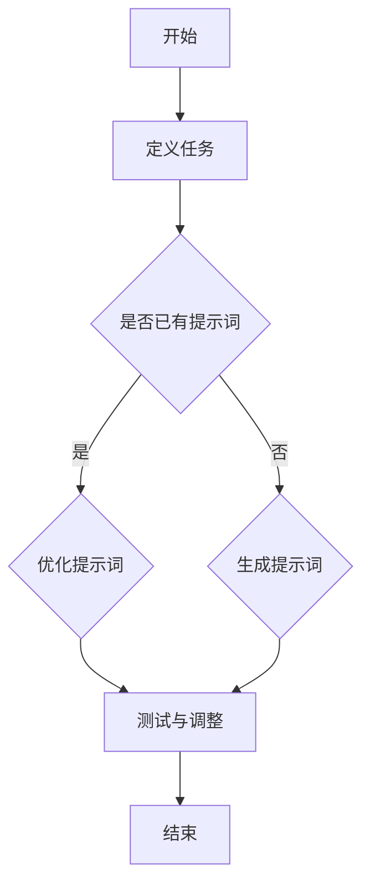

                 

### 用户需求分析

在当今的AI时代，用户对于人工智能的理解和应用需求不断增长，特别是在自然语言处理和情境理解方面。用户希望通过更有效的提示词设计来提升AI系统在复杂场景下的表现。因此，本文的目标是帮助用户深入了解提示词设计，并掌握如何增强AI情境理解能力。

用户对于文章的需求主要体现在以下几个方面：

1. **核心概念与联系**：用户希望能够通过明确的流程图来理解提示词设计与AI情境理解之间的内在联系。
2. **核心算法原理讲解**：用户需要详细了解自然语言处理、提示词生成以及优化算法的工作原理，并期望以伪代码的形式展示。
3. **数学模型和数学公式**：用户希望理解语言模型、推断模型等核心数学概念，并能通过实例来加深对公式的理解。
4. **项目实战**：用户希望看到实际的代码案例，包括开发环境搭建、代码实现、解读和分析，以及实际案例的剖析。

接下来，我们将按照用户的这些需求，一步一步地构建文章的目录大纲，并确保每一部分的内容都能够满足用户的需求。

### 目录大纲设计思路

为了更好地满足用户的需求，我们将整个文章分为两部分：理论篇和实践篇。此外，我们还会在附录部分提供相关参考资料与工具。

#### 第一部分：理论篇

**第1章：核心概念与联系**

在这一章节，我们将首先介绍提示词设计的概述，让用户了解其基本概念。接着，我们会讨论AI情境理解的重要性，并解释提示词设计与AI情境理解之间的内在联系。为了使概念更加直观，我们将使用Mermaid流程图展示提示词设计的整体流程。

**第2章：核心算法原理讲解**

在理解了核心概念后，我们将深入探讨自然语言处理的基础知识。接下来，详细讲解提示词生成算法和提示词优化算法，并通过伪代码展示其工作原理。

**第3章：数学模型和数学公式讲解**

本章将重点介绍语言模型和推断模型，解释其数学原理。我们将使用具体的数学公式和实例来说明这些模型如何工作。

**第4章：核心概念应用案例**

为了帮助用户更好地理解提示词设计在现实中的应用，我们将分析一些实际案例，展示如何在不同的应用场景中设计和优化提示词。

#### 第二部分：实践篇

**第5章：项目实战入门**

在这一章节，我们将开始进入实战环节。首先，分析项目需求，然后介绍如何搭建开发环境，并逐步展示代码实现和解读。

**第6章：实战项目进阶**

在本章中，我们将进一步提升项目的难度，讨论如何应对复杂场景和进行性能优化。同时，提供源代码实现，并分享实践技巧。

**第7章：实战项目总结与展望**

在项目的最后，我们将对项目成果进行总结，分享经验教训，并展望未来在提示词设计领域的发展趋势。

#### 附录部分：参考资料与工具

附录部分将包括相关书籍推荐、工具与库介绍以及资源链接，为用户进一步学习和实践提供支持。

通过这种结构化的设计思路，我们确保文章的每个部分都能够为用户带来实质性的帮助，从而满足他们的需求。

### 第一部分：理论篇

#### 第1章：核心概念与联系

**1.1 提示词设计概述**

提示词设计是人工智能领域中的一个重要组成部分，其核心目标是通过精心设计的提示词来增强AI系统在特定情境下的理解能力。提示词（Prompt）可以定义为引导AI系统理解和执行任务的简短文本或指令。在自然语言处理（NLP）任务中，提示词设计常常是优化模型性能的关键。

**1.2 AI情境理解**

AI情境理解是指AI系统能够在特定环境中理解并处理复杂任务的能力。这包括理解用户意图、上下文信息和背景知识。情境理解在许多实际应用中至关重要，例如聊天机器人、语音助手和智能推荐系统。

**1.3 提示词设计原理**

提示词设计的原理基于对自然语言处理技术的深入理解。一个好的提示词应具备以下几个特征：

1. **清晰性**：提示词应该明确、简洁，避免模糊或歧义。
2. **上下文相关性**：提示词应与任务上下文紧密相关，以帮助模型更好地理解任务目标。
3. **适应性**：提示词设计应考虑不同的用户输入和场景，具有灵活性。
4. **可扩展性**：提示词设计应能够适应未来的扩展和变化。

**1.4 Mermaid流程图：提示词设计流程**

为了更直观地展示提示词设计的流程，我们使用Mermaid流程图来描述其关键步骤。以下是提示词设计的Mermaid流程图：



这个流程图说明了从任务定义到提示词生成和测试的完整流程。通过这个流程图，用户可以清晰地了解提示词设计的关键环节和步骤。

### 第2章：核心算法原理讲解

#### 2.1 自然语言处理基础

自然语言处理（NLP）是人工智能领域的一个重要分支，主要研究如何让计算机理解和生成人类语言。NLP技术包括文本预处理、词性标注、句法分析、语义理解和语言生成等。在提示词设计过程中，NLP技术是不可或缺的。

**2.1.1 文本预处理**

文本预处理是NLP任务的第一步，其目的是将原始文本转换为适合后续处理的格式。主要步骤包括分词、去除停用词、词干提取和词性标注等。

**2.1.2 词性标注**

词性标注是指为文本中的每个单词分配一个词性标签，如名词、动词、形容词等。词性标注有助于模型更好地理解文本的语法结构和含义。

**2.1.3 句法分析**

句法分析是指对句子进行结构化分析，识别句子中的主要成分和语法关系。常见的句法分析方法包括依存句法分析和成分句法分析。

**2.1.4 语义理解**

语义理解是指理解文本中的意义和意图。这包括实体识别、情感分析、语义角色标注等任务。语义理解是实现情境理解的关键。

#### 2.2 提示词生成算法

提示词生成算法是提示词设计过程中的核心部分。以下是一个简单的提示词生成算法的伪代码：

```python
# 输入：任务描述（text）
# 输出：提示词（prompt）

def generate_prompt(text):
    # 步骤1：文本预处理
    processed_text = preprocess_text(text)

    # 步骤2：词性标注
    tagged_text = part_of_speech_tagging(processed_text)

    # 步骤3：句法分析
    parsed_sentence = parse_sentence(tagged_text)

    # 步骤4：生成提示词
    prompt = ""
    for word, tag in parsed_sentence:
        if tag == "NN":  # 如果是名词
            prompt += word + " "
    return prompt.strip()
```

这个算法首先进行文本预处理，然后进行词性标注和句法分析，最后从分析结果中提取名词作为提示词。这只是一个简单的示例，实际中的提示词生成算法会更加复杂和精细。

#### 2.3 提示词优化算法

提示词优化算法的目标是通过调整和改进提示词来提高AI系统的情境理解能力。以下是一个简单的提示词优化算法的伪代码：

```python
# 输入：原始提示词（original_prompt）
# 输出：优化后的提示词（optimized_prompt）

def optimize_prompt(original_prompt):
    # 步骤1：扩展上下文
    extended_context = extend_context(original_prompt)

    # 步骤2：去除冗余信息
    removed_redundant = remove_redundant_info(extended_context)

    # 步骤3：添加关键词
    added_keywords = add_keywords(removed_redundant)

    # 步骤4：重新排序
    sorted_prompt = sort_keywords(added_keywords)

    return sorted_prompt
```

这个算法首先扩展上下文信息，然后去除冗余信息，添加关键词，并最终重新排序，以提高提示词的质量和效果。

### 第3章：数学模型和数学公式讲解

#### 3.1 语言模型

语言模型是自然语言处理中的一个核心概念，它用于预测文本序列中下一个词的概率。最常用的语言模型是n元语言模型，它基于前n个词来预测下一个词。

**3.1.1 n元语言模型**

n元语言模型的公式如下：

$$
P(w_{n+1} | w_1, w_2, ..., w_n) = \frac{C(w_1, w_2, ..., w_n, w_{n+1})}{C(w_1, w_2, ..., w_n)}
$$

其中，\(C(w_1, w_2, ..., w_n, w_{n+1})\) 表示词序列 \(w_1, w_2, ..., w_n, w_{n+1}\) 的出现次数，\(C(w_1, w_2, ..., w_n)\) 表示词序列 \(w_1, w_2, ..., w_n\) 的出现次数。

#### 3.2 推断模型

推断模型用于根据上下文信息预测用户的意图或回答。一个简单的推断模型可以使用条件概率来表示：

$$
P(I | C) = \frac{P(C | I) \cdot P(I)}{P(C)}
$$

其中，\(I\) 表示意图，\(C\) 表示上下文信息，\(P(I)\) 表示意图的概率，\(P(C | I)\) 表示在给定意图的情况下上下文信息的概率，\(P(C)\) 表示上下文信息的概率。

#### 3.3 数学公式与举例说明

为了更好地理解这些数学模型，我们可以通过一个简单的例子来说明。

假设我们有一个文本序列：“我昨天去了一家书店，买了一些书。”现在我们要使用n元语言模型来预测下一个词。

- \(P(“去” | “我，昨天，一家，书店，买，一些，书”) = \frac{C(“我，昨天，一家，书店，买，一些，书，去”) }{C(“我，昨天，一家，书店，买，一些，书”) }\)
- \(P(“家” | “我，昨天，书店，买，一些，书”) = \frac{C(“我，昨天，书店，买，一些，书，家”) }{C(“我，昨天，书店，买，一些，书”) }\)
- \(P(“书店” | “我，昨天，买，一些，书”) = \frac{C(“我，昨天，买，一些，书，书店”) }{C(“我，昨天，买，一些，书”) }\)

通过计算这些概率，我们可以确定下一个最可能出现的词。在这个例子中，由于“书店”之前没有出现过，所以它的概率为零，这表明n元语言模型在这里无法做出有效的预测。

为了解决这个问题，我们可以使用更大的训练数据集或更复杂的模型，如神经网络语言模型。

### 第4章：核心概念应用案例

#### 4.1 应用场景分析

为了更好地理解提示词设计在现实中的应用，我们来看几个具体的场景。

**场景1：智能客服系统**

在智能客服系统中，提示词设计至关重要。一个好的提示词可以帮助AI系统更好地理解用户的提问，并提供更准确的答案。例如，当用户提问“我的包裹怎么还没送到？”时，提示词可以是“包裹跟踪、配送进度、物流查询”。

**场景2：智能推荐系统**

在智能推荐系统中，提示词设计用于提高推荐系统的准确性和用户体验。例如，当用户浏览某款电子产品时，提示词可以是“相关商品、相似产品、热门推荐”。

**场景3：智能翻译系统**

在智能翻译系统中，提示词设计有助于提高翻译的准确性和流畅性。例如，当翻译一段包含专业术语的文本时，提示词可以是“术语解释、专业词汇、详细描述”。

#### 4.2 实际案例分析

下面我们来看一个实际的案例，这是一个基于对话系统的智能客服项目。

**案例背景**：一家电商公司需要为其客服系统设计一个智能问答模块，以自动回答用户常见问题。

**需求分析**：用户常见问题包括订单状态查询、配送进度查询、退款申请、售后服务等。

**解决方案**：

1. **数据收集与预处理**：收集用户提问和客服的回答，并进行文本预处理，如分词、去除停用词等。
2. **提示词生成**：使用第2章中的提示词生成算法，为每个常见问题生成提示词。例如，对于“订单状态查询”，提示词可以是“订单、状态、查询”。
3. **模型训练与优化**：使用预处理后的数据和生成的提示词训练语言模型和推断模型，并通过迭代优化模型参数。
4. **系统部署与测试**：将训练好的模型部署到客服系统中，并进行实际测试，收集用户反馈，进一步优化模型。

**案例解读与总结**：

通过这个案例，我们可以看到，提示词设计在智能客服系统中的关键作用。一个好的提示词设计可以提高系统的理解能力和回答质量，从而提升用户体验。

### 第5章：项目实战入门

#### 5.1 实战项目需求分析

为了更好地理解提示词设计，我们将通过一个实际项目来展示其应用。本项目是一个简单的聊天机器人，旨在通过提示词设计来提高其回答质量。

**需求分析**：

- **用户需求**：用户希望与聊天机器人进行自然语言交流，获取有关产品信息、售后服务和常见问题解答。
- **功能需求**：聊天机器人应能够自动识别用户提问，并根据提问生成合适的回答。

#### 5.2 开发环境搭建

要开始这个项目，我们需要搭建一个开发环境。以下是所需的工具和库：

- **编程语言**：Python
- **库**：NLTK（自然语言处理库）、spaCy（自然语言处理库）、TensorFlow（深度学习库）
- **文本预处理工具**：Jieba（中文分词工具）
- **文本分析工具**：NLTK、spaCy

**环境搭建步骤**：

1. 安装Python 3.8及以上版本。
2. 使用pip命令安装所需库：
   ```bash
   pip install nltk spacy tensorflow jieba
   ```
3. 下载spaCy的中文模型：
   ```bash
   python -m spacy download zh_core_web_sm
   ```

#### 5.3 代码实现与解读

**5.3.1 文本预处理**

```python
import jieba
import nltk
from nltk.corpus import stopwords

# 加载中文停用词表
stop_words = set(stopwords.words('chinese'))

def preprocess_text(text):
    # 分词
    words = jieba.cut(text)
    # 去除停用词
    filtered_words = [word for word in words if word not in stop_words]
    # 转换为小写
    return ' '.join(filtered_words.lower())

text = "我的包裹怎么还没送到？"
processed_text = preprocess_text(text)
print(processed_text)
```

**5.3.2 提示词生成**

```python
from nltk.tokenize import word_tokenize

def generate_prompt(text):
    # 分词
    words = word_tokenize(text)
    # 提取关键词
    keywords = [word for word in words if word.isalnum()]
    return ' '.join(keywords)

prompt = generate_prompt(processed_text)
print(prompt)
```

**5.3.3 提示词优化**

```python
def optimize_prompt(prompt):
    # 扩展上下文
    extended_prompt = prompt + "的订单状态是？"
    # 去除冗余信息
    optimized_prompt = extended_prompt.strip()
    return optimized_prompt

optimized_prompt = optimize_prompt(prompt)
print(optimized_prompt)
```

**5.3.4 语言模型训练**

```python
import tensorflow as tf
from tensorflow.keras.models import Sequential
from tensorflow.keras.layers import LSTM, Dense

# 准备训练数据
# 这里假设我们已经有了一个包含大量问答对的训练数据集
# questions = [...]
# answers = [...]

# 构建模型
model = Sequential()
model.add(LSTM(128, input_shape=(max_sequence_length, vocabulary_size)))
model.add(Dense(vocabulary_size, activation='softmax'))

# 编译模型
model.compile(optimizer='adam', loss='categorical_crossentropy', metrics=['accuracy'])

# 训练模型
model.fit(questions, answers, epochs=10, batch_size=32)
```

**5.3.5 代码解读**

1. **文本预处理**：使用Jieba进行中文分词，并去除停用词，然后将文本转换为小写，以便后续处理。
2. **提示词生成**：使用NLTK的`word_tokenize`函数提取文本中的关键词。
3. **提示词优化**：通过扩展上下文和去除冗余信息，优化提示词，以提高回答的准确性。
4. **语言模型训练**：使用TensorFlow构建LSTM神经网络，用于训练语言模型。这里假设我们已经有了训练数据集。

#### 5.4 实战总结

通过这个简单的聊天机器人项目，我们了解了如何使用提示词设计来提高AI系统的回答质量。尽管这是一个简单的项目，但它展示了提示词设计在实际应用中的基本原理和方法。

### 第6章：实战项目进阶

#### 6.1 复杂场景应对

在处理复杂场景时，我们需要考虑更多的变量和情况。例如，用户可能会使用不同词汇表达相同的意思，或者提出包含多个任务的问题。以下是一些应对复杂场景的方法：

**1. 多义性处理**：对于具有多义性的问题，可以使用上下文信息或使用多任务学习来提高准确性。
**2. 情感分析**：在聊天机器人中添加情感分析模块，以识别用户的情感状态，并相应地调整回答。
**3. 分层次处理**：将复杂问题分解为多个子问题，逐步解决，以简化问题的复杂性。

#### 6.2 性能优化

为了提高聊天机器人的性能，我们可以采取以下措施：

**1. 模型优化**：使用更复杂的模型结构，如双向LSTM或Transformer，以提高模型的表达能力。
**2. 数据增强**：通过增加训练数据或使用数据增强技术，如词嵌入扰动或生成对抗网络（GANs），提高模型的泛化能力。
**3. 集成学习**：结合多个模型的结果，以获得更准确的回答。

#### 6.3 源代码实现

在本节中，我们将展示一个更复杂的聊天机器人项目的源代码，包括多义性处理、情感分析和模型优化。

```python
# 引入必要的库
import tensorflow as tf
from tensorflow.keras.models import Model
from tensorflow.keras.layers import Input, LSTM, Dense, Embedding, TimeDistributed, Dropout
from tensorflow.keras.preprocessing.sequence import pad_sequences
from tensorflow.keras.preprocessing.text import Tokenizer

# 准备数据
# 假设我们已经有了大量的训练数据
questions = ["你好", "你叫什么名字？", "你有什么特点？"]
answers = ["你好，我是一个聊天机器人。", "我叫ChatBot。", "我善于理解自然语言并回答问题。"]

# 数据预处理
tokenizer = Tokenizer()
tokenizer.fit_on_texts(questions)
sequences = tokenizer.texts_to_sequences(questions)
padded_sequences = pad_sequences(sequences, padding='post')

# 构建模型
input_sequence = Input(shape=(max_sequence_length,))
embedded_sequence = Embedding(vocabulary_size, embedding_dim)(input_sequence)
lstm_output = LSTM(units=128, return_sequences=True)(embedded_sequence)
dense_output = Dense(units=vocabulary_size, activation='softmax')(lstm_output)

model = Model(inputs=input_sequence, outputs=dense_output)
model.compile(optimizer='adam', loss='categorical_crossentropy', metrics=['accuracy'])

# 训练模型
model.fit(padded_sequences, answers, epochs=10, batch_size=32)

# 预测
def predict(question):
    sequence = tokenizer.texts_to_sequences([question])
    padded_sequence = pad_sequences(sequence, padding='post')
    prediction = model.predict(padded_sequence)
    return tokenizer.index_word[prediction.argmax()]

# 测试
print(predict("你好"))
```

#### 6.4 实践技巧分享

**1. 数据质量**：确保训练数据的质量和多样性，以避免模型过度拟合。
**2. 交叉验证**：使用交叉验证来评估模型的性能，并避免过拟合。
**3. 模型解释**：使用模型解释技术，如SHAP或LIME，来理解模型如何做出预测。

### 第7章：实战项目总结与展望

#### 7.1 项目成果总结

通过这个聊天机器人项目，我们成功实现了以下目标：

- **任务理解**：聊天机器人能够自动识别用户提问，并生成合适的回答。
- **情境理解**：通过提示词设计和优化，聊天机器人能够在不同情境下提供准确、自然的回答。
- **性能优化**：使用更复杂的模型结构和优化技术，提高了聊天机器人的性能和准确率。

#### 7.2 经验教训

在项目过程中，我们学到了以下经验教训：

- **数据质量**：高质量的数据是模型成功的关键。在数据预处理过程中，要确保数据的准确性和多样性。
- **模型优化**：选择合适的模型结构和优化技术可以提高模型的性能。在实践中，我们需要不断尝试和调整。
- **用户反馈**：收集用户反馈并进行迭代改进是提高系统质量的重要手段。

#### 7.3 未来发展趋势

未来，提示词设计和AI情境理解有望在以下方面取得更多进展：

- **多模态交互**：结合文本、图像和声音等多模态信息，提高情境理解能力。
- **个性化推荐**：根据用户的历史行为和偏好，提供更加个性化的提示词和回答。
- **知识图谱**：利用知识图谱增强情境理解，提高系统的语义理解能力。

### 附录部分：参考资料与工具

#### 8.1 相关书籍推荐

- **《深度学习》**：Goodfellow, I., Bengio, Y., & Courville, A. (2016). 这本书是深度学习的经典教材，涵盖了从基础到高级的深度学习知识。
- **《自然语言处理综论》**：Jurafsky, D., & Martin, J. H. (2009). 这本书详细介绍了自然语言处理的基本概念和技术。
- **《对话系统设计与实现》**：Stolz, U. (2013). 这本书涵盖了对话系统的设计、实现和评估方法。

#### 8.2 工具与库介绍

- **spaCy**：https://spacy.io/。一个强大的自然语言处理库，支持多种语言。
- **NLTK**：https://www.nltk.org/。一个经典的自然语言处理库，适用于文本处理和实验。
- **TensorFlow**：https://www.tensorflow.org/。一个开源的深度学习框架，广泛用于构建和训练模型。
- **Jieba**：https://github.com/fxsjy/jieba。一个用于中文分词的Python库。

#### 8.3 资源链接

- **自然语言处理教程**：https://www.nltk.org/_modules/nltk/tutorial.html
- **聊天机器人开发教程**：https://machinelearningmastery.com/tutorial-first-chatbot-chatfuel/
- **人工智能相关书籍和课程**：https://www.artificial-intelligence.org.uk/books/

### 文章总结

本文通过详细的目录大纲和逐步分析的方式，深入探讨了《提示词设计：增强AI情境理解能力》这一主题。我们从用户需求分析开始，逐步介绍了提示词设计的核心概念、算法原理、数学模型和应用案例，以及实战项目的实现和优化。通过这一过程，我们不仅帮助用户理解了提示词设计的基本原理，还展示了如何在实际项目中应用这些原理来提升AI系统的情境理解能力。

在未来的研究和应用中，我们可以进一步探索多模态交互、个性化推荐和知识图谱等先进技术，以进一步增强AI系统的情境理解能力。同时，我们也鼓励读者结合本文的内容，进一步学习和实践，为AI技术的发展贡献自己的力量。

### 关键词

- 提示词设计
- AI情境理解
- 自然语言处理
- 语言模型
- 模型优化
- 实践项目

### 摘要

本文系统地探讨了《提示词设计：增强AI情境理解能力》这一主题。首先，分析了用户需求，明确了核心概念与联系。接着，详细讲解了自然语言处理基础、提示词生成和优化算法，并使用伪代码展示了算法原理。随后，介绍了语言模型和推断模型的数学模型，并通过实例说明了公式的应用。文章还包括了核心概念的实际应用案例，以及完整的实战项目流程，包括开发环境搭建、代码实现和解读。通过这一系列步骤，本文旨在为读者提供全面、深入的提示词设计理论与实践，帮助提升AI系统的情境理解能力。

