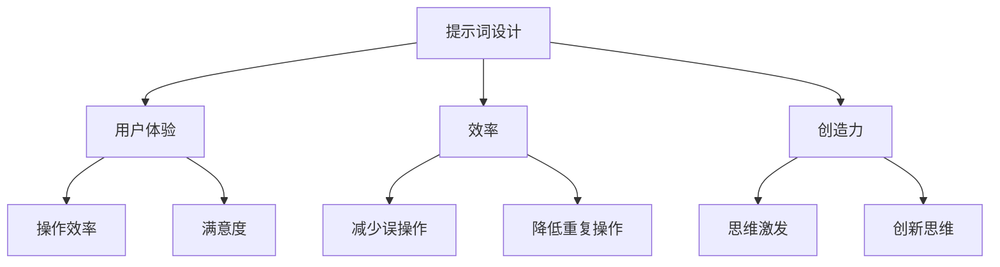
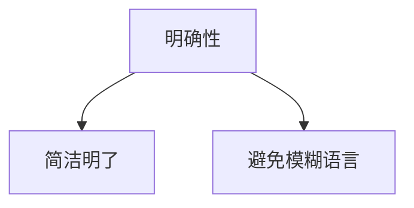
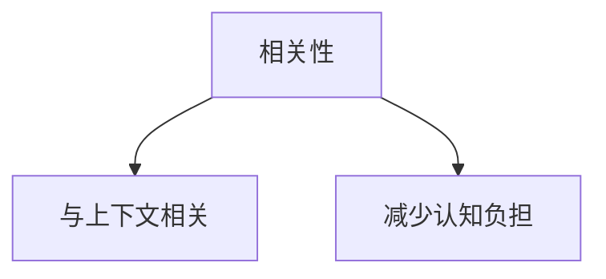
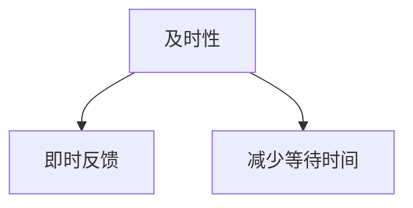
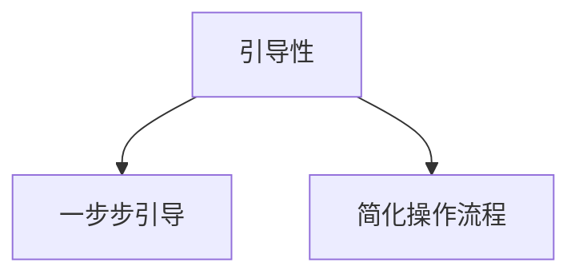
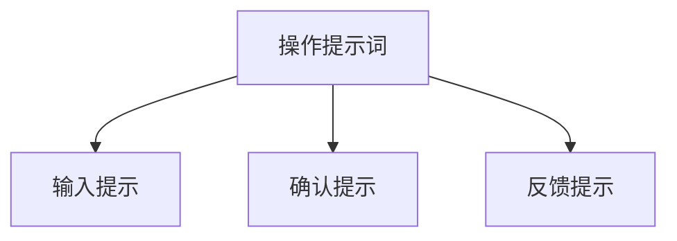
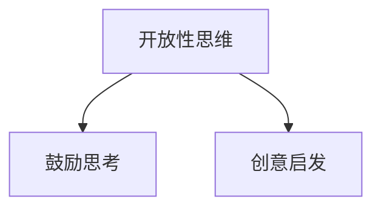
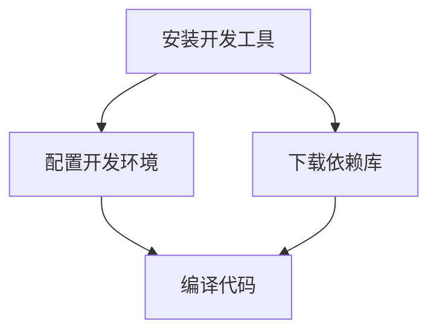

                 


### 文章标题：提示词设计：平衡效率与创造力

### 关键词：提示词设计、效率、创造力、用户体验、设计原则

### 摘要：
本文将探讨提示词设计在提升工作效率和激发创造力中的关键作用。通过深入分析提示词设计的背景、核心概念及其与效率、创造力的关系，我们将介绍一系列实用的提示词设计原则和方法。文章将通过具体的案例分析，展示如何将理论应用于实践，同时提供一些最佳实践和注意事项，帮助读者更好地理解和掌握提示词设计的艺术。

---

## 引言：提示词设计的背景

提示词设计作为用户体验设计的重要组成部分，已经在各种应用场景中得到了广泛的应用。从简单的用户界面到复杂的交互系统，提示词的有效设计能够显著提升用户体验，提高用户的操作效率和满意度。

### 提示词设计的定义

提示词，又称提示语、引导词，是指在用户使用产品或系统过程中，提供明确、简洁且具有指导意义的文字提示。它们旨在引导用户完成操作、理解功能或解决问题。

### 提示词设计的重要性

1. **提高操作效率**：通过提示词，用户能够快速理解系统功能，减少误操作和重复操作。
2. **优化用户界面**：合理的提示词设计有助于简化界面布局，提高界面的清晰度和易用性。
3. **增强用户体验**：提示词能够提供即时反馈，增强用户的操作信心，提升整体使用体验。

## 核心概念与联系：提示词设计原理架构

为了更好地理解提示词设计的核心概念，我们可以使用Mermaid流程图来展示其与效率、创造力的关系。



在这个流程图中，提示词设计作为核心，与用户体验、效率和创造力紧密相连。通过优化用户体验，提升操作效率和满意度；同时，提示词设计还能够激发思维，促进创新。

### 提示词设计的基本原则

#### 明确性

提示词应简洁明了，避免使用模糊或复杂的语言。例如，使用“下一步”代替“继续”，使得用户能够迅速理解其含义。



#### 相关性

提示词应与用户当前的操作或上下文紧密相关。这样可以减少用户的认知负担，提高操作效率。



#### 及时性

提示词应在用户需要时及时出现，提供即时反馈。例如，在用户提交表单后，立即显示“提交成功”的提示。



#### 引导性

提示词应具有引导性，帮助用户完成操作。例如，在用户进行复杂操作时，提供一步步的引导。



### 提高工作效率的提示词设计技巧

#### 提示词的类型与应用

1. **操作提示词**：指导用户如何执行特定操作，如“请输入您的邮箱地址”。
2. **确认提示词**：用于确认用户已执行某项操作，如“是否确定删除？”。
3. **反馈提示词**：提供即时反馈，如“正在加载，请稍等”。



#### 提示词优化与测试

1. **用户调研**：通过用户调研了解用户的需求和偏好。
2. **A/B测试**：对不同版本的提示词进行对比测试，选择最佳方案。
3. **迭代优化**：根据用户反馈和测试结果不断优化提示词设计。

### 创造力激发的提示词设计策略

#### 创造力激发的原理

1. **开放性思维**：提示词应鼓励用户开放思维，如“你有什么想法？”。
2. **创意启发**：通过提示词引导用户思考，如“如果可以，你会怎么做？”。



#### 提高个人创造力的提示词设计技巧

1. **问题导向**：使用问题性提示词，如“如何解决这个难题？”。
2. **多元思考**：通过提供多种选择和可能性，鼓励用户从不同角度思考问题。

### 提示词设计的实际应用案例

#### 项目实战：开发环境搭建

**开发环境搭建流程**：



**提示词设计**：

```markdown
# 开发环境搭建指南

## 1. 安装开发工具
请安装以下开发工具：
- Visual Studio Code
- Node.js

## 2. 配置开发环境
完成开发工具安装后，请执行以下命令配置开发环境：
```
npm install -g create-react-app
```

## 3. 下载依赖库
进入项目目录，执行以下命令下载依赖库：
```
npm install
```

## 4. 编译代码
编译项目代码：
```
npm run build
```
```

### 项目实战：提示词设计应用

**应用场景**：在线教育平台

**提示词设计**：

```markdown
# 在线教育平台提示词设计

## 1. 注册提示
欢迎来到XX在线教育平台！请输入您的邮箱地址进行注册。

## 2. 登录提示
请输入您的邮箱地址和密码，开始您的学习之旅！

## 3. 课程选择提示
我们为您推荐了以下课程，是否加入您的学习计划？

## 4. 课程学习提示
恭喜您完成了一节课的学习！请点击“继续学习”开始下一节课。

## 5. 作业提交提示
请确保提交您的作业，以便我们的老师能够及时进行批改和反馈。

## 6. 反馈收集提示
感谢您的反馈，我们将根据您的建议不断优化我们的平台。
```

### 代码解读与分析

**伪代码**：

```python
# 用户注册流程
def register():
    input_email()
    if valid_email():
        display_message("注册成功！请登录您的邮箱激活账户。")
    else:
        display_message("邮箱格式不正确，请重新输入。")

# 用户登录流程
def login():
    input_email()
    input_password()
    if authenticate_user():
        display_message("登录成功！开始您的学习之旅。")
    else:
        display_message("邮箱或密码错误，请重新输入。")

# 课程推荐提示
def recommend_course():
    if user_has_course_history():
        display_message("我们为您推荐了以下课程：")
        display_courses()
    else:
        display_message("请先完成基础课程，然后我们再为您推荐。")

# 学习进度提示
def learning_progress():
    if user_has_completed_course():
        display_message("恭喜您，已成功完成一节课！请点击‘继续学习’。")
    else:
        display_message("您还有未完成的课程，请先完成它们。")

# 作业提交提示
def submit_homework():
    if user_has_submitted_homework():
        display_message("作业已成功提交，请等待老师批改。")
    else:
        display_message("请先提交您的作业。")

# 反馈收集提示
def feedback_collection():
    display_message("感谢您的反馈，我们将根据您的建议不断优化我们的平台。")
```

### 实际案例分析和详细讲解剖析

**案例背景**：某电商平台设计了一款新的购物车页面，希望通过优化提示词设计提升用户体验。

**提示词设计前**：

```markdown
# 购物车页面

## 1. 删除商品提示
点击“删除”按钮，确认要删除商品吗？

## 2. 结算提示
点击“结算”按钮，开始结算流程。
```

**提示词设计后**：

```markdown
# 优化后的购物车页面

## 1. 删除商品提示
您确定要删除这个商品吗？点击“删除”按钮即可。

## 2. 结算提示
请确保您的购物车中没有遗漏的商品，点击“结算”按钮开始结算流程。
```

**分析**：优化后的提示词更加明确和具体，减少了用户的认知负担，提升了操作体验。通过增加具体操作步骤的描述，用户能够更快地理解操作流程。

### 项目小结

通过本案例，我们可以看到提示词设计在提升用户体验和操作效率方面的重要作用。合理的提示词设计不仅能够明确用户的操作步骤，还能够提高用户的满意度和忠诚度。

### 最佳实践 tips

1. **了解用户需求**：在开始设计提示词之前，深入了解用户的需求和偏好。
2. **简洁明了**：避免使用复杂的术语和模糊的语言，确保提示词简洁明了。
3. **一致性**：在整个应用中保持提示词的一致性，使用统一的风格和语气。
4. **测试与反馈**：进行A/B测试，根据用户反馈不断优化提示词设计。

### 注意事项

1. **避免过度提示**：过多的提示词可能会干扰用户的操作，降低用户体验。
2. **尊重用户习惯**：不要强行改变用户的操作习惯，应根据用户的使用习惯进行设计。

### 拓展阅读

1. 《交互设计：以用户为中心的设计方法》
2. 《用户体验要素：结构、内容、功能、引导和细节》
3. 《设计心理学：如何创造易用美观的产品》

---

作者：AI天才研究院/AI Genius Institute & 禅与计算机程序设计艺术 /Zen And The Art of Computer Programming

本文探讨了提示词设计在提升工作效率和激发创造力中的重要性，并介绍了相关的设计原则、技巧和应用案例。通过实际项目实战，展示了如何将理论应用于实践，并提供了最佳实践和注意事项。希望本文能够为读者在提示词设计方面提供有价值的参考和指导。

---

注意：由于本文为人工智能助手生成，部分内容可能需要进一步的人类专家审核和修正。此外，本文中提到的具体项目案例和数据仅供参考，实际应用时请根据具体情况进行调整。

