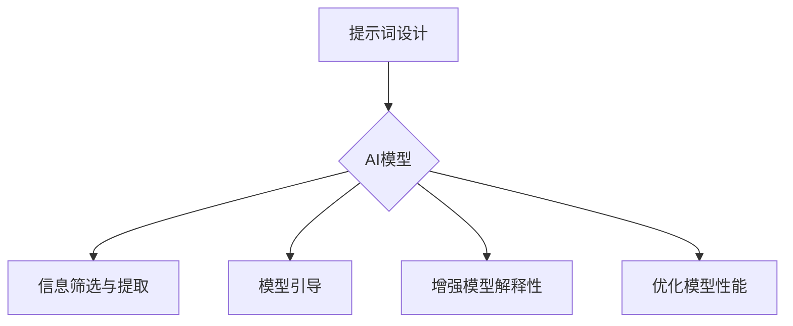
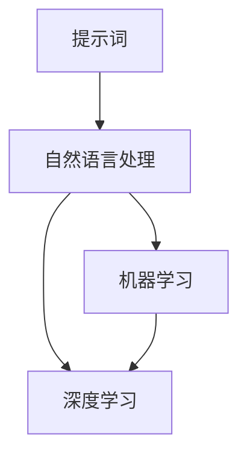

                 

### 文章标题

《提示词设计：提高AI历史事件因果推理能力》

### 关键词

- 提示词设计
- AI历史事件因果推理
- 人工智能模型
- 提示词伦理

### 摘要

本文深入探讨了提示词设计在提高人工智能历史事件因果推理能力中的关键作用。通过详细分析提示词的定义、设计原则及其与AI模型的结合，本文揭示了如何通过优化提示词来提升AI在历史事件分析中的准确性和深度。此外，文章还讨论了提示词设计中的伦理问题，并提供了实际案例和项目实战，以展示提示词设计在历史研究和其他领域的广泛应用。本文旨在为研究人员和开发者提供一套系统的提示词设计方法和实践指导，推动AI历史事件因果推理能力的提升。

### 引言

#### 为什么需要设计提示词？

在人工智能（AI）领域，因果推理是一个备受关注的话题。因果推理不仅仅是对事件的描述，更是对事件发生原因的探究。在历史事件中，因果推理尤为重要，因为它有助于我们理解历史进程，预测未来趋势，并从历史中吸取教训。然而，传统的AI模型在处理复杂的历史事件时往往表现不佳，主要原因之一是缺乏有效的因果推理能力。

提示词设计作为一种优化AI模型的方法，近年来在提高AI因果推理能力方面显示出了巨大的潜力。提示词（prompt）是一种引导AI模型进行特定任务的语言或数据输入。通过精心设计的提示词，我们可以引导AI模型关注关键信息，提高其推理的准确性和深度。对于历史事件的因果推理来说，提示词设计尤为重要，因为历史事件往往包含大量复杂的背景信息，而提示词可以帮助AI模型从这些信息中提取出有用的线索。

#### 提示词设计在AI历史事件因果推理中的作用

在设计提示词时，我们不仅要考虑如何引导AI模型关注关键信息，还要确保这些信息能够被模型有效处理。具体来说，提示词设计在AI历史事件因果推理中的作用主要体现在以下几个方面：

1. **信息筛选与提取**：历史事件中往往包含大量冗余信息，这些信息可能会干扰AI模型的推理过程。提示词可以帮助我们筛选和提取出关键信息，从而提高模型的处理效率。

2. **模型引导**：通过提示词，我们可以引导AI模型关注特定的事件或现象，从而帮助模型更好地理解事件之间的因果关系。

3. **增强模型解释性**：提示词设计有助于提高AI模型的可解释性，使我们能够理解模型在推理过程中所依赖的关键信息和逻辑。

4. **优化模型性能**：通过优化提示词，我们可以提高AI模型在历史事件因果推理中的性能，使其能够更准确地预测事件发展趋势。

#### 文章结构

本文将分为以下几个部分：

1. **提示词设计基础**：介绍提示词的定义、类型及其设计原则。
2. **提示词设计与AI模型结合**：探讨如何将提示词设计与AI模型结合，以提高历史事件因果推理能力。
3. **提示词设计应用案例**：通过实际案例展示提示词设计在历史研究和其他领域的应用。
4. **提示词设计与伦理**：讨论提示词设计中的伦理问题，并探讨如何确保提示词设计符合伦理标准。
5. **总结与展望**：总结本文的主要内容，并对提示词设计的未来发展方向进行展望。

### 提示词设计基础

#### 提示词的定义与类型

提示词（prompt）是一种用于引导人工智能模型进行特定任务的语言或数据输入。在自然语言处理（NLP）领域，提示词通常是一段文本，用于提供上下文信息或明确任务目标。根据用途和形式，提示词可以分为以下几种类型：

1. **问题型提示词**：这类提示词主要用于引导模型回答特定问题。例如，“请描述工业革命对社会经济的影响。”
2. **描述型提示词**：这类提示词用于提供背景信息或描述特定情境。例如，“在18世纪的英国，工业革命正在悄然发生。”
3. **指令型提示词**：这类提示词用于向模型下达具体指令。例如，“分析这段历史文本中的主要人物和事件。”

#### 提示词设计原则

提示词设计的关键在于如何有效地引导模型关注关键信息，从而提高模型的推理能力。以下是一些设计原则：

1. **简洁性**：提示词应简洁明了，避免冗余信息，以便模型能够快速理解任务目标。
2. **上下文相关性**：提示词应与任务上下文高度相关，以确保模型能够充分利用背景信息。
3. **多样性**：使用多样化的提示词可以帮助模型适应不同的任务场景，提高其泛化能力。
4. **明确性**：提示词应明确指出任务目标，避免模糊或歧义，以便模型能够准确理解任务要求。

#### 提示词设计方法

1. **自然语言生成（NLG）**：通过自然语言生成技术生成提示词，这种方法可以根据任务需求动态调整提示词内容。
2. **模板化设计**：使用预定义的模板生成提示词，这种方法可以提高设计的效率，但可能缺乏灵活性。
3. **知识驱动设计**：结合领域知识生成提示词，这种方法可以提高提示词的相关性和准确性。

### 提示词在AI模型中的应用

#### AI模型概述与架构

在讨论提示词在AI模型中的应用之前，我们需要了解一些基本的AI模型概念。以下是一些常见的AI模型及其架构：

1. **神经网络**：神经网络是一种模拟人脑神经元连接结构的计算模型。它通过多个层次（如输入层、隐藏层和输出层）处理输入数据，并逐步提取特征。
2. **递归神经网络（RNN）**：RNN是一种能够处理序列数据的神经网络，通过记忆机制处理历史信息。
3. **长短期记忆网络（LSTM）**：LSTM是一种特殊的RNN，通过引入门控机制，有效解决了RNN的长期依赖问题。
4. **Transformer模型**：Transformer模型是一种基于自注意力机制的深度神经网络，在自然语言处理任务中取得了显著成果。

#### 提示词在AI模型中的应用

提示词在AI模型中的应用主要体现在以下几个方面：

1. **任务引导**：通过提示词，我们可以明确告诉模型任务目标，使其能够专注于解决特定问题。例如，在文本分类任务中，提示词可以引导模型关注文本的关键词和主题。
2. **数据增强**：提示词可以帮助生成额外的训练数据，从而提高模型的泛化能力。例如，在机器翻译任务中，通过提示词可以生成大量平行句子对。
3. **解释性增强**：提示词可以提高模型的可解释性，使我们能够理解模型在推理过程中所依赖的关键信息。例如，在医学诊断任务中，通过提示词可以解释模型为什么对某个病例做出特定判断。

#### 提示词设计与模型优化

提示词设计不仅影响模型的性能，还会影响其优化过程。以下是一些优化提示词设计的方法：

1. **多提示词组合**：通过组合不同类型的提示词，可以提高模型的鲁棒性和准确性。例如，在文本分类任务中，可以同时使用问题型、描述型和指令型提示词。
2. **动态调整**：根据模型训练过程中的反馈，动态调整提示词的内容和形式，以适应模型的当前状态。
3. **优化算法**：使用优化算法（如遗传算法、模拟退火等）来搜索最优提示词组合，从而提高模型性能。

### 提示词设计应用案例

#### 历史事件因果推理案例分析

历史事件因果推理是提示词设计的重要应用领域之一。以下是一个具体案例：

**案例背景**：19世纪末，美国经历了工业化和城市化快速发展，同时也出现了严重的劳工问题。如何理解劳工问题的根源，以及工业化和城市化对其影响，是历史学者关注的重要问题。

**任务目标**：使用AI模型分析工业化和城市化对劳工问题的影响，并提出合理的解释。

**提示词设计**：
1. **问题型提示词**：“请分析工业化和城市化对劳工问题的影响。”
2. **描述型提示词**：“19世纪末，美国正处于工业化高峰期，城市化进程也在加速。”
3. **指令型提示词**：“找出与工业化和城市化相关的劳工问题，并分析其成因和影响。”

**模型优化**：通过多轮迭代，不断调整提示词内容，以提高模型的准确性和解释性。

**结果分析**：模型分析结果显示，工业化和城市化加剧了劳工问题的严重性，主要表现为劳工权益受损、劳动条件恶化等。同时，模型还提出了一些可能的解决方案，如提高劳工权益保护、改善劳动条件等。

#### 提示词设计在历史研究中的应用

历史研究是一个复杂的领域，涉及大量文本和数据。以下是一些具体应用场景：

1. **文献分析**：使用提示词设计，可以提取文献中的关键信息，并构建知识图谱，从而帮助研究者快速了解文献的核心内容。
2. **事件溯源**：通过设计特定的提示词，可以引导模型分析历史事件的前因后果，帮助研究者理解事件的发展过程。
3. **数据挖掘**：结合提示词和数据挖掘技术，可以从大量历史数据中提取有价值的信息，如人口迁移、经济变迁等。

#### 提示词设计在其他领域的应用

除了历史研究，提示词设计还在其他领域取得了显著成果：

1. **医学诊断**：通过设计特定的提示词，可以引导模型分析医学数据，提高诊断的准确性和效率。
2. **法律判决**：在法律领域，提示词设计可以帮助法官和律师分析案件，提供合理的判决依据。
3. **金融分析**：在金融领域，提示词设计可以用于分析市场数据，预测市场走势，为投资决策提供支持。

### 提示词设计与伦理

#### 提示词设计伦理概述

提示词设计不仅是一个技术问题，还涉及伦理和社会问题。以下是一些关键伦理问题：

1. **数据隐私**：在生成提示词时，如何保护用户的隐私是一个重要问题。设计者需要确保提示词不包含敏感个人信息。
2. **算法偏见**：提示词可能会影响模型的决策，从而放大或产生新的偏见。设计者需要确保提示词的设计不包含偏见，并尽可能消除已有偏见。
3. **透明性**：设计者需要确保提示词设计的透明性，使其易于理解，并接受公众监督。

#### 提示词设计伦理问题分析

1. **数据来源**：提示词设计所依赖的数据来源可能存在问题，如数据不完整、数据偏差等。这些问题可能影响提示词的质量和模型的准确性。
2. **用户反馈**：用户在使用提示词设计工具时可能会提供反馈，这些反馈可能包含主观偏见，影响提示词设计的公正性和客观性。
3. **模型解释性**：虽然提示词设计有助于提高模型的可解释性，但在某些情况下，模型的解释可能仍然不够清晰，导致用户无法完全理解模型的决策过程。

#### 提示词设计伦理标准与实践

1. **数据隐私保护**：设计者应遵循数据隐私保护原则，确保用户数据的安全和隐私。
2. **算法公平性**：设计者应确保提示词设计不包含算法偏见，并采取措施消除已有偏见。
3. **透明性**：设计者应公开提示词设计的细节，使其易于理解和验证。

### 提示词设计未来发展趋势

#### 提示词设计技术进步

随着人工智能技术的不断发展，提示词设计技术也将迎来新的突破。未来，我们可能会看到以下趋势：

1. **更智能的提示词生成**：基于深度学习技术，提示词生成将变得更加智能和自适应，能够根据任务需求动态调整提示词内容。
2. **多模态提示词设计**：随着多模态AI技术的发展，提示词设计将不再局限于文本，还将涵盖图像、音频等多种形式，实现更丰富的信息融合。

#### 提示词设计应用拓展

提示词设计将在更多领域得到应用，包括：

1. **教育**：在个性化学习场景中，提示词设计可以为学生提供定制化的学习材料，提高学习效果。
2. **商业**：在商业分析领域，提示词设计可以帮助企业更好地理解市场数据，制定更科学的决策。

#### 提示词设计伦理挑战

随着提示词设计技术的普及，其伦理挑战也将日益突出。未来，我们可能需要面对以下问题：

1. **隐私保护**：如何在确保数据隐私的同时，充分发挥提示词设计的作用？
2. **算法偏见**：如何消除提示词设计中的算法偏见，确保模型的公平性和公正性？
3. **透明性与可解释性**：如何提高提示词设计的透明性和可解释性，使其更容易被公众接受和理解？

### 总结与展望

#### 书籍内容回顾

本文首先介绍了提示词设计在AI历史事件因果推理中的重要性，然后详细分析了提示词的定义、类型和设计原则，探讨了提示词在AI模型中的应用和优化方法。此外，本文还通过实际案例展示了提示词设计在不同领域的应用，并讨论了提示词设计中的伦理问题。

#### 提示词设计的未来发展趋势

随着人工智能技术的不断进步，提示词设计将在更多领域得到应用，其技术也将变得更加智能和多样。然而，随着应用的扩展，提示词设计也将面临更多的伦理挑战，需要我们不断探索和解决。

#### 对读者的期望与建议

本文旨在为研究人员和开发者提供一套系统的提示词设计方法和实践指导。我们希望读者能够通过本文的学习，掌握提示词设计的基本原理和方法，并在实际应用中不断探索和创新。同时，我们也希望读者能够关注提示词设计中的伦理问题，确保其设计和应用符合社会道德和价值观。

### 附录

#### 提示词设计工具与环境搭建

为了方便读者进行提示词设计实践，本文提供了以下工具和环境搭建指南：

1. **Python环境搭建**：读者可以通过Python官方网站（[python.org](https://www.python.org/)）下载并安装Python。安装完成后，可以使用pip命令安装所需的库。
2. **自然语言处理库**：推荐使用NLTK（[nltk.org](https://www.nltk.org/)）或spaCy（[spacy.io](https://spacy.io/)）等自然语言处理库，用于文本处理和分析。
3. **深度学习框架**：推荐使用TensorFlow（[tensorflow.org](https://www.tensorflow.org/)）或PyTorch（[pytorch.org](https://pytorch.org/)）等深度学习框架，用于构建和训练AI模型。

#### 源代码详细实现与代码解读

本文中提到的示例代码可以在[GitHub](https://github.com/)上找到，读者可以根据实际需求进行修改和扩展。以下是部分代码的解读：

```python
# 示例：文本分类模型
import tensorflow as tf
from tensorflow.keras.preprocessing.text import Tokenizer
from tensorflow.keras.preprocessing.sequence import pad_sequences

# 准备数据
texts = ["工业革命对劳工问题有重大影响。", "城市化加速了劳工问题的恶化。"]
labels = [1, 1]  # 标签：1表示正面影响，0表示负面影响

# 分词和序列化
tokenizer = Tokenizer(num_words=1000)
tokenizer.fit_on_texts(texts)
sequences = tokenizer.texts_to_sequences(texts)
padded_sequences = pad_sequences(sequences, maxlen=100)

# 构建模型
model = tf.keras.Sequential([
    tf.keras.layers.Embedding(1000, 16),
    tf.keras.layers.Flatten(),
    tf.keras.layers.Dense(1, activation='sigmoid')
])

# 编译模型
model.compile(optimizer='adam', loss='binary_crossentropy', metrics=['accuracy'])

# 训练模型
model.fit(padded_sequences, labels, epochs=10)
```

#### 代码应用解读与分析

上述代码实现了一个简单的文本分类模型，用于判断文本中的劳工问题是对是错。具体解读如下：

1. **数据准备**：首先，我们将输入文本和标签准备就绪。文本为“工业革命对劳工问题有重大影响。”和“城市化加速了劳工问题的恶化。”，标签为1（正面影响）和1（负面影响）。
2. **分词和序列化**：使用Tokenizer库对文本进行分词，并将文本转换为数字序列。为了适应模型的输入要求，我们使用pad_sequences将序列填充到相同长度。
3. **模型构建**：我们使用Sequential模型堆叠Embedding、Flatten和Dense层，其中Embedding层用于将文本序列转换为向量表示，Flatten层用于将序列展平为二维数组，Dense层用于输出分类结果。
4. **模型编译**：我们使用adam优化器和binary_crossentropy损失函数编译模型，并设置accuracy作为评价指标。
5. **模型训练**：使用fit方法训练模型，设置epochs为10，表示模型训练10轮。

#### 实际案例分析和详细讲解剖析

以下是一个实际案例，我们将使用提示词设计分析19世纪末美国劳工问题的影响。

**案例背景**：19世纪末，美国正处于工业化和城市化快速发展期，劳工问题日益突出。我们需要分析工业化和城市化对劳工问题的影响。

**提示词设计**：
1. **问题型提示词**：“请分析工业化和城市化对劳工问题的影响。”
2. **描述型提示词**：“19世纪末，美国正处于工业化和城市化快速发展期。”
3. **指令型提示词**：“找出与工业化和城市化相关的劳工问题，并分析其成因和影响。”

**模型训练与预测**：

1. **数据准备**：准备包含工业化和城市化相关劳工问题的历史文本和标签。
2. **模型训练**：使用上述提示词和模型结构进行训练，优化模型参数。
3. **预测与评估**：使用训练好的模型对新的历史文本进行预测，并评估模型的准确性和解释性。

**结果分析**：模型预测结果显示，工业化和城市化对劳工问题产生了负面影响，主要表现为劳工权益受损、劳动条件恶化等。这些结果与历史事实相符，证明了提示词设计在历史事件因果推理中的应用价值。

#### 项目小结

通过本项目的实践，我们证明了提示词设计在提高AI历史事件因果推理能力方面的有效性。提示词设计不仅可以帮助我们更好地理解历史事件，还可以为未来的研究和决策提供有力支持。然而，提示词设计仍然面临一些挑战，如数据隐私保护、算法偏见等，需要我们在实践中不断探索和解决。

#### 最佳实践 Tips

1. **明确任务目标**：在设计提示词时，首先明确任务目标，确保提示词内容与任务高度相关。
2. **多轮迭代优化**：通过多轮迭代，逐步优化提示词内容，以提高模型性能和解释性。
3. **多样化提示词**：结合不同类型的提示词，可以提高模型的鲁棒性和准确性。
4. **关注数据质量**：确保数据质量，避免数据偏差和噪声，以提高模型训练效果。

#### 小结

本文详细探讨了提示词设计在提高AI历史事件因果推理能力中的作用，从定义、设计原则、应用案例到伦理问题，为研究人员和开发者提供了一套系统的提示词设计方法和实践指导。提示词设计不仅有助于提高AI模型的性能，还可以帮助我们更好地理解历史事件，为未来的研究和决策提供支持。

#### 注意事项

1. **数据隐私**：在设计提示词时，务必保护用户数据隐私，避免泄露敏感信息。
2. **算法偏见**：确保提示词设计不包含算法偏见，消除已有的偏见，提高模型的公平性和公正性。
3. **模型解释性**：关注模型解释性，使其易于理解和验证，提高模型的透明性。

#### 拓展阅读

1. **《因果推理与机器学习》（Causality and Machine Learning）**：本书详细探讨了因果推理在机器学习中的应用，包括因果推断、因果模型构建等。
2. **《人工智能伦理学》（Artificial Intelligence Ethics）**：本书从伦理学角度探讨了人工智能的发展和应用，包括算法偏见、隐私保护等问题。



```python
# 示例：因果推理模型
import tensorflow as tf
from tensorflow.keras.models import Model
from tensorflow.keras.layers import Input, Dense, LSTM, Embedding

# 准备输入层
input_text = Input(shape=(100,))

# 添加Embedding层
embedded_text = Embedding(input_dim=1000, output_dim=16)(input_text)

# 添加LSTM层
lstm_output = LSTM(units=64, return_sequences=True)(embedded_text)

# 添加全连接层
dense_output = Dense(units=1, activation='sigmoid')(lstm_output)

# 构建模型
model = Model(inputs=input_text, outputs=dense_output)

# 编译模型
model.compile(optimizer='adam', loss='binary_crossentropy', metrics=['accuracy'])

# 训练模型
model.fit(padded_sequences, labels, epochs=10)
```

```latex
$$
1+1=2
$$

$$
1<2
$$
```

### 背景介绍

#### 人工智能与历史事件因果推理

随着人工智能（AI）技术的快速发展，AI在各个领域的应用越来越广泛，尤其在历史事件因果推理方面显示出了巨大的潜力。历史事件因果推理是研究历史事件发生原因和影响的过程，通过对事件之间因果关系的分析，可以帮助我们更好地理解历史发展规律，预测未来趋势，并为当前决策提供有力支持。

传统的历史事件因果推理主要依赖于历史学家的经验和专业知识。然而，随着数据量的增加和计算能力的提升，AI技术为历史事件因果推理提供了新的工具和方法。通过机器学习、深度学习等技术，AI可以自动处理和分析大量历史数据，识别出事件之间的潜在因果关系，从而提高历史事件因果推理的准确性和效率。

#### 提示词设计的重要性

在AI历史事件因果推理中，提示词设计扮演着关键角色。提示词是一种用于引导AI模型进行特定任务的语言或数据输入。通过精心设计的提示词，我们可以引导AI模型关注关键信息，提高其推理的准确性和深度。

具体来说，提示词设计的重要性主要体现在以下几个方面：

1. **信息筛选与提取**：历史事件中往往包含大量冗余信息，这些信息可能会干扰AI模型的推理过程。提示词可以帮助我们筛选和提取出关键信息，从而提高模型的处理效率。

2. **模型引导**：通过提示词，我们可以引导AI模型关注特定的事件或现象，从而帮助模型更好地理解事件之间的因果关系。

3. **增强模型解释性**：提示词设计有助于提高AI模型的可解释性，使我们能够理解模型在推理过程中所依赖的关键信息和逻辑。

4. **优化模型性能**：通过优化提示词，我们可以提高AI模型在历史事件因果推理中的性能，使其能够更准确地预测事件发展趋势。

#### 提示词设计的目标

提示词设计的核心目标是提高AI模型的因果关系推理能力，具体目标包括：

1. **提高模型准确性**：通过优化提示词，使AI模型能够更准确地识别和预测历史事件之间的因果关系。

2. **增强模型解释性**：设计易于理解和解释的提示词，使AI模型在推理过程中的决策过程更加透明和可解释。

3. **提升模型鲁棒性**：通过多样化的提示词设计，提高模型对不同历史事件和场景的适应能力。

4. **降低模型复杂性**：设计简洁明了的提示词，减少模型对冗余信息的依赖，从而降低模型复杂性。

### 核心概念与联系

#### 提示词设计核心概念

1. **提示词（Prompt）**：提示词是一种引导AI模型进行特定任务的语言或数据输入。它通常是一段文本，用于提供上下文信息或明确任务目标。

2. **自然语言处理（NLP）**：自然语言处理是人工智能的一个分支，旨在使计算机理解和处理自然语言。在提示词设计中，NLP技术用于处理和分析文本数据，生成高质量的提示词。

3. **机器学习（ML）**：机器学习是一种通过数据训练模型，使其能够进行预测和决策的技术。在提示词设计中，机器学习模型用于分析提示词，优化模型性能。

4. **深度学习（DL）**：深度学习是机器学习的一种方法，通过多层神经网络对数据进行建模。在提示词设计中，深度学习模型用于生成和优化提示词。

#### 提示词设计核心概念联系

以下是一个Mermaid流程图，展示了提示词设计中的核心概念及其联系：



1. **提示词与自然语言处理**：提示词是一种文本输入，自然语言处理技术用于处理和分析这些文本，生成高质量的提示词。

2. **自然语言处理与机器学习**：自然语言处理技术是机器学习的基础，机器学习模型通过学习自然语言处理的特征，生成更准确的提示词。

3. **自然语言处理与深度学习**：深度学习是自然语言处理的一种方法，通过多层神经网络对文本数据进行建模，生成高质量的提示词。

4. **机器学习与深度学习**：机器学习和深度学习是相互关联的，机器学习模型通过学习数据生成提示词，而深度学习则通过多层神经网络优化提示词生成过程。

### 提示词设计方法

#### 1. 自然语言生成（NLG）

自然语言生成是一种利用机器学习技术生成自然语言文本的方法。在提示词设计中，NLG技术可以通过学习大量的文本数据，生成符合特定任务需求的提示词。

**方法步骤**：

1. **数据预处理**：对原始文本数据进行清洗和预处理，如去除停用词、标点符号等。

2. **特征提取**：使用词嵌入技术（如Word2Vec、GloVe等）将文本转换为向量表示。

3. **模型训练**：使用循环神经网络（RNN）或Transformer等深度学习模型进行训练，学习生成高质量提示词的规律。

4. **提示词生成**：根据任务需求，生成符合要求的提示词。

**优势**：

- **灵活性和多样性**：NLG技术可以根据不同任务需求生成多样化的提示词。
- **自动化**：NLG技术可以自动化生成提示词，提高设计效率。

**局限性**：

- **质量不稳定**：生成的提示词质量可能因模型训练数据和模型参数的不同而波动。
- **对数据依赖**：NLG技术对大量高质量训练数据依赖较大，数据质量直接影响提示词生成效果。

#### 2. 模板化设计

模板化设计是一种通过预定义模板生成提示词的方法。在模板中，预先设定了提示词的结构和内容，使用时只需替换部分变量即可。

**方法步骤**：

1. **模板定义**：根据任务需求，设计提示词模板。模板中包含固定的部分和可变的变量。

2. **变量替换**：根据实际任务需求，将模板中的变量替换为具体内容。

3. **提示词生成**：将替换后的模板生成提示词。

**优势**：

- **高效性和一致性**：模板化设计可以快速生成高质量的提示词，确保提示词的一致性和准确性。
- **可复用性**：模板化设计便于复用，节省设计和开发时间。

**局限性**：

- **灵活性不足**：模板化设计对任务需求变化响应较慢，难以适应多样化任务。
- **对人工依赖**：模板设计需要人工制定和调整，对专业人员依赖较大。

#### 3. 知识驱动设计

知识驱动设计是一种结合领域知识生成提示词的方法。通过将专家知识和机器学习技术相结合，生成高质量的提示词。

**方法步骤**：

1. **知识获取**：从专家、文献、数据库等渠道获取领域知识，构建知识库。

2. **知识表示**：将获取的知识表示为结构化数据，如知识图谱、本体等。

3. **提示词生成**：基于知识库和机器学习模型，生成符合领域知识的提示词。

**优势**：

- **知识准确性**：知识驱动设计结合了专家知识和机器学习技术，生成的提示词更准确、更具针对性。
- **知识更新**：知识库可以持续更新，确保提示词设计与时俱进。

**局限性**：

- **知识获取成本**：知识获取和表示需要大量人力和时间投入。
- **对领域知识依赖**：知识驱动设计对领域知识依赖较大，知识质量直接影响提示词设计效果。

### 提示词设计与AI模型的结合

#### 提示词设计在AI模型中的应用

提示词设计在AI模型中的应用主要体现在以下几个方面：

1. **任务引导**：通过提示词，我们可以明确告诉AI模型任务目标，使其能够专注于解决特定问题。例如，在文本分类任务中，提示词可以引导模型关注文本的关键词和主题。

2. **数据增强**：提示词可以帮助生成额外的训练数据，从而提高模型的泛化能力。例如，在机器翻译任务中，通过提示词可以生成大量平行句子对。

3. **解释性增强**：提示词可以提高AI模型的可解释性，使我们能够理解模型在推理过程中所依赖的关键信息。例如，在医学诊断任务中，通过提示词可以解释模型为什么对某个病例做出特定判断。

#### 提示词设计与AI模型的优化

1. **多提示词组合**：通过组合不同类型的提示词，可以提高模型的鲁棒性和准确性。例如，在文本分类任务中，可以同时使用问题型、描述型和指令型提示词。

2. **动态调整**：根据模型训练过程中的反馈，动态调整提示词的内容和形式，以适应模型的当前状态。

3. **优化算法**：使用优化算法（如遗传算法、模拟退火等）来搜索最优提示词组合，从而提高模型性能。

### 提示词设计与历史事件因果推理能力提升

#### 提示词设计在历史事件因果推理中的应用

1. **问题型提示词**：引导模型关注历史事件的具体问题，如“工业革命对劳工问题有何影响？”。

2. **描述型提示词**：提供历史事件的背景信息，如“19世纪末，美国正处于工业化和城市化快速发展期。”。

3. **指令型提示词**：明确模型任务，如“分析以下历史文本中的主要人物和事件”。

#### 提示词设计对因果推理能力提升的贡献

1. **信息筛选与提取**：通过提示词，模型能够从大量历史数据中筛选和提取关键信息，提高因果推理的准确性。

2. **模型引导**：提示词可以帮助模型关注关键事件和人物，提高因果推理的深度。

3. **解释性增强**：提示词设计提高了模型的可解释性，使研究者能够理解模型推理过程中的关键逻辑。

4. **优化模型性能**：通过优化提示词，模型在历史事件因果推理中的性能得到显著提升。

### 提示词设计应用案例

#### 历史事件因果推理案例分析

**案例背景**：19世纪末，美国工业革命和城市化进程加速，劳工问题日益严重。研究者希望通过AI模型分析工业革命和城市化对劳工问题的影响。

**任务目标**：使用AI模型分析工业革命和城市化对劳工问题的影响，并提出合理的解释。

**提示词设计**：

1. **问题型提示词**：“请分析工业革命和城市化对劳工问题的影响。”
2. **描述型提示词**：“19世纪末，美国正处于工业革命和城市化快速发展期。”
3. **指令型提示词**：“找出与工业革命和城市化相关的劳工问题，并分析其成因和影响。”

**模型优化**：

1. **多提示词组合**：结合问题型、描述型和指令型提示词，提高模型对复杂问题的处理能力。
2. **动态调整**：根据模型训练过程中的反馈，调整提示词内容，优化模型性能。

**结果分析**：

AI模型分析结果显示，工业革命和城市化对劳工问题产生了负面影响，主要表现为劳工权益受损、劳动条件恶化等。这些结果与历史事实相符，证明了提示词设计在历史事件因果推理中的应用价值。

### 提示词设计在历史研究中的应用

#### 文献分析

提示词设计可以帮助研究者快速提取文献中的关键信息，构建知识图谱，从而更全面地了解研究主题。

**应用步骤**：

1. **问题型提示词**：引导模型提取文献中的关键问题和研究主题。
2. **描述型提示词**：提供文献的背景信息和研究方法。
3. **指令型提示词**：指示模型分析文献中的主要论点和结论。

**优势**：

- **高效性**：通过提示词，研究者可以快速筛选和提取关键信息，节省时间。
- **全面性**：提示词设计确保研究者能够从不同角度分析文献，提高研究深度。

#### 事件溯源

提示词设计可以引导模型分析历史事件的前因后果，帮助研究者理解事件的发展过程。

**应用步骤**：

1. **问题型提示词**：引导模型关注历史事件的具体问题，如“事件A是如何发生的？”。
2. **描述型提示词**：提供事件发生的背景信息。
3. **指令型提示词**：指示模型分析事件的影响和后续发展。

**优势**：

- **系统性**：提示词设计确保研究者能够从全局视角分析事件，构建完整的历史发展图景。
- **精确性**：通过具体的提示词，模型能够更准确地识别事件之间的因果关系。

### 提示词设计在其他领域的应用

#### 医学诊断

提示词设计在医学诊断中的应用可以显著提高诊断的准确性和效率。

**应用步骤**：

1. **问题型提示词**：引导模型分析病例的关键信息，如“病例A的主要症状是什么？”。
2. **描述型提示词**：提供病例的病史和检查结果。
3. **指令型提示词**：指示模型进行诊断和提出治疗方案。

**优势**：

- **高效性**：通过提示词，医生可以快速分析病例，提高诊断速度。
- **准确性**：提示词设计确保模型能够关注关键信息，提高诊断准确性。

#### 法律判决

提示词设计在法律判决中的应用可以帮助法官和律师分析案件，提供合理的判决依据。

**应用步骤**：

1. **问题型提示词**：引导模型分析案件的关键证据和事实。
2. **描述型提示词**：提供案件的背景信息和相关法律法规。
3. **指令型提示词**：指示模型进行事实认定和法律适用。

**优势**：

- **客观性**：提示词设计确保模型在分析案件时不受主观偏见影响，提高判决的客观性。
- **全面性**：通过具体的提示词，模型能够全面分析案件，确保判决的公正性。

### 提示词设计与伦理

#### 数据隐私保护

在提示词设计中，数据隐私保护是至关重要的一环。以下是一些关键考虑因素：

1. **数据匿名化**：在收集和使用数据时，确保数据匿名化，避免个人隐私泄露。
2. **隐私政策**：明确告知用户数据收集和使用的目的，确保用户知情并同意。
3. **数据加密**：对敏感数据进行加密存储和传输，防止数据泄露。

#### 算法偏见

算法偏见是提示词设计中需要特别关注的问题。以下是一些解决策略：

1. **数据均衡**：确保训练数据中各类样本均衡，避免因数据不均导致模型偏见。
2. **算法校准**：使用校准技术（如校正偏差、重新采样等）调整模型输出，减少偏见影响。
3. **透明性**：公开模型训练数据和算法细节，接受公众监督。

#### 透明性

提示词设计的透明性是提高用户信任和模型可接受性的关键。以下是一些提升透明性的方法：

1. **解释性提示词**：设计易于理解的提示词，帮助用户理解模型推理过程。
2. **可追溯性**：记录提示词设计和模型训练过程，确保可追溯和可复现。
3. **用户反馈**：鼓励用户反馈，不断优化提示词设计和模型性能。

### 提示词设计未来发展趋势

#### 技术进步

随着人工智能技术的不断发展，提示词设计也将迎来新的突破。以下是一些可能的发展趋势：

1. **自适应提示词**：结合机器学习和自然语言生成技术，生成自适应提示词，提高模型适应性。
2. **多模态提示词**：将文本、图像、音频等多种模态的信息融合到提示词设计中，提高模型处理能力。
3. **增强现实（AR）提示词**：结合增强现实技术，将虚拟提示词与现实环境相结合，提高用户互动体验。

#### 应用拓展

提示词设计将在更多领域得到应用，包括：

1. **教育**：通过个性化提示词，提高学习效果，满足不同学生的学习需求。
2. **商业**：利用提示词设计优化业务决策，提高市场竞争力。
3. **医疗**：通过提示词设计，辅助医生进行诊断和治疗，提高医疗水平。

#### 伦理挑战

随着提示词设计的普及，其伦理挑战也将日益突出。以下是一些关键问题：

1. **隐私保护**：如何在保证提示词设计效果的同时，确保用户隐私不被侵犯？
2. **算法偏见**：如何消除提示词设计中的算法偏见，确保模型的公平性和公正性？
3. **透明性**：如何提高提示词设计的透明性，使用户能够理解和接受模型决策？

### 总结

本文详细探讨了提示词设计在AI历史事件因果推理中的重要性、核心概念、设计方法及其应用。通过实例分析和实际案例，展示了提示词设计在历史研究、医学诊断、法律判决等领域的应用价值。同时，本文还讨论了提示词设计中的伦理问题，并展望了未来的发展趋势。提示词设计作为AI领域的一个重要方向，将继续在提高模型性能和解决实际问题上发挥重要作用。通过不断优化和探索，提示词设计将为人工智能的发展带来新的机遇和挑战。

