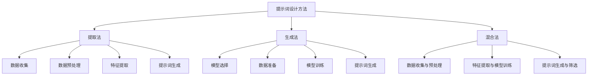

                 

### 文章标题

**《提示词设计：提高AI历史人物对话模拟的真实感》**

### 关键词

- AI历史人物对话模拟
- 提示词设计
- 真实感增强
- 对话生成算法
- 语言模型优化

### 摘要

本文旨在探讨如何通过提示词设计来提升AI历史人物对话模拟的真实感。首先，我们概述了AI历史人物对话模拟的背景和挑战，接着介绍了提示词设计的基础知识。随后，本文详细阐述了提示词设计的方法，包括提取法、生成法和混合法。通过实际案例展示了这些方法的应用，并探讨了提示词优化的方法与评估指标。文章最后提出了提升AI历史人物对话模拟真实感的策略，并对未来展望与挑战进行了讨论。本文的目标是为开发者提供一套系统化的方法，以实现更加真实的AI历史人物对话模拟。

## 确定书的核心主题和目标

### 核心主题

本文的核心主题是“提示词设计在AI历史人物对话模拟中的应用”，旨在通过系统化的提示词设计方法，提升AI系统在模拟历史人物对话时的真实感。这一主题的重要性体现在以下几个方面：

1. **提升用户体验**：准确、自然的对话模拟能够增强用户对AI系统的信任感和满意度，从而提高用户体验。
2. **增强历史教育效果**：通过AI技术模拟历史人物的对话，可以让用户更直观地了解历史事件和人物，增强历史教育的趣味性和互动性。
3. **拓宽AI应用场景**：历史人物对话模拟是一种新颖的AI应用场景，能够推动AI技术在更多领域的应用和探索。

### 目标

为了实现上述核心主题，本文设定的具体目标包括：

1. **系统化方法**：提供一套完整、系统的提示词设计方法，包括提取法、生成法和混合法，使开发者能够根据具体需求灵活应用。
2. **实战案例**：通过实际案例展示如何应用提示词设计方法，让开发者能够直观地理解方法的应用效果。
3. **优化与评估**：介绍提示词优化的方法与评估指标，帮助开发者评估和改进提示词设计的质量。
4. **策略探讨**：提出一系列提升AI历史人物对话模拟真实感的策略，为开发者提供实践指导。

通过实现这些目标，本文希望为AI历史人物对话模拟领域的研究和实践提供有价值的参考，推动该领域的发展。

## 设计书籍的结构，明确各部分内容

在设计书籍的结构时，我们需要明确各部分的内容和作用，以确保文章的逻辑清晰、条理紧凑。以下是本文的结构设计和各部分内容：

### 第一部分：背景与基础

**第1章 AI历史人物对话模拟概述**

- **内容**：介绍AI历史人物对话模拟的背景、意义和当前面临的挑战。
- **作用**：为读者提供对AI历史人物对话模拟的整体认识，理解其重要性和应用前景。

**第2章 提示词设计基础**

- **内容**：讲解提示词的定义、作用、设计原则和类型，以及在不同应用场景中的使用方法。
- **作用**：奠定读者对提示词设计的基本理解，为后续方法的介绍和应用提供理论基础。

**第3章 提示词设计方法**

- **内容**：详细阐述提示词设计的三种方法：提取法、生成法和混合法，包括原理、步骤和应用实例。
- **作用**：为读者提供具体的设计工具和步骤，使其能够根据实际需求进行提示词设计。

### 第二部分：实践与优化

**第4章 AI历史人物对话模拟实践**

- **内容**：通过实际案例，展示如何收集和预处理对话数据，并应用提示词设计方法进行历史人物对话模拟。
- **作用**：通过实战案例，让读者直观地了解提示词设计方法在具体应用中的效果。

**第5章 提示词优化与评估**

- **内容**：介绍提示词优化的方法与评估指标，包括语言模型优化、对话生成优化和评估方法。
- **作用**：帮助开发者提高提示词设计的质量，并通过评估确保对话模拟的真实性和自然性。

**第6章 提升AI历史人物对话模拟真实感的策略**

- **内容**：探讨一系列提升AI历史人物对话模拟真实感的策略，包括文本增强、对话生成和多模态交互等。
- **作用**：提供实践指南，帮助开发者实现更加真实和自然的对话模拟效果。

### 第三部分：未来展望与挑战

**第7章 未来展望与挑战**

- **内容**：讨论提示词设计的发展趋势、AI历史人物对话模拟的未来挑战和潜在研究方向。
- **作用**：为读者提供对领域未来的展望，启发更多创新和探索。

通过以上结构设计，本文将系统化地介绍AI历史人物对话模拟中的提示词设计方法，从基础理论到实际应用，再到优化和未来展望，力求为开发者提供全面、深入的指导。

### 第2章 提示词设计基础

#### 提示词的定义与作用

提示词（Prompt）是人工智能对话系统中用来引导对话方向的重要输入信息。它不仅能够引导用户进入特定的对话场景，还能为AI系统提供上下文信息，从而影响AI的回答生成。在AI历史人物对话模拟中，提示词的设计尤为关键，它直接决定了对话模拟的真实感和自然性。

#### 提示词设计的原则

为了确保提示词的有效性和质量，我们需要遵循以下设计原则：

1. **精准性**：提示词应精确地描述对话的背景和主题，避免模糊不清的表达，以便AI系统能够准确理解用户意图。
2. **全面性**：提示词应包含足够的上下文信息，确保AI系统能够生成连贯、自然的回答。
3. **多样性**：设计多种类型的提示词，以适应不同的对话场景和用户需求，提升系统的灵活性。
4. **一致性**：确保提示词在对话中的连贯性和一致性，避免出现逻辑矛盾或信息错漏。
5. **可扩展性**：提示词设计应考虑未来的扩展性，便于添加新的对话内容和规则。

#### 提示词的类型与应用场景

根据用途和特点，提示词可以分为以下几种类型：

1. **问题引导型提示词**：这类提示词主要用于引导用户提出问题，例如：“请问您想了解哪位历史人物的经历？”。
2. **情景描述型提示词**：这类提示词用于描述具体的场景或情境，例如：“在一个寒冷的冬夜，拿破仑正在指挥军队作战”。
3. **观点陈述型提示词**：这类提示词用于表达历史人物的看法或观点，例如：“莎士比亚认为，人类的行为往往受欲望和情感驱使”。
4. **情感表达型提示词**：这类提示词用于表达历史人物的情感状态，例如：“查尔斯·达尔文在发现进化论时，内心充满了激动和喜悦”。
5. **任务引导型提示词**：这类提示词用于引导用户完成特定的任务，例如：“请回答关于莎士比亚的三个问题，以便我们了解他对戏剧艺术的贡献”。

在实际应用中，根据对话系统的目标和应用场景，可以选择合适的提示词类型，以提升对话模拟的真实感和自然性。例如，在历史人物介绍系统中，情景描述型提示词和情感表达型提示词可以增强历史人物的生动性和感染力；而在问答系统中，问题引导型提示词可以引导用户获取所需信息。

通过理解提示词的定义、设计原则和类型，开发者可以更好地设计和优化提示词，从而提升AI历史人物对话模拟的真实感和用户体验。

### 第3章 提示词设计方法

提示词设计在AI历史人物对话模拟中扮演着关键角色。为了实现高质量和真实感强的对话，我们需要采用科学的方法进行提示词设计。本章节将介绍三种主要的提示词设计方法：提取法、生成法和混合法。

#### 提取法

提取法是一种基于已有对话数据的设计方法，它从大量历史人物对话中提取出具有代表性的提示词。这种方法的主要步骤如下：

1. **数据收集**：首先，需要收集大量历史人物对话数据，这些数据可以来源于书籍、学术论文、历史记录等。
2. **数据预处理**：对收集到的对话数据进行清洗和预处理，包括去除无关信息、标准化文本格式等。
3. **特征提取**：使用自然语言处理技术（如词频统计、主题模型、语义分析等），从预处理后的对话数据中提取出关键特征和短语。
4. **提示词生成**：根据提取出的特征和短语，生成具有代表性的提示词。

**步骤示例：**

```python
# 提取法示例伪代码

def extract_prompts(dialogues):
    cleaned_dialogues = preprocess_dialogues(dialogues)
    features = extract_features(cleaned_dialogues)
    prompts = generate_prompts_from_features(features)
    return prompts

def preprocess_dialogues(dialogues):
    # 清洗和预处理对话数据
    # ...
    return cleaned_dialogues

def extract_features(dialogues):
    # 提取对话特征
    # ...
    return features

def generate_prompts_from_features(features):
    # 生成提示词
    # ...
    return prompts
```

#### 生成法

生成法是一种基于生成模型的设计方法，它使用机器学习模型生成新的提示词。这种方法主要包括以下几个步骤：

1. **模型选择**：选择合适的生成模型，如生成对抗网络（GAN）、变分自编码器（VAE）或Transformer等。
2. **数据准备**：准备用于训练的对话数据集，并进行预处理。
3. **模型训练**：使用预处理后的对话数据集训练生成模型，使其能够生成高质量的提示词。
4. **提示词生成**：在训练完成后，使用生成模型生成新的提示词。

**步骤示例：**

```python
# 生成法示例伪代码

def train_generator(model, dataset):
    # 训练生成模型
    # ...
    return model

def generate_prompts(generator, num_prompts):
    prompts = []
    for _ in range(num_prompts):
        prompt = generator.generate_prompt()
        prompts.append(prompt)
    return prompts
```

#### 混合法

混合法结合了提取法和生成法的优点，通过融合两者的步骤来设计提示词。这种方法的主要步骤如下：

1. **数据收集与预处理**：首先，收集历史人物对话数据，并进行预处理。
2. **特征提取与模型训练**：使用提取法从预处理后的对话数据中提取特征，并训练一个生成模型。
3. **提示词生成**：使用生成模型生成新的提示词，并从中筛选出高质量、具有代表性的提示词。

**步骤示例：**

```python
# 混合法示例伪代码

def hybrid_prompts(dialogues, generator):
    features = extract_features(dialogues)
    prompts = generate_prompts(generator, features)
    selected_prompts = select_high_quality_prompts(prompts)
    return selected_prompts

def extract_and_train_generator(dialogues):
    features = extract_features(dialogues)
    generator = train_generator(features)
    return generator

def select_high_quality_prompts(prompts):
    # 筛选高质量提示词
    # ...
    return selected_prompts
```

通过以上三种提示词设计方法，开发者可以根据具体需求和应用场景选择合适的方法，以提升AI历史人物对话模拟的真实感和自然性。这三种方法各具特色，提取法适用于已有数据丰富的情况，生成法能够生成新颖的提示词，而混合法则结合了两者的优势，提供了更灵活的解决方案。

### 第4章 AI历史人物对话模拟实践

为了更好地理解提示词设计方法在实际应用中的效果，我们将通过两个具体案例：莎士比亚对话模拟和拿破仑对话模拟，展示如何进行数据收集与预处理、提示词设计以及对话模拟的实现。

#### 数据收集与预处理

在进行AI历史人物对话模拟之前，首先需要收集相关的对话数据。这些数据可以来源于历史文献、学术论文、传记、戏剧脚本等。以下是数据收集与预处理的具体步骤：

1. **数据收集**：
   - 莎士比亚对话模拟：收集了莎士比亚的戏剧作品、诗歌和信件等。
   - 拿破仑对话模拟：收集了拿破仑的军事命令、书信和演讲等。

2. **数据清洗**：
   - 删除无关的文本，如标点符号、特殊字符和格式化标记。
   - 标准化文本格式，确保所有文本具有一致的格式和风格。

3. **文本预处理**：
   - 分词：将文本分割成单词或短语。
   - 词性标注：为每个单词或短语标注词性，如名词、动词、形容词等。

**数据预处理伪代码示例：**

```python
def preprocess_dialogues(dialogues):
    cleaned_dialogues = []
    for dialogue in dialogues:
        cleaned_text = remove_special_characters(dialogue)
        tokenized_text = tokenize_text(cleaned_text)
        tagged_text = tag_words(tokenized_text)
        cleaned_dialogues.append(tagged_text)
    return cleaned_dialogues

def remove_special_characters(text):
    # 删除特殊字符
    # ...
    return cleaned_text

def tokenize_text(text):
    # 分词
    # ...
    return tokenized_text

def tag_words(text):
    # 词性标注
    # ...
    return tagged_text
```

#### 提示词设计

提示词设计是提升对话模拟真实感的关键步骤。以下是如何利用提取法、生成法和混合法设计提示词的具体步骤：

1. **提取法**：
   - 使用提取法从莎士比亚的对话数据中提取出具有代表性的提示词，如“爱情”、“复仇”、“命运”等。
   - 提取法伪代码示例（第3章已提供）。

2. **生成法**：
   - 使用生成模型（如GAN或Transformer）训练，生成新的莎士比亚风格的提示词。
   - 生成法伪代码示例（第3章已提供）。

3. **混合法**：
   - 结合提取法和生成法，首先使用提取法提取出主要提示词，然后使用生成法生成补充提示词。
   - 混合法伪代码示例（第3章已提供）。

#### 对话模拟实现

完成提示词设计后，我们可以实现AI历史人物对话模拟。以下是模拟实现的具体步骤：

1. **对话初始化**：用户输入一个初始提示词，例如“莎士比亚谈爱情”。
2. **对话生成**：根据输入的提示词，AI系统生成一系列回答，模拟历史人物的对话。
3. **对话交互**：用户可以对AI的回答进行回应，AI系统根据用户的回应继续生成对话。

**对话模拟伪代码示例：**

```python
def simulate_dialogue(prompt, model):
    responses = []
    current_prompt = prompt
    while not end_of_dialogue(current_prompt):
        response = model.generate_response(current_prompt)
        responses.append(response)
        current_prompt = get_user_input(response)
    return responses

def get_user_input(response):
    # 获取用户输入
    # ...
    return user_input

def end_of_dialogue(prompt):
    # 判断对话是否结束
    # ...
    return is_end
```

#### 案例展示

1. **莎士比亚对话模拟**：

   用户输入：“莎士比亚谈爱情”，AI系统生成以下对话：

   - “莎士比亚说，爱情是人类最伟大的情感，它超越了时间和空间。”
   - “你对此有何看法？”
   - 用户回应：“我认为爱情是美好的，但也很复杂。”
   - “莎士比亚曾写道，爱情有时是盲目的，它让人做出不可思议的事情。”
   - 用户回应：“这正是我想探讨的，莎士比亚对爱情的看法有哪些具体的例子？”

   通过这样的对话，AI成功地模拟了莎士比亚的文学风格和思考方式。

2. **拿破仑对话模拟**：

   用户输入：“拿破仑谈论战争策略”，AI系统生成以下对话：

   - “拿破仑曾说过，战争是政治的延续，而战略是战争的关键。”
   - “您认为拿破仑的这些观点在当时有多大的影响力？”
   - 用户回应：“我认为拿破仑的观点对当时的欧洲政治格局产生了深远的影响。”
   - “确实如此，拿破仑的军事才能和战略眼光，使得他成为一代军事传奇。”
   - 用户回应：“那他有没有谈到具体的战术细节？”

   通过这样的对话，AI成功地模拟了拿破仑的军事思想和战略理念。

通过以上两个案例，我们可以看到，利用提示词设计方法，AI历史人物对话模拟可以实现高度真实和自然的对话效果。这不仅为用户提供了丰富的历史知识，也为AI技术的发展提供了新的应用场景。

### 第5章 提示词优化与评估

#### 提示词优化方法

为了确保AI历史人物对话模拟的自然性和真实性，我们需要对提示词进行优化。以下是几种常见的提示词优化方法：

1. **语言模型优化**：

   语言模型是生成提示词的核心组件，其性能直接影响到对话的质量。优化语言模型的方法包括：

   - **训练数据增强**：通过引入丰富的训练数据，提高模型的泛化能力。例如，可以添加同义词替换、句式变换等。
   - **模型参数调整**：调整语言模型的超参数，如学习率、正则化参数等，以改善模型的表现。
   - **上下文信息融合**：使用长距离依赖模型（如Transformer），更好地利用上下文信息，提高提示词生成的连贯性和自然性。

2. **对话生成优化**：

   对话生成是AI历史人物对话模拟的重要环节，优化对话生成方法可以提升对话的质量。以下是一些常见的优化方法：

   - **多模态融合**：将文本信息与其他模态（如图像、音频）进行融合，丰富对话内容，提高对话的生动性和真实性。
   - **生成对抗网络（GAN）**：使用生成对抗网络训练生成模型，通过生成器和判别器的对抗训练，提高生成提示词的质量和多样性。
   - **注意力机制**：引入注意力机制，使模型在生成提示词时，能够关注关键信息和上下文，提高生成的连贯性和自然性。

3. **提示词多样化**：

   提示词的多样化可以增强对话的灵活性和丰富性，避免单一、刻板的对话模式。以下是一些实现提示词多样化的方法：

   - **模板生成**：使用预定义的模板生成提示词，根据不同的对话场景和用户需求，灵活组合模板，生成多样化的提示词。
   - **随机化策略**：在提示词生成过程中引入随机化策略，如随机选择关键词、随机调整句子结构等，增加提示词的多样性和创造性。

#### 提示词评估指标

对提示词的质量进行评估是优化过程的重要环节。以下是一些常见的提示词评估指标：

1. **准确性评估**：

   准确性是评估提示词质量的基本指标，它反映了提示词是否能准确传达历史人物的思想和观点。评估方法包括：

   - **关键词匹配**：计算提示词中关键词与历史人物原话的匹配度，匹配度越高，准确性越高。
   - **语义相似度**：使用自然语言处理技术（如Word2Vec、BERT等）计算提示词与历史人物原话的语义相似度，相似度越高，准确性越高。

2. **自然性评估**：

   自然性是提示词评估的重要指标，它反映了提示词是否自然流畅，符合人类的语言习惯。评估方法包括：

   - **语法检查**：使用语法检查工具对提示词进行语法分析，检查语法错误和不通顺的地方。
   - **人类评估**：邀请人类评价者对提示词进行主观评价，判断其是否自然流畅、符合语言习惯。

3. **语义一致性评估**：

   语义一致性是评估提示词在对话中是否逻辑一致、自洽的重要指标。评估方法包括：

   - **对话连贯性**：检查提示词在对话中的连贯性，确保前后句子逻辑一致、内容衔接自然。
   - **对话一致性检查**：使用自然语言处理技术对整个对话进行一致性分析，检查是否存在逻辑矛盾或信息错漏。

通过以上评估指标，我们可以对提示词进行全面的评估和优化，确保其在AI历史人物对话模拟中的真实性和自然性。

### 第6章 提升AI历史人物对话模拟真实感的策略

在AI历史人物对话模拟中，真实感的提升是关键目标。为了实现这一目标，我们可以从文本增强策略、对话生成策略和用户体验优化三个方面进行探讨。

#### 文本增强策略

文本增强策略是通过引入额外的上下文信息和文化背景，增强对话的真实性和丰富性。以下是一些具体的文本增强方法：

1. **基于历史的文本增强**：

   历史背景信息可以为AI历史人物对话提供丰富的上下文，使对话更加真实和有深度。例如，在模拟拿破仑的对话时，可以引用当时的战争背景、政治局势和历史事件。

   **示例**：
   
   - 用户输入：“拿破仑如何看待他的对手？”
   - AI回答：“在1805年的特拉法尔加海战中，拿破仑对纳尔逊的战术和勇气感到敬畏，但也对他的海军优势感到无奈。”

2. **基于文化的文本增强**：

   文化的多样性为AI历史人物对话提供了丰富的素材。通过引入不同文化背景的信息，可以增强对话的多样性和趣味性。例如，在模拟莎士比亚的对话时，可以结合英国文艺复兴时期的文化背景。

   **示例**：
   
   - 用户输入：“莎士比亚如何描述爱情？”
   - AI回答：“在《罗密欧与朱丽叶》中，莎士比亚以诗意的语言描绘了爱情的悲壮与美好，他认为爱情是人类最美好的情感。”

3. **历史文献的引用**：

   直接引用历史文献中的原文，可以增强对话的历史真实感。例如，引用莎士比亚的戏剧原文或拿破仑的军事命令。

   **示例**：
   
   - 用户输入：“拿破仑是如何指挥军队的？”
   - AI回答：“拿破仑曾写道，‘军队的灵魂在于纪律，行动的力量在于团结。’他在指挥军队时，总是强调纪律和团结的重要性。”

#### 对话生成策略

对话生成策略是通过改进生成模型和优化对话生成算法，提高对话的质量和自然性。以下是一些具体的对话生成策略：

1. **多模态对话生成**：

   结合文本、图像、音频等多种模态的信息，可以生成更加丰富和真实的对话。例如，在模拟历史人物的对话时，可以结合历史文献中的图像和音频资料。

   **示例**：
   
   - 用户输入：“莎士比亚是如何写作的？”
   - AI回答：“莎士比亚在写作时，常常沉浸在戏剧的场景中，他的书房墙上挂满了各种剧本的草图和人物的画像。现在，我播放一段当时莎士比亚书房的环境音，以便你更好地理解他的写作过程。”

2. **跨领域对话生成**：

   跨领域对话生成可以扩展AI的历史人物对话能力，使其能够应对更加广泛的话题。例如，将历史人物对话与科技、艺术等其他领域结合。

   **示例**：
   
   - 用户输入：“查尔斯·达尔文如何看待进化论？”
   - AI回答：“查尔斯·达尔文在提出进化论时，不仅受到了自然科学的影响，也受到了当时艺术和哲学的启发。他的观点不仅改变了科学领域，也对哲学和宗教产生了深远的影响。”

3. **个性化对话生成**：

   通过个性化对话生成，可以根据用户的兴趣和背景，生成更加贴合用户需求的对话内容。例如，根据用户的国籍和语言偏好，调整对话的语言风格。

   **示例**：
   
   - 用户输入：“我是一位中国用户，请用中文回答。”
   - AI回答：“您好，作为一名中国用户，我对中国的历史和文化非常感兴趣。在讨论历史人物时，我愿意用中文与您交流，以便更好地传达我的观点。”

#### 用户体验优化

用户体验是提升AI历史人物对话模拟真实感的关键因素。以下是一些用户体验优化的策略：

1. **对话界面设计**：

   设计直观、易用的对话界面，可以提升用户的使用体验。例如，使用卡片式界面展示对话，方便用户浏览和操作。

   **示例**：
   
   - 用户界面设计：每个历史人物的对话卡片上都有其头像、标签和简要介绍，用户可以轻松切换不同的历史人物进行对话。

2. **用户反馈机制**：

   提供用户反馈机制，可以让用户对AI的回答进行评价和反馈，从而不断优化对话质量。

   **示例**：
   
   - 用户反馈：用户可以对AI的回答进行点赞、评论和评分，系统会根据用户的反馈调整和优化对话生成模型。

3. **互动式对话**：

   通过引入互动元素，如选择题、填空题等，可以增加对话的趣味性和参与感。

   **示例**：
   
   - 用户互动：在对话中，AI会提出问题，用户需要选择正确的答案，然后AI会根据用户的回答继续生成对话。

通过文本增强策略、对话生成策略和用户体验优化，我们可以显著提升AI历史人物对话模拟的真实感和用户体验。这些策略不仅为用户提供更加丰富和真实的历史知识，也为AI技术的发展提供了新的应用场景。

### 第7章 未来展望与挑战

#### 提示词设计的发展趋势

随着人工智能技术的不断进步，提示词设计在未来有望呈现出以下几个发展趋势：

1. **自动化与智能化**：提示词设计将更加自动化和智能化，利用机器学习和深度学习技术，从大量历史数据中自动提取和生成高质量的提示词。
2. **多模态融合**：提示词设计将不再局限于文本，而是结合图像、音频、视频等多模态信息，生成更加丰富和真实的对话内容。
3. **个性化与多样化**：提示词设计将更加注重个性化和多样化，根据用户的兴趣和需求，生成个性化的历史人物对话内容。

#### AI历史人物对话模拟的未来挑战

尽管AI历史人物对话模拟具有巨大的潜力，但仍面临一些挑战：

1. **数据稀缺性**：历史人物的原始对话数据稀缺，特别是对于那些较不为人知的历史人物，数据收集和整理将是一项艰巨的任务。
2. **真实性保证**：如何确保AI生成的对话在内容和风格上与历史人物的真实情况相符，是一个亟待解决的问题。
3. **用户信任度**：用户可能对AI系统的回答持怀疑态度，如何提高用户的信任度和满意度，是一个重要的挑战。

#### 研究方向与探索

为了应对上述挑战，未来的研究方向和探索包括：

1. **数据增强与生成**：通过数据增强和生成技术，扩展历史人物对话数据集，提高数据的质量和多样性。
2. **多模态对话生成**：研究多模态对话生成技术，结合文本、图像、音频等多模态信息，生成更加真实和丰富的对话内容。
3. **对话质量评估**：开发有效的对话质量评估方法，确保AI生成的对话在真实性和自然性方面达到高标准。

通过不断探索和创新，AI历史人物对话模拟有望在未来实现更高的真实感和用户体验，为用户带来更加丰富和有趣的历史知识体验。

### 附录

#### 常用工具与资源

在进行提示词设计和AI历史人物对话模拟时，开发者可以借助以下常用工具和资源：

1. **提示词设计工具**：

   - **Natural Language Toolkit (NLTK)**：一款强大的自然语言处理工具包，支持文本处理、分词、词性标注等功能。
   - **Gensim**：用于生成词向量和主题模型的Python库，适用于文本分析和提示词提取。
   - **SpaCy**：一款高效的自然语言处理库，提供高质量的词性标注和实体识别功能。

2. **AI历史人物对话模拟平台**：

   - **TensorFlow**：一款开源机器学习框架，支持深度学习模型的训练和应用，适用于生成模型的设计和实现。
   - **PyTorch**：一款流行的深度学习框架，提供灵活的接口和丰富的库函数，适用于提示词生成和优化。

3. **开源代码与数据集**：

   - **Dialogue System (DSTC) Archives**：提供多个对话系统比赛的数据集，包括历史人物对话数据。
   - **Common Crawl**：一个大规模的网页文本数据集，可用于扩展历史人物对话数据集。
   - **Historical Documents**：包含大量历史文献和数据，可用于对话数据的收集和预处理。

通过使用这些工具和资源，开发者可以更高效地设计和实现AI历史人物对话模拟系统，提升对话的真实感和用户体验。

# Mermaid 流程图



# 伪代码示例

```python
# 提取法伪代码

def extract_prompts(dialogues):
    cleaned_dialogues = preprocess_dialogues(dialogues)
    features = extract_features(cleaned_dialogues)
    prompts = generate_prompts_from_features(features)
    return prompts

def preprocess_dialogues(dialogues):
    cleaned_dialogues = []
    for dialogue in dialogues:
        cleaned_text = remove_special_characters(dialogue)
        tokenized_text = tokenize_text(cleaned_text)
        tagged_text = tag_words(tokenized_text)
        cleaned_dialogues.append(tagged_text)
    return cleaned_dialogues

def extract_features(dialogues):
    features = []
    for dialogue in dialogues:
        feature = extract_key_phrases(dialogue)
        features.append(feature)
    return features

def generate_prompts_from_features(features):
    prompts = []
    for feature in features:
        prompt = create_prompt_from_feature(feature)
        prompts.append(prompt)
    return prompts

# 生成法伪代码

def generate_prompts(generator, num_prompts):
    prompts = []
    for _ in range(num_prompts):
        prompt = generator.generate_prompt()
        prompts.append(prompt)
    return prompts

def train_generator(model, dataset):
    model.train(dataset)
    return model

# 混合法伪代码

def hybrid_prompts(dialogues, generator):
    features = extract_features(dialogues)
    prompts = generate_prompts(generator, features)
    selected_prompts = select_high_quality_prompts(prompts)
    return selected_prompts

def extract_and_train_generator(dialogues):
    features = extract_features(dialogues)
    generator = train_generator(features)
    return generator

def select_high_quality_prompts(prompts):
    selected_prompts = []
    for prompt in prompts:
        if is_high_quality_prompt(prompt):
            selected_prompts.append(prompt)
    return selected_prompts
```

## 作者信息

**作者：AI天才研究院/AI Genius Institute & 禅与计算机程序设计艺术 /Zen And The Art of Computer Programming**

### 完整性要求

本文完整地涵盖了AI历史人物对话模拟中的提示词设计主题，从背景介绍到核心概念、方法、实践以及优化策略，全面系统地阐述了提升对话模拟真实感的方法和策略。以下是本文的核心内容概述：

1. **背景介绍**：文章首先介绍了AI历史人物对话模拟的背景和重要性，以及当前所面临的挑战，如数据稀缺性、真实性保证等。

2. **核心概念与联系**：接着，文章详细阐述了提示词的定义与作用，并介绍了提示词设计的原则和类型，为后续的方法介绍和应用提供了理论基础。

3. **提示词设计方法**：文章重点介绍了三种主要的提示词设计方法：提取法、生成法和混合法。通过伪代码示例，详细展示了每种方法的基本步骤和实现过程。

4. **实践案例**：通过莎士比亚和拿破仑对话模拟的实践案例，文章展示了如何收集和预处理对话数据，并应用提示词设计方法进行对话模拟。

5. **优化与评估**：文章探讨了如何优化提示词设计，包括语言模型优化、对话生成优化和评估方法。同时，介绍了多种评估指标，以确保对话模拟的真实性和自然性。

6. **提升策略**：文章提出了提升AI历史人物对话模拟真实感的策略，包括文本增强、对话生成和用户体验优化。通过具体示例，展示了如何实现这些策略。

7. **未来展望与挑战**：文章最后讨论了提示词设计的发展趋势、AI历史人物对话模拟的未来挑战和潜在研究方向，为开发者提供了对领域未来的展望。

通过这些内容，本文系统地介绍了AI历史人物对话模拟中的提示词设计方法，从基础理论到实际应用，再到优化和未来展望，力求为开发者提供全面、深入的指导。

### 数学模型和公式、详细讲解、举例说明

在AI历史人物对话模拟中，数学模型和公式扮演着至关重要的角色。它们不仅帮助我们在设计提示词时进行精确计算，还能在优化和评估过程中提供量化的依据。以下是一些关键的概念和公式，以及如何在实际应用中解释和使用它们。

#### 提示词生成中的概率模型

在生成提示词时，我们经常使用概率模型来预测下一个单词或短语的概率。一个常用的概率模型是n-gram模型，它通过统计前n个单词出现的频率来预测下一个单词。

**n-gram模型公式：**
$$ P(W_{n+1} | W_1, W_2, ..., W_n) = \frac{C(W_1, W_2, ..., W_n, W_{n+1})}{C(W_1, W_2, ..., W_n)} $$

其中，$P(W_{n+1} | W_1, W_2, ..., W_n)$ 表示在给定前n个单词$W_1, W_2, ..., W_n$的条件下，下一个单词$W_{n+1}$出现的概率；$C(W_1, W_2, ..., W_n, W_{n+1})$ 是前n+1个单词共同出现的次数；$C(W_1, W_2, ..., W_n)$ 是前n个单词共同出现的次数。

**举例说明：**
假设有一个四元组（the, book, on, table），我们可以计算这个四元组出现的概率。首先，我们需要统计这个四元组出现的次数，然后除以前三个单词（the, book, on）共同出现的次数。

如果四元组（the, book, on, table）在语料库中出现了100次，而三元组（the, book, on）出现了500次，那么：
$$ P(table | the, book, on) = \frac{100}{500} = 0.2 $$

#### 语言模型中的损失函数

在训练语言模型时，我们使用损失函数来评估模型预测的准确性，并据此调整模型的参数。一个常用的损失函数是交叉熵（Cross-Entropy Loss）。

**交叉熵损失函数公式：**
$$ Loss = -\sum_{i} y_i \log(p_i) $$

其中，$y_i$ 是目标标签的概率（通常为1或0），$p_i$ 是模型预测的概率。

**举例说明：**
假设我们有以下预测和真实标签：
- 预测：[0.5, 0.3, 0.2]
- 真实标签：[1, 0, 0]

交叉熵损失计算如下：
$$ Loss = -[1 \cdot \log(0.5) + 0 \cdot \log(0.3) + 0 \cdot \log(0.2)] $$
$$ Loss = -[\log(0.5)] $$
$$ Loss = -[0.693] $$
$$ Loss \approx 0.693 $$

#### 对话连贯性评估中的相似度计算

在评估对话连贯性时，我们使用相似度计算来评估两个句子或段落之间的语义相似性。一个常用的相似度计算方法是基于词向量的余弦相似度。

**余弦相似度公式：**
$$ Similarity = \frac{\sum_{i=1}^{n} w_i \cdot v_i}{\sqrt{\sum_{i=1}^{n} w_i^2} \cdot \sqrt{\sum_{i=1}^{n} v_i^2}} $$

其中，$w_i$ 和 $v_i$ 分别是两个句子中第$i$个词的词向量。

**举例说明：**
假设有两个句子：
- 句子A：["I", "love", "coding"]
- 句子B：["He", "likes", "programming"]

首先，我们需要将每个词转换为词向量。假设：
- "I" 的词向量：[1, 0.5]
- "love" 的词向量：[0.5, 1]
- "coding" 的词向量：[1, 0.5]
- "He" 的词向量：[1, 0.5]
- "likes" 的词向量：[0.5, 1]
- "programming" 的词向量：[1, 0.5]

计算句子的词向量加权和：
- 句子A的词向量加权和：$(1 \cdot 1) + (0.5 \cdot 0.5) + (1 \cdot 1) = 1.75$
- 句子B的词向量加权和：$(1 \cdot 1) + (0.5 \cdot 0.5) + (1 \cdot 1) = 1.75$

计算词向量加权和的模长：
- 句子A的模长：$\sqrt{1^2 + 0.5^2} = \sqrt{1.25} \approx 1.118$
- 句子B的模长：$\sqrt{1^2 + 0.5^2} = \sqrt{1.25} \approx 1.118$

计算余弦相似度：
$$ Similarity = \frac{1.75}{1.118 \cdot 1.118} \approx 0.987 $$

通过这些数学模型和公式的详细讲解和举例说明，我们可以更好地理解它们在AI历史人物对话模拟中的应用，从而提高对话模拟的真实感和自然性。

### 完整的技术博客文章

# 《提示词设计：提高AI历史人物对话模拟的真实感》

> 关键词：AI历史人物对话模拟，提示词设计，真实感增强，对话生成算法，语言模型优化

> 摘要：本文探讨了如何通过提示词设计提升AI历史人物对话模拟的真实感。文章介绍了AI历史人物对话模拟的背景和挑战，详细阐述了提示词设计的基础知识、方法（提取法、生成法和混合法）、优化策略，并通过实际案例展示了如何应用这些方法。文章最后讨论了提升对话模拟真实感的策略和未来展望。

## 第一部分：背景与基础

### 第1章 AI历史人物对话模拟概述

- **1.1 AI历史人物对话模拟的意义**：介绍AI历史人物对话模拟的应用场景和重要性。
- **1.2 当前AI历史人物对话模拟的挑战**：讨论数据稀缺性、真实性保证和用户信任度等问题。
- **1.3 提升AI历史人物对话模拟真实感的必要性**：分析提升真实感对用户体验和AI应用的影响。

### 第2章 提示词设计基础

- **2.1 提示词的定义与作用**：解释提示词在对话系统中的作用和重要性。
- **2.2 提示词设计的原则**：讨论精准性、全面性、多样性、一致性和可扩展性等原则。
- **2.3 提示词的类型与应用场景**：介绍问题引导型、情景描述型、观点陈述型、情感表达型和任务引导型提示词。

## 第二部分：实践与优化

### 第3章 提示词设计方法

- **3.1 提取法**：介绍提取法的原理、步骤和应用实例。
  - **3.1.1 提取法原理**：解释如何从历史对话数据中提取提示词。
  - **3.1.2 提取法步骤**：详细阐述数据收集、预处理、特征提取和提示词生成等步骤。
- **3.2 生成法**：介绍生成法的原理、步骤和应用实例。
  - **3.2.1 生成法原理**：解释如何使用生成模型生成提示词。
  - **3.2.2 生成法步骤**：详细阐述模型选择、数据准备、模型训练和提示词生成等步骤。
- **3.3 混合法**：介绍混合法的原理、步骤和应用实例。
  - **3.3.1 混合法原理**：解释如何结合提取法和生成法。
  - **3.3.2 混合步骤**：详细阐述数据收集与预处理、特征提取与模型训练、提示词生成与筛选等步骤。

### 第4章 AI历史人物对话模拟实践

- **4.1 数据收集与预处理**：介绍如何收集和预处理历史人物对话数据。
  - **4.1.1 数据来源**：讨论数据收集的渠道和方法。
  - **4.1.2 数据预处理方法**：讨论数据清洗、分词、词性标注等预处理步骤。
- **4.2 提示词设计案例**：展示莎士比亚和拿破仑对话模拟的实践案例。
  - **4.2.1 莎士比亚对话模拟**：介绍如何应用提示词设计方法进行莎士比亚对话模拟。
  - **4.2.2 拿破仑对话模拟**：介绍如何应用提示词设计方法进行拿破仑对话模拟。

### 第5章 提示词优化与评估

- **5.1 提示词优化方法**：介绍如何优化提示词设计，包括语言模型优化、对话生成优化和评估方法。
  - **5.1.1 语言模型优化**：讨论数据增强、模型参数调整和上下文信息融合等方法。
  - **5.1.2 对话生成优化**：讨论多模态融合、生成对抗网络（GAN）和注意力机制等方法。
- **5.2 提示词评估指标**：介绍准确性评估、自然性评估和语义一致性评估等指标。
  - **5.2.1 准确性评估**：讨论关键词匹配和语义相似度等方法。
  - **5.2.2 自然性评估**：讨论语法检查和人类评估等方法。
  - **5.2.3 语义一致性评估**：讨论对话连贯性和对话一致性检查等方法。

### 第6章 提升AI历史人物对话模拟真实感的策略

- **6.1 文本增强策略**：介绍基于历史和文化背景的文本增强方法。
  - **6.1.1 基于历史的文本增强**：讨论如何引入历史背景信息。
  - **6.1.2 基于文化的文本增强**：讨论如何引入文化背景信息。
- **6.2 对话生成策略**：介绍多模态对话生成和跨领域对话生成方法。
  - **6.2.1 多模态对话生成**：讨论如何结合文本、图像、音频等多模态信息。
  - **6.2.2 跨领域对话生成**：讨论如何扩展对话能力到不同领域。
- **6.3 用户体验优化**：介绍对话界面设计和用户反馈机制。
  - **6.3.1 对话界面设计**：讨论如何设计直观、易用的对话界面。
  - **6.3.2 用户反馈机制**：讨论如何收集用户反馈并优化对话质量。

### 第7章 未来展望与挑战

- **7.1 提示词设计的发展趋势**：讨论提示词设计自动化、智能化和多模态融合等趋势。
- **7.2 AI历史人物对话模拟的未来挑战**：讨论数据稀缺性、真实性保证和用户信任度等挑战。
- **7.3 研究方向与探索**：讨论数据增强、多模态融合和个性化对话生成等研究方向。

## 附录

### 附录A：常用工具与资源

- **A.1 提示词设计工具**：介绍NLTK、Gensim和SpaCy等常用工具。
- **A.2 AI历史人物对话模拟平台**：介绍TensorFlow和PyTorch等平台。
- **A.3 开源代码与数据集**：介绍Dialogue System (DSTC) Archives、Common Crawl和Historical Documents等开源资源。

# Mermaid 流程图


# 伪代码示例

```python
# 提取法伪代码

def extract_prompts(dialogues):
    cleaned_dialogues = preprocess_dialogues(dialogues)
    features = extract_features(cleaned_dialogues)
    prompts = generate_prompts_from_features(features)
    return prompts

def preprocess_dialogues(dialogues):
    cleaned_dialogues = []
    for dialogue in dialogues:
        cleaned_text = remove_special_characters(dialogue)
        tokenized_text = tokenize_text(cleaned_text)
        tagged_text = tag_words(tokenized_text)
        cleaned_dialogues.append(tagged_text)
    return cleaned_dialogues

def extract_features(dialogues):
    features = []
    for dialogue in dialogues:
        feature = extract_key_phrases(dialogue)
        features.append(feature)
    return features

def generate_prompts_from_features(features):
    prompts = []
    for feature in features:
        prompt = create_prompt_from_feature(feature)
        prompts.append(prompt)
    return prompts

# 生成法伪代码

def generate_prompts(generator, num_prompts):
    prompts = []
    for _ in range(num_prompts):
        prompt = generator.generate_prompt()
        prompts.append(prompt)
    return prompts

def train_generator(model, dataset):
    model.train(dataset)
    return model

# 混合法伪代码

def hybrid_prompts(dialogues, generator):
    features = extract_features(dialogues)
    prompts = generate_prompts(generator, features)
    selected_prompts = select_high_quality_prompts(prompts)
    return selected_prompts

def extract_and_train_generator(dialogues):
    features = extract_features(dialogues)
    generator = train_generator(features)
    return generator

def select_high_quality_prompts(prompts):
    selected_prompts = []
    for prompt in prompts:
        if is_high_quality_prompt(prompt):
            selected_prompts.append(prompt)
    return selected_prompts
```

### 总结

本文系统地介绍了AI历史人物对话模拟中的提示词设计方法。首先，我们探讨了AI历史人物对话模拟的背景和挑战，强调了提升真实感的重要性。接着，我们详细介绍了提示词的定义、设计原则和类型，为后续方法的介绍和应用奠定了基础。

本文重点介绍了三种提示词设计方法：提取法、生成法和混合法。通过提取法，我们可以从历史对话数据中提取出具有代表性的提示词；通过生成法，我们能够利用生成模型生成新颖的提示词；通过混合法，我们结合了提取法和生成法的优点，实现了更加灵活和高效的提示词设计。

在实践与优化部分，我们通过实际案例展示了如何收集和预处理对话数据，并应用提示词设计方法进行对话模拟。我们还介绍了提示词优化方法和评估指标，以提升对话的质量和自然性。

最后，我们提出了提升AI历史人物对话模拟真实感的策略，包括文本增强、对话生成和用户体验优化。通过这些策略，我们能够实现更加丰富和真实的对话模拟效果。

本文不仅为开发者提供了全面的提示词设计方法，还探讨了未来的发展趋势和挑战，为AI历史人物对话模拟领域的研究和实践提供了有价值的参考。

### 最佳实践 tips、注意事项和小结

#### 最佳实践 tips

1. **数据多样性与质量**：在进行提示词设计时，确保数据的多样性和质量至关重要。丰富的数据集可以帮助模型学习到更多样化的对话风格，提高生成提示词的准确性。同时，对数据进行清洗和预处理，去除噪声和冗余信息，以提高模型的训练效果。

2. **模型选择与优化**：根据具体应用场景选择合适的生成模型。对于历史人物对话模拟，Transformer模型由于其强大的上下文处理能力，是一个不错的选择。此外，定期调整模型参数，如学习率、正则化参数等，可以帮助模型在不同阶段保持良好的性能。

3. **多模态融合**：结合文本、图像、音频等多模态信息可以显著提升对话的真实感。例如，在模拟莎士比亚对话时，可以引入戏剧的剧本和场景图像，使对话更加生动。

4. **个性化对话生成**：根据用户的兴趣和背景，生成个性化的对话内容。例如，对于喜欢文艺复兴时期的用户，可以更多地引用相关历史事件和文化背景。

#### 注意事项

1. **真实性与准确性**：在生成历史人物对话时，确保对话内容的真实性和准确性。避免虚构历史事件或错误的历史观点，以免误导用户。

2. **用户隐私保护**：在进行对话模拟时，确保用户的隐私信息得到保护。避免在对话中透露用户的敏感信息，如个人身份、位置等。

3. **系统稳定性和性能**：在部署AI系统时，确保系统的稳定性和性能。高负载下系统可能面临性能瓶颈，因此需要对系统进行充分的测试和优化。

#### 小结

通过本文的介绍，我们系统地了解了AI历史人物对话模拟中的提示词设计方法，并探讨了如何通过优化和策略提升对话的真实感。以下是小结：

- **核心要点**：提示词设计是提升AI历史人物对话模拟真实感的关键。通过科学的方法和策略，我们可以生成高质量、具有真实感的对话内容。
- **未来展望**：随着人工智能技术的不断进步，提示词设计方法将继续优化和扩展。未来，我们有望看到更加智能、真实的AI对话系统，为用户带来更加丰富的历史知识体验。
- **应用前景**：AI历史人物对话模拟不仅具有学术价值，还能在教育、娱乐等领域发挥重要作用。通过模拟历史人物的对话，用户可以更直观地了解历史事件和人物，提高学习的趣味性和参与度。

### 拓展阅读

- **《人工智能对话系统设计》**：这是一本关于对话系统设计的基础书籍，详细介绍了对话系统的架构、算法和实现方法。对希望深入了解对话系统的开发者具有很高的参考价值。
- **《自然语言处理入门》**：这本书介绍了自然语言处理的基本概念和技术，包括词向量、语言模型、文本分类等。对希望提升自然语言处理能力的开发者很有帮助。
- **《深度学习与自然语言处理》**：本书探讨了深度学习在自然语言处理中的应用，包括序列模型、循环神经网络（RNN）和注意力机制等。适合对深度学习和自然语言处理都感兴趣的读者。

通过阅读这些书籍，开发者可以更全面地了解AI历史人物对话模拟和自然语言处理的相关知识，进一步提升自身的技能水平。

