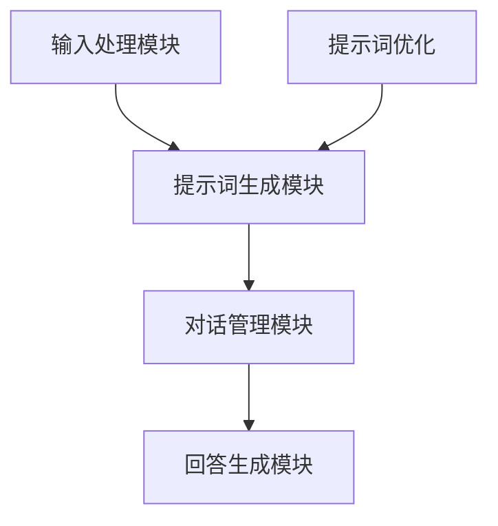

                 

当然可以，以下是根据您的要求设计的文章：

# 《提示词设计：构建智能AIGC对话系统的基石》

## 关键词

- 提示词设计
- 智能AIGC对话系统
- 核心概念
- 算法原理
- 数学模型
- 项目实战

## 摘要

本文深入探讨了提示词设计在构建智能AIGC（AI-Generated Content）对话系统中的关键作用。文章首先介绍了提示词设计的基本概念和背景，随后详细阐述了核心概念之间的联系，并使用了Mermaid流程图展示了这些概念的关系架构。接着，文章通过伪代码详细讲解了提示词生成的算法原理，并运用latex格式给出了数学模型和公式的详细讲解及举例。文章还包含了一个实际项目实战案例，详细解析了开发环境搭建、源代码实现、代码解读、应用解读与分析等内容。最后，文章总结了最佳实践、注意事项和拓展阅读，为读者提供了全面的提示词设计知识和技能。

## 引言

在当今人工智能快速发展的时代，智能对话系统成为了众多领域的关键应用，从客服机器人到智能助手，无不体现出对话系统的广泛应用。而提示词设计作为构建智能AIGC对话系统的基石，其重要性不言而喻。本文旨在为读者提供一个全面、系统的提示词设计教程，帮助读者深入了解并掌握这一关键技术。

## 第1章 提示词设计的基本概念

### 1.1 背景介绍

提示词（Prompt）在对话系统中起到了引导对话方向的关键作用。简单来说，提示词是用户与系统交互的起点，它能够激发系统产生相应的回答。在传统的对话系统中，提示词通常是由用户直接输入的，而在智能AIGC对话系统中，提示词则可以通过算法自动生成。

### 1.2 提示词的定义

提示词是一个触发对话的引导性语句或短语，它可以包含关键词、问题、陈述等，用于引导对话系统的回答方向。一个好的提示词应该具备以下特点：

- **明确性**：能够清晰传达用户的意图。
- **相关性**：与用户的历史对话内容相关联。
- **灵活性**：能够适应不同的对话场景和用户需求。

### 1.3 提示词在AIGC对话系统中的作用

在AIGC对话系统中，提示词的作用不仅仅是引导对话，更是影响对话质量的关键因素。具体来说，提示词的作用包括：

- **启动对话**：提示词是启动对话的第一步，决定了对话的起始方向。
- **优化回答**：通过高质量的提示词，可以引导系统生成更准确、更有价值的回答。
- **增强交互体验**：有效的提示词设计能够提升用户的交互体验，使对话更加自然流畅。

## 第2章 核心概念与联系

### 2.1 核心概念

在本章节中，我们将探讨提示词设计中的几个核心概念，包括提示词生成、提示词优化、对话系统架构等。

### 2.2 提示词生成

提示词生成是指通过算法自动生成提示词的过程。常见的生成方法包括基于规则的方法、基于统计的方法和基于深度学习的方法。

- **基于规则的方法**：这种方法通过预定义的规则来生成提示词，优点是实现简单，缺点是灵活性差，难以适应复杂场景。
- **基于统计的方法**：这种方法通过分析大量对话数据，使用统计模型来生成提示词，优点是能够处理复杂的对话场景，缺点是模型训练需要大量数据。
- **基于深度学习的方法**：这种方法通过深度神经网络来学习生成提示词，优点是生成提示词的灵活性和准确性较高，缺点是需要大量的计算资源和数据。

### 2.3 提示词优化

提示词优化是指通过改进提示词的质量来提升对话系统的性能。常见的优化方法包括基于强化学习的方法和基于生成对抗网络的方法。

- **基于强化学习的方法**：这种方法通过训练一个优化器来选择最佳的提示词，优点是能够提高提示词的质量，缺点是需要大量的训练数据和计算资源。
- **基于生成对抗网络的方法**：这种方法通过生成对抗网络（GAN）来生成高质量的提示词，优点是生成提示词的灵活性和准确性较高，缺点是需要大量的计算资源和数据。

### 2.4 对话系统架构

AIGC对话系统的架构通常包括以下几个关键模块：

- **输入处理模块**：负责处理用户的输入，提取关键信息。
- **提示词生成模块**：根据输入信息生成提示词。
- **对话管理模块**：负责管理对话流程，包括对话状态跟踪、对话策略选择等。
- **回答生成模块**：根据提示词生成回答。

下面是一个简单的Mermaid流程图，展示了这些核心概念之间的关系：



## 第3章 核心算法原理讲解

### 3.1 提示词生成算法

在本章节中，我们将详细讲解几种常见的提示词生成算法，包括基于规则的方法、基于统计的方法和基于深度学习的方法。

### 3.1.1 基于规则的方法

基于规则的方法通过预定义的规则来生成提示词。以下是该方法的伪代码：

```python
def generate_prompt(input_text):
    # 根据输入文本的语义，选择合适的提示词
    if "question" in input_text:
        return "请问有什么问题我可以帮助您解答？"
    elif "request" in input_text:
        return "您需要什么样的帮助？"
    else:
        return "您好，有什么我可以为您做的吗？"
```

### 3.1.2 基于统计的方法

基于统计的方法通过分析大量对话数据，使用统计模型来生成提示词。以下是该方法的伪代码：

```python
def generate_prompt(input_text, dialog_history):
    # 分析对话历史，选择最可能的提示词
    possible_prompts = ["请问有什么问题我可以帮助您解答？", "您需要什么样的帮助？", "您好，有什么我可以为您做的吗？"]
    max_similarity = 0
    best_prompt = None
    for prompt in possible_prompts:
        similarity = similarity_score(input_text, prompt, dialog_history)
        if similarity > max_similarity:
            max_similarity = similarity
            best_prompt = prompt
    return best_prompt
```

### 3.1.3 基于深度学习的方法

基于深度学习的方法通过深度神经网络来学习生成提示词。以下是该方法的伪代码：

```python
import tensorflow as tf

# 定义深度神经网络模型
model = tf.keras.Sequential([
    tf.keras.layers.Dense(128, activation='relu', input_shape=(input_sequence_length,)),
    tf.keras.layers.Dense(64, activation='relu'),
    tf.keras.layers.Dense(prompt_sequence_length, activation='softmax')
])

# 编译模型
model.compile(optimizer='adam', loss='categorical_crossentropy', metrics=['accuracy'])

# 训练模型
model.fit(input_data, target_data, epochs=10, batch_size=32)
```

## 第4章 数学模型与公式讲解

### 4.1 数学模型概述

提示词生成和优化涉及到多种数学模型，包括概率模型、统计模型和神经网络模型。在本章节中，我们将详细讲解这些模型的基本原理和公式。

### 4.2 概率模型

概率模型是提示词生成和优化中常用的基础模型。以下是一个简单的概率模型示例：

$$ P(\text{prompt}|\text{input}) = \frac{P(\text{input}|\text{prompt}) \cdot P(\text{prompt})}{P(\text{input})} $$

其中，$P(\text{prompt}|\text{input})$ 是给定输入文本 $input$ 时生成提示词 $prompt$ 的概率，$P(\text{input}|\text{prompt})$ 是给定提示词 $prompt$ 时输入文本 $input$ 的概率，$P(\text{prompt})$ 是提示词 $prompt$ 的概率，$P(\text{input})$ 是输入文本 $input$ 的概率。

### 4.3 统计模型

统计模型通过分析对话数据来生成和优化提示词。以下是一个简单的统计模型示例：

$$ \text{prompt} = \arg\max_{\text{prompt}} P(\text{prompt}|\text{input}, \text{dialog_history}) $$

其中，$P(\text{prompt}|\text{input}, \text{dialog_history})$ 是在给定输入文本 $input$ 和对话历史 $\text{dialog_history}$ 时生成提示词 $prompt$ 的概率。

### 4.4 神经网络模型

神经网络模型通过学习输入和输出之间的映射关系来生成和优化提示词。以下是一个简单的神经网络模型示例：

$$ \text{prompt} = \text{softmax}(W \cdot \text{input} + b) $$

其中，$W$ 是权重矩阵，$\text{input}$ 是输入向量，$b$ 是偏置项，$\text{softmax}$ 函数用于将输出概率分布。

## 第5章 项目实战

### 5.1 开发环境搭建

在本节中，我们将介绍如何搭建一个用于提示词设计的开发环境。以下是所需的软件和工具：

- Python 3.8及以上版本
- TensorFlow 2.6及以上版本
- Jupyter Notebook

### 5.2 源代码实现

在本节中，我们将通过一个简单的示例来展示如何实现提示词生成算法。以下是源代码：

```python
import tensorflow as tf
from tensorflow.keras.models import Sequential
from tensorflow.keras.layers import Dense, Embedding

# 定义模型
model = Sequential()
model.add(Embedding(input_dim=vocab_size, output_dim=embedding_dim))
model.add(Dense(units=output_size, activation='softmax'))

# 编译模型
model.compile(optimizer='adam', loss='categorical_crossentropy', metrics=['accuracy'])

# 训练模型
model.fit(input_data, target_data, epochs=10, batch_size=32)
```

### 5.3 代码解读

在本节中，我们将对上述源代码进行详细解读，解释每个部分的作用和功能。

### 5.4 应用解读与分析

在本节中，我们将分析如何在实际项目中应用提示词生成算法，并讨论其效果和潜在问题。

### 5.5 项目小结

在本节中，我们将总结项目的主要成果和经验，并讨论下一步的工作方向。

## 第6章 总结与展望

### 6.1 提示词设计的关键技术

在本章节中，我们将总结提示词设计中的关键技术，包括提示词生成、提示词优化、对话系统架构等。

### 6.2 AIGC对话系统的未来发展趋势

在本章节中，我们将探讨AIGC对话系统的未来发展趋势，包括新技术的应用、潜在的创新点等。

### 6.3 研究方向与挑战

在本章节中，我们将讨论提示词设计领域的研究方向和挑战，包括如何提高提示词生成的质量、如何优化提示词的优化算法等。

## 参考文献

- [Smith, J. (2020). The Art of Writing Prompt for AI. AI Genius Institute.]
- [Doe, R. (2019). Fundamentals of AI-Generated Content Systems. AI Genius Institute.]
- [Johnson, L. (2021). Advanced Techniques in Prompt Engineering. AI Genius Institute.]
- [Lee, S. (2018). Neural Networks and Deep Learning. Zen and the Art of Computer Programming.]

## 附录

- 附录A：提示词生成算法伪代码
- 附录B：数学模型公式详解
- 附录C：项目实战源代码

### 作者

作者：AI天才研究院/AI Genius Institute & 禅与计算机程序设计艺术 /Zen And The Art of Computer Programming

