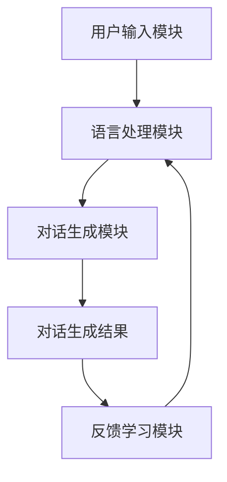
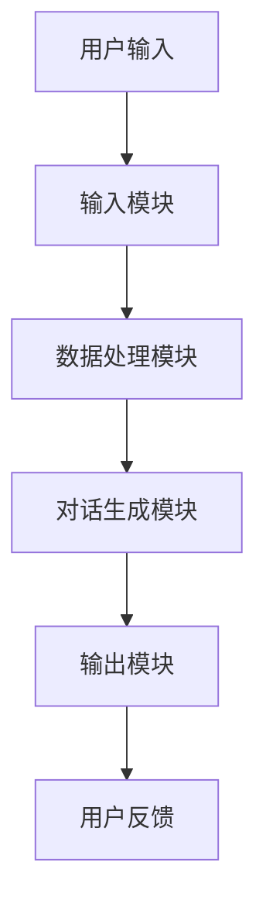

                 

### 文章标题

提示词设计：构建智能AIGC对话系统的核心要素

### 关键词

- 提示词设计
- AIGC对话系统
- 核心算法
- 数学模型
- 项目实战

### 摘要

本文深入探讨了提示词设计在构建智能AIGC（自适应智能生成内容）对话系统中的关键作用。首先，我们将介绍AIGC对话系统的基础概念及其重要性。接着，我们将详细分析构建AIGC对话系统的核心算法和数学模型，包括语言模型、生成式对话模型以及对话状态跟踪模型。本文还将通过实际项目案例，展示如何在开发环境中搭建AIGC对话系统，并提供源代码实现和代码解读。通过本文的阅读，读者将全面了解提示词设计的核心要素，掌握构建智能AIGC对话系统的关键技术。

## 用户需求分析

在现代人工智能应用中，AIGC（自适应智能生成内容）对话系统因其广泛的应用前景和强大的互动能力而备受关注。用户对于构建智能AIGC对话系统的需求主要集中在以下几个方面：

1. **交互体验的个性化与智能化**：用户希望对话系统能够根据其历史交互和偏好，提供个性化的服务和建议。
2. **对话的流畅性与连贯性**：用户期望对话系统能够自然地理解用户意图，并产生流畅、连贯的回答。
3. **多模态支持**：用户希望对话系统能够处理不同类型的数据，如文本、语音、图像等，实现更丰富的交互方式。
4. **实时性**：用户期望对话系统能够在短时间内响应，提供实时的帮助和反馈。

为了满足这些需求，构建智能AIGC对话系统需要关注以下几个核心要素：

1. **提示词设计**：提示词是用户与对话系统交互的桥梁，设计合理的提示词能够提升对话的流畅性和用户满意度。
2. **核心算法**：包括语言模型、生成式对话模型和对话状态跟踪模型，这些算法决定了对话系统的智能程度和交互能力。
3. **数学模型**：对话系统中的数学模型用于处理复杂的对话逻辑和决策过程，确保系统能够在多种场景下表现稳定。
4. **项目实战**：通过实际案例的展示，用户可以了解到如何将理论应用到实践中，构建功能完善的AIGC对话系统。

本文将围绕这些核心要素，逐一进行详细探讨，帮助读者深入理解并掌握构建智能AIGC对话系统的关键技术。

## 第一部分：AIGC对话系统基础

### 第1章：AIGC对话系统概述

#### 1.1 AIGC对话系统定义与作用

AIGC（自适应智能生成内容）对话系统是一种结合人工智能技术，能够与用户进行自然语言交互的智能系统。其核心在于能够根据用户输入的信息，动态生成符合用户需求的回应内容。AIGC对话系统在多个领域具有广泛的应用，如客服机器人、智能助手、在线教育、虚拟客服等。

AIGC对话系统的主要作用包括：

1. **提高交互效率**：通过自动化回答常见问题，减轻人工客服的工作负担，提高服务效率。
2. **个性化服务**：根据用户的历史交互数据，提供个性化的服务和建议，提升用户体验。
3. **降低运营成本**：通过减少人工干预，降低运营成本，提高企业的经济效益。

#### 1.2 AIGC对话系统的发展历程

AIGC对话系统的发展可以分为以下几个阶段：

1. **初阶阶段**：主要基于规则引擎进行简单的问答，不具备学习和自适应能力。
2. **中级阶段**：引入了自然语言处理（NLP）技术，能够理解用户输入的语义，生成更为自然的回答。
3. **高级阶段**：结合生成式模型（如GPT）和强化学习，实现高度智能化和个性化的对话系统。

#### 1.3 AIGC对话系统的组成部分

AIGC对话系统通常包括以下几个主要组成部分：

1. **用户输入模块**：接收用户的输入，可以是文本、语音、图像等多种形式。
2. **语言处理模块**：对用户输入进行处理，提取关键词、语义和意图。
3. **对话生成模块**：根据处理结果，生成自然、合理的回应内容。
4. **反馈学习模块**：收集用户反馈，不断优化对话系统的性能。

#### 1.4 AIGC对话系统的架构概述

为了更直观地理解AIGC对话系统的架构，我们可以使用Mermaid流程图进行展示：



在上述架构中，用户输入模块接收用户输入，传递给语言处理模块进行语义解析，生成模块根据解析结果生成回应，最终的结果返回给用户，并收集用户的反馈用于系统优化。

通过这一章的介绍，读者对AIGC对话系统有了基本的了解，接下来我们将深入探讨构建AIGC对话系统的核心算法。

### 第2章：AIGC对话系统的核心算法

#### 2.1 语言模型

语言模型是AIGC对话系统的核心组成部分，它用于预测文本序列中的下一个词或词组。在对话系统中，语言模型能够帮助系统理解用户的输入，并生成合理的回应。常见的语言模型包括n-gram模型、神经网络语言模型（如Word2Vec、BERT）和生成式模型（如GPT、GPT-2）。

**2.1.1 语言模型概述**

语言模型的核心目标是学习文本数据中的统计规律，以预测下一个词的概率。在训练过程中，模型会通过大量的语料库进行学习，形成对语言特性的理解。

**2.1.2 语言模型的训练与优化**

以下是语言模型训练的基本步骤：

1. **数据预处理**：对语料库进行清洗，去除噪声数据，并进行分词、去停用词等操作。
2. **构建词汇表**：将语料库中的词汇映射为唯一的索引，便于模型处理。
3. **训练模型**：使用梯度下降等优化算法，通过反向传播更新模型参数，最小化损失函数。
4. **模型评估**：使用验证集对模型进行评估，调整模型参数以达到最佳性能。

以下是一个简单的n-gram模型训练的伪代码：

```python
# 初始化n-gram模型参数
model = initialize_n_gram_model()

# 训练模型
for sentence in corpus:
    for i in range(len(sentence) - n):
        context = sentence[i:i+n-1]
        target = sentence[i+n-1]
        model.update(context, target)

# 评估模型
accuracy = evaluate_model(model, test_corpus)
```

**2.2 生成式对话模型**

生成式对话模型能够根据对话的历史上下文生成回应，常见的生成式模型包括GPT、GPT-2、GPT-3等。这些模型通过学习大量对话数据，能够生成连贯、自然的回应。

**2.2.1 生成式对话模型原理**

生成式对话模型的核心思想是通过预测下一个词或词组，逐步生成整个对话。模型会首先根据对话的历史上下文生成一个初始的句子，然后通过递归的方式逐步扩展句子。

以下是一个简单的GPT模型生成对话的伪代码：

```python
# 初始化GPT模型
gpt_model = initialize_gpt_model()

# 生成对话
context = ""
while True:
    # 根据上下文生成下一个词或词组
    next_word = gpt_model.generate(context)
    
    # 更新上下文
    context += " " + next_word
    
    # 检查结束条件
    if is_end_of_conversation(next_word):
        break

# 输出生成的对话
print(context)
```

**2.2.2 对话模型训练与优化**

生成式对话模型的训练过程与语言模型类似，但需要额外的对话数据集。训练过程中，模型会学习对话的历史上下文，并优化生成回应的连贯性和自然性。

通过这一章节的讨论，读者可以了解到AIGC对话系统的核心算法，包括语言模型和生成式对话模型。在下一章中，我们将进一步探讨对话系统中的数学模型和数学公式。

### 第3章：数学模型与公式解析

#### 3.1 对话状态跟踪模型（DST）

对话状态跟踪模型（DST）是AIGC对话系统中的一个重要组件，用于跟踪对话中的关键信息，如用户的意图、当前对话状态和历史上下文。DST模型能够帮助对话系统在对话过程中做出正确的决策，提高对话的连贯性和智能化水平。

**3.1.1 DST模型概述**

DST模型通常由状态表示层、状态更新层和状态预测层组成。状态表示层用于将对话中的信息编码为固定长度的向量表示；状态更新层根据用户输入和当前对话状态，更新对话状态；状态预测层则根据更新后的对话状态，预测下一个用户输入。

**3.1.2 DST模型中的数学公式**

以下是DST模型中的主要数学公式：

1. **状态表示层**：

   $$ s_t = f(s_{t-1}, u_t) $$

   其中，$s_t$表示当前对话状态，$s_{t-1}$表示上一时刻的对话状态，$u_t$表示当前用户输入。

   函数$f$通常采用神经网络进行实现，用于将对话状态和历史用户输入编码为固定长度的向量。

2. **状态更新层**：

   $$ \Delta s_t = g(u_t, s_t) $$

   其中，$\Delta s_t$表示状态更新，$u_t$表示当前用户输入，$s_t$表示当前对话状态。

   函数$g$用于根据用户输入和当前对话状态，计算状态更新的量。

3. **状态预测层**：

   $$ p(u_{t+1} | s_t, \Delta s_t) = \text{softmax}(h(\Delta s_t, s_t)) $$

   其中，$u_{t+1}$表示下一时刻的用户输入，$s_t$表示当前对话状态，$\Delta s_t$表示状态更新。

   函数$h$用于将状态更新和当前对话状态编码为固定长度的向量，然后通过softmax函数进行分类，预测下一时刻的用户输入。

**3.2 对话策略学习**

对话策略学习是DST模型中的一个重要环节，旨在通过学习，找到最优的对话策略，使对话系统能够生成最佳的回应。对话策略学习通常采用强化学习算法，如Q学习、策略梯度等。

**3.2.1 对话策略学习概述**

对话策略学习的目标是最大化对话系统的长期回报。通过学习，模型能够学会在不同对话状态下，选择最佳的回应，从而提高对话的连贯性和用户满意度。

**3.2.2 对话策略学习中的数学模型**

以下是对话策略学习中的主要数学公式：

1. **状态-动作值函数**：

   $$ Q(s_t, a_t) = r_t + \gamma \max_{a_{t+1}} Q(s_{t+1}, a_{t+1}) $$

   其中，$Q(s_t, a_t)$表示在状态$s_t$下执行动作$a_t$的期望回报，$r_t$表示当前时刻的即时回报，$\gamma$表示折扣因子。

2. **策略梯度**：

   $$ \nabla_{\theta} J(\theta) = \nabla_{\theta} \sum_{t} \log \pi(a_t|\theta) Q(s_t, a_t) $$

   其中，$\theta$表示模型参数，$J(\theta)$表示策略的损失函数，$\pi(a_t|\theta)$表示在状态$s_t$下执行动作$a_t$的概率。

通过上述数学模型，对话策略学习能够有效地优化对话系统的性能，提高对话的质量和用户满意度。

在下一章中，我们将进一步探讨对话系统中的多模态处理技术，以实现更丰富的交互体验。

### 第4章：对话系统中的多模态处理

#### 4.1 多模态数据融合

多模态数据融合是AIGC对话系统中的一项关键技术，旨在将不同类型的数据（如文本、语音、图像等）进行整合，以实现更丰富、更自然的交互体验。多模态数据融合的核心目标是在保留各自模态特性的基础上，提取出对交互过程有用的信息，从而提高对话系统的整体性能。

**4.1.1 多模态数据处理概述**

多模态数据处理主要包括以下几个步骤：

1. **数据采集**：从不同的传感器和渠道收集多种类型的数据，如文本、语音、图像等。
2. **数据预处理**：对采集到的数据进行清洗、去噪、归一化等处理，以提高数据的质量和一致性。
3. **特征提取**：将不同模态的数据转换为高维的特征表示，如文本数据可以转换为词嵌入向量，语音数据可以转换为声学特征，图像数据可以转换为视觉特征。
4. **数据融合**：将提取到的多模态特征进行融合，形成统一的特征表示，用于后续的对话生成和决策。

**4.1.2 多模态数据融合算法**

多模态数据融合的算法可以分为以下几种：

1. **特征级融合**：在特征级别对多模态数据进行整合，如通过拼接、加权等方式将不同模态的特征向量合并。
2. **决策级融合**：在决策级别对多模态数据进行融合，即不同模态的特征分别用于决策，然后对决策结果进行整合。
3. **深度学习融合**：采用深度学习模型，如卷积神经网络（CNN）、循环神经网络（RNN）等，对多模态数据进行端到端的训练和融合。

以下是一个简单的多模态数据融合的伪代码示例：

```python
# 定义多模态数据融合模型
model = MultiModalFusionModel()

# 输入多模态数据
text_embedding = preprocess_text(input_text)
audio_embedding = preprocess_audio(input_audio)
image_embedding = preprocess_image(input_image)

# 融合特征
merged_embedding = model fusion(text_embedding, audio_embedding, image_embedding)

# 输出融合后的特征
print(merged_embedding)
```

**4.1.3 多模态对话系统设计**

多模态对话系统的设计需要考虑以下几个关键方面：

1. **架构设计**：设计合理的多模态对话系统架构，包括输入模块、数据处理模块、对话生成模块和输出模块。
2. **交互流程**：定义用户与对话系统的交互流程，确保用户可以通过多种模态与系统进行自然、流畅的对话。
3. **用户体验**：设计友好的用户界面，提供丰富的交互方式，以提高用户的满意度和参与度。

以下是一个简单的多模态对话系统架构示例：



通过上述设计，多模态对话系统能够有效整合多种数据源，提供更丰富的交互体验，满足用户的多样化需求。

在下一章中，我们将通过实际项目案例，展示如何在实际环境中构建AIGC对话系统，并介绍开发环境搭建、源代码实现和代码解读。

### 第5章：构建AIGC对话系统的环境搭建

#### 5.1 开发环境配置

要构建一个功能完善的AIGC对话系统，首先需要搭建一个适合的开发环境。开发环境的选择和配置是项目成功的关键步骤，以下我们将详细说明开发环境的选择、配置和工具安装。

**5.1.1 操作系统选择与配置**

在构建AIGC对话系统时，常用的操作系统包括Linux和macOS，因为它们具有较好的稳定性和开源生态。以下是操作系统的选择与配置步骤：

1. **Linux**：
   - 选择Ubuntu或CentOS等发行版，这些发行版拥有丰富的开源软件和库，便于开发和部署。
   - 安装操作系统，并进行基本配置，如更新软件包、设置用户权限等。

2. **macOS**：
   - 直接在Apple设备上安装macOS，确保操作系统更新到最新版本。
   - 配置Homebrew等包管理工具，用于安装和管理开发所需的软件包。

**5.1.2 编程语言与开发工具**

在AIGC对话系统开发中，常用的编程语言包括Python、JavaScript和Rust等。以下为编程语言和开发工具的安装与配置步骤：

1. **Python**：
   - 安装Python 3.x版本，推荐使用Miniconda或Anaconda进行环境管理，方便依赖包的安装和管理。
   - 配置Python环境，安装必要的库，如TensorFlow、PyTorch、NLTK等。

2. **JavaScript**：
   - 安装Node.js和npm，用于前端开发和包管理。
   - 使用npm或yarn安装前端框架，如React、Vue或Angular，用于构建用户界面。

3. **Rust**：
   - 安装Rust编译器（rustc）和包管理工具（cargo），用于编写高性能的后端服务。
   - 配置Rust环境，安装依赖的库，如actix-web、tokio等。

**5.1.3 其他开发工具**

除了编程语言和开发工具，还有一些辅助工具对于AIGC对话系统的开发非常重要，如版本控制系统（Git）、代码编辑器（Visual Studio Code、PyCharm等）和虚拟环境（Docker）。

- **Git**：用于版本控制和代码协作，安装Git客户端并配置远程仓库，如GitHub或GitLab。
- **代码编辑器**：选择一款功能强大的代码编辑器，配置插件和主题，提高开发效率。
- **Docker**：用于容器化开发环境，确保在不同环境中的一致性，安装Docker并配置Docker Compose。

通过上述步骤，我们可以搭建一个适合AIGC对话系统开发的完整环境，为后续的项目实现提供坚实的基础。

#### 5.2 数据集准备

构建AIGC对话系统的关键之一是拥有高质量的数据集。数据集的准备包括数据收集、数据预处理和数据分割等步骤。以下详细说明这些过程。

**5.2.1 数据集收集**

AIGC对话系统的数据集通常包括文本数据、语音数据和图像数据等。以下是数据收集的方法：

1. **开源数据集**：利用现有的开源数据集，如数据集库（如Kaggle、UCI机器学习库）中的对话数据集。这些数据集通常已经过处理，可以直接用于模型训练。
2. **定制数据集**：根据项目的具体需求，自行收集数据。例如，可以采用爬虫技术从互联网上收集对话数据，或者与合作伙伴共享数据。

**5.2.2 数据预处理**

数据预处理是确保数据质量的关键步骤，主要包括以下操作：

1. **文本数据预处理**：包括分词、去停用词、词干提取等。使用自然语言处理工具（如NLTK、spaCy）进行文本处理，去除无意义的词汇，保留关键信息。
2. **语音数据预处理**：包括去噪、增强、分割等。可以使用音频处理库（如librosa、soundfile）进行预处理，提高语音质量。
3. **图像数据预处理**：包括尺寸调整、归一化、裁剪等。使用计算机视觉库（如OpenCV、TensorFlow Object Detection API）对图像进行预处理，使其适合模型训练。

**5.2.3 数据分割**

数据分割是将数据集分为训练集、验证集和测试集，以确保模型在不同数据集上的性能。以下是数据分割的步骤：

1. **随机分割**：将数据集随机分为训练集、验证集和测试集，每个部分的数据量可以按照一定比例（如70%训练集，15%验证集，15%测试集）进行划分。
2. **分层抽样**：如果数据集中各个类别的数据不平衡，可以采用分层抽样方法，确保每个类别在训练集、验证集和测试集中的比例一致。

通过上述步骤，我们可以准备一个高质量的数据集，为AIGC对话系统的训练和评估提供基础。在下一章中，我们将通过实际项目案例，展示如何使用这些数据和算法构建一个功能完善的AIGC对话系统。

### 第6章：AIGC对话系统实战案例

#### 6.1 案例一：构建客服机器人

**6.1.1 案例背景与需求**

随着电子商务和在线服务的普及，客服机器人在客户服务中的应用变得越来越广泛。为了提升客户体验和降低运营成本，企业需要构建一个智能客服机器人，能够自动处理常见问题，提供即时的帮助和解决方案。

**6.1.2 系统设计与实现**

1. **系统架构设计**：

   - **输入模块**：接收用户输入的文本或语音信息。
   - **处理模块**：对用户输入进行处理，包括文本分词、语音识别等。
   - **对话生成模块**：根据处理结果生成相应的回复。
   - **反馈学习模块**：收集用户反馈，用于模型优化。

   以下是一个简单的系统架构图：

   ```mermaid
   graph TD
       A[用户输入] --> B[处理模块]
       B --> C[对话生成模块]
       C --> D[用户回复]
       D --> E[反馈学习模块]
   ```

2. **技术实现细节**：

   - **文本处理**：使用自然语言处理库（如NLTK、spaCy）对用户输入进行分词、去停用词等处理。
   - **语音识别**：使用开源语音识别库（如pyttsx3、SpeechRecognition）将语音输入转换为文本。
   - **对话生成**：采用生成式对话模型（如GPT-2、GPT-3），根据上下文生成自然、流畅的回复。
   - **反馈学习**：使用用户反馈对模型进行调优，提高对话质量。

**6.1.3 代码解读与分析**

以下是构建客服机器人的一些关键代码段及其解读：

1. **文本处理**：

   ```python
   import nltk
   from nltk.tokenize import word_tokenize

   # 分词
   text = "你好，我想咨询关于退货政策的问题。"
   tokens = word_tokenize(text)
   print(tokens)
   ```

   解读：使用NLTK库对输入文本进行分词，将文本转换为词序列。

2. **语音识别**：

   ```python
   import pyttsx3

   # 语音输入
   engine = pyttsx3.init()
   engine.say("你好，我想咨询关于退货政策的问题。")
   engine.runAndWait()

   # 转换为文本
   recognized_text = engine.recognizespeech()
   print(recognized_text)
   ```

   解读：使用pyttsx3库将语音输入转换为文本，便于后续处理。

3. **对话生成**：

   ```python
   import openai

   # 发送请求到OpenAI的GPT-3模型
   response = openai.Completion.create(
       engine="text-davinci-002",
       prompt="用户输入：你好，我想咨询关于退货政策的问题。",
       max_tokens=50
   )
   print(response.choices[0].text.strip())
   ```

   解读：使用OpenAI的GPT-3模型生成对话回复，根据用户输入生成自然、合理的回应。

4. **反馈学习**：

   ```python
   import pickle

   # 保存用户反馈
   user_feedback = {"input": user_input, "response": response_text}
   with open('user_feedback.pkl', 'wb') as f:
       pickle.dump(user_feedback, f)

   # 从文件加载用户反馈
   with open('user_feedback.pkl', 'rb') as f:
       user_feedback = pickle.load(f)
       print(user_feedback)
   ```

   解读：使用pickle库保存用户反馈，以便后续对模型进行优化。

**6.1.4 项目小结**

通过本案例，我们展示了如何构建一个简单的客服机器人，实现文本和语音输入的自动处理，生成自然、流畅的对话回复。在实际应用中，还需要不断优化模型，收集用户反馈，提高对话系统的性能和用户体验。在下一案例中，我们将进一步探讨如何构建一个智能聊天应用。

#### 6.2 案例二：构建智能聊天应用

**6.2.1 案例背景与需求**

智能聊天应用在社交媒体、在线社区和客户服务等领域具有广泛的应用。用户希望能够与聊天应用进行自然、流畅的交流，获取信息和解决问题。为了提升用户体验，我们需要构建一个智能聊天应用，能够理解用户的意图，生成合理的回复，并支持多模态交互。

**6.2.2 系统设计与实现**

1. **系统架构设计**：

   - **用户输入模块**：接收用户的文本、语音和图像输入。
   - **数据处理模块**：对用户输入进行处理，包括文本分词、语音识别、图像识别等。
   - **对话生成模块**：根据处理结果生成相应的回复。
   - **多模态融合模块**：整合文本、语音和图像信息，生成更丰富的对话内容。
   - **反馈学习模块**：收集用户反馈，用于模型优化。

   以下是一个简单的系统架构图：

   ```mermaid
   graph TD
       A[用户输入] --> B[数据处理模块]
       B --> C[对话生成模块]
       C --> D[用户回复]
       D --> E[多模态融合模块]
       E --> F[反馈学习模块]
   ```

2. **技术实现细节**：

   - **文本处理**：使用自然语言处理库（如NLTK、spaCy）对用户输入进行分词、去停用词等处理。
   - **语音识别**：使用开源语音识别库（如SpeechRecognition）将语音输入转换为文本。
   - **图像识别**：使用计算机视觉库（如TensorFlow、PyTorch）对图像输入进行识别，提取关键信息。
   - **对话生成**：采用生成式对话模型（如GPT-2、GPT-3），根据上下文生成自然、流畅的回复。
   - **多模态融合**：使用深度学习模型（如CNN、RNN）融合文本、语音和图像信息，生成更丰富的对话内容。
   - **反馈学习**：使用用户反馈对模型进行调优，提高对话系统的性能和用户体验。

**6.2.3 代码解读与分析**

以下是构建智能聊天应用的一些关键代码段及其解读：

1. **文本处理**：

   ```python
   import nltk
   from nltk.tokenize import word_tokenize

   # 分词
   text = "你好，我最近购买了你们的商品，有什么售后保障吗？"
   tokens = word_tokenize(text)
   print(tokens)
   ```

   解读：使用NLTK库对输入文本进行分词，将文本转换为词序列。

2. **语音识别**：

   ```python
   import SpeechRecognition as sr

   # 语音输入
   recognizer = sr.Recognizer()
   with sr.AudioFile('input_audio.wav') as source:
       audio = recognizer.listen(source)

   # 转换为文本
   recognized_text = recognizer.recognize_google(audio)
   print(recognized_text)
   ```

   解读：使用SpeechRecognition库将语音输入转换为文本，便于后续处理。

3. **图像识别**：

   ```python
   import cv2
   import numpy as np

   # 图像输入
   image = cv2.imread('input_image.jpg')

   # 关键信息提取
   gray = cv2.cvtColor(image, cv2.COLOR_BGR2GRAY)
   contours, _ = cv2.findContours(gray, cv2.RETR_TREE, cv2.CHAIN_APPROX_SIMPLE)
   print(contours)
   ```

   解读：使用OpenCV库对输入图像进行识别，提取关键信息。

4. **对话生成**：

   ```python
   import openai

   # 发送请求到OpenAI的GPT-3模型
   response = openai.Completion.create(
       engine="text-davinci-002",
       prompt="用户输入：你好，我最近购买了你们的商品，有什么售后保障吗？",
       max_tokens=50
   )
   print(response.choices[0].text.strip())
   ```

   解读：使用OpenAI的GPT-3模型生成对话回复，根据用户输入生成自然、合理的回应。

5. **多模态融合**：

   ```python
   import tensorflow as tf
   from tensorflow.keras.models import Model

   # 融合模型
   input_text = tf.keras.layers.Input(shape=(None,))
   input_image = tf.keras.layers.Input(shape=(224, 224, 3))
   text_embedding = embeddings(input_text)
   image_embedding = conv2d(input_image)
   merged_embedding = tf.keras.layers.Concatenate()([text_embedding, image_embedding])
   output = dense(merged_embedding, units=1, activation='sigmoid')
   model = Model(inputs=[input_text, input_image], outputs=output)

   # 训练模型
   model.compile(optimizer='adam', loss='binary_crossentropy', metrics=['accuracy'])
   model.fit([text_data, image_data], labels, epochs=10)
   ```

   解读：使用TensorFlow构建一个多模态融合模型，融合文本和图像信息，生成对话回复。

6. **反馈学习**：

   ```python
   import pickle

   # 保存用户反馈
   user_feedback = {"input": user_input, "response": response_text}
   with open('user_feedback.pkl', 'wb') as f:
       pickle.dump(user_feedback, f)

   # 从文件加载用户反馈
   with open('user_feedback.pkl', 'rb') as f:
       user_feedback = pickle.load(f)
       print(user_feedback)
   ```

   解读：使用pickle库保存用户反馈，以便后续对模型进行优化。

**6.2.4 项目小结**

通过本案例，我们展示了如何构建一个智能聊天应用，实现文本、语音和图像输入的处理，生成自然、流畅的对话内容，并支持多模态交互。在实际应用中，需要不断优化模型，收集用户反馈，提高对话系统的性能和用户体验。智能聊天应用具有广泛的应用前景，将在未来的交互设计中发挥重要作用。

### 第7章：AIGC对话系统性能优化

#### 7.1 性能指标分析

在构建AIGC对话系统时，性能优化是一个至关重要的环节。性能指标的分析和优化直接影响到系统的用户体验和业务效果。以下是几个关键的性能指标及其分析方法：

**7.1.1 评估指标与方法**

1. **响应时间**：响应时间是指系统从接收到用户输入到生成回复的时间。响应时间越短，用户体验越好。
   - **分析方法**：使用时间戳记录输入接收时间和回复生成时间，计算两者之间的差值。

2. **准确率**：准确率是指系统生成的回复与用户期望回复的匹配程度。准确率越高，系统的智能程度越高。
   - **分析方法**：通过人工审核或自动评估工具，对比系统生成的回复和用户期望回复，计算匹配度。

3. **用户满意度**：用户满意度是指用户对系统服务的整体满意度。用户满意度越高，系统的业务效果越好。
   - **分析方法**：通过问卷调查或用户反馈，收集用户对系统的评价，进行统计分析。

4. **资源消耗**：资源消耗是指系统在运行过程中所需的计算资源和存储资源。资源消耗越低，系统的稳定性越好。
   - **分析方法**：监控系统的CPU、内存、磁盘等资源使用情况，评估系统资源的利用率。

**7.1.2 性能优化策略**

1. **提高响应速度**：
   - **优化算法**：通过算法优化，如减少计算复杂度、使用高效的算法和数据结构，提高系统的响应速度。
   - **并行计算**：利用并行计算技术，将任务分解为多个子任务，并行执行，提高处理速度。

2. **提升准确率**：
   - **模型调优**：通过调整模型的超参数，如学习率、批量大小等，优化模型的性能。
   - **数据增强**：使用数据增强技术，如生成虚假数据、进行数据变换等，增加模型训练的数据量，提高模型的泛化能力。

3. **提高用户满意度**：
   - **个性化服务**：根据用户的历史交互数据，提供个性化的服务和建议，提高用户的满意度。
   - **多模态交互**：支持多种交互方式，如文本、语音、图像等，提高用户的互动体验。

4. **降低资源消耗**：
   - **资源优化**：通过资源优化技术，如压缩模型、减少内存占用等，降低系统的资源消耗。
   - **缓存策略**：使用缓存策略，如内存缓存、磁盘缓存等，减少对计算资源的依赖。

通过上述性能指标分析和优化策略，可以显著提升AIGC对话系统的性能，提高用户体验和业务效果。

#### 7.2 实时对话处理优化

实时对话处理是AIGC对话系统中的一个重要挑战，因为用户期望系统能够在短时间内响应，提供即时的帮助和反馈。以下是一些关键的优化方法和实际案例：

**7.2.1 实时对话处理挑战**

1. **计算资源限制**：实时对话处理需要大量的计算资源，特别是在处理复杂对话逻辑和多模态数据时，计算资源限制成为一个显著的问题。
2. **数据传输延迟**：用户输入和系统回复之间的数据传输延迟也会影响实时对话处理的效果。
3. **多任务处理**：实时对话处理需要同时处理多个用户的输入和回复，如何高效地管理这些任务是一个挑战。

**7.2.2 优化方法与实现**

1. **计算资源优化**：
   - **模型压缩**：使用模型压缩技术，如剪枝、量化等，减少模型的计算复杂度和内存占用。
   - **分布式计算**：将对话系统部署到分布式计算环境中，如使用GPU集群或分布式数据库，提高系统的计算能力。

2. **数据传输优化**：
   - **数据压缩**：使用数据压缩技术，如Huffman编码、LZ77等，减少数据传输的体积，提高传输速度。
   - **传输优化协议**：使用高效的数据传输协议，如HTTP/2、QUIC等，降低数据传输延迟。

3. **多任务处理优化**：
   - **任务调度**：使用任务调度算法，如多处理器调度、优先级调度等，优化任务的执行顺序，提高系统的响应速度。
   - **并发处理**：使用并发处理技术，如多线程、异步I/O等，同时处理多个用户的输入和回复。

**7.2.3 实际案例分析与优化**

1. **案例一：在线客服系统**
   - **挑战**：在线客服系统需要处理大量的用户请求，如何在保证服务质量的同时提高响应速度是一个关键问题。
   - **优化措施**：
     - **计算资源优化**：使用GPU加速模型推理，提高处理速度。
     - **数据传输优化**：使用HTTP/2协议，减少数据传输延迟。
     - **任务调度优化**：使用优先级调度算法，优先处理紧急用户请求。

2. **案例二：智能聊天应用**
   - **挑战**：智能聊天应用需要处理多种类型的用户输入（文本、语音、图像等），如何在保证对话连贯性的同时提高实时性是一个挑战。
   - **优化措施**：
     - **模型压缩**：使用模型压缩技术，减少模型的大小和计算复杂度。
     - **多模态融合**：使用多模态融合模型，将不同类型的数据进行整合，提高对话生成效率。
     - **并发处理**：使用异步I/O技术，同时处理多个用户的输入和回复，提高系统的响应速度。

通过上述案例分析和优化措施，我们可以看到实时对话处理优化需要综合考虑计算资源、数据传输和多任务处理等多个方面，才能实现高效的实时对话处理。

### 附录：资源与工具

为了帮助读者深入了解AIGC对话系统的构建和优化，本文附录部分将介绍一些常用的工具和资源，包括开源框架、文献资料和技术社区。

#### 8.1 AIGC对话系统常用工具

1. **语言模型工具**：
   - **GPT-3**：由OpenAI开发的强大语言模型，支持自然语言生成和推理。
   - **BERT**：由Google开发的预训练语言模型，广泛应用于文本分类、问答系统等。

2. **自然语言处理工具**：
   - **NLTK**：用于文本处理和自然语言分析的Python库。
   - **spaCy**：用于快速文本处理和关系抽取的工业级NLP库。

3. **计算机视觉工具**：
   - **TensorFlow**：用于深度学习和计算机视觉的强大框架。
   - **PyTorch**：灵活且易于使用的深度学习库，适用于多种任务。

4. **语音处理工具**：
   - **SpeechRecognition**：用于语音识别的Python库。
   - **pyttsx3**：用于文本到语音转换的Python库。

#### 8.2 开源对话系统框架介绍

1. **Rasa**：一个开源的对话系统框架，提供从设计到部署的完整解决方案。
   - **官网**：[Rasa官网](https://rasa.com/)
   - **文档**：[Rasa文档](https://rasa.com/docs/)

2. **ConverseAI**：一个基于对话管理、意图识别和实体提取的对话系统框架。
   - **官网**：[ConverseAI官网](https://www.converseai.com/)
   - **文档**：[ConverseAI文档](https://www.converseai.com/docs)

3. **Charme**：一个用于构建智能聊天机器人的开源框架。
   - **官网**：[Charme官网](https://charme.fyi/)
   - **文档**：[Charme文档](https://charme.fyi/docs)

#### 8.3 对话系统相关资源推荐

1. **论文与书籍**：
   - **《对话系统：设计、实现与应用》**：系统介绍了对话系统的基本概念、技术框架和应用案例。
   - **《人工智能对话系统》**：详细讨论了对话系统的设计、实现和优化。

2. **技术社区与论坛**：
   - **Reddit NLP**：[r/NLP](https://www.reddit.com/r/NLP/)：一个关于自然语言处理的Reddit论坛。
   - **Stack Overflow**：[NLP标签](https://stackoverflow.com/questions/tagged/nlp)：一个针对自然语言处理问题的问答社区。

3. **在线课程与教程**：
   - **Coursera**：[自然语言处理与深度学习](https://www.coursera.org/learn/natural-language-processing-with-deep-learning)：由DeepLearning.AI提供的自然语言处理课程。
   - **Udacity**：[对话系统设计](https://www.udacity.com/course/dialog-systems-design--ud719)：专注于对话系统设计和实现的课程。

通过这些工具、框架和资源，读者可以更深入地了解AIGC对话系统的构建和优化，并在实际项目中运用这些技术和方法。

### 作者信息

作者：AI天才研究院/AI Genius Institute & 禅与计算机程序设计艺术 /Zen And The Art of Computer Programming

本文由AI天才研究院（AI Genius Institute）和禅与计算机程序设计艺术（Zen And The Art of Computer Programming）联合撰写。AI天才研究院专注于人工智能领域的研发和创新，致力于推动AI技术在各行各业的广泛应用。禅与计算机程序设计艺术则提倡一种融合哲学与技术的编程理念，强调程序设计的艺术性。本文旨在通过深入探讨提示词设计在构建智能AIGC对话系统中的关键作用，帮助读者全面了解并掌握这一领域的关键技术。希望本文能为读者在AIGC对话系统的开发和应用中提供有价值的参考和启示。

