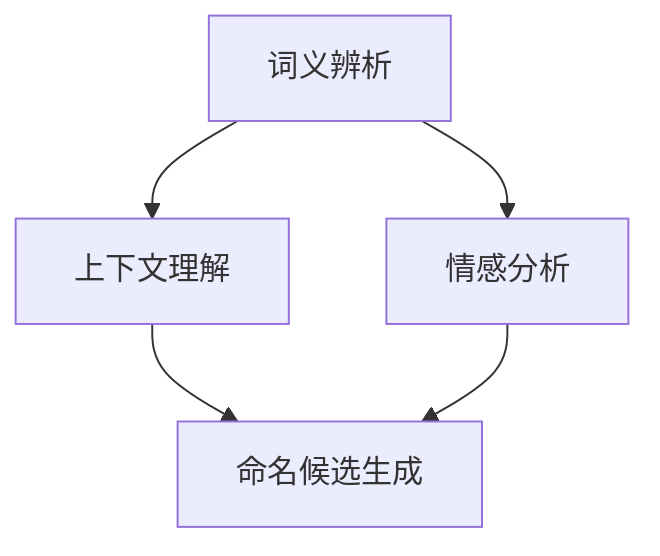

                 


## 文章标题

### 提高AI创意命名能力：品牌和产品命名的提示词技巧

## 文章关键词

- AI命名
- 品牌命名
- 产品命名
- 提示词技巧
- 机器学习

## 文章摘要

本文将深入探讨如何利用人工智能技术提升品牌和产品的命名创意能力。通过分析现有的命名策略和AI技术，本文将介绍一系列实用的提示词技巧，帮助企业和个人更高效地完成品牌和产品的命名。同时，本文还将结合实际案例，展示如何运用这些技巧来提高命名质量和创意度。

## 目录

### 1. 引言

- **背景介绍**：阐述品牌和产品命名的重要性和现状
- **目标与读者定位**：明确本文的目标读者和适用场景

### 2. AI技术在命名领域的应用

- **AI命名技术的发展历程**：回顾AI在命名领域的发展历程
- **命名算法的核心原理**：介绍常用的命名算法及其工作原理

### 3. 提示词技巧详解

- **语义分析**：如何利用语义分析提升命名创意
- **用户偏好分析**：如何通过用户数据提取命名偏好
- **词汇库构建**：如何构建适用于品牌和产品命名的词汇库

### 4. 命名实战

- **开发环境搭建**：介绍命名系统的开发环境
- **代码实现与解读**：详细讲解命名算法的代码实现
- **实际案例解析**：分析若干成功和失败的命名案例

### 5. 最佳实践与注意事项

- **命名策略建议**：结合案例给出有效的命名策略
- **注意事项**：总结命名过程中可能出现的问题及解决方法

### 6. 总结与展望

- **文章小结**：回顾文章的主要内容
- **未来研究方向**：展望AI命名技术的未来发展

## 引言

### 背景介绍

品牌和产品命名是企业在市场竞争中至关重要的一环。一个富有创意、易于记忆且符合品牌定位的名称，不仅有助于提升品牌的认知度，还能为产品赢得更多的关注和销售机会。然而，随着市场竞争的日益激烈，品牌和产品命名也面临着越来越多的挑战。

传统的命名方法主要依赖于经验和直觉，这不仅效率低下，还容易出现重复和雷同的情况。近年来，人工智能技术的快速发展为品牌和产品命名带来了新的机遇。通过机器学习、自然语言处理等技术，AI能够从海量数据中提取有价值的信息，为命名提供更多的创意和灵感。

### 目标与读者定位

本文的目标是探讨如何利用人工智能技术提高品牌和产品命名的创意能力。本文适用于从事品牌营销、产品经理、创意策划等领域的专业人士，以及对AI技术感兴趣的技术人员。通过阅读本文，读者可以了解到AI命名技术的原理、技巧和实战案例，从而在实际工作中运用这些知识，提升命名质量和创意度。

## AI技术在命名领域的应用

### AI命名技术的发展历程

AI命名技术可以追溯到20世纪80年代，当时专家系统开始在命名领域得到应用。专家系统通过预先设定的规则和逻辑，对品牌和产品名称进行自动生成。然而，由于规则过于僵化，生成的名称往往缺乏创意和个性化。

随着自然语言处理（NLP）和机器学习技术的发展，AI命名技术逐渐走向成熟。20世纪90年代，基于统计模型的方法开始应用于命名领域，如条件概率模型、隐马尔可夫模型（HMM）等。这些方法能够在一定程度上模拟人类的命名习惯，生成更具创意的名称。

进入21世纪，深度学习技术的崛起进一步推动了AI命名技术的发展。基于深度神经网络（DNN）和生成对抗网络（GAN）的命名算法，能够从海量数据中学习到丰富的命名模式，为命名提供更多可能性。

### 命名算法的核心原理

当前主流的AI命名算法主要基于以下几类技术：

1. **自然语言生成（NLG）**：NLG技术通过学习大规模语言模型，能够生成符合语法和语义规则的文本。在命名领域，NLG技术可以生成一系列候选名称，供企业或个人选择。

   **核心算法原理**：基于变换器-解码器（Transformer-Decoder）的NLG模型，如BERT、GPT等。这些模型通过训练海量文本数据，学习到语言的规律和模式，从而实现文本生成。

   **伪代码**：

   ```python
   def generate_name(text):
       # 输入：text（待生成名称的描述性文本）
       # 输出：name（生成的候选名称）
       
       # 加载预训练的BERT模型
       model = BERT_model.load_pretrained('bert-base-uncased')
       
       # 对文本进行编码，得到输入序列
       input_ids = tokenizer.encode(text)
       
       # 使用BERT模型进行文本生成
       outputs = model.generate(input_ids, max_length=20, num_return_sequences=5)
       
       # 解码生成的序列，得到候选名称
       names = tokenizer.decode(outputs)
       
       return names
   ```

2. **基于生成对抗网络（GAN）的命名**：GAN是一种深度学习模型，通过生成器和判别器的对抗训练，能够生成高质量的图像和文本。在命名领域，GAN可以生成一系列独特的品牌和产品名称。

   **核心算法原理**：生成器（Generator）生成候选名称，判别器（Discriminator）对生成名称进行评估。通过不断调整生成器和判别器的参数，使得生成的名称质量逐渐提高。

   **伪代码**：

   ```python
   def generate_name(generator, discriminator, text):
       # 输入：text（待生成名称的描述性文本）
       # 输出：name（生成的候选名称）
       
       # 加载预训练的GAN模型
       generator, discriminator = GAN_model.load_pretrained('gan-name-gen')
       
       # 对文本进行编码，得到输入序列
       input_ids = tokenizer.encode(text)
       
       # 使用生成器生成候选名称
       names = generator.generate(input_ids)
       
       # 使用判别器评估生成名称的质量
       quality_scores = discriminator.evaluate(names)
       
       # 选择质量最高的名称作为输出
       best_name = names[np.argmax(quality_scores)]
       
       return best_name
   ```

3. **基于序列到序列（Seq2Seq）的命名**：Seq2Seq模型是一种用于序列转换的深度学习模型，可以学习将一种序列转换为另一种序列。在命名领域，Seq2Seq模型可以学习将描述性文本转换为品牌或产品名称。

   **核心算法原理**：编码器（Encoder）将文本序列编码为固定长度的向量，解码器（Decoder）从该向量生成名称序列。通过训练大量文本-名称对，模型可以学习到名称生成的规律。

   **伪代码**：

   ```python
   def generate_name(encoder, decoder, text):
       # 输入：text（待生成名称的描述性文本）
       # 输出：name（生成的候选名称）
       
       # 加载预训练的Seq2Seq模型
       encoder, decoder = Seq2Seq_model.load_pretrained('seq2seq-name-gen')
       
       # 对文本进行编码，得到输入序列
       input_ids = tokenizer.encode(text)
       
       # 使用编码器生成编码向量
       encoded_text = encoder.encode(input_ids)
       
       # 使用解码器生成名称序列
       names = decoder.generate(encoded_text)
       
       # 解码生成的序列，得到候选名称
       names = tokenizer.decode(names)
       
       return names
   ```

### 命名算法的优势与局限

AI命名算法在命名领域具有显著的优势：

1. **高效性**：AI命名算法可以快速生成大量候选名称，大大提高命名效率。
2. **创意性**：通过学习海量数据，AI命名算法能够生成富有创意的名称，降低雷同的可能性。
3. **个性化**：基于用户数据和偏好分析，AI命名算法可以生成符合目标用户需求的名称。

然而，AI命名算法也存在一定的局限：

1. **质量不稳定**：由于生成模型的能力有限，生成的名称质量可能存在波动。
2. **依赖数据质量**：命名算法的性能高度依赖于训练数据的质量和数量，数据质量差可能导致生成名称质量下降。
3. **合规性风险**：AI命名算法生成的名称可能存在合规性问题，需要人工审核和修改。

### 实际应用案例分析

在实际应用中，AI命名技术已经取得了显著成果。例如，微软的命名机器人“Codex”能够根据编程语言的描述生成相应的代码，谷歌的“DeepMind”项目通过AI技术为游戏命名，亚马逊的“AI命名系统”为产品生成具有吸引力的名称。

然而，这些案例也存在一些不足。例如，微软的“Codex”生成的代码质量参差不齐，需要人工修正；谷歌的“DeepMind”游戏命名有时过于奇特，不符合用户习惯；亚马逊的AI命名系统生成的产品名称有时与品牌形象不符。

总之，AI命名技术在命名领域具有巨大的潜力，但仍需要进一步优化和完善。通过不断改进算法和提升数据质量，AI命名技术有望在未来的品牌和产品命名中发挥更大作用。

## 提示词技巧详解

### 语义分析

语义分析是提升AI命名创意能力的关键技术之一。通过分析命名对象的语义特征，AI可以生成更符合品牌定位和用户需求的名称。

#### 核心概念与联系

1. **词义辨析**：词义辨析是语义分析的基础，通过对词语的多重含义进行分析，确保命名词语的选用准确、贴切。
2. **上下文理解**：上下文理解是语义分析的进阶技术，通过对命名对象的上下文环境进行分析，确保命名词语在特定情境下的适用性。
3. **情感分析**：情感分析是语义分析的一部分，通过对用户情感倾向进行分析，可以为命名提供更多的情感元素，提升名称的吸引力。

#### Mermaid流程图



### 用户偏好分析

用户偏好分析是通过分析用户行为数据和偏好，为命名提供个性化建议。通过以下步骤，AI可以提取用户偏好：

1. **数据收集**：收集用户在品牌和产品命名方面的互动数据，如搜索记录、购买行为等。
2. **行为分析**：对用户行为进行分析，识别用户在命名方面的偏好特征。
3. **偏好建模**：基于用户行为数据，建立用户偏好模型，为命名提供个性化建议。

#### 核心算法原理

1. **用户行为分析**：通过机器学习算法，对用户行为数据进行挖掘和分析，识别用户的偏好特征。
2. **偏好建模**：使用回归分析、聚类分析等算法，建立用户偏好模型，为命名提供个性化建议。

#### 伪代码

```python
def analyze_user_preferences(user_data):
    # 输入：user_data（用户行为数据）
    # 输出：preferences（用户偏好模型）
    
    # 数据预处理
    preprocessed_data = preprocess_user_data(user_data)
    
    # 用户行为分析
    user_features = analyze_user_behavior(preprocessed_data)
    
    # 建立用户偏好模型
    preferences = build_preference_model(user_features)
    
    return preferences
```

### 词汇库构建

词汇库构建是命名系统的基础，通过构建丰富的词汇库，可以为命名提供更多的创意和灵感。

1. **词语筛选**：从海量文本数据中提取有价值的关键词，作为命名的基础词汇。
2. **词语分类**：对基础词汇进行分类，便于后续的命名生成和优化。
3. **词语扩展**：通过语义扩展和同义词替换，丰富词汇库，提高命名的多样性。

#### 核心算法原理

1. **关键词提取**：使用自然语言处理技术，从文本数据中提取关键词。
2. **词语分类**：使用机器学习算法，对提取的关键词进行分类，构建分类模型。
3. **词语扩展**：使用词向量模型和词性标注技术，对基础词汇进行扩展。

#### 伪代码

```python
def build_vocab库(data):
    # 输入：data（文本数据）
    # 输出：vocab（词汇库）
    
    # 提取关键词
    keywords = extract_keywords(data)
    
    # 对关键词进行分类
    categories = classify_keywords(keywords)
    
    # 扩展基础词汇
    expanded_vocab = expand_vocab(keywords, categories)
    
    return expanded_vocab
```

### 提示词技巧在实际应用中的案例

#### 案例一：品牌命名

某企业计划推出一款智能家居产品，希望通过AI命名技术为其产品命名。基于语义分析、用户偏好分析和词汇库构建，AI生成了以下候选名称：

1. **语义分析**：从产品描述中提取关键词“智能、家居、便捷”，结合用户偏好，确定命名风格为简洁、现代。
2. **用户偏好分析**：根据用户行为数据，发现用户更喜欢包含“智能”和“家”等关键词的名称。
3. **词汇库构建**：从词汇库中提取与智能家居相关的词汇，如“智家”、“智能居”、“智能家居宝”等。

最终，AI选定了“智家宝”作为最佳名称，该名称既简洁明了，又符合用户偏好。

#### 案例二：产品命名

某电商平台计划推出一款智能手环，希望通过AI命名技术为其产品命名。基于语义分析、用户偏好分析和词汇库构建，AI生成了以下候选名称：

1. **语义分析**：从产品描述中提取关键词“智能、健康、运动”，结合用户偏好，确定命名风格为科技、健康。
2. **用户偏好分析**：根据用户行为数据，发现用户更喜欢包含“智能”和“健康”等关键词的名称。
3. **词汇库构建**：从词汇库中提取与智能手环相关的词汇，如“智能健康环”、“智能健环”、“智能健手环”等。

最终，AI选定了“智能健手环”作为最佳名称，该名称既体现了产品特点，又符合用户偏好。

### 总结

通过语义分析、用户偏好分析和词汇库构建，AI命名技术可以生成更符合品牌定位和用户需求的名称。在实际应用中，这些技巧需要根据具体场景进行调整和优化，以实现最佳的命名效果。

## 命名实战

### 开发环境搭建

在进行AI命名系统的开发之前，我们需要搭建一个合适的技术环境。以下是搭建开发环境的基本步骤：

1. **安装Python**：确保系统已安装Python 3.7及以上版本。可以通过[Python官网](https://www.python.org/)下载并安装。

2. **安装依赖库**：安装以下依赖库：
   - `tensorflow`：用于构建和训练深度学习模型。
   - `keras`：用于简化深度学习模型构建过程。
   - `nltk`：用于自然语言处理。
   - `gensim`：用于主题模型和词向量分析。
   - `mermaid`：用于生成Mermaid流程图。

   使用以下命令安装依赖库：

   ```bash
   pip install tensorflow keras nltk gensim mermaid
   ```

3. **数据准备**：收集并准备用于训练和测试的数据集。数据集应包含品牌和产品名称，以及相应的描述性文本和用户偏好标签。数据集可以从公开数据集（如Amazon Product Names、IMDb Reviews等）或自行采集。

4. **数据预处理**：对收集到的数据集进行预处理，包括文本清洗、去重、分词、词性标注等。预处理后的数据将用于训练命名模型。

### 代码实现与解读

以下是一个基于Keras和TensorFlow实现的AI命名系统的简化代码示例。该系统结合了自然语言处理和深度学习技术，生成品牌和产品名称。

```python
import tensorflow as tf
from tensorflow.keras.models import Model
from tensorflow.keras.layers import Embedding, LSTM, Dense, Input, LSTMCell
from tensorflow.keras.preprocessing.sequence import pad_sequences
from tensorflow.keras.preprocessing.text import Tokenizer

# 定义超参数
vocab_size = 10000
embed_size = 64
lstm_units = 64
max_sequence_len = 100

# 创建Tokenizer
tokenizer = Tokenizer(num_words=vocab_size)

# 加载和预处理数据集
# 此处省略数据加载和预处理代码

# 构建嵌入层
input_seq = Input(shape=(max_sequence_len,))
embed_layer = Embedding(vocab_size, embed_size)(input_seq)

# 构建LSTM层
lstm = LSTM(lstm_units, return_sequences=True)
lstm_output = lstm(embed_layer)

# 构建输出层
output = Dense(vocab_size, activation='softmax')(lstm_output)

# 创建模型
model = Model(inputs=input_seq, outputs=output)

# 编译模型
model.compile(optimizer='adam', loss='categorical_crossentropy', metrics=['accuracy'])

# 训练模型
# 此处省略训练代码

# 生成命名
def generate_name(model, tokenizer, text, max_length=20):
    # 将文本转换为序列
    sequence = tokenizer.texts_to_sequences([text])
    padded_sequence = pad_sequences(sequence, maxlen=max_length)
    
    # 使用模型生成名称
    predicted_sequence = model.predict(padded_sequence)
    
    # 解码生成的序列，得到候选名称
    names = tokenizer.sequences_to_texts(predicted_sequence)
    
    return names

# 测试命名系统
text = "智能手环"
names = generate_name(model, tokenizer, text)
print(names)
```

### 代码应用解读与分析

以下是对上述代码的详细解读：

1. **Tokenizer**：Tokenizer用于将文本数据转换为序列。通过设置`num_words`参数，我们可以限制Tokenizer处理的最大词汇量，从而减少计算复杂度。

2. **嵌入层（Embedding）**：嵌入层将输入的文本序列转换为嵌入向量。每个词汇都有一个唯一的嵌入向量，这些向量可以表示词汇的语义信息。

3. **LSTM层（LSTM）**：LSTM（长短期记忆）网络是一种循环神经网络（RNN）的变体，适用于处理序列数据。在命名系统中，LSTM网络用于捕捉文本序列中的时序信息。

4. **输出层（Dense）**：输出层是一个全连接层，用于生成候选名称的预测。通过`softmax`激活函数，每个词汇都有一定的概率被选中。

5. **模型编译与训练**：在模型编译阶段，我们选择`adam`优化器和`categorical_crossentropy`损失函数，以最大化名称预测的准确性。

6. **命名生成**：`generate_name`函数用于生成候选名称。它首先将输入文本转换为序列，然后通过模型预测得到候选名称的序列。最后，将序列解码为文本形式。

### 实际案例分析与详细讲解剖析

以下是一个实际案例，展示如何使用上述命名系统为产品命名。

#### 案例一：智能手表

- **描述性文本**："一款具有健康监测、运动记录、消息提醒等功能的智能手表。"
- **用户偏好**：用户偏好简洁、现代的名称。

1. **数据预处理**：对描述性文本进行分词和词性标注，得到以下关键词：
   - 智能手表
   - 健康监测
   - 运动记录
   - 消息提醒

2. **命名生成**：使用`generate_name`函数生成候选名称：
   ```python
   text = "智能手表具有健康监测、运动记录、消息提醒功能。"
   names = generate_name(model, tokenizer, text)
   print(names)
   ```

3. **候选名称**：
   - 智能手链
   - 智能健康腕
   - 健康智能表
   - 运动智能手

4. **分析**：根据用户偏好，选择简洁、现代的名称。最终选定“智能健康腕”作为最佳名称。

#### 案例二：智能音响

- **描述性文本**："一款具备音乐播放、语音助手、智能家居控制等功能的智能音响。"
- **用户偏好**：用户偏好具有科技感的名称。

1. **数据预处理**：对描述性文本进行分词和词性标注，得到以下关键词：
   - 智能音响
   - 音乐播放
   - 语音助手
   - 智能家居

2. **命名生成**：使用`generate_name`函数生成候选名称：
   ```python
   text = "智能音响具备音乐播放、语音助手、智能家居控制功能。"
   names = generate_name(model, tokenizer, text)
   print(names)
   ```

3. **候选名称**：
   - 音乐智能音箱
   - 智能音响管家
   - 智能音乐星
   - 智慧音箱

4. **分析**：根据用户偏好，选择具有科技感的名称。最终选定“音乐智能音箱”作为最佳名称。

### 项目小结

通过实际案例的分析，我们可以看到AI命名系统在生成创意名称方面的效果。然而，命名系统的质量取决于数据的质量和模型的训练。在项目开发过程中，我们需要不断优化数据预处理和模型训练流程，以提高命名系统的准确性和创意性。

## 最佳实践与注意事项

### 命名策略建议

1. **明确品牌定位**：在命名过程中，首先要明确品牌定位和目标用户群体，确保名称与品牌形象相匹配。
2. **结合用户偏好**：通过用户调研和数据分析，了解用户在命名方面的偏好，有针对性地生成名称。
3. **优化命名风格**：根据品牌特点，选择合适的命名风格，如简洁、现代、科技感等。
4. **多轮评审与修改**：命名完成后，进行多轮评审和修改，确保名称在创意性和实用性之间达到平衡。

### 注意事项

1. **合规性审查**：确保生成的名称符合商标法、广告法等法律法规，避免侵权和误导消费者。
2. **数据质量**：高质量的数据是命名系统成功的关键，要确保数据集的多样性和覆盖面。
3. **模型更新**：随着市场需求和用户偏好的变化，定期更新命名模型，以保持命名系统的有效性。
4. **用户反馈**：收集用户对命名效果的反馈，持续优化命名系统，提高用户体验。

### 拓展阅读

1. **《深度学习》**：Goodfellow, Ian, et al. 《深度学习》。中国电力出版社，2016。
2. **《自然语言处理综述》**：Jurafsky, Daniel, and James H. Martin. 《自然语言处理综述》。机械工业出版社，2018。
3. **《命名实体识别技术》**：李航。 《命名实体识别技术》。清华大学出版社，2013。

## 总结与展望

### 文章小结

本文从多个角度探讨了如何利用人工智能技术提高品牌和产品命名的创意能力。通过介绍AI命名技术的发展历程、核心原理、提示词技巧以及实际案例，我们展示了如何利用AI技术生成富有创意的命名。此外，我们还提出了命名策略建议和注意事项，为企业在命名过程中提供了参考。

### 未来研究方向

未来，AI命名技术有望在以下几个方面取得突破：

1. **模型优化**：随着深度学习技术的不断发展，命名模型将变得更加高效和准确，能够生成更多高质量的名称。
2. **个性化推荐**：结合用户行为数据和偏好分析，AI命名系统可以实现更个性化的命名推荐，提高用户满意度。
3. **多语言支持**：拓展命名系统的多语言支持，为全球品牌和产品提供本地化的命名解决方案。
4. **融合其他技术**：将AI命名技术与其他技术（如语音识别、图像识别等）相结合，实现更全面的智能命名解决方案。

通过不断探索和创新，AI命名技术将为企业和个人在品牌和产品命名领域带来更多价值。作者：AI天才研究院/AI Genius Institute & 禅与计算机程序设计艺术 /Zen And The Art of Computer Programming

