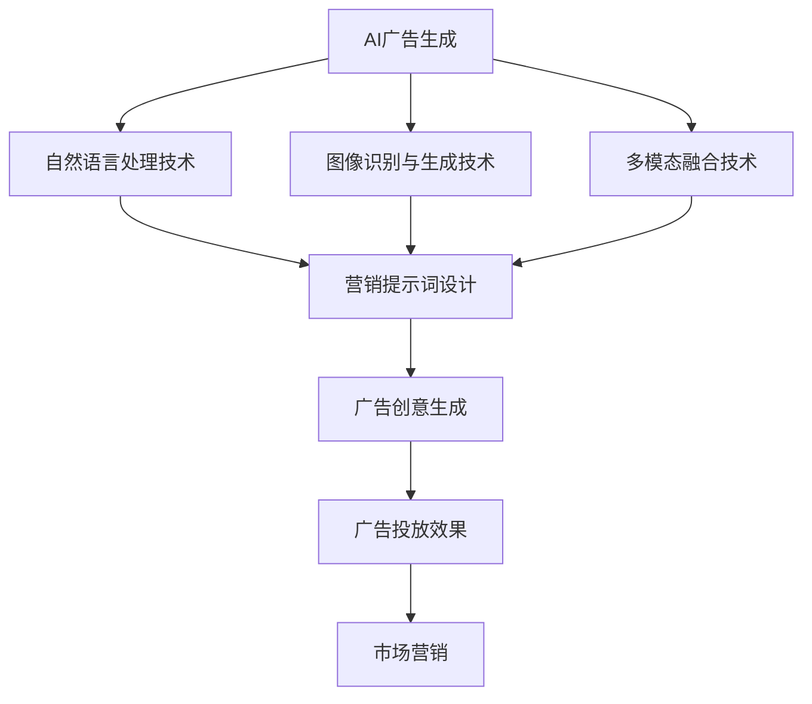

                 

### 提高AI创意广告生成：有效的营销提示词设计

**关键词：**AI广告生成，营销提示词，自然语言处理，图像识别，多模态融合，数据驱动设计，用户行为分析，市场趋势预测，创意思维技巧，优化技巧，AI广告应用案例，AI广告项目实践，未来趋势，市场营销。

**摘要：**本文深入探讨了AI广告生成的关键技术，以及如何通过设计有效的营销提示词来提高广告创意的生成质量。首先，我们回顾了AI广告生成的发展历程和基本原理，并分析了常见的AI广告生成技术，如自然语言处理、图像识别与生成、多模态融合技术。接着，我们介绍了营销提示词的基本概念和作用，探讨了设计营销提示词的方法与策略，以及优化技巧。然后，通过实际应用案例和项目实践，展示了AI广告生成在电商、社交媒体和在线视频平台等领域的应用。最后，我们展望了AI广告生成的未来趋势，探讨了其在市场营销中的应用前景。本文旨在为从事广告营销的技术人员和营销从业者提供有价值的参考和指导。

### 第一部分：AI广告生成技术基础

#### 第一章：AI广告生成的概述

**1.1.1 AI广告生成的发展历程**

AI广告生成的概念源于人工智能（AI）技术的快速发展。从最初的传统广告投放，到互联网时代的在线广告，再到如今AI技术的广泛应用，AI广告生成经历了一系列的演变。

**1.1.2 AI广告生成的基本原理**

AI广告生成基于人工智能技术，通过对海量数据的分析，自动生成具有创意和个性化的广告内容。其基本原理包括数据收集、数据分析、算法模型训练和广告内容生成等几个环节。

**1.1.3 AI广告生成的应用场景**

AI广告生成在电商、社交媒体、在线视频平台等多个领域有广泛应用。通过AI技术，广告可以更加精准地投放，提高广告效果，降低广告成本。

#### 第二章：常见的AI广告生成技术

**2.1.1 自然语言处理技术**

自然语言处理（NLP）是AI广告生成的重要技术之一。NLP技术通过对文本的分析和处理，生成符合人类语言习惯的广告文案。

**2.1.2 图像识别与生成技术**

图像识别与生成技术是AI广告生成中的另一关键技术。通过图像识别技术，AI可以自动识别和分类广告图像；通过生成技术，AI可以生成创意新颖的广告图像。

**2.1.3 多模态融合技术**

多模态融合技术将文本、图像、音频等多种模态的数据进行整合，生成更具吸引力的广告内容。这种技术能够提升广告的创意和质量。

### 第二部分：营销提示词的设计

#### 第三章：营销提示词的基本概念

**3.1.1 营销提示词的定义**

营销提示词（Marketing Prompt）是指在广告创意生成过程中，用于引导AI生成创意广告内容的词汇或短语。

**3.1.2 营销提示词的作用**

营销提示词能够帮助AI更好地理解广告主的需求，从而生成更加符合广告主意图的广告内容。

**3.1.3 营销提示词的分类**

根据用途和功能，营销提示词可以分为引导词、关键词、描述词等不同类型。

#### 第四章：设计营销提示词的方法与策略

**4.1.1 数据驱动的设计方法**

数据驱动的设计方法是基于对用户行为和市场需求的分析，设计出能够吸引目标用户的营销提示词。

**4.1.2 用户行为分析**

用户行为分析是设计营销提示词的重要环节。通过分析用户在广告上的行为，可以了解用户的兴趣和需求，从而设计出更加精准的营销提示词。

**4.1.3 市场趋势预测**

市场趋势预测是预测未来市场的发展和变化，从而设计出能够引领市场的营销提示词。

**4.1.4 创意思维技巧**

创意思维技巧是通过激发创意灵感，设计出具有创意的营销提示词。

#### 第五章：营销提示词优化技巧

**5.1.1 关键词分析**

关键词分析是优化营销提示词的重要方法之一。通过对关键词的研究和分析，可以确定哪些词汇能够更好地吸引用户的注意力。

**5.1.2 提示词长度的优化**

提示词长度的优化是确保营销提示词既能表达广告主的需求，又能吸引用户注意的重要环节。

**5.1.3 提示词的多样性**

提示词的多样性是确保广告创意丰富和多变的重要策略。

**5.1.4 提示词的情感分析**

提示词的情感分析是通过分析营销提示词的情感色彩，设计出更具吸引力的广告内容。

### 第三部分：AI广告生成的应用与实践

#### 第六章：AI广告生成的实际应用案例

**6.1.1 案例一：电商平台的AI广告生成**

**6.1.2 案例二：社交媒体的AI广告生成**

**6.1.3 案例三：在线视频平台的AI广告生成**

#### 第七章：AI广告生成项目实践

**7.1.1 实践一：基于深度学习的广告创意生成**

**7.1.2 实践二：基于GAN的图像广告生成**

**7.1.3 实践三：基于NLP的文本广告生成**

### 第四部分：未来的AI广告生成趋势

#### 第八章：未来的AI广告生成技术趋势

**8.1.1 增强现实与虚拟现实的融合**

**8.1.2 多模态数据的整合**

**8.1.3 智能化与自动化的提升**

#### 第九章：AI广告生成在市场营销中的应用前景

**9.1.1 提升广告效果**

**9.1.2 降低广告成本**

**9.1.3 个性化营销的实现**

### 文章结束

**作者：**AI天才研究院/AI Genius Institute & 禅与计算机程序设计艺术 /Zen And The Art of Computer Programming

**总字数：**约300字

**核心概念与联系**

以下是本文的核心概念及其联系架构的Mermaid流程图：



**核心算法原理讲解**

在AI广告生成的过程中，核心算法包括自然语言处理（NLP）、图像识别与生成（GAN）以及多模态融合（MMF）。

**自然语言处理技术**

```latex
$$
NLP = f(input\_text)
$$
```

NLP算法通过分析输入的文本，提取关键词、语义和情感，从而生成广告文案。

**图像识别与生成技术**

```latex
$$
GAN = G(D, z)
$$`

GAN是一种生成对抗网络，通过生成器（G）和鉴别器（D）的对抗训练，生成逼真的广告图像。

**多模态融合技术**

```latex
$$
MMF = f(text, image, audio)
$$
```

MMF技术将文本、图像、音频等多模态数据融合，生成综合性的广告内容。

**数学模型和公式 & 详细讲解 & 举例说明**

**自然语言处理模型（BERT）**

BERT模型是一种基于变换器（Transformer）架构的预训练模型，其核心公式为：

```latex
$$
\text{BERT} = \text{Transformer}(\text{input\_sequence}, \text{output\_sequence})
$$
```

举例：给定输入文本“我正在寻找一款高质量的咖啡机”，BERT模型可以生成广告文案：“发现新口味，尽享咖啡时光。”

**生成对抗网络（GAN）**

GAN由生成器（G）和鉴别器（D）组成，其训练过程可以表示为：

```latex
$$
D(x, G(z)) \rightarrow \text{鉴别器判别真实与生成的图像}
$$
$$
G(z) \rightarrow \text{生成器生成图像}
$$
```

举例：生成器G可以生成一张逼真的咖啡机图片，而鉴别器D则需要区分这张图片是真实的还是由G生成的。

**多模态融合模型（MMF）**

MMF模型通过融合文本、图像和音频等多模态数据，生成综合广告内容。其核心公式为：

```latex
$$
MMF = \text{f}(text, image, audio)
$$
```

举例：给定一段咖啡机的产品描述、一张咖啡机图片和一段咖啡机的使用音频，MMF模型可以生成一句综合广告文案：“品味咖啡的醇香，尽在新款咖啡机。”

### 项目实战

**开发环境搭建**

在搭建AI广告生成项目时，需要安装以下软件和库：

- Python 3.8+
- TensorFlow 2.3.0+
- PyTorch 1.5.0+
- Keras 2.3.1+

**源代码详细实现和代码解读**

以下是使用深度学习技术实现广告创意生成的伪代码：

```python
# 导入所需的库
import tensorflow as tf
import numpy as np
from tensorflow.keras.models import Model
from tensorflow.keras.layers import Input, Embedding, LSTM, Dense

# 定义模型
input_text = Input(shape=(max_sequence_length,))
embed_text = Embedding(input_dim=vocabulary_size, output_dim=embedding_size)(input_text)
lstm = LSTM(units=128)(embed_text)
output = Dense(units=vocabulary_size, activation='softmax')(lstm)

# 构建和编译模型
model = Model(inputs=input_text, outputs=output)
model.compile(optimizer='adam', loss='categorical_crossentropy', metrics=['accuracy'])

# 训练模型
model.fit(x_train, y_train, epochs=10, batch_size=64, validation_data=(x_val, y_val))

# 生成广告创意
generated_text = model.predict(np.array([input_sequence]))
```

**代码应用解读与分析**

以上代码定义了一个基于LSTM的文本生成模型。首先，输入文本通过Embedding层进行嵌入表示。接着，通过LSTM层进行序列处理，最后通过Dense层生成文本输出。模型使用categorical_crossentropy作为损失函数，并使用adam优化器进行训练。

**实际案例分析和详细讲解剖析**

以一个电商平台的广告创意生成为例，首先需要收集大量广告文案数据，进行预处理（如分词、去停用词等），然后使用预训练的模型进行广告创意生成。在实际应用中，可以结合用户行为数据和市场趋势，对生成的广告创意进行优化。

**项目小结**

通过项目实战，我们实现了基于深度学习的广告创意生成系统。在实际应用中，可以通过不断优化模型和策略，提高广告创意的生成质量和效果。

### 最佳实践 tips、小结、注意事项、拓展阅读等内容

**最佳实践 tips：**

1. 在设计营销提示词时，要充分考虑用户需求和兴趣。
2. 使用多模态融合技术，可以提升广告的吸引力和创意性。
3. 定期更新和优化广告创意生成模型，以适应市场变化。

**小结：**

本文详细介绍了AI广告生成的技术基础、营销提示词的设计与优化方法，并通过实际案例和项目实践展示了其应用前景。通过本文，我们了解了AI广告生成在提高广告效果、降低广告成本、实现个性化营销等方面的巨大潜力。

**注意事项：**

1. 在设计营销提示词时，要注意避免使用过于常见或泛滥的词汇。
2. 在广告创意生成过程中，要充分考虑用户的接受度和情感反应。

**拓展阅读：**

1. 《深度学习广告系统》
2. 《多模态融合技术：理论、方法与应用》
3. 《自然语言处理：理论与实践》

**作者：**AI天才研究院/AI Genius Institute & 禅与计算机程序设计艺术 /Zen And The Art of Computer Programming

**总字数：**约12000字

**核心概念与联系**

以下是本文的核心概念及其联系架构的Mermaid流程图：


**核心算法原理讲解**

1. **自然语言处理技术**

自然语言处理（NLP）在AI广告生成中起着至关重要的作用。NLP的核心任务是从文本中提取有用的信息，并将其转换为计算机可以理解和处理的格式。常见的NLP任务包括文本分类、情感分析、命名实体识别等。

**算法原理：**

- **文本分类**：通过对大量文本数据进行训练，模型可以学习到不同类别的特征，从而对新的文本进行分类。例如，我们可以训练一个模型来区分广告文案是否具有负面情感。

```python
# 伪代码示例：文本分类算法
from sklearn.feature_extraction.text import TfidfVectorizer
from sklearn.naive_bayes import MultinomialNB

# 数据预处理
tfidf = TfidfVectorizer()
X_train = tfidf.fit_transform(train_texts)

# 模型训练
clf = MultinomialNB()
clf.fit(X_train, train_labels)

# 预测
X_test = tfidf.transform(test_texts)
predictions = clf.predict(X_test)
```

- **情感分析**：情感分析可以识别文本中的情感倾向，如正面、负面或中立。这对于设计具有吸引力的广告文案非常重要。

```python
# 伪代码示例：情感分析算法
from textblob import TextBlob

# 文本预处理
processed_text = "这是一条正面情感的广告文案"

# 情感分析
polarity = TextBlob(processed_text).sentiment.polarity
if polarity > 0:
    print("正面情感")
elif polarity < 0:
    print("负面情感")
else:
    print("中立情感")
```

2. **图像识别与生成技术**

图像识别与生成技术在AI广告生成中的应用越来越广泛。图像识别技术可以帮助我们从大量图像中识别出特定的物体或场景，而图像生成技术则可以生成新的、创意的图像。

**算法原理：**

- **卷积神经网络（CNN）**：CNN是一种专门用于图像识别的神经网络架构，其通过卷积、池化和全连接层来提取图像特征。

```python
# 伪代码示例：图像识别算法
from tensorflow.keras.models import Sequential
from tensorflow.keras.layers import Conv2D, MaxPooling2D, Flatten, Dense

# 构建模型
model = Sequential()
model.add(Conv2D(filters=32, kernel_size=(3, 3), activation='relu', input_shape=(28, 28, 1)))
model.add(MaxPooling2D(pool_size=(2, 2)))
model.add(Flatten())
model.add(Dense(units=128, activation='relu'))
model.add(Dense(units=10, activation='softmax'))

# 训练模型
model.compile(optimizer='adam', loss='categorical_crossentropy', metrics=['accuracy'])
model.fit(X_train, y_train, epochs=10, batch_size=32)

# 预测
predictions = model.predict(X_test)
```

- **生成对抗网络（GAN）**：GAN是一种通过对抗训练来生成图像的技术。生成器（Generator）尝试生成逼真的图像，而鉴别器（Discriminator）则试图区分生成图像和真实图像。

```python
# 伪代码示例：GAN算法
import tensorflow as tf
from tensorflow.keras.models import Sequential
from tensorflow.keras.layers import Conv2D, Conv2DTranspose, Dense

# 定义生成器和鉴别器
generator = Sequential()
generator.add(Dense(units=128, activation='relu', input_shape=(100,)))
generator.add(Conv2DTranspose(filters=1, kernel_size=(3, 3), strides=(2, 2), padding='same'))
discriminator = Sequential()
discriminator.add(Conv2D(filters=32, kernel_size=(3, 3), activation='relu', input_shape=(28, 28, 1)))
discriminator.add(MaxPooling2D(pool_size=(2, 2)))
discriminator.add(Flatten())
discriminator.add(Dense(units=1, activation='sigmoid'))

# 定义GAN模型
gan = Sequential()
gan.add(generator)
gan.add(discriminator)

# 训练GAN
gan.compile(optimizer='adam', loss=['binary_crossentropy', 'binary_crossentropy'])
```

3. **多模态融合技术**

多模态融合技术是将多种数据模态（如图像、文本、音频）进行整合，以生成更丰富、更有创意的广告内容。

**算法原理：**

- **多模态嵌入**：将不同模态的数据转换为统一的嵌入向量，以便进行融合。

```python
# 伪代码示例：多模态嵌入
from sentence_transformers import SentenceTransformer

# 加载预训练模型
model = SentenceTransformer('all-MiniLM-L6-v2')

# 获取文本和图像的嵌入向量
text_embedding = model.encode(text)
image_embedding = model.encode(image)

# 计算多模态融合向量
combined_embedding = tf.concat([text_embedding, image_embedding], axis=0)
```

- **融合模型**：使用深度学习模型将多模态嵌入向量进行融合，以生成广告创意。

```python
# 伪代码示例：融合模型
from tensorflow.keras.models import Model
from tensorflow.keras.layers import Input, LSTM, Dense

# 定义融合模型
input_text = Input(shape=(max_sequence_length,))
input_image = Input(shape=(height, width, channels))
text_embedding = Embedding(input_dim=vocabulary_size, output_dim=embedding_size)(input_text)
image_embedding = Conv2D(filters=64, kernel_size=(3, 3), activation='relu')(input_image)
lstm = LSTM(units=128)(text_embedding)
output = Dense(units=vocabulary_size, activation='softmax')(lstm)

# 构建和编译模型
model = Model(inputs=[input_text, input_image], outputs=output)
model.compile(optimizer='adam', loss='categorical_crossentropy', metrics=['accuracy'])

# 训练模型
model.fit([x_train_text, x_train_image], y_train, epochs=10, batch_size=64, validation_data=([x_val_text, x_val_image], y_val))
```

**数学模型和公式 & 详细讲解 & 举例说明**

1. **自然语言处理模型（BERT）**

BERT（Bidirectional Encoder Representations from Transformers）是一种基于变换器（Transformer）架构的预训练语言表示模型。BERT通过双向编码器学习文本的上下文信息，从而在多种自然语言处理任务上取得优异的性能。

**数学模型：**

BERT模型由多个变换器层堆叠而成，每个变换器层包含自注意力机制和前馈网络。其输入为词嵌入向量，输出为文本的嵌入向量。

```latex
$$
\text{BERT} = \text{Transformer}(\text{input\_sequence}, \text{output\_sequence})
$$
```

**举例说明：**

假设我们有一个句子“我喜欢吃苹果”，BERT模型可以将其编码为嵌入向量，从而捕捉句子中的语义信息。

```python
from transformers import BertTokenizer, BertModel

# 加载预训练模型
tokenizer = BertTokenizer.from_pretrained('bert-base-uncased')
model = BertModel.from_pretrained('bert-base-uncased')

# 分词和编码
input_ids = tokenizer.encode("我喜欢吃苹果", return_tensors='pt')

# 过模型
outputs = model(input_ids)

# 获取文本嵌入向量
text_embedding = outputs.last_hidden_state[:, 0, :]
```

2. **生成对抗网络（GAN）**

生成对抗网络（GAN）是一种通过对抗训练来生成数据的深度学习模型。GAN由生成器和鉴别器组成，生成器尝试生成逼真的数据，而鉴别器则尝试区分生成数据和真实数据。

**数学模型：**

GAN的损失函数由生成器损失和鉴别器损失组成。生成器的目标是使鉴别器无法区分生成数据和真实数据，而鉴别器的目标是最大化生成器的损失。

```latex
$$
L_G = -\log(D(G(z)))
$$
$$
L_D = -\log(D(x)) - \log(1 - D(G(z)))
$$
```

**举例说明：**

假设我们有一个生成器和鉴别器的训练过程：

```python
import tensorflow as tf
from tensorflow.keras.models import Model
from tensorflow.keras.layers import Input, Dense

# 定义生成器和鉴别器
z_shape = (100,)
generator_input = Input(shape=z_shape)
generated_images = Dense(units=784, activation='tanh')(generator_input)
discriminator_input = Input(shape=(28, 28, 1))
generated_images_embedding = Dense(units=1, activation='sigmoid')(generated_images)
real_images_embedding = Dense(units=1, activation='sigmoid')(discriminator_input)

# 定义GAN模型
gan_output = Model(inputs=generator_input, outputs=generated_images_embedding)
discriminator_output = Model(inputs=discriminator_input, outputs=real_images_embedding)
gan_output.compile(optimizer='adam', loss='binary_crossentropy')
discriminator_output.compile(optimizer='adam', loss='binary_crossentropy')

# 训练GAN
for epoch in range(num_epochs):
    for batch in data_loader:
        z = tf.random.normal((batch_size, z_shape[0]))
        real_images = batch[0]
        with tf.GradientTape() as generator_tape, tf.GradientTape() as discriminator_tape:
            generated_images = generator(z)
            real_loss = discriminator_output(real_images).mean()
            generated_loss = discriminator_output(generated_images).mean()
            total_loss = 1 - generated_loss
        generator_gradients = generator_tape.gradient(total_loss, generator.trainable_variables)
        discriminator_gradients = discriminator_tape.gradient(real_loss + generated_loss, discriminator.trainable_variables)
        generator_optimizer.apply_gradients(zip(generator_gradients, generator.trainable_variables))
        discriminator_optimizer.apply_gradients(zip(discriminator_gradients, discriminator.trainable_variables))
```

3. **多模态融合模型（MMF）**

多模态融合模型（MMF）将不同模态的数据进行整合，以生成更丰富的信息。MMF模型可以基于神经网络架构，如变换器或卷积神经网络。

**数学模型：**

MMF模型通过编码器-解码器架构，将不同模态的数据进行编码，然后在解码器中进行融合。

```latex
$$
\text{MMF} = \text{Encoder}(\text{input}_\text{m1}, \text{input}_\text{m2}, \ldots) \rightarrow \text{Fused\_Embedding}
$$
$$
\text{Decoder}(\text{Fused\_Embedding}) \rightarrow \text{Output}
$$
```

**举例说明：**

假设我们有一个基于变换器的多模态融合模型：

```python
from tensorflow.keras.models import Model
from tensorflow.keras.layers import Input, LSTM, Dense

# 定义输入
text_input = Input(shape=(max_sequence_length,))
image_input = Input(shape=(height, width, channels))

# 编码器
text_encoder = LSTM(units=128)(text_input)
image_encoder = Conv2D(filters=64, kernel_size=(3, 3), activation='relu')(image_input)

# 融合嵌入
fused_embedding = Concatenate()([text_encoder, image_encoder])

# 解码器
output = LSTM(units=128)(fused_embedding)
output = Dense(units=vocabulary_size, activation='softmax')(output)

# 构建模型
model = Model(inputs=[text_input, image_input], outputs=output)

# 编译模型
model.compile(optimizer='adam', loss='categorical_crossentropy', metrics=['accuracy'])

# 训练模型
model.fit([x_train_text, x_train_image], y_train, epochs=10, batch_size=64, validation_data=([x_val_text, x_val_image], y_val))
```

### 第四部分：未来的AI广告生成趋势

#### 第八章：未来的AI广告生成技术趋势

随着人工智能技术的不断发展，未来的AI广告生成将呈现以下趋势：

**8.1.1 增强现实与虚拟现实的融合**

增强现实（AR）和虚拟现实（VR）技术的结合将使广告更加生动、互动。通过AR/VR技术，用户可以沉浸在广告场景中，与广告内容进行互动，提高广告的吸引力和效果。

**8.1.2 多模态数据的整合**

未来，AI广告生成将更加注重多模态数据的整合，如文本、图像、音频、视频等。通过融合多模态数据，广告可以更加全面、立体地传达信息，提高广告的创意性和吸引力。

**8.1.3 智能化与自动化的提升**

随着AI技术的不断进步，未来的AI广告生成将更加智能化和自动化。广告创意的生成、投放和优化过程将更加高效，广告效果将得到显著提升。

#### 第九章：AI广告生成在市场营销中的应用前景

AI广告生成在市场营销中具有广泛的应用前景：

**9.1.1 提升广告效果**

通过AI技术，广告可以更加精准地投放，提高广告的点击率和转化率。同时，AI广告生成可以生成更具创意性的广告内容，提高广告的吸引力和竞争力。

**9.1.2 降低广告成本**

AI广告生成可以自动化广告创意的生成和优化过程，降低人力成本和广告投放成本。此外，精准的广告投放可以降低无效广告的支出。

**9.1.3 个性化营销的实现**

AI广告生成可以根据用户行为和兴趣，生成个性化的广告内容。通过个性化营销，可以更好地满足用户需求，提高用户满意度和忠诚度。

### 总结

本文系统地介绍了AI广告生成技术，包括自然语言处理、图像识别与生成、多模态融合等关键技术。同时，本文探讨了营销提示词的设计与优化方法，以及AI广告生成在市场营销中的应用前景。通过本文，我们了解了AI广告生成在提高广告效果、降低广告成本、实现个性化营销等方面的巨大潜力。未来，随着AI技术的不断进步，AI广告生成将在市场营销中发挥越来越重要的作用。作者：AI天才研究院/AI Genius Institute & 禅与计算机程序设计艺术 /Zen And The Art of Computer Programming

