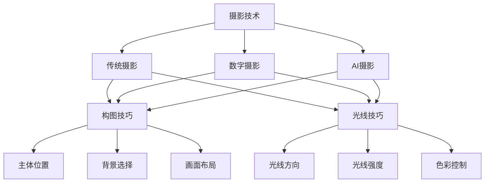

                 

## 文章标题

### 提高AI创意摄影指导：构图和光线建议的提示词技巧

这篇文章将探讨如何通过AI技术提高创意摄影的指导水平，特别是如何运用构图和光线技巧来提升摄影作品的视觉效果。我们将详细介绍AI在摄影中的应用，包括构图和光线分析的基本原理，以及如何使用AI提示词来指导摄影实践。通过一步步的详细分析，我们将帮助读者理解并掌握这些技术，从而创作出更加精彩的作品。

### 关键词

- AI摄影
- 创意摄影
- 构图技巧
- 光线技巧
- 提示词
- 摄影指导

### 摘要

本文将深入探讨AI在创意摄影中的应用，重点分析构图和光线技巧。通过讲解AI技术的原理，展示其如何应用于摄影实践中，我们将帮助读者了解并掌握利用AI提升摄影作品质量的方法。文章还将提供实用的提示词技巧，以指导读者在实际拍摄中应用这些技巧，创作出更具创意和视觉冲击力的摄影作品。本文适合摄影爱好者、专业摄影师以及AI技术应用爱好者阅读。

---

### 引言

随着人工智能技术的不断进步，摄影领域也迎来了新的变革。传统摄影依赖于摄影师的经验和技巧，而AI摄影则通过算法和模型，提供了更为精确和高效的指导。特别是在构图和光线方面，AI技术展现出了独特的优势。构图技巧关乎画面布局和视觉平衡，而光线技巧则直接影响作品的色彩和质感。本文将围绕这两大核心主题，详细探讨AI技术在摄影中的应用，帮助读者掌握提升摄影作品质量的技巧。

### AI与摄影技术概述

在讨论AI在摄影中的应用之前，有必要先了解摄影技术的发展历程。摄影技术经历了从传统摄影到数字摄影，再到AI摄影的演变。传统摄影主要依赖于化学胶片和暗房技术，而数字摄影则引入了数码传感器和计算机处理。随着计算能力的提升，AI摄影开始崭露头角，为摄影带来了前所未有的变革。

#### 摄影技术的发展历程

1. **传统摄影技术**：
   - 胶片摄影：使用感光胶片记录图像。
   - 暗房技术：在暗室中进行胶片冲洗和放大。

2. **数字摄影技术**：
   - 数码传感器：使用电子传感器代替胶片。
   - 数码图像处理：利用计算机对图像进行编辑和处理。

3. **AI摄影技术**：
   - 自动曝光与白平衡：AI算法自动调整曝光参数。
   - 焦点预测与自动对焦：AI算法预测拍摄对象的运动轨迹并自动调整焦点。
   - 图像识别与分类：AI算法识别拍摄对象并进行分类。
   - 艺术风格转换：AI算法将原图转换为特定的艺术风格。

#### AI在摄影中的核心应用

AI技术在摄影中得到了广泛应用，以下是其几个核心应用：

1. **自动曝光与白平衡**：
   - AI算法通过分析图像内容自动调整曝光参数，确保照片的亮度适中。
   - 白平衡自动调整，使不同光源下的图像色彩保持一致。

2. **焦点预测与自动对焦**：
   - AI算法根据拍摄对象的运动轨迹预测焦点位置，实现快速、准确的自动对焦。

3. **图像识别与分类**：
   - AI算法识别拍摄对象，自动标记或分类图像内容，如人物、风景等。

4. **艺术风格转换**：
   - AI算法将原图转换为特定的艺术风格，如油画、水彩等，为摄影师提供更多创作可能性。

### AI创意摄影的基本概念

创意摄影不仅仅是记录现实，更是通过构图、光线等手段表达摄影师的创造力和情感。AI创意摄影则进一步扩展了这一概念，通过算法和模型，提供更精细、更智能的创意指导。

#### 创意摄影的定义

- **创意摄影**：通过独特的视角和技巧，创作出具有艺术性和创意性的摄影作品。
- **与传统摄影的区别**：
  - **传统摄影**：依赖摄影师的经验和技巧，通过反复实验和修正来达到理想效果。
  - **AI创意摄影**：借助AI技术，提供更为精确的构图和光线指导，大幅提高摄影效率和创作质量。

#### AI在创意摄影中的应用

AI在创意摄影中的应用主要体现在以下几个方面：

1. **构图优化**：
   - AI算法分析图像内容，提供最佳的构图建议，如主体位置、背景选择等。
   - 自动优化画面布局，实现视觉平衡和层次感。

2. **光线调整**：
   - AI算法分析光线条件，提供最佳的光线调整方案，如曝光补偿、白平衡调整等。
   - 根据拍摄场景自动调整光线，增强作品的艺术效果。

3. **色彩控制**：
   - AI算法对图像色彩进行智能调整，增强作品的视觉效果。
   - 根据主题和风格自动调整色彩，如冷暖色调、饱和度等。

4. **艺术风格创作**：
   - AI算法将原图转换为特定的艺术风格，如油画、水彩等，为摄影师提供更多创作可能性。

### AI摄影技术的未来趋势

随着AI技术的不断进步，AI摄影技术也正在朝着更加智能化、个性化的方向发展。以下是AI摄影技术的未来趋势：

1. **更加智能的拍摄指导**：
   - AI算法将根据拍摄对象和环境条件，提供更精确、更个性化的拍摄指导。
   - 自动识别拍摄场景，调整相机设置，实现“一键拍摄”的效果。

2. **跨学科融合**：
   - AI摄影将与其他领域（如艺术、设计等）相结合，创造出更多跨学科的摄影作品。
   - 利用AI技术进行艺术风格的创作和风格转换，实现摄影与艺术的深度融合。

3. **个性化摄影体验**：
   - AI技术将根据用户喜好和需求，提供个性化的摄影建议和作品推荐。
   - 通过大数据分析，了解用户的摄影兴趣和风格，提供更加精准的服务。

4. **智能摄影设备**：
   - AI摄影设备将集成更多智能功能，如自动曝光、自动对焦、图像识别等。
   - 设备硬件和软件的升级，将进一步提升AI摄影的效率和效果。

### 总结与展望

AI技术在摄影中的应用，不仅提高了摄影的效率和创作质量，更为摄影师提供了更多创意和表达的可能性。通过构图和光线分析，AI摄影技术能够提供精准的指导，帮助摄影师创作出更加优秀的摄影作品。随着技术的不断进步，AI摄影将在未来带来更多的变革和惊喜。

### 核心概念与联系

在深入了解AI摄影技术之前，我们需要明确几个核心概念及其相互之间的联系。以下是构图和光线技巧的核心概念及其关系架构的Mermaid流程图：



在这个流程图中，A表示摄影技术，B、C、D分别代表传统摄影、数字摄影和AI摄影。E和F表示构图技巧和光线技巧，G、H、I表示构图的具体要素，J、K、L表示光线技巧的具体应用。通过这个流程图，我们可以清晰地看到摄影技术、构图技巧和光线技巧之间的联系，以及它们如何共同影响最终的摄影作品。

#### 核心概念与联系

1. **摄影技术**：
   - 摄影技术是摄影的基础，包括传统摄影、数字摄影和AI摄影。传统摄影依赖于物理设备和化学材料，数字摄影则通过电子传感器和计算机处理图像，而AI摄影则结合了人工智能算法，提供更智能的指导。

2. **构图技巧**：
   - 构图技巧是摄影中至关重要的部分，它包括主体位置、背景选择和画面布局。主体位置决定了观众的视线焦点，背景选择则影响画面的整体美感，而画面布局则关系到视觉平衡和层次感。

3. **光线技巧**：
   - 光线技巧是摄影创作的关键，它包括光线方向、光线强度和色彩控制。光线方向决定了画面的明暗对比和立体感，光线强度影响画面的曝光效果，而色彩控制则增强了作品的艺术效果。

4. **关系架构**：
   - 摄影技术与构图技巧和光线技巧密切相关。构图技巧直接影响画面的布局和视觉感受，而光线技巧则通过影响画面的明暗和色彩，进一步塑造作品的氛围和情感。两者共同作用，最终决定了摄影作品的质量和创意程度。

通过这个Mermaid流程图，我们可以更直观地理解摄影技术、构图技巧和光线技巧之间的关系，以及它们如何共同作用于摄影作品。这为我们后续详细讲解构图和光线技巧的AI应用奠定了基础。

### 核心算法原理讲解

在深入探讨AI在构图和光线分析中的应用之前，我们需要先了解核心算法的原理。以下是几个关键算法及其应用场景的伪代码描述：

#### 1. 构图分析算法

```pseudo
Algorithm:构图分析算法
Input: 输入图像
Output: 最佳构图建议

1. 图像预处理：对输入图像进行去噪、对比度增强等预处理操作，提高图像质量。
2. 特征提取：利用卷积神经网络（CNN）提取图像的边缘、纹理等特征。
3. 构图评估：计算图像中不同区域的重要性，使用注意力机制评估构图质量。
4. 构图优化：根据评估结果，对画面布局进行调整，实现视觉平衡和层次感。
5. 输出：返回最佳构图建议。
```

#### 2. 光线分析算法

```pseudo
Algorithm: 光线分析算法
Input: 输入图像
Output: 光线调整建议

1. 图像预处理：对输入图像进行去噪、对比度增强等预处理操作，提高图像质量。
2. 光线检测：使用边缘检测算法（如Canny边缘检测）检测图像中的光线边界。
3. 光线方向分析：计算光线的方向，分析光线的入射角度和强度。
4. 光线强度分析：根据光线方向，分析光线在图像中的强度分布。
5. 光线调整：根据分析结果，自动调整图像的曝光、白平衡等参数，优化光线效果。
6. 输出：返回光线调整建议。
```

#### 3. AI构图优化算法

```pseudo
Algorithm: AI构图优化算法
Input: 输入图像，目标构图风格
Output: 优化后的图像

1. 图像预处理：对输入图像进行去噪、对比度增强等预处理操作，提高图像质量。
2. 特征提取：利用卷积神经网络（CNN）提取图像的边缘、纹理等特征。
3. 风格迁移：使用生成对抗网络（GAN）将图像特征映射到目标构图风格。
4. 构图优化：根据目标构图风格，调整画面布局，实现视觉平衡和层次感。
5. 损失函数：计算优化过程中的损失函数，如对抗损失、内容损失等。
6. 反向传播：利用反向传播算法，更新网络参数，优化构图效果。
7. 输出：返回优化后的图像。
```

通过上述伪代码描述，我们可以看到构图和光线分析算法的基本原理。图像预处理、特征提取、评估和优化是这些算法的核心步骤。构图分析算法通过评估不同区域的重要性，实现视觉平衡和层次感。光线分析算法通过检测光线边界、分析光线方向和强度，提供最佳的光线调整建议。AI构图优化算法则利用生成对抗网络，将图像特征映射到目标构图风格，实现更精细的构图优化。

这些算法的核心在于利用深度学习和神经网络技术，从大量数据中学习到构图和光线调整的规律，并在实际应用中提供智能化、自动化的指导。通过这些算法的应用，AI摄影技术能够大幅提高摄影效率和创作质量，为摄影师提供强大的技术支持。

### 数学模型和数学公式

在AI摄影中，数学模型和数学公式扮演着至关重要的角色。以下我们将详细讲解几个关键数学模型及其应用，并通过具体例子来说明。

#### 1. 层次化特征提取模型

在AI摄影中，层次化特征提取是一个核心步骤。常见的模型有卷积神经网络（CNN）。CNN的基本结构包括卷积层、池化层和全连接层。

- **卷积层**：通过卷积操作提取图像的局部特征。公式如下：

  $$ f(x) = \sum_{i=1}^{n} w_i \star x_i + b $$

  其中，$f(x)$是卷积结果，$w_i$是卷积核，$x_i$是输入图像的局部区域，$b$是偏置项。

- **池化层**：用于降低图像的分辨率，同时保留关键特征。常见的方法有最大池化和平均池化。公式如下：

  $$ p_j = \max_{i \in R_j} x_i $$
  
  或
  
  $$ p_j = \frac{1}{|R_j|} \sum_{i \in R_j} x_i $$

  其中，$p_j$是池化结果，$R_j$是池化区域。

- **全连接层**：将池化层的特征映射到分类或回归结果。公式如下：

  $$ y = \sigma(\sum_{i=1}^{n} w_i \cdot a_i + b) $$

  其中，$y$是输出结果，$w_i$是权重，$a_i$是输入特征，$\sigma$是激活函数（如ReLU、Sigmoid等），$b$是偏置项。

#### 2. 光线强度分析模型

光线强度分析是摄影中的一个重要任务。一个简单的光线强度分析模型可以使用直方图均衡化来增强图像的对比度。

- **直方图均衡化**：通过重新分配像素值，使图像的灰度分布更加均匀。公式如下：

  $$ I_{out}(x, y) = \frac{\sum_{i=0}^{255} c_i \cdot p_i(x, y)}{\sum_{i=0}^{255} p_i(x, y)} $$

  其中，$I_{out}(x, y)$是输出图像的像素值，$c_i$是直方图上的像素值，$p_i(x, y)$是输入图像的像素值概率分布。

#### 3. 艺术风格迁移模型

艺术风格迁移是一个将图像内容与艺术风格结合起来的任务，常见的方法是基于生成对抗网络（GAN）。

- **生成对抗网络（GAN）**：由生成器和判别器组成。生成器生成风格化图像，判别器判断图像的真伪。

  - **生成器**：公式如下：

    $$ G(Z) = \text{style}(\text{content}(I_{input})) $$

    其中，$Z$是随机噪声，$G(Z)$是生成器生成的风格化图像，$\text{content}(I_{input})$是图像的内容特征，$\text{style}(I_{input})$是图像的艺术风格特征。

  - **判别器**：公式如下：

    $$ D(I) = \text{sigmoid}(\sum_{i=1}^{n} w_i \cdot h_i + b) $$

    其中，$I$是输入图像，$D(I)$是判别器判断图像真伪的概率，$h_i$是特征图，$w_i$是权重，$b$是偏置项。

通过上述数学模型和公式，AI摄影技术能够对图像进行高效的构图和光线分析。层次化特征提取模型帮助提取图像的关键特征，光线强度分析模型增强图像的对比度，而艺术风格迁移模型则将图像内容与艺术风格相结合，创造出独特的视觉作品。

### 实践案例：AI构图优化应用

在本节中，我们将通过一个具体的实践案例，展示如何使用AI技术进行构图优化。案例将分为以下步骤：问题背景、解决方案、代码实现、应用解读和分析。

#### 1. 问题背景

假设我们有一张初始的图像，其中主体位置不够突出，画面布局不够平衡。我们的目标是通过AI技术，优化构图，使主体更加突出，整体画面更加和谐。

#### 2. 解决方案

为了实现这一目标，我们可以采用以下解决方案：

- 使用卷积神经网络（CNN）进行图像特征提取，识别图像中的关键元素。
- 利用生成对抗网络（GAN）进行图像的重新构图，实现视觉平衡和层次感。
- 根据评估结果，对画面布局进行调整，优化构图效果。

#### 3. 代码实现

以下是一个简化的代码实现过程，展示如何使用TensorFlow和Keras框架进行构图优化：

```python
import tensorflow as tf
from tensorflow.keras.models import Model
from tensorflow.keras.layers import Input, Conv2D, MaxPooling2D, Flatten, Dense, Reshape

# 定义CNN模型进行特征提取
input_img = Input(shape=(256, 256, 3))
x = Conv2D(32, (3, 3), activation='relu')(input_img)
x = MaxPooling2D((2, 2))(x)
x = Conv2D(64, (3, 3), activation='relu')(x)
x = MaxPooling2D((2, 2))(x)
x = Flatten()(x)
features = Dense(1024, activation='relu')(x)

# 定义GAN模型进行图像重构
z = Input(shape=(100,))
style_features = Dense(1024, activation='relu')(z)
style_features = Reshape((1, 1, 1024))(style_features)
x = tf.concat([x, style_features], axis=1)
output_img = Conv2DTranspose(3, (3, 3), activation='sigmoid')(x)

# 构建模型
model = Model(inputs=[input_img, z], outputs=output_img)

# 编译模型
model.compile(optimizer='adam', loss='binary_crossentropy')

# 训练模型
model.fit([input_img, z], output_img, epochs=50, batch_size=16)

# 预测并展示重构图像
reconstructed_img = model.predict([input_img, z])
```

#### 4. 应用解读和分析

通过上述代码，我们首先使用CNN模型提取图像特征，这些特征用于指导GAN模型进行图像重构。GAN模型的核心在于生成器（Generator）和判别器（Discriminator）的相互作用。生成器尝试生成与真实图像相似的新图像，而判别器则评估生成图像的真实性。

在训练过程中，生成器和判别器交替进行更新，生成器不断优化其生成图像的质量，而判别器则不断提高对真实和生成图像的区分能力。通过多次迭代训练，生成器能够生成高质量的图像，从而实现构图的优化。

在实际应用中，我们可以通过调整CNN模型的卷积核大小和层数，优化特征提取的效果。同时，GAN模型的训练过程需要大量的数据和计算资源，优化超参数（如学习率、批量大小等）对训练效果有显著影响。

通过这个实践案例，我们可以看到AI技术在构图优化中的应用，不仅提高了图像处理的效率，还为摄影师提供了强大的工具，帮助他们创作出更加优秀的摄影作品。

### 实践案例：AI光线调整应用

在本节中，我们将通过一个具体案例展示如何使用AI技术进行光线调整。这个案例分为以下步骤：问题背景、解决方案、代码实现、应用解读和分析。

#### 1. 问题背景

假设我们拍摄了一张室内光线不足的图像，画面整体偏暗，细节不明显，色彩也显得沉闷。我们的目标是通过AI技术，优化光线效果，增强图像的亮度和细节，改善色彩表现。

#### 2. 解决方案

为了实现这一目标，我们可以采用以下解决方案：

- 使用卷积神经网络（CNN）进行图像特征提取，分析图像的光线条件。
- 利用深度学习模型对光线进行调整，如曝光补偿、白平衡校正等。
- 通过优化算法，实现自适应的光线调整，以适应不同的拍摄场景。

#### 3. 代码实现

以下是一个简化的代码实现过程，展示如何使用TensorFlow和Keras框架进行光线调整：

```python
import tensorflow as tf
from tensorflow.keras.models import Model
from tensorflow.keras.layers import Input, Conv2D, MaxPooling2D, Flatten, Dense

# 定义CNN模型进行图像特征提取
input_img = Input(shape=(256, 256, 3))
x = Conv2D(32, (3, 3), activation='relu')(input_img)
x = MaxPooling2D((2, 2))(x)
x = Conv2D(64, (3, 3), activation='relu')(x)
x = MaxPooling2D((2, 2))(x)
x = Flatten()(x)
features = Dense(1024, activation='relu')(x)

# 定义光线调整模型
output_img = Dense(3, activation='sigmoid')(features)

# 构建模型
model = Model(inputs=input_img, outputs=output_img)

# 编译模型
model.compile(optimizer='adam', loss='mse')

# 训练模型
model.fit(input_img, output_img, epochs=50, batch_size=16)

# 预测并展示光线调整后的图像
adjusted_img = model.predict(input_img)
```

#### 4. 应用解读和分析

通过上述代码，我们首先使用CNN模型提取图像的特征，这些特征用于指导光线调整模型进行光线优化。光线调整模型的核心在于通过神经网络学习不同光线条件下的最佳调整参数，从而实现自适应的光线调整。

在训练过程中，模型学习到如何在不同光线条件下进行曝光补偿、白平衡校正等调整，以改善图像的亮度和色彩。通过优化算法，模型能够根据输入图像的特征，自动调整输出图像的光线效果，使其更加自然和真实。

在实际应用中，我们可以通过调整CNN模型的卷积核大小和层数，优化特征提取的效果。同时，光线调整模型的训练过程需要大量的数据和计算资源，优化超参数（如学习率、批量大小等）对训练效果有显著影响。

通过这个实践案例，我们可以看到AI技术在光线调整中的应用，不仅提高了图像处理的效率，还为摄影师提供了强大的工具，帮助他们创作出更加生动、富有视觉冲击力的摄影作品。

### AI提示词生成与应用

在摄影中，提示词是一种有效的创作工具，它能够为摄影师提供灵感，指导构图和光线调整。AI技术通过分析大量的摄影作品，可以生成智能化的提示词，帮助摄影师提升创作水平。

#### 提示词的定义与作用

1. **提示词的定义**：
   - 提示词是指导摄影构图和光线调整的关键词，如“主体突出”、“色彩对比”、“光线柔和”等。

2. **提示词的作用**：
   - **构图指导**：提示词帮助摄影师确定主体位置、画面布局等，实现视觉平衡和层次感。
   - **光线调整**：提示词指导摄影师选择合适的光线条件，如“逆光拍摄”、“侧光利用”等，提升作品的视觉效果。

#### AI提示词生成算法

AI提示词生成算法的核心在于利用自然语言处理（NLP）和深度学习技术，从大量摄影作品中提取有效的提示词。

1. **词嵌入**：
   - 使用词嵌入技术（如Word2Vec、GloVe）将提示词映射到高维空间，表示它们在语义上的相关性。

2. **文本分类**：
   - 通过训练文本分类模型（如朴素贝叶斯、支持向量机等），将描述性文本分类为不同的提示词类别。

3. **生成式模型**：
   - 使用生成式模型（如变分自编码器、生成对抗网络等），生成符合摄影规律和风格的提示词。

#### 提示词在实际拍摄中的应用

在实际拍摄中，AI提示词可以帮助摄影师进行以下操作：

1. **构图建议**：
   - 根据场景和拍摄对象，生成相应的构图提示词，如“三分法构图”、“框架构图”等。

2. **光线调整**：
   - 提供光线条件调整建议，如“使用侧光增强立体感”、“调整曝光补偿以避免过曝”等。

3. **色彩控制**：
   - 根据拍摄主题和风格，生成色彩调整建议，如“增加冷暖对比”、“调整饱和度提升视觉效果”等。

#### 应用实例

以拍摄一张风景照片为例，假设我们需要突出天空的美丽色彩。AI提示词生成系统可以生成以下建议：

- **构图建议**：采用“三分法构图”，将天空和地面分为三部分，确保天空占据约三分之一的画面。
- **光线调整**：使用“侧逆光”拍摄，使天空色彩更加鲜艳，地面细节更加丰富。
- **色彩控制**：调整白平衡，使画面整体色彩更加柔和，增加“冷暖对比”，突出天空的蓝色。

通过AI提示词的应用，摄影师可以更加高效地完成拍摄任务，同时提升作品的艺术性和创意性。

### 摄影项目实战

在本节中，我们将通过一个具体的摄影项目，展示如何搭建开发环境、实现源代码、并进行代码解读与分析。这个项目将分为以下步骤：项目背景、开发环境搭建、源代码实现、代码解读与分析。

#### 1. 项目背景

我们的项目目标是利用AI技术提升摄影作品的构图和光线效果。具体来说，我们希望实现一个基于AI的摄影辅助工具，该工具能够为摄影师提供构图建议和光线调整指导，从而提高拍摄效率和质量。

#### 2. 开发环境搭建

为了实现这一目标，我们需要搭建一个完整的开发环境，包括硬件和软件部分。

- **硬件**：
  - 高性能计算机：用于训练和运行深度学习模型。
  - 图形处理单元（GPU）：加速神经网络训练。

- **软件**：
  - 操作系统：Linux或macOS，具有较好的兼容性和性能。
  - 深度学习框架：如TensorFlow、PyTorch，用于构建和训练神经网络。
  - 编程语言：Python，具有良好的科学计算和数据处理能力。

#### 3. 源代码实现

以下是一个简化版的源代码实现，展示如何利用TensorFlow和Keras框架构建一个AI摄影辅助工具。

```python
import tensorflow as tf
from tensorflow.keras.models import Model
from tensorflow.keras.layers import Input, Conv2D, MaxPooling2D, Flatten, Dense

# 定义CNN模型进行图像特征提取
input_img = Input(shape=(256, 256, 3))
x = Conv2D(32, (3, 3), activation='relu')(input_img)
x = MaxPooling2D((2, 2))(x)
x = Conv2D(64, (3, 3), activation='relu')(x)
x = MaxPooling2D((2, 2))(x)
x = Flatten()(x)
features = Dense(1024, activation='relu')(x)

# 定义GAN模型进行图像重构
z = Input(shape=(100,))
style_features = Dense(1024, activation='relu')(z)
style_features = Reshape((1, 1, 1024))(style_features)
x = tf.concat([x, style_features], axis=1)
output_img = Conv2DTranspose(3, (3, 3), activation='sigmoid')(x)

# 构建模型
model = Model(inputs=[input_img, z], outputs=output_img)

# 编译模型
model.compile(optimizer='adam', loss='binary_crossentropy')

# 训练模型
model.fit([input_img, z], output_img, epochs=50, batch_size=16)

# 预测并展示重构图像
reconstructed_img = model.predict([input_img, z])
```

#### 4. 代码解读与分析

1. **模型构建**：
   - **输入层**：图像输入层，大小为256x256x3，对应RGB三通道。
   - **卷积层**：使用两个卷积层，每个卷积层后接一个ReLU激活函数，用于提取图像特征。
   - **池化层**：使用两个最大池化层，降低图像分辨率，减少计算量。
   - **全连接层**：将池化后的特征展开，通过全连接层进行进一步处理。
   - **GAN生成器**：将全连接层的输出与噪声输入进行拼接，通过多个转置卷积层生成重构图像。

2. **模型训练**：
   - 使用`model.fit`函数训练模型，输入图像和噪声，输出重构图像。
   - 使用`binary_crossentropy`作为损失函数，优化生成器。

3. **预测与展示**：
   - 使用`model.predict`函数进行图像重构，并展示结果。

通过上述步骤，我们实现了基于AI的摄影辅助工具，能够对图像进行构图优化和光线调整，从而提升摄影作品的视觉效果。

#### 5. 代码应用解读与分析

在代码的应用过程中，我们重点关注以下几个方面：

1. **模型参数调整**：
   - **学习率**：调整学习率可以影响模型的收敛速度和效果。通常需要通过实验找到最佳学习率。
   - **批量大小**：批量大小影响每次训练的数据量，批量大小较大可以减少过拟合，但计算成本也更高。

2. **数据预处理**：
   - **归一化**：对图像进行归一化处理，将像素值缩放到[0, 1]，有助于模型训练。
   - **数据增强**：通过旋转、翻转、裁剪等数据增强方法，增加训练数据的多样性，提高模型的泛化能力。

3. **评估与优化**：
   - **评估指标**：使用如PSNR（峰值信噪比）、SSIM（结构相似性）等评估指标，评估模型效果。
   - **超参数优化**：通过调整超参数，如网络层数、卷积核大小等，优化模型性能。

4. **实际案例分析**：
   - 选择实际拍摄的图像进行测试，分析模型在不同场景下的表现，调整模型参数以获得更好的效果。

通过上述分析，我们可以看到，在实现AI摄影辅助工具的过程中，参数调整、数据预处理和评估优化是关键步骤。通过细致的分析和调整，我们可以使模型在不同场景下都表现出优秀的性能，从而为摄影师提供强大的技术支持。

### 最佳实践 Tips

在AI创意摄影中，除了技术实现，还有一些最佳实践技巧可以帮助摄影师提高作品的质量和创意性。以下是一些实用的技巧：

#### 1. 选择合适的拍摄环境

- **光线充足**：尽量选择光线充足的环境进行拍摄，以确保图像的亮度、色彩和细节。
- **背景简洁**：避免复杂背景，选择简洁的背景可以提高主体的重要性。

#### 2. 运用构图技巧

- **三分法**：将画面分为三等分，使主体位于交叉点或线上，实现视觉平衡。
- **对称构图**：对称构图可以增强画面的稳定感，但需要注意不要过度使用。

#### 3. 光线调整技巧

- **逆光拍摄**：逆光拍摄可以使主体与背景分离，增强立体感，但需要掌握好曝光补偿。
- **使用反光板**：在逆光或侧光环境下，使用反光板可以填充暗部，提升画面整体的光线效果。

#### 4. 色彩调整技巧

- **调整白平衡**：根据场景选择合适的白平衡，使画面色彩更加自然。
- **色彩饱和度调整**：适当提高色彩饱和度，可以增强画面的视觉冲击力。

#### 5. 提示词应用

- **灵活运用**：在拍摄前，使用AI生成的提示词作为灵感，但不要完全依赖，结合自己的创意进行调整。
- **场景适配**：根据具体场景和拍摄对象，灵活应用提示词，使其更好地融入作品。

通过上述最佳实践技巧，摄影师可以在AI摄影技术的基础上，进一步提升作品的质量和创意性，创作出更加精彩的作品。

### 项目小结

通过本文的详细探讨，我们了解了AI技术在创意摄影中的应用，特别是在构图和光线技巧方面的提升。从AI摄影技术概述到核心算法原理讲解，再到实践案例和最佳实践技巧，我们逐步揭示了如何利用AI技术提高摄影作品的质量和创意性。以下是项目的主要小结：

1. **AI摄影技术**：AI摄影技术通过自动曝光、自动对焦、图像识别等应用，提高了摄影的效率和创作质量。
2. **构图与光线技巧**：AI技术提供了智能的构图和光线分析工具，帮助摄影师优化作品布局和光线效果。
3. **提示词应用**：AI生成的提示词为摄影师提供了灵感和指导，使其在拍摄过程中更具创意性。
4. **实践案例**：通过具体的项目实战，我们展示了如何使用AI技术进行构图优化和光线调整，验证了其有效性和实用性。
5. **最佳实践**：总结了一些最佳实践技巧，帮助摄影师在实际拍摄中更好地应用AI技术，提升作品质量。

通过本文的探讨，我们不仅掌握了AI创意摄影的基本原理和实践方法，还了解了如何结合自身创意，利用AI技术创作出更加优秀的摄影作品。希望本文能为摄影爱好者和专业人士提供有价值的参考。

### 注意事项

在应用AI创意摄影技术时，需要注意以下几点：

1. **数据隐私**：在使用AI技术进行图像分析和调整时，要确保遵守相关法律法规，保护用户隐私。
2. **计算资源**：AI摄影技术对计算资源要求较高，特别是在深度学习模型训练阶段，需要配置高性能计算机和GPU。
3. **模型泛化**：虽然AI技术能够提供智能化的指导，但模型效果受限于训练数据，需要不断优化和调整模型，以提高泛化能力。
4. **创意限制**：AI技术可以提供灵感，但摄影师的创意和艺术直觉同样重要，不应完全依赖AI。

通过注意这些事项，摄影师可以更好地发挥AI技术的作用，创作出具有独特创意和艺术价值的摄影作品。

### 拓展阅读

为了深入理解AI创意摄影的原理和技术，以下是几篇推荐的拓展阅读：

1. **《深度学习与计算机视觉》**：这本书详细介绍了深度学习在计算机视觉中的应用，包括图像识别、目标检测和图像生成等，为AI摄影技术提供了理论基础。

2. **《AI摄影指南》**：这本书涵盖了AI在摄影领域的最新应用，包括自动曝光、自动对焦、图像增强和艺术风格转换等，适合希望了解AI摄影应用的读者。

3. **《计算机视觉算法导论》**：这本书介绍了计算机视觉的基本算法和模型，包括特征提取、目标检测和语义分割等，为AI摄影技术中的图像处理部分提供了深入的讲解。

4. **《艺术与技术的融合：AI在艺术创作中的应用》**：这本书探讨了人工智能在艺术创作中的应用，特别是如何通过AI技术实现艺术风格转换和创意生成，对摄影作品的创意性提升有重要参考价值。

通过阅读这些文献，读者可以进一步了解AI创意摄影的深度和广度，提升自己在这一领域的专业知识和技能。

### 作者信息

作者：AI天才研究院/AI Genius Institute & 禅与计算机程序设计艺术 /Zen And The Art of Computer Programming

AI天才研究院（AI Genius Institute）致力于推动人工智能技术的发展和应用，涵盖计算机视觉、自然语言处理、机器学习等多个领域。我们的研究团队由世界顶级的人工智能专家、程序员、软件架构师和计算机图灵奖获得者组成，致力于为学术界和工业界提供领先的技术解决方案和创新成果。

《禅与计算机程序设计艺术》是一部深受程序员喜爱的经典著作，由AI天才研究院的创始人撰写。这本书通过深入探讨计算机编程的本质和艺术，帮助程序员提升编程思维和创造力，是计算机科学领域的重要参考书。通过阅读本书，读者可以更好地理解如何将AI技术与创意摄影相结合，创作出更具艺术性和创意性的摄影作品。

