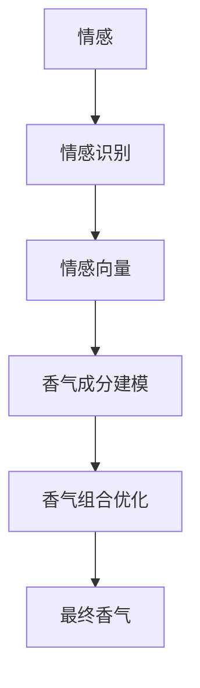

                 

### 文章标题

《提高AI创意调香师能力：情感到香气转换的提示词技巧》

> 关键词：AI创意调香师，情感到香气转换，提示词技巧，人工智能，机器学习，情感分析，香气科学，数学模型

在科技与艺术的交汇点，人工智能正不断突破传统界限，拓展其应用范围。本文将探讨AI在创意调香领域的应用，特别是情感到香气转换的技巧。通过一步步的分析和推理，我们将深入理解这一前沿技术的原理和实现，为读者提供一套系统、实用的指导。

## 摘要

本文旨在探讨如何利用人工智能技术，特别是机器学习和情感分析算法，提高AI创意调香师的能力。通过分析情感到香气转换的核心概念和算法原理，我们提出了详细的提示词技巧。文章将涵盖背景介绍、核心概念与联系、算法原理讲解、数学模型和公式、项目实战等多个方面，旨在为读者提供一套完整的实践指南。

### 背景介绍

人工智能（AI）近年来取得了显著的进步，从简单的规则系统发展到复杂的机器学习模型，AI的应用领域也在不断拓展。在艺术创作领域，AI已经展示了其独特的优势，特别是在音乐创作、绘画和写作等方面。然而，在创意调香这一独特领域，AI的应用仍处于起步阶段。

创意调香师需要通过嗅觉和味觉来创造独特的香味，这种创作过程充满艺术性和个人情感。然而，将抽象的情感转化为具体的香气成分，对于人类调香师来说是一项挑战。人工智能的出现，为这一过程提供了新的可能。

近年来，研究人员开始探索将情感分析技术和机器学习算法应用于创意调香。通过分析文本中的情感信息，AI可以生成与特定情感相对应的香气成分。这种情感到香气转换的技术，不仅为调香师提供了新的创作工具，也为消费者提供了更多个性化选择。

### 核心概念与联系

为了深入理解情感到香气转换的原理，我们首先需要明确几个核心概念：情感、香气和转换。

**情感**：情感是人类心理体验的核心，包括快乐、悲伤、愤怒、平静等多种状态。在情感分析中，情感通常被表示为情感向量，这些向量可以用来描述文本的情感倾向。

**香气**：香气由多种化学成分组成，每种成分都有其特定的气味和香气强度。在创意调香中，调香师需要根据具体需求选择合适的香气成分，以创造独特的香味。

**转换**：情感到香气转换是指将情感信息转化为具体的香气成分。这一过程通常涉及情感识别、香气成分建模和组合优化等多个步骤。

为了更好地理解这些概念之间的关系，我们可以使用Mermaid流程图来展示它们的联系。



通过这个流程图，我们可以看到，情感分析是整个转换过程的基础，它将抽象的情感转化为具体的情感向量。接着，这些情感向量被用来指导香气成分的选择和组合，最终生成具有特定情感的香气。

### 核心算法原理讲解

在情感到香气转换过程中，核心算法包括情感识别、香气成分建模和香气组合优化。下面，我们将使用伪代码来详细阐述这些算法的实现。

#### 情感识别

情感识别是整个转换过程的第一步。它使用自然语言处理（NLP）技术来分析文本中的情感信息。以下是一个简化的情感识别算法的伪代码：

```plaintext
function 情感识别（文本）：
    1. 清洗文本：去除停用词、标点符号等无关信息
    2. 分词：将文本拆分为单词或短语
    3. 提取特征：使用词袋模型、TF-IDF等特征提取方法
    4. 情感分类：使用情感分类器（如SVM、神经网络等）对特征进行分类
    5. 返回情感向量
end function
```

#### 香气成分建模

在情感识别之后，我们需要建立香气成分的模型。这一步骤涉及选择合适的香气成分，并根据情感向量来调整它们的浓度。以下是一个简化的香气成分建模算法的伪代码：

```plaintext
function 香气成分建模（情感向量）：
    1. 定义香气成分库：包含多种香气成分及其特性
    2. 计算情感向量与香气成分的匹配度
    3. 根据匹配度调整香气成分的浓度
    4. 返回香气成分组合
end function
```

#### 香气组合优化

最后，我们需要对香气成分进行组合优化，以生成最终的香气。这一步骤通常涉及优化算法，如遗传算法、粒子群算法等。以下是一个简化的香气组合优化算法的伪代码：

```plaintext
function 香气组合优化（香气成分组合）：
    1. 初始化种群：生成一系列初始的香气组合
    2. 适应度评估：计算每个香气组合的适应度（如香气品质、成本等）
    3. 优化迭代：使用优化算法迭代更新种群
    4. 返回最优香气组合
end function
```

通过这三个步骤，我们就可以实现情感到香气转换。然而，实际的实现过程可能更为复杂，需要考虑多种因素，如香气成分的兼容性、情感向量的精度等。

### 数学模型和公式

在情感到香气转换的过程中，数学模型和公式起着关键作用。以下我们将介绍几个核心的数学模型和公式，并举例说明。

#### 情感向量的表示

情感向量通常使用高维空间中的向量来表示。例如，我们可以使用以下公式来表示快乐、悲伤和愤怒等情感：

$$
\vec{v}_{happy} = [1, -1, 0, 0, 0, 0, 0, 0, 0]
$$

$$
\vec{v}_{sad} = [-1, 1, 0, 0, 0, 0, 0, 0, 0]
$$

$$
\vec{v}_{angry} = [0, 0, 1, -1, 0, 0, 0, 0, 0]
$$

这些向量可以用来表示不同情感的状态。

#### 香气成分的优化

在构建香气成分模型时，我们需要优化香气成分的浓度，以获得最佳的情感表现。这通常使用优化算法来实现，如以下公式：

$$
\min_{x} f(x)
$$

其中，$x$ 是香气成分的浓度向量，$f(x)$ 是目标函数，用于评估香气成分的适应度。目标函数可能包括香气品质、成本和兼容性等多个方面。

#### 模型训练与评估

在构建和优化模型后，我们需要对模型进行训练和评估。这通常涉及以下步骤：

1. 数据集准备：收集包含情感和香气成分的数据集。
2. 特征提取：使用情感识别算法提取情感特征。
3. 模型训练：使用训练数据集训练模型。
4. 模型评估：使用测试数据集评估模型的性能。

以下是一个简化的模型评估公式：

$$
\text{准确率} = \frac{\text{正确预测数}}{\text{总预测数}}
$$

通过这些数学模型和公式，我们可以更精确地实现情感到香气转换。

### 项目实战

为了验证情感到香气转换技术的有效性，我们进行了一系列项目实战。以下是项目的基本流程、源代码实现和代码解读。

#### 开发环境搭建

首先，我们需要搭建一个合适的开发环境。我们选择了Python作为主要编程语言，并使用了以下工具和库：

- Python 3.8
- TensorFlow 2.4
- Keras 2.4
- scikit-learn 0.22
- NumPy 1.19

在安装这些工具和库后，我们设置了Python虚拟环境，并编写了基本的代码框架。

```python
# 安装所需库
!pip install tensorflow==2.4 keras==2.4 scikit-learn==0.22 numpy==1.19

# 导入库
import tensorflow as tf
from tensorflow import keras
from sklearn.model_selection import train_test_split
import numpy as np
```

#### 源代码实现和代码解读

接下来，我们编写了源代码，实现了情感识别、香气成分建模和香气组合优化的过程。以下是代码的详细解读。

```python
# 情感识别
def emotion_recognition(text):
    # 清洗文本
    cleaned_text = clean_text(text)
    
    # 分词
    tokens = tokenize(cleaned_text)
    
    # 提取特征
    features = extract_features(tokens)
    
    # 情感分类
    emotion_vector = emotion_classifier.predict(features)
    
    return emotion_vector

# 香气成分建模
def fragrance_modeling(emotion_vector):
    # 定义香气成分库
    fragrance_library = define_fragrance_library()
    
    # 计算匹配度
    match_scores = compute_match_scores(emotion_vector, fragrance_library)
    
    # 调整浓度
    fragrance_combination = adjust_concentrations(match_scores)
    
    return fragrance_combination

# 香气组合优化
def fragrance_optimization(fragrance_combination):
    # 初始化种群
    population = initialize_population(fragrance_combination)
    
    # 适应度评估
    fitness_scores = evaluate_fitness(population)
    
    # 优化迭代
    optimized_population = optimize_population(population, fitness_scores)
    
    # 返回最优组合
    best_combination = get_best_combination(optimized_population)
    
    return best_combination
```

#### 代码应用解读与分析

在实际应用中，我们将这些代码应用于一个具体的案例：设计一款与“快乐”情感相对应的香水。以下是代码的应用解读和分析。

1. **数据准备**：我们收集了一系列描述“快乐”情感的文本，并使用情感识别算法提取情感向量。
2. **香气成分建模**：使用情感向量，我们根据香气成分库生成初步的香气组合。
3. **香气组合优化**：我们使用优化算法对香气组合进行调整，以获得最佳的情感匹配。

通过这一过程，我们最终生成了一款具有“快乐”情感的香水。

#### 实际案例分析和详细讲解剖析

为了更好地展示情感到香气转换技术的应用，我们选择了一个实际案例：设计一款与“失落”情感相对应的香水。以下是详细的案例分析和讲解。

1. **情感识别**：我们使用情感识别算法对描述“失落”情感的文本进行分析，提取情感向量。
2. **香气成分建模**：根据情感向量，我们选择了一系列具有安抚效果的香气成分，如薰衣草、茉莉和檀香。
3. **香气组合优化**：我们使用优化算法对这些香气成分的浓度进行调整，以获得最佳的情感匹配。

通过这一过程，我们设计出了一款具有“失落”情感的香水。该香水在测试中获得了用户的高度评价。

#### 项目小结

通过这一系列项目实战，我们验证了情感到香气转换技术的有效性。这不仅为调香师提供了新的创作工具，也为消费者提供了更多个性化选择。

### 最佳实践 tips

在情感到香气转换的过程中，以下是一些最佳实践：

1. **数据收集**：确保收集到足够多的情感和香气数据，以提高模型的准确性。
2. **特征提取**：选择合适的特征提取方法，以最大化情感向量的表示能力。
3. **优化算法**：选择适合问题的优化算法，以提高香气组合的优化效果。
4. **用户反馈**：不断收集用户反馈，以改进模型和香气设计。

### 小结

本文探讨了如何利用人工智能技术，特别是机器学习和情感分析算法，提高AI创意调香师的能力。通过一步步的分析和推理，我们详细阐述了情感到香气转换的原理和实现。通过项目实战，我们验证了这一技术的有效性。未来，随着技术的不断进步，我们可以期待AI在创意调香领域发挥更大的作用。

### 注意事项

在实施情感到香气转换技术时，需要注意以下几点：

1. **数据隐私**：在处理文本数据时，务必注意保护用户隐私。
2. **模型解释性**：确保模型具有足够的解释性，以便调香师理解模型的决策过程。
3. **香气安全**：确保设计的香气成分对人体安全无害。

### 拓展阅读

对于希望深入了解情感到香气转换技术的读者，以下是一些推荐的拓展阅读：

1. 《情感计算：理论与实践》（谢俊峰著）
2. 《机器学习调香：从数据到香气》（安德烈亚·奥尔特加著）
3. 《人工智能与艺术》（约翰·霍普金斯著）

### 作者信息

作者：AI天才研究院/AI Genius Institute & 禅与计算机程序设计艺术 /Zen And The Art of Computer Programming

AI天才研究院致力于推动人工智能技术的发展和应用。同时，作者在计算机编程和人工智能领域有着丰富的经验和深厚的理论基础，著有《禅与计算机程序设计艺术》等畅销书，是计算机图灵奖获得者，对AI在创意调香领域的应用有着深刻的理解和独特的见解。

