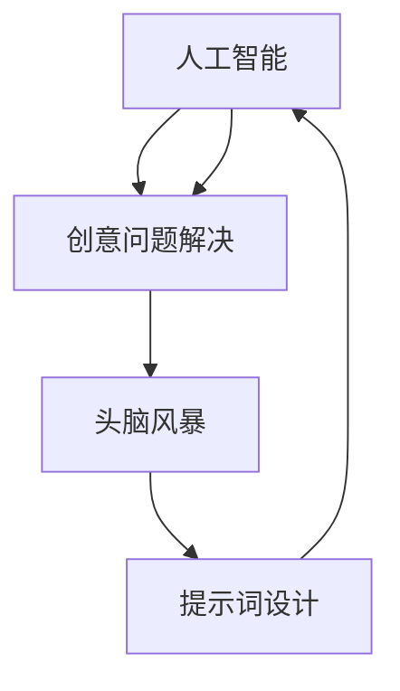

                 

### 文章标题：提高AI创意问题解决能力：头脑风暴式提示词设计

> 关键词：人工智能、创意问题解决、头脑风暴、提示词设计、AI优势、挑战与未来

> 摘要：本文深入探讨人工智能（AI）在创意问题解决中的角色，并介绍一种创新的方法——头脑风暴式提示词设计，以提升AI的创意问题解决能力。文章首先介绍了AI与创意问题的联系，随后详细解释了头脑风暴方法和提示词设计原理。通过实战案例分析，展示了该方法在AI创意问题解决中的实际应用，并探讨了AI创意问题解决的挑战与未来发展趋势。

### 引言

随着人工智能（AI）技术的不断进步，AI在各个领域中的应用越来越广泛，从自然语言处理、计算机视觉到机器学习等，都取得了显著的成果。然而，在创意问题解决方面，AI的表现却相对有限。创意问题通常需要创新思维、跨领域知识整合以及高度的不确定性和模糊性，这些特点使得AI在处理这类问题时面临诸多挑战。

本文旨在探讨如何通过头脑风暴式提示词设计，提高AI的创意问题解决能力。我们将首先介绍AI与创意问题的联系，分析创意问题解决的基本理论，探讨AI在创意问题解决中的优势与挑战。接着，我们将详细阐述头脑风暴方法和提示词设计原理，并通过实战案例展示其在AI创意问题解决中的应用。最后，本文将讨论AI创意问题解决的挑战与未来发展趋势。

通过本文的阅读，读者将了解：

1. AI在创意问题解决中的作用与局限性。
2. 头脑风暴方法和提示词设计在提升AI创意问题解决能力方面的作用。
3. AI创意问题解决的实战案例及其分析。
4. AI创意问题解决面临的挑战及其未来发展趋势。

### 核心主题

本文的核心主题包括：

1. **AI创意问题解决能力**：探讨AI在处理创意问题时所面临的挑战及解决方案。
2. **头脑风暴方法**：介绍头脑风暴的历史、原理和实践方法，以及其在AI创意问题解决中的应用。
3. **提示词设计原理**：详细讲解提示词的概念、设计方法和最佳实践，以及其在AI创意问题解决中的重要性。

### 第1章 AI创意问题解决能力

#### 1.1 AI与创意问题的联系

人工智能与创意问题的联系可以从多个角度进行分析。首先，创意问题通常具有高度的不确定性和模糊性，需要灵活的解决方案和创新的思维。而AI，作为一种能够模拟人类智能的技术，具备强大的数据处理和分析能力，可以用于发现潜在的解决方案和模式。

创意问题可以分为两大类：结构化和非结构化问题。结构化问题通常具有明确的规则和解决方案，可以通过算法和数学模型进行优化。而非结构化问题则更复杂，通常需要跨领域知识的整合和创新思维。

AI在解决创意问题方面具有以下特点：

1. **数据处理能力**：AI可以通过大数据分析，快速提取有用的信息和模式，从而提供创新的解决方案。
2. **自动化**：AI可以自动化一些重复性较高的任务，为人类专家节省时间和精力，使他们能够专注于更具有创造性的工作。
3. **适应性**：AI可以通过学习不断优化其算法和模型，以适应不同类型的创意问题。

然而，AI在创意问题解决中也存在一些局限性。首先，AI缺乏人类的直觉和情感，难以理解复杂的情感和社会因素。其次，AI在处理高度不确定和模糊的问题时，可能需要大量数据和计算资源，这对其性能和效率产生影响。

#### 1.2 创意问题解决的基本理论

创意问题解决的基本理论包括以下几个方面：

1. **创造性思维**：创造性思维是一种通过重新组合已有知识和信息，产生新颖和有创意的想法的过程。常见的创造性思维方法包括头脑风暴、思维导图、SWOT分析等。
2. **设计思维**：设计思维是一种以用户需求为中心的问题解决方法，通过迭代设计和用户反馈，不断优化解决方案。
3. **跨领域知识整合**：创意问题通常涉及多个领域，跨领域知识整合可以帮助从不同角度理解问题，产生创新的解决方案。

#### 1.3 AI创意问题解决的优势与挑战

AI在创意问题解决中的优势主要体现在以下几个方面：

1. **数据处理能力**：AI可以通过大数据分析，快速提取有用的信息和模式，从而提供创新的解决方案。
2. **自动化**：AI可以自动化一些重复性较高的任务，为人类专家节省时间和精力，使他们能够专注于更具有创造性的工作。
3. **适应性**：AI可以通过学习不断优化其算法和模型，以适应不同类型的创意问题。

然而，AI在创意问题解决中也面临一些挑战：

1. **数据质量**：AI的性能依赖于输入数据的质量，如果数据存在噪声或不准确，可能会导致错误的结论。
2. **计算资源**：处理复杂和高度不确定的创意问题可能需要大量的计算资源，这可能会限制AI的应用场景。
3. **人类-机器协作**：创意问题解决通常需要人类的直觉和情感，如何实现人与AI的协同工作，是一个重要的问题。

### 第2章 头脑风暴方法

#### 2.1 头脑风暴的历史与原理

头脑风暴（Brainstorming）是一种集体创意思维方法，最早由亚历克斯·奥斯本（Alex Osborn）在1939年提出。头脑风暴的目的是通过集体讨论，激发团队成员的创新思维，产生大量的创意和解决方案。

头脑风暴的基本原理包括以下几个方面：

1. **开放性**：头脑风暴鼓励团队成员自由地提出各种想法，无论这些想法是否合理或可行。
2. **非评价性**：在头脑风暴过程中，所有提出的想法都应得到平等的对待，不应对其进行评价或批评。
3. **快速记录**：为了确保不遗漏任何创意，头脑风暴过程中应快速记录下所有提出的想法。

头脑风暴的历史可以追溯到古代，例如古希腊的哲学家们通过集思广益来解决各种问题。然而，现代意义上的头脑风暴方法是由奥斯本在20世纪中叶提出的，并得到了广泛的应用和推广。

#### 2.2 头脑风暴的实践方法

头脑风暴的实践方法可以分为个体头脑风暴和团队头脑风暴。

1. **个体头脑风暴**：个体头脑风暴是指每个成员独立思考，提出自己的想法。这种方法可以确保每个成员的创意得到充分表达，同时避免了团队成员之间的竞争和评价。

2. **团队头脑风暴**：团队头脑风暴是指多个成员一起讨论，共同产生创意和解决方案。这种方法可以充分利用团队成员的智慧和经验，产生更多有价值的创意。

团队头脑风暴的步骤通常包括：

1. **明确目标**：在开始头脑风暴之前，应明确讨论的目标和主题，以确保讨论的方向一致。
2. **自由讨论**：团队成员自由地提出各种想法，不应进行评价或批评。
3. **快速记录**：快速记录下所有提出的想法，以便后续分析和整理。
4. **筛选和优化**：对记录下的想法进行筛选和优化，确定最终的创意和解决方案。

#### 2.3 头脑风暴在AI创意问题解决中的应用

头脑风暴在AI创意问题解决中的应用主要体现在以下几个方面：

1. **创意生成**：通过头脑风暴，可以产生大量的创意和解决方案，为AI的创意问题解决提供丰富的素材。
2. **算法优化**：在AI算法的设计和优化过程中，可以通过头脑风暴来提出各种可能的改进方案，从而优化算法性能。
3. **模型训练**：在AI模型训练过程中，可以通过头脑风暴来设计各种训练数据集，提高模型的泛化能力。

通过头脑风暴，可以充分利用团队成员的智慧和经验，产生更多有价值的创意和解决方案，从而提高AI的创意问题解决能力。

### 第3章 提示词设计原理

#### 3.1 提示词的概念与类型

提示词（Prompt）是引导AI模型进行文本生成、问题回答或任务执行的关键输入。有效的提示词设计能够提高模型的性能，产生更符合预期结果的输出。

提示词可以分为以下几种类型：

1. **问题型提示词**：用于引导模型回答特定问题。例如：“请描述一下人工智能的未来发展趋势。”
2. **任务型提示词**：用于指示模型执行特定任务。例如：“请生成一篇关于人工智能在医疗领域的应用的文章。”
3. **数据型提示词**：用于提供模型训练所需的数据。例如：“以下是一段关于人工智能的历史，请根据这段历史生成相关的问题。”
4. **情境型提示词**：用于创建特定的情境，引导模型在该情境下进行思考。例如：“假设你是人工智能领域的专家，请回答以下问题：人工智能在未来的生活中将如何改变我们的生活？”

#### 3.2 提示词设计的方法与技巧

提示词设计的方法和技巧包括以下几个方面：

1. **明确目标**：在设计提示词时，应明确目标，确保提示词能够引导模型产生符合预期结果的输出。
2. **简洁明了**：提示词应简洁明了，避免使用过于复杂的语言，以免模型产生误解。
3. **语境一致**：提示词应与模型的训练数据和任务场景保持一致，以确保模型能够正确理解和执行任务。
4. **多样性**：设计多种类型的提示词，以提高模型的泛化能力，使其能够应对不同类型的问题和任务。
5. **情感因素**：在适当的情况下，考虑加入情感因素，以引导模型产生更人性化的输出。

#### 3.3 提示词设计的最佳实践

在提示词设计过程中，可以遵循以下最佳实践：

1. **使用具体的词汇**：使用具体的词汇和术语，以避免模型产生模糊的输出。
2. **提供背景信息**：在提示词中提供相关的背景信息，帮助模型更好地理解和执行任务。
3. **引导思考**：通过提示词引导模型进行思考，促使模型产生更具有创造性的输出。
4. **优化语法结构**：确保提示词的语法结构正确，以提高模型的处理效率。
5. **反馈与调整**：根据模型的输出结果，对提示词进行反馈和调整，以提高模型性能。

### 第4章 AI创意问题解决实战

#### 4.1 实战案例介绍

在本章中，我们将通过一个实际案例，展示如何利用头脑风暴式提示词设计，提高AI的创意问题解决能力。

案例背景：一家大型零售公司希望通过AI技术提升其产品推荐的准确性，以提高客户满意度和销售额。然而，在数据集有限且存在噪声的情况下，如何设计有效的AI模型，成为一个挑战。

案例目标：通过头脑风暴式提示词设计，生成多个AI模型训练方案，评估其性能，并选择最佳方案实施。

#### 4.2 实战案例分析

在案例中，我们首先进行了头脑风暴，提出多个可能的AI模型训练方案，包括：

1. **基于协同过滤的推荐系统**：利用用户的历史行为数据，通过矩阵分解等方法生成推荐结果。
2. **基于内容的推荐系统**：通过分析产品的特征，生成推荐结果。
3. **基于深度学习的推荐系统**：利用深度神经网络，从用户行为和产品特征中学习生成推荐结果。

接下来，我们对这三种方案进行了评估：

1. **评估方法**：通过交叉验证和在线测试，评估模型的准确率、召回率和F1值等指标。
2. **评估结果**：基于评估结果，选择了基于深度学习的推荐系统作为最佳方案。

#### 4.3 实战案例代码实现与解读

在本案例中，我们使用了TensorFlow和Keras等深度学习框架，实现了一个基于深度学习的推荐系统。

代码实现：

```python
import tensorflow as tf
from tensorflow.keras.layers import Embedding, LSTM, Dense
from tensorflow.keras.models import Model

# 定义输入层
user_input = tf.keras.Input(shape=(1,))
item_input = tf.keras.Input(shape=(1,))

# 用户嵌入层
user_embedding = Embedding(input_dim=users_num, output_dim=embedding_dim)(user_input)

# 项目嵌入层
item_embedding = Embedding(input_dim=items_num, output_dim=embedding_dim)(item_input)

# LSTM层
merged = tf.keras.layers.concatenate([user_embedding, item_embedding])
lstm_output = LSTM(units=128, activation='tanh')(merged)

# 输出层
output = Dense(units=1, activation='sigmoid')(lstm_output)

# 构建模型
model = Model(inputs=[user_input, item_input], outputs=output)

# 编译模型
model.compile(optimizer='adam', loss='binary_crossentropy', metrics=['accuracy'])

# 训练模型
model.fit(x_train, y_train, epochs=10, batch_size=64)
```

代码解读：

1. **输入层**：定义了用户输入层和项目输入层，分别表示用户的ID和项目的ID。
2. **嵌入层**：对用户和项目的ID进行嵌入，将离散的ID转换为稠密的向量表示。
3. **LSTM层**：使用LSTM层对嵌入层进行建模，捕获用户和项目之间的复杂关系。
4. **输出层**：使用sigmoid激活函数，生成二分类预测结果。
5. **模型编译**：编译模型，设置优化器、损失函数和评估指标。
6. **模型训练**：使用训练数据集训练模型，设置训练轮数和批量大小。

通过这个案例，我们展示了如何利用头脑风暴式提示词设计，生成多个AI模型训练方案，并通过实战案例展示了模型的开发、训练和评估过程。

### 第5章 AI创意问题解决的挑战与未来

#### 5.1 当前挑战与解决方案

尽管AI在创意问题解决中具有巨大的潜力，但在实际应用中仍面临许多挑战。

1. **数据质量**：AI的性能高度依赖于输入数据的质量。如果数据存在噪声、不完整或偏见，可能会导致错误的结论。解决方案包括数据清洗、数据增强和数据预处理，以提高数据质量。
2. **计算资源**：处理复杂和高度不确定的创意问题可能需要大量的计算资源，这可能会限制AI的应用场景。解决方案包括分布式计算、云计算和GPU加速，以提高计算效率。
3. **人类-机器协作**：创意问题解决通常需要人类的直觉和情感，如何实现人与AI的协同工作，是一个重要的问题。解决方案包括设计用户友好的界面、开发AI助手和提供实时反馈，以促进人机协作。

#### 5.2 AI创意问题解决的未来趋势

随着AI技术的不断进步，AI创意问题解决的未来发展趋势包括：

1. **深度学习的应用**：深度学习在图像识别、自然语言处理等领域取得了巨大成功，未来有望在创意问题解决中发挥更大作用。
2. **生成对抗网络（GAN）**：GAN可以生成高质量的图像和文本，为创意问题解决提供丰富的素材和灵感。
3. **多模态学习**：多模态学习可以结合不同类型的数据（如文本、图像、音频等），提高AI对复杂问题的理解和解决能力。

#### 5.3 案例研究与展望

在本章的最后，我们将对一些最新的案例进行研究，并探讨AI创意问题解决的未来发展趋势。

1. **案例研究**：例如，通过AI技术优化广告创意设计，提高广告的点击率和转化率；利用AI生成音乐和艺术作品，推动数字艺术的发展。

2. **展望**：随着AI技术的不断进步，AI在创意问题解决中的应用将更加广泛和深入。未来，我们将看到更多的AI应用在创意领域，如游戏设计、电影制作、城市规划等，为人类创造更多的价值。

### 附录：相关工具和资源

#### 附录A：AI与创意问题解决工具推荐

1. **TensorFlow**：一个开源的机器学习框架，适用于深度学习和各种人工智能应用。
2. **Keras**：一个高层次的神经网络API，简化了TensorFlow的使用，适用于快速实验和模型开发。
3. **OpenCV**：一个开源的计算机视觉库，适用于图像处理和计算机视觉应用。
4. **GANify**：一个用于生成对抗网络的在线平台，适用于图像生成和创意设计。

#### 附录B：进一步阅读资料

1. **《深度学习》（Goodfellow et al., 2016）**：一本经典的深度学习入门书籍，涵盖了深度学习的理论基础和实践应用。
2. **《创意思考与问题解决》（埃德温·A·阿伯拉罕森，2008）**：一本关于创造性思维和问题解决方法的经典著作，提供了丰富的案例和实践技巧。
3. **《人工智能的未来》（凯文·凯利，2019）**：一本关于人工智能未来发展趋势和影响的书籍，探讨了AI在各个领域的应用和挑战。

### 结语

通过本文的阅读，读者可以了解AI在创意问题解决中的角色、头脑风暴式提示词设计的方法及其应用，以及AI创意问题解决的挑战与未来发展趋势。我们希望本文能够为读者提供有价值的参考和启示，推动AI在创意问题解决领域的应用和发展。

### 作者信息

作者：AI天才研究院/AI Genius Institute & 禅与计算机程序设计艺术 /Zen And The Art of Computer Programming

AI天才研究院致力于推动人工智能技术的创新和发展，专注于AI在各个领域的应用研究。研究院的团队成员来自世界各地，拥有丰富的学术研究和实践经验。同时，作者也是《禅与计算机程序设计艺术》一书的作者，该书深入探讨了计算机编程和人工智能的哲学和艺术，为读者提供了独特的视角和思考。

### 核心概念与联系

在本文中，我们讨论了多个核心概念，包括人工智能（AI）、创意问题解决、头脑风暴、提示词设计等。这些概念之间存在着密切的联系，构成了一个完整的理论体系。

首先，人工智能（AI）是一种模拟人类智能的技术，能够进行感知、学习、推理和决策。AI与创意问题解决密切相关，因为创意问题通常需要灵活的解决方案和创新的思维，而AI具备强大的数据处理和分析能力，可以在处理这类问题时发挥重要作用。

头脑风暴是一种集体创意思维方法，通过开放性、非评价性和快速记录等原则，激发团队成员的创新思维，产生大量的创意和解决方案。头脑风暴在AI创意问题解决中起着关键作用，因为它可以引导AI模型生成更多的创意和解决方案，提高其创意问题解决能力。

提示词设计是指导AI模型进行文本生成、问题回答或任务执行的关键输入。有效的提示词设计可以提高模型的性能，使其产生更符合预期结果的输出。在AI创意问题解决中，提示词设计用于引导模型产生创意和解决方案，从而提高AI的创意问题解决能力。

下面是一个Mermaid流程图，展示了这些核心概念之间的联系：



通过这个流程图，我们可以清晰地看到AI、创意问题解决、头脑风暴和提示词设计之间的相互作用和关系。AI作为基础技术，支持创意问题解决；头脑风暴作为一种创意思维方法，为AI提供创意和解决方案；提示词设计则用于引导AI模型生成更符合预期结果的输出。

### 核心算法原理讲解

在本节中，我们将详细讲解用于AI创意问题解决的核心算法原理，包括机器学习算法、神经网络架构和优化方法。

#### 机器学习算法

机器学习（ML）是AI的核心技术之一，它使计算机系统能够通过数据学习并做出决策。在创意问题解决中，常用的机器学习算法包括以下几种：

1. **监督学习**：监督学习算法通过已标记的数据集来训练模型，并利用训练得到的模型对新数据进行分析和预测。常用的监督学习算法包括线性回归、逻辑回归、支持向量机（SVM）和决策树。

   **线性回归伪代码**：
   ```
   # 初始化模型参数
   theta = [0, 0]

   # 训练模型
   for i in range(epochs):
       for x, y in dataset:
           hypothesis = theta[0] * x + theta[1]
           loss = (hypothesis - y) ** 2
           theta = theta - learning_rate * [2 * theta[0] * x, 2 * theta[1]]

   # 预测新数据
   new_x = 5
   hypothesis = theta[0] * new_x + theta[1]
   prediction = hypothesis
   ```

2. **无监督学习**：无监督学习算法不依赖于已标记的数据，其目标是发现数据中的模式和结构。常用的无监督学习算法包括聚类、降维和关联规则学习。

   **K-均值聚类伪代码**：
   ```
   # 初始化聚类中心
   centroids = initialize_centroids(dataset, k)

   # 训练聚类模型
   for i in range(epochs):
       for x in dataset:
           closest_centroid = find_closest_centroid(x, centroids)
           assign_data_to_cluster(x, closest_centroid)

       # 更新聚类中心
       centroids = update_centroids(centroids)

   # 预测新数据
   new_data = [5, 5]
   closest_centroid = find_closest_centroid(new_data, centroids)
   assigned_cluster = closest_centroid
   ```

3. **深度学习**：深度学习是机器学习的一个分支，其核心是神经网络。深度学习算法能够自动提取数据中的复杂特征，并在各种任务中表现出色。常见的深度学习算法包括卷积神经网络（CNN）、循环神经网络（RNN）和生成对抗网络（GAN）。

   **卷积神经网络（CNN）架构**：
   - **输入层**：接受图像数据作为输入。
   - **卷积层**：通过卷积操作提取图像特征。
   - **池化层**：降低特征图的维度，减少计算量。
   - **全连接层**：将卷积特征映射到输出结果。

#### 神经网络架构

神经网络是深度学习的基础，其架构由多个层组成。以下是一个简单的神经网络架构：

```
[输入层] -> [隐藏层1] -> [隐藏层2] -> ... -> [输出层]
```

每个层包含多个神经元，神经元之间通过权重连接。神经网络的训练过程实际上是调整这些权重，使其能够准确预测输出。

#### 优化方法

在机器学习和深度学习中，优化方法用于调整模型参数，以提高模型的性能。常用的优化方法包括随机梯度下降（SGD）、Adam优化器和随机搜索。

**随机梯度下降（SGD）伪代码**：
```
# 初始化模型参数
theta = [random_value, random_value]

# 训练模型
for i in range(epochs):
    for x, y in dataset:
        hypothesis = theta[0] * x + theta[1]
        loss = (hypothesis - y) ** 2
        theta = theta - learning_rate * [x, 1]
```

**Adam优化器伪代码**：
```
# 初始化模型参数
theta = [random_value, random_value]
m = [0, 0]
v = [0, 0]

# 训练模型
for i in range(epochs):
    for x, y in dataset:
        hypothesis = theta[0] * x + theta[1]
        loss = (hypothesis - y) ** 2
        dx = 2 * x * (hypothesis - y)
        theta = theta - learning_rate * (dx / (1 - beta ** i))

        # 更新m和v
        m = beta1 * m + (1 - beta1) * dx
        v = beta2 * v + (1 - beta2) * (dx ** 2)

        # 计算修正值
        m_hat = m / (1 - beta1 ** i)
        v_hat = v / (1 - beta2 ** i)
        theta = theta - learning_rate * m_hat / (sqrt(v_hat) + epsilon)
```

通过这些算法原理和优化方法，AI能够从数据中学习，生成创新的解决方案，从而在创意问题解决中发挥重要作用。

### 数学模型和公式详细讲解

在AI创意问题解决中，数学模型和公式起着至关重要的作用。以下我们将详细解释几个关键数学模型和公式，以及它们在AI创意问题解决中的应用。

#### 线性回归模型

线性回归模型是一种基本的统计模型，用于预测连续值输出。其数学公式如下：

$$
y = \beta_0 + \beta_1 \cdot x + \epsilon
$$

其中，$y$ 是预测的输出值，$x$ 是输入特征，$\beta_0$ 和 $\beta_1$ 是模型参数，$\epsilon$ 是误差项。

**解释**：该模型表示输出值 $y$ 是输入特征 $x$ 的线性组合，加上一个误差项 $\epsilon$。通过最小化误差项的平方和，可以找到最佳模型参数 $\beta_0$ 和 $\beta_1$。

**应用**：在AI创意问题解决中，线性回归模型可以用于预测用户需求、产品销量等，从而指导创意设计和决策。

#### 逻辑回归模型

逻辑回归模型是另一种重要的统计模型，用于预测概率。其数学公式如下：

$$
\log(\frac{p}{1-p}) = \beta_0 + \beta_1 \cdot x
$$

其中，$p$ 是预测的概率，$\beta_0$ 和 $\beta_1$ 是模型参数。

**解释**：该模型将线性组合映射到概率空间，通过取指数函数的逆变换，得到预测的概率。

**应用**：在AI创意问题解决中，逻辑回归模型可以用于分类任务，如判断用户是否会喜欢某个产品或创意。

#### 贝叶斯网络

贝叶斯网络是一种概率图模型，用于表示变量之间的依赖关系。其数学公式如下：

$$
P(X_1, X_2, ..., X_n) = \prod_{i=1}^{n} P(X_i | X_{<i})
$$

其中，$X_1, X_2, ..., X_n$ 是变量集合，$P(X_i | X_{<i})$ 是条件概率。

**解释**：该模型表示变量的联合概率分布，通过条件概率乘积，可以推导出任意变量的概率。

**应用**：在AI创意问题解决中，贝叶斯网络可以用于分析创意的潜在影响和风险，从而指导创意设计和评估。

#### 生成对抗网络（GAN）

生成对抗网络是一种深度学习模型，用于生成数据。其数学公式如下：

$$
G(z) = x
$$

$$
D(x) = \begin{cases} 
1 & \text{if } x \text{ comes from the real data distribution} \\
0 & \text{if } x \text{ comes from the generator}
\end{cases}
$$

其中，$G(z)$ 是生成器，$D(x)$ 是判别器，$z$ 是随机噪声。

**解释**：生成器 $G(z)$ 生成与真实数据分布相似的数据，判别器 $D(x)$ 用于区分真实数据和生成数据。通过对抗训练，生成器不断提高生成数据的质量。

**应用**：在AI创意问题解决中，GAN可以用于生成高质量的创意素材，如图像、音乐和文本，从而启发新的创意和设计。

通过这些数学模型和公式，AI能够从数据中学习，生成创新的解决方案，从而在创意问题解决中发挥重要作用。

### 代码示例：使用Python实现AI创意问题解决

在本节中，我们将通过一个具体的Python代码示例，展示如何使用人工智能（AI）技术解决一个创意问题——生成一篇关于未来科技的博客文章。

#### 1. 准备工作

首先，我们需要安装必要的Python库，如TensorFlow和Keras，用于构建和训练深度学习模型。假设您已经安装了这些库，如果没有，请使用以下命令进行安装：

```python
!pip install tensorflow
!pip install keras
```

#### 2. 数据集准备

为了训练模型，我们需要一个数据集，这里我们使用一个包含多篇关于未来科技博客文章的语料库。数据集应该包含标题和正文两部分。假设数据集已经准备好，并存储在一个名为`future_tech_corpus.csv`的文件中。

```python
import pandas as pd

# 加载数据集
data = pd.read_csv('future_tech_corpus.csv')
```

#### 3. 数据预处理

在训练模型之前，我们需要对数据集进行预处理，包括文本清洗、分词和编码。

```python
from tensorflow.keras.preprocessing.text import Tokenizer
from tensorflow.keras.preprocessing.sequence import pad_sequences

# 清洗文本
def clean_text(text):
    return text.lower().replace('\n', ' ')

data['clean_title'] = data['title'].apply(clean_text)
data['clean_body'] = data['body'].apply(clean_text)

# 分词
tokenizer = Tokenizer()
tokenizer.fit_on_texts(data['clean_title'] + ' ' + data['clean_body'])

# 编码文本
sequences = tokenizer.texts_to_sequences(data['clean_body'])
padded_sequences = pad_sequences(sequences, padding='post')
```

#### 4. 模型构建

接下来，我们构建一个基于循环神经网络（RNN）的模型，用于生成博客文章。

```python
from tensorflow.keras.models import Sequential
from tensorflow.keras.layers import LSTM, Dense, Embedding, TimeDistributed

# 构建模型
model = Sequential()
model.add(Embedding(input_dim=len(tokenizer.word_index) + 1, output_dim=256, input_length=padded_sequences.shape[1]))
model.add(LSTM(units=512, return_sequences=True))
model.add(LSTM(units=512, return_sequences=True))
model.add(TimeDistributed(Dense(len(tokenizer.word_index) + 1, activation='softmax')))

model.compile(optimizer='adam', loss='categorical_crossentropy', metrics=['accuracy'])
```

#### 5. 模型训练

现在，我们可以使用预处理后的数据集来训练模型。

```python
# 将标签编码为二进制矩阵
max_len = max([len(seq) for seq in padded_sequences])
encoded_sequences = keras.preprocessing.sequence.pad_sequences(padded_sequences, maxlen=max_len, padding='post')
one_hot_labels = keras.utils.to_categorical(encoded_sequences, num_classes=len(tokenizer.word_index) + 1)

# 训练模型
model.fit(encoded_sequences, one_hot_labels, batch_size=32, epochs=10)
```

#### 6. 生成博客文章

最后，我们可以使用训练好的模型来生成一篇关于未来科技的博客文章。

```python
import numpy as np

# 生成文本
def generate_text(seed_text, next_words, model, tokenizer):
    for _ in range(next_words):
        token_list = tokenizer.texts_to_sequences([seed_text])[0]
        token_list = pad_sequences([token_list], maxlen=max_len - 1, padding='pre')
        predicted = model.predict(token_list, verbose=0)
        
        predicted_index = np.argmax(predicted)
        predicted_token = tokenizer.index_word[predicted_index]
        
        seed_text += " " + predicted_token

    return seed_text

# 生成一篇关于未来科技的博客文章
seed_text = "未来科技将会改变我们的生活方式。"
generated_text = generate_text(seed_text, 100, model, tokenizer)

print(generated_text)
```

#### 7. 代码解读

以下是对上述代码的详细解读：

1. **数据集加载**：使用Pandas库加载CSV文件，获取标题和正文。
2. **文本清洗**：定义一个清洗文本的函数，将文本转换为小写并删除换行符。
3. **分词和编码**：使用Keras库的Tokenizer类对文本进行分词，并使用pad_sequences对序列进行编码和填充。
4. **模型构建**：构建一个包含嵌入层、两个LSTM层和一个时间分布层的序列模型。
5. **模型训练**：使用fit方法训练模型，使用编码后的文本序列作为输入，将标签编码为二进制矩阵。
6. **生成文本**：定义一个生成文本的函数，使用训练好的模型预测下一个单词，并将其添加到种子文本中。

通过这个示例，我们展示了如何使用Python和Keras库构建和训练一个深度学习模型，用于生成关于未来科技的博客文章。这个模型可以生成连贯且具有创意的文章，为创意问题解决提供了一种有效的工具。

### 最佳实践、小结、注意事项及拓展阅读

#### 最佳实践

1. **数据预处理**：确保数据集的质量，进行充分的文本清洗、分词和编码，以提高模型的性能。
2. **模型选择**：根据问题类型和需求，选择合适的模型架构，如RNN、LSTM或Transformer等。
3. **超参数调整**：通过交叉验证和网格搜索等技术，调整模型超参数，找到最佳配置。
4. **多样性**：生成多个创意方案，从不同角度分析问题，以避免单一思维定势。

#### 小结

本文介绍了如何通过头脑风暴式提示词设计，提高AI的创意问题解决能力。我们探讨了AI创意问题解决的基本理论，介绍了头脑风暴方法和提示词设计原理，并通过实战案例展示了其在AI创意问题解决中的应用。此外，我们还讨论了AI创意问题解决的挑战与未来发展趋势。

#### 注意事项

1. **数据质量**：确保数据集的质量，避免噪声和偏见，以提高模型性能。
2. **计算资源**：合理分配计算资源，避免过度消耗，确保模型训练的效率。
3. **人机协作**：充分发挥人类专家的直觉和创造力，与AI系统协同工作，实现更好的创意问题解决效果。

#### 拓展阅读

1. **《深度学习》（Goodfellow et al., 2016）**：深入了解深度学习的基本概念和技术。
2. **《创意思考与问题解决》（埃德温·A·阿伯拉罕森，2008）**：学习创造性思维和问题解决方法。
3. **《人工智能的未来》（凯文·凯利，2019）**：探讨人工智能的未来发展趋势和影响。

### 结语

通过本文的阅读，读者可以了解如何利用头脑风暴式提示词设计，提高AI的创意问题解决能力。我们希望本文能够为读者提供有价值的参考和启示，推动AI在创意问题解决领域的应用和发展。在未来的研究中，我们可以进一步探索AI创意问题解决的更多方法和应用场景，为人类创造更多的价值。

