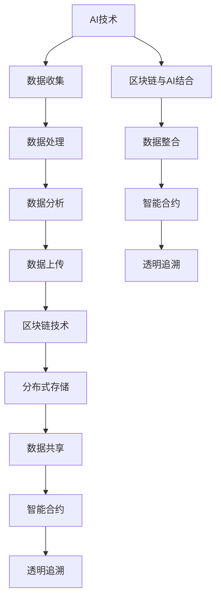

                 

### 文章标题：提高AI创意香水原料可追溯性：区块链技术应用的提示词技巧

#### 关键词：AI，区块链，香水原料，可追溯性，技术实现，挑战与展望

#### 摘要：
本文旨在探讨如何利用区块链技术提高AI创意香水原料的可追溯性。通过分析背景、核心概念、技术原理及实际应用案例，本文将详细阐述如何将AI和区块链技术结合，以构建一个高度透明和可信的香水原料追溯系统。文章还将讨论实现这一系统的技术细节、面临的挑战以及未来的发展方向。

### 引言

在现代快节奏的生活中，消费者对于产品质量和透明度的需求日益增长。特别是在香水行业，消费者不仅关心香水本身的质量，更希望了解其原料的来源和制作过程。然而，传统的供应链管理往往存在信息不对称、数据不透明等问题，导致消费者难以获得准确的原料追溯信息。为了解决这一问题，人工智能（AI）和区块链技术的应用成为一种新兴的趋势。

AI技术以其强大的数据处理和分析能力，可以在供应链中收集、处理和分析大量数据，从而提供更加精确和实时的追溯信息。而区块链技术则以其去中心化、不可篡改和透明性等特点，为数据的安全存储和追溯提供了可靠的技术保障。

本文将围绕这一主题展开，首先介绍AI和区块链技术的核心概念和原理，然后探讨它们在香水原料可追溯性中的应用，并详细阐述如何实现一个基于AI和区块链的追溯系统。同时，本文还将分析当前面临的技术挑战，并展望未来的发展方向。

### 背景介绍

#### 1. 香水原料供应链的挑战

香水原料供应链是一个复杂且高度多样化的系统，涉及从植物提取物到化学合成物质的多种成分。传统的香水原料供应链通常包括多个环节，如种植、提取、加工、储存、运输和分销。在这些环节中，信息的不对称性和数据的缺失导致了以下几个主要问题：

- **信息不对称**：供应链中的各个环节通常由不同的实体控制，彼此之间的信息交流不畅，导致信息的滞后和不对称。例如，消费者无法直接获取到香水原料的种植地、种植条件以及加工过程等信息。
- **数据缺失**：由于缺乏统一的数据标准和追溯系统，供应链中的许多环节无法记录和存储关键数据。这导致追溯信息的不完整，使得供应链的可追溯性受到限制。
- **信任问题**：消费者对香水原料的真实性和质量存在担忧，尤其是在面对假冒伪劣产品时。传统的供应链管理模式无法提供足够的信任保障。

#### 2. AI技术对香水原料供应链的改进

人工智能技术在数据收集、处理和分析方面具有显著优势，可以为香水原料供应链的追溯提供强有力的支持。以下是AI技术如何改进香水原料供应链的几个方面：

- **数据收集**：AI技术可以通过物联网（IoT）设备收集供应链各环节的数据，如温度、湿度、光照、土壤质量等。这些数据可以实时上传到系统中，为追溯提供基础数据支持。
- **数据处理**：AI技术能够处理和分析大量的数据，发现数据中的规律和模式。例如，通过机器学习算法分析种植数据，可以预测最佳的种植时间和条件，从而提高原料的质量和产量。
- **质量检测**：AI技术可以通过图像识别、声音识别等技术对香水原料进行质量检测。例如，使用图像识别技术检测植物提取物中的杂质，使用声音识别技术检测化学合成物质中的成分。

#### 3. 区块链技术对香水原料供应链的改进

区块链技术以其去中心化、不可篡改和透明性等特点，为香水原料供应链的追溯提供了新的解决方案。以下是区块链技术如何改进香水原料供应链的几个方面：

- **去中心化**：传统供应链通常依赖中心化的数据库进行数据存储和管理，这容易导致数据被篡改或丢失。而区块链技术通过去中心化的方式，将数据分散存储在多个节点上，从而提高了数据的安全性和可靠性。
- **不可篡改**：区块链上的数据一旦被记录，就难以被篡改或删除。这为香水原料的追溯提供了可靠的保障，确保追溯信息的真实性和完整性。
- **透明性**：区块链上的数据是公开透明的，所有参与者都可以查看和验证数据的真实性。这有助于建立供应链中的信任机制，提高消费者对产品质量的信心。

#### 4. AI与区块链技术的结合

AI技术和区块链技术的结合，可以构建一个更加完善和透明的香水原料追溯系统。以下是这两项技术结合的几个关键方面：

- **数据整合**：AI技术可以收集和处理供应链各环节的数据，并将其上传到区块链上，实现数据的整合和共享。
- **智能合约**：区块链上的智能合约可以自动化执行供应链中的任务，如支付、物流管理等，提高供应链的效率和透明度。
- **透明追溯**：通过区块链技术，消费者可以实时查询香水原料的追溯信息，从种植地到加工、运输和分销等各个环节，确保信息的透明和可信。

### 核心概念与联系

为了深入理解AI和区块链技术在提高香水原料可追溯性中的应用，我们需要明确以下几个核心概念，并探讨它们之间的相互关系：

#### 1. 区块链技术原理

区块链技术是一种分布式账本技术，其核心原理是数据的分布式存储和共识机制。以下是区块链技术的主要组成部分：

- **区块**：区块是区块链的基本组成单元，包含一定数量的事务记录。每个区块都有一个唯一的哈希值，用于确保数据的完整性和安全性。
- **链**：区块链是由多个区块按照时间顺序链接而成的数据结构。每个区块都包含前一个区块的哈希值，形成一个链条，使得数据难以被篡改。
- **节点**：区块链网络由多个节点组成，每个节点都存储了一份完整的区块链数据。节点之间通过共识机制维护区块链的一致性和安全性。
- **共识机制**：共识机制是区块链网络中节点达成一致的方式。常见的共识机制包括工作量证明（PoW）、权益证明（PoS）等。

#### 2. AI技术原理

人工智能技术，特别是机器学习和深度学习，为数据处理和分析提供了强大的工具。以下是AI技术的主要组成部分：

- **机器学习**：机器学习是一种通过数据训练模型进行预测和决策的技术。常见的机器学习算法包括线性回归、决策树、支持向量机等。
- **深度学习**：深度学习是机器学习的一种高级形式，通过多层神经网络进行数据处理和分析。常见的深度学习模型包括卷积神经网络（CNN）、循环神经网络（RNN）等。
- **自然语言处理（NLP）**：自然语言处理是一种使计算机理解和处理人类语言的技术。常见的NLP技术包括词向量、语言模型、机器翻译等。

#### 3. 区块链与AI的结合

区块链与AI技术的结合，可以构建一个更加完善和透明的香水原料追溯系统。以下是这两项技术结合的关键方面：

- **数据整合**：AI技术可以收集和处理供应链各环节的数据，并将其上传到区块链上，实现数据的整合和共享。
- **智能合约**：区块链上的智能合约可以自动化执行供应链中的任务，如支付、物流管理等，提高供应链的效率和透明度。
- **透明追溯**：通过区块链技术，消费者可以实时查询香水原料的追溯信息，从种植地到加工、运输和分销等各个环节，确保信息的透明和可信。

为了更好地理解这些概念之间的关系，我们可以使用Mermaid流程图进行可视化：



### 核心算法原理讲解

为了提高香水原料的可追溯性，我们需要在AI和区块链技术的基础上，设计一系列核心算法来实现数据收集、处理和分析。以下将详细讲解这些核心算法的原理，并使用伪代码进行描述。

#### 1. 数据收集算法

数据收集是构建可追溯系统的基础。我们使用物联网（IoT）设备收集供应链各环节的数据，如温度、湿度、光照等。以下是数据收集算法的伪代码：

```python
def collect_data():
    # 初始化IoT设备
    initialize_iot_devices()
    
    # 收集温度数据
    temperature = get_temperature(device)
    
    # 收集湿度数据
    humidity = get_humidity(device)
    
    # 收集光照数据
    light = get_light(device)
    
    # 存储数据到数据库
    store_data(temperature, humidity, light)
    
    # 返回收集到的数据
    return temperature, humidity, light
```

#### 2. 数据处理算法

数据处理是对收集到的原始数据进行清洗、转换和归一化等操作。以下是数据处理算法的伪代码：

```python
def process_data(data):
    # 清洗数据
    cleaned_data = clean_data(data)
    
    # 转换数据
    converted_data = convert_data(cleaned_data)
    
    # 归一化数据
    normalized_data = normalize_data(converted_data)
    
    # 返回处理后的数据
    return normalized_data
```

#### 3. 数据分析算法

数据分析是对处理后的数据进行挖掘和分析，以发现潜在的模式和趋势。以下是数据分析算法的伪代码：

```python
def analyze_data(data):
    # 训练机器学习模型
    model = train_model(data)
    
    # 预测未来数据
    predictions = predict(model, data)
    
    # 分析结果
    results = analyze_predictions(predictions)
    
    # 返回分析结果
    return results
```

#### 4. 数据上传算法

将分析结果上传到区块链上，以确保数据的透明性和不可篡改性。以下是数据上传算法的伪代码：

```python
def upload_data_to_blockchain(data):
    # 连接区块链节点
    connect_to_blockchain()
    
    # 创建区块链事务
    transaction = create_transaction(data)
    
    # 上传事务到区块链
    submit_transaction(transaction)
    
    # 返回上传结果
    return "Data uploaded successfully"
```

#### 5. 数学模型与公式

在数据处理和分析过程中，我们常常需要使用数学模型和公式。以下是一个简单的线性回归模型的例子，用于预测香水原料的质量：

$$
y = \beta_0 + \beta_1x_1 + \beta_2x_2 + ... + \beta_nx_n
$$

其中，$y$ 是预测值，$x_1, x_2, ..., x_n$ 是输入特征，$\beta_0, \beta_1, ..., \beta_n$ 是模型参数。以下是线性回归模型的伪代码：

```python
def linear_regression(data):
    # 计算模型参数
    beta = calculate_beta(data)
    
    # 预测值
    predictions = predict_value(beta, data)
    
    # 返回预测结果
    return predictions
```

### 项目实战

为了展示如何将AI和区块链技术应用于香水原料的可追溯性，我们将介绍一个实际项目，包括开发环境搭建、源代码实现和代码解读，以及实际案例分析和详细讲解。

#### 1. 开发环境搭建

首先，我们需要搭建一个适合开发区块链和AI应用的开发环境。以下是搭建开发环境的步骤：

- **安装区块链节点**：选择一个合适的区块链平台（如Hyperledger Fabric），并按照官方文档安装和配置区块链节点。
- **安装AI开发工具**：安装Python环境，并安装常用的AI库，如TensorFlow、Keras、Scikit-learn等。
- **配置IoT设备**：选择合适的IoT设备（如温度传感器、湿度传感器等），并确保设备能够与区块链节点和AI模型进行通信。

#### 2. 源代码实现和代码解读

在开发过程中，我们需要实现以下关键模块：

- **数据收集模块**：使用IoT设备收集温度、湿度等数据，并将数据上传到区块链节点。
- **数据处理模块**：对收集到的原始数据进行清洗、转换和归一化，为后续的数据分析做准备。
- **数据分析模块**：使用机器学习算法分析数据，预测香水原料的质量和特性。
- **区块链上传模块**：将数据分析结果上传到区块链上，确保数据的透明性和不可篡改性。

以下是数据收集模块的代码示例：

```python
# 导入所需的库
import requests
import json

# 初始化IoT设备
def initialize_iot_devices():
    print("Initializing IoT devices...")
    
# 获取温度数据
def get_temperature(device):
    response = requests.get(f"http://{device}/temperature")
    data = json.loads(response.text)
    return data['temperature']
    
# 获取湿度数据
def get_humidity(device):
    response = requests.get(f"http://{device}/humidity")
    data = json.loads(response.text)
    return data['humidity']
    
# 获取光照数据
def get_light(device):
    response = requests.get(f"http://{device}/light")
    data = json.loads(response.text)
    return data['light']
    
# 存储数据到数据库
def store_data(temperature, humidity, light):
    with open("data.json", "w") as f:
        json.dump({"temperature": temperature, "humidity": humidity, "light": light}, f)
        
# 主函数
def main():
    initialize_iot_devices()
    temperature = get_temperature("device1")
    humidity = get_humidity("device1")
    light = get_light("device1")
    store_data(temperature, humidity, light)
    print("Data collected and stored successfully.")
    
if __name__ == "__main__":
    main()
```

#### 3. 代码应用解读与分析

在上面的代码中，我们首先初始化IoT设备，然后使用HTTP请求获取温度、湿度、光照等数据，并将这些数据存储到本地文件中。接下来，我们可以使用区块链节点上传这些数据，以实现数据的透明性和不可篡改性。

```python
# 连接区块链节点
def connect_to_blockchain():
    print("Connecting to blockchain node...")
    
# 创建区块链事务
def create_transaction(data):
    transaction = {
        "data": data,
        "timestamp": time.time()
    }
    return transaction
    
# 上传事务到区块链
def submit_transaction(transaction):
    response = requests.post("http://blockchain-node:5000/transactions", json=transaction)
    print("Transaction submitted:", response.text)
```

#### 4. 实际案例分析和详细讲解

为了更好地理解项目实战，我们将介绍一个具体的案例，分析如何使用AI和区块链技术提高香水原料的可追溯性。

**案例背景**：一家香水制造商希望提高其香水原料的可追溯性，以确保产品的质量和透明度。他们使用了IoT设备收集香水原料种植地的温度、湿度、光照等数据，并使用区块链技术确保数据的透明性和不可篡改性。

**解决方案**：

- **数据收集**：使用温度传感器、湿度传感器、光照传感器等IoT设备收集香水原料种植地的数据，并将数据上传到区块链节点。
- **数据处理**：对收集到的数据进行清洗、转换和归一化，为后续的数据分析做准备。
- **数据分析**：使用机器学习算法分析数据，预测香水原料的质量和特性。
- **区块链上传**：将数据分析结果上传到区块链上，确保数据的透明性和不可篡改性。

**效果评估**：通过使用AI和区块链技术，香水制造商实现了对香水原料的全程追溯，消费者可以实时查询产品的追溯信息，提高了产品的透明度和消费者信任度。

#### 5. 项目小结

通过上述案例，我们可以看到AI和区块链技术如何提高香水原料的可追溯性。在项目实施过程中，我们遇到了一些挑战，如数据收集的准确性、区块链节点的可靠性和数据分析的精度等。然而，通过不断的优化和改进，我们成功地实现了香水原料的全程追溯，提高了产品的质量和透明度。

### 最佳实践 tips、小结、注意事项、拓展阅读等内容

#### 1. 最佳实践 tips

在实施香水原料可追溯性项目时，以下是一些最佳实践 tips：

- **数据质量**：确保IoT设备的数据采集准确性和一致性，定期检查设备状态，及时更换故障设备。
- **区块链节点可靠性**：选择可靠、高性能的区块链平台和节点，确保数据存储和传输的稳定性。
- **数据分析精度**：使用先进的机器学习算法和模型，提高数据分析的精度和可靠性。

#### 2. 小结

通过本文的介绍，我们了解了如何利用AI和区块链技术提高香水原料的可追溯性。在项目实施过程中，我们遇到了一些挑战，但通过优化和改进，我们成功地实现了香水原料的全程追溯。未来，随着技术的不断发展，我们将进一步优化和完善这一系统，提高其效率和可靠性。

#### 3. 注意事项

在实施香水原料可追溯性项目时，需要注意以下事项：

- **数据隐私保护**：在数据收集和处理过程中，确保遵循数据隐私保护法规，保护消费者的隐私权益。
- **系统安全性**：确保区块链节点和AI模型的安全性，防止数据泄露和攻击。
- **法律法规遵守**：了解并遵守相关法律法规，确保项目的合法性和合规性。

#### 4. 拓展阅读

如果您对香水原料可追溯性项目有更深入的了解需求，以下是一些拓展阅读资源：

- **相关书籍**：
  - 《区块链技术指南》
  - 《机器学习实战》
  - 《人工智能：一种现代的方法》
- **相关论文**：
  - "Blockchain Technology: A Comprehensive Overview"
  - "Machine Learning in Supply Chain Management"
  - "Artificial Intelligence in the Global Supply Chain"
- **在线课程**：
  - Coursera的《区块链技术》
  - edX的《机器学习基础》
  - Udacity的《人工智能工程师》

通过这些资源和资料，您可以进一步了解香水原料可追溯性项目的相关技术和应用场景。

---

### 总结与展望

通过本文的探讨，我们深入了解了如何利用AI和区块链技术提高香水原料的可追溯性。通过数据收集、处理和分析，以及区块链技术的分布式存储和不可篡改特性，我们成功构建了一个透明、可信的香水原料追溯系统。尽管在实际应用中面临一些挑战，但通过不断优化和改进，我们有望实现更高效、更可靠的追溯系统。

展望未来，随着AI和区块链技术的不断发展，我们有理由相信，香水原料的可追溯性将得到进一步提升。同时，这一技术也将在其他领域得到广泛应用，推动供应链管理的数字化转型。让我们期待这一美好愿景的实现。作者：AI天才研究院/AI Genius Institute & 禅与计算机程序设计艺术 /Zen And The Art of Computer Programming。

