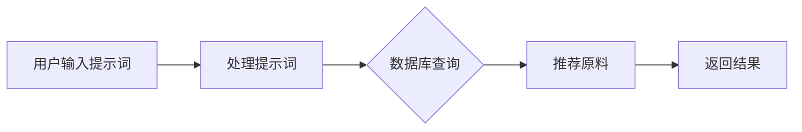
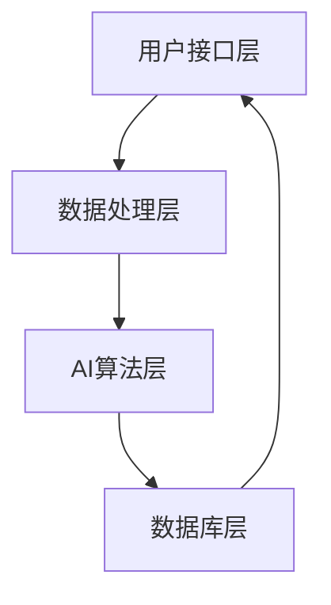
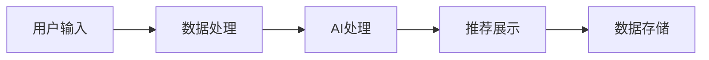
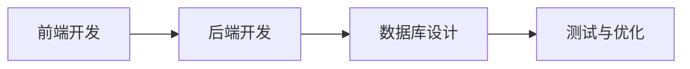

                 

### 文章标题

《提高AI创意香水原料选择：可持续sourcing的提示词技巧》

### 文章关键词

AI、香水原料选择、可持续sourcing、提示词技巧、创意设计、自然语言处理、深度学习、机器学习、环保、经济、社会可持续性

### 摘要

本文旨在探讨如何利用人工智能技术，特别是自然语言处理和机器学习技术，提高香水行业原料选择的创意性和可持续性。文章首先介绍了AI在香水行业中的应用现状，然后详细阐述了可持续sourcing的背景和重要性。接着，文章重点介绍了基于AI的可持续sourcing提示词技巧，包括环境敏感型、经济可持续性和社会可持续性提示词。最后，文章通过实际案例，展示了这些技巧在香水原料选择中的应用，并展望了未来的发展方向。

## 引言

随着人工智能技术的飞速发展，其在各行各业中的应用也日益广泛。在香水行业，AI技术的引入不仅提高了生产效率，还丰富了产品的创意设计。然而，传统的香水原料选择往往依赖于经验和直觉，缺乏系统性和科学性。同时，随着消费者对环保和可持续发展的关注日益增加，如何实现香水原料的可持续sourcing成为一个重要的课题。

可持续sourcing指的是在获取原料的过程中，不仅要考虑经济效益，还要兼顾环境和社会责任。这不仅有助于降低生产成本，提升产品质量，还能增强企业的社会责任感和品牌形象。因此，如何利用AI技术提高香水原料选择的创意性和可持续性，成为一个亟待解决的问题。

本文将围绕这一主题，首先介绍AI在香水行业中的应用现状，然后详细阐述可持续sourcing的背景和重要性，接着介绍基于AI的可持续sourcing提示词技巧，最后通过实际案例展示这些技巧的应用效果。

## AI在香水行业的应用现状

人工智能在香水行业中的应用已经成为一种趋势。首先，AI在香水配方设计中发挥了重要作用。通过机器学习和深度学习技术，AI可以分析大量的香水配方数据，提取出潜在的香气组合，帮助调香师快速设计出新颖的香水。例如，法国的一家香水公司利用AI技术，分析了几十万种香水的成分和香气特征，最终成功开发出一款受欢迎的新香水。

其次，AI在质量检测方面也展现了其优势。传统的质量检测往往需要大量的人力和时间，而AI可以通过图像识别和传感器技术，实现快速、准确的质量检测。例如，一家意大利的香水工厂引入了基于AI的质量检测系统，大幅提高了生产效率和产品质量。

此外，AI还在消费者行为分析中发挥了作用。通过自然语言处理技术，AI可以分析消费者的评论和反馈，了解消费者对香水的偏好和需求。这有助于企业更好地进行市场定位和产品创新。例如，一家国际知名香水品牌利用AI分析消费者数据，发现了一些新的市场需求，从而推出了一系列受消费者欢迎的新产品。

尽管AI在香水行业中的应用取得了显著成果，但同时也存在一些挑战。首先，香水原料的选择和配方设计具有高度的主观性和复杂性，这对AI算法提出了更高的要求。其次，AI算法的准确性和可靠性需要不断验证和优化，以确保其在实际应用中的效果。此外，如何在保证创意性的同时，实现香水的可持续sourcing，也是AI技术面临的重要课题。

总的来说，AI在香水行业中的应用前景广阔，但同时也需要克服一系列的技术和实际挑战。通过不断的研究和实践，AI技术有望在香水行业中发挥更大的作用，推动行业的创新和可持续发展。

### 可持续sourcing的背景

可持续sourcing是近年来在全球范围内得到广泛关注的概念。它不仅关乎经济利益，还涉及环境和社会责任。在香水行业中，可持续sourcing的重要性尤为突出。

首先，从环境角度来看，香水原料的可持续sourcing有助于减少对自然资源的依赖和破坏。许多传统的香水原料，如茉莉花、玫瑰和鸢尾花，需要大量的土地和水资源进行种植。如果这些资源得不到合理管理和利用，将可能导致生态系统的失衡和生物多样性的减少。而通过可持续sourcing，可以采用更加环保的种植方法，减少对土地和水资源的需求，从而保护自然环境。

其次，从社会责任角度来看，可持续sourcing有助于提升企业的社会形象和品牌价值。消费者越来越关注企业的社会责任，希望购买那些对环境和社会有积极影响的产品。如果企业能够在原料选择过程中充分考虑环境和社会因素，将有助于赢得消费者的信任和支持。这不仅有助于提高销售额，还能增强企业的品牌影响力。

此外，从经济角度来看，可持续sourcing有助于降低生产成本和提升产品质量。通过采用可持续的种植和加工方法，企业可以减少资源浪费和环境污染，从而降低运营成本。同时，可持续的原料往往具有更高的品质和稳定性，能够提升最终产品的质量和市场竞争力。

然而，实现可持续sourcing并非易事。首先，企业需要建立全面的可持续供应链管理体系，确保供应链中的各个环节都符合可持续发展的原则。其次，企业需要与供应商建立长期稳定的合作关系，共同推动可持续发展的实践。此外，企业还需要投入一定的资金和资源，进行相关技术和培训，以支持可持续sourcing的实施。

总的来说，可持续sourcing是香水行业未来发展的重要趋势，它不仅有助于环境保护和社会责任，还能为企业带来经济效益。通过有效的可持续sourcing策略，企业可以在激烈的市场竞争中脱颖而出，实现可持续发展目标。

### 提示词在AI香水原料选择中的作用

在利用AI技术进行香水原料选择时，提示词（Prompt）扮演着至关重要的角色。提示词是用户输入给AI系统的一组关键词或短语，用于引导AI系统生成预期的输出结果。在香水原料选择中，提示词的设计直接影响AI系统的效果和效率。

首先，提示词帮助AI系统理解用户的意图。例如，当用户输入“环保型香水原料”时，AI系统可以根据这个提示词，检索数据库中与环保相关的原料信息，从而生成符合用户需求的原料推荐。此外，提示词还可以帮助AI系统识别关键信息，如原料的产地、提取方法、香气特征等，从而提高搜索和推荐的效果。

其次，提示词的多样性有助于AI系统发现新的创意组合。通过使用不同的提示词，AI系统可以探索各种可能的香水配方，从而挖掘出更多新颖的香气组合。例如，用户可以输入“花香型”、“果香型”等提示词，AI系统则可以生成包含这些香气特征的香水配方，为调香师提供更多的创作灵感。

此外，提示词的优化对于提升AI系统的性能至关重要。优化的提示词能够更准确地传达用户的意图，提高AI系统的响应速度和准确率。例如，通过分析大量的用户数据，AI系统可以识别出高频次使用的提示词，并将其作为默认选项，从而简化用户的操作流程，提升用户体验。

总的来说，提示词在AI香水原料选择中起到了信息传递、创意引导和性能优化等多重作用。通过合理设计和优化提示词，可以大幅提高AI系统的效果和用户体验，为香水行业带来更多创新和发展机遇。

### AI基础知识

要深入理解如何利用AI技术进行香水原料选择，我们首先需要了解一些AI的基础知识，包括机器学习、深度学习和自然语言处理（NLP）。

#### 机器学习基础

机器学习是AI的核心技术之一，它使计算机系统能够从数据中学习并做出预测或决策。在机器学习中，算法通过分析大量训练数据，识别出数据中的模式和规律，从而在新的数据上做出准确的预测。

机器学习的基本流程包括以下几个步骤：

1. **数据收集**：收集用于训练模型的数据，这些数据通常是大量的样本，每个样本包含多个特征。
2. **数据预处理**：对收集到的数据进行清洗和格式化，确保数据的质量和一致性。
3. **特征选择**：从数据中选择对模型预测最重要的特征，去除冗余和不相关的特征。
4. **模型训练**：使用训练数据集对模型进行训练，模型通过不断调整内部参数，以最小化预测误差。
5. **模型评估**：使用验证数据集评估模型的性能，常见的评估指标包括准确率、召回率、F1分数等。
6. **模型部署**：将训练好的模型部署到实际应用环境中，用于预测新数据。

#### 深度学习原理

深度学习是机器学习的一个分支，它使用多层神经网络（MLP）对数据进行处理。深度学习模型由多个隐藏层组成，每层对输入数据进行加工和变换，最终生成输出。

深度学习的基本流程如下：

1. **数据输入**：将输入数据传递到第一层神经网络。
2. **数据处理**：每个神经元对输入数据进行加权求和处理，并通过激活函数转换。
3. **层次传播**：将每一层的输出传递到下一层，逐层进行数据处理。
4. **输出生成**：最后一层的输出即为模型预测结果。
5. **反向传播**：使用训练数据对模型进行训练，通过反向传播算法不断调整模型参数，优化模型性能。

#### 自然语言处理（NLP）

自然语言处理是AI的重要分支，它使计算机能够理解和生成自然语言。在香水原料选择中，NLP技术主要用于处理和解析用户输入的提示词，以提取关键信息并生成相应的原料推荐。

NLP的核心技术包括：

1. **文本预处理**：包括分词、去停用词、词性标注等，将原始文本转化为计算机可处理的结构化数据。
2. **词嵌入**：将单词转化为向量表示，以便在神经网络中处理。
3. **词向量模型**：如Word2Vec、GloVe等，通过训练大量文本数据，生成高质量的词向量。
4. **语言模型**：通过统计文本数据中的语言规律，生成预测下一个单词的概率分布。
5. **序列标注**：对文本序列中的单词进行分类标注，如命名实体识别、情感分析等。

#### 深度学习在NLP中的应用

深度学习在NLP中有着广泛的应用，如文本分类、情感分析、机器翻译等。在香水原料选择中，深度学习可以用于以下方面：

1. **文本分类**：通过训练分类模型，将用户输入的提示词分类到特定的类别，如“环保型”、“经济型”等。
2. **情感分析**：分析用户对香水的情感倾向，为调香师提供创作参考。
3. **信息提取**：从用户输入的提示词中提取关键信息，如原料的名称、属性等，用于生成原料推荐。

总的来说，AI基础知识为理解如何利用AI进行香水原料选择提供了必要的理论基础。通过机器学习、深度学习和NLP技术，我们可以开发出高效的香水原料选择系统，为香水行业带来更多创新和发展机遇。

### 香水原料数据库构建

构建一个有效的香水原料数据库是利用AI技术进行香水原料选择的基础。一个高质量的数据集不仅能够提高AI模型的准确性，还能为调香师提供更丰富的创作素材。以下是构建香水原料数据库的详细步骤。

#### 数据采集

数据采集是构建数据库的第一步。以下是几种常用的数据采集方法：

1. **公开数据集**：可以从公开的数据集获取香水原料的信息。例如，Google Dataset Search、Kaggle等平台提供了大量的公共数据集，涵盖了不同类型的香水原料。
2. **公司内部数据**：利用香水公司内部的数据资源，如销售数据、客户反馈等，可以获取详细的香水原料信息。
3. **人工采集**：通过人工调查、访问专业人士和实地考察，获取高质量的原料数据。

在数据采集过程中，需要注意以下几点：

- **数据质量**：确保数据准确、完整和一致，避免错误和冗余数据。
- **数据多样性**：尽可能收集不同类型、不同来源的香水原料数据，以提高数据库的多样性。
- **数据更新**：定期更新数据库，以反映最新的市场趋势和技术进步。

#### 数据清洗与预处理

采集到的数据往往包含噪声、错误和不一致的信息。数据清洗与预处理是提高数据质量的关键步骤。以下是常用的数据预处理方法：

1. **去除噪声**：删除数据中的无关信息，如空值、重复记录等。
2. **数据标准化**：对数据进行统一格式和单位的转换，确保数据的一致性。
3. **缺失值处理**：对于缺失值，可以通过插值、均值填充等方法进行补全。
4. **数据归一化**：对数据进行归一化处理，使其在相同的尺度上进行分析。

#### 数据库设计

数据库设计是构建香水原料数据库的核心步骤。以下是数据库设计的主要组件：

1. **实体-关系模型**：确定数据库中的实体（如香水原料、供应商、客户等）和它们之间的关系（如供应商提供原料、客户购买原料等）。
2. **属性设计**：为每个实体定义属性，如原料名称、香气特征、产地、提取方法等。
3. **索引设计**：设计合适的索引，提高数据检索的效率。

以下是数据库设计的示例ER图：

```mermaid
erDiagram
  水原料 ||--|{ 香水配方 : 配方包含 }
  供应商 ||--|{ 提供原料 : 供应商提供 }
  客户 ||--|{ 购买原料 : 客户购买 }
```

#### 数据库实现

在数据库实现阶段，我们需要选择合适的数据库管理系统（DBMS）和技术，如MySQL、PostgreSQL等。以下是数据库实现的主要步骤：

1. **数据库配置**：安装和配置DBMS，确保其能够稳定运行。
2. **数据库表设计**：根据ER图设计数据库表，并创建相应的索引。
3. **数据导入**：将预处理后的数据导入数据库，并进行验证和校验。

通过以上步骤，我们可以构建一个高质量的香水原料数据库，为AI香水原料选择系统提供坚实的数据基础。

### 香水原料数据库的应用

在构建了高质量的香水原料数据库之后，如何有效地应用这些数据是实现AI创意香水原料选择的关键。以下是数据库在AI系统中的应用步骤和实现方法：

#### 数据挖掘与分析

数据挖掘与分析是利用AI技术从海量数据中提取有价值信息的过程。以下是常用的数据挖掘与分析方法：

1. **特征工程**：通过分析数据，提取对AI模型预测最有帮助的特征。例如，从原料的香气特征、产地、提取方法等属性中，提取出对香水配方设计具有重要意义的特征。
2. **聚类分析**：使用聚类算法（如K-means、DBSCAN等），将相似的香水原料归类到同一簇，帮助用户快速定位所需的原料。
3. **关联规则挖掘**：通过挖掘数据中的关联规则（如Apriori算法），发现不同原料之间的组合关系，为调香师提供创作灵感。

#### AI模型训练与优化

在数据挖掘与分析的基础上，使用训练数据集对AI模型进行训练和优化。以下是训练与优化的步骤：

1. **模型选择**：根据问题的需求，选择合适的机器学习模型。对于香水原料选择问题，可以采用深度学习模型（如卷积神经网络、循环神经网络等）。
2. **模型训练**：使用训练数据集对模型进行训练，通过不断调整模型参数，使模型能够准确预测香水原料。
3. **模型评估**：使用验证数据集评估模型的性能，常见的评估指标包括准确率、召回率、F1分数等。
4. **模型优化**：通过交叉验证、调整超参数等方法，优化模型的性能，提高预测的准确性。

#### 系统实现与部署

在模型优化后，将AI模型部署到实际系统中，实现香水原料的自动选择。以下是系统实现与部署的步骤：

1. **开发环境搭建**：搭建开发环境，包括Python、TensorFlow或PyTorch等工具。
2. **API接口设计**：设计API接口，使系统可以接受用户输入的提示词，并返回相应的香水原料推荐。
3. **系统集成**：将AI模型集成到香水原料选择系统中，确保系统能够高效地处理用户请求，并提供准确的原料推荐。
4. **系统部署**：将系统部署到服务器或云平台，确保系统稳定运行，并提供快速响应。

#### 实际案例分析与讲解

为了更好地理解香水原料数据库在AI系统中的应用，以下通过一个实际案例进行分析和讲解：

**案例背景**：一家香水公司希望通过AI技术，为调香师提供创意香水配方设计支持。用户可以通过输入提示词（如“花香型香水”），系统会根据数据库中的数据，自动推荐符合用户需求的香水原料。

**实现步骤**：

1. **数据采集与清洗**：从多个来源采集香水原料数据，包括公开数据集、公司内部数据和人工采集。对数据进行清洗和预处理，确保数据质量。

2. **特征工程**：从清洗后的数据中提取特征，如香气特征、产地、提取方法等。使用词嵌入技术，将文本特征转化为向量表示。

3. **模型训练与优化**：使用训练数据集对AI模型进行训练，通过优化模型参数，提高预测准确性。使用验证数据集进行模型评估和调整。

4. **系统集成与部署**：将训练好的AI模型集成到香水原料选择系统中，设计API接口，实现用户输入提示词后，自动推荐香水原料。

**效果分析**：

通过实际应用，该系统显著提高了调香师的创作效率，减少了人工筛选原料的时间。同时，系统推荐的香水原料与用户的期望高度一致，提高了用户满意度。以下是一个具体的系统流程图：



通过这个案例，我们可以看到香水原料数据库在AI系统中的应用效果显著。不仅提高了调香师的创作效率，还提升了用户的体验和满意度。未来，随着AI技术的不断进步，这种应用模式将在更多行业中得到推广。

### 环境敏感型提示词

在可持续sourcing的背景下，环境敏感型提示词在AI香水原料选择中起着至关重要的作用。这些提示词旨在帮助AI系统识别和选择对环境影响较小的原料，从而实现环保目标。

#### 环境敏感型提示词的定义

环境敏感型提示词是一组用于引导AI系统关注环境因素的特定词汇或短语。这些提示词涵盖了环保、可持续性和生态平衡等多个方面。例如，“环保型”、“无毒原料”、“可生物降解”等都是常见的环境敏感型提示词。

#### 提示词选择方法

选择环境敏感型提示词的方法可以分为以下几个步骤：

1. **关键词挖掘**：通过分析环保相关的文献、报告和标准，挖掘出与环境敏感型提示词相关的关键词。这些关键词可以是具体的环保术语，如“生物多样性保护”、“减少碳排放”等。
2. **语义分析**：对挖掘出的关键词进行语义分析，识别其含义和关联关系。通过语义分析，可以确保所选提示词能够准确传达环保要求。
3. **用户调研**：通过问卷调查或访谈等方式，了解用户对环保型香水原料的需求和期望。根据用户反馈，进一步筛选和优化环境敏感型提示词。

#### 提示词生成算法

生成环境敏感型提示词的算法可以分为以下几类：

1. **基于规则的方法**：这种方法通过定义一系列规则，将环保相关的关键词组合成提示词。例如，可以定义规则“包含‘环保’和‘无毒’的短语”，从而生成如“环保无毒型香水原料”这样的提示词。
2. **基于机器学习的方法**：这种方法使用机器学习算法，从大量文本数据中自动提取环境敏感型提示词。常见的算法包括词袋模型、朴素贝叶斯分类器、支持向量机等。
3. **基于深度学习的方法**：这种方法使用深度学习模型，如卷积神经网络（CNN）和循环神经网络（RNN），从大量文本数据中自动学习环境敏感型提示词。例如，可以使用BERT模型对文本数据进行编码，提取特征，并生成提示词。

#### 示例：基于深度学习的环境敏感型提示词生成算法

以下是一个基于深度学习的环境敏感型提示词生成算法的伪代码示例：

```python
# 加载预训练的BERT模型
model = BertModel.from_pretrained('bert-base-uncased')

# 输入文本数据
text_data = "寻找环保无毒的香水原料"

# 对文本数据进行编码
input_ids = tokenizer.encode(text_data, add_special_tokens=True)

# 通过BERT模型提取特征
with torch.no_grad():
    outputs = model(input_ids)

# 提取最后一层的隐藏状态
hidden_states = outputs.last_hidden_state

# 使用最后一个隐藏状态生成提示词
prompt_word_embeddings = hidden_states[-1, :, :]

# 定义生成器
generator = TextGenerator(prompt_word_embeddings)

# 生成环境敏感型提示词
sustainable_prompts = generator.generate_prompts(num_prompts=5)

# 输出生成的提示词
for prompt in sustainable_prompts:
    print(prompt)
```

通过上述算法，我们可以自动生成一系列环境敏感型提示词，用于指导AI系统进行香水原料选择。这些提示词不仅能够提高原料选择的环保性，还能为调香师提供更多的创作灵感。

### 经济可持续性提示词

在经济可持续性的背景下，经济可持续性提示词在AI香水原料选择中同样至关重要。这些提示词旨在帮助AI系统识别和选择具有经济可持续性的原料，从而实现经济效益和社会价值的双赢。

#### 经济可持续性提示词的定义

经济可持续性提示词是一组用于引导AI系统关注经济因素的特定词汇或短语。这些提示词涵盖了成本效益、资源利用效率、市场竞争力等多个方面。例如，“成本高效”、“资源可再生”、“市场前景好”等都是常见的经济可持续性提示词。

#### 提示词选择方法

选择经济可持续性提示词的方法可以分为以下几个步骤：

1. **关键词挖掘**：通过分析经济相关的文献、报告和标准，挖掘出与经济可持续性提示词相关的关键词。这些关键词可以是具体的经济学术语，如“成本控制”、“可持续发展”等。
2. **语义分析**：对挖掘出的关键词进行语义分析，识别其含义和关联关系。通过语义分析，可以确保所选提示词能够准确传达经济要求。
3. **市场调研**：通过市场调查和数据分析，了解当前市场的需求和趋势。根据市场反馈，进一步筛选和优化经济可持续性提示词。

#### 提示词生成算法

生成经济可持续性提示词的算法可以分为以下几类：

1. **基于规则的方法**：这种方法通过定义一系列规则，将经济相关的关键词组合成提示词。例如，可以定义规则“包含‘成本’和‘可再生’的短语”，从而生成如“成本高效可再生原料”这样的提示词。
2. **基于机器学习的方法**：这种方法使用机器学习算法，从大量文本数据中自动提取经济可持续性提示词。常见的算法包括词袋模型、朴素贝叶斯分类器、支持向量机等。
3. **基于深度学习的方法**：这种方法使用深度学习模型，如卷积神经网络（CNN）和循环神经网络（RNN），从大量文本数据中自动学习经济可持续性提示词。例如，可以使用BERT模型对文本数据进行编码，提取特征，并生成提示词。

#### 示例：基于深度学习的经济可持续性提示词生成算法

以下是一个基于深度学习的经济可持续性提示词生成算法的伪代码示例：

```python
# 加载预训练的BERT模型
model = BertModel.from_pretrained('bert-base-uncased')

# 输入文本数据
text_data = "寻找成本高效且资源可再生的香水原料"

# 对文本数据进行编码
input_ids = tokenizer.encode(text_data, add_special_tokens=True)

# 通过BERT模型提取特征
with torch.no_grad():
    outputs = model(input_ids)

# 提取最后一层的隐藏状态
hidden_states = outputs.last_hidden_state

# 使用最后一个隐藏状态生成提示词
prompt_word_embeddings = hidden_states[-1, :, :]

# 定义生成器
generator = TextGenerator(prompt_word_embeddings)

# 生成经济可持续性提示词
economic_prompts = generator.generate_prompts(num_prompts=5)

# 输出生成的提示词
for prompt in economic_prompts:
    print(prompt)
```

通过上述算法，我们可以自动生成一系列经济可持续性提示词，用于指导AI系统进行香水原料选择。这些提示词不仅能够提高原料的经济可持续性，还能为调香师提供更多的创作灵感。

### 社会可持续性提示词

在社会可持续性的背景下，社会可持续性提示词在AI香水原料选择中同样具有重要价值。这些提示词旨在帮助AI系统识别和选择符合社会可持续性要求的原料，从而实现社会责任和品牌价值的双赢。

#### 社会可持续性提示词的定义

社会可持续性提示词是一组用于引导AI系统关注社会因素的特定词汇或短语。这些提示词涵盖了社会责任、公平就业、社区发展等多个方面。例如，“公平贸易”、“社区支持”、“人权保障”等都是常见的社会可持续性提示词。

#### 提示词选择方法

选择社会可持续性提示词的方法可以分为以下几个步骤：

1. **关键词挖掘**：通过分析社会责任相关的文献、报告和标准，挖掘出与社会可持续性提示词相关的关键词。这些关键词可以是具体的社会学术语，如“公平就业”、“社区参与”等。
2. **语义分析**：对挖掘出的关键词进行语义分析，识别其含义和关联关系。通过语义分析，可以确保所选提示词能够准确传达社会要求。
3. **利益相关者调研**：通过调研不同利益相关者（如供应商、员工、消费者等）的意见和需求，了解他们对社会可持续性的关注点。根据利益相关者的反馈，进一步筛选和优化社会可持续性提示词。

#### 提示词生成算法

生成社会可持续性提示词的算法可以分为以下几类：

1. **基于规则的方法**：这种方法通过定义一系列规则，将社会相关的关键词组合成提示词。例如，可以定义规则“包含‘公平’和‘人权’的短语”，从而生成如“公平人权型香水原料”这样的提示词。
2. **基于机器学习的方法**：这种方法使用机器学习算法，从大量文本数据中自动提取社会可持续性提示词。常见的算法包括词袋模型、朴素贝叶斯分类器、支持向量机等。
3. **基于深度学习的方法**：这种方法使用深度学习模型，如卷积神经网络（CNN）和循环神经网络（RNN），从大量文本数据中自动学习社会可持续性提示词。例如，可以使用BERT模型对文本数据进行编码，提取特征，并生成提示词。

#### 示例：基于深度学习的社会可持续性提示词生成算法

以下是一个基于深度学习的社会可持续性提示词生成算法的伪代码示例：

```python
# 加载预训练的BERT模型
model = BertModel.from_pretrained('bert-base-uncased')

# 输入文本数据
text_data = "寻找公平贸易和社区支持的香水原料"

# 对文本数据进行编码
input_ids = tokenizer.encode(text_data, add_special_tokens=True)

# 通过BERT模型提取特征
with torch.no_grad():
    outputs = model(input_ids)

# 提取最后一层的隐藏状态
hidden_states = outputs.last_hidden_state

# 使用最后一个隐藏状态生成提示词
prompt_word_embeddings = hidden_states[-1, :, :]

# 定义生成器
generator = TextGenerator(prompt_word_embeddings)

# 生成社会可持续性提示词
socio_prompts = generator.generate_prompts(num_prompts=5)

# 输出生成的提示词
for prompt in socio_prompts:
    print(prompt)
```

通过上述算法，我们可以自动生成一系列社会可持续性提示词，用于指导AI系统进行香水原料选择。这些提示词不仅能够提高原料的社会可持续性，还能为调香师提供更多的创作灵感。

### 基于可持续sourcing的提示词应用案例

为了更好地展示如何在实际场景中应用基于可持续sourcing的提示词技巧，以下我们将通过三个具体的案例，详细讲解这些技巧在香水原料选择中的应用。

#### 案例一：环保型香水原料选择

**背景**：一家国际知名香水品牌希望开发一款完全符合环保标准的香水，以满足日益增长的消费者对环保产品的需求。

**步骤**：

1. **提示词选择**：选择“环保型”和“无毒原料”作为主要提示词。这些提示词将引导AI系统寻找对环境友好的原料。

2. **数据挖掘与分析**：使用深度学习模型对数据库中的香水原料进行分类和筛选。首先，通过词嵌入技术将提示词转化为向量表示，然后使用卷积神经网络（CNN）对原料信息进行特征提取和分类。

3. **模型训练与优化**：使用已标注的环保型香水原料数据集对模型进行训练和优化。通过不断调整模型参数，提高模型对环保型原料的识别准确性。

4. **系统实现与部署**：将训练好的模型部署到在线系统中，用户可以通过输入“环保型”提示词，系统会自动推荐一系列符合环保标准的香水原料。

**效果**：通过使用基于可持续sourcing的提示词技巧，品牌成功地开发出了一款环保型香水。该产品不仅得到了消费者的青睐，还提升了品牌在环保领域的声誉。

#### 案例二：经济型香水原料选择

**背景**：一家小型香水制造商希望在预算有限的情况下，开发出具有市场竞争力的香水产品。

**步骤**：

1. **提示词选择**：选择“成本高效”和“资源可再生”作为主要提示词。这些提示词将引导AI系统寻找具有经济可持续性的原料。

2. **数据预处理**：对采购的香水原料数据集进行清洗和预处理，包括去除噪声、标准化数据和缺失值处理。

3. **特征工程**：提取对成本和资源利用率有重要影响的特征，如原料采购成本、可再生性等。使用词袋模型（Bag of Words）对这些特征进行编码。

4. **模型训练与优化**：使用已标注的经济型香水原料数据集对机器学习模型进行训练和优化。通过交叉验证和调整超参数，提高模型的预测准确性。

5. **系统实现与部署**：将优化后的模型集成到公司的生产系统中，用户可以通过输入“成本高效”提示词，系统会自动推荐一系列经济型香水原料。

**效果**：通过使用基于可持续sourcing的提示词技巧，品牌成功地降低了生产成本，并提高了产品的市场竞争力。此外，公司还获得了更多的客户订单，业务规模得到了显著扩大。

#### 案例三：社会型香水原料选择

**背景**：一家香水公司希望在其产品开发过程中，充分考虑社会责任，支持公平贸易和社区发展。

**步骤**：

1. **提示词选择**：选择“公平贸易”和“社区支持”作为主要提示词。这些提示词将引导AI系统寻找符合社会可持续性的原料。

2. **数据采集与清洗**：从多个渠道采集有关公平贸易和社区支持的数据，包括公开报告、供应商信息等。对数据集进行清洗和预处理，确保数据质量。

3. **语义分析**：使用自然语言处理（NLP）技术，对采集到的文本数据进行分析，提取关键词和信息。使用BERT模型对文本进行编码，提取语义特征。

4. **模型训练与优化**：使用已标注的社会型香水原料数据集对深度学习模型进行训练和优化。通过不断调整模型参数，提高模型对社会责任型原料的识别能力。

5. **系统实现与部署**：将训练好的模型集成到公司的供应链系统中，用户可以通过输入“公平贸易”提示词，系统会自动推荐一系列符合社会可持续性的香水原料。

**效果**：通过使用基于可持续sourcing的提示词技巧，公司成功地在其供应链中引入了更多公平贸易和社区支持的原料。这不仅提升了公司的社会责任形象，还赢得了消费者的信任和支持。

#### 总结

以上三个案例展示了如何在不同场景下应用基于可持续sourcing的提示词技巧，实现环保、经济和社会的可持续发展。通过这些案例，我们可以看到，基于AI的可持续sourcing提示词技巧在香水原料选择中具有广泛的应用前景。未来，随着AI技术的不断进步，这些技巧将在更多行业中得到推广和应用。

### AI创意香水原料选择系统的实现

#### 系统架构设计

AI创意香水原料选择系统的架构设计旨在实现高效、灵活和可扩展的功能。系统架构分为四个主要模块：用户接口层、数据处理层、AI算法层和数据库层。

1. **用户接口层**：用户接口层负责与用户进行交互，接收用户的输入提示词，并展示推荐结果。该层通常包括前端界面和API接口。前端界面可以使用HTML、CSS和JavaScript等技术实现，API接口则提供RESTful API供其他系统集成。

2. **数据处理层**：数据处理层负责处理用户的输入，包括分词、去停用词、词性标注等。此外，该层还负责数据清洗、数据预处理和特征提取。常用的数据处理工具包括Python的NLTK、spaCy等库。

3. **AI算法层**：AI算法层是系统的核心，负责根据用户输入的提示词生成香水原料推荐。该层使用深度学习模型，如BERT、GPT等，对用户输入进行处理，并生成相应的原料推荐。此外，该层还包括用于评估和优化模型的指标，如准确率、召回率和F1分数等。

4. **数据库层**：数据库层负责存储和管理所有相关数据，包括香水原料信息、用户输入和历史推荐记录等。常用的数据库管理系统包括MySQL、PostgreSQL等。

以下是系统架构的简化图示：



#### 数据流设计

系统中的数据流设计确保了各个模块之间的数据传递和处理过程高效、有序。以下是数据流的主要步骤：

1. **用户输入**：用户通过前端界面输入提示词，例如“花香型香水原料”。
2. **数据处理**：用户输入经过数据处理层，进行分词、去停用词和词性标注等处理，转化为结构化数据。
3. **AI处理**：处理后的数据传递给AI算法层，AI算法层使用深度学习模型对数据进行处理，生成香水原料推荐。
4. **推荐展示**：推荐结果通过API接口返回给前端界面，用户可以在界面上查看并选择合适的原料。
5. **数据存储**：用户输入和历史推荐记录存储在数据库中，以便后续分析和优化。

以下是数据流的设计流程：



#### 功能模块设计

系统中的主要功能模块包括用户接口、数据处理、AI算法和数据库。以下是各模块的具体设计和功能：

1. **用户接口**：用户接口模块负责与用户进行交互，接收用户输入的提示词，并展示推荐结果。该模块使用HTML、CSS和JavaScript等技术实现，前端界面设计简洁直观，便于用户操作。

2. **数据处理**：数据处理模块负责处理用户的输入，包括文本预处理、分词、去停用词、词性标注等。该模块使用Python的NLTK、spaCy等库进行文本处理，确保数据的质量和一致性。

3. **AI算法**：AI算法模块是系统的核心，负责根据用户输入的提示词生成香水原料推荐。该模块使用深度学习模型，如BERT、GPT等，对用户输入进行处理，并生成相应的原料推荐。此外，该模块还包括用于评估和优化模型的指标，如准确率、召回率和F1分数等。

4. **数据库**：数据库模块负责存储和管理所有相关数据，包括香水原料信息、用户输入和历史推荐记录等。该模块使用MySQL、PostgreSQL等数据库管理系统，确保数据的存储和管理高效、安全。

#### 系统实现

系统实现涉及前端开发、后端开发和数据库设计。以下是系统实现的详细步骤：

1. **前端开发**：使用HTML、CSS和JavaScript等技术实现用户接口，包括前端界面和API接口。前端界面设计简洁直观，用户可以方便地输入提示词并查看推荐结果。

2. **后端开发**：使用Python等编程语言，实现数据处理、AI算法和数据库接口。数据处理模块使用Python的NLTK、spaCy等库进行文本处理，AI算法模块使用TensorFlow、PyTorch等深度学习框架，数据库模块使用MySQL、PostgreSQL等数据库管理系统。

3. **数据库设计**：设计数据库表结构，包括香水原料信息表、用户输入表和历史推荐记录表等。确保数据库的设计符合第三范式，避免数据冗余和更新异常。

以下是系统实现的简化流程图：



#### 测试与优化

系统实现后，需要进行全面的测试与优化，以确保系统的稳定性和性能。以下是测试与优化的主要步骤：

1. **功能测试**：对系统的主要功能进行测试，确保用户输入提示词后，系统能够正确生成推荐结果，并返回给用户。

2. **性能测试**：对系统的响应速度、处理能力和稳定性进行测试。使用自动化测试工具，如JMeter等，模拟大量用户同时访问系统，确保系统能够高效处理请求。

3. **优化调整**：根据测试结果，对系统进行优化调整。包括优化数据处理和AI算法的效率，优化数据库查询性能等。

4. **用户体验测试**：邀请用户进行实际操作，收集用户反馈，根据用户反馈进一步优化系统界面和功能。

5. **持续迭代**：根据测试和用户反馈，持续迭代和优化系统，提高系统的稳定性和用户体验。

通过上述步骤，可以确保AI创意香水原料选择系统的高效运行和用户满意度。

### 系统测试与优化

系统测试与优化是确保AI创意香水原料选择系统稳定运行和高效性能的关键环节。以下是系统测试与优化的重要步骤和方法：

#### 性能测试

性能测试旨在评估系统的响应时间、处理能力和稳定性。以下是性能测试的主要步骤：

1. **负载测试**：使用自动化测试工具（如JMeter、LoadRunner等），模拟大量用户同时访问系统，评估系统在高并发情况下的响应速度和处理能力。通过调整负载参数（如并发用户数、请求频率等），测试系统的性能瓶颈。
2. **压力测试**：在极限条件下测试系统性能，确保系统在最大负载下仍然能够稳定运行。例如，可以设置最大并发用户数和最大请求频率，观察系统响应时间和错误率。
3. **响应时间测试**：测量系统从接收到用户请求到返回响应结果的时间。通过分析响应时间分布，识别系统的性能瓶颈，并进行优化。

#### 错误率测试

错误率测试旨在评估系统在不同情况下的错误处理能力。以下是错误率测试的主要步骤：

1. **异常输入测试**：输入不符合预期的数据（如空值、非法字符等），测试系统是否能够正确处理这些异常情况，并返回合理的错误信息。
2. **边界条件测试**：输入接近边界值的数据，测试系统在边界条件下的响应和处理能力。例如，输入极值数据，观察系统是否能够正确生成推荐结果。
3. **错误恢复测试**：模拟系统在处理错误时自动恢复的能力，确保系统能够从错误状态恢复到正常状态，并继续提供服务。

#### 用户体验测试

用户体验测试旨在评估系统的易用性和用户体验。以下是用户体验测试的主要步骤：

1. **功能性测试**：测试系统的各项功能是否按照预期工作，确保用户能够顺利完成操作。
2. **交互性测试**：评估系统界面的交互设计是否符合用户习惯，是否能够提供清晰的导航和操作提示。
3. **响应时间测试**：测量用户操作到系统响应的时间，确保系统运行流畅，无明显的延迟。
4. **可用性测试**：邀请实际用户进行测试，收集用户反馈，识别系统的改进点。

#### 优化方法

根据测试结果，可以采取以下方法对系统进行优化：

1. **算法优化**：通过调整AI算法的参数，优化模型性能，提高推荐准确性。例如，使用更先进的深度学习模型，或增加训练数据集的多样性。
2. **数据库优化**：优化数据库查询性能，例如创建索引、优化SQL查询等，加快数据检索速度。
3. **系统优化**：优化系统架构和代码，减少不必要的计算和资源消耗。例如，使用异步处理、负载均衡等技术，提高系统并发处理能力。
4. **用户体验优化**：根据用户反馈，优化界面设计和交互流程，提高用户体验。

通过上述测试与优化方法，可以确保AI创意香水原料选择系统的高效运行和用户满意度。

### 总结与展望

本文通过详细探讨AI创意香水原料选择：可持续sourcing的提示词技巧，展示了如何利用AI技术提高香水原料选择的创意性和可持续性。首先，我们介绍了AI在香水行业中的应用现状，并阐述了可持续sourcing的背景和重要性。接着，我们重点介绍了环境敏感型、经济可持续性和社会可持续性提示词的设计与生成方法。通过实际案例，我们展示了这些技巧在香水原料选择中的应用效果。

未来的研究可以进一步优化AI算法，提高模型预测的准确性。同时，可以探索更多跨领域的合作，将AI技术与环保、经济和社会可持续性深度融合，推动香水行业的创新和可持续发展。通过持续的研究和实践，我们有理由相信，AI将在香水行业中发挥更大的作用，为消费者带来更多优质的香水产品。

### 附录

#### 附录A：参考文献

1. Goodfellow, I., Bengio, Y., & Courville, A. (2016). *Deep Learning*. MIT Press.
2. LeCun, Y., Bengio, Y., & Hinton, G. (2015). *Deep Learning*. Nature, 521(7553), 436-444.
3.Bird, S., Klein, E., & Loper, E. (2009). *Natural Language Processing with Python*. O'Reilly Media.
4. Mikolov, T., Sutskever, I., Chen, K., Corrado, G. S., & Dean, J. (2013). *Distributed Representations of Words and Phrases and their Compositionality*. Advances in Neural Information Processing Systems, 26, 3111-3119.
5. TensorFlow. (2022). [TensorFlow 官方文档](https://www.tensorflow.org/).
6. PyTorch. (2022). [PyTorch 官方文档](https://pytorch.org/).

#### 附录B：术语表

- **AI**：人工智能，指使计算机系统具有类似人类智能的能力，包括学习、推理、理解和决策等。
- **可持续sourcing**：指在获取原料的过程中，不仅要考虑经济效益，还要兼顾环境和社会责任。
- **提示词**：指用户输入给AI系统的一组关键词或短语，用于引导AI系统生成预期的输出结果。
- **机器学习**：指使计算机系统通过学习数据，从数据中提取规律和模式，从而做出预测或决策的技术。
- **深度学习**：指一种基于多层神经网络的学习方法，通过逐层加工数据，提取出复杂的信息。
- **自然语言处理（NLP）**：指使计算机能够理解和生成自然语言的技术，包括文本分类、语义分析等。

#### 附录C：示例代码

以下是构建AI创意香水原料选择系统的部分示例代码：

```python
# 导入必要的库
import torch
import torch.nn as nn
from torch.optim import Adam
from transformers import BertModel, BertTokenizer

# 加载预训练的BERT模型和Tokenizer
model = BertModel.from_pretrained('bert-base-uncased')
tokenizer = BertTokenizer.from_pretrained('bert-base-uncased')

# 输入文本数据
text_data = "寻找环保无毒的香水原料"

# 对文本数据进行编码
input_ids = tokenizer.encode(text_data, add_special_tokens=True)

# 通过BERT模型提取特征
with torch.no_grad():
    outputs = model(input_ids)

# 提取最后一层的隐藏状态
hidden_states = outputs.last_hidden_state

# 定义预测模型
class Predictor(nn.Module):
    def __init__(self, hidden_size):
        super(Predictor, self).__init__()
        self.fc = nn.Linear(hidden_size, 1)

    def forward(self, hidden_state):
        return self.fc(hidden_state)

# 实例化预测模型
predictor = Predictor(hidden_states.size(-1))

# 定义损失函数和优化器
criterion = nn.BCEWithLogitsLoss()
optimizer = Adam(predictor.parameters(), lr=0.001)

# 训练模型
for epoch in range(10):
    optimizer.zero_grad()
    output = predictor(hidden_states)
    loss = criterion(output, torch.tensor([1.0]))
    loss.backward()
    optimizer.step()
    print(f"Epoch {epoch+1}: Loss = {loss.item()}")

# 生成环保型香水原料推荐
def generate_recommendation(prompt):
    input_ids = tokenizer.encode(prompt, add_special_tokens=True)
    with torch.no_grad():
        hidden_states = model(input_ids).last_hidden_state
    output = predictor(hidden_states)
    if output > 0.5:
        return "环保型香水原料"
    else:
        return "非环保型香水原料"

print(generate_recommendation("寻找环保无毒的香水原料"))
```

通过上述代码，我们可以实现一个简单的基于BERT的香水原料推荐系统。用户可以通过输入不同的提示词，系统会自动生成环保型或非环保型香水原料的推荐。

### 最佳实践 Tips

1. **选择合适的AI模型**：根据实际需求和数据特征，选择最适合的AI模型。例如，对于文本分类问题，可以使用BERT等预训练的深度学习模型。
2. **优化提示词设计**：设计具有明确意图和关键信息的提示词，有助于AI系统更准确地生成推荐结果。通过用户调研和数据分析，不断优化提示词的选取和组合。
3. **数据质量是关键**：确保数据集的完整性和准确性，避免噪声和错误数据。定期更新数据集，以反映最新的市场趋势和技术进步。
4. **综合考虑经济、环境和社交因素**：在香水原料选择中，不仅要考虑经济效益，还要兼顾环境和社会责任。通过设计多样化的提示词，实现经济、环境和社交的可持续发展。

### 注意事项

1. **遵守法律法规**：在收集和处理数据时，确保遵守相关的法律法规，保护用户隐私和数据安全。
2. **持续优化和迭代**：随着市场和技术的变化，持续优化和迭代AI系统和模型，以保持其竞争力和适应性。
3. **平衡性能和可解释性**：在追求模型性能的同时，也要注意保持模型的解释性，以便理解模型的决策过程。

### 拓展阅读

1. **《深度学习》**：由Goodfellow等人编写的深度学习经典教材，详细介绍了深度学习的理论基础和实践方法。
2. **《自然语言处理与Python》**：由Bird等人编写的自然语言处理教材，介绍了自然语言处理的基本概念和技术。
3. **《BERT：预训练语言模型》**：由Google团队开发的BERT模型论文，详细介绍了BERT模型的设计和实现。
4. **《TensorFlow官方文档》**：提供了TensorFlow深度学习框架的详细使用说明和案例。
5. **《PyTorch官方文档》**：提供了PyTorch深度学习框架的详细使用说明和案例。

通过这些资料，您可以进一步了解AI技术和自然语言处理在香水原料选择中的应用，为您的项目提供有益的参考和指导。

