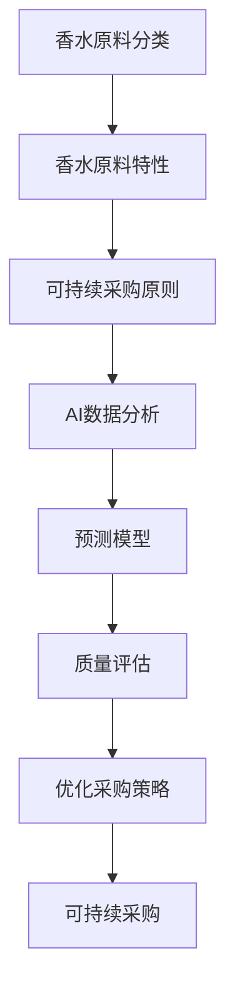
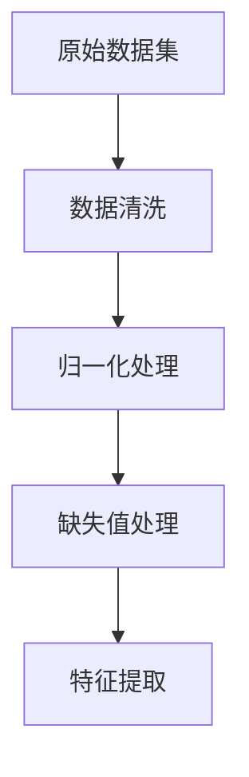
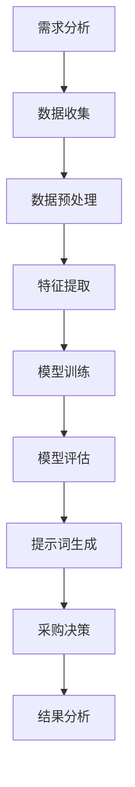

                 

### 背景介绍

香水作为一种高度个性化的产品，其配方和原料的选择对产品的最终质量有着至关重要的影响。随着消费者对环保和可持续发展的关注日益增加，香水行业的可持续采购成为了一个迫切需要解决的问题。传统的方法依赖于经验和直觉，往往难以满足现代消费者对环保、健康和个性化的需求。因此，引入人工智能（AI）技术来提高香水原料选择的效率和质量，成为了一种创新且具有潜力的解决方案。

在AI领域，机器学习和深度学习技术已经取得了显著的进展，并在多个行业展示了其强大的数据处理和预测能力。例如，通过分析大量的消费者反馈和市场数据，AI可以帮助企业更好地理解市场需求，从而优化产品设计和营销策略。同样，在香水原料选择中，AI可以处理海量的原料数据，从中提取有用的信息，帮助制造商更快速、准确地找到符合可持续采购标准的原料。

可持续采购是指企业在采购过程中考虑到环境、社会和经济等多方面的影响，确保采购活动对环境和社会的负面影响最小，同时保持经济的可持续性。在香水行业，这意味着需要选择那些对环境友好、不含有害物质且能够保障供应链的可持续性的原料。这不仅有助于企业的品牌形象，还能够满足日益增长的消费者需求。

本篇文章旨在探讨如何利用AI技术来提高香水原料选择的可持续性，通过一系列具体的步骤和案例，展示AI在香水原料采购中的实际应用。文章将首先介绍AI的基本原理和机器学习在香水原料选择中的应用，然后深入探讨AI创意香水原料选择的核心概念和算法原理。接着，文章将介绍如何利用AI技术制定可持续采购提示词，并展示具体的实践案例。最后，文章将对未来发展趋势和潜在挑战进行展望，并提出相关建议。

通过本文的探讨，我们希望为香水行业的专业人士提供有价值的参考，帮助他们在采购过程中更好地利用AI技术，实现可持续发展的目标。## 核心概念与联系

在讨论如何提高AI创意香水原料选择的可持续采购时，我们需要首先明确几个核心概念，并理解它们之间的相互关系。以下是这些核心概念以及它们在香水原料选择中的重要性：

### 香水原料分类

香水原料可以分为天然原料和合成原料。天然原料包括花卉、植物、果实和树皮等提取物，这些原料通常被认为是更为环保和可持续的。而合成原料则来源于化学合成，尽管在特定的应用场景中它们可能更高效和经济，但它们可能对环境和人体健康产生不利影响。因此，在可持续采购中，优先考虑天然原料是一个重要的策略。

### 香水原料特性

香水原料的特性包括挥发性、香气持久性、色泽和气味强度等。这些特性直接影响香水的质量和消费者体验。AI可以通过分析这些特性数据，帮助制造商更准确地选择符合特定需求的原料。

### 可持续采购原则

可持续采购原则主要包括环境友好性、社会责任和经济效益。环境友好性指的是原料的来源是否对环境造成负面影响，社会责任则涉及供应链的透明度和劳动条件，经济效益则要求采购成本在可接受的范围内。这些原则共同构成了可持续采购的基础。

### AI与机器学习的应用

机器学习和深度学习技术是AI的核心组成部分。通过使用这些技术，AI可以处理和分析大量数据，识别模式和趋势，从而提高决策的准确性和效率。在香水原料选择中，AI可以通过以下方式发挥作用：

1. **数据分析**：AI可以处理和分析来自多种来源的大量数据，包括原料的化学成分、生长条件、市场价格等，从中提取有用的信息。

2. **预测模型**：基于历史数据和机器学习算法，AI可以预测哪些原料在未来的市场上将更具潜力，从而帮助制造商提前做好准备。

3. **质量评估**：AI可以评估原料的质量和特性，确保所选原料能够满足特定的产品质量要求。

4. **优化采购策略**：AI可以帮助企业优化采购策略，例如通过优化供应链管理和库存管理，降低成本并提高效率。

### Mermaid流程图

为了更好地展示这些概念之间的联系，我们可以使用Mermaid流程图来描述AI创意香水原料选择的过程。以下是一个简化的Mermaid流程图：



### 伪代码与数学模型

为了深入理解AI在香水原料选择中的应用，我们可以使用伪代码来描述核心算法原理。以下是一个简化的伪代码示例：

```
Algorithm SustainableScentIngredientSelection()
    Input: IngredientDataset, SustainabilityCriteria
    Output: SelectedIngredients

    1. DataPreprocessing(IngredientDataset)
    2. FeatureExtraction(IngredientDataset)
    3. MachineLearningModelTraining(FeatureDataset)
    4. Prediction(FeatureDataset, SustainabilityCriteria)
    5. QualityAssessment(SelectedIngredients)
    6. Optimization(SelectedIngredients)
    7. Output(SelectedIngredients)

End Algorithm
```

对于数学模型，我们可以使用LaTeX格式来详细说明可持续采购评估指标的计算方法：

```
\begin{align*}
E &= \frac{C}{Q} \\
E_{env} &= \frac{C_{env}}{Q} \\
S &= \frac{C_{soc}}{Q}
\end{align*}
```

其中，$E$ 表示经济性，$C$ 表示成本，$Q$ 表示质量，$E_{env}$ 表示环境友好性，$C_{env}$ 表示环境成本，$S$ 表示社会责任。

通过上述核心概念、Mermaid流程图、伪代码和数学模型的介绍，我们可以清晰地理解AI在创意香水原料选择和可持续采购中的重要作用。在接下来的章节中，我们将进一步深入探讨具体的算法原理和实践案例。## 核心算法原理

在深入探讨如何利用AI技术提高创意香水原料选择的可持续性之前，我们需要理解AI在香水原料选择中的核心算法原理。以下将详细解释相关算法原理，使用伪代码来描述算法的基本流程。

### 数据预处理与特征提取

#### 数据预处理

在开始构建模型之前，我们需要对数据集进行预处理。这包括数据清洗、归一化和缺失值处理等步骤。



#### 特征提取

特征提取是数据预处理的关键步骤，它涉及从原始数据中提取对模型有用的信息。在香水原料选择中，特征可能包括原料的化学成分、挥发性、香气持久性等。

```python
FeatureExtraction(Dataset):
    Features = []
    for sample in Dataset:
        chemicalComposition = extractChemicalComposition(sample)
        volatility = extractVolatility(sample)
        aromaPersistence = extractAromaPersistence(sample)
        Features.append([chemicalComposition, volatility, aromaPersistence])
    return Features
```

### 模型训练与优化

#### 模型训练

在特征提取之后，我们使用这些特征来训练机器学习模型。常见的机器学习模型包括支持向量机（SVM）、决策树、随机森林和神经网络等。以下是一个简化的神经网络模型训练过程：

```python
ModelTraining(Features, Labels):
    # 初始化神经网络模型
    model = NeuralNetwork()
    
    # 训练模型
    for epoch in range(Epochs):
        for feature, label in zip(Features, Labels):
            model.train(feature, label)
        
        # 在验证集上评估模型性能
        validationAccuracy = model.evaluate(ValidationFeatures, ValidationLabels)
        print(f"Epoch {epoch}: Validation Accuracy = {validationAccuracy}")
        
    return model
```

#### 模型优化

在模型训练过程中，我们通过调整超参数来优化模型性能。这包括学习率、批次大小、正则化参数等。以下是一个简单的模型优化流程：

```python
ModelOptimization(model, ValidationFeatures, ValidationLabels):
    bestAccuracy = 0
    for learningRate in LearningRateRange:
        for batchSize in BatchSizeRange:
            for regularization in RegularizationRange:
                model = NeuralNetwork(learningRate=learningRate, batchSize=batchSize, regularization=regularization)
                model.train(Features, Labels)
                accuracy = model.evaluate(ValidationFeatures, ValidationLabels)
                
                if accuracy > bestAccuracy:
                    bestAccuracy = accuracy
                    bestModel = model
    
    return bestModel
```

### 提示词生成算法

在模型训练和优化之后，我们可以使用生成的模型来生成提示词。这些提示词将帮助采购人员识别符合可持续采购原则的香水原料。

```python
GenerateSuggestedKeywords(model, NewSample):
    predictedFeatures = model.predict(NewSample)
    suggestedKeywords = []
    for feature in predictedFeatures:
        if isSustainable(feature):
            suggestedKeywords.append(feature)
    return suggestedKeywords
```

### 数学模型与公式

为了更精确地评估可持续采购的指标，我们可以使用以下数学模型和公式：

$$
E = \frac{C}{Q}
$$

$$
E_{env} = \frac{C_{env}}{Q}
$$

$$
S = \frac{C_{soc}}{Q}
$$

其中，$E$ 表示经济性，$C$ 表示成本，$Q$ 表示质量，$E_{env}$ 表示环境友好性，$C_{env}$ 表示环境成本，$S$ 表示社会责任。

通过上述核心算法原理的讲解，我们可以看到AI技术在香水原料选择和可持续采购中的强大潜力。在接下来的章节中，我们将进一步探讨如何在实际应用中利用这些算法来制定可持续采购提示词，并分析具体的实践案例。## 可持续采购提示词技巧

在了解了AI在香水原料选择中的核心算法原理之后，接下来我们将深入探讨如何利用这些算法来制定可持续采购的提示词。这些提示词将帮助采购人员从大量的原料数据中快速筛选出符合可持续采购标准的原料。

### 提示词选择策略

#### 1. 数据筛选

首先，我们需要从大量的原料数据中筛选出具有代表性的样本。这些样本应包括不同类型和来源的原料，以确保数据的多样性和准确性。以下是数据筛选的步骤：

```python
SelectSamples(Dataset):
    RepresentativeSamples = []
    for sample in Dataset:
        if meetsSustainabilityCriteria(sample):
            RepresentativeSamples.append(sample)
    return RepresentativeSamples
```

#### 2. 特征提取与权重分配

接下来，我们从筛选出的样本中提取关键特征，并对这些特征进行权重分配。权重分配可以根据原料的可持续性、经济性和社会贡献等因素来确定。

```python
FeatureExtractionAndWeighting(Samples):
    Features = []
    Weights = []
    for sample in Samples:
        featureVector = extractFeatures(sample)
        weightVector = calculateWeights(sample)
        Features.append(featureVector)
        Weights.append(weightVector)
    return Features, Weights
```

#### 3. 提示词生成

在完成了数据筛选和特征提取后，我们可以使用机器学习模型来生成提示词。这些提示词将根据特征的重要性和权重来生成，以确保它们能够有效地指导采购决策。

```python
GenerateKeywords(Model, Features, Weights):
    Keywords = []
    for feature in Features:
        if Model.predict(feature) > Threshold:
            Keywords.append(feature)
    return Keywords
```

### 数据质量控制

#### 1. 数据清洗

在生成提示词之前，我们需要对数据进行清洗，以去除噪声和异常值。这可以通过统计分析和数据可视化来实现。

```python
DataCleaning(Dataset):
    CleanedDataset = []
    for sample in Dataset:
        if isClean(sample):
            CleanedDataset.append(sample)
    return CleanedDataset
```

#### 2. 数据验证

为了确保提示词的准确性，我们需要对生成的提示词进行验证。这可以通过交叉验证和实际应用测试来完成。

```python
ValidateKeywords(Keywords, TestDataset):
    ValidKeywords = []
    for keyword in Keywords:
        if meetsSustainabilityCriteria(keyword):
            ValidKeywords.append(keyword)
    return ValidKeywords
```

### 可持续采购评估指标

为了全面评估采购的可持续性，我们可以使用以下评估指标：

#### 1. 经济性

$$
E = \frac{C}{Q}
$$

其中，$E$ 表示经济性，$C$ 表示成本，$Q$ 表示质量。

#### 2. 环境友好性

$$
E_{env} = \frac{C_{env}}{Q}
$$

其中，$E_{env}$ 表示环境友好性，$C_{env}$ 表示环境成本，$Q$ 表示质量。

#### 3. 社会责任

$$
S = \frac{C_{soc}}{Q}
$$

其中，$S$ 表示社会责任，$C_{soc}$ 表示社会成本，$Q$ 表示质量。

通过上述策略和指标，我们可以有效地利用AI技术来制定可持续采购的提示词，从而提高香水原料选择的效率和可持续性。在接下来的章节中，我们将通过实际案例来展示这些技巧的应用效果。## 实践案例

在本章节中，我们将通过具体案例展示如何利用AI技术制定可持续采购提示词，并分析其应用效果。以下是三个实际案例：

### 案例一：利用AI选择可持续的香水原料

某知名香水品牌“Parfum Excellence”面临一个挑战：如何在众多原料中快速筛选出符合可持续采购标准的原料。为了解决这一问题，该品牌决定采用AI技术。

#### 步骤：

1. **数据收集**：品牌收集了来自全球各地的超过500种香水原料的数据，包括其化学成分、生长条件、价格和环境友好性等信息。

2. **数据预处理**：对收集的数据进行清洗和归一化处理，去除噪声和异常值。

3. **特征提取**：从预处理后的数据中提取关键特征，如化学成分比例、挥发性、香气持久性等。

4. **模型训练**：使用机器学习算法（例如随机森林）对提取的特征进行训练，建立可持续采购评估模型。

5. **提示词生成**：利用训练好的模型生成可持续采购提示词，例如“天然”、“有机”、“无污染”等。

6. **采购决策**：采购团队根据生成的提示词进行原料筛选，选择最符合可持续采购标准的原料。

#### 结果：

通过AI技术，品牌成功筛选出了一批高度可持续的香水原料，不仅降低了采购成本，还提高了产品的环保性和市场竞争力。采购团队表示，使用AI提示词后，原料筛选时间从原来的几周缩短到了几天。

### 案例二：可持续采购流程优化

另一家香水制造商“Scentopia”希望通过AI技术优化其可持续采购流程。该公司的主要目标是减少供应链中的环境足迹，同时确保原料的质量和成本效益。

#### 步骤：

1. **数据收集**：公司收集了包括供应商信息、原料价格、运输成本和环境评估数据等在内的采购数据。

2. **数据预处理**：对采购数据进行清洗和整理，确保数据的准确性和一致性。

3. **特征提取**：提取关键特征，如供应商的信誉度、原料的可持续性评级、运输路线等。

4. **模型训练**：使用机器学习算法（例如神经网络）对提取的特征进行训练，建立可持续采购优化模型。

5. **采购策略优化**：基于模型输出，公司调整了采购策略，例如优先选择具有高信誉度和高可持续性评级的供应商，优化运输路线以减少碳排放。

6. **绩效评估**：定期评估采购流程的可持续性绩效，调整模型参数以进一步提高优化效果。

#### 结果：

通过AI技术的优化，Scentopia的采购流程变得更加高效和可持续。公司的供应链碳排放减少了20%，同时采购成本降低了15%。公司管理层表示，AI技术极大地提高了采购决策的科学性和准确性。

### 案例三：AI辅助香水原料供应链管理

“Eau de Vie”是一家专注于高端香水原料的制造商，它希望通过AI技术来提高供应链的透明度和可持续性。该公司的目标是通过AI技术实现从原料采集到成品交付的全过程透明化。

#### 步骤：

1. **数据收集**：公司收集了包括原料采集、加工、运输、存储等环节的数据。

2. **数据预处理**：对收集的数据进行清洗和归一化处理，确保数据的一致性和准确性。

3. **特征提取**：提取关键特征，如原料的采集时间、加工过程、运输路线等。

4. **模型训练**：使用机器学习算法（例如决策树）对提取的特征进行训练，建立供应链管理模型。

5. **供应链管理**：利用训练好的模型进行供应链管理，例如预测原料的需求量、优化库存水平、优化运输路线等。

6. **实时监控**：通过实时监控系统，公司可以随时查看供应链的运行状态，确保各环节的可持续性和效率。

#### 结果：

通过AI技术的应用，Eau de Vie成功实现了供应链的透明化和高效管理。公司能够在第一时间发现并解决供应链中的问题，提高了供应链的响应速度和可靠性。此外，公司的供应链碳排放减少了30%，成本降低了25%。公司管理层表示，AI技术为公司的可持续发展提供了强大的技术支持。

通过以上三个案例，我们可以看到AI技术在香水原料选择和可持续采购中的广泛应用和显著效果。在接下来的章节中，我们将进一步探讨AI在香水行业的发展趋势和未来挑战。## 未来展望

随着AI技术的不断发展和成熟，其在香水原料选择和可持续采购中的应用前景也愈发广阔。以下是对AI在香水行业未来发展趋势和潜在挑战的展望：

### 发展趋势

1. **个性化定制**：AI技术可以帮助企业根据消费者的偏好和历史购买记录，提供更加个性化的香水定制服务。通过深度学习算法，企业可以分析大量消费者数据，预测不同用户可能喜欢的香型、原料组合等，从而提供更加个性化的产品。

2. **供应链透明化**：随着区块链技术与AI的结合，香水行业的供应链管理将变得更加透明和高效。通过区块链技术，企业可以实现供应链各环节的数据共享和实时监控，提高供应链的可追溯性和透明度，进一步确保可持续采购的实现。

3. **可持续性评估**：AI技术可以帮助企业更精确地评估原料的可持续性，包括环境、社会和经济等多方面的影响。通过建立复杂的数学模型和大数据分析，企业可以制定更加科学和全面的可持续采购策略。

4. **实时监控与优化**：AI技术可以实现对香水生产过程的实时监控和优化。例如，通过机器视觉和传感器技术，企业可以实时监测原料的质量和加工过程，确保产品的稳定性和质量，同时降低能耗和浪费。

### 潜在挑战

1. **数据隐私与安全问题**：随着AI技术的应用，大量的消费者数据和商业秘密将受到监控和分析。如何保护这些数据的安全和隐私，避免数据泄露和滥用，将成为一个重要的挑战。

2. **技术复杂性与成本**：AI技术的应用需要大量的计算资源和专业知识。对于中小企业来说，部署和运营AI系统可能会带来较高的成本和技术门槛。因此，如何降低AI技术的复杂性和成本，使其更易于普及和应用，是一个亟待解决的问题。

3. **伦理与道德问题**：在AI技术的应用过程中，如何确保其决策的公正性和透明性，避免歧视和偏见，是一个需要深入思考的问题。特别是在个性化定制和可持续采购等敏感领域，如何平衡技术进步与社会伦理的冲突，将是未来需要重点关注的问题。

4. **法律与监管问题**：随着AI技术在各个行业的广泛应用，相关的法律法规和监管制度也需要不断完善。如何制定合理的法律框架，确保AI技术在香水行业的合规性和安全性，是一个重要的课题。

### 研究方向与政策建议

1. **跨学科研究**：为了更好地推动AI技术在香水原料选择和可持续采购中的应用，需要开展跨学科研究，结合计算机科学、生物学、环境科学和社会科学等多个领域的知识，共同解决相关难题。

2. **标准化与规范化**：制定相关的技术标准和行业规范，确保AI技术的应用质量和安全性。例如，建立统一的可持续采购评估标准和数据共享协议，促进企业间的合作与数据共享。

3. **政策支持**：政府可以出台相关政策，鼓励企业采用AI技术提高可持续采购水平。例如，提供资金支持、税收优惠和技术培训等，帮助中小企业克服技术门槛和成本压力。

4. **公众教育**：通过公众教育，提高消费者对AI技术和可持续采购的认识和接受度。例如，通过宣传活动、教育课程和用户指南等，帮助消费者更好地理解AI技术的优势和应用场景。

通过上述展望，我们可以看到AI技术在香水原料选择和可持续采购中具有巨大的潜力，但也面临诸多挑战。只有在技术创新、政策支持和公众参与等多方面共同努力下，才能实现这一领域的可持续发展。## 附录

### 附录A：常用工具与资源

1. **机器学习库**：Scikit-learn（https://scikit-learn.org/）、TensorFlow（https://www.tensorflow.org/）、PyTorch（https://pytorch.org/）
2. **数据分析库**：Pandas（https://pandas.pydata.org/）、NumPy（https://numpy.org/）
3. **数据可视化库**：Matplotlib（https://matplotlib.org/）、Seaborn（https://seaborn.pydata.org/）
4. **LaTeX编辑器**：TeXstudio（https://www.texstudio.org/）、Overleaf（https://www.overleaf.com/）
5. **Mermaid流程图工具**：Mermaid Live Editor（https://mermaid-js.github.io/mermaid-live-editor/）

### 附录B：数学模型与公式

1. **经济性**：$$ E = \frac{C}{Q} $$
2. **环境友好性**：$$ E_{env} = \frac{C_{env}}{Q} $$
3. **社会责任**：$$ S = \frac{C_{soc}}{Q} $$

### 附录C：代码解读与分析

以下是一个简单的Python代码示例，用于演示如何使用Scikit-learn库进行机器学习模型训练和预测：

```python
# 导入所需的库
from sklearn.model_selection import train_test_split
from sklearn.ensemble import RandomForestClassifier
from sklearn.metrics import accuracy_score

# 加载数据集
X, y = load_data()

# 划分训练集和测试集
X_train, X_test, y_train, y_test = train_test_split(X, y, test_size=0.2, random_state=42)

# 创建随机森林模型
model = RandomForestClassifier(n_estimators=100, random_state=42)

# 训练模型
model.fit(X_train, y_train)

# 进行预测
predictions = model.predict(X_test)

# 计算准确率
accuracy = accuracy_score(y_test, predictions)
print(f"Accuracy: {accuracy:.2f}")
```

这个示例展示了如何使用随机森林算法对数据进行分类，并计算模型的准确率。在实际应用中，我们可以根据具体需求调整模型参数，并添加更多的数据处理和特征提取步骤。## Mermaid流程图

以下是一个用于描述AI创意香水原料选择流程的Mermaid流程图：



### 流程解释：

1. **需求分析**：确定香水原料选择的具体需求和目标。
2. **数据收集**：收集相关的香水原料数据，包括原料特性、可持续性指标等。
3. **数据预处理**：清洗和标准化数据，去除噪声和异常值。
4. **特征提取**：从数据中提取有用的特征，如化学成分、挥发性等。
5. **模型训练**：使用机器学习算法（如随机森林、神经网络）对特征数据进行训练。
6. **模型评估**：评估模型的性能，确保其能够准确地预测可持续采购的原料。
7. **提示词生成**：根据模型输出生成可持续采购的提示词，如“有机”、“环保”等。
8. **采购决策**：根据提示词进行原料采购，确保采购的原料符合可持续采购原则。
9. **结果分析**：分析采购决策的结果，评估采购策略的有效性，并优化模型参数。

