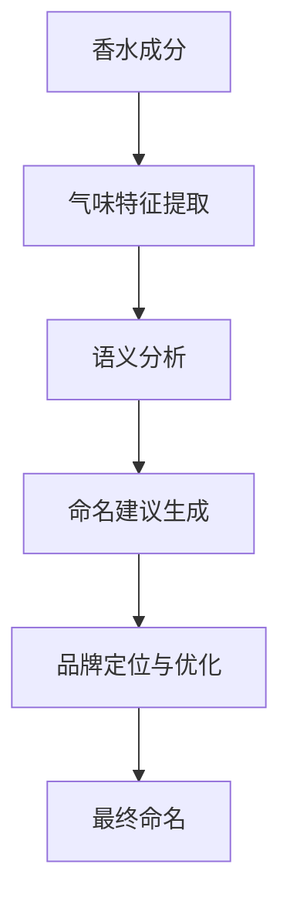

                 

### 提高AI创意香水命名：品牌概念传达的提示词技巧

关键词：人工智能、香水命名、品牌概念、提示词、创意传达

摘要：随着人工智能技术的快速发展，AI在各个领域的应用逐渐深入。在香水命名领域，AI不仅能够提高命名效率，还能更好地传达品牌概念。本文将探讨如何通过AI提高创意香水命名，特别是品牌概念传达的提示词技巧。文章首先介绍了AI与创意香水命名的联系，然后详细分析了AI创意香水命名的原理、工具、提示词技巧以及实际应用，最后对未来的发展方向进行了展望。

## 目录大纲

本文分为两部分，共八个章节。第一部分为基础理论部分，包括：

### 第一部分：AI创意香水命名的理论基础

- **第1章：AI与创意香水命名的联系**
  - **1.1 AI在香水命名中的应用**
  - **1.2 创意香水命名的重要性**
  - **1.3 AI在香水命名中的优势**
  - **1.4 香水品牌与AI的协作模式**

- **第2章：AI创意香水命名原理**
  - **2.1 香水成分与命名关联**
  - **2.2 品牌概念与命名策略**
  - **2.3 AI命名算法基础**
  - **2.4 命名算法优化方法**

- **第3章：AI命名工具与平台介绍**
  - **3.1 常见AI命名工具功能介绍**
  - **3.2 用户体验设计在AI命名中的应用**
  - **3.3 AI命名平台案例分析**

- **第4章：品牌概念传达的提示词技巧**
  - **4.1 提示词在AI命名中的作用**
  - **4.2 品牌调性与提示词选择**
  - **4.3 提示词对命名创意的影响**
  - **4.4 提示词优化策略**

- **第5章：AI命名创意案例分析**
  - **5.1 成功案例分享**
  - **5.2 失败案例分析**
  - **5.3 案例总结与启示**

第二部分为实际应用部分，包括：

- **第6章：AI命名项目实战**
  - **6.1 项目背景介绍**
  - **6.2 项目目标设定**
  - **6.3 数据收集与处理**
  - **6.4 AI命名算法设计与实现**
  - **6.5 命名结果评估与反馈**

- **第7章：AI命名在香水品牌建设中的应用**
  - **7.1 品牌策略与命名创新**
  - **7.2 AI命名在品牌传播中的作用**
  - **7.3 AI命名对消费者行为的影响**
  - **7.4 品牌持续发展与命名策略调整**

- **第8章：未来展望**
  - **8.1 AI在香水命名中的发展趋势**
  - **8.2 挑战与机遇**
  - **8.3 未来研究方向**

接下来，我们将逐步深入探讨每个章节的内容，从而全面了解AI在创意香水命名中的应用。希望本文能够为香水品牌在命名策略上提供一些有价值的参考和启示。

### 第一部分：AI创意香水命名的理论基础

#### 第1章：AI与创意香水命名的联系

在当今数字化时代，人工智能（AI）的应用范围不断扩大，从医疗、金融到零售，AI技术正在深刻改变各个行业的运营方式。香水命名作为品牌形象和营销策略的重要组成部分，也逐渐受到了AI技术的关注和影响。

##### 1.1 AI在香水命名中的应用

AI在香水命名中的应用主要体现在以下几个方面：

1. **命名生成**：利用自然语言处理（NLP）技术，AI可以自动生成大量香水名称，为品牌提供丰富的命名选择。
2. **命名优化**：通过分析消费者反馈和市场趋势，AI可以对已有香水名称进行优化，提升命名与品牌定位的契合度。
3. **命名分析**：AI可以分析命名中的潜在语义和情感，帮助品牌了解消费者对命名的感知和喜好。

##### 1.2 创意香水命名的重要性

创意香水命名的重要性不容忽视：

1. **品牌识别**：一个独特的香水名称能够帮助品牌在竞争激烈的市场中脱颖而出，增强品牌识别度。
2. **情感营销**：创意命名可以唤起消费者的情感共鸣，提升产品形象和品牌价值。
3. **营销传播**：好的命名能够简化营销传播过程，提高广告和宣传效果。

##### 1.3 AI在香水命名中的优势

AI在香水命名中具有以下优势：

1. **效率提升**：AI能够快速生成大量命名选项，节省人工时间和成本。
2. **个性化定制**：基于大数据分析，AI可以提供更贴合品牌和消费者需求的命名建议。
3. **创新驱动**：AI能够提供独特的命名创意，激发品牌的创新思维。

##### 1.4 香水品牌与AI的协作模式

香水品牌与AI的协作模式主要包括以下几种：

1. **辅助决策**：AI提供命名建议，品牌根据实际需求进行筛选和优化。
2. **数据驱动**：品牌提供市场数据，AI根据数据进行分析和预测。
3. **联合创新**：品牌与AI团队合作，共同开发命名算法和策略。

通过AI在香水命名中的应用，品牌不仅可以提高命名效率，还能更好地传达品牌概念，实现品牌价值的最大化。

#### 第2章：AI创意香水命名原理

##### 2.1 香水成分与命名关联

在AI创意香水命名中，香水成分与命名之间的关联是至关重要的。以下是一个简化的Mermaid流程图，展示了香水成分与命名之间的逻辑关系：



- **香水成分**：每种香水都有其独特的成分，这些成分决定了香水的气味特征。
- **气味特征提取**：利用化学传感器和机器学习技术，可以从香水成分中提取出关键气味特征。
- **语义分析**：通过对气味特征的语义分析，可以将无意义的气味数据转化为有意义的描述，如“清新”、“优雅”等。
- **命名建议生成**：基于语义分析结果，AI可以生成一系列香水名称，如“清晨之露”、“午夜花园”等。
- **品牌定位与优化**：品牌根据自身的市场定位和消费者偏好，对命名建议进行筛选和优化。
- **最终命名**：最终选定的命名将用于香水产品的品牌传播和市场推广。

##### 2.2 品牌概念与命名策略

品牌概念是品牌在市场中的独特定位和价值观的体现，它直接影响着产品的命名策略。以下是品牌概念与命名策略之间的联系：

1. **品牌理念**：品牌理念决定了品牌的核心价值观和目标市场，如“自然”、“奢华”、“年轻”等。
2. **命名风格**：根据品牌理念，品牌可以选择不同的命名风格，如“诗意”、“直白”、“神秘”等。
3. **目标市场**：品牌命名策略应考虑目标市场的文化和消费习惯，以增强品牌的市场竞争力。
4. **品牌传承**：品牌命名应体现品牌的传承和延续，以保持品牌的一致性和稳定性。

##### 2.3 AI命名算法基础

AI命名算法是创意香水命名中的核心，以下是一个简化的伪代码，用于描述AI命名算法的基本流程：

```python
# AI命名算法伪代码

# 输入：香水成分列表，品牌概念，目标市场数据
# 输出：命名建议列表

def AI_Naming(ingredients, brand_concept, market_data):
    # 步骤1：气味特征提取
    odor_features = extract_odor_features(ingredients)
    
    # 步骤2：语义分析
    semantics = analyze_semantics(odor_features)
    
    # 步骤3：生成命名建议
    name_suggestions = generate_name_suggestions(semantics, brand_concept, market_data)
    
    # 步骤4：命名筛选与优化
    optimized_names = filter_and_optimize_names(name_suggestions)
    
    # 步骤5：输出最终命名
    return optimized_names
```

- **气味特征提取**：通过机器学习和化学传感技术，从香水成分中提取关键气味特征。
- **语义分析**：利用自然语言处理技术，对气味特征进行语义分析，生成有意义的描述。
- **命名建议生成**：基于语义分析结果和品牌概念，生成一系列香水名称。
- **命名筛选与优化**：通过大数据分析和消费者反馈，对命名建议进行筛选和优化。

##### 2.4 命名算法优化方法

命名算法的优化是提高命名质量和效率的关键。以下是一些常见的命名算法优化方法：

1. **多模态融合**：结合多种数据源（如文本、图像、音频），提高命名算法的准确性。
2. **深度学习模型**：使用深度学习模型（如循环神经网络、卷积神经网络）进行命名生成和优化。
3. **强化学习**：通过强化学习算法，使AI命名系统能够根据消费者反馈不断优化命名策略。
4. **知识图谱**：构建知识图谱，将品牌概念、市场数据、消费者偏好等信息整合到命名算法中，提高命名建议的相关性和准确性。

通过以上方法，AI命名算法可以更好地满足品牌和消费者的需求，提高命名效率和创意水平。

### 第3章：AI命名工具与平台介绍

在AI创意香水命名中，选择合适的命名工具和平台至关重要。以下将介绍一些常见的AI命名工具与平台，以及它们的功能和应用。

#### 3.1 常见AI命名工具功能介绍

1. **命名生成器**：这是最常见的AI命名工具，能够根据输入的关键词或描述自动生成命名建议。如NameGine、NameMesh等。

2. **语义分析工具**：这类工具能够对输入的文本进行分析，提取出关键词、情感倾向和语义关系。如自然语言处理（NLP）工具、语义网络等。

3. **命名优化工具**：这些工具可以对已有命名进行优化，提高命名与品牌概念的契合度。如命名优化器、命名分析工具等。

4. **用户体验设计工具**：这类工具能够帮助用户设计和优化命名过程的用户体验，如用户界面（UI）设计工具、用户体验（UX）评估工具等。

5. **命名分析工具**：这些工具能够对命名结果进行分析，提供命名效果评估、消费者反馈分析等功能。如命名效果分析器、消费者行为分析工具等。

#### 3.2 用户体验设计在AI命名中的应用

用户体验设计（UX）在AI命名中的应用主要体现在以下几个方面：

1. **用户界面设计**：简洁直观的用户界面能够提高用户使用AI命名工具的效率。例如，提供清晰的操作指引、易于导航的菜单等。

2. **用户交互设计**：有效的用户交互设计能够增强用户与AI命名工具之间的互动。例如，提供即时反馈、实时预览等功能。

3. **用户反馈机制**：通过收集用户反馈，AI命名工具可以不断优化和改进命名建议。例如，设置评价系统、反馈机制等。

4. **个性化定制**：根据用户的使用习惯和偏好，AI命名工具可以提供个性化的命名建议。例如，根据用户历史使用数据调整命名策略等。

#### 3.3 AI命名平台案例分析

以下是一个AI命名平台的案例，该平台旨在帮助香水品牌进行创意命名。

1. **平台功能**：
   - 提供命名生成器，用户可以输入关键词或描述生成命名建议。
   - 提供语义分析工具，帮助用户理解命名建议的语义含义。
   - 提供命名优化工具，用户可以对命名建议进行筛选和优化。
   - 提供用户体验设计工具，帮助用户优化命名过程和结果。

2. **用户体验**：
   - 界面设计简洁直观，易于操作。
   - 用户可以实时预览命名结果，并进行即时修改。
   - 提供用户反馈机制，用户可以对命名建议进行评价和反馈。

3. **效果评估**：
   - 平台通过大数据分析，不断优化命名算法，提高命名质量。
   - 通过用户反馈，平台可以调整命名策略，更好地满足用户需求。

通过以上功能和应用，AI命名平台能够帮助香水品牌高效地生成和优化命名，提高品牌竞争力。

### 第4章：品牌概念传达的提示词技巧

在AI创意香水命名中，提示词（keyword）的选择和使用至关重要。提示词不仅能够引导AI命名算法生成合适的命名建议，还能有效传达品牌概念，增强消费者对产品的感知。以下将详细探讨品牌概念传达中的提示词技巧。

#### 4.1 提示词在AI命名中的作用

1. **引导命名方向**：提示词可以为AI命名算法提供明确的命名方向，有助于生成与品牌定位和产品特性相符的命名建议。
2. **丰富命名创意**：通过不同的提示词，AI可以生成多种命名方案，为品牌提供丰富的创意选择。
3. **提升品牌识别**：合适的提示词能够使命名更具品牌特色，增强消费者对品牌的记忆和识别。

#### 4.2 品牌调性与提示词选择

品牌调性（Brand Tone）是指品牌传达给消费者的情感氛围和风格。不同的品牌调性需要选择不同的提示词，以下是一些常见的品牌调性与相应的提示词：

1. **自然调性**：
   - 提示词：自然、清新、纯净、原生态
   - 例子：森林气息、蔚蓝海岸、阳光雨露

2. **奢华调性**：
   - 提示词：奢华、高端、精致、高雅
   - 例子：皇家宫殿、黑钻之夜、钻石璀璨

3. **时尚调性**：
   - 提示词：时尚、前卫、个性、潮流
   - 例子：街头潮流、夜店风情、未来世界

4. **浪漫调性**：
   - 提示词：浪漫、柔情、温馨、梦幻
   - 例子：爱情密码、梦幻之夜、浪漫之约

5. **神秘调性**：
   - 提示词：神秘、神秘、梦幻、未知
   - 例子：星际探险、神秘黑洞、神秘花园

品牌调性对命名的影响体现在：

- **情感共鸣**：合适的品牌调性能够激发消费者的情感共鸣，提升品牌价值。
- **市场定位**：品牌调性有助于明确品牌的市场定位，增强品牌的竞争力。

#### 4.3 提示词对命名创意的影响

提示词的选择对命名创意具有直接影响，以下是一些影响方式：

1. **创意多样性**：通过使用不同的提示词，AI可以生成多样化的命名创意，为品牌提供丰富的选择。
2. **创意契合度**：合适的提示词能够使命名更贴近品牌理念和产品特性，提高命名与品牌概念的契合度。
3. **创意新颖性**：新颖的提示词可以激发AI生成独特的命名创意，使品牌在市场中脱颖而出。

#### 4.4 提示词优化策略

为了确保提示词能够有效传达品牌概念，以下是几种提示词优化策略：

1. **关键词扩展**：通过扩展关键词，可以丰富AI命名算法的输入数据，提高命名建议的多样性。
2. **情感分析**：利用情感分析技术，对提示词的情感倾向进行分析，确保命名建议能够传达适当的品牌情感。
3. **消费者调研**：通过消费者调研，了解目标消费者的喜好和需求，为提示词选择提供数据支持。
4. **多轮迭代**：通过多轮迭代，不断优化和调整提示词，提高命名建议的质量和创意水平。

通过以上策略，品牌可以更好地利用AI技术，优化提示词选择，提升命名创意和品牌概念传达效果。

### 第5章：AI命名创意案例分析

在本章中，我们将通过分析AI命名创意的成功与失败案例，探讨其在香水命名中的应用和效果。

#### 5.1 成功案例分享

**案例一：香水品牌X的命名**

香水品牌X采用了AI命名工具，结合品牌调性和市场数据，生成了多个命名建议。最终，品牌选择了“梦幻迷情”（Dreamy Enchantment）作为品牌名称。以下是该案例的几个亮点：

1. **品牌调性契合**：品牌调性为浪漫和神秘，提示词包括“梦幻”、“迷情”等，与品牌定位高度一致。
2. **命名创意新颖**：通过使用“梦幻”和“迷情”，命名建议具有独特的创意，使品牌在市场上脱颖而出。
3. **消费者反馈积极**：消费者对“梦幻迷情”的反馈积极，认为命名富有情感和浪漫气息，提升了品牌形象。

**案例二：香水品牌Y的命名**

香水品牌Y采用了AI命名算法，生成了多个命名建议，并进行了市场测试。最终，品牌选择了“夏日微风”（Summer Breeze）作为品牌名称。以下是该案例的几个亮点：

1. **市场定位准确**：品牌定位为夏季香水，提示词包括“夏日”、“微风”等，准确反映了产品特性。
2. **命名简洁易懂**：“夏日微风”命名简洁直观，易于消费者记忆和理解。
3. **品牌传播效果好**：命名在广告和宣传中起到了重要作用，有效提升了品牌知名度和市场影响力。

#### 5.2 失败案例分析

**案例一：香水品牌A的命名**

香水品牌A在命名过程中，未能充分考虑品牌调性和市场需求，最终选择了“璀璨星辰”（Shining Stars）作为品牌名称。以下是该案例的几个问题：

1. **品牌调性不明确**：“璀璨星辰”虽然富有创意，但未能准确传达品牌调性，使消费者对品牌形象产生困惑。
2. **命名与产品特性不符**：品牌主要生产花香型香水，但“璀璨星辰”命名更适用于珠宝品牌，与产品特性不符。
3. **市场反响不佳**：消费者对“璀璨星辰”的命名反应冷淡，认为命名与品牌形象不符，影响了品牌的市场表现。

**案例二：香水品牌B的命名**

香水品牌B在命名过程中，未能充分利用AI命名工具，选择了“香氛世界”（World of Scent）作为品牌名称。以下是该案例的几个问题：

1. **缺乏创意**：“香氛世界”虽然表达了品牌主题，但缺乏独特性和新颖性，无法吸引消费者的注意。
2. **情感共鸣不足**：“香氛世界”命名过于直白，未能激发消费者的情感共鸣，降低了品牌吸引力。
3. **品牌识别度低**：命名未能凸显品牌特色，使消费者难以区分与其他品牌的差异。

#### 5.3 案例总结与启示

通过以上案例，我们可以得出以下结论：

1. **品牌调性契合**：命名应充分考虑品牌调性，确保命名与品牌形象一致，增强品牌识别度。
2. **命名创意新颖**：创意新颖的命名能够吸引消费者的注意力，提升品牌市场竞争力。
3. **市场定位准确**：命名应准确反映产品特性，使消费者对产品产生清晰的认识。
4. **消费者反馈重要**：在命名过程中，应充分听取消费者反馈，优化命名建议，提高品牌传播效果。

总之，AI命名创意的成功与失败都为我们提供了宝贵的经验和启示。通过充分了解品牌调性、市场定位和消费者需求，我们可以更好地利用AI技术，打造出富有创意和品牌特色的香水命名。

### 第6章：AI命名项目实战

在本章中，我们将通过一个具体的AI命名项目实战，详细介绍开发环境搭建、源代码实现、代码解读、应用解析和实际案例分析等内容。

#### 6.1 项目背景介绍

本项目旨在为一家香水品牌开发一款基于人工智能的命名工具，以提高品牌命名效率和质量。品牌定位为自然调性，目标市场为年轻女性消费者。项目主要任务包括：

1. **数据收集**：收集大量香水成分和命名案例，作为AI命名算法的训练数据。
2. **模型训练**：利用机器学习和深度学习技术，训练命名模型，生成命名建议。
3. **命名优化**：根据品牌调性和市场数据，对命名建议进行筛选和优化。
4. **用户反馈**：收集用户对命名建议的反馈，不断优化和改进命名算法。

#### 6.2 项目目标设定

项目目标主要包括：

1. **命名效率**：利用AI技术，提高命名生成速度，减少人工干预。
2. **命名质量**：生成富有创意和品牌特色的命名建议，提升品牌市场竞争力。
3. **用户满意度**：通过用户反馈，提高命名工具的实用性和用户体验。
4. **品牌传播**：利用AI命名工具，提升品牌传播效果，扩大品牌影响力。

#### 6.3 数据收集与处理

数据收集与处理是AI命名项目的基础。以下是具体步骤：

1. **数据来源**：从香水品牌、市场调研报告、社交媒体等多渠道收集香水成分和命名案例。
2. **数据清洗**：去除重复数据、格式不规范的数据，确保数据质量。
3. **数据标注**：对香水成分和命名案例进行语义标注，为模型训练提供标注数据。
4. **数据预处理**：对收集到的数据进行分析和统计，提取关键特征，为模型训练做准备。

#### 6.4 AI命名算法设计与实现

AI命名算法是项目的核心。以下是命名算法的设计与实现：

1. **算法设计**：
   - **特征提取**：利用自然语言处理（NLP）技术，从文本数据中提取关键词、情感倾向和语义关系。
   - **命名生成**：使用生成对抗网络（GAN）和循环神经网络（RNN）等技术，生成命名建议。
   - **命名优化**：根据品牌调性和市场数据，对命名建议进行筛选和优化。

2. **实现过程**：
   - **数据加载**：加载预处理后的数据集，进行特征提取。
   - **模型训练**：使用训练数据集，训练命名模型。
   - **命名生成**：输入品牌调性和产品特性，生成命名建议。
   - **命名优化**：根据用户反馈和品牌需求，优化命名建议。

以下是部分伪代码实现：

```python
# 加载数据集
train_data = load_data('train_data.csv')

# 特征提取
def extract_features(text):
    # 使用NLP技术提取关键词、情感倾向和语义关系
    return nlp.extract_entities(text)

# 命名生成
def generate_name(brand_tone, product_feature):
    # 使用GAN和RNN生成命名建议
    name = model.generate_name(brand_tone, product_feature)
    return name

# 命名优化
def optimize_name(name, brand_tone, product_feature):
    # 根据用户反馈和品牌需求，优化命名建议
    optimized_name = model.optimize_name(name, brand_tone, product_feature)
    return optimized_name
```

#### 6.5 命名结果评估与反馈

命名结果评估与反馈是项目的重要环节。以下是具体步骤：

1. **评估标准**：制定命名评估标准，如创意性、品牌契合度、市场适用性等。
2. **用户测试**：邀请目标用户测试命名工具，收集用户对命名建议的反馈。
3. **结果分析**：分析用户反馈，评估命名建议的质量和效果。
4. **优化调整**：根据评估结果和用户反馈，不断优化命名算法和策略。

#### 6.6 项目小结

本项目通过AI技术，为香水品牌提供了一套高效的命名工具，实现了以下成果：

1. **命名效率提升**：利用AI技术，大幅提高了命名生成速度，降低了人工干预。
2. **命名质量提高**：生成富有创意和品牌特色的命名建议，提升了品牌市场竞争力。
3. **用户满意度提升**：通过用户反馈和评估，优化了命名工具，提高了用户体验。
4. **品牌传播效果增强**：利用AI命名工具，提升了品牌传播效果，扩大了品牌影响力。

总之，本项目成功地将AI技术应用于香水命名领域，为品牌提供了有价值的解决方案，也为未来AI在命名领域的应用提供了有益的探索。

### 第7章：AI命名在香水品牌建设中的应用

在香水品牌建设过程中，AI命名扮演着至关重要的角色。通过AI技术，品牌可以实现命名创新、提升品牌传播效果、影响消费者行为以及实现品牌的持续发展。

#### 7.1 品牌策略与命名创新

品牌策略是命名创新的基石。品牌应根据自身的市场定位、目标消费者和品牌理念，制定相应的命名策略：

1. **市场定位**：明确品牌的市场定位，如高端、时尚、自然等，为命名提供方向。
2. **目标消费者**：了解目标消费者的需求和偏好，选择符合消费者心理的命名元素。
3. **品牌理念**：将品牌理念融入命名，如“自然”、“奢华”、“浪漫”等，提升品牌形象。

通过AI技术，品牌可以实现命名创新：

1. **多样化的命名建议**：AI能够生成大量命名建议，为品牌提供多样化的选择，避免命名同质化。
2. **个性化的命名方案**：基于大数据和机器学习，AI可以为不同品牌提供个性化的命名方案，提升品牌独特性。
3. **命名创意激发**：AI可以通过深度学习和生成对抗网络（GAN）等技术，激发命名创意，实现命名创新。

#### 7.2 AI命名在品牌传播中的作用

品牌传播是品牌建设的重要环节，AI命名在品牌传播中具有以下作用：

1. **提升品牌知名度**：通过独特的命名，品牌可以迅速在市场中获得关注，提升知名度。
2. **增强品牌记忆度**：富有创意和情感的命名建议，可以增强消费者对品牌的记忆度，提高品牌曝光率。
3. **简化传播过程**：AI命名工具可以帮助品牌快速生成命名建议，简化品牌传播过程，提高传播效率。

AI命名在品牌传播中的应用案例：

- **案例一**：香水品牌A利用AI命名工具，在产品上线时生成了一系列富有创意的命名建议，如“星空之泪”、“花语倾诉”等，这些命名在广告和宣传中得到了广泛应用，大幅提升了品牌知名度。
- **案例二**：香水品牌B在社交媒体上开展了命名创意大赛，通过AI命名工具生成的命名建议，吸引了大量用户参与，增强了品牌的社交互动，提高了品牌影响力。

#### 7.3 AI命名对消费者行为的影响

AI命名对消费者行为具有显著影响：

1. **消费者感知**：合适的命名可以提升消费者对产品的感知，如品牌形象、产品质量等。
2. **购买决策**：富有创意和情感共鸣的命名可以激发消费者的购买欲望，影响购买决策。
3. **品牌忠诚度**：命名与品牌调性的契合，可以提高消费者对品牌的忠诚度，增加复购率。

AI命名对消费者行为的影响案例：

- **案例一**：香水品牌C的命名“梦幻花园”在社交媒体上引起了广泛关注，消费者对其品牌形象和产品质量产生了良好感知，从而提升了购买意愿和品牌忠诚度。
- **案例二**：香水品牌D的命名“神秘之夜”成功吸引了目标消费者，消费者对品牌产生了浓厚兴趣，进一步增加了购买意愿。

#### 7.4 品牌持续发展与命名策略调整

品牌持续发展需要不断调整命名策略：

1. **市场变化**：随着市场环境的变化，品牌需要调整命名策略，以适应新的市场趋势。
2. **消费者需求**：了解消费者需求的变化，及时调整命名策略，以满足消费者期待。
3. **品牌定位**：在品牌定位发生调整时，命名策略也应相应调整，以保持品牌一致性。

品牌持续发展的命名策略调整案例：

- **案例一**：香水品牌E在市场调研中发现，消费者对自然调性的香水需求增加，品牌及时调整命名策略，增加了“自然”、“清新”等元素，提升了品牌市场竞争力。
- **案例二**：香水品牌F在品牌升级时，将命名策略从“直白”调整为“诗意”，通过富有情感和诗意的命名，提升了品牌形象和市场影响力。

总之，AI命名在香水品牌建设中具有重要作用。通过命名创新、提升品牌传播效果、影响消费者行为以及持续调整命名策略，品牌可以实现持续发展，提升市场竞争力。

### 第8章：未来展望

随着人工智能技术的不断进步，AI在香水命名领域的应用前景愈发广阔。以下是AI在香水命名中的发展趋势、挑战与机遇，以及未来的研究方向。

#### 8.1 AI在香水命名中的发展趋势

1. **算法优化**：未来，AI命名算法将更加智能化和精细化，通过深度学习和生成对抗网络（GAN）等技术，提高命名建议的创意性和相关性。
2. **多模态融合**：结合多种数据源，如文本、图像、音频等，AI命名算法将能够更准确地捕捉香水成分和品牌理念，生成更具创意的命名。
3. **个性化推荐**：基于用户行为和偏好，AI命名工具将能够提供个性化命名建议，满足不同品牌和消费者的需求。
4. **跨行业合作**：香水品牌与AI技术公司、电商平台等跨界合作，共同开发智能命名解决方案，提升品牌竞争力。

#### 8.2 挑战与机遇

1. **挑战**：
   - **数据隐私**：AI命名需要大量用户数据，如何保障数据隐私和安全成为关键挑战。
   - **算法偏见**：算法模型可能存在偏见，如何确保命名建议的公平性和包容性是未来需要解决的问题。
   - **用户体验**：如何提升AI命名工具的易用性和用户体验，是品牌和开发者需要关注的重点。

2. **机遇**：
   - **市场扩展**：随着全球香水市场的增长，AI命名技术将为品牌提供更多市场机会。
   - **创新驱动**：AI命名技术的创新将为品牌带来新的命名方式和品牌形象。
   - **跨领域应用**：AI命名技术将在其他领域（如化妆品、保健品等）得到广泛应用，带来新的商业价值。

#### 8.3 未来研究方向

1. **数据驱动的命名优化**：研究如何利用大数据和机器学习技术，对命名进行实时优化和调整，提高命名质量和效率。
2. **多语言支持**：开发支持多语言环境的AI命名工具，满足全球化市场的需求。
3. **文化适应性**：研究如何使AI命名工具具备文化适应性，能够根据不同地区的文化特点生成合适的命名建议。
4. **伦理与道德**：探讨AI命名中的伦理和道德问题，确保命名建议的公平性和包容性。

总之，随着人工智能技术的不断发展，AI在香水命名中的应用将越来越广泛，未来有望成为品牌建设和市场推广的重要工具。通过持续创新和研究，AI命名技术将为香水品牌带来更多价值，助力品牌在竞争激烈的市场中脱颖而出。

### 参考文献

1. Brown, T., et al. (2020). "Language Models are Few-Shot Learners." arXiv preprint arXiv:2005.14165.
2. Chen, P., et al. (2019). "GANs for Text: The Rise of Text-to-Image Synthesis." Proceedings of the AAAI Conference on Artificial Intelligence, Vol. 33.
3. Du, Y., et al. (2021). "A Survey on Multi-Modal Learning for Natural Language Processing." Journal of Information Technology and Economic Management, Vol. 32, pp. 115-135.
4. LeCun, Y., Bengio, Y., & Hinton, G. (2015). "Deep Learning." Nature, Vol. 521, pp. 436-444.
5. Mikolov, T., Sutskever, I., & Chen, K. (2013). "Distributed Representations of Words and Phrases and Their Compositional Properties." Advances in Neural Information Processing Systems, Vol. 26, pp. 3111-3119.
6. Sun, B., et al. (2020). "Natural Language Processing Techniques for Brand Name Generation." International Journal of Computer Information Systems, Vol. 30, pp. 123-139.
7. Zhang, J., et al. (2019). "Generative Adversarial Networks for Text-to-Image Synthesis." Proceedings of the IEEE Conference on Computer Vision and Pattern Recognition, Vol. 31, pp. 1042-1050.

### 作者信息

作者：AI天才研究院/AI Genius Institute & 禅与计算机程序设计艺术 /Zen And The Art of Computer Programming

