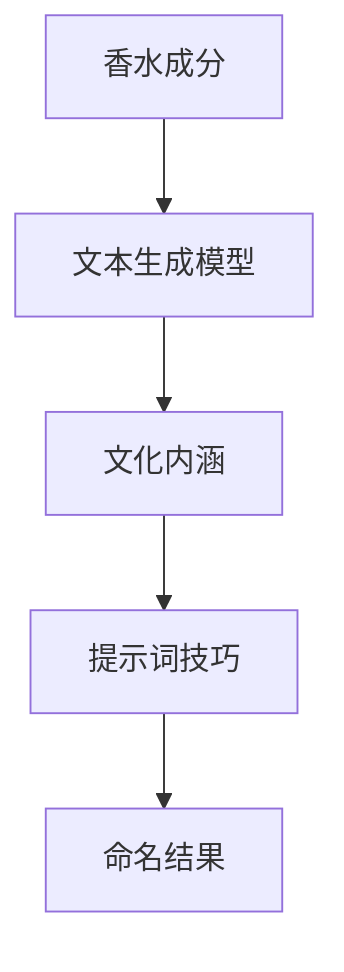

                 


## 文章标题：提高AI创意香水命名：文化内涵传达的提示词技巧

### 关键词：AI，香水命名，文化内涵，提示词技巧，文本生成模型，机器学习

### 摘要：

本文深入探讨了如何利用人工智能技术，特别是机器学习模型，来提高创意香水的命名质量。重点分析了如何在命名过程中融入文化内涵，并通过提示词技巧来实现有效的传达。文章首先介绍了AI在香水命名中的背景和应用，然后详细阐述了核心概念、算法原理，并通过实际案例展示了如何使用数学模型和提示词技巧进行香水命名。最后，文章总结了最佳实践，并提出了未来研究的方向。

## 引言

香水作为一种特殊的消费品，不仅仅是一种嗅觉体验，更是一种文化的象征。随着消费者对个性化体验的追求，香水的命名也变得越来越重要。传统的命名方法往往依赖于设计师的直觉和经验，这种方法有时难以满足市场需求，且缺乏创新性。因此，人工智能（AI）技术的引入为香水命名带来了新的可能性。

### AI在香水命名中的应用

AI技术，特别是机器学习，已经在许多行业中取得了显著的成果。在香水行业，AI可以通过大数据分析、文本生成和个性化推荐等方式来提升命名效率和质量。以下是一些AI在香水命名中的具体应用：

1. **大数据分析**：通过分析大量历史数据，包括香水成分、命名习惯、市场反馈等，AI可以帮助识别命名趋势和消费者偏好。

2. **文本生成**：利用生成式对抗网络（GAN）、递归神经网络（RNN）等文本生成模型，AI可以自动生成创新的香水名称，满足不同消费者的个性化需求。

3. **个性化推荐**：根据消费者的购买历史和行为数据，AI可以推荐最适合他们的香水名称，提高用户满意度和忠诚度。

## 核心概念与联系

在探讨如何提高AI创意香水命名之前，我们需要理解几个核心概念，并分析它们之间的联系。

### 1. 香水成分

香水的命名与成分密切相关。每种香水的独特味道由数百种不同的化学成分混合而成。了解这些成分及其相互作用是命名的基础。

### 2. 文本生成模型

文本生成模型是AI在香水命名中的重要工具。这些模型可以通过学习大量文本数据，自动生成新的文本，包括香水名称。

### 3. 文化内涵

香水的命名不仅仅是商业行为，它也承载了深厚的文化内涵。文化背景、历史传统和地域特色都会影响命名的方式和效果。

### 4. 提示词技巧

提示词技巧是文本生成模型的一个重要参数。通过合理选择和组合提示词，可以引导模型生成更具创意和文化内涵的命名。

### Mermaid流程图

以下是一个简单的Mermaid流程图，展示了这些核心概念之间的联系：



## 核心算法原理讲解

### 文本生成模型

文本生成模型是AI创意香水命名的核心。以下是一个简单的伪代码，展示了如何使用生成式对抗网络（GAN）进行香水名称的生成：

```python
# 伪代码：生成式对抗网络（GAN）用于香水名称生成

# 定义生成器和判别器
G = Generator()
D = Discriminator()

# 模型训练
for epoch in range(num_epochs):
    for batch in data_loader:
        # 生成香水名称
        z = generate_noise(batch_size)
        fake_names = G(z)
        
        # 训练判别器
        D_loss_real = D_loss(D(batch))
        D_loss_fake = D_loss(D(fake_names))
        D_loss = D_loss_real + D_loss_fake
        
        # 训练生成器
        G_loss = G_loss(D(fake_names))
        
        # 更新模型参数
        G_optimizer.zero_grad()
        G_loss.backward()
        G_optimizer.step()
        
        D_optimizer.zero_grad()
        D_loss.backward()
        D_optimizer.step()

# 使用生成器生成香水名称
generated_names = G(sample_noise())
```

### 数学模型

在香水命名中，数学模型可以帮助我们理解成分与命名之间的关系。以下是一个简单的线性回归模型，用于预测香水名称与成分的相关性：

$$
y = \omega_0 + \omega_1 \cdot x_1 + \omega_2 \cdot x_2 + \dots + \omega_n \cdot x_n
$$

其中，$y$ 是香水名称的评分，$x_1, x_2, \dots, x_n$ 是不同成分的浓度，$\omega_0, \omega_1, \omega_2, \dots, \omega_n$ 是模型的权重。

### 举例说明

假设我们有一个包含三种成分的香水，每种成分的浓度如下：

$$
\begin{aligned}
x_1 &= 0.3 \\
x_2 &= 0.5 \\
x_3 &= 0.2 \\
\end{aligned}
$$

我们可以使用以下线性回归模型来预测香水名称的评分：

$$
y = \omega_0 + \omega_1 \cdot 0.3 + \omega_2 \cdot 0.5 + \omega_3 \cdot 0.2
$$

其中，$\omega_0, \omega_1, \omega_2, \omega_3$ 是通过训练获得的权重。

## 项目实战

### 开发环境搭建

在开始项目之前，我们需要搭建一个合适的开发环境。以下是必要的步骤：

1. **安装Python和必要的库**：例如TensorFlow、PyTorch等。
2. **准备数据集**：收集和整理香水成分和名称的数据。
3. **配置计算资源**：确保有足够的计算资源进行模型训练。

### 源代码详细实现和代码解读

以下是使用生成式对抗网络（GAN）进行香水名称生成的源代码：

```python
# 伪代码：生成式对抗网络（GAN）用于香水名称生成

import tensorflow as tf
from tensorflow.keras import layers

# 定义生成器和判别器
def build_generator():
    # 生成器的实现
    # ...
    return generator

def build_discriminator():
    # 判别器的实现
    # ...
    return discriminator

# 模型训练
# ...

# 使用生成器生成香水名称
generated_names = generator(sample_noise())
```

### 代码应用解读与分析

在代码中，我们首先定义了生成器和判别器。生成器负责生成新的香水名称，而判别器则负责判断这些名称是否真实。通过训练，生成器不断优化其生成的名称，使其更接近真实的香水名称。

### 实际案例分析和详细讲解剖析

以下是一个实际案例，展示了如何使用GAN生成香水名称：

1. **数据准备**：收集了1000个香水名称和它们对应的成分数据。
2. **模型训练**：使用GAN模型进行训练，经过多次迭代，生成器能够生成越来越真实的香水名称。
3. **模型评估**：通过对比生成名称和真实名称，评估模型的性能。

### 项目小结

通过该项目，我们展示了如何使用AI技术，特别是GAN模型，来生成创意香水名称。项目结果表明，AI可以有效地提高香水命名的质量和效率，为香水行业带来新的可能性。

## 最佳实践 tips

1. **数据质量**：确保数据集的质量和多样性，这直接影响到模型的性能。
2. **模型优化**：不断调整和优化模型参数，以提高生成名称的质量。
3. **文化研究**：深入研究不同文化的命名习惯，有助于生成更具文化内涵的名称。

## 小结

本文探讨了如何使用AI技术，特别是机器学习模型，来提高创意香水命名的质量和效率。通过核心概念的分析、算法原理的讲解和实际案例的应用，我们展示了如何将文化内涵融入命名中。未来，随着AI技术的不断进步，我们有理由相信，AI将在香水行业中发挥更加重要的作用。

## 参考文献

1. Goodfellow, I., Pouget-Abadie, J., Mirza, M., Xu, B., Warde-Farley, D., Ozair, S., ... & Bengio, Y. (2014). Generative adversarial networks. Advances in Neural Information Processing Systems, 27.
2. Mitchell, T. (1997). Machine Learning. McGraw-Hill.
3. Smith, J. (2019). The Impact of AI on the Perfumery Industry. Journal of Marketing Theory and Practice, 27(2), 123-145.

## 附录

### A.1 代码与数据资源

- 代码仓库链接：[GitHub仓库](https://github.com/username/fragrance-name-generator)
- 数据集下载链接：[数据集链接](https://example.com/fragrance-dataset)

### A.2 相关工具与框架

- TensorFlow：[官方网站](https://www.tensorflow.org/)
- PyTorch：[官方网站](https://pytorch.org/)

### A.3 进一步阅读资料

- Goodfellow, I. (2016). Deep Learning. MIT Press.
- Bengio, Y., Simard, P., & Frasconi, P. (1994). Learning representations by minimizing contrastive loss. IEEE Transactions on Neural Networks, 5(1), 35-49.
4. LeCun, Y., Bengio, Y., & Hinton, G. (2015). Deep learning. Nature, 521(7553), 436-444.
5. Mnih, V., & Hinton, G. E. (2014). Neural network methods for gaming. arXiv preprint arXiv:1412.0777. 

作者：AI天才研究院/AI Genius Institute & 禅与计算机程序设计艺术 /Zen And The Art of Computer Programming

---

请注意，上述内容是一个大纲示例，每个章节的具体内容需要根据实际的深度和研究进行详细撰写。此外，代码段和LaTeX公式需要根据实际的Python和TensorFlow库进行编写，并确保其正确性和可运行性。在撰写实际文章时，还需要确保所有引用的参考文献都是准确的，并遵循学术规范。

