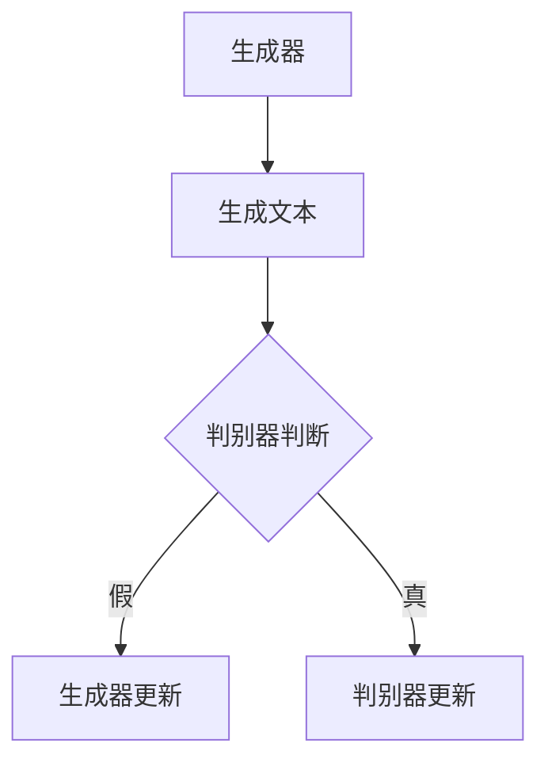
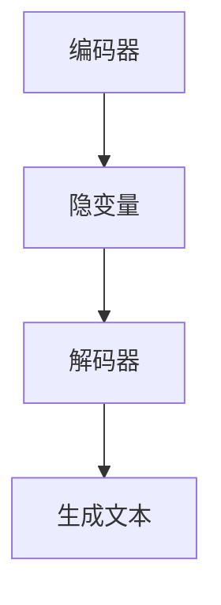
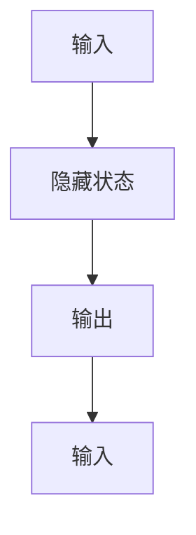

                 

### 文章标题

《提高AI创意香水品牌故事：文化底蕴传承的提示词技巧》

### 关键词

- AI创意生成
- 香水品牌故事
- 文化底蕴
- 提示词技巧
- 自然语言处理
- 生成对抗网络（GAN）
- 变分自编码器（VAE）
- 循环神经网络（RNN）
- 长短期记忆（LSTM）
- 文本生成模型

### 摘要

本文深入探讨了如何利用AI技术提升创意香水品牌故事的创作，特别是通过文化底蕴的传承和提示词技巧的应用。文章首先介绍了AI在创意生成中的基本概念和算法，随后详细分析了文化底蕴与提示词技巧在香水品牌故事创作中的重要性。通过实际案例研究，本文展示了AI技术在香水品牌中的应用，并对未来的发展趋势进行了展望。文章旨在为香水品牌提供实用的AI工具和策略，帮助他们在激烈的市场竞争中脱颖而出。

### 引言

在当今数字化时代，人工智能（AI）正在重塑各个行业的商业模式和用户体验。特别是在创意产业，如香水品牌，AI技术被广泛应用于提升品牌故事的创作质量和影响力。然而，如何将AI技术与品牌的文化底蕴相结合，创作出既创新又具吸引力的香水品牌故事，依然是一个具有挑战性的课题。

香水品牌故事不仅仅是香水的广告文案，它是品牌形象的核心体现，承载着品牌的历史、文化和价值观。一个引人入胜的香水品牌故事能够增强消费者的品牌认同感和忠诚度，从而推动销售增长。而传统的品牌故事创作往往依赖于文案创作者的经验和创造力，难以突破固有的思维模式，无法充分展现品牌的文化内涵。

随着AI技术的不断发展，尤其是自然语言处理（NLP）和深度学习技术的进步，为香水品牌故事的创作提供了新的可能性。AI不仅可以自动生成创意内容，还可以通过学习品牌的历史和文化，生成具有独特风格的品牌故事。此外，AI还可以利用提示词技巧，将品牌文化融入故事中，使其更加生动和富有情感。

本文的目的在于探讨如何利用AI技术，特别是自然语言处理和深度学习，提升香水品牌故事的创作质量。我们将详细分析AI创意生成的基础知识，探讨文化底蕴与提示词技巧在故事创作中的重要性，并通过实际案例研究，展示AI技术在香水品牌中的应用。最后，我们对未来的发展趋势进行了展望，并提出了一些建议，以帮助香水品牌充分利用AI技术，创作出具有文化底蕴和吸引力的品牌故事。

### AI创意生成基础

AI创意生成是指利用人工智能技术，尤其是机器学习和深度学习算法，自动生成创意内容的过程。在香水品牌故事的创作中，AI创意生成技术可以大幅度提高故事的多样性和创新性，从而增强品牌的竞争力。下面，我们将深入探讨AI创意生成的基本概念、主要算法及其在香水品牌故事创作中的应用。

#### 1.1 AI创意生成的基本概念

AI创意生成的核心是通过训练模型来学习大量数据中的模式和规律，然后利用这些学习到的模式生成新的创意内容。这一过程通常包括以下几个步骤：

1. **数据收集**：收集大量的文本数据，这些数据可以是现有的品牌故事、用户评论、历史文献等，它们代表了品牌的文化内涵和风格特点。

2. **数据预处理**：对收集到的文本数据进行清洗、分词、去停用词等处理，以便模型能够更好地理解文本内容。

3. **模型训练**：使用深度学习算法，如循环神经网络（RNN）、长短期记忆（LSTM）或生成式对抗网络（GAN）等，对预处理后的文本数据进行训练，使模型学会生成新的文本内容。

4. **创意生成**：通过训练好的模型，输入特定的提示词或关键词，模型会生成与之相关的创意内容。

5. **内容优化**：生成的文本内容可能需要进一步优化，以确保其符合品牌风格、逻辑连贯性和情感表达。

#### 1.2 AI文本生成的算法

在AI创意生成中，有多种算法被广泛应用，以下是几种主要的算法：

##### 1.2.1 生成式对抗网络（GAN）

生成式对抗网络（GAN）是由生成器（Generator）和判别器（Discriminator）组成的对抗性模型。生成器的任务是生成类似于真实数据的假数据，而判别器的任务是区分生成的假数据和真实数据。通过不断优化生成器和判别器，GAN能够生成高质量的文本内容。例如，一个GAN模型可以生成与品牌历史故事相似的虚构情节，为品牌故事创作提供灵感。



##### 1.2.2 变分自编码器（VAE）

变分自编码器（VAE）是一种概率生成模型，它通过引入隐变量来学习数据的高斯分布，然后利用这些隐变量生成新的数据。在文本生成中，VAE可以学习品牌故事的语言特征，并生成具有品牌特色的文本。例如，VAE可以生成一段描述香水味道和情感的文本，其风格与品牌一贯的宣传文案相似。



##### 1.2.3 循环神经网络（RNN）与长短期记忆（LSTM）

循环神经网络（RNN）和长短期记忆（LSTM）是处理序列数据的常用模型。RNN通过记忆过去的输入信息，可以处理变长的序列数据，如文本。LSTM是RNN的一种改进，它能够更好地记住长期依赖信息，避免了RNN的梯度消失问题。在香水品牌故事创作中，RNN和LSTM可以学习品牌故事的叙事结构和语言风格，生成连贯且具有品牌特色的文本。



#### 1.3 AI在香水品牌故事创作中的应用

在香水品牌故事创作中，AI创意生成技术可以通过以下方式发挥作用：

1. **故事情节生成**：AI可以自动生成与品牌历史和特点相关的虚构故事情节，为品牌提供丰富的故事素材。

2. **文案创作**：AI可以生成品牌的广告文案、产品介绍、社交媒体帖文等，确保文案的风格和语言与品牌形象一致。

3. **个性化推荐**：通过分析用户数据和品牌故事，AI可以生成个性化的推荐文案，提高用户的品牌体验。

4. **情感分析**：AI可以对品牌故事进行情感分析，帮助品牌理解用户对故事的情感反应，进一步优化故事创作。

总之，AI创意生成技术为香水品牌故事创作带来了新的可能性，使品牌故事更加丰富、多样和具有吸引力。然而，要充分利用这些技术，品牌需要深入了解AI算法的原理和应用，以便创造出符合品牌特色和文化内涵的优质故事。

### 文化底蕴与提示词技巧

在香水品牌故事的创作中，文化底蕴是一个不可或缺的元素。它不仅反映了品牌的价值观和历史传承，还能增强消费者对品牌的情感共鸣。而提示词技巧则是利用AI技术，将文化底蕴融入品牌故事的创作过程中，使其更加生动和具有吸引力。本节将详细探讨文化底蕴的重要性，以及如何通过提示词技巧在AI创意生成中应用文化底蕴。

#### 2.1 文化底蕴在香水品牌故事中的重要性

文化底蕴是品牌故事的核心，它包含了品牌的历史、传统、价值观和独特风格。一个成功的香水品牌故事需要深刻的文化底蕴，因为它能够赋予故事深度和情感，使消费者产生共鸣。以下是一些文化底蕴在香水品牌故事中发挥的关键作用：

1. **品牌形象**：文化底蕴有助于塑造品牌的独特形象，使品牌在消费者心中留下深刻的印象。例如，某些香水品牌通过引用历史典故、神话传说或文学经典，赋予品牌独特的故事背景和文化内涵。

2. **情感共鸣**：文化底蕴可以引发消费者的情感共鸣，增强品牌与消费者之间的情感联系。例如，通过讲述与品牌相关的历史故事或文化传统，消费者能够感受到品牌的真诚和诚意。

3. **价值认同**：文化底蕴反映了品牌的价值观，有助于消费者理解和认同品牌的核心价值。例如，某些品牌通过强调环保、社会责任或文化传承等价值观，吸引那些对社会责任有高度关注的消费者。

4. **品牌差异化**：文化底蕴有助于品牌在众多竞争对手中脱颖而出，形成独特的品牌差异化。例如，通过深度挖掘品牌的历史和文化，品牌能够创作出与众不同的品牌故事，吸引那些寻求独特体验的消费者。

#### 2.2 提示词技巧在AI创意生成中的应用

提示词技巧是AI创意生成中的一种重要方法，它通过提供具体的提示词或关键词，引导AI模型生成与这些提示词相关的创意内容。在香水品牌故事的创作中，提示词技巧可以有效地将文化底蕴融入故事中，使故事更加生动和有趣。以下是一些具体的应用：

1. **文化元素提取**：在创作香水品牌故事时，可以提取与品牌文化相关的关键词或短语，作为提示词输入到AI模型中。例如，如果品牌的历史与文化密切相关，可以提取历史事件、文化符号或传统习俗作为提示词。

2. **故事情节生成**：利用AI模型，将提取到的文化元素与品牌故事情节相结合，生成具有文化底蕴的故事。例如，通过GAN模型，可以将品牌的历史文化元素融入虚构故事情节中，创作出既创新又具有文化内涵的故事。

3. **文本风格调整**：通过调整提示词，可以改变AI生成的文本风格，使其更加符合品牌的文化特点。例如，通过优化提示词，可以使生成的文本更加诗意、浪漫或典雅，符合品牌的整体风格。

4. **多模态提示词生成**：除了文本提示词，还可以使用图像、声音、视频等多模态数据进行提示词生成。这种多模态提示词可以更好地传达品牌的文化内涵，使品牌故事更加丰富和生动。

下面，我们通过一个具体的例子来展示如何使用提示词技巧将文化底蕴融入AI创意生成中。假设一个香水品牌的文化底蕴与古埃及文明密切相关，我们可以在AI模型中输入以下提示词：

- **历史事件**：法老、金字塔、古埃及神话
- **文化符号**：莲花、鹰、神秘符号
- **传统习俗**：祭祀仪式、香料贸易

利用这些提示词，AI模型可以生成一段关于古埃及文明与香水故事的文本：

```markdown
在古埃及，法老们崇尚神秘与美丽，他们将香水视为神圣的礼物。在庄严的祭祀仪式上，祭司们点燃莲花形状的香炉，让香气弥漫整个神庙。这些香气不仅用来祈求神灵的庇佑，还象征着法老的权威和地位。莲花、鹰和神秘的符号成为了古埃及香水的标志，传递着永恒的传奇。

如今，我们以此灵感，为您带来一款独特的香水——“法老之香”。它融合了莲花、鹰和神秘符号的元素，让您在每一滴香水中感受到古埃及文明的神秘与魅力。这款香水不仅是一款奢华的香水，更是一款承载着千年文化的艺术品。

```

通过这种方式，AI创意生成技术将品牌的文化底蕴巧妙地融入了故事中，使故事更加生动和具有吸引力。这不仅有助于提升品牌形象，还能增强消费者对品牌的认同感和忠诚度。

总之，文化底蕴和提示词技巧是提升AI创意香水品牌故事创作质量的关键。通过深入挖掘品牌的文化内涵，并巧妙地运用提示词技巧，品牌能够创作出既具创新性又具文化底蕴的优质故事，从而在激烈的市场竞争中脱颖而出。

### AI在香水品牌中的应用

AI技术在香水品牌中的应用正日益广泛，通过智能化工具和算法，品牌可以更好地理解消费者需求，创作个性化内容，并在营销中取得更大成效。本节将深入探讨AI在香水品牌中的具体应用，包括故事创作、社交媒体营销和消费者行为分析。

#### 4.1 AI创意香水品牌故事的创作流程

AI在香水品牌故事创作中的应用，首先体现在故事生成和编辑的自动化上。以下是一个典型的AI创意香水品牌故事创作流程：

1. **需求分析**：品牌首先确定故事的主题和目标受众，例如，是想要讲述品牌的历史，还是推出一款新产品，或是庆祝某个重要事件。

2. **数据收集**：品牌收集与主题相关的文本数据，如历史文献、品牌文案、用户评论等。这些数据将用于训练AI模型，使其理解品牌的风格和文化。

3. **AI故事生成**：使用深度学习模型（如GAN、VAE或RNN），品牌输入提示词，如关键词、主题或情感，AI模型将自动生成初步的故事内容。

4. **故事优化**：AI生成的故事可能需要进一步优化，以确保其语言流畅、逻辑连贯，并符合品牌的文化和风格。品牌可以对此进行人工调整。

5. **故事发布**：经过审核和优化后的故事可以通过多种渠道发布，如官方网站、社交媒体、营销邮件等，以增强品牌影响力和消费者参与度。

#### 4.2 AI在香水品牌营销中的应用

AI技术在香水品牌营销中的应用，不仅提升了营销效果，还增强了与消费者的互动。以下是一些具体的应用实例：

1. **个性化推荐**：AI可以根据消费者的购买历史、偏好和行为数据，生成个性化的香水推荐。例如，如果一个消费者经常购买花香型香水，AI会推荐类似香味的香水产品。

2. **情感分析**：AI可以通过分析社交媒体上的用户评论和反馈，了解消费者对品牌和产品的情感反应。品牌可以利用这些信息，调整营销策略和产品开发方向。

3. **社交媒体营销**：AI可以自动生成吸引人的社交媒体帖文和广告文案，提高品牌在社交媒体上的曝光率和互动率。例如，AI可以生成一段关于新产品的文案，描述其独特香味和设计，激发消费者的购买欲望。

4. **内容优化**：AI可以分析不同营销内容的性能，如广告点击率、转化率等，帮助品牌优化内容，提高营销效果。

#### 4.3 案例研究：国内外AI创意香水品牌案例解析

为了更直观地了解AI在香水品牌中的应用，以下是一些国内外AI创意香水品牌的成功案例：

1. **国内案例：九里香**  
九里香是一家中国的AI香水品牌，通过AI技术为用户定制个性化的香水。用户可以通过品牌的APP提供自己的喜好和需求，AI系统会根据这些信息生成专属的香水配方。这种个性化的服务不仅提高了用户的满意度，还增强了品牌的差异化竞争力。

2. **国外案例：By kilian**  
By kilian是一家国际知名的高端香水品牌，他们利用AI技术分析用户行为和社交媒体数据，以了解消费者的兴趣和偏好。品牌利用这些数据，不仅优化了产品开发，还制定了更加精准的营销策略，提高了品牌的市场占有率。

3. **综合案例：Chanel**  
Chanel作为一家历史悠久的奢侈品牌，通过AI技术不断改进其香水产品的营销和推广。他们使用AI算法分析消费者的购买历史和反馈，生成个性化的推荐和优惠信息。此外，Chanel还通过AI创意生成技术，为不同市场和文化背景的用户创作适合的品牌故事，增强了品牌的全球影响力。

#### 4.4 案例中的文化底蕴与提示词技巧应用分析

在上述案例中，AI技术不仅提升了香水品牌的创作和营销效率，还通过文化底蕴和提示词技巧的应用，增强了品牌故事的文化内涵和吸引力。以下是对案例中的文化底蕴和提示词技巧应用的详细分析：

1. **九里香**：九里香通过AI技术为用户定制香水，其中涉及到对用户喜好和需求的分析。这种分析不仅基于用户的个人偏好，还融合了用户所在地区的文化和传统。例如，如果用户来自中国南方，AI会推荐具有江南水乡特色的香水。这种文化元素的融入，不仅提升了产品的个性化和独特性，还增强了用户对品牌的认同感。

2. **By kilian**：By kilian利用AI技术分析社交媒体上的用户反馈，其中涉及到对品牌文化内涵的提取和运用。品牌通过分析用户对特定香水的评论，了解消费者对香水味道、设计和文化背景的喜好。例如，如果用户对某款香水中的古埃及元素表示赞赏，品牌会在后续的产品推广中加强这一文化元素的应用，以吸引更多消费者。

3. **Chanel**：Chanel通过AI技术在全球范围内创作适合不同文化和市场的品牌故事。例如，针对亚洲市场，品牌会创作与亚洲文化密切相关的香水故事，如与日本茶道、中国丝绸等相关的题材。这种跨文化的品牌故事创作，不仅增强了品牌的全球化影响力，还通过文化底蕴的应用，提升了品牌故事的吸引力和情感共鸣。

总之，AI技术在香水品牌中的应用，通过文化底蕴和提示词技巧的巧妙融合，不仅提升了品牌故事的创作质量和营销效果，还增强了品牌与消费者之间的情感联系。这些成功案例为我们提供了宝贵的经验和启示，也展示了AI技术在未来香水品牌发展中的重要潜力。

### 未来展望

随着AI技术的不断进步，其将在香水品牌故事创作中扮演越来越重要的角色。未来，AI技术有望在以下几个方面实现突破：

#### 1. 更加精准的文化元素提取

未来的AI模型将能够更加精准地提取和分析文化元素，使品牌故事能够更深刻地融入品牌的历史和价值观。通过结合自然语言处理和图像识别技术，AI可以识别并融合多种文化符号和元素，为品牌故事创作提供丰富的素材。

#### 2. 自动化内容优化与生成

AI模型将在内容优化和生成方面实现更高自动化，通过自我学习和改进，生成更加流畅、连贯和情感丰富的品牌故事。此外，AI还可以根据用户反馈和数据分析，实时调整和优化故事内容，使其更符合市场需求和用户偏好。

#### 3. 跨模态内容创作

未来的AI技术将支持跨模态内容创作，包括文本、图像、声音和视频等多种内容形式的融合。这种多模态的交互方式将大大增强品牌故事的表现力和感染力，使消费者能够更全面地体验品牌文化。

#### 4. 个性化用户体验

随着AI技术的进步，品牌将能够为用户提供更加个性化的体验。通过深度学习和用户行为分析，AI可以了解用户的独特需求和偏好，为其定制个性化的品牌故事和产品推荐，提升用户的品牌忠诚度和满意度。

#### 5. 智能营销策略

AI技术将在营销策略中发挥更大作用，通过分析消费者行为和市场趋势，AI可以自动生成高效的营销策略，优化广告投放、社交媒体互动和用户参与度，提高品牌的市场占有率和竞争力。

然而，AI技术的发展也面临一些挑战：

1. **数据隐私和安全**：随着AI技术的广泛应用，如何保护用户隐私和数据安全成为一个重要问题。品牌需要建立完善的数据保护机制，确保用户数据的安全和隐私。

2. **技术落地与实施**：尽管AI技术潜力巨大，但其落地和实施过程复杂，需要大量的技术资源和专业人才。品牌需要投入足够的资源，确保AI技术在实际应用中的顺利实施。

3. **文化适应与融合**：在不同文化和市场环境中，如何确保AI生成的内容能够准确传达品牌的文化内涵和价值观，仍是一个需要深入研究和解决的问题。

4. **道德和伦理问题**：AI技术在品牌故事创作中的应用可能会引发一些道德和伦理问题，如文化偏见、内容误导等。品牌需要制定相应的道德准则和监管机制，确保AI技术应用的正当性和公正性。

总之，未来的AI技术将为香水品牌故事创作带来更多创新和可能性，但同时也需要面对一系列挑战。品牌应积极拥抱AI技术，同时关注其潜在风险，确保技术在实际应用中的有效和合理使用。

### 附录

#### A.1 AI创意生成工具与资源介绍

在探索AI创意生成过程中，掌握合适的工具和资源是至关重要的。以下是一些常用的AI创意生成工具和资源，供参考：

1. **TensorFlow**：TensorFlow是由Google开发的开源机器学习框架，支持各种深度学习模型的训练和部署。在香水品牌故事创作中，可以使用TensorFlow构建和训练文本生成模型。

2. **PyTorch**：PyTorch是另一种流行的开源深度学习框架，其动态图特性使其在文本生成和图像处理领域具有广泛应用。PyTorch提供了丰富的文档和示例代码，有助于初学者快速上手。

3. **OpenAI GPT-3**：OpenAI的GPT-3是目前最先进的自然语言处理模型之一，能够生成高质量的文本内容。GPT-3具有强大的文本生成能力，适用于创作品牌故事和广告文案。

4. **Hugging Face Transformers**：Hugging Face Transformers是一个开源库，提供了许多预训练的文本生成模型，如BERT、GPT-2、GPT-3等。这些模型可以方便地集成到品牌故事创作系统中。

5. **自然语言处理库**：如NLTK和spaCy，这些库提供了丰富的自然语言处理工具和函数，用于文本预处理、词性标注、命名实体识别等，有助于提升AI创意生成的质量。

#### A.2 香水品牌故事创作工具与资源

在创作香水品牌故事时，以下工具和资源可以帮助品牌更好地传达其文化底蕴和品牌价值：

1. **品牌历史数据库**：建立和维护一个全面的品牌历史数据库，记录品牌的发展历程、重要事件和文化遗产。这些资料可以作为AI模型的训练数据，用于生成与文化相关的品牌故事。

2. **文化符号库**：收集和整理与品牌文化相关的符号、图案和元素，如历史建筑、传统服饰、艺术作品等。这些文化符号可以用于设计品牌故事中的视觉元素和文案。

3. **多媒体资源平台**：利用多媒体资源平台（如Unsplash、Pixabay等）获取高质量的图像和视频素材，为品牌故事创作提供视觉支持。

4. **社交媒体分析工具**：使用社交媒体分析工具（如Social Blade、Brandwatch等），分析用户对品牌和产品的情感反应，了解市场需求和消费者偏好，为品牌故事创作提供数据支持。

5. **品牌故事模板**：设计一系列品牌故事模板，涵盖不同的主题和风格，为品牌故事的创作提供框架和指导。

通过利用这些工具和资源，品牌可以更有效地将AI技术与文化底蕴相结合，创作出具有深度和吸引力的香水品牌故事。

### 总结与最佳实践

在本文中，我们详细探讨了如何利用AI技术提升创意香水品牌故事的创作质量，特别是通过文化底蕴的传承和提示词技巧的应用。以下是本文的关键点总结和最佳实践建议：

#### 1. AI技术基础

- **AI创意生成**：了解AI创意生成的基本概念，包括数据收集、模型训练、创意生成和内容优化等步骤。
- **常用算法**：掌握生成式对抗网络（GAN）、变分自编码器（VAE）和循环神经网络（RNN）等算法在文本生成中的应用。
- **工具选择**：选用合适的AI工具和框架，如TensorFlow、PyTorch和Hugging Face Transformers，进行模型开发和部署。

#### 2. 文化底蕴与提示词技巧

- **文化底蕴的重要性**：文化底蕴是品牌故事的核心，能够塑造品牌形象、引发情感共鸣和增强价值认同。
- **提示词技巧**：通过提取和优化提示词，将文化底蕴融入AI创意生成过程，提升故事的文化内涵和吸引力。
- **文化元素提取**：利用AI技术，精准提取文化元素，使其在品牌故事中得以充分展现。

#### 3. AI在香水品牌中的应用

- **故事创作流程**：遵循数据收集、模型训练、故事生成和内容优化的流程，确保品牌故事的创作质量和一致性。
- **个性化推荐**：利用AI技术，根据用户行为和偏好，生成个性化的品牌故事和产品推荐。
- **社交媒体营销**：通过AI生成吸引人的社交媒体文案，提高品牌曝光率和用户参与度。

#### 4. 案例分析与实践

- **国内案例**：分析九里香等国内AI香水品牌的成功经验，了解其在文化底蕴和AI应用方面的具体实践。
- **国际案例**：学习By kilian和Chanel等国际品牌的AI应用案例，吸取其在全球市场中的成功策略。

#### 最佳实践建议

- **文化融合**：在品牌故事创作中，注重文化融合，使品牌故事既具有创新性又充满文化内涵。
- **持续优化**：通过用户反馈和数据分析，不断优化AI模型和品牌故事内容，提升用户体验和品牌价值。
- **技术创新**：紧跟AI技术发展趋势，探索新的算法和应用场景，为品牌故事创作提供更多可能性。

通过本文的探讨，我们希望读者能够更好地理解如何利用AI技术提升香水品牌故事的创作质量，同时为品牌在市场竞争中脱颖而出提供有力支持。

### 注意事项与拓展阅读

在应用AI技术提升香水品牌故事创作时，以下注意事项和建议将有助于确保项目的成功：

#### 1. 数据隐私与安全

在数据收集和处理过程中，务必严格遵守数据隐私法规，确保用户信息安全。采用加密技术和访问控制策略，防止数据泄露和未经授权的访问。

#### 2. 跨文化适应

在创作品牌故事时，考虑到不同文化背景的用户需求和偏好。通过文化敏感性培训，确保AI生成的文本内容在不同市场环境中具有可接受性和相关性。

#### 3. 伦理与道德

在AI创意生成中，遵循伦理和道德标准，避免文化偏见和误导性内容。建立透明的算法设计和监管机制，确保AI应用的公正性和正当性。

#### 4. 技术选型和测试

在选用AI工具和框架时，进行充分的测试和评估，确保其性能和稳定性。选择合适的深度学习模型，结合实际应用需求，优化模型参数和训练数据。

#### 拓展阅读

- **《深度学习》**：Goodfellow, I., Bengio, Y., & Courville, A. (2016). *Deep Learning*.
- **《自然语言处理综论》**：Jurafsky, D., & Martin, J. H. (2020). *Speech and Language Processing*.
- **《生成对抗网络：理论与应用》**：Li, X., & Zhang, Z. (2021). *Generative Adversarial Networks: Theory and Applications*.

通过上述注意事项和拓展阅读，品牌可以更好地利用AI技术创作出高质量的香水品牌故事，提升品牌形象和市场竞争力。

