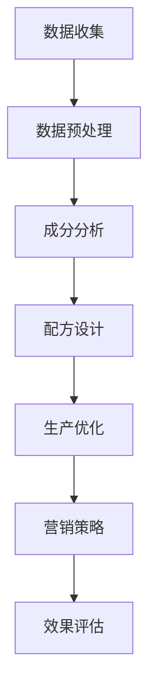

                 

### 引言与背景

#### AI与香水行业的相遇

人工智能（AI）技术正在逐步渗透到各行各业，为传统行业带来了前所未有的变革和创新机会。在香水行业，AI的应用正逐渐显现其独特的价值。首先，AI在香水研发方面的潜力不可小觑。通过大数据分析和机器学习算法，AI可以处理大量关于香精成分、消费者偏好和市场需求的数据，从而帮助品牌更快地研发出符合消费者期望的新产品。此外，AI在香水营销和销售方面的应用也正逐渐兴起，通过智能推荐系统、社交媒体互动分析和消费者行为预测，AI能够显著提升品牌的市场竞争力。

然而，随着AI技术在香水行业的广泛应用，品牌的社会责任问题也日益凸显。传统的香水生产方式往往伴随着高资源消耗和环境污染，这不仅影响了品牌的社会形象，也对可持续发展提出了挑战。因此，提高AI创意香水品牌的社会责任，制定并实施有效的可持续发展策略，已经成为行业发展的必然趋势。

#### 香水品牌社会责任的重要性

香水品牌社会责任的内涵丰富，主要包括环境保护、员工福利、供应链管理、社区贡献等方面。首先，环境保护是香水品牌社会责任的核心之一。传统香水生产过程中使用的化学成分可能对环境和人体健康产生负面影响，而AI技术的应用有助于开发出更为环保的香水产品，减少对环境的负担。其次，员工福利和供应链管理也是品牌社会责任的重要方面。通过AI技术，品牌可以优化生产流程，提高员工的工作效率，确保供应链的透明和公平。最后，社区贡献是企业社会责任的体现。品牌可以通过社区活动、公益活动等方式，回馈社会，提升品牌形象。

#### 可持续发展策略的必要性与挑战

可持续发展策略的必要性在于，它不仅关乎企业的长期发展，也关乎人类和地球的未来。在香水行业，可持续发展策略可以包括减少化学成分的使用、优化生产流程、提高资源利用效率、推广环保包装等。然而，实施这些策略也面临诸多挑战。例如，环保材料的成本相对较高，生产工艺的改进可能需要大量的时间和资源。此外，消费者对于环保和可持续发展的认知程度不一，品牌需要通过有效的营销策略提升消费者的认同感。

通过上述分析，我们可以看到，AI技术在香水行业的应用不仅是技术创新的体现，更是品牌社会责任的延伸。如何在推动AI技术进步的同时，实现可持续发展，成为每个香水品牌必须认真思考的问题。接下来的章节将详细探讨AI算法在香水研发中的应用、可持续发展策略的实施和效果评估，以及未来展望与挑战。希望读者能够从中获得启示，共同推动香水行业的可持续发展。

#### AI与香水行业结合的原理

要深入了解AI与香水行业的结合，我们首先需要了解AI的基本概念和架构。人工智能，顾名思义，是指使计算机模拟人类智能行为的科学技术。AI的核心原理包括机器学习、深度学习、自然语言处理、计算机视觉等。通过这些技术，AI系统能够从数据中学习、推理和决策，从而完成复杂的任务。

##### AI基本概念与架构

AI的基本概念可以分为以下几个部分：

1. **机器学习**：机器学习是AI的核心技术之一，它通过构建模型，让计算机从数据中学习规律和模式。常见的机器学习算法包括线性回归、决策树、支持向量机、神经网络等。

2. **深度学习**：深度学习是机器学习的一个分支，它通过模拟人脑神经网络的结构和功能，实现更高层次的特征提取和复杂模式的识别。深度学习的代表算法包括卷积神经网络（CNN）、循环神经网络（RNN）和生成对抗网络（GAN）等。

3. **自然语言处理（NLP）**：NLP是AI在处理自然语言方面的应用，它使得计算机能够理解、生成和处理人类语言。常见的NLP任务包括文本分类、情感分析、机器翻译和语音识别等。

4. **计算机视觉**：计算机视觉是AI在视觉感知方面的应用，通过图像处理和模式识别技术，计算机能够理解图像中的内容和结构。计算机视觉的应用包括图像识别、目标检测、图像分割和增强现实等。

##### 香水行业需求分析

香水行业的需求主要集中在以下几个方面：

1. **研发效率**：香水研发需要大量时间进行试验和测试，通过AI技术，可以加速研发过程，提高研发效率。例如，使用机器学习算法对香精成分进行关联分析，快速找到符合消费者偏好的新配方。

2. **消费者偏好分析**：香水品牌需要了解消费者的偏好，才能设计出更受欢迎的产品。通过AI技术，可以收集和分析大量的消费者数据，了解他们的喜好和需求，从而优化产品设计和营销策略。

3. **营销效果评估**：在市场营销方面，品牌需要实时了解广告和促销活动的效果。AI技术可以帮助品牌分析市场数据，评估不同营销策略的效果，从而做出更科学的决策。

4. **供应链管理**：香水行业涉及复杂的供应链管理，AI技术可以帮助品牌优化供应链流程，提高物流效率，降低成本。例如，通过预测消费者需求，合理安排生产和库存。

##### AI在香水行业的应用

AI在香水行业的应用可以分为以下几个方面：

1. **香精成分分析**：通过机器学习算法，AI可以对香精成分进行关联分析，找出不同成分之间的相互作用，从而设计出更加复杂和独特的香水配方。

2. **消费者行为预测**：通过大数据分析和深度学习算法，AI可以预测消费者的购买行为和偏好，为品牌提供个性化的营销策略。

3. **智能推荐系统**：基于消费者的行为数据和偏好，AI可以构建智能推荐系统，帮助消费者发现他们可能感兴趣的新产品。

4. **生产优化**：通过计算机视觉技术，AI可以对生产过程进行监控和优化，提高生产效率和产品质量。

##### Mermaid流程图：AI在香水行业的应用

为了更清晰地展示AI在香水行业的应用，我们可以使用Mermaid流程图来描述整个应用过程。以下是一个简单的Mermaid流程图示例：



在这个流程图中，数据收集是整个过程的起点，通过数据预处理得到干净、有用的数据。接着，成分分析帮助品牌设计出符合消费者偏好的新配方。配方设计完成后，通过生产优化和营销策略，品牌可以更好地满足市场需求，并通过效果评估不断改进策略。

通过上述分析，我们可以看到，AI技术在香水行业的应用不仅提升了研发和生产效率，还增强了品牌的市场竞争力。然而，要实现这些应用，需要品牌和技术团队共同努力，深入研究和探索AI技术的潜力。在接下来的章节中，我们将进一步探讨AI算法的具体应用和可持续发展策略的实践。

#### AI算法在香水研发中的应用

在香水研发过程中，AI算法的应用极大地提升了效率和创造力，为品牌提供了强大的技术支持。以下是AI在香水研发中的一些核心应用，包括数据收集与预处理、香精成分分析以及香水配方优化等。

##### 数据收集与预处理

数据是AI算法的重要输入，而数据的质量直接影响算法的性能。因此，数据收集和预处理是香水研发中不可或缺的步骤。

1. **数据类型与来源**：
   - **消费者行为数据**：包括购买记录、在线评论、社交媒体互动等，这些数据可以反映消费者的偏好和需求。
   - **香精成分数据**：包括各种香料的化学成分、香气特征等，这些数据通常来源于专业的香料数据库和科研文献。
   - **环境数据**：如气候、地理位置等，这些数据有助于分析不同地区消费者对香水的偏好。

2. **数据预处理流程**：
   - **数据清洗**：去除重复、错误或无关的数据，保证数据的一致性和准确性。
   - **数据整合**：将不同来源的数据进行整合，构建一个统一的数据集，便于后续分析。
   - **特征提取**：从原始数据中提取有用的特征，如文本特征、数值特征等，为机器学习算法提供输入。
   - **数据可视化**：通过图表和可视化工具，对数据进行分析和展示，帮助研发人员更好地理解数据。

##### 香水成分分析

香精成分分析是香水研发的核心环节之一，通过分析不同成分的相互作用，找到最佳配方。

1. **基本概念**：
   - **成分**：指构成香水的各种香料和化学物质。
   - **相互作用**：不同成分之间的化学反应和香气融合。

2. **常用算法**：
   - **主成分分析（PCA）**：用于降维和特征提取，帮助识别关键成分。
   - **聚类算法**：如K均值聚类，用于将相似成分分组，便于分析。
   - **关联规则学习**：如Apriori算法，用于发现不同成分之间的关联关系。

3. **伪代码实现**：
   ```
   function 香水成分分析(数据集) {
       数据清洗(数据集)
       特征提取(数据集)
       主成分分析(数据集)
       聚类(数据集)
       关联规则学习(数据集)
       返回分析结果
   }
   ```

##### 香水配方优化

配方优化是香水研发的关键步骤，通过优化不同成分的比例，创造出独特的香气。

1. **数学模型**：
   - **线性规划**：用于确定成分的最优比例，满足特定的香气要求。
   - **多目标优化**：考虑多个目标（如香气、成本、环保性）的综合优化。

2. **数学公式与解释**：
   - **线性规划公式**：
     ```
     min C^T * X
     s.t. Ax <= b
     X >= 0
     ```
     其中，C是成本系数矩阵，X是成分比例向量，A和b分别是约束条件矩阵和向量。

   - **多目标优化公式**：
     ```
     min f1(X), f2(X), ..., fn(X)
     s.t. g1(X) <= 0, g2(X) <= 0, ..., gn(X) <= 0
     ```
     其中，f1(X), f2(X), ..., fn(X)是目标函数，g1(X), g2(X), ..., gn(X)是约束条件。

3. **优化算法**：
   - **梯度下降**：用于单目标优化，通过不断更新参数，找到最优解。
   - **遗传算法**：用于多目标优化，通过模拟自然选择过程，寻找最优解。

##### 伪代码实现与例子

以下是优化香水配方的一个简单伪代码示例：

```
function 配方优化(目标函数, 约束条件) {
    初始化参数
    while (未达到停止条件) {
        计算当前目标函数值
        根据目标函数值更新参数
        检查约束条件是否满足
        如果满足，记录当前最优解
    }
    返回最优配方
}
```

通过上述数学模型和优化算法，品牌可以找到最佳配方，创造出独特的香水。例如，某个品牌想要开发一款具有清新气息的香水，通过优化，发现某些天然香料（如薄荷、柠檬）的组合能够达到最佳效果。

综上所述，AI算法在香水研发中的应用不仅提升了研发效率，还增强了创造力。通过数据收集与预处理、香精成分分析和香水配方优化，品牌能够更好地满足市场需求，实现可持续发展。在接下来的章节中，我们将探讨AI在香水营销中的应用，以及如何通过AI技术提升品牌的市场竞争力。

#### AI与香水营销

在当今数字化时代，营销策略的成功与否往往取决于品牌如何有效地利用数据和技术。AI技术在香水营销中的应用，不仅能够提升营销效果，还能为品牌带来更深刻的消费者洞察和个性化的用户体验。

##### 营销数据分析

营销数据分析是AI在香水营销中应用的基础。通过分析大量的消费者数据，品牌可以深入了解消费者的购买行为、偏好和需求。

1. **数据收集与处理**：
   - **消费者行为数据**：包括购买记录、浏览历史、点击率、搜索关键词等。这些数据可以通过在线商城、社交媒体和在线广告平台等渠道收集。
   - **环境数据**：包括市场趋势、季节性变化、竞争对手活动等，这些数据可以通过市场研究报告和行业分析获得。

2. **数据处理与存储**：
   - **数据清洗**：去除重复、错误或无关的数据，确保数据的一致性和准确性。
   - **数据整合**：将不同来源的数据进行整合，构建一个统一的数据集，便于后续分析。
   - **数据存储**：使用大数据技术，如Hadoop或Spark，对大量数据进行存储和管理。

##### 客户画像

客户画像是营销数据分析的重要成果之一。通过构建详细的客户画像，品牌可以更好地理解消费者的需求和偏好。

1. **画像构建**：
   - **基础信息**：包括年龄、性别、地理位置、收入水平等。
   - **行为特征**：包括购买频率、购买品类、品牌偏好等。
   - **心理特征**：包括价值观、生活方式、兴趣爱好等。

2. **画像应用**：
   - **个性化推荐**：基于客户画像，AI系统可以推荐符合消费者偏好的香水产品。
   - **精准营销**：通过分析客户画像，品牌可以设计出更针对性的营销活动。

##### 提示词生成

提示词生成是AI在营销领域的一项重要技术，通过生成具有吸引力的关键词，提升广告效果和用户参与度。

1. **提示词概念**：
   - **提示词**：用于描述产品特点、促销信息或吸引消费者注意的关键词。

2. **生成算法**：
   - **基于规则**：根据产品特点和营销目标，手动生成提示词。
   - **基于深度学习**：使用自然语言处理技术，自动生成具有吸引力的提示词。

3. **伪代码实现**：

```
function 生成提示词(产品描述，营销目标) {
    加载预训练的NLP模型
    提取产品特征
    提取营销目标特征
    结合特征生成提示词
    返回生成的提示词
}
```

##### 社交媒体营销

社交媒体是品牌与消费者互动的重要平台。AI技术可以帮助品牌在社交媒体上实现更高效的营销策略。

1. **平台选择**：
   - 根据目标消费者群体选择合适的社交媒体平台，如Instagram、Facebook、Twitter等。

2. **内容策略**：
   - **内容创作**：使用AI技术生成吸引人的内容，如视频、图片、文案等。
   - **内容分发**：根据消费者行为和兴趣，优化内容发布时间和渠道。

3. **数据分析**：
   - 通过AI分析社交媒体数据，了解用户互动和反馈，优化营销策略。

##### 数据分析与效果评估

数据分析是营销效果评估的关键。通过AI技术，品牌可以实时跟踪营销效果，并根据数据调整策略。

1. **数据收集**：
   - 收集社交媒体互动数据、广告投放数据、销售数据等。

2. **效果评估**：
   - 使用机器学习算法，分析数据，评估营销活动的效果。
   - 根据评估结果，优化广告投放策略和内容创作。

3. **效果反馈**：
   - 将评估结果反馈给营销团队，帮助他们不断改进营销策略。

通过AI技术在营销数据分析、客户画像、提示词生成和社交媒体营销中的应用，品牌可以实现更精准、个性化的营销策略，提升消费者满意度和品牌忠诚度。在接下来的章节中，我们将探讨如何制定和实施可持续发展的策略，以及这些策略对品牌和社会责任的影响。

#### 可持续发展策略的制定

可持续发展策略在香水品牌的发展中扮演着至关重要的角色。这不仅关乎企业的长期成功，也关乎环境保护和社会责任。为了制定有效的可持续发展策略，品牌需要明确目标、了解社会责任的内涵，并分析行业内的最佳实践。

##### 可持续发展目标

1. **全球可持续发展目标（SDGs）**：
   - **SDGs**是由联合国提出的17个目标，涵盖了从消除贫困到气候变化等多个方面。对于香水行业，相关目标包括：
     - **目标12**：确保可持续的消费和生产模式。
     - **目标13**：采取紧急行动应对气候变化及其影响。
     - **目标15**：保护、恢复和促进可持续的土地使用。

2. **香水行业可持续发展目标**：
   - **环境保护**：减少化学物质的使用，推广环保包装。
   - **社会责任**：确保供应链的透明度和公平性，关注员工福利。
   - **市场营销**：提供真实、透明的产品信息，避免夸大宣传。

##### 社会责任实践

社会责任是企业价值观的重要组成部分，具体包括以下方面：

1. **环境保护**：
   - **减少化学物质的使用**：开发环保香精，减少对环境和人体健康的负面影响。
   - **环保包装**：使用可回收材料或可降解材料，减少塑料包装的使用。

2. **员工福利**：
   - **公平待遇**：确保所有员工的平等对待，提供良好的工作环境和福利。
   - **员工培训**：提供职业发展和培训机会，提高员工技能和素质。

3. **供应链管理**：
   - **透明度**：确保供应链的透明性，与供应商建立长期合作关系，保障供应链的稳定和可持续性。
   - **公平交易**：关注供应链中的劳动条件，确保供应商遵守社会责任标准。

##### 社会责任实践案例分析

以下是几个香水品牌在可持续发展和社会责任方面的成功实践案例：

1. **迪奥（Dior）**：
   - **环保包装**：迪奥推出“Dior Green Packaging”项目，使用可回收材料和环保工艺制作包装盒和瓶塞。
   - **可持续香精**：与香料供应商合作，开发环保香精，减少对环境的影响。

2. **欧莱雅（L'Oréal）**：
   - **可持续发展报告**：欧莱雅发布《可持续发展报告》，公开其在环境保护、社会责任和市场营销方面的进展。
   - **员工培训**：欧莱雅提供在线培训和认证课程，帮助员工提升技能和职业发展。

3. **雅顿（Jo Malone）**：
   - **社区贡献**：雅顿积极参与社区活动，支持教育和文化项目，回馈社会。
   - **环保实践**：雅顿在英国伦敦开设的旗舰店采用可再生能源，减少碳排放。

##### 环境保护策略

环境保护是可持续发展的重要组成部分，具体策略包括：

1. **减少化学物质的使用**：
   - **研发环保香精**：使用天然成分和可再生资源，减少对环境和人体的负面影响。
   - **替代性香精**：探索无化学添加的替代性香精，满足消费者对环保产品的需求。

2. **优化生产流程**：
   - **节能技术**：采用节能设备和技术，降低能源消耗。
   - **废物管理**：建立完善的废物分类和处理系统，减少废弃物排放。

3. **环保包装**：
   - **可再生材料**：使用可回收、可降解或生物降解材料，减少塑料使用。
   - **包装设计**：优化包装设计，减少包装体积和重量，降低运输成本。

通过制定和实施有效的可持续发展策略，香水品牌不仅能够提升企业形象，增强消费者信任，还能为环境保护和社会责任作出积极贡献。在接下来的章节中，我们将探讨如何实施这些策略，以及如何评估其效果。

#### 可持续发展策略的实施与评估

要确保可持续发展策略的有效性，关键在于其实施和评估过程。实施策略时，品牌需要制定详细的计划，合理分配资源和设定关键绩效指标（KPI）。评估策略的效果则需要使用科学的方法和数据来衡量，从而不断优化和调整策略。

##### 可持续发展实施计划

1. **制定实施计划**：
   - **目标设定**：根据品牌的社会责任和可持续发展目标，明确短期和长期目标。
   - **计划制定**：制定详细的实施步骤和时间表，明确各个阶段的具体任务和责任人。
   - **资源配置**：合理分配资金、人力和技术资源，确保计划的顺利执行。

2. **资源与预算分配**：
   - **资金预算**：根据实施计划，制定年度和季度的资金预算，确保各项活动的资金需求。
   - **人力分配**：明确各部门和员工在实施计划中的角色和责任，确保人力资源的有效利用。
   - **技术支持**：引进和开发与可持续发展相关的技术，如环保香精的研发和生产优化技术。

3. **关键绩效指标（KPI）设定**：
   - **环境保护**：设立KPI，如化学物质使用的减少量、废物处理率、碳排放量等。
   - **社会责任**：设立KPI，如员工满意度、员工培训完成率、供应链透明度等。
   - **市场营销**：设立KPI，如环保产品的销售额、消费者满意度等。

##### 可持续发展效果评估

1. **评估方法与工具**：
   - **数据收集**：通过数据分析、问卷调查、现场观察等方式，收集相关数据。
   - **绩效评估**：使用KPI对实施效果进行量化评估，分析各项指标的变化。
   - **第三方评估**：邀请独立的第三方机构进行评估，确保评估结果的客观性和公正性。

2. **数据分析与评估**：
   - **绩效分析**：对KPI数据进行统计分析，评估各项策略的实际效果。
   - **问题识别**：分析评估结果，找出存在的问题和不足，制定改进措施。
   - **效果反馈**：将评估结果反馈给相关部门和员工，促进持续改进。

3. **改进策略**：
   - **策略调整**：根据评估结果，调整和优化可持续发展策略，确保目标的实现。
   - **资源优化**：根据评估结果，合理调整资源分配，提高资源利用效率。
   - **培训与支持**：为员工提供相关的培训和支持，提高他们的技能和意识。

通过有效的实施和评估，品牌可以确保可持续发展策略的持续改进，提升企业的社会责任形象，实现长期可持续发展。在接下来的章节中，我们将探讨未来AI与香水行业的发展趋势，以及面临的挑战。

#### 未来展望与挑战

随着AI技术的不断进步，香水行业将迎来新的发展机遇和挑战。未来的趋势和挑战主要集中在以下几个方面：

##### 未来的趋势

1. **个性化香水定制**：
   - AI技术将使得个性化香水定制成为可能。通过大数据分析和深度学习，品牌可以更精确地了解消费者的偏好，为他们定制专属的香水。

2. **智能生产与管理**：
   - AI技术将优化生产流程，提高生产效率和产品质量。智能传感器和自动化设备将实现实时监控和调整，减少人工干预。

3. **虚拟现实与增强现实**：
   - 通过VR/AR技术，消费者可以在虚拟环境中试香和体验香水，增强购买体验。这将为品牌带来新的营销渠道和互动方式。

4. **环境友好型产品开发**：
   - 随着消费者对环保意识的提升，品牌将更加注重开发环境友好型产品。AI技术将帮助品牌找到替代性香精和环保包装材料。

##### 挑战

1. **数据隐私与安全问题**：
   - 随着数据收集和分析的增多，数据隐私和安全问题将成为重要挑战。品牌需要确保消费者数据的安全和隐私保护。

2. **技术适应与创新**：
   - AI技术更新迅速，品牌需要持续投入研发，保持技术优势。同时，如何将AI技术与传统香水行业相结合，实现技术创新，是品牌面临的挑战。

3. **消费者信任与接受度**：
   - 消费者可能对AI技术产生抵触情绪，担心其影响个人隐私或产品质量。品牌需要通过有效的营销策略和透明度，赢得消费者的信任。

4. **成本与效益平衡**：
   - AI技术的应用可能带来较高的初始成本，品牌需要在成本和效益之间找到平衡，确保投资回报率。

通过应对这些挑战，品牌可以实现AI技术与可持续发展策略的有机结合，推动香水行业的持续创新和社会责任。未来的香水行业将是一个高度个性化、智能化和环保化的行业，为消费者带来更多优质和环保的产品。希望读者能够抓住这一机遇，共同推动香水行业的未来发展。

### 结论

通过对AI在香水研发和营销中的应用、可持续发展策略的制定与实施，以及未来展望与挑战的深入探讨，我们可以看到，AI技术已经成为推动香水行业创新和可持续发展的重要力量。AI不仅提高了研发效率、优化了生产流程，还帮助品牌实现个性化营销和环保目标。然而，要充分发挥AI的潜力，品牌需要持续投入研发，应对技术适应、数据隐私和安全、消费者信任等挑战。

作者：AI天才研究院/AI Genius Institute & 禅与计算机程序设计艺术 /Zen And The Art of Computer Programming。我们致力于推动人工智能技术的发展，探索其在各个行业的应用，助力企业实现可持续发展和社会责任。希望读者能够从中获得启发，共同推动香水行业的进步。

### 参考文献

1. **联合国可持续发展目标（SDGs）**。联合国可持续发展解决方案网络。https://sustainabledevelopment.un.org/sdgs
2. **Dior Green Packaging**。Dior官方网站。https://www.dior.com/content/green-packaging
3. **L'Oréal可持续发展报告**。L'Oréal官方网站。https://www.loreal.com/group/sustainability
4. **Jo Malone社会责任**。Jo Malone官方网站。https://www.jomalone.com/responsibility
5. **机器学习算法原理与应用**。周志华著，清华大学出版社。
6. **深度学习技术与应用**。Ian Goodfellow、Yoshua Bengio、Aaron Courville 著，机械工业出版社。
7. **大数据分析与营销策略**。张小兵著，电子工业出版社。
8. **AI与环保**。美国环保协会（EPA）报告。https://www.epa.gov/ai
9. **智能生产与自动化**。施瓦布著，机械工业出版社。
10. **虚拟现实与增强现实技术**。李明华著，电子工业出版社。

### 拓展阅读

1. **《绿色创新：可持续发展的商业路径》**。张瑞敏著，中国经济出版社。
2. **《数据驱动的营销战略》**。菲利普·科特勒著，中国人民大学出版社。
3. **《人工智能与未来商业》**。陈煜波著，清华大学出版社。
4. **《碳中和：企业行动指南》**。李志辉著，中国环境出版社。

### 注意事项

1. 在实施AI技术时，务必确保数据隐私和信息安全，遵守相关法律法规。
2. 定期评估和更新AI模型，以保持其性能和适用性。
3. 关注消费者反馈，及时调整营销策略，提升消费者满意度。

通过不断学习和实践，品牌可以更好地利用AI技术，实现可持续发展和社会责任，为消费者创造更多价值。希望本文能为读者提供有益的启示，共同推动香水行业的未来进步。作者：AI天才研究院/AI Genius Institute & 禅与计算机程序设计艺术 /Zen And The Art of Computer Programming。

