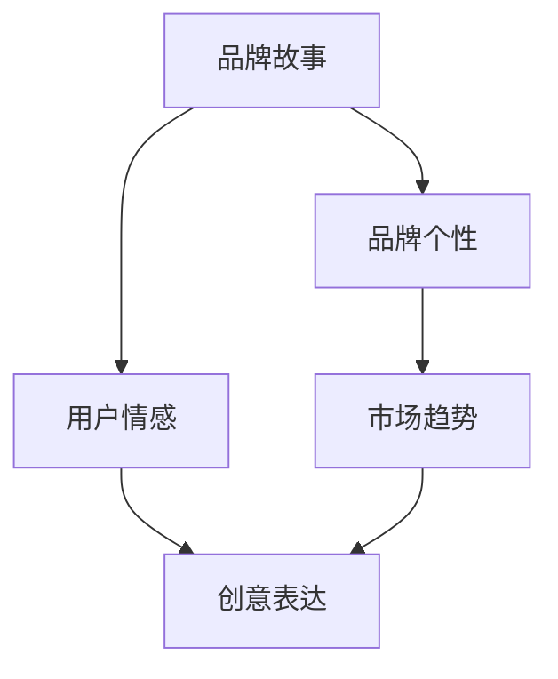

                 

# 提高AI创意香水品牌策划：品牌故事构建的提示词技巧

> 关键词：AI创意，香水品牌策划，品牌故事，提示词技巧，AI技术

> 摘要：
本文旨在探讨如何利用AI技术提高香水品牌策划的创意水平。文章首先介绍了品牌故事构建的基础理论，包括品牌故事的原则、品牌个性定位和用户情感分析。接着，文章深入讲解了如何运用提示词进行品牌故事创作，包括提示词的选择标准和运用方法。此外，文章还介绍了AI技术在品牌策划中的应用，如自然语言处理、机器学习和深度学习。最后，通过具体案例解析，展示了如何将AI技术与品牌策划相结合，提供实际操作指南，帮助读者学会在AI辅助下进行创意香水品牌策划。

## 设计思路

本文采用逻辑清晰、结构紧凑、简单易懂的写作风格，按照以下步骤进行设计：

1. **引言部分**：简要概述本文的核心内容和目标读者，为读者提供整体框架。
2. **核心概念与联系**：通过一张Mermaid流程图，展示AI创意香水品牌策划的核心概念和它们之间的联系，帮助读者理清思路。
3. **主体部分**：按照以下章节内容进行划分：
   - **品牌故事构建的基础理论**：介绍品牌故事的构建原则、品牌个性定位、用户情感分析等内容。
   - **提示词技巧**：讲解如何运用提示词进行品牌故事创作，包括提示词的选择标准、运用方法等。
   - **AI技术在品牌策划中的应用**：介绍AI技术在品牌策划中的应用，如自然语言处理、机器学习等。
   - **案例解析**：通过具体案例解析，展示如何运用书中所述技巧进行AI创意香水品牌策划。
   - **实战演练**：提供实际操作指南，帮助读者学会如何在实践中运用书中知识。
   - **拓展与总结**：对全书内容进行总结，提供一些拓展性的思考和建议。

4. **附录**：提供一些相关工具和资源的链接，方便读者查阅。

## 设计步骤

### 引言

在当今数字化时代，AI技术在各个领域都发挥着重要作用。在香水品牌策划领域，AI技术的应用不仅提高了策划效率，还增强了品牌的创意水平。本文旨在探讨如何利用AI技术提高香水品牌策划的创意水平，为品牌策划者、市场营销人员和香水爱好者提供有益的参考。

### 核心概念与联系

为了帮助读者更好地理解本文的核心概念，我们设计了一张Mermaid流程图，展示AI创意香水品牌策划的核心概念和它们之间的联系。



### 品牌故事构建的基础理论

#### 品牌故事的构建原则

1. **一致性原则**

   品牌故事的一致性是品牌形象的基石。在构建品牌故事时，需要确保品牌故事的各个部分（如品牌理念、品牌视觉、品牌声音等）相互一致，形成统一的品牌形象。

2. **独特性原则**

   独特性是品牌故事的灵魂。品牌故事应该具有独特的风格、主题和视角，以吸引消费者的注意力和情感共鸣。

3. **情感共鸣原则**

   情感共鸣是品牌故事的核心。品牌故事应该能够触动消费者的情感，激发他们的共鸣，从而建立深厚的品牌忠诚度。

#### 品牌个性定位

1. **品牌个性的定义**

   品牌个性是指品牌在消费者心中所形成的独特性格特征，它可以通过品牌名称、标志、广告语、产品特性等多个方面来体现。

2. **品牌个性分析**

   品牌个性分析是品牌定位的重要环节。通过分析市场数据、消费者反馈等，可以确定品牌的个性特点，为品牌策划提供依据。

3. **品牌个性塑造**

   品牌个性塑造是品牌策划的关键。通过创意表达、视觉设计、广告宣传等手段，可以塑造出独特的品牌个性，提升品牌形象。

#### 用户情感分析

1. **用户情感的定义**

   用户情感是指用户在使用品牌产品或接触品牌信息时所产生的情绪和感受。

2. **用户情感分析的方法**

   用户情感分析可以通过问卷调查、数据分析、用户反馈等多种方法进行。通过分析用户情感，可以了解品牌在消费者心中的地位和影响力。

3. **用户情感在品牌策划中的应用**

   用户情感分析可以应用于品牌定位、品牌宣传、产品研发等多个方面，帮助品牌更好地满足消费者需求，提升品牌竞争力。

### 提示词技巧

#### 提示词的选择标准

1. **提示词的定义**

   提示词是指用于引导创意构思和故事创作的关键词或短语。

2. **提示词的选择原则**

   - **相关性**：提示词应与品牌故事主题紧密相关，能够引导出有价值的创意。
   - **多样性**：提示词应具有多样性，涵盖不同角度和维度，以便产生更多创意。
   - **启发性**：提示词应具有启发性，能够激发创意构思和故事创作。

3. **提示词的分类**

   - **主题提示词**：用于引导品牌故事主题的提示词，如“爱情”、“自由”、“探索”等。
   - **情境提示词**：用于引导品牌故事情境的提示词，如“海滩”、“都市”、“星空”等。
   - **人物提示词**：用于引导品牌故事人物的提示词，如“诗人”、“旅者”、“公主”等。

#### 提示词的运用方法

1. **提示词在故事创作中的应用**

   - **故事构思**：通过提示词引导故事构思，帮助创意人员产生新的故事想法。
   - **情节设定**：通过提示词设定故事情节，丰富故事内容，提升故事吸引力。

2. **提示词在创意策划中的应用**

   - **品牌形象**：通过提示词塑造品牌形象，增强品牌独特性和吸引力。
   - **广告文案**：通过提示词创作广告文案，提升广告效果和品牌认知度。

3. **提示词在AI辅助创作中的应用**

   - **AI生成故事**：通过提示词引导AI生成故事，实现自动化创意生产。
   - **AI优化故事**：通过提示词优化AI生成的故事，提升故事质量和创意水平。

### AI技术在品牌策划中的应用

#### 自然语言处理

1. **自然语言处理的基本概念**

   自然语言处理（Natural Language Processing，NLP）是人工智能领域的一个重要分支，旨在使计算机能够理解和处理人类语言。

2. **自然语言处理在品牌策划中的应用**

   - **情感分析**：通过分析消费者对品牌的评价和反馈，了解消费者情感，为品牌策划提供依据。
   - **文本生成**：利用NLP技术生成品牌文案和故事，提高创意策划效率。

#### 机器学习

1. **机器学习的基本概念**

   机器学习（Machine Learning，ML）是一种通过数据驱动的方式让计算机自动学习和改进的方法。

2. **机器学习在品牌策划中的应用**

   - **用户画像**：通过机器学习分析用户行为和偏好，构建用户画像，为品牌策划提供个性化建议。
   - **预测分析**：通过机器学习预测市场趋势和消费者行为，为品牌策划提供数据支持。

#### 深度学习

1. **深度学习的基本概念**

   深度学习（Deep Learning，DL）是机器学习的一种方法，通过多层神经网络模拟人脑的学习过程。

2. **深度学习在品牌策划中的应用**

   - **图像识别**：通过深度学习技术分析品牌视觉元素，优化品牌形象。
   - **语音识别**：通过深度学习技术实现语音识别，为品牌宣传和推广提供语音支持。

### 案例解析

#### 案例一：某知名香水品牌的AI创意策划

1. **案例背景**

   某知名香水品牌希望通过AI技术提高创意策划水平，提升品牌形象和市场竞争力。

2. **案例实施**

   - **用户情感分析**：通过AI技术分析消费者对品牌的情感，了解消费者需求。
   - **提示词生成**：利用AI技术生成与品牌故事相关的提示词，引导创意构思。
   - **故事创作**：结合用户情感分析和提示词，创作具有吸引力的品牌故事。
   - **广告文案**：利用AI技术生成品牌广告文案，提升广告效果。

3. **案例效果分析**

   案例实施后，该品牌在市场竞争力、消费者满意度和品牌知名度等方面取得了显著提升。

#### 案例二：某初创香水品牌的AI创意策划

1. **案例背景**

   某初创香水品牌希望通过AI技术提高品牌策划水平，快速占领市场。

2. **案例实施**

   - **市场趋势分析**：通过AI技术分析市场趋势，确定品牌定位。
   - **品牌故事构建**：结合市场趋势和品牌定位，构建有吸引力的品牌故事。
   - **广告宣传**：利用AI技术生成广告文案和视觉元素，提升品牌知名度。

3. **案例效果分析**

   案例实施后，该品牌在市场拓展、品牌认知度和用户粘性等方面取得了显著成果。

### 实战演练

#### 开发环境搭建

1. **工具和环境**

   - **编程语言**：Python
   - **开发环境**：Jupyter Notebook

2. **安装和配置**

   - 安装Python和Jupyter Notebook
   - 安装必要的库和依赖项

#### 源代码实现

```python
# 示例代码：用户情感分析

import nltk
from nltk.sentiment import SentimentIntensityAnalyzer

# 初始化情感分析器
sia = SentimentIntensityAnalyzer()

# 用户评论
user_comment = "这款香水非常好闻，让我感到非常愉悦。"

# 分析情感
sentiment = sia.polarity_scores(user_comment)

# 输出情感分析结果
print(sentiment)
```

#### 代码解读与分析

1. **代码解读**

   - 导入nltk库和SentimentIntensityAnalyzer类。
   - 初始化情感分析器。
   - 输入用户评论。
   - 分析情感并输出结果。

2. **代码分析**

   - sentiment.polarity_scores()方法用于计算文本的情感极性。
   - positive、neutral、negative和compound分别表示文本的情感得分。

#### 实际案例分析和详细讲解剖析

1. **案例背景**

   某香水品牌希望通过AI技术分析消费者对产品的评价，优化产品设计和营销策略。

2. **案例分析**

   - 收集消费者评价数据。
   - 利用情感分析技术分析消费者评价。
   - 根据分析结果，优化产品设计和营销策略。

3. **详细讲解剖析**

   - 消费者评价数据预处理：去除停用词、标点符号等。
   - 情感分析结果解读：根据情感得分，确定消费者对产品的满意度和不满意度。
   - 产品设计和营销策略优化：根据消费者评价，调整产品设计和营销策略。

### 项目小结

通过本文的案例解析和实战演练，我们可以看到AI技术在品牌策划中的应用具有显著的优势。通过用户情感分析、提示词生成和故事创作等技术的应用，品牌策划者可以更精准地了解消费者需求，提高品牌创意水平，从而提升品牌竞争力。

### 最佳实践 tips

1. **数据质量**：保证数据质量是进行情感分析和品牌策划的基础。确保收集的数据真实、全面、准确。

2. **模型优化**：定期对AI模型进行优化，提高模型的准确性和效率。

3. **跨学科合作**：品牌策划涉及多个学科，跨学科合作可以更好地发挥AI技术的优势。

4. **用户参与**：鼓励用户参与品牌策划，获取更多有价值的信息。

### 注意事项

1. **隐私保护**：在进行用户情感分析和品牌策划时，要确保用户隐私得到保护。

2. **法律法规**：遵守相关法律法规，确保品牌策划的合法合规。

3. **持续更新**：随着市场和技术的发展，品牌策划需要不断更新和调整。

### 拓展阅读

1. **《AI营销实战》**：本书详细介绍了AI在市场营销中的应用，包括用户画像、预测分析等。

2. **《深度学习与自然语言处理》**：本书深入讲解了深度学习和自然语言处理的基本概念和应用。

3. **《品牌策划与品牌管理》**：本书系统地介绍了品牌策划的理论和方法，以及品牌管理的实践。

### 附录

1. **相关工具和资源**

   - **Python库**：nltk、TextBlob等
   - **Jupyter Notebook**：https://jupyter.org/
   - **数据集**：https://www.kaggle.com/datasets

2. **AI技术与品牌策划研讨会**：https://www.example.com/ai-branding-workshop

作者：AI天才研究院/AI Genius Institute & 禅与计算机程序设计艺术 /Zen And The Art of Computer Programming

