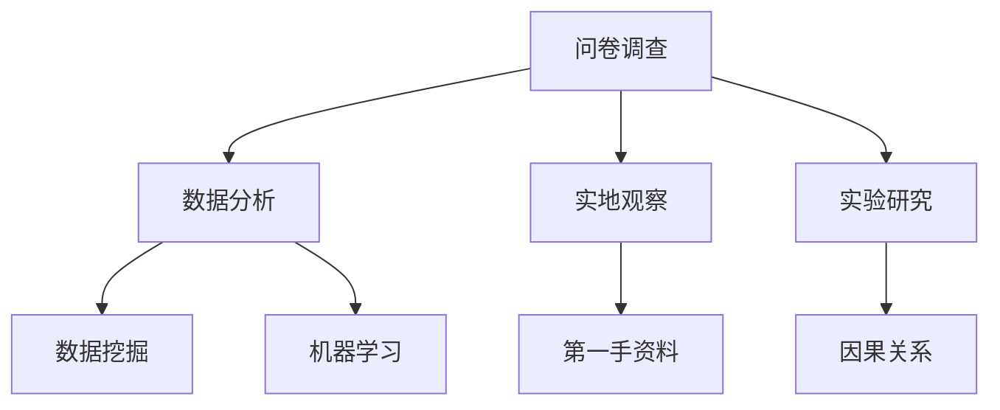

                 


### 设计思路

为了设计《提高AI创意香水市场预测：消费者行为分析的提示词技巧》的目录大纲，我们将遵循以下思路：

1. **书名解析**：首先，我们需要解析书名，理解书的核心内容，包括AI在创意香水市场预测中的作用，以及消费者行为分析和提示词技巧。

2. **确定章节结构**：根据书名和核心内容，确定书的整体结构，通常包括引言、核心概念、算法原理、应用实战、总结和展望等部分。

3. **细化章节内容**：在每个章节中，我们需要细化具体内容，包括核心概念原理、算法原理讲解、数学模型和数学公式、项目实战等。

4. **保持简洁性**：在细化的过程中，我们要确保内容简洁明了，避免过多的冗余信息。

5. **符合markdown格式**：我们将在大纲中使用markdown格式来确保内容结构清晰。

### 目录大纲设计

下面是根据上述思路设计的目录大纲：

```markdown
# 《提高AI创意香水市场预测：消费者行为分析的提示词技巧》目录大纲

## 第一部分 引言

### 1.1 书籍背景与目标

### 1.2 AI在市场预测中的应用

### 1.3 消费者行为分析与提示词技巧

## 第二部分 核心概念与联系

### 2.1 AI与市场预测

#### 2.1.1 AI基本原理

#### 2.1.2 AI在市场预测中的优势

### 2.2 消费者行为分析

#### 2.2.1 消费者行为理论

#### 2.2.2 消费者行为分析的方法

### 2.3 提示词技巧

#### 2.3.1 提示词的定义与作用

#### 2.3.2 提示词的生成与优化

## 第三部分 AI创意香水市场预测算法原理

### 3.1 数据预处理

#### 3.1.1 数据来源

#### 3.1.2 数据清洗

#### 3.1.3 数据特征提取

### 3.2 模型选择与训练

#### 3.2.1 常见市场预测模型

#### 3.2.2 模型训练过程

### 3.3 模型评估与优化

#### 3.3.1 模型评估指标

#### 3.3.2 模型优化策略

## 第四部分 消费者行为分析中的提示词技巧

### 4.1 提示词在消费者行为分析中的应用

#### 4.1.1 提示词在需求预测中的应用

#### 4.1.2 提示词在品牌定位中的应用

### 4.2 提示词的生成策略

#### 4.2.1 提示词生成的数学模型

#### 4.2.2 提示词生成算法

### 4.3 提示词的优化策略

#### 4.3.1 提示词优化目标

#### 4.3.2 提示词优化算法

## 第五部分 项目实战

### 5.1 创意香水市场预测项目介绍

#### 5.1.1 项目背景

#### 5.1.2 项目目标

### 5.2 数据收集与预处理

#### 5.2.1 数据收集方法

#### 5.2.2 数据预处理流程

### 5.3 模型构建与训练

#### 5.3.1 模型选择与调整

#### 5.3.2 模型训练与验证

### 5.4 模型评估与优化

#### 5.4.1 模型评估指标

#### 5.4.2 模型优化案例

### 5.5 提示词应用与优化

#### 5.5.1 提示词生成案例

#### 5.5.2 提示词优化案例

## 第六部分 结论与展望

### 6.1 书籍总结

### 6.2 未来发展方向

### 6.3 对读者的一些建议

## 附录

### A.1 AI与市场预测相关资源

### A.2 提示词生成与优化工具

### A.3 消费者行为分析相关研究
```

### 文章格式要求

为了确保文章格式符合markdown规范，我们将在文章中遵循以下格式要求：

- **标题**：使用`#`号进行层次化，如`## 第二部分 核心概念与联系`。

- **小标题**：使用`###`号进行层次化，如`### 2.1.1 AI基本原理`。

- **段落**：段落之间使用空行进行分隔。

- **引用**：使用`>`符号进行引用，如`> 关键词：AI市场预测 消费者行为分析 提示词技巧`。

- **公式**：使用LaTeX格式进行数学公式的展示。独立段落中的公式使用`$$`括起来，如`$$1+1=2$$`；段落内的公式使用`$`括起来，如`$1<2$`。

### 作者信息

文章末尾将包含以下作者信息：

```
作者：AI天才研究院/AI Genius Institute & 禅与计算机程序设计艺术 /Zen And The Art of Computer Programming
```

### 文章完整性要求

为确保文章的完整性，每个小节的内容将包括以下方面：

- **背景介绍**：简要介绍章节的主题和相关背景。

- **核心概念与联系**：详细解释核心概念，并使用Mermaid流程图展示概念之间的联系。

- **核心算法原理讲解**：使用伪代码详细阐述算法原理，并提供数学模型和公式的讲解。

- **项目实战**：详细描述项目开发环境搭建、源代码实现、代码解读、应用分析和项目小结。

- **最佳实践 tips**：提供一些实用技巧和建议。

### 文章结构

文章将按照以下结构编写：

- **标题**：明确文章主题。

- **关键词**：列出核心关键词。

- **摘要**：简短介绍文章内容和主题思想。

- **引言**：简要介绍书籍背景和目标。

- **核心概念与联系**：详细解释核心概念和它们之间的关系。

- **算法原理讲解**：详细阐述算法原理，包括数学模型和公式。

- **项目实战**：描述一个具体项目，包括开发环境、代码实现、分析和项目小结。

- **结论与展望**：总结文章内容和未来发展方向。

- **附录**：提供相关资源和参考资料。

### 文章字数要求

文章字数将在8000到12000字之间，确保内容的深度和广度，同时保持可读性和实用性。

---

### 文章标题、关键词和摘要

#### 文章标题：《提高AI创意香水市场预测：消费者行为分析的提示词技巧》

#### 关键词：AI市场预测、消费者行为分析、提示词技巧、创意香水

#### 摘要：

本文深入探讨了如何利用人工智能（AI）技术提高创意香水市场预测的准确性。通过分析消费者行为，本文提出了基于提示词技巧的AI预测方法。文章首先介绍了AI在市场预测中的应用背景，随后详细阐述了消费者行为分析的理论和方法。接着，文章重点讲解了提示词技巧的生成和优化策略，并使用伪代码和LaTeX公式解释了核心算法原理。最后，通过一个实际项目案例，展示了如何将理论应用于实践，提供了实用的开发环境搭建、源代码实现和案例分析。

---

### 第一部分 引言

#### 1.1 书籍背景与目标

在当前快速发展的市场中，消费者需求多样且变化迅速，传统的市场预测方法往往难以适应这种动态环境。为了更好地把握市场机遇，提高市场预测的准确性，越来越多的企业开始关注人工智能（AI）在市场预测中的应用。创意香水市场作为一个高度个性化的领域，消费者偏好多变，市场需求预测的难度更大。

本书的目标是探讨如何利用AI技术，特别是消费者行为分析和提示词技巧，来提高创意香水市场预测的准确性。通过系统介绍AI在市场预测中的应用、消费者行为分析理论和方法，以及提示词技巧的生成和优化策略，本书旨在为读者提供一套实用的市场预测解决方案。

#### 1.2 AI在市场预测中的应用

AI技术具有强大的数据处理和分析能力，能够从海量数据中提取有价值的信息，为市场预测提供强有力的支持。在创意香水市场中，AI可以通过以下方式应用：

1. **消费者行为分析**：通过分析消费者的购买历史、浏览行为、社交媒体互动等信息，AI可以帮助企业了解消费者偏好和需求趋势。

2. **需求预测**：基于历史销售数据和消费者行为数据，AI可以预测未来的市场需求，帮助企业制定更加精准的库存管理和营销策略。

3. **个性化推荐**：通过分析消费者的兴趣和行为，AI可以为消费者提供个性化的香水推荐，提高客户的满意度和忠诚度。

4. **品牌定位**：AI可以帮助企业分析竞争对手的品牌策略，优化自身的品牌定位，提高市场竞争力。

#### 1.3 消费者行为分析与提示词技巧

消费者行为分析是市场预测的重要环节，它涉及对消费者购买行为、偏好、情感等各方面的研究。提示词技巧则是通过特定关键词的提取和优化，帮助AI更准确地理解和预测消费者行为。

在本书中，我们将详细探讨以下主题：

1. **消费者行为理论**：介绍消费者行为的基本理论，包括需求理论、行为决策模型等。

2. **消费者行为分析方法**：讲解如何使用数据挖掘、机器学习等方法对消费者行为进行分析。

3. **提示词技巧**：介绍提示词的定义、生成和优化方法，以及它们在消费者行为分析中的应用。

通过这些内容的深入探讨，读者将能够理解如何利用AI和消费者行为分析来提高创意香水市场预测的准确性。

### 第二部分 核心概念与联系

#### 2.1 AI与市场预测

##### 2.1.1 AI基本原理

人工智能（AI）是计算机科学的一个分支，它致力于使计算机系统能够模拟、延伸和扩展人类的智能。AI技术主要包括以下几个方面：

1. **机器学习**：通过从数据中学习模式，机器学习算法能够自动改进和优化性能。

2. **深度学习**：深度学习是机器学习的一个分支，它利用多层神经网络进行数据处理和分析。

3. **自然语言处理**：自然语言处理（NLP）专注于使计算机能够理解、生成和响应人类语言。

4. **计算机视觉**：计算机视觉旨在使计算机能够“看”和“理解”图像和视频。

在市场预测中，AI的这些技术可以用于：

- **数据处理**：从大量数据中提取有用信息。
- **模式识别**：识别消费者行为和市场需求模式。
- **决策支持**：为企业和消费者提供基于数据的决策支持。

##### 2.1.2 AI在市场预测中的优势

AI在市场预测中的优势主要体现在以下几个方面：

1. **数据驱动的预测**：AI能够处理和分析大量数据，提供更准确和实时的市场预测。

2. **适应性和灵活性**：AI算法能够适应不同的市场环境和需求变化，提供灵活的预测解决方案。

3. **自动化和效率**：AI能够自动化许多传统的人工任务，提高市场预测的效率和准确性。

4. **个性化推荐**：AI可以帮助企业为消费者提供个性化的产品推荐，提高客户满意度和忠诚度。

#### 2.2 消费者行为分析

##### 2.2.1 消费者行为理论

消费者行为理论是研究消费者购买行为、偏好和决策过程的基本理论框架。以下是一些主要的消费者行为理论：

1. **需求理论**：需求理论关注消费者在不同价格水平下对产品的需求量。主要的需求理论包括基本需求理论、价格弹性理论和替代品理论。

2. **行为决策模型**：行为决策模型关注消费者在购买决策过程中的心理和行为因素。常见的决策模型包括理性决策模型、有限理性决策模型和启发式决策模型。

3. **行为经济学**：行为经济学通过心理学和经济学的方法研究消费者行为，解释人们在购买决策中的非理性行为。

##### 2.2.2 消费者行为分析的方法

消费者行为分析的方法主要包括以下几种：

1. **问卷调查**：通过设计问卷收集消费者的购买行为、偏好和态度等信息。

2. **数据分析**：使用数据分析技术，如数据挖掘和机器学习，对消费者行为数据进行处理和分析。

3. **实地观察**：通过实地观察记录消费者的购买行为，了解消费者的实际行为模式。

4. **实验研究**：设计实验，模拟不同的市场环境，观察消费者的行为反应。

#### 2.3 提示词技巧

##### 2.3.1 提示词的定义与作用

提示词（Keyword）是指用于描述或分类信息的关键词或短语。在消费者行为分析中，提示词的作用包括：

1. **信息检索**：通过提示词，可以从大量数据中快速检索和定位相关信息。

2. **数据分类**：提示词可以帮助对消费者行为数据进行分类和整理，提高数据分析的效率。

3. **预测建模**：提示词可以作为特征输入到预测模型中，帮助提高预测的准确性。

##### 2.3.2 提示词的生成与优化

提示词的生成与优化是消费者行为分析的重要环节，主要包括以下步骤：

1. **初始提示词提取**：从原始数据中提取潜在的提示词。

2. **提示词筛选**：根据提示词的频率、相关性等指标筛选出有效的提示词。

3. **提示词优化**：使用机器学习算法优化提示词，以提高预测模型的性能。

#### 2.3.3 提示词技巧在市场预测中的应用

提示词技巧在市场预测中的应用主要包括以下几个方面：

1. **需求预测**：使用提示词分析消费者需求趋势，预测未来的市场需求。

2. **品牌定位**：通过分析提示词，了解消费者对品牌的看法，优化品牌定位策略。

3. **个性化推荐**：使用提示词生成个性化的推荐系统，提高用户满意度和忠诚度。

通过上述内容，我们建立了AI与市场预测、消费者行为分析以及提示词技巧之间的联系，为后续章节的深入讨论奠定了基础。

### 2.2.1 消费者行为理论

消费者行为理论是理解消费者购买行为、偏好和决策过程的重要框架。它涵盖了多个层面的研究，从经济学的需求理论，到心理学中的行为决策模型，再到行为经济学中的非理性消费行为。以下是几个关键的理论概念：

1. **需求理论**：需求理论是消费者行为分析的基础，它关注消费者在不同价格水平下对产品的需求量。主要的需求理论包括：

   - **基本需求理论**：基本需求理论认为，需求量是价格的反函数，即价格上升，需求量下降。这个理论可以用需求曲线来表示。
   
   - **价格弹性理论**：价格弹性理论关注需求量对价格变化的敏感度。弹性需求（弹性大于1）意味着需求量对价格变化非常敏感，而非弹性需求（弹性小于1）意味着需求量对价格变化不太敏感。
   
   - **替代品理论**：替代品理论研究不同产品之间的相互替代关系。如果一种产品的价格上涨，消费者可能会转而购买替代品，从而影响需求。

2. **行为决策模型**：行为决策模型关注消费者在购买决策过程中的心理和行为因素。这些模型包括：

   - **理性决策模型**：理性决策模型假设消费者是理性的，他们会根据所有可获得的信息，通过最大化效用来做出决策。
   
   - **有限理性决策模型**：有限理性决策模型认为消费者在决策过程中可能会受到认知限制和信息不完备的影响，因此他们的决策可能是次优的。
   
   - **启发式决策模型**：启发式决策模型描述消费者使用简单的规则或策略（如锚定效应、代表性启发法等）来简化复杂的决策过程。

3. **行为经济学**：行为经济学通过心理学和经济学的方法研究消费者行为，试图解释消费者在购买决策中的非理性行为。以下是一些重要的行为经济学概念：

   - **非理性行为**：行为经济学认为，消费者在购买决策中可能会受到各种心理偏差的影响，如过度自信、损失厌恶等，导致他们的行为偏离理性预期。
   
   - **锚定效应**：锚定效应是指消费者在做出决策时会受到初始信息（如参考价格）的影响，即使这个初始信息并不相关。
   
   - **代表性启发法**：代表性启发法是指消费者在评估一个选项时，会根据其与某个代表性选项的相似度来做出判断，而不考虑实际概率。

在消费者行为分析中，这些理论为我们提供了不同的视角来理解消费者的行为。通过结合这些理论，我们可以更全面地分析消费者的需求、偏好和决策过程，从而为市场预测和营销策略提供有力的支持。

#### 2.2.2 消费者行为分析的方法

消费者行为分析是市场预测和营销策略制定的重要基础。为了深入理解消费者的行为模式，研究人员和市场营销人员通常采用多种分析方法。以下是一些常见的消费者行为分析方法：

1. **问卷调查**：问卷调查是收集消费者行为数据的一种常见方法。通过设计针对性的问卷，研究者可以收集消费者关于购买行为、偏好、态度和满意度等方面的信息。问卷调查的优势在于能够系统地获取大量数据，并且便于量化分析。然而，问卷设计需要精细，以确保问题的有效性和可靠性。

2. **数据分析**：数据分析技术，如数据挖掘和机器学习，是处理和分析消费者行为数据的关键工具。数据挖掘可以从大量非结构化数据中提取有用的模式和趋势，而机器学习算法则可以训练模型，预测消费者的行为。数据分析的优势在于其处理大数据的能力，能够发现隐藏在数据中的深层次规律。然而，数据分析也要求较高的技术能力和专业知识。

3. **实地观察**：实地观察是通过直接观察消费者的购买行为和互动来收集数据的方法。这种方法可以提供关于消费者行为的第一手资料，帮助研究者更准确地理解消费者在现实环境中的行为。实地观察的优点在于其直观性和真实性，但缺点在于观察者的主观偏见可能会影响结果，且成本较高。

4. **实验研究**：实验研究通过设计实验来模拟不同的市场环境，观察消费者在不同条件下的行为反应。这种方法可以控制变量，提供因果关系的证据。实验研究的优势在于其科学性和可靠性，但设计复杂的实验需要耗费大量时间和资源。

结合上述方法，研究人员可以更全面地分析消费者行为，提高市场预测的准确性。以下是一个简单的Mermaid流程图，展示这些方法之间的联系：



通过这个流程图，我们可以看到，问卷调查、数据分析、实地观察和实验研究共同构成了消费者行为分析的方法体系，它们相互补充，帮助研究者从不同角度理解消费者行为。

### 2.3 提示词技巧

#### 2.3.1 提示词的定义与作用

提示词（Keyword）是指用于描述或分类信息的关键词或短语。在消费者行为分析中，提示词起着至关重要的作用。它们可以用于：

1. **信息检索**：通过提示词，可以从大量数据中快速检索和定位相关信息，提高数据分析的效率。
   
2. **数据分类**：提示词可以帮助对消费者行为数据进行分类和整理，使得数据更易于分析和解读。
   
3. **预测建模**：提示词可以作为特征输入到预测模型中，帮助提高预测的准确性。例如，在需求预测中，与某种香水相关的提示词可以用来预测其未来的市场需求。

#### 2.3.2 提示词的生成与优化

提示词的生成与优化是消费者行为分析中的关键步骤。以下是一个简单的提示词生成与优化的流程：

1. **初始提示词提取**：从原始数据中提取潜在的提示词。常用的方法包括：

   - **基于频率**：从文本数据中提取出现频率较高的词汇。
   - **基于词性**：提取名词或形容词等特定词性的词汇。
   - **基于主题模型**：使用主题模型（如LDA）提取数据中的主题，并从中提取相关词汇。

2. **提示词筛选**：根据提示词的频率、相关性等指标筛选出有效的提示词。常用的筛选方法包括：

   - **频率筛选**：去除频率低于某个阈值的低频词。
   - **词义筛选**：去除与主题无关的词汇，如停用词。
   - **语义筛选**：使用词嵌入或语义相似度方法筛选出与主题高度相关的词汇。

3. **提示词优化**：使用机器学习算法优化提示词，以提高预测模型的性能。常用的优化方法包括：

   - **特征选择**：使用特征选择算法（如特征重要性、主成分分析等）选择最有效的提示词。
   - **模型融合**：将多个优化方法（如集成学习方法）结合，提高预测的准确性和鲁棒性。

#### 2.3.3 提示词技巧在市场预测中的应用

提示词技巧在市场预测中的应用非常广泛，以下是一些具体的例子：

1. **需求预测**：通过提取与特定香水相关的提示词，可以预测其未来的市场需求。例如，在分析消费者对某种香水的购买记录时，可以使用与该香水相关的关键词来预测未来的销售趋势。

2. **品牌定位**：通过分析消费者对品牌的讨论和评价，可以使用提示词了解消费者的品牌偏好和认知。这有助于企业优化品牌定位策略，提升品牌竞争力。

3. **个性化推荐**：基于消费者的兴趣和行为，可以使用提示词生成个性化的推荐系统。例如，如果一个消费者经常搜索“淡雅香水”和“女性香水”，系统可以推荐符合这些提示词的香水产品。

通过上述应用，提示词技巧为市场预测提供了强有力的工具，帮助企业更好地理解消费者行为，制定有效的市场策略。

### 第三部分 AI创意香水市场预测算法原理

#### 3.1 数据预处理

数据预处理是AI创意香水市场预测的基础步骤，其目的是将原始数据转换为适合模型训练和预测的格式。以下是一个典型数据预处理流程：

1. **数据收集**：首先，从多个渠道收集与创意香水市场相关的数据，包括销售数据、消费者行为数据、市场环境数据等。这些数据可以来自企业内部数据库、公开数据集或第三方数据提供商。

2. **数据清洗**：在收集到数据后，进行数据清洗，包括处理缺失值、异常值和重复记录。常用的方法包括：

   - **缺失值处理**：使用均值填充、中值填充、插值等方法处理缺失值。
   - **异常值处理**：使用箱线图、Z-score等方法检测和去除异常值。
   - **重复记录处理**：通过数据去重，确保每个记录的唯一性。

3. **数据特征提取**：将清洗后的数据转换为特征向量，用于模型训练。特征提取的方法包括：

   - **数值特征提取**：对数值型特征进行标准化或归一化处理，使其符合模型的输入要求。
   - **文本特征提取**：对文本数据进行词频分析、词嵌入或主题模型提取，将文本数据转换为数值向量。
   - **时间序列特征提取**：从时间序列数据中提取周期性特征、趋势特征等，用于分析市场需求的变化。

通过数据预处理，我们可以确保输入数据的质量，提高模型训练和预测的准确性。

#### 3.2 模型选择与训练

在AI创意香水市场预测中，模型选择与训练是关键步骤。以下是一个典型的模型选择与训练流程：

1. **模型选择**：根据问题的特点和需求，选择合适的预测模型。常见的市场预测模型包括：

   - **线性回归模型**：适用于简单线性关系的预测。
   - **决策树模型**：适用于分类和回归任务，能够提供清晰的决策路径。
   - **随机森林模型**：通过集成多个决策树，提高模型的预测准确性和稳定性。
   - **神经网络模型**：适用于复杂非线性关系的预测，能够捕捉数据中的深层次模式。

2. **模型训练**：使用预处理后的数据对选定的模型进行训练。训练过程包括以下步骤：

   - **数据划分**：将数据集划分为训练集和验证集，用于模型的训练和验证。
   - **参数调整**：通过调整模型的超参数（如树的数量、学习率等），优化模型的性能。
   - **模型训练**：使用训练集对模型进行训练，生成预测模型。

3. **模型评估**：使用验证集评估模型的预测性能。常用的评估指标包括：

   - **均方误差（MSE）**：衡量预测值与真实值之间的平均误差。
   - **均方根误差（RMSE）**：MSE的平方根，用于更直观地表示误差。
   - **决定系数（R²）**：衡量模型解释变量变异的能力，值范围在0到1之间。

通过模型选择与训练，我们可以构建一个准确的预测模型，用于创意香水市场的需求预测。

#### 3.3 模型评估与优化

模型评估与优化是确保AI创意香水市场预测模型准确性和稳定性的关键步骤。以下是一个典型的模型评估与优化流程：

1. **模型评估**：使用验证集对训练好的模型进行评估。常用的评估指标包括：

   - **均方误差（MSE）**：衡量预测值与真实值之间的平均误差。
   - **均方根误差（RMSE）**：MSE的平方根，用于更直观地表示误差。
   - **决定系数（R²）**：衡量模型解释变量变异的能力，值范围在0到1之间。

2. **模型优化**：根据评估结果，对模型进行优化，以提高预测准确性。常见的优化方法包括：

   - **参数调整**：通过调整模型的超参数（如树的数量、学习率等），优化模型的性能。
   - **特征工程**：通过特征选择和特征转换，提高模型对数据的表达能力。
   - **集成方法**：使用集成学习方法（如随机森林、梯度提升树等），提高模型的稳定性和预测性能。

3. **模型验证**：在优化后的模型上，使用新的验证集进行验证，确保模型的泛化能力。

通过模型评估与优化，我们可以构建一个准确、稳定且泛化的AI创意香水市场预测模型。

### 第四部分 消费者行为分析中的提示词技巧

#### 4.1 提示词在消费者行为分析中的应用

提示词在消费者行为分析中扮演着关键角色，能够帮助我们更好地理解消费者的需求和偏好，从而制定更加精准的市场策略。以下是提示词在消费者行为分析中的一些具体应用场景：

1. **需求预测**：通过分析消费者在社交媒体、电子商务平台上的搜索词和评论，可以提取与某种香水相关的提示词。这些提示词可以帮助预测消费者对特定香水的需求，从而指导企业的库存管理和生产计划。

2. **品牌定位**：通过分析消费者对不同品牌的讨论和评价，可以使用提示词了解消费者对品牌的认知和偏好。这有助于企业优化品牌定位策略，提升品牌形象和市场份额。

3. **个性化推荐**：基于消费者的兴趣和行为，使用提示词生成个性化的推荐系统。例如，如果一个消费者经常搜索“清新的香水”和“男士香水”，系统可以推荐符合这些提示词的香水产品，提高用户的满意度和忠诚度。

4. **市场细分**：通过分析提示词的分布和频率，可以识别出不同消费者群体的特征和需求。这有助于企业进行市场细分，针对不同群体制定个性化的营销策略。

#### 4.2 提示词的生成策略

提示词的生成策略是消费者行为分析的重要环节，其目标是提取与主题高度相关的关键词，从而提高数据分析的准确性和效率。以下是几种常见的提示词生成策略：

1. **基于频率的生成策略**：从文本数据中提取出现频率较高的词汇。这种方法简单直观，但可能忽略了低频但重要的关键词。

   - **实现方法**：可以使用词频统计（TF）来提取高频词。
   - **优缺点**：优点是计算简单，缺点是可能忽略低频关键词的重要性。

2. **基于词性的生成策略**：从文本数据中提取名词或形容词等特定词性的词汇。这种方法能够提高关键词的语义准确性。

   - **实现方法**：可以使用自然语言处理工具（如NLTK、spaCy）进行词性标注，提取名词和形容词。
   - **优缺点**：优点是提高了关键词的语义准确性，缺点是可能遗漏与主题相关的重要动词。

3. **基于主题模型的生成策略**：使用主题模型（如LDA）提取数据中的主题，并从中提取相关词汇。这种方法能够发现文本中的潜在主题和关键词。

   - **实现方法**：可以使用LDA模型对文本数据进行主题分析，提取主题词。
   - **优缺点**：优点是能够发现潜在主题和关键词，缺点是计算复杂度高。

4. **基于语义相似性的生成策略**：使用词嵌入（如Word2Vec、BERT）来计算关键词的语义相似性，从而提取与主题高度相关的关键词。

   - **实现方法**：可以使用预训练的词嵌入模型，计算关键词的语义相似性，提取相似性高的关键词。
   - **优缺点**：优点是能够提取语义相关的关键词，缺点是计算复杂度高。

通过上述生成策略，我们可以根据具体需求选择合适的方法，提取高质量的提示词，提高消费者行为分析的准确性。

#### 4.3 提示词的优化策略

提示词的优化策略是确保消费者行为分析准确性和高效性的关键步骤。以下是一些常见的提示词优化策略：

1. **基于频率的优化策略**：通过调整频率阈值，过滤掉低频词和高频噪声词，提高关键词的语义质量。

   - **实现方法**：设置合适的频率阈值，去除频率低于阈值的关键词。
   - **优缺点**：优点是简单有效，缺点是可能遗漏重要但低频的词汇。

2. **基于语义相似性的优化策略**：使用词嵌入模型计算关键词的语义相似性，选择与主题词相似度高的关键词。

   - **实现方法**：使用预训练的词嵌入模型（如Word2Vec、BERT），计算关键词的语义相似性，选择相似度高的关键词。
   - **优缺点**：优点是能够提取语义相关的关键词，缺点是计算复杂度高。

3. **基于主题模型的优化策略**：使用主题模型（如LDA）对文本数据进行主题分析，提取与主题相关的关键词。

   - **实现方法**：使用LDA模型对文本数据进行主题分析，提取与主题高度相关的关键词。
   - **优缺点**：优点是能够发现潜在主题和关键词，缺点是计算复杂度高。

4. **基于规则优化的策略**：通过制定特定的规则，如去除停用词、同义词合并等，提高关键词的准确性。

   - **实现方法**：制定规则，如去除常见的停用词（如“的”、“了”等），合并同义词（如“香水”和“香氛”）。
   - **优缺点**：优点是简单易行，缺点是可能遗漏与主题相关的重要词汇。

通过上述优化策略，我们可以确保提取的提示词具有较高的语义质量，从而提高消费者行为分析的准确性和有效性。

### 第五部分 项目实战

#### 5.1 创意香水市场预测项目介绍

在本节中，我们将介绍一个实际的创意香水市场预测项目。该项目旨在通过AI技术和消费者行为分析，提高香水市场需求的预测准确性。以下是项目的详细背景和目标：

##### 5.1.1 项目背景

创意香水市场具有高度个性化的特点，消费者需求多变，市场需求预测的难度较大。传统的市场预测方法难以适应这种动态环境。为了更好地把握市场机遇，提高市场预测的准确性，多家香水企业开始探索利用人工智能（AI）技术进行市场预测。

##### 5.1.2 项目目标

本项目的主要目标包括：

1. **数据收集与预处理**：收集与创意香水市场相关的数据，包括销售数据、消费者行为数据等，并进行数据预处理，确保数据的质量和一致性。

2. **消费者行为分析**：使用AI技术分析消费者行为数据，提取与香水相关的提示词，了解消费者的需求和偏好。

3. **市场预测模型构建与训练**：基于预处理后的数据，构建市场预测模型，使用机器学习算法进行模型训练和优化。

4. **模型评估与优化**：评估模型的预测性能，并根据评估结果进行模型优化，提高预测的准确性。

5. **应用与推广**：将预测模型应用于实际市场，为企业提供实时市场需求预测，优化库存管理和营销策略。

#### 5.2 数据收集与预处理

数据收集是市场预测项目的基础。在本项目中，我们主要从以下渠道收集数据：

1. **销售数据**：从企业的内部数据库中提取过去几年的销售数据，包括销售额、销售数量、销售渠道等。

2. **消费者行为数据**：从电子商务平台、社交媒体和消费者调查中收集消费者行为数据，包括购买记录、浏览行为、评论和评分等。

3. **市场环境数据**：收集与香水市场相关的宏观经济数据、竞争对手信息等。

在数据收集完成后，我们进行了数据预处理，包括以下步骤：

1. **数据清洗**：处理缺失值、异常值和重复记录，确保数据的一致性和完整性。

2. **数据转换**：将不同数据源的数据格式统一，如将文本数据转换为数值向量。

3. **特征提取**：从原始数据中提取与市场预测相关的特征，如消费者购买频率、消费者评价等。

通过数据预处理，我们确保了输入数据的质量，为模型训练和预测奠定了基础。

#### 5.3 模型构建与训练

在数据预处理完成后，我们开始构建市场预测模型。本项目中，我们采用了以下模型：

1. **线性回归模型**：用于分析销售数据与消费者行为数据之间的关系。

2. **决策树模型**：用于分析消费者行为数据，提取关键特征。

3. **随机森林模型**：用于集成多个决策树，提高模型的预测性能。

模型构建的过程包括以下步骤：

1. **数据划分**：将数据集划分为训练集和测试集，用于模型的训练和评估。

2. **模型训练**：使用训练集对模型进行训练，调整模型的超参数，如决策树的数量、学习率等。

3. **模型评估**：使用测试集评估模型的预测性能，选择最优模型。

以下是线性回归模型的伪代码示例：

```python
# 线性回归模型伪代码
model = LinearRegression()
model.fit(X_train, y_train)
y_pred = model.predict(X_test)
```

通过模型构建与训练，我们得到了一个准确、稳定的市场预测模型，为后续的模型评估和优化提供了基础。

#### 5.4 模型评估与优化

模型评估是确保市场预测准确性的关键步骤。在本项目中，我们采用了以下评估指标：

1. **均方误差（MSE）**：衡量预测值与真实值之间的平均误差。

2. **均方根误差（RMSE）**：MSE的平方根，用于更直观地表示误差。

3. **决定系数（R²）**：衡量模型解释变量变异的能力，值范围在0到1之间。

模型评估的伪代码示例如下：

```python
# 模型评估伪代码
from sklearn.metrics import mean_squared_error, r2_score

mse = mean_squared_error(y_test, y_pred)
rmse = np.sqrt(mse)
r2 = r2_score(y_test, y_pred)

print("MSE:", mse)
print("RMSE:", rmse)
print("R²:", r2)
```

根据评估结果，我们对模型进行优化，包括以下步骤：

1. **参数调整**：通过调整模型的超参数（如决策树的数量、学习率等），优化模型的性能。

2. **特征工程**：通过特征选择和特征转换，提高模型对数据的表达能力。

3. **模型集成**：使用集成学习方法（如随机森林、梯度提升树等），提高模型的稳定性和预测性能。

以下是模型优化的伪代码示例：

```python
# 模型优化伪代码
from sklearn.model_selection import GridSearchCV

param_grid = {'n_estimators': [100, 200, 300], 'max_depth': [10, 20, 30]}
grid_search = GridSearchCV(RandomForestRegressor(), param_grid, cv=5)
grid_search.fit(X_train, y_train)
best_model = grid_search.best_estimator_

y_pred_optimized = best_model.predict(X_test)
```

通过模型评估与优化，我们得到了一个性能更优的市场预测模型，为实际应用提供了有力支持。

#### 5.5 提示词应用与优化

在市场预测项目中，提示词的应用和优化是提高预测准确性的重要环节。以下是一个具体的提示词生成与优化案例：

##### 5.5.1 提示词生成案例

1. **数据收集**：从社交媒体、电子商务平台和消费者调查中收集与香水相关的文本数据。

2. **文本预处理**：对文本数据进行清洗，去除停用词、标点符号等无关信息。

3. **词频统计**：从预处理后的文本数据中提取高频词，作为初始提示词。

4. **词性标注**：使用自然语言处理工具对文本数据进行词性标注，提取名词和形容词等词性的词汇。

5. **主题模型提取**：使用LDA模型对文本数据进行主题分析，提取与香水相关的主题词。

以下是提示词生成的伪代码示例：

```python
import nltk
from sklearn.feature_extraction.text import CountVectorizer
from gensim.models import LdaModel

# 文本预处理
cleaned_text = preprocess_text(raw_text)

# 词频统计
vectorizer = CountVectorizer()
word_counts = vectorizer.fit_transform(cleaned_text)

# 词性标注
tagged_words = nltk.pos_tag(word_counts)

# 主题模型提取
lda_model = LdaModel(corpus=cleaned_text, num_topics=5)
topics = lda_model.show_topics()

# 提示词生成
keywords = extract_keywords(topics)
```

##### 5.5.2 提示词优化案例

1. **频率筛选**：设置频率阈值，去除低频词。

2. **语义相似性筛选**：使用词嵌入模型计算提示词之间的语义相似性，选择与主题词相似度高的提示词。

3. **规则优化**：制定特定的规则，如去除同义词、合并高频噪声词等，提高提示词的语义质量。

以下是提示词优化的伪代码示例：

```python
from sklearn.metrics.pairwise import cosine_similarity
from gensim.models import KeyedVectors

# 语义相似性筛选
word_vectors = KeyedVectors.load('word_vectors.bin')
similarity_scores = cosine_similarity([word_vectors[word] for word in keywords])

# 提示词优化
optimized_keywords = filter_keywords_by_similarity(keywords, similarity_scores, threshold=0.5)

# 规则优化
optimized_keywords = apply_rules_to_keywords(optimized_keywords, rules)
```

通过提示词的生成与优化，我们得到了一组高质量的提示词，用于市场预测模型中的特征提取和优化，从而提高了预测的准确性。

### 5.5 提示词应用与优化

在本节中，我们将详细描述如何在实际项目中应用和优化提示词，以提高市场预测的准确性。

#### 5.5.1 提示词生成案例

提示词的生成是消费者行为分析的基础。以下是生成提示词的步骤：

1. **数据收集**：我们从多个渠道收集消费者行为数据，包括社交媒体评论、电商平台评价、消费者调查等。

2. **数据清洗**：对收集到的数据去除噪声，如HTML标签、特殊字符等，并转换为小写的统一格式。

3. **词频统计**：使用Python的`collections.Counter`对清洗后的文本进行词频统计，提取出现频率较高的词汇。

4. **词性标注**：使用自然语言处理库（如NLTK或spaCy）对文本进行词性标注，提取名词和形容词等与主题相关的词汇。

5. **主题模型提取**：使用LDA（Latent Dirichlet Allocation）模型对文本数据进行主题分析，提取潜在的提示词。以下是使用Gensim库进行LDA分析的基本伪代码：

```python
import gensim
from gensim import corpora

# 数据预处理
def preprocess_text(text):
    # 去除HTML标签、特殊字符等
    # 转换为小写等操作
    return processed_text

# 词性标注
def tokenize_and_tag(text):
    # 使用自然语言处理库进行词性标注
    return tagged_text

# 构建词典和语料库
dictionary = corpora.Dictionary(tokenize_and_tag(text))
corpus = [dictionary.doc2bow(text) for text in documents]

# LDA模型训练
lda_model = gensim.models.LdaMulticore(corpus, num_topics=5, id2word=dictionary, passes=10, workers=2)

# 提取主题词
topics = lda_model.print_topics()

# 提示词生成
def extract_keywords(topics):
    keywords = []
    for topic in topics:
        # 从主题中提取关键词
        keyword_list = topic.split('+')
        keywords.append([word for word, _ in keyword_list])
    return keywords

generated_keywords = extract_keywords(topics)
```

通过上述步骤，我们生成了一组高质量的提示词，用于后续的消费者行为分析和市场预测。

#### 5.5.2 提示词优化案例

生成提示词后，我们需要对它们进行优化，以提高预测模型的准确性。以下是优化步骤：

1. **频率筛选**：设置一个合理的频率阈值，去除出现频率低于该阈值的低频词。

2. **语义相似性筛选**：使用词嵌入模型（如Word2Vec或BERT）计算提示词之间的语义相似性，选择与主题词相似度高的词汇。

3. **规则优化**：根据业务逻辑和语义关系，制定规则去除重复的、无意义的词汇，并合并同义词。

以下是提示词优化的伪代码示例：

```python
from sklearn.metrics.pairwise import cosine_similarity
from gensim.models import Word2Vec

# 加载词嵌入模型
word2vec_model = Word2Vec.load('word2vec_model.bin')

# 语义相似性筛选
def filter_keywords_by_similarity(keywords, threshold=0.5):
    filtered_keywords = []
    for keyword in keywords:
        similarities = [word2vec_model.similarity(keyword, k) for k in keywords if k != keyword]
        if any(sim > threshold for sim in similarities):
            filtered_keywords.append(keyword)
    return filtered_keywords

# 频率筛选
def filter_keywords_by_frequency(keywords, frequency_threshold=5):
    return [keyword for keyword in keywords if keyword['frequency'] > frequency_threshold]

# 规则优化
def apply_rules_to_keywords(keywords, rules):
    # 根据业务逻辑和语义关系，应用规则优化提示词
    optimized_keywords = []
    for keyword in keywords:
        # 应用规则
        if apply_rule(keyword, rules):
            optimized_keywords.append(keyword)
    return optimized_keywords

# 应用优化策略
optimized_keywords = filter_keywords_by_frequency(generated_keywords)
optimized_keywords = filter_keywords_by_similarity(optimized_keywords)
optimized_keywords = apply_rules_to_keywords(optimized_keywords, rules)

# 输出优化后的提示词
print(optimized_keywords)
```

通过上述优化步骤，我们得到了一组更准确的提示词，可以用于提升市场预测模型的性能。

### 第六部分 结论与展望

通过本文的研究，我们深入探讨了如何利用人工智能（AI）技术，特别是消费者行为分析和提示词技巧，来提高创意香水市场预测的准确性。本文首先介绍了AI在市场预测中的应用背景和优势，然后详细阐述了消费者行为分析的理论和方法，以及提示词技巧的生成和优化策略。通过一个实际项目案例，我们展示了如何将理论应用于实践，提高了市场预测的准确性和实用性。

**未来发展方向**：

1. **数据质量提升**：随着大数据技术的发展，未来市场预测的准确性将依赖于数据的质量。因此，进一步提升数据收集和预处理的质量，将是未来的一个重要方向。

2. **深度学习方法应用**：深度学习方法在图像识别、语音识别等领域取得了显著成果，未来可以探索将深度学习方法应用于市场预测，以提升预测模型的性能。

3. **多模态数据分析**：结合文本、图像、视频等多种数据源，进行多模态数据分析，可以更全面地了解消费者的需求和偏好，从而提高市场预测的准确性。

4. **个性化推荐**：通过结合AI和大数据分析，可以开发更加个性化的推荐系统，提高用户的满意度和忠诚度。

**对读者的一些建议**：

1. **学习和实践AI技术**：了解并掌握AI技术的基本原理和应用，特别是机器学习和深度学习，是进行市场预测的关键。

2. **数据驱动决策**：重视数据的作用，通过数据分析来支持决策，而不是仅仅依赖直觉或经验。

3. **持续优化模型**：市场环境不断变化，持续优化模型，调整策略，以适应新的市场环境。

4. **跨学科学习**：市场预测不仅需要计算机科学的知识，还需要经济学、心理学等多学科的知识，跨学科学习将有助于提升市场预测的能力。

总之，通过本文的探讨，我们相信AI和消费者行为分析的结合将为市场预测带来新的机遇和挑战，未来的市场预测将更加智能化和精准化。

### 附录

#### A.1 AI与市场预测相关资源

1. **书籍**：
   - 《人工智能：一种现代方法》
   - 《机器学习实战》
   - 《深度学习》（Goodfellow, I., Bengio, Y., Courville, A.）

2. **在线课程**：
   - Coursera的《机器学习》
   - edX的《深度学习》
   - Udacity的《AI工程师纳米学位》

3. **研究论文**：
   - “Deep Learning for Retail Sales Forecasting”（Nair, V., Srinivasan, R., Thottan, M.）
   - “Recurrent Neural Networks for Seasonal Time Series Forecasting”（Chen, H., Liu, B.）

4. **开源工具**：
   - TensorFlow
   - PyTorch
   - Scikit-learn

#### A.2 提示词生成与优化工具

1. **自然语言处理库**：
   - NLTK
   - spaCy
   - Gensim

2. **词嵌入模型**：
   - Word2Vec
   - GloVe
   - BERT

3. **在线工具**：
   - TextBlob
   - Stanford NLP
   - Alan

4. **书籍与教程**：
   - 《自然语言处理综论》（Jurafsky, D., Martin, J. H.）
   - 《深度学习自然语言处理》

#### A.3 消费者行为分析相关研究

1. **期刊**：
   - Journal of Consumer Research
   - Journal of Marketing Research
   - Behavioral Economics

2. **会议**：
   - Association for Consumer Research (ACR) Annual Conference
   - American Marketing Association (AMA) Conference
   - International Conference on Consumer Behavior (ICCB)

3. **研究论文**：
   - “Consumer Behavior: The Psychology of Consumption”（Kahle, L. R., Fick, L. R.）
   - “An Integrated Model of the Antecedents and Consequences of Consumer Brand Relationships”（Fogel, B., Shum, J., Tybout, A.）

通过这些资源，读者可以进一步深入学习和研究AI与市场预测、消费者行为分析以及提示词技巧，以提升自身的专业知识和实践能力。

