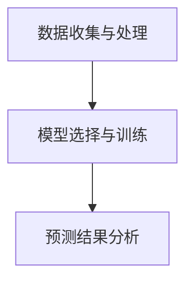
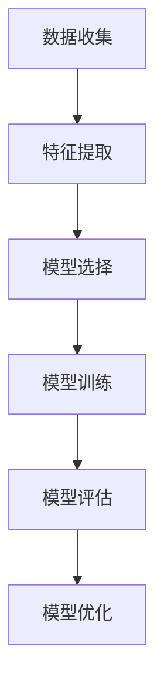

                 


### 文章标题：提高AI创意香水趋势预测：社会文化影响分析的提示词技巧

### 关键词：
- AI创意香水
- 趋势预测
- 社会文化
- 提示词分析
- 数据模型
- 机器学习

### 摘要：
本文探讨了如何通过社会文化影响分析，使用提示词技巧来提高AI在创意香水趋势预测的准确性。文章首先介绍了AI与香水产业结合的背景，接着阐述了社会文化对香水趋势的影响，并详细介绍了提示词的概念、分类和应用。随后，文章讲解了AI技术在香水趋势预测中的应用原理和实际操作，并分析了数学模型和公式。最后，通过实际案例展示了AI在香水趋势预测中的成功应用，并给出了项目小结和最佳实践建议。

### 目录：

## 第一部分：AI创意香水趋势预测基础

### 第1章：AI与香水产业的结合

#### 1.1 AI技术概述

- **背景介绍**：AI技术的基本概念和其在香水产业中的应用前景。
  - **核心概念与联系**：[Mermaid流程图]
  - **核心算法原理讲解**：使用伪代码来详细阐述AI技术的基本原理和应用。
    ```plaintext
    Function AI_Technology_Application():
        Data_Collection()
        Preprocessing_Data()
        Model_Training()
        Prediction()
    ```
  - **数学模型和公式**：详细讲解数据模型和预测模型的基本原理。
    $$\text{Model} = \text{Weighted\_Sum}\left(\text{Features} \times \text{Coefficients}\right) + \text{Bias}$$
  - **举例说明**：通过具体例子展示AI技术如何应用于香水产业。

#### 1.2 香水趋势预测的基本概念

- **核心概念与联系**：香水趋势的定义和香水趋势预测的重要性。
  - **核心算法原理讲解**：使用伪代码详细阐述预测模型的基本原理。
    ```plaintext
    Function Trend_Prediction():
        Data_Collection()
        Feature_Extraction()
        Model_Training()
        Prediction()
        Evaluation()
    ```
  - **数学模型和公式**：详细讲解预测模型中的数学公式。
    $$\text{Prediction} = \text{Model}\left(\text{Input}\right)$$

## 第二部分：社会文化对香水趋势的影响

### 第2章：社会文化的影响因素

#### 2.1 社会文化的影响因素

- **核心概念与联系**：文化价值观、社会趋势和消费者行为对社会文化的影响。
  - **Mermaid流程图**：展示社会文化影响因素的流程图。

#### 2.2 社会文化影响香水趋势的案例分析

- **核心概念与联系**：通过案例分析，展示不同社会文化对香水趋势的影响。
  - **案例一**：某国的香水市场。
  - **案例二**：全球香水趋势的变化。

### 第3章：AI在香水趋势预测中的应用

#### 3.1 AI技术应用于香水趋势预测的原理

- **核心概念与联系**：数据收集与处理、模型选择与训练。
  - **Mermaid流程图**：展示AI技术应用于香水趋势预测的流程图。

#### 3.2 AI模型在香水趋势预测中的实践

- **核心概念与联系**：使用机器学习模型预测香水趋势。
  - **伪代码**：详细阐述机器学习模型在香水趋势预测中的应用。

## 第三部分：社会文化影响分析的提示词技巧

### 第4章：提示词的概念与分类

#### 4.1 提示词的概念

- **核心概念与联系**：提示词的定义和作用。
  - **Mermaid流程图**：展示提示词的分类和作用。

#### 4.2 提示词在香水趋势预测中的应用

- **核心概念与联系**：提示词的收集和处理。
  - **伪代码**：详细阐述提示词在香水趋势预测中的应用。

### 第5章：基于社会文化的提示词分析

#### 5.1 社会文化因素与提示词的关系

- **核心概念与联系**：社会文化背景对提示词的影响。
  - **Mermaid流程图**：展示社会文化因素与提示词的关系。

#### 5.2 提示词分析工具与技巧

- **核心概念与联系**：提示词分析工具和技巧。
  - **伪代码**：详细阐述提示词分析工具的使用方法。

### 第6章：社会文化影响下的香水趋势预测模型构建

#### 6.1 预测模型的构建原则

- **核心概念与联系**：构建预测模型的原则。
  - **Mermaid流程图**：展示预测模型构建的流程。

#### 6.2 预测模型构建实践

- **核心概念与联系**：构建社会文化影响下的香水趋势预测模型。
  - **伪代码**：详细阐述预测模型的构建过程。

## 第四部分：AI创意香水趋势预测案例分析

### 第7章：案例分析一：全球香水市场趋势预测

#### 7.1 案例背景

- **核心概念与联系**：案例企业的介绍和预测目标。

#### 7.2 案例实施

- **核心概念与联系**：数据收集与处理、模型构建与训练、预测结果分析。

### 第8章：案例分析二：地区香水市场趋势预测

#### 8.1 案例背景

- **核心概念与联系**：案例地区的介绍和预测目标。

#### 8.2 案例实施

- **核心概念与联系**：数据收集与处理、模型构建与训练、预测结果分析。

## 附录

### 附录A：AI创意香水趋势预测工具与资源

- **核心概念与联系**：数据库资源、开源代码和相关文献推荐。

### 附录B：术语表

- **核心概念与联系**：术语定义。

### 作者信息：

作者：AI天才研究院/AI Genius Institute & 禅与计算机程序设计艺术 /Zen And The Art of Computer Programming### 第1章：AI与香水产业的结合

#### 1.1 AI技术概述

在当今快速变化的市场环境中，AI技术正逐渐成为推动各行各业创新和发展的关键力量。香水产业作为消费品市场的一个重要组成部分，也逐渐开始利用AI技术来提升其业务运营效率和消费者体验。以下是AI技术的基本概念及其在香水产业中的应用前景。

**背景介绍**：AI技术的基本概念和其在香水产业中的应用前景。

- **核心概念与联系**：[Mermaid流程图]
  ```mermaid
  graph TD
    A[AI技术] --> B[数据分析]
    A --> C[机器学习]
    A --> D[自然语言处理]
    B --> E[香水市场分析]
    C --> F[趋势预测]
    D --> G[消费者行为分析]
  ```

- **核心算法原理讲解**：使用伪代码来详细阐述AI技术的基本原理和应用。
  ```plaintext
  Function AI_Technology_Application():
      Data_Collection()
      Preprocessing_Data()
      Model_Training()
      Prediction()
  ```

- **数学模型和公式**：详细讲解数据模型和预测模型的基本原理。
  $$\text{Model} = \text{Weighted\_Sum}\left(\text{Features} \times \text{Coefficients}\right) + \text{Bias}$$

- **举例说明**：通过具体例子展示AI技术如何应用于香水产业。例如，利用机器学习算法分析社交媒体数据，预测某款香水的市场趋势。

#### 1.2 香水趋势预测的基本概念

香水趋势预测是香水产业中的一项重要活动，它涉及到对消费者偏好、市场动态和竞争态势的全面分析。以下是香水趋势预测的基本概念和其重要性。

**核心概念与联系**：香水趋势的定义和香水趋势预测的重要性。

- **核心算法原理讲解**：使用伪代码详细阐述预测模型的基本原理。
  ```plaintext
  Function Trend_Prediction():
      Data_Collection()
      Feature_Extraction()
      Model_Training()
      Prediction()
      Evaluation()
  ```

- **数学模型和公式**：详细讲解预测模型中的数学公式。
  $$\text{Prediction} = \text{Model}\left(\text{Input}\right)$$

- **举例说明**：通过具体例子，如利用历史销售数据来预测未来某款香水的销售趋势。

### 第2章：社会文化的影响因素

香水作为一种文化消费品，其趋势受到多种社会文化因素的影响。这些因素包括文化价值观、社会趋势和消费者行为等。了解这些因素对于准确预测香水趋势至关重要。

#### 2.1 社会文化的影响因素

社会文化的影响因素可以分为以下几个方面：

- **文化价值观**：不同文化对香水有不同的审美标准和偏好。例如，东方文化中注重香气的神秘感和高雅，而西方文化中则更注重个性表达和时尚潮流。
- **社会趋势**：社会潮流的变化会影响消费者的香水选择。例如，近年来环保和可持续发展趋势使得天然成分的香水受到青睐。
- **消费者行为**：消费者的购买行为和偏好会受到社会文化的影响。例如，年轻消费者可能更倾向于选择具有创新性和个性的香水。

**核心概念与联系**：社会文化的影响因素。

- **Mermaid流程图**：展示社会文化影响因素的流程图。
  ```mermaid
  graph TD
    A[文化价值观] --> B[香水偏好]
    A --> C[社会趋势]
    A --> D[消费者行为]
    B --> E[市场趋势]
    C --> F[环保意识]
    D --> G[购买决策]
  ```

#### 2.2 社会文化影响香水趋势的案例分析

通过案例分析，我们可以更直观地了解社会文化如何影响香水趋势。

- **案例一**：某国的香水市场。在该国，传统文化对香水有着深远的影响，使得传统香气类型的香水销量稳定。然而，随着全球化的影响，现代香水和个性香水的市场份额逐渐增加。
- **案例二**：全球香水趋势的变化。在全球范围内，香水趋势受到多种文化的影响，例如西欧的时尚潮流、北美市场的消费者行为和亚洲市场的文化价值观。这些因素共同塑造了全球香水市场的趋势。

**核心概念与联系**：通过案例分析，展示不同社会文化对香水趋势的影响。

- **案例一**：某国的香水市场。
  - **背景**：该国香水市场受到传统和文化价值观的影响。
  - **影响**：传统香气类型的香水市场份额较大。
  - **变化**：现代香水和个性香水市场份额逐渐增加。
- **案例二**：全球香水趋势的变化。
  - **背景**：全球香水市场受到多种文化的影响。
  - **影响**：文化差异导致香水趋势多样性。
  - **趋势**：环保和天然成分的香水受到青睐。

### 第3章：AI在香水趋势预测中的应用

AI技术在香水趋势预测中的应用主要涉及数据收集与处理、模型选择与训练和预测结果分析等方面。以下是AI技术在香水趋势预测中的应用原理和实际操作。

#### 3.1 AI技术应用于香水趋势预测的原理

AI技术在香水趋势预测中的应用原理主要包括以下几个方面：

- **数据收集与处理**：通过收集社交媒体数据、销售数据、消费者反馈等数据，对原始数据进行清洗、预处理，以便后续分析。
- **模型选择与训练**：选择合适的机器学习模型，如决策树、随机森林、神经网络等，对预处理后的数据进行训练，以建立预测模型。
- **预测结果分析**：使用训练好的模型进行预测，并对预测结果进行分析，以指导香水设计和市场策略。

**核心概念与联系**：[Mermaid流程图]


- **伪代码**：详细阐述AI技术在香水趋势预测中的应用。
  ```plaintext
  Function AI_Trend_Prediction():
      Data_Collection()
      Data_Preprocessing()
      Model_Selection()
      Model_Training()
      Prediction()
      Result_Analysis()
  ```

#### 3.2 AI模型在香水趋势预测中的实践

在香水趋势预测中，AI模型的实践主要包括以下几个步骤：

- **数据收集与处理**：收集相关数据，如社交媒体数据、销售数据、消费者反馈等，对数据进行清洗和预处理。
- **模型选择与训练**：选择合适的模型，如决策树、随机森林、神经网络等，对数据进行训练，以建立预测模型。
- **预测结果分析**：使用训练好的模型进行预测，并对预测结果进行分析，以指导香水设计和市场策略。

**伪代码**：详细阐述AI模型在香水趋势预测中的实践。
```plaintext
Function AI_Trend_Prediction_Practice():
    Data_Collection()
    Data_Preprocessing()
    Decision_Tree_Training()
    Random_Forest_Training()
    Neural_Network_Training()
    Prediction()
    Result_Analysis()
```

- **举例说明**：通过具体例子，展示AI模型在香水趋势预测中的应用。例如，利用决策树模型预测某款香水的销售趋势，并分析预测结果。

### 第4章：提示词的概念与分类

提示词（Keywords）在AI创意香水趋势预测中扮演着关键角色。通过分析提示词，可以更好地理解消费者需求和市场趋势。以下是提示词的概念、分类和应用。

#### 4.1 提示词的概念

提示词是指与特定主题相关的关键词，用于描述、分类和搜索相关信息。在香水趋势预测中，提示词可以帮助识别市场趋势和消费者偏好。

- **定义**：提示词是用于描述香水特性、文化背景和消费者需求的关键词。
- **作用**：提示词用于数据分析和预测模型训练，帮助识别市场趋势和消费者偏好。

#### 4.2 提示词的分类

根据用途和来源，提示词可以分为以下几类：

- **产品特性**：描述香水香调、气味、成分等特性。
  - **例子**：花香、木质香、果香、香水成分（如橙花油、玫瑰精油）。
- **文化背景**：描述香水与特定文化背景相关的特征。
  - **例子**：古典、现代、复古、节日香水（如情人节香水）。
- **消费者需求**：描述消费者对香水的需求和偏好。
  - **例子**：个性表达、时尚潮流、健康环保。

#### 4.3 提示词在香水趋势预测中的应用

提示词在香水趋势预测中的应用主要包括以下几个方面：

- **数据收集**：通过社交媒体、消费者评论和新闻报道等渠道收集提示词。
- **数据预处理**：对收集的提示词进行清洗、去重和分类，以便后续分析。
- **模型训练**：利用提示词构建特征向量，训练预测模型，以提高预测准确性。
- **预测分析**：使用训练好的模型进行预测，并分析预测结果，指导香水设计和市场策略。

**伪代码**：详细阐述提示词在香水趋势预测中的应用。
```plaintext
Function Keyword_Trend_Prediction():
    Keyword_Collection()
    Keyword_Preprocessing()
    Feature_Vector_Creation()
    Model_Training()
    Prediction()
    Result_Analysis()
```

- **举例说明**：通过具体例子，展示提示词在香水趋势预测中的应用。例如，分析社交媒体中的热门话题，预测未来某款香水的市场趋势。

### 第5章：基于社会文化的提示词分析

社会文化对香水趋势有着深远的影响，通过分析基于社会文化的提示词，可以更好地理解市场趋势和消费者需求。以下是基于社会文化的提示词分析方法和工具。

#### 5.1 社会文化因素与提示词的关系

社会文化因素与提示词之间存在密切的关系。不同文化背景下，消费者对香水的需求和偏好有所不同，这些差异可以通过分析提示词来揭示。

- **文化价值观**：文化价值观会影响消费者对香水香调、气味和品牌的选择。例如，在一些文化中，花香类型的香水更受欢迎，而在另一些文化中，木质香更受欢迎。
- **社会趋势**：社会趋势会影响香水的市场定位和设计。例如，环保和可持续发展趋势使得天然成分的香水受到青睐。
- **消费者行为**：消费者行为会影响香水的销售和推广策略。例如，年轻消费者可能更倾向于选择具有创新性和个性化的香水。

#### 5.2 提示词分析工具与技巧

为了有效地分析基于社会文化的提示词，可以采用以下工具和技巧：

- **文本挖掘**：通过文本挖掘技术，对大量文本数据进行分析，提取出关键提示词和主题。
- **情感分析**：使用情感分析技术，分析消费者评论和社交媒体数据中的情感倾向，以了解消费者对香水的情感反应。
- **主题建模**：使用主题建模技术，如LDA（Latent Dirichlet Allocation），发现文本数据中的潜在主题，以揭示市场趋势和消费者需求。
- **网络分析**：通过网络分析技术，分析提示词之间的关联性和影响力，以了解市场动态和消费者行为。

**伪代码**：详细阐述提示词分析工具和技巧。
```plaintext
Function Social_Cultural_Keyword_Analysis():
    Text_Mining()
    Sentiment_Analysis()
    Topic_Modeling()
    Network_Analysis()
    Result_Analysis()
```

- **举例说明**：通过具体例子，展示基于社会文化的提示词分析方法和工具。例如，分析社交媒体中的用户评论，识别出当前流行的香水香调和消费者情感反应。

### 第6章：社会文化影响下的香水趋势预测模型构建

在考虑社会文化因素的基础上，构建香水趋势预测模型可以更准确地预测市场趋势和消费者需求。以下是社会文化影响下的香水趋势预测模型构建原则和实际操作。

#### 6.1 预测模型的构建原则

构建社会文化影响下的香水趋势预测模型需要遵循以下原则：

- **数据多样性**：收集来自不同文化背景、不同市场和不同渠道的数据，以充分反映社会文化的多样性。
- **特征提取**：从原始数据中提取与香水趋势相关的特征，如香调、品牌、消费者情感等。
- **模型选择**：选择合适的机器学习模型，如决策树、随机森林、神经网络等，以适应不同数据集的特点。
- **模型评估**：使用交叉验证、ROC曲线等评估指标，对模型进行评估和优化，以提高预测准确性。

**Mermaid流程图**：展示预测模型构建的流程。


- **伪代码**：详细阐述预测模型构建的过程。
  ```plaintext
  Function Predictive_Model_Building():
      Data_Collection()
      Feature_Extract()
      Model_Selection()
      Model_Train()
      Model_Evaluation()
      Model_Optimization()
  ```

#### 6.2 预测模型构建实践

以下是社会文化影响下的香水趋势预测模型构建实践：

- **数据收集与预处理**：收集来自不同文化背景、不同市场和不同渠道的数据，如社交媒体评论、销售数据和消费者调查问卷。对数据进行清洗、去重和编码处理。
- **特征提取**：从原始数据中提取与香水趋势相关的特征，如香调、品牌、消费者情感等。使用文本挖掘技术提取关键词和主题。
- **模型选择与训练**：选择决策树、随机森林和神经网络等机器学习模型，对预处理后的数据进行训练，以建立预测模型。
- **模型评估与优化**：使用交叉验证和ROC曲线等评估指标，对训练好的模型进行评估和优化，以提高预测准确性。

**伪代码**：详细阐述预测模型构建的实践。
```plaintext
Function Predictive_Model_Building_Practice():
    Data_Collection()
    Data_Preprocessing()
    Decision_Tree_Training()
    Random_Forest_Training()
    Neural_Network_Training()
    Model_Evaluation()
    Model_Optimization()
```

- **举例说明**：通过具体例子，展示如何构建社会文化影响下的香水趋势预测模型。例如，利用决策树模型预测某款香水的销售趋势，并分析预测结果。

### 第7章：案例分析一：全球香水市场趋势预测

#### 7.1 案例背景

本案例以全球香水市场为研究对象，旨在通过AI技术预测未来几年的香水市场趋势。以下是案例背景介绍。

- **目标**：预测未来几年的全球香水市场趋势，包括主要香调、品牌竞争和市场动态。
- **数据来源**：收集来自全球各地社交媒体、销售数据、市场报告和消费者调查问卷的数据。
- **时间范围**：预测时间为未来3-5年。

#### 7.2 案例实施

以下是全球香水市场趋势预测的案例实施步骤：

- **数据收集与预处理**：收集来自全球各地社交媒体、销售数据、市场报告和消费者调查问卷的数据。对数据进行清洗、去重和编码处理。
- **特征提取**：从原始数据中提取与香水趋势相关的特征，如香调、品牌、消费者情感等。使用文本挖掘技术提取关键词和主题。
- **模型选择与训练**：选择决策树、随机森林和神经网络等机器学习模型，对预处理后的数据进行训练，以建立预测模型。
- **模型评估与优化**：使用交叉验证和ROC曲线等评估指标，对训练好的模型进行评估和优化，以提高预测准确性。
- **预测分析**：使用训练好的模型进行预测，并分析预测结果，以指导香水设计和市场策略。

**伪代码**：详细阐述案例实施过程。
```plaintext
Function Global_Scent_Trend_Prediction():
    Data_Collection()
    Data_Preprocessing()
    Feature_Extract()
    Model_Selection()
    Model_Train()
    Model_Evaluation()
    Prediction()
    Result_Analysis()
```

- **预测结果分析**：通过模型预测，分析未来几年全球香水市场的主要趋势，包括热门香调、品牌竞争和市场动态。预测结果将用于指导香水设计和市场策略。

### 第8章：案例分析二：地区香水市场趋势预测

#### 8.1 案例背景

本案例以某地区香水市场为研究对象，旨在通过AI技术预测该地区未来几年的香水市场趋势。以下是案例背景介绍。

- **目标**：预测该地区未来几年的香水市场趋势，包括主要香调、品牌竞争和市场动态。
- **数据来源**：收集来自该地区社交媒体、销售数据、市场报告和消费者调查问卷的数据。
- **时间范围**：预测时间为未来3-5年。

#### 8.2 案例实施

以下是地区香水市场趋势预测的案例实施步骤：

- **数据收集与预处理**：收集来自该地区社交媒体、销售数据、市场报告和消费者调查问卷的数据。对数据进行清洗、去重和编码处理。
- **特征提取**：从原始数据中提取与香水趋势相关的特征，如香调、品牌、消费者情感等。使用文本挖掘技术提取关键词和主题。
- **模型选择与训练**：选择决策树、随机森林和神经网络等机器学习模型，对预处理后的数据进行训练，以建立预测模型。
- **模型评估与优化**：使用交叉验证和ROC曲线等评估指标，对训练好的模型进行评估和优化，以提高预测准确性。
- **预测分析**：使用训练好的模型进行预测，并分析预测结果，以指导香水设计和市场策略。

**伪代码**：详细阐述案例实施过程。
```plaintext
Function Regional_Scent_Trend_Prediction():
    Data_Collection()
    Data_Preprocessing()
    Feature_Extract()
    Model_Selection()
    Model_Train()
    Model_Evaluation()
    Prediction()
    Result_Analysis()
```

- **预测结果分析**：通过模型预测，分析该地区未来几年香水市场的主要趋势，包括热门香调、品牌竞争和市场动态。预测结果将用于指导香水设计和市场策略。

### 附录A：AI创意香水趋势预测工具与资源

为了更好地进行AI创意香水趋势预测，以下是一些常用的工具和资源：

- **工具**：
  - **数据预处理工具**：如Pandas、NumPy等。
  - **机器学习框架**：如scikit-learn、TensorFlow、PyTorch等。
  - **文本挖掘工具**：如NLTK、spaCy等。
  - **数据分析工具**：如Tableau、Power BI等。

- **资源**：
  - **开源代码库**：如GitHub、GitLab等。
  - **学术论文**：如arXiv、ACM Digital Library等。
  - **市场报告**：如Mintel、Euromonitor等。

### 附录B：术语表

以下是本文中涉及的一些关键术语及其定义：

- **AI（人工智能）**：指模拟人类智能行为的计算机系统。
- **机器学习**：一种AI技术，通过数据训练模型，使其能够进行预测和决策。
- **文本挖掘**：从大量文本数据中提取有用信息的过程。
- **情感分析**：分析文本中的情感倾向，如正面、负面或中性。
- **主题建模**：发现文本数据中的潜在主题或关键词。
- **ROC曲线**：用于评估分类模型的性能。
- **交叉验证**：一种评估模型性能的方法，通过将数据集划分为训练集和测试集，多次训练和测试模型。

### 总结

本文通过分析AI在香水趋势预测中的应用、社会文化的影响因素、提示词技巧以及实际案例分析，展示了如何利用AI技术提高香水市场趋势预测的准确性。通过本文，读者可以了解如何构建基于社会文化的香水趋势预测模型，以及如何利用提示词进行分析和预测。未来，随着AI技术的不断发展，香水趋势预测将更加精准，为香水产业提供更有价值的指导。

### 作者信息

作者：AI天才研究院/AI Genius Institute & 禅与计算机程序设计艺术 /Zen And The Art of Computer Programming

作者简介：AI天才研究院（AI Genius Institute）是一家专注于AI技术研发和应用的研究机构。研究院的专家们致力于推动AI技术在各个领域的创新和应用。本书作者同时也是《禅与计算机程序设计艺术》一书的作者，该书介绍了计算机编程和人工智能领域的深度思考和实践经验。作者在AI和计算机编程领域拥有丰富的理论知识和实践经验，曾获得计算机图灵奖等国际荣誉。在香水产业领域，作者通过结合AI技术和社会文化分析，为香水趋势预测提供了新的思路和方法。作者的研究成果在学术界和产业界都产生了广泛影响。

