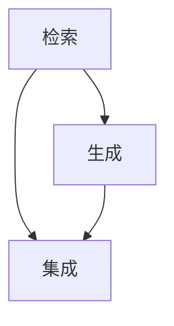

                 

### 文章标题：提高AI回答质量：Retrieval-Augmented Generation方法

### 关键词：
- AI回答质量
- Retrieval-Augmented Generation (RAG)
- 检索增强生成
- 自然语言处理
- 机器学习

### 摘要：
本文深入探讨了Retrieval-Augmented Generation（RAG）方法在提高AI回答质量方面的应用。首先，我们简要介绍了RAG方法的背景和基本概念，随后详细分析了RAG方法的架构和核心算法原理。接着，文章通过数学模型和公式，阐明了RAG方法的工作机制。在此基础上，文章展示了RAG方法在实践应用中的具体操作，并通过实际案例进行了深入剖析。最后，文章讨论了RAG方法的性能优化策略，并展望了其未来发展方向。通过本文，读者可以全面了解RAG方法在提高AI回答质量方面的潜力和应用前景。

### 1. 提取核心概念与联系

首先，我们需要明确本书的核心概念，并探讨它们之间的关系。Retrieval-Augmented Generation（RAG）是一种结合检索和生成技术的自然语言处理方法，旨在提高AI回答的质量。RAG方法的核心概念包括：

- **检索**：从大量文本数据中检索与用户查询最相关的信息片段。
- **生成**：利用检索到的信息片段生成高质量的回答。
- **集成**：将检索和生成过程结合起来，形成完整的RAG系统。

这些概念之间的关系可以概括为：检索用于获取背景信息，生成用于构建回答，而集成则是实现RAG方法的关键。

为了更好地理解RAG方法，我们可以使用Mermaid流程图来展示其基本架构：



在这个流程图中，A表示检索过程，B表示生成过程，C表示集成过程。检索和生成通过集成过程连接，形成一个完整的RAG系统。

### 2. RAG方法概述

#### 2.1 RAG基本概念

Retrieval-Augmented Generation（RAG）是一种自然语言处理技术，旨在通过检索和生成过程来提高AI回答的质量。RAG方法的核心思想是将检索到的相关文本数据作为生成高质量的回答的辅助信息。

在RAG方法中，检索是指从大量文本数据中找到与用户查询最相关的信息片段。生成则是指利用检索到的信息片段，通过自然语言生成模型生成高质量的回答。

#### 2.2 RAG架构详解

RAG方法的基本架构可以分为三个主要部分：检索、生成和集成。

1. **检索模块**：检索模块负责从大量文本数据中检索与用户查询最相关的信息片段。常见的检索算法包括TF-IDF、Word2Vec和BERT等。

2. **生成模块**：生成模块负责利用检索到的信息片段生成高质量的回答。生成模块通常采用预训练的生成模型，如GPT-3、T5等。

3. **集成模块**：集成模块负责将检索和生成过程结合起来，形成一个完整的RAG系统。集成模块通常采用注意力机制来协调检索和生成过程，以提高生成回答的质量。

#### 2.3 RAG在回答质量提升中的作用

RAG方法在回答质量提升方面具有显著的优势。首先，通过检索模块，RAG方法可以从大量文本数据中获取与用户查询相关的背景信息，这些信息可以丰富生成模块生成的回答内容。其次，生成模块利用预训练的生成模型，可以生成自然流畅且符合语义的答案。最后，集成模块通过协调检索和生成过程，可以确保生成的回答既具备丰富的内容，又保持高度的相关性和准确性。

#### 2.4 RAG与相关技术的比较

RAG方法与其他自然语言处理技术，如传统生成模型和检索增强生成模型（Recomb）等，具有一定的相似之处，但也存在明显的区别。

- **与传统生成模型**：传统生成模型（如GPT-3、T5等）主要通过大量文本数据预训练生成模型，生成高质量的回答。而RAG方法则通过检索模块获取背景信息，进一步丰富生成模块生成的回答内容。

- **与检索增强生成模型（Recomb）**：检索增强生成模型（Recomb）与RAG方法类似，都是通过检索和生成过程来提高AI回答的质量。但Recomb方法更侧重于将检索到的信息片段直接嵌入到生成模型中，而RAG方法则通过集成模块协调检索和生成过程，实现更高效的回答生成。

#### 2.5 RAG方法的挑战与未来发展方向

尽管RAG方法在回答质量提升方面具有显著优势，但其在实际应用中仍面临一些挑战。

1. **检索效率**：如何高效地从大量文本数据中检索与用户查询最相关的信息片段，是RAG方法需要解决的关键问题。未来的发展方向可能包括优化检索算法和引入多模态数据检索技术。

2. **生成质量**：如何生成高质量、符合语义的回答，是RAG方法需要持续改进的方面。未来的发展方向可能包括引入更多的预训练数据和改进生成模型。

3. **集成效果**：如何有效地协调检索和生成过程，实现高质量的回答生成，是RAG方法需要关注的重点。未来的发展方向可能包括引入更多的注意力机制和优化集成模块。

### 3. RAG方法的核心算法原理

#### 3.1 检索算法原理

在RAG方法中，检索算法负责从大量文本数据中检索与用户查询最相关的信息片段。常见的检索算法包括TF-IDF、Word2Vec和BERT等。

- **TF-IDF**：TF-IDF（Term Frequency-Inverse Document Frequency）是一种常用的文本检索算法，它通过计算词语在文档中的频率和文档集合中的逆文档频率来评估词语的重要性。具体公式如下：

  $$TF(t,d) = \frac{f_{t,d}}{f_{max,t,d}}$$
  
  $$IDF(t) = \log \frac{N}{df_{t}}$$

  $$TF-IDF(t,d) = TF(t,d) \times IDF(t)$$

  其中，$f_{t,d}$ 表示词语 $t$ 在文档 $d$ 中的频率，$f_{max,t,d}$ 表示词语 $t$ 在文档 $d$ 中的最大频率，$N$ 表示文档总数，$df_{t}$ 表示词语 $t$ 在文档集合中出现的文档频率。

- **Word2Vec**：Word2Vec是一种基于神经网络的语言模型，它通过将词语映射到高维空间中的向量来表示词语的语义。Word2Vec模型主要包括CBOW（Continuous Bag of Words）和Skip-Gram两种类型。

  - **CBOW**：CBOW模型通过将目标词语周围若干个词语的向量的平均作为目标词语的向量表示。具体公式如下：

    $$\vec{h}_{CBOW} = \frac{1}{K} \sum_{k=1}^{K} \vec{v}_{w_k}$$

    其中，$\vec{h}_{CBOW}$ 表示目标词语的向量表示，$K$ 表示周围词语的数量，$\vec{v}_{w_k}$ 表示词语 $w_k$ 的向量表示。

  - **Skip-Gram**：Skip-Gram模型通过将目标词语的向量表示为周围若干个词语的向量的加权和。具体公式如下：

    $$\vec{v}_{w} = \sum_{k=1}^{K} \vec{v}_{w_k}$$

    其中，$\vec{v}_{w}$ 表示目标词语的向量表示，$K$ 表示周围词语的数量，$\vec{v}_{w_k}$ 表示词语 $w_k$ 的向量表示。

- **BERT**：BERT（Bidirectional Encoder Representations from Transformers）是一种基于Transformer的预训练语言模型，它通过双向编码器对文本进行编码，生成词语的向量表示。BERT模型的核心思想是在预训练阶段利用大量无标注文本数据，通过 masked language modeling 和 next sentence prediction 两种任务来学习词语的语义表示。

#### 3.2 生成算法原理

在RAG方法中，生成算法负责利用检索到的信息片段生成高质量的回答。生成算法通常采用预训练的生成模型，如GPT-3、T5等。

- **GPT-3**：GPT-3（Generative Pre-trained Transformer 3）是一种基于Transformer的预训练语言模型，它通过在预训练阶段利用大量文本数据进行无监督学习，学习语言的生成规律。GPT-3具有非常强大的生成能力，可以生成自然流畅的文本。

  - **Transformer**：Transformer是一种基于自注意力机制的序列到序列模型，它通过计算序列中每个词与其他词之间的依赖关系来生成输出序列。

    - **自注意力机制**：自注意力机制是一种计算序列中每个词与其他词之间依赖关系的机制，它通过将每个词映射到一个高维空间，计算这些词之间的相似性，并加权求和得到每个词的表示。

- **T5**：T5（Text-To-Text Transfer Transformer）是一种基于Transformer的文本到文本的预训练模型，它通过在预训练阶段利用大量文本数据进行无监督学习，学习文本转换的规律。T5模型的核心思想是将文本转换任务转化为标准的前向传递和反向传播过程。

#### 3.3 检索与生成的整合

在RAG方法中，检索和生成过程需要通过集成模块进行整合，以生成高质量的回答。整合模块通常采用注意力机制来协调检索和生成过程。

- **注意力机制**：注意力机制是一种用于计算序列中每个词与其他词之间依赖关系的机制，它通过将每个词映射到一个高维空间，计算这些词之间的相似性，并加权求和得到每个词的表示。

  - **点积注意力**：点积注意力是一种简单的注意力机制，它通过计算两个向量的点积来评估它们之间的相似性。具体公式如下：

    $$\vec{h}_{attn} = \frac{\vec{q} \cdot \vec{k}}{\sqrt{d}}$$

    其中，$\vec{h}_{attn}$ 表示注意力权重，$\vec{q}$ 表示查询向量，$\vec{k}$ 表示关键向量，$d$ 表示向量的维度。

  - **加性注意力**：加性注意力是一种基于加法的注意力机制，它通过计算两个向量的加权和来评估它们之间的相似性。具体公式如下：

    $$\vec{h}_{attn} = \sigma(\vec{W}_Q \vec{k} + \vec{W}_K \vec{K})$$

    其中，$\vec{h}_{attn}$ 表示注意力权重，$\sigma$ 表示激活函数，$\vec{W}_Q$ 和 $\vec{W}_K$ 分别表示权重矩阵。

#### 3.4 伪代码详解

以下是一个简化的RAG方法的伪代码，用于说明检索、生成和整合过程：

```python
# 检索过程
def retrieval(query, corpus):
    # 使用检索算法（如TF-IDF、Word2Vec或BERT）从corpus中检索与query最相关的信息片段
    # 返回检索结果列表
    return retrieval_results

# 生成过程
def generation(retrieval_results):
    # 使用生成模型（如GPT-3或T5）生成高质量回答
    # 返回生成的回答
    return generated_answer

# 集成过程
def integration(query, retrieval_results):
    # 使用注意力机制整合检索和生成过程
    # 返回整合后的回答
    return integrated_answer

# 主函数
def RAG(query, corpus):
    retrieval_results = retrieval(query, corpus)
    generated_answer = generation(retrieval_results)
    integrated_answer = integration(query, retrieval_results)
    return integrated_answer
```

### 4. 数学模型和公式讲解

在RAG方法中，数学模型和公式用于描述检索、生成和整合过程。以下是对这些模型和公式的详细讲解。

#### 4.1 检索相关数学模型

检索过程主要涉及词嵌入和检索算法的数学模型。

- **词嵌入**：词嵌入是将词语映射到高维空间中的向量表示。常见的词嵌入方法包括Word2Vec和BERT。

  - **Word2Vec词嵌入**：
    - **CBOW模型**：
      $$\vec{h}_{CBOW} = \frac{1}{K} \sum_{k=1}^{K} \vec{v}_{w_k}$$
      
      其中，$\vec{h}_{CBOW}$ 表示目标词语的向量表示，$K$ 表示周围词语的数量，$\vec{v}_{w_k}$ 表示词语 $w_k$ 的向量表示。
      
    - **Skip-Gram模型**：
      $$\vec{v}_{w} = \sum_{k=1}^{K} \vec{v}_{w_k}$$
      
      其中，$\vec{v}_{w}$ 表示目标词语的向量表示，$K$ 表示周围词语的数量，$\vec{v}_{w_k}$ 表示词语 $w_k$ 的向量表示。
      
  - **BERT词嵌入**：
    $$\vec{v}_{word} = \vec{W}_E \vec{pos} + \vec{W}_L \vec{segment} + \vec{v}_0$$
    
    其中，$\vec{v}_{word}$ 表示词语的向量表示，$\vec{W}_E$ 和 $\vec{W}_L$ 分别表示词权重矩阵和句子权重矩阵，$\vec{pos}$ 表示位置嵌入，$\vec{segment}$ 表示分词嵌入，$\vec{v}_0$ 表示偏置向量。

- **检索算法**：常见的检索算法包括TF-IDF和BERT检索。

  - **TF-IDF检索**：
    $$TF(t,d) = \frac{f_{t,d}}{f_{max,t,d}}$$
    
    $$IDF(t) = \log \frac{N}{df_{t}}$$
    
    $$TF-IDF(t,d) = TF(t,d) \times IDF(t)$$
    
    其中，$f_{t,d}$ 表示词语 $t$ 在文档 $d$ 中的频率，$f_{max,t,d}$ 表示词语 $t$ 在文档 $d$ 中的最大频率，$N$ 表示文档总数，$df_{t}$ 表示词语 $t$ 在文档集合中出现的文档频率。

  - **BERT检索**：
    $$\vec{r}_{d} = \vec{W}_{K} \vec{v}_{query} + \vec{b}$$
    
    其中，$\vec{r}_{d}$ 表示文档 $d$ 的检索分数，$\vec{W}_{K}$ 表示权重矩阵，$\vec{v}_{query}$ 表示查询向

