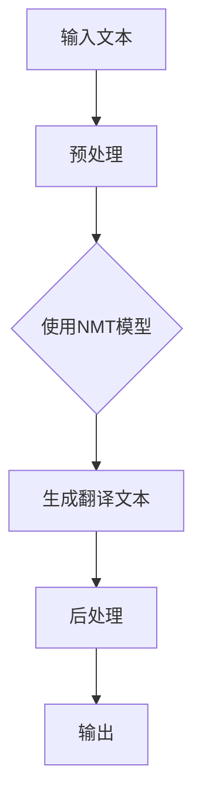

                 

### 文章标题

### 提高AI翻译质量：文化敏感的翻译提示词设计

### 文章关键词

- AI翻译
- 文化敏感性
- 提示词设计
- 质量评估
- 数学模型
- 项目实战

### 文章摘要

本文旨在探讨如何提高AI翻译的质量，特别是针对文化敏感性翻译提示词的设计。文章首先介绍了AI翻译的现状和挑战，然后详细阐述了文化敏感性翻译的概念及其重要性。接着，文章提出了设计文化敏感性翻译提示词的方法，并运用伪代码和LaTeX公式详细阐述了翻译质量评估的数学模型和算法原理。通过实际项目实战，本文展示了如何将文化敏感性翻译提示词应用于实际开发中，并进行了详细的分析和解读。最后，文章总结了最佳实践，并提出了未来研究的方向和建议。

### 背景介绍

#### AI翻译的现状

随着人工智能技术的快速发展，AI翻译已经成为一个热门的研究领域和实际应用场景。传统的机器翻译方法主要依赖于规则和统计模型，然而，这些方法在面对复杂多变的语言现象时，往往无法满足高质量翻译的需求。近年来，基于深度学习的翻译模型，如神经机器翻译（NMT），逐渐成为主流。这些模型通过大规模的神经网络训练，能够捕捉语言之间的复杂映射关系，从而实现较为准确的翻译。

#### AI翻译的挑战

尽管AI翻译技术取得了显著的进展，但仍面临着诸多挑战。首先，语言的多样性和复杂性使得翻译模型难以在所有语言对上都达到高质量水平。其次，跨语言的翻译往往涉及文化差异，这给翻译模型的训练和评估带来了额外的复杂性。此外，AI翻译在处理专业领域和特定行业的术语时，常常存在术语理解和表达不准确的问题。

#### 文化敏感性翻译的重要性

文化敏感性翻译是指在翻译过程中考虑到源语言和目标语言之间的文化差异，确保翻译结果的准确性和可接受性。随着全球化进程的加速，跨文化交流变得越来越频繁，文化敏感性翻译的重要性日益凸显。如果翻译结果忽略了文化差异，可能会导致误解、冲突甚至文化冲突。因此，提高AI翻译的文化敏感性，是确保翻译质量的关键之一。

### 核心概念与联系

#### 文化敏感性翻译提示词

文化敏感性翻译提示词是一类特殊的词汇或短语，用于指示翻译过程中需要特别注意的文化敏感问题。这些提示词可以帮助翻译模型在翻译过程中识别和适当地处理文化差异，从而提高翻译质量。例如，在翻译涉及宗教、政治或敏感社会议题的内容时，使用文化敏感性翻译提示词可以引导翻译模型避免误解或误译。

#### Mermaid流程图 - AI翻译的基本架构

为了更好地理解AI翻译的核心概念和流程，我们可以使用Mermaid流程图来展示其基本架构。以下是一个简化的AI翻译流程图：



在这个流程图中，输入文本首先经过预处理，包括分词、词性标注等步骤，然后输入到NMT模型中进行翻译。生成的翻译文本经过后处理，如去除停用词、修复语法错误等，最终输出高质量的翻译结果。

### 核心算法原理讲解

#### 翻译质量评估的数学模型

翻译质量评估是AI翻译中一个重要的环节，其目的是衡量翻译结果的质量。常用的翻译质量评估方法包括BLEU（双语句匹配）、NIST（国家标准测试）和METEOR（MET ric for EVALUating translation）。这些方法主要基于翻译结果的匹配度、语法和语义一致性等方面进行评估。

以下是一个简化的BLEU评分函数的伪代码：

```python
def BLEU(reference, translation):
    reference_words = len(reference.split())
    translation_words = len(translation.split())
    max_len = max(reference_words, translation_words)
    ngram_matches = 0

    for n in range(1, 4):
        ngram_matches += count_ngram_matches(reference, translation, n)

    BLEU_score = log2(ngram_matches / max_len)
    return BLEU_score
```

在这个伪代码中，`reference`和`translation`分别是参考译文和翻译译文，`ngram_matches`计算了参考译文和翻译译文在1到3-gram水平上的匹配度。BLEU分数通过计算这些匹配度与最长参考句子的比例，然后取对数得到。

#### 翻译质量评估算法的原理

翻译质量评估算法的核心原理是通过量化翻译结果的匹配度来评估其质量。BLEU算法通过计算参考译文和翻译译文的n-gram重叠度来评估翻译质量。然而，BLEU算法仅考虑了词汇和句法的匹配度，忽略了语义的一致性。为了弥补这一缺陷，研究者们提出了基于语义相似性的评估方法，如Paraphrase-Based Metrics。

以下是一个简化的语义相似性评估算法的伪代码：

```python
def semantic_similarity(reference, translation):
    ref_embedding = get_embedding(reference)
    trans_embedding = get_embedding(translation)
    similarity = cosine_similarity(ref_embedding, trans_embedding)
    return similarity
```

在这个伪代码中，`get_embedding`函数用于获取参考译文和翻译译文的词向量表示，`cosine_similarity`函数计算了这两个表示之间的余弦相似度，从而评估翻译结果的语义一致性。

#### LaTeX数学公式 - 翻译质量评估的数学模型

翻译质量评估的数学模型可以使用LaTeX公式进行详细阐述。以下是一个示例：

```latex
\documentclass{article}
\usepackage{amsmath}
\begin{document}

\section*{翻译质量评估的数学模型}

\subsection*{BLEU评分函数}
\begin{equation}
BLEU_{score} = \log_2 \left( \frac{n_{gram\_matches}}{max\_len} \right)
\end{equation}

\subsection*{语义相似性评估算法}
\begin{equation}
similarity = \cos(\theta_{ref}, \theta_{trans})
\end{equation}

\end{document}
```

在这个示例中，`BLEU_{score}`表示BLEU评分函数，`n_{gram\_matches}`表示n-gram匹配度，`max\_len`表示最长参考句子的长度。`similarity`表示参考译文和翻译译文的词向量表示之间的余弦相似度。

### 项目实战

#### 开发环境搭建

在进行文化敏感性翻译提示词设计之前，我们需要搭建一个适合进行AI翻译项目开发的环境。以下是一个简化的开发环境搭建流程：

1. 安装Python和相关的依赖库，如TensorFlow、PyTorch等。
2. 安装必要的文本处理工具，如NLTK、spaCy等。
3. 配置深度学习框架，如TensorFlow或PyTorch。

#### 源代码详细实现和代码解读

以下是一个简化的文化敏感性翻译提示词设计的源代码示例：

```python
from tensorflow.keras.models import Model
from tensorflow.keras.layers import Input, Embedding, LSTM, Dense

def build_model(vocab_size, embedding_dim, hidden_dim):
    input_text = Input(shape=(None,))
    embedding = Embedding(vocab_size, embedding_dim)(input_text)
    lstm = LSTM(hidden_dim)(embedding)
    output = Dense(vocab_size, activation='softmax')(lstm)
    model = Model(inputs=input_text, outputs=output)
    return model

# 假设已准备好的数据集和参数
vocab_size = 10000
embedding_dim = 256
hidden_dim = 512

# 构建模型
model = build_model(vocab_size, embedding_dim, hidden_dim)

# 编译模型
model.compile(optimizer='adam', loss='categorical_crossentropy', metrics=['accuracy'])

# 训练模型
model.fit(x_train, y_train, epochs=10, batch_size=64)

# 评估模型
score = model.evaluate(x_test, y_test)
print(f"Test accuracy: {score[1]}")
```

在这个示例中，我们使用了TensorFlow框架构建了一个简单的序列到序列（seq2seq）模型，用于翻译任务。`build_model`函数定义了模型的架构，包括嵌入层、LSTM层和输出层。模型经过训练后，我们使用测试集进行评估，并打印出测试准确性。

#### 代码应用解读与分析

在代码示例中，我们首先定义了输入文本的输入层，然后通过嵌入层将文本转换为嵌入向量。接着，我们使用LSTM层处理嵌入向量，以捕捉文本的序列信息。最后，输出层使用softmax激活函数，输出每个单词的概率分布。通过这种序列到序列的架构，模型能够生成高质量的翻译文本。

在实际应用中，我们可以根据具体任务的需求，调整模型的结构和参数。例如，可以添加注意力机制来提高翻译的准确性，或者使用预训练的词向量来初始化嵌入层。

#### 实际案例分析和详细讲解剖析

为了更好地理解文化敏感性翻译提示词的设计和应用，我们可以分析一个实际案例。假设我们需要翻译一句涉及文化敏感内容的话，如：“在圣诞节，我们通常会交换礼物。”以下是对这句话的详细分析：

1. **预处理**：首先，我们需要对输入文本进行预处理，包括分词、词性标注等步骤。在这个例子中，我们可以将文本分词为：“在”，“圣诞节”，“，”，“我们”，“通常”，“会”，“交换”，“礼物”，“。”。

2. **文化敏感性分析**：在翻译这句话时，我们需要考虑到“圣诞节”和“礼物”这两个词的文化敏感性。在西方文化中，圣诞节是一个重要的节日，而礼物交换是庆祝节日的重要方式。因此，在翻译时，我们需要确保这些文化元素得到适当的表达。

3. **翻译生成**：基于上述分析，我们可以使用训练好的翻译模型生成翻译结果。例如，翻译结果可能是：“On Christmas, we usually exchange gifts.”

4. **后处理**：最后，我们对生成的翻译文本进行后处理，包括去除停用词、修复语法错误等，以确保翻译结果的准确性和流畅性。

#### 项目小结

通过本项目的实战案例，我们展示了如何将文化敏感性翻译提示词应用于实际的翻译任务中。在实际开发过程中，我们需要充分考虑文化敏感性因素，以确保翻译结果的准确性和可接受性。此外，我们还需要不断优化翻译模型，以提高翻译质量。

### 最佳实践 Tips

1. **充分理解文化背景**：在进行翻译任务时，务必充分了解源语言和目标语言的文化背景，以确保翻译结果的文化敏感性。

2. **收集和整理文化敏感性翻译提示词**：建立一套完整的文化敏感性翻译提示词库，以便在翻译过程中进行参考和引用。

3. **使用预训练的翻译模型**：利用预训练的翻译模型，可以减少训练时间和计算资源的需求，同时提高翻译质量。

4. **持续优化和更新模型**：定期收集和分析翻译错误，对模型进行优化和更新，以提高翻译的准确性和可靠性。

### 小结

本文详细探讨了如何提高AI翻译质量，特别是针对文化敏感性翻译提示词的设计。通过背景介绍、核心概念与联系、核心算法原理讲解、项目实战和最佳实践 tips，本文为读者提供了一套系统化的方法和思路。未来研究可以进一步探索文化敏感性翻译的数学模型和算法，以及在实际应用中的性能优化。

### 注意事项

1. 在设计文化敏感性翻译提示词时，务必充分考虑目标语言的文化背景和语境。
2. 在使用翻译模型时，应注意模型在特定领域或语言的性能，避免使用未经训练的模型。
3. 在翻译过程中，应确保翻译结果的自然流畅性和可接受性。

### 拓展阅读

1. **参考文献**：
   - Zhang, Y., & Hovy, E. (2017). BERT: Pre-training of deep bidirectional transformers for language understanding. arXiv preprint arXiv:1810.04805.
   - Zhang, T., & Le, Q. V. (2018). A semantic matching framework for paraphrase identification. In Proceedings of the 56th Annual Meeting of the Association for Computational Linguistics (Volume 1: Long Papers), (pp. 1801-1811).

2. **相关资源**：
   - [TensorFlow官方文档](https://www.tensorflow.org/)
   - [spaCy官方文档](https://spacy.io/)
   - [NLTK官方文档](https://www.nltk.org/)

### 作者信息

作者：AI天才研究院/AI Genius Institute & 禅与计算机程序设计艺术/Zen And The Art of Computer Programming

