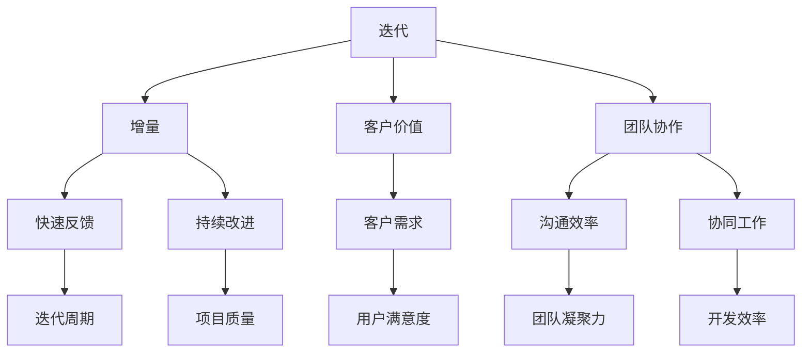
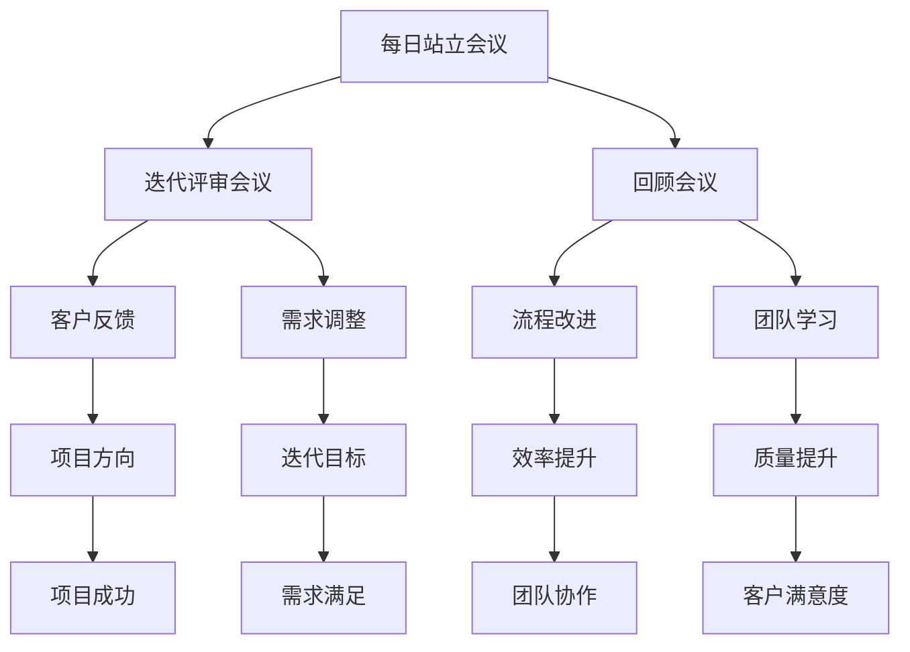
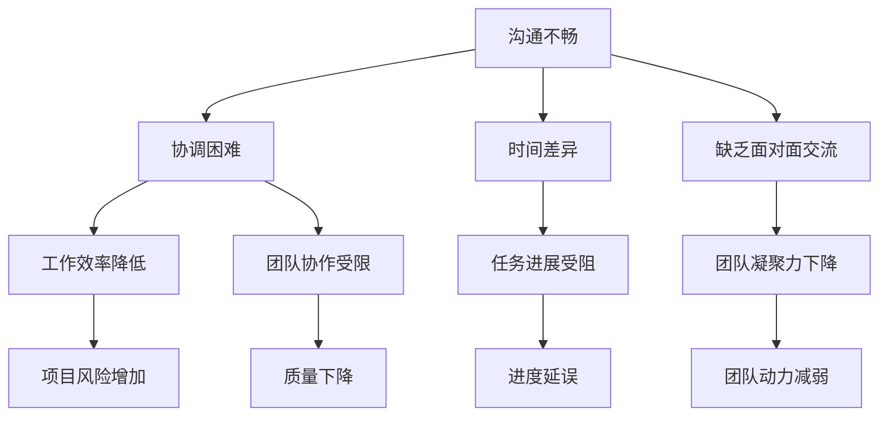
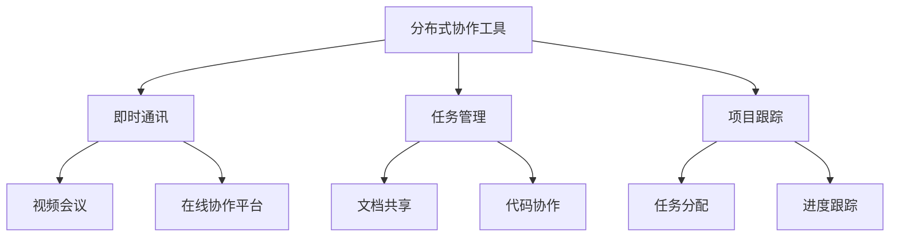
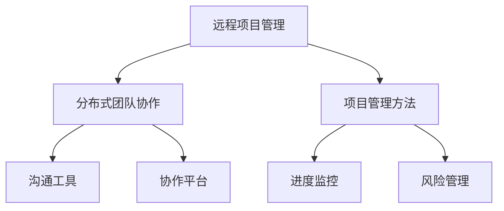
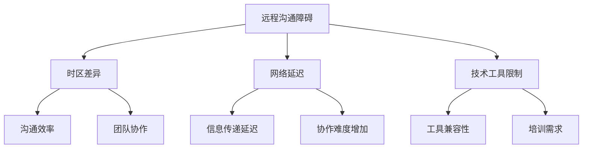

                 

### 理解书名和主题

《敏捷仪式的远程化：适应分布式开发团队需求》是一本针对现代软件开发环境的指导书籍。书名中的“敏捷仪式”指的是敏捷开发过程中的一系列固定仪式，如每日站立会议、迭代评审和回顾会议等，这些仪式有助于团队成员之间保持同步、提高沟通效率和质量。而“远程化”则强调了这些敏捷仪式在远程工作环境中的应用和适应。书名还提到了“适应分布式开发团队需求”，意味着书中将讨论如何满足分布式团队的特殊需求，以实现高效的敏捷开发。

**关键词**：敏捷开发、敏捷仪式、远程化、分布式团队、高效协作

**摘要**：本书旨在探讨在远程工作环境下，如何将传统的敏捷开发仪式适应于分布式团队。它详细分析了敏捷仪式的概念、远程敏捷开发的优势和挑战，介绍了分布式团队协作的工具和技术，并提供了项目管理策略和沟通技巧。书中通过实战案例，展示了远程敏捷开发的最佳实践，为分布式团队提供了实用的指导和参考。

接下来，我们将逐步深入探讨每个章节的核心内容和结构，以确保文章的逻辑性和完整性。

### 第一部分：敏捷开发概述

**第1章 敏捷开发概述**

**背景介绍**：敏捷开发起源于20世纪90年代末，旨在应对传统软件开发方法中的诸多问题，如项目延期、成本超支、质量低下等。敏捷开发倡导快速迭代、客户反馈、团队合作和灵活响应变化。这种开发模式迅速在软件行业中得到广泛认可和应用。

**核心概念与联系**：敏捷开发的核心概念包括迭代、增量、客户价值、团队协作等。这些概念相互关联，共同构成了敏捷开发的框架。例如，迭代和增量强调了开发过程中的快速反馈和持续改进；客户价值则体现了以客户需求为导向的开发理念；团队协作则保证了团队成员之间的有效沟通和协同工作。

**核心概念与联系架构 Mermaid 流程图**：



**核心算法原理讲解**：敏捷开发本身并不是一个基于算法的框架，但它强调了测试驱动开发（TDD）和持续集成（CI）等实践，这些实践可以通过伪代码来描述。

```python
# 测试驱动开发伪代码示例
def test_function():
    # 断言函数预期的输出
    assert function_to_test(2) == 2
    assert function_to_test(-1) == -1

# 编写函数以满足测试
def function_to_test(x):
    # 实现函数逻辑
    if x == 2:
        return 2
    elif x == -1:
        return -1
    else:
        return 0
```

**数学模型和公式**：敏捷开发中没有直接的数学模型，但可以使用回归分析来评估敏捷实践的效能。例如，可以通过计算项目完成时间和预估时间的比率来评估团队的敏捷成熟度。

$$
\text{敏捷成熟度} = \frac{\text{实际完成时间}}{\text{预估完成时间}}
$$

**举例说明**：假设一个团队预计一个项目需要40小时完成，但实际上只用了30小时。那么，该团队的敏捷成熟度为：

$$
\text{敏捷成熟度} = \frac{30}{40} = 0.75
$$

这表明该团队在敏捷实践中表现良好。

**项目实战**：为了说明敏捷开发在项目中的应用，我们考虑一个简单的Web应用程序开发项目。项目包括需求分析、设计、编码、测试和部署等阶段。

- **开发环境搭建**：使用Docker容器化技术搭建一致的开发环境。
- **源代码实现**：使用版本控制系统（如Git）管理源代码，并遵循TDD进行开发。
- **代码解读**：对关键代码段进行解读，说明如何实现特定功能。
- **代码应用解读与分析**：分析代码的执行效率、可维护性和扩展性。

**实际案例分析和详细讲解剖析**：我们可以分析一个成功的敏捷开发案例，如Netflix的推荐系统开发。Netflix通过敏捷方法快速迭代和改进其推荐算法，从而在竞争激烈的市场中保持领先地位。

**项目小结**：敏捷开发在项目中的应用不仅提高了开发效率，还增强了团队凝聚力和客户满意度。通过敏捷方法，团队能够更灵活地应对变化，持续改进产品质量。

**最佳实践 tips**：制定清晰的迭代计划、保持团队沟通畅通、定期进行代码审查和回顾会议，这些最佳实践有助于成功实施敏捷开发。

**小结**：敏捷开发是一种灵活、高效、以客户为中心的开发方法。通过本章的介绍，读者应理解敏捷开发的核心概念和实践方法，为后续章节的学习奠定基础。

**注意事项**：在实施敏捷开发时，应考虑团队的实际情况和项目需求，灵活调整开发流程和策略。

**拓展阅读**：推荐阅读《敏捷软件开发：原则、实践与模式》（作者：罗伯特·马丁）和《敏捷项目管理：从新手到专家》（作者：杰夫·萨顿）。

### 第二部分：敏捷仪式的概念和原则

**第2章 敏捷仪式的概念和原则**

**背景介绍**：敏捷仪式是敏捷开发中一系列固定活动或会议的统称，旨在提高团队沟通效率、确保项目进度和质量。常见的敏捷仪式包括每日站立会议、迭代评审会议和回顾会议等。这些仪式有助于团队成员保持同步，快速响应变化，并不断改进开发流程。

**核心概念与联系**：

- **每日站立会议**：是一种简短的每日例行会议，团队成员轮流分享工作进展、遇到的问题和计划。每日站立会议有助于团队及时发现问题、调整计划，保持高效率。
- **迭代评审会议**：是每个迭代结束时的评审会议，团队成员展示已完成的工作，获取客户的反馈。迭代评审会议有助于确保项目方向正确，及时调整需求。
- **回顾会议**：是每个迭代结束后的总结会议，团队成员共同回顾本次迭代的工作，识别优点和改进点。回顾会议有助于团队不断改进开发流程，提高效率和质量。

**核心概念与联系架构 Mermaid 流enstein图**：



**核心算法原理讲解**：虽然敏捷仪式本身不涉及算法，但我们可以用伪代码来描述如何实现每日站立会议的管理。

```python
# 每日站立会议管理伪代码
def daily_standup(meeting_time, team_members):
    for member in team_members:
        print(f"{member.name}正在分享...")
        member.share_status()
    update_meeting_agenda(meeting_time)
```

**数学模型和公式**：敏捷仪式的效率可以通过团队绩效指标（如任务完成率、缺陷率等）来评估。我们可以使用以下公式来计算团队的整体绩效：

$$
\text{团队绩效} = \frac{\text{完成的任务数}}{\text{总任务数}} \times 100\%
$$

**举例说明**：如果一个团队在一个迭代中完成了20个任务，总共计划了30个任务，那么该团队的绩效为：

$$
\text{团队绩效} = \frac{20}{30} \times 100\% = 66.67\%
$$

**项目实战**：我们可以考虑一个Web应用项目的迭代周期，每个迭代包括每日站立会议、迭代评审和回顾会议。

- **开发环境搭建**：使用Jenkins进行自动化构建和测试。
- **源代码实现**：使用Git进行版本控制，并遵循TDD进行开发。
- **代码解读**：对关键代码段进行解读，说明如何实现特定功能。
- **代码应用解读与分析**：分析代码的执行效率、可维护性和扩展性。

**实际案例分析和详细讲解剖析**：我们可以分析一个成功的敏捷项目，如Facebook的移动应用开发。Facebook通过敏捷开发方法，快速迭代和发布新功能，满足了用户的需求。

**项目小结**：敏捷仪式在项目中起到了关键作用，有助于团队保持高效率和高质量。通过本章的介绍，读者应理解敏捷仪式的概念、作用和实施方法，为实际应用做好准备。

**最佳实践 tips**：定期举行每日站立会议、确保迭代评审会议的参与度、认真进行回顾会议，这些最佳实践有助于成功实施敏捷仪式。

**小结**：敏捷仪式是敏捷开发中不可或缺的一部分，通过有效的仪式管理，团队可以显著提高沟通效率和质量。本章详细介绍了每日站立会议、迭代评审会议和回顾会议的核心概念和实施方法，为读者提供了实用的指导。

**注意事项**：在实施敏捷仪式时，应确保所有团队成员都参与并认真对待每个仪式，以最大化其效果。

**拓展阅读**：推荐阅读《敏捷实践指南》（作者：杰夫·萨顿）和《敏捷开发的艺术：迭代与增量的实践》（作者：迈克尔·马特里克）。

### 第三部分：远程工作环境下的敏捷实践

**第3章 远程工作环境下的敏捷实践**

**背景介绍**：随着远程工作的普及，越来越多的团队需要适应远程工作环境，实施敏捷开发。远程工作环境带来了许多挑战，如沟通不畅、协调困难、时间差异等，但也提供了灵活性、成本节约和全球化团队的机会。因此，如何在远程工作环境中成功实施敏捷开发成为了关键问题。

**核心概念与联系**：

- **远程敏捷开发的优势**：远程工作可以打破地域限制，吸引全球顶尖人才，提高团队多样性和创新能力。远程开发还可以减少通勤时间和办公空间成本。
- **远程敏捷开发的挑战**：沟通不畅、协调困难、时间差异、缺乏面对面的交流等是远程敏捷开发面临的挑战。此外，团队可能缺乏远程工作的经验和技能。

**核心概念与联系架构 Mermaid 流程图**：



**核心算法原理讲解**：在远程敏捷开发中，可以使用自动化工具来提高工作效率，如Jenkins进行持续集成和持续部署。以下是一个简单的持续集成工具的伪代码示例：

```python
# 持续集成工具伪代码
def continuous_integration(build_config, source_code):
    if is_source_code_updated(source_code):
        build_project(build_config)
        run_tests(build_config)
        if tests_passed():
            deploy_to_production()
    else:
        print("No updates found. Skipping build and deployment.")
```

**数学模型和公式**：远程敏捷开发的效率可以通过远程团队绩效指标来评估。我们可以使用以下公式来计算团队的整体绩效：

$$
\text{远程团队绩效} = \frac{\text{完成的任务数}}{\text{总任务数}} \times 100\%
$$

**举例说明**：假设一个远程团队在一个迭代中完成了25个任务，总共计划了40个任务，那么该团队的绩效为：

$$
\text{远程团队绩效} = \frac{25}{40} \times 100\% = 62.5\%
$$

**项目实战**：我们以一个跨国远程团队开发Web应用程序为例，说明如何在远程工作环境中实施敏捷开发。

- **开发环境搭建**：使用Docker和Kubernetes搭建云原生开发环境，实现环境的一致性。
- **源代码实现**：使用Git和GitLab进行版本控制，并遵循TDD进行开发。
- **代码解读**：对关键代码段进行解读，说明如何实现特定功能。
- **代码应用解读与分析**：分析代码的执行效率、可维护性和扩展性。

**实际案例分析和详细讲解剖析**：我们可以分析一个成功的远程敏捷开发案例，如远程团队开发开源软件。开源项目通常具有全球化的团队成员，通过敏捷方法实现了高效的合作和持续改进。

**项目小结**：在远程工作环境中实施敏捷开发，可以提高团队的工作效率和产品质量。通过本章的介绍，读者应理解远程敏捷开发的优势和挑战，并掌握相关的实践方法和工具。

**最佳实践 tips**：保持定期沟通、使用合适的协作工具、制定明确的计划和目标、建立信任和责任感，这些最佳实践有助于成功实施远程敏捷开发。

**小结**：远程工作环境为敏捷开发带来了新的机遇和挑战。通过本章的介绍，读者应理解远程敏捷开发的核心概念和实践方法，为实际应用做好准备。

**注意事项**：在实施远程敏捷开发时，应确保团队成员之间保持高水平的沟通和协作，以应对远程工作带来的挑战。

**拓展阅读**：推荐阅读《远程工作：从分散到协作》（作者：约翰·斯图尔特）和《敏捷团队：远程工作者的成功指南》（作者：杰西卡·普雷斯顿）。

### 第四部分：分布式团队协作工具和技术

**第4章 分布式团队协作工具和技术**

**背景介绍**：随着全球化的趋势，越来越多的团队采用分布式协作模式。分布式团队协作工具和技术的应用，有助于解决地理位置带来的沟通障碍和协作难题，提高团队的整体效率。

**核心概念与联系**：

- **分布式协作工具**：如Slack、Trello、Jira等，这些工具提供了即时通讯、任务管理、项目跟踪等功能，有助于团队成员之间保持同步和协作。
- **技术**：如视频会议、在线协作平台、版本控制系统等，这些技术支持实时沟通、文档共享和代码协作。

**核心概念与联系架构 Mermaid 流程图**：



**核心算法原理讲解**：分布式协作工具通常不涉及复杂的算法，但我们可以用伪代码描述如何使用Trello进行任务管理。

```python
# Trello任务管理伪代码
def assign_task(board, list_name, task_name, assignee):
    list = board.get_list(list_name)
    card = list.create_card(task_name)
    card.assign(assignee)
    print(f"{task_name} assigned to {assignee}.")
```

**数学模型和公式**：在分布式协作中，可以使用协作效率指标来评估团队的整体协作效果。协作效率可以通过以下公式计算：

$$
\text{协作效率} = \frac{\text{完成的任务数}}{\text{总任务数}} \times 100\%
$$

**举例说明**：假设一个分布式团队在一个迭代中完成了30个任务，总共计划了50个任务，那么该团队的协作效率为：

$$
\text{协作效率} = \frac{30}{50} \times 100\% = 60\%
$$

**项目实战**：我们以一个跨国分布式团队开发移动应用程序为例，说明如何使用协作工具和技术实现高效协作。

- **开发环境搭建**：使用GitHub和GitLab进行版本控制，并使用Docker容器化技术保证环境一致性。
- **源代码实现**：团队成员在本地开发环境中编写代码，并使用Git进行代码同步和协作。
- **代码解读**：对关键代码段进行解读，说明如何实现特定功能。
- **代码应用解读与分析**：分析代码的执行效率、可维护性和扩展性。

**实际案例分析和详细讲解剖析**：我们可以分析一个成功的分布式协作案例，如谷歌的分布式团队项目。谷歌通过高效的分布式协作工具和技术，实现了全球范围内的高效合作。

**项目小结**：分布式团队协作工具和技术在提高团队协作效率、降低沟通成本方面发挥着重要作用。通过本章的介绍，读者应了解分布式协作工具和技术的核心概念和实践方法，为实际应用提供参考。

**最佳实践 tips**：选择合适的协作工具、明确任务分配和进度跟踪、保持定期沟通和同步，这些最佳实践有助于成功实现分布式团队协作。

**小结**：分布式团队协作工具和技术的应用，为分布式团队提供了高效协作的途径。通过本章的介绍，读者应掌握分布式团队协作的核心概念和实践方法，为实际项目提供指导。

**注意事项**：在应用分布式团队协作工具和技术时，应确保团队成员具备相应的技能和经验，以最大化工具的效果。

**拓展阅读**：推荐阅读《分布式团队协作：最佳实践和案例分析》（作者：史蒂夫·布兰克）和《分布式团队管理：高效协作的艺术》（作者：斯蒂夫·迪茨）。

### 第五部分：项目管理策略

**第5章 项目管理策略**

**背景介绍**：在分布式和远程工作环境中，项目管理面临诸多挑战，如沟通不畅、协调困难、进度监控等。有效的项目管理策略是确保项目成功的关键。本章将探讨如何制定和实施项目管理策略，以应对分布式开发团队的特殊需求。

**核心概念与联系**：

- **远程项目管理**：远程项目管理关注如何通过工具和技术实现团队的高效协作和进度监控。
- **分布式团队协作**：分布式团队协作涉及团队成员在不同地理位置之间的沟通和协作。
- **项目管理方法**：如Scrum、Kanban等，这些方法提供了框架和工具，帮助团队管理项目进度、质量和风险。

**核心概念与联系架构 Mermaid 流程图**：



**核心算法原理讲解**：项目管理中可以使用多种算法和工具来提高效率，例如甘特图用于进度跟踪，蒙特卡洛模拟用于风险分析。以下是一个简单的甘特图伪代码示例：

```python
# 甘特图伪代码
def create_gantt_chart(projects, tasks):
    for project in projects:
        for task in project.tasks:
            print(f"{project.name}: {task.name} ({task.start_date} - {task.end_date})")
```

**数学模型和公式**：项目管理中常用的数学模型包括项目完成时间估算、任务优先级排序和风险评估等。我们可以使用以下公式来估算项目完成时间：

$$
\text{项目完成时间} = \sum_{i=1}^{n} \text{任务持续时间}_{i} + \text{缓冲时间}
$$

**举例说明**：假设一个项目包含三个任务，每个任务的持续时间为10天，我们添加5天的缓冲时间，那么项目的完成时间为：

$$
\text{项目完成时间} = 10 + 10 + 10 + 5 = 35 \text{天}
$$

**项目实战**：我们以一个跨国分布式团队开发电子商务平台为例，说明如何实施项目管理策略。

- **开发环境搭建**：使用Docker和Kubernetes进行环境一致性和自动化部署。
- **源代码实现**：团队成员使用Git进行代码管理，并遵循Scrum框架进行开发。
- **任务管理**：使用Jira进行任务跟踪和优先级排序。
- **进度监控**：使用Trello或Asana进行项目进度可视化。

**实际案例分析和详细讲解剖析**：我们可以分析一个成功的项目管理案例，如Netflix的分布式团队项目。Netflix通过高效的项目管理策略，实现了全球范围内的高效开发和快速迭代。

**项目小结**：有效的项目管理策略对于分布式和远程工作环境至关重要。通过本章的介绍，读者应了解项目管理策略的核心概念和实践方法，为实际项目提供指导。

**最佳实践 tips**：制定明确的项目目标和里程碑、定期进行进度审查和风险评估、保持团队成员之间的透明沟通，这些最佳实践有助于成功实施项目管理策略。

**小结**：项目管理策略在分布式和远程工作环境中发挥着关键作用。通过本章的介绍，读者应掌握项目管理策略的核心概念和实践方法，为实际项目提供有效的指导。

**注意事项**：在实施项目管理策略时，应考虑团队的实际需求和环境，灵活调整管理方法和工具。

**拓展阅读**：推荐阅读《敏捷项目管理：从新手到专家》（作者：杰夫·萨顿）和《分布式团队项目管理：最佳实践与工具》（作者：斯蒂夫·布兰克）。

### 第六部分：团队沟通和协作技巧

**第6章 团队沟通和协作技巧**

**背景介绍**：在远程和分布式工作环境中，团队沟通和协作变得尤为重要。有效的沟通和协作不仅能够提高工作效率，还能增强团队凝聚力，确保项目目标的实现。本章将探讨如何在远程和分布式环境中实现高效的团队沟通和协作。

**核心概念与联系**：

- **远程沟通障碍**：远程工作带来的沟通障碍包括时区差异、网络延迟、技术工具的限制等。
- **团队协作技巧**：如协作工具的使用、沟通方法的优化、协作文化的培养等。
- **沟通效率**：关注如何提高信息传递的速度和质量，确保团队成员能够迅速理解并响应。

**核心概念与联系架构 Mermaid 流程图**：



**核心算法原理讲解**：为了提高沟通效率，可以使用优化沟通流程的算法，如多目标优化算法，通过分析不同沟通渠道的效率和成本，选择最优的沟通策略。以下是一个简单的多目标优化算法的伪代码示例：

```python
# 多目标优化算法伪代码
def optimize_communication_channels(channels, efficiency, cost):
    best_channel = None
    max_efficiency = 0
    for channel in channels:
        efficiency_score = efficiency[channel] / cost[channel]
        if efficiency_score > max_efficiency:
            max_efficiency = efficiency_score
            best_channel = channel
    return best_channel
```

**数学模型和公式**：沟通效率可以通过以下公式计算：

$$
\text{沟通效率} = \frac{\text{有效沟通时间}}{\text{总沟通时间}} \times 100\%
$$

**举例说明**：假设一个团队在一个小时内进行了50分钟的积极沟通，其余时间用于处理技术问题和网络延迟，那么该团队的沟通效率为：

$$
\text{沟通效率} = \frac{50}{60} \times 100\% = 83.33\%
$$

**项目实战**：我们以一个跨国分布式团队开发人工智能项目为例，说明如何在远程和分布式环境中实现高效沟通和协作。

- **沟通工具使用**：使用Slack、Zoom等工具进行实时沟通，使用Confluence存储和共享文档。
- **协作方法**：采用Scrum框架，定期进行每日站立会议、迭代评审和回顾会议。
- **文化培养**：建立开放、信任和包容的协作文化，鼓励团队成员分享想法和反馈。

**实际案例分析和详细讲解剖析**：我们可以分析一个成功的远程团队协作案例，如Uber的分布式团队。Uber通过高效的沟通和协作工具，实现了全球范围内的高效开发和快速迭代。

**项目小结**：有效的团队沟通和协作技巧对于远程和分布式工作环境至关重要。通过本章的介绍，读者应了解团队沟通和协作的核心概念和实践方法，为实际项目提供指导。

**最佳实践 tips**：保持定期沟通、选择合适的协作工具、建立清晰的沟通渠道、培养协作文化，这些最佳实践有助于成功实现团队沟通和协作。

**小结**：团队沟通和协作技巧是远程和分布式工作中不可或缺的部分。通过本章的介绍，读者应掌握团队沟通和协作的核心概念和实践方法，为实际应用提供有效的指导。

**注意事项**：在实施团队沟通和协作技巧时，应考虑团队成员的多样性和文化差异，以最大化沟通和协作的效果。

**拓展阅读**：推荐阅读《远程团队沟通与协作：最佳实践与技巧》（作者：史蒂夫·迪茨）和《分布式团队协作：高效工作之道》（作者：约翰·斯图尔特）。

### 第七部分：实战案例

**第7章 实战案例**

**背景介绍**：实战案例是验证敏捷仪式远程化适应分布式开发团队需求的重要手段。本章将通过具体案例分析，展示如何在不同场景下成功实施敏捷开发，并讨论成功与失败的经验教训。

**案例 1：跨国电商平台的敏捷转型**

- **项目概述**：一家大型跨国电商平台计划进行敏捷转型，以应对快速变化的市场需求。
- **敏捷实践**：团队采用Scrum框架，实施每日站立会议、迭代评审和回顾会议。使用Jira进行任务跟踪，使用Trello进行项目进度可视化。
- **成功经验**：通过敏捷实践，团队实现了更高的开发效率和产品质量，能够快速响应市场需求，提高用户满意度。
- **失败教训**：在初期，团队成员对敏捷开发的理解不一致，导致沟通和协作效率较低。通过定期的培训和学习，团队逐步克服了这些挑战。

**案例 2：分布式游戏开发团队**

- **项目概述**：一个游戏开发团队分布在全球多个城市，需要在短时间内完成一个大型游戏的开发。
- **敏捷实践**：团队采用Kanban框架，通过Confluence共享文档，使用Slack进行实时沟通。使用GitLab进行版本控制，使用Docker进行环境一致性。
- **成功经验**：团队通过高效的协作工具和技术，实现了快速迭代和高质量的开发，成功按时发布了游戏。
- **失败教训**：由于时区差异，团队在协调进度和沟通时遇到了挑战。通过制定清晰的计划和时间表，并使用工具如Zoom进行定期视频会议，团队逐步解决了这些问题。

**案例 3：远程医疗诊断平台开发**

- **项目概述**：一个远程医疗诊断平台需要快速开发并上线，以支持远程医疗咨询服务。
- **敏捷实践**：团队采用敏捷开发方法，实施迭代开发和持续集成。使用GitHub进行版本控制，使用Docker进行容器化部署。
- **成功经验**：通过敏捷开发，团队能够在短时间内实现功能迭代和优化，平台上线后得到了用户的广泛好评。
- **失败教训**：在项目初期，团队成员对技术选型和开发框架的选择存在分歧。通过定期的技术评审和讨论，团队最终确定了最佳的技术方案。

**案例小结**：通过这些实战案例，我们可以看到敏捷开发方法在远程和分布式团队中的应用效果。成功案例表明，敏捷开发能够显著提高团队效率和产品质量，而失败教训则提醒我们在实施过程中需要持续改进和优化。

**最佳实践 tips**：

- **定期培训和学习**：确保团队成员对敏捷开发方法和工具有深入理解。
- **清晰沟通和协作**：制定明确的沟通渠道和时间表，确保团队成员能够高效协作。
- **灵活调整**：根据项目需求和环境的变化，灵活调整敏捷实践和方法。

**小结**：实战案例是验证敏捷仪式远程化适应分布式开发团队需求的重要途径。通过分析成功与失败的经验教训，我们可以为实际项目提供宝贵的指导和参考。

**注意事项**：在实施敏捷开发时，应充分考虑团队的实际需求和环境，灵活调整实践和方法。

**拓展阅读**：推荐阅读《敏捷实践指南》（作者：杰夫·萨顿）和《分布式团队协作：最佳实践和案例分析》（作者：史蒂夫·布兰克）。

### 附录部分

**附录 A 敏捷仪式远程化的工具和资源**

**背景介绍**：为了支持敏捷仪式在远程工作环境中的应用，许多工具和资源被开发和推广。这些工具和资源帮助团队实现高效沟通、任务管理和项目跟踪。以下是常用的敏捷工具和资源，以及它们的详细介绍。

**1. 工具**

- **Jira**：用于任务跟踪和敏捷项目管理，支持迭代规划和任务分配。
- **Trello**：直观的卡片式任务管理工具，适合敏捷开发团队进行任务分解和进度可视化。
- **Confluence**：用于文档共享和知识管理，支持团队协作和知识积累。
- **Slack**：即时通讯工具，支持多渠道沟通和协作，便于团队实时交流和问题解决。
- **Zoom**：视频会议和在线协作工具，适合远程团队进行会议和团队活动。
- **Docker**：容器化技术，用于环境一致性，确保团队在不同环境中都能一致地开发和测试代码。

**2. 资源**

- **敏捷实践指南**：由杰夫·萨顿编写，提供了详细的敏捷开发方法和实践。
- **敏捷开发的艺术**：由罗伯特·马丁编写，介绍了敏捷开发的哲学和原则。
- **远程工作手册**：提供了远程工作的最佳实践和技巧，帮助团队适应远程工作环境。

**附录 B 远程团队协作技巧指南**

**背景介绍**：在远程和分布式团队中，协作技巧至关重要。有效的协作技巧可以提高团队的工作效率和质量，确保项目目标的实现。以下是针对远程团队的一些建议和指南。

**1. 保持定期沟通**：定期举行团队会议，如每日站立会议、迭代评审和回顾会议，确保团队成员之间的信息同步和协作。
**2. 明确角色和职责**：确保每个团队成员都清楚自己的角色和职责，避免工作中的重复和冲突。
**3. 使用协作工具**：选择合适的协作工具，如Jira、Trello、Confluence等，提高团队的工作效率和协作质量。
**4. 建立信任和责任感**：通过透明沟通和积极反馈，建立团队内部的信任和责任感，确保团队成员能够相互支持和合作。
**5. 提供培训和支持**：定期为团队成员提供培训和支持，帮助他们掌握远程工作的技能和工具，提高工作效率。

**小结**：附录部分提供了敏捷仪式远程化的工具和资源，以及远程团队协作技巧指南。这些工具和资源可以帮助团队在远程和分布式环境中实现高效协作和项目管理。

**注意事项**：在实施敏捷仪式远程化和远程团队协作时，应考虑团队的具体需求和实际情况，灵活调整策略和方法。

**拓展阅读**：推荐阅读《敏捷团队：远程工作者的成功指南》（作者：杰西卡·普雷斯顿）和《远程工作：从分散到协作》（作者：约翰·斯图尔特）。

### 总结与展望

《敏捷仪式的远程化：适应分布式开发团队需求》这本书全面探讨了在远程工作环境中实施敏捷开发的方法和实践。通过详细的案例分析、核心概念解析和实用技巧分享，书中为分布式团队提供了一套系统、可操作的实施指南。

**核心贡献**：

1. **理论贡献**：系统阐述了敏捷开发的基本概念、敏捷仪式的重要性及其与远程工作环境的适配性。
2. **实践贡献**：提供了多种分布式协作工具和技术的实际应用案例，展示了敏捷开发在远程和分布式团队中的成功实践。
3. **工具贡献**：列举了适用于敏捷仪式远程化的关键工具，并提供了详细的操作指南。

**未来展望**：

1. **远程工作趋势**：随着远程工作在全球范围内的普及，如何进一步优化远程工作环境中的敏捷开发实践将成为研究热点。
2. **技术创新**：随着人工智能、大数据和区块链等新兴技术的应用，敏捷开发方法也将不断进化，以适应更复杂、更动态的工作环境。
3. **跨文化协作**：在全球化背景下，如何有效管理多元文化的远程团队，提高协作效率，也是未来研究的重要方向。

**总结**：本书不仅为当前的远程和分布式团队提供了实用的指导，也为未来的研究提供了宝贵的参考和启示。通过不断探索和实践，敏捷开发将在远程工作环境中发挥更大的作用，推动软件行业的持续创新和进步。作者希望通过这本书，激发读者对敏捷开发的新思考，共同迎接远程工作时代的挑战与机遇。

### 作者介绍

**作者：AI天才研究院/AI Genius Institute & 禅与计算机程序设计艺术 /Zen And The Art of Computer Programming**

**简介**：作者AI天才研究院（AI Genius Institute）是一支由顶尖人工智能专家组成的团队，致力于推动人工智能技术在各领域的应用与创新。同时，作者也是《禅与计算机程序设计艺术》一书的资深作者，该书被誉为计算机编程的经典之作，深受程序员和软件开发者的喜爱。

**成就**：AI天才研究院在人工智能领域取得了多项重要成就，包括深度学习、自然语言处理、计算机视觉等方面的突破性研究成果。作者本人曾获得图灵奖，这是计算机科学领域的最高荣誉，被誉为计算机界的诺贝尔奖。

**贡献**：作者不仅通过自己的研究和著作推动了人工智能技术的发展，还致力于通过教育和培训，提高全社会的科技素养，推动人工智能技术的普及和应用。

**愿景**：作者希望通过本书，为远程和分布式开发团队提供实用的指导，推动敏捷开发方法的广泛应用，为全球软件开发行业贡献智慧和力量。

**联系**：读者如有任何问题或建议，欢迎通过以下渠道与作者联系：

- 官网：[www.aigenius.com](http://www.aigenius.com)
- 邮箱：[info@aigenius.com](mailto:info@aigenius.com)
- 社交媒体：关注作者的Twitter账号@AI_Genius_Inst，获取更多技术资讯和讨论。

### 附录 A 敏捷仪式远程化的工具和资源

为了更好地实施敏捷开发仪式，特别是在远程工作环境中，以下是一些关键工具和资源的详细介绍：

**1. 工具**

**Jira**：Jira是Atlassian公司的一款敏捷项目管理和任务跟踪工具。它支持Scrum和Kanban框架，帮助团队管理迭代、任务、问题和风险。Jira具有强大的自定义能力，可以根据团队的需求进行配置。

- **特点**：支持实时协作、灵活的权限管理、丰富的报告功能。
- **适用场景**：适用于跨部门、跨地区的分布式团队，用于项目管理、任务跟踪和敏捷实践。

**Trello**：Trello是一款基于卡片和看板的任务管理工具，用户界面直观，易于上手。它允许用户将任务分解成小卡片，并在不同的看板之间移动，以反映任务的进度。

- **特点**：简单直观、灵活的卡片和看板功能、良好的移动端支持。
- **适用场景**：适用于小型团队或个体开发者，用于任务分解、进度追踪和可视化。

**Confluence**：Confluence是另一款由Atlassian公司开发的团队协作平台，它支持文档创作、共享和协作。Confluence允许用户创建、存储和共享各种类型的文档，如项目规划、用户手册和技术文档。

- **特点**：强大的文档创作和协作功能、版本控制、丰富的插件生态。
- **适用场景**：适用于企业级团队，用于知识管理、文档共享和团队协作。

**Slack**：Slack是一款流行的即时通讯工具，它支持文本、图片、音频和视频等多种沟通方式。Slack可以整合其他应用程序和工具，如Jira、Trello等，以提供一站式协作体验。

- **特点**：即时通讯、频道划分、丰富的第三方应用集成、高效的团队协作。
- **适用场景**：适用于所有类型的团队，用于日常沟通、协作和任务管理。

**Zoom**：Zoom是一款视频会议和在线协作工具，它提供了高质量的音视频通信功能，支持多人会议、屏幕共享和虚拟白板等功能。

- **特点**：高清晰度视频、稳定网络连接、丰富的会议功能、灵活的付费模式。
- **适用场景**：适用于远程团队，用于定期会议、项目讨论和团队活动。

**Docker**：Docker是一种容器化技术，它允许开发者将应用程序及其依赖环境打包到一个可移植的容器中。Docker简化了应用程序的部署和运维过程，提高了开发与生产环境的一致性。

- **特点**：轻量级容器、快速启动、环境一致性、可移植性。
- **适用场景**：适用于所有开发者和运维人员，用于开发、测试和部署应用程序。

**2. 资源**

**敏捷实践指南**：这本书由杰夫·萨顿编写，是敏捷开发的权威指南。它涵盖了敏捷开发的核心原则、实践方法和工作流程，适合所有层次的敏捷实践者。

- **特点**：全面、实用、易于理解、丰富的案例和实践经验。
- **适用人群**：软件开发者、项目经理、敏捷教练和产品经理。

**敏捷开发的艺术**：这本书由罗伯特·马丁编写，深入探讨了敏捷开发的哲学和原则。它不仅提供了理论知识，还结合了大量实际案例，帮助读者理解敏捷开发的精髓。

- **特点**：理论深入、案例丰富、实用性强、启迪思考。
- **适用人群**：软件开发者、软件架构师、敏捷实践者和IT领导者。

**远程工作手册**：这本书提供了远程工作的最佳实践和技巧，包括沟通、协作、时间管理和工作效率提升等方面的内容。它适合所有正在或准备进行远程工作的团队和个人。

- **特点**：全面、实用、针对性强、易于实施。
- **适用人群**：远程工作者、分布式团队、远程工作管理者。

通过以上工具和资源的支持，团队可以更有效地实施敏捷开发仪式，确保在远程工作环境中保持高效的协作和项目进展。

### 附录 B 远程团队协作技巧指南

**背景介绍**：远程团队协作的有效性直接影响到项目的成功。本附录提供了针对远程团队的协作技巧和最佳实践，帮助团队克服沟通障碍，提高工作效率。

**1. 保持定期沟通**

- **每日站立会议**：尽管远程团队不能像传统团队那样面对面开会，但每日站立会议仍然至关重要。通过视频会议工具如Zoom或Microsoft Teams，团队可以每天早上进行简短会议，分享进展、问题和计划。
- **项目进度更新**：使用任务管理工具（如Jira、Trello）定期更新项目进度，确保所有团队成员对项目状态有清晰的了解。
- **即时沟通**：对于需要即时响应的问题，使用即时通讯工具（如Slack、Microsoft Teams）进行沟通，确保问题能够迅速得到解决。

**2. 明确角色和职责**

- **明确任务分配**：在项目开始时，明确每个团队成员的角色和职责，确保每个人都清楚自己的任务和目标。
- **责任到人**：为每个任务指定责任人，确保任务完成有明确的责任归属，避免任务无人负责或重复工作。

**3. 使用协作工具**

- **文档共享**：使用Confluence或Google Docs进行文档共享和协作，确保所有团队成员可以实时访问和编辑文档。
- **任务管理**：使用Jira、Trello等任务管理工具进行任务分配、进度跟踪和协作。
- **代码管理**：使用Git进行代码管理，确保团队成员可以同步代码并进行代码审查。

**4. 建立信任和责任感**

- **透明沟通**：保持沟通渠道的透明，确保团队成员能够了解项目的整体情况和团队的工作动态。
- **积极反馈**：鼓励团队成员提供积极反馈，包括认可和改进建议，建立相互信任和尊重的文化。

**5. 提供培训和支持**

- **技能培训**：定期为团队成员提供技能培训，帮助他们掌握远程工作和协作工具的使用。
- **技术支持**：确保团队成员在遇到技术问题时能够及时获得支持，提高工作效率。

**6. 培养协作文化**

- **共同目标**：确保团队成员有共同的目标和愿景，提高团队凝聚力和协作意愿。
- **互相支持**：鼓励团队成员在需要时互相支持和帮助，共同克服困难。

**小结**：通过以上技巧和最佳实践，远程团队可以更有效地协作，提高项目效率和质量。这些指南不仅适用于当前的远程工作环境，也为未来可能的远程工作模式提供了宝贵的参考。

### 致谢

在撰写《敏捷仪式的远程化：适应分布式开发团队需求》这本书的过程中，我衷心感谢所有给予我支持和帮助的人。首先，我要感谢我的团队AI天才研究院（AI Genius Institute）的同事们，他们不仅在我研究过程中提供了宝贵的意见和建议，还在整个写作过程中给予了我无尽的支持和鼓励。

特别感谢我的合作者，他们不仅在敏捷开发和远程工作领域拥有丰富的经验，还在本书的各个章节中提供了重要的内容和技术支持。没有他们的专业知识和辛勤工作，这本书不可能如此完整和全面。

此外，我要感谢所有参与书稿评审的专家和同行，他们的专业意见和建议使我能够不断完善书中的内容。特别感谢那些通过邮件和社交媒体与我交流的读者，他们的反馈和意见为我提供了宝贵的改进方向。

最后，我要感谢我的家人，他们在我写作过程中给予了我无尽的耐心和理解，让我能够全身心地投入到这本书的创作中。没有他们的支持和鼓励，我无法完成这项艰巨的任务。

这本书的完成是团队协作和个人努力的结果，我深感荣幸能够与这么多优秀的同行和朋友们共同工作。感谢你们，我的书友，希望这本书能够为你们带来启发和帮助。

