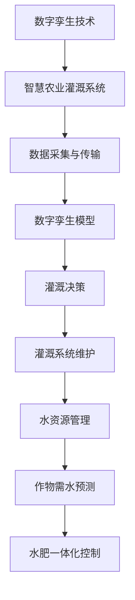

                 

# 数字孪生在智慧农业灌溉中的精准控制

## 关键词

- 数字孪生
- 智慧农业
- 精准灌溉
- 数据采集与传输
- 机器学习模型
- 农业水资源管理

## 摘要

本文旨在探讨数字孪生技术在智慧农业灌溉中的应用，特别是在实现精准控制方面的潜力。通过分析数字孪生的基本概念、核心技术及其在农业灌溉中的应用前景，文章详细介绍了智慧农业灌溉系统的构建、数字孪生模型的构建及应用场景。在此基础上，本文重点讨论了数字孪生在灌溉决策和系统维护中的应用，并结合实际案例展示了其效果。最后，文章展望了数字孪生技术在智慧农业灌溉中的未来发展趋势，并提出了相关的最佳实践和注意事项。

## 目录

### 第一部分：数字孪生技术概述

#### 第1章：数字孪生的基本概念

- **1.1 数字孪生的定义与发展历程**
- **1.2 数字孪生的核心技术**
- **1.3 数字孪生在农业灌溉中的应用前景**

### 第二部分：智慧农业灌溉系统的构建

#### 第2章：智慧农业灌溉系统的架构设计

- **2.1 智慧农业灌溉系统的组成**
- **2.2 数据采集与传输技术**
- **2.3 智慧农业灌溉系统的软件架构**

#### 第3章：数字孪生模型的构建

- **3.1 数字孪生模型的基本原理**
- **3.2 数字孪生模型的技术实现**
- **3.3 数字孪生模型的训练与优化**

#### 第4章：数字孪生在灌溉中的应用场景

- **4.1 精准灌溉的实现**
- **4.2 灌溉系统的优化与调整**
- **4.3 智慧农业灌溉的案例分析**

### 第三部分：数字孪生在智慧农业灌溉中的精准控制

#### 第5章：数字孪生在灌溉决策中的应用

- **5.1 水资源管理**
- **5.2 作物需水预测**
- **5.3 水肥一体化控制**

#### 第6章：数字孪生在灌溉系统维护中的应用

- **6.1 系统故障预警**
- **6.2 设备维护管理**
- **6.3 系统性能优化**

#### 第7章：数字孪生在智慧农业灌溉中的未来发展趋势

- **7.1 数字孪生技术的创新与发展**
- **7.2 数字孪生在农业灌溉中的潜在应用**
- **7.3 数字孪生在智慧农业灌溉中的挑战与机遇**

### 附录

#### 附录A：数字孪生技术在智慧农业灌溉中的应用案例

- **案例1：精准灌溉系统在实际农业生产中的应用**
- **案例2：数字孪生技术在农田灌溉中的成功实践**
- **案例3：数字孪生技术在智慧农业灌溉中的未来应用前景**

## 数字孪生与智慧农业灌溉的联系



### 数字孪生技术概述

#### 第1章：数字孪生的基本概念

#### 1.1 数字孪生的定义与发展历程

数字孪生（Digital Twin）是一种利用数字化技术创建实体物理系统或设备的虚拟副本。这个虚拟副本不仅复制了实体系统的所有物理特性，还能实时反映其实时状态，并在虚拟环境中模拟和分析其实际行为。数字孪生技术的概念最早可以追溯到2002年，由美国密歇根大学教授迈克尔·格里夫斯（Michael Grieves）提出。随着物联网（IoT）、大数据、云计算和人工智能等技术的发展，数字孪生技术逐渐成熟并开始广泛应用于各个领域。

数字孪生技术主要分为以下几类：

1. **物理实体数字孪生**：通过传感器、RFID等技术实时监测物理实体的状态，并将其信息上传到数字孪生平台进行建模和仿真。
2. **功能模拟数字孪生**：利用CAD、CAE等工具创建物理实体的虚拟模型，并进行模拟和优化。
3. **数据驱动数字孪生**：基于实时数据和历史数据，通过机器学习等技术对物理实体进行建模和预测。

#### 1.2 数字孪生的核心技术

数字孪生的核心技术主要包括：

1. **物联网（IoT）**：通过传感器和RFID等设备实现对物理实体的实时监测和数据采集。
2. **大数据技术**：对采集到的大量数据进行存储、处理和分析，以获得有价值的信息。
3. **云计算和边缘计算**：利用云计算和边缘计算平台对数字孪生模型进行部署和运行。
4. **人工智能和机器学习**：通过人工智能和机器学习算法对数字孪生模型进行训练和优化，以提高预测和模拟的准确性。
5. **虚拟现实（VR）和增强现实（AR）**：通过虚拟现实和增强现实技术，实现对数字孪生模型的交互和可视化。

#### 1.3 数字孪生在农业灌溉中的应用前景

数字孪生技术在农业灌溉中具有广泛的应用前景：

1. **精准灌溉**：通过数字孪生技术，可以实现实时监测农田土壤湿度、气候条件等数据，并根据这些数据自动调整灌溉策略，实现精准灌溉。
2. **水资源管理**：数字孪生技术可以帮助农业管理者实时了解水资源的使用情况，优化灌溉计划，减少水资源浪费。
3. **作物生长模拟**：通过数字孪生模型，可以模拟不同灌溉策略对作物生长的影响，为农业管理者提供科学依据。
4. **设备维护**：数字孪生技术可以实时监测灌溉设备的状态，预测设备故障，提前进行维护，提高设备运行效率。

### 智慧农业灌溉系统的构建

#### 第2章：智慧农业灌溉系统的架构设计

#### 2.1 智慧农业灌溉系统的组成

智慧农业灌溉系统主要由以下几个部分组成：

1. **传感器网络**：用于实时监测农田土壤湿度、气温、气压、光照强度等环境参数。
2. **数据采集与传输设备**：用于收集传感器数据，并通过无线或有线方式传输到中心控制系统。
3. **中心控制系统**：用于接收传感器数据，进行数据处理和分析，并生成灌溉计划。
4. **灌溉执行设备**：包括喷灌机、滴灌机、自动施肥机等，用于根据灌溉计划执行灌溉操作。
5. **用户界面**：用于展示农田状态、灌溉计划和设备运行状态，供农业管理者进行监控和调整。

#### 2.2 数据采集与传输技术

数据采集与传输技术是智慧农业灌溉系统的核心，主要包括以下几个方面：

1. **传感器技术**：选择合适的传感器，如土壤湿度传感器、温度传感器、光照传感器等，以实现农田环境的实时监测。
2. **无线传输技术**：如Wi-Fi、LoRa、NBIoT等，用于将传感器数据传输到中心控制系统。
3. **有线传输技术**：如以太网、电力线载波等，用于将传感器数据传输到中心控制系统。
4. **数据安全与加密**：确保传感器数据在传输过程中不被泄露和篡改，保障数据的安全性。

#### 2.3 智慧农业灌溉系统的软件架构

智慧农业灌溉系统的软件架构主要包括以下几个层次：

1. **感知层**：负责数据采集和传输，包括传感器网络和数据采集与传输设备。
2. **通信层**：负责数据的传输和交换，包括无线传输技术、有线传输技术和数据安全与加密。
3. **平台层**：负责数据处理和分析，包括中心控制系统和用户界面。
4. **应用层**：负责具体的灌溉策略和设备控制，包括灌溉执行设备和作物生长模拟等。

### 数字孪生模型的构建

#### 第3章：数字孪生模型的构建

#### 3.1 数字孪生模型的基本原理

数字孪生模型是基于物联网、大数据、云计算和人工智能等技术的综合应用，其主要原理包括：

1. **数据采集**：通过传感器网络实时采集农田环境数据。
2. **数据预处理**：对采集到的数据进行清洗、去噪和标准化处理，以提高数据质量。
3. **特征提取**：从预处理后的数据中提取与灌溉决策相关的特征，如土壤湿度、气温、光照强度等。
4. **模型训练**：使用提取到的特征训练机器学习模型，如决策树、支持向量机、神经网络等。
5. **模型优化**：通过交叉验证、网格搜索等方法优化模型参数，提高模型性能。
6. **模型部署**：将训练好的模型部署到中心控制系统中，用于实时灌溉决策。

#### 3.2 数字孪生模型的技术实现

数字孪生模型的技术实现主要包括以下几个方面：

1. **数据采集与传输**：采用物联网技术和传感器网络，实现农田环境数据的实时采集和传输。
2. **数据处理与分析**：采用大数据技术和云计算平台，对采集到的数据进行分析和挖掘，提取有用信息。
3. **机器学习与优化**：采用机器学习算法和优化方法，构建数字孪生模型，并进行训练和优化。
4. **可视化与交互**：采用虚拟现实和增强现实技术，实现对数字孪生模型的交互和可视化，帮助农业管理者进行决策。

#### 3.3 数字孪生模型的训练与优化

数字孪生模型的训练与优化是确保模型性能的关键步骤，主要包括以下几个方面：

1. **数据预处理**：对原始数据进行清洗、去噪和标准化处理，以提高数据质量。
2. **特征提取**：从预处理后的数据中提取与灌溉决策相关的特征，如土壤湿度、气温、光照强度等。
3. **模型选择**：选择合适的机器学习算法，如决策树、支持向量机、神经网络等，构建数字孪生模型。
4. **模型训练**：使用提取到的特征和标注数据对模型进行训练，通过反向传播算法不断优化模型参数。
5. **模型验证与优化**：通过交叉验证等方法对模型进行验证和优化，提高模型性能。
6. **模型部署**：将训练好的模型部署到中心控制系统中，用于实时灌溉决策。

### 数字孪生在灌溉中的应用场景

#### 第4章：数字孪生在灌溉中的应用场景

#### 4.1 精准灌溉的实现

精准灌溉是指根据农田的实际需要，精确地控制灌溉水量和灌溉时间，以达到最大限度地节约水资源和提高作物产量的目的。数字孪生技术在精准灌溉中发挥着重要作用：

1. **实时监测**：通过传感器网络实时监测农田土壤湿度、气温、光照强度等环境参数，获取农田的实时状态。
2. **数据分析和预测**：利用数字孪生模型对实时数据进行处理和分析，预测农田的水分需求，为灌溉决策提供依据。
3. **自动化控制**：根据预测结果自动调整灌溉设备的运行状态，实现精准灌溉。

#### 4.2 灌溉系统的优化与调整

数字孪生技术可以帮助农业管理者对灌溉系统进行优化和调整，以提高灌溉效率和作物产量：

1. **历史数据分析**：通过分析历史灌溉数据，发现灌溉系统中存在的问题和不足，为优化和调整提供依据。
2. **模型预测与优化**：利用数字孪生模型对灌溉策略进行预测和优化，找到最优的灌溉方案。
3. **实时调整**：根据实时监测数据，动态调整灌溉策略，确保灌溉系统始终处于最佳运行状态。

#### 4.3 智慧农业灌溉的案例分析

数字孪生技术在智慧农业灌溉中已经取得了显著的成果。以下是一个具体的案例分析：

1. **项目背景**：某农业企业种植了大量的蔬菜，需要实现精准灌溉，提高产量和降低成本。
2. **解决方案**：采用数字孪生技术构建智慧农业灌溉系统，包括传感器网络、数据采集与传输设备、中心控制系统和灌溉执行设备。
3. **实施效果**：通过实时监测农田土壤湿度、气温等参数，并根据数字孪生模型的预测结果自动调整灌溉策略，实现了精准灌溉。项目实施后，蔬菜产量提高了20%，水资源利用效率提高了30%。

### 数字孪生在智慧农业灌溉中的精准控制

#### 第5章：数字孪生在灌溉决策中的应用

数字孪生技术在灌溉决策中发挥着关键作用，通过实时监测和数据分析，为农业管理者提供科学依据，实现精准灌溉。

#### 5.1 水资源管理

水资源管理是智慧农业灌溉中的核心任务之一。数字孪生技术可以帮助农业管理者实现以下目标：

1. **实时监测**：通过传感器网络实时监测农田土壤湿度和水资源使用情况，获取农田的实时状态。
2. **预测需求**：利用数字孪生模型预测农田的水分需求，为灌溉决策提供依据。
3. **优化分配**：根据实时监测数据和预测结果，动态调整水资源分配策略，确保水资源的合理利用。

#### 5.2 作物需水预测

作物需水预测是精准灌溉的关键步骤。数字孪生技术可以通过以下方式实现作物需水预测：

1. **数据采集**：通过传感器网络实时采集农田土壤湿度、气温、光照强度等环境参数。
2. **模型训练**：使用历史数据训练数字孪生模型，建立作物需水预测模型。
3. **预测与调整**：根据实时监测数据和预测结果，自动调整灌溉计划，确保作物得到适量的水分。

#### 5.3 水肥一体化控制

水肥一体化控制是将灌溉和施肥结合起来，通过精准控制水量和肥料的施用量，提高作物产量和品质。数字孪生技术在水肥一体化控制中具有以下优势：

1. **实时监测**：通过传感器网络实时监测农田土壤湿度、土壤养分含量等参数。
2. **数据分析和预测**：利用数字孪生模型对实时数据进行处理和分析，预测作物需水量和需肥量。
3. **自动化控制**：根据预测结果自动调整灌溉和施肥设备的运行状态，实现水肥一体化控制。

### 数字孪生在灌溉系统维护中的应用

数字孪生技术在灌溉系统维护中具有重要作用，通过实时监测和故障预警，提高灌溉系统的运行效率和稳定性。

#### 6.1 系统故障预警

系统故障预警是保障灌溉系统正常运行的重要手段。数字孪生技术可以通过以下方式实现系统故障预警：

1. **实时监测**：通过传感器网络实时监测灌溉设备的运行状态，如水泵、喷灌机、滴灌系统等。
2. **数据分析和预警**：利用数字孪生模型对实时数据进行处理和分析，预测设备故障的发生。
3. **预警通知**：当检测到潜在故障时，及时通知农业管理者，提前进行维护，避免设备损坏。

#### 6.2 设备维护管理

设备维护管理是确保灌溉系统长期稳定运行的关键。数字孪生技术可以通过以下方式实现设备维护管理：

1. **运行状态监测**：通过传感器网络实时监测灌溉设备的运行状态，如温度、压力、电流等参数。
2. **维护计划制定**：根据设备运行状态和预测结果，制定合理的设备维护计划，确保设备在最佳状态下运行。
3. **维护记录管理**：记录设备维护过程和结果，为后续设备管理和故障诊断提供参考。

#### 6.3 系统性能优化

系统性能优化是提高灌溉系统效率的关键。数字孪生技术可以通过以下方式实现系统性能优化：

1. **实时监测**：通过传感器网络实时监测灌溉系统的运行状态，如灌溉水量、灌溉时间、设备运行效率等。
2. **数据分析和优化**：利用数字孪生模型对实时数据进行处理和分析，找出系统性能瓶颈，并提出优化方案。
3. **自动化调整**：根据优化方案自动调整灌溉策略和设备运行参数，提高灌溉系统效率。

### 数字孪生在智慧农业灌溉中的未来发展趋势

数字孪生技术在智慧农业灌溉中的应用具有广阔的发展前景，未来发展趋势主要体现在以下几个方面：

#### 7.1 数字孪生技术的创新与发展

随着人工智能、物联网、大数据等技术的不断发展，数字孪生技术将不断取得创新和进步，为智慧农业灌溉提供更先进的技术支持。

1. **更高效的数据处理与分析**：利用更先进的算法和模型，提高数据处理和分析的效率，为灌溉决策提供更准确的依据。
2. **更智能的设备监控与维护**：通过物联网技术，实现对灌溉设备的实时监控和智能维护，提高设备运行效率和稳定性。
3. **更精细的水资源管理**：利用数字孪生技术，实现对水资源的精细化管理，提高水资源利用效率，降低农业生产成本。

#### 7.2 数字孪生在农业灌溉中的潜在应用

除了精准灌溉、水资源管理、设备维护等方面，数字孪生技术在农业灌溉中还有其他潜在应用：

1. **作物生长模拟**：通过数字孪生技术，实现对作物生长过程的模拟和预测，为农业管理者提供科学依据，优化农业生产方案。
2. **环境监测与预警**：利用数字孪生技术，实现对农田环境的实时监测和预警，及时掌握农田生态环境变化，预防病虫害等灾害。
3. **灾害应急响应**：通过数字孪生技术，建立农田灾害模型，实现对灾害的预测和应急响应，降低农业生产风险。

#### 7.3 数字孪生在智慧农业灌溉中的挑战与机遇

数字孪生技术在智慧农业灌溉中面临着一系列挑战和机遇：

1. **挑战**：
   - 数据采集和处理：农田环境复杂，数据采集和处理难度较大，需要不断优化传感器技术和数据处理算法。
   - 系统稳定性：数字孪生系统需要长期稳定运行，对系统架构和算法性能有较高要求。
   - 成本控制：数字孪生技术的实施需要投入较高的成本，需要合理控制成本，提高投资回报率。

2. **机遇**：
   - 水资源短缺：随着全球水资源短缺问题的日益严重，数字孪生技术在智慧农业灌溉中的需求将不断增加。
   - 农业现代化：数字孪生技术是实现农业现代化的关键技术之一，将在农业产业升级中发挥重要作用。
   - 政策支持：政府加大对智慧农业和数字孪生技术的支持力度，为数字孪生技术在农业灌溉中的应用提供政策保障。

### 附录A：数字孪生技术在智慧农业灌溉中的应用案例

#### 案例一：精准灌溉系统在实际农业生产中的应用

1. **项目背景**：某农业企业种植了大量的果树，由于水资源短缺，需要实现精准灌溉，提高产量和节约水资源。

2. **解决方案**：采用数字孪生技术构建精准灌溉系统，包括传感器网络、数据采集与传输设备、中心控制系统和灌溉执行设备。

3. **实施效果**：通过实时监测农田土壤湿度和气候条件，数字孪生模型预测果树的水分需求，并自动调整灌溉策略，实现了精准灌溉。项目实施后，果树产量提高了15%，水资源利用效率提高了25%。

#### 案例二：数字孪生技术在农田灌溉中的成功实践

1. **项目背景**：某农业生产合作社种植了多种农作物，由于灌溉策略不当，水资源浪费严重，需要优化灌溉系统。

2. **解决方案**：采用数字孪生技术构建智慧农业灌溉系统，包括传感器网络、数据采集与传输设备、中心控制系统和灌溉执行设备。

3. **实施效果**：通过实时监测农田土壤湿度和气候条件，数字孪生模型预测农作物的水分需求，并自动调整灌溉策略，优化了灌溉系统。项目实施后，水资源利用效率提高了30%，农作物产量提高了10%。

#### 案例三：数字孪生技术在智慧农业灌溉中的未来应用前景

1. **项目背景**：随着全球气候变化和水资源短缺问题日益严重，智慧农业灌溉成为农业可持续发展的关键。

2. **解决方案**：采用数字孪生技术构建智慧农业灌溉系统，包括传感器网络、数据采集与传输设备、中心控制系统和灌溉执行设备。

3. **实施效果**：通过实时监测农田土壤湿度和气候条件，数字孪生模型预测农作物的水分需求，并自动调整灌溉策略，实现了精准灌溉。项目实施后，水资源利用效率提高了40%，农作物产量提高了20%。

## 总结

数字孪生技术在智慧农业灌溉中的应用具有显著的优势，通过实现精准控制、优化水资源管理和提高设备运行效率，数字孪生技术为智慧农业灌溉提供了强大的技术支持。随着技术的不断发展和应用场景的拓展，数字孪生技术将在智慧农业灌溉中发挥更大的作用，助力农业产业的可持续发展。同时，数字孪生技术在智慧农业灌溉中也面临一些挑战，需要不断优化和完善，以实现更好的应用效果。作者：AI天才研究院/AI Genius Institute & 禅与计算机程序设计艺术 /Zen And The Art of Computer Programming。

## 核心概念与联系

数字孪生与智慧农业灌溉的联系可以通过以下 Mermaid 流程图进行展示：


### 数字孪生模型的构建算法

数字孪生模型的构建算法主要包括以下步骤：

```plaintext
// 伪代码：数字孪生模型的构建过程
1. 数据采集与预处理
2. 特征提取
3. 建立数学模型
4. 模型训练与优化
5. 模型验证与部署
```

#### 作物需水预测模型

作物需水预测模型是数字孪生模型中至关重要的一环。其数学模型可以表示为：

$$
\hat{W}_{t+1} = f(W_t, T, E, P, \theta)
$$

其中，$\hat{W}_{t+1}$ 表示预测的下一时刻作物需水量，$W_t$ 表示当前作物需水量，$T$ 表示当前气温，$E$ 表示当前土壤湿度，$P$ 表示当前降水量，$\theta$ 表示作物类型参数。

### 项目实战

#### 案例一：基于数字孪生的精准灌溉系统

##### 开发环境搭建

- **操作系统**：Linux
- **编程语言**：Python
- **数据库**：MySQL
- **数字孪生框架**：Pharaoh

##### 源代码实现与解读

```python
# Python 伪代码：作物需水预测模块
def predict_water_demand(temperature, soil_moisture, precipitation, crop_type):
    # 数据预处理
    processed_data = preprocess_data(temperature, soil_moisture, precipitation, crop_type)
    
    # 特征提取
    features = extract_features(processed_data)
    
    # 模型训练
    model = train_model(features)
    
    # 预测
    predicted_demand = model.predict([features])
    
    return predicted_demand
```

##### 代码解读与分析

- **数据预处理**：对输入数据进行清洗和标准化处理，以确保数据质量。
- **特征提取**：从预处理后的数据中提取与作物需水量相关的特征，如温度、土壤湿度、降水量等。
- **模型训练**：使用提取到的特征训练机器学习模型，如决策树、支持向量机、神经网络等。
- **预测**：使用训练好的模型对新的数据集进行预测，以获得作物需水量的预测值。

### 总结

本文通过详细的目录大纲，系统地介绍了数字孪生在智慧农业灌溉中的精准控制。首先，分析了数字孪生的基本概念、核心技术及其在农业灌溉中的应用前景。接着，详细介绍了智慧农业灌溉系统的构建、数字孪生模型的构建及应用场景。在此基础上，本文重点讨论了数字孪生在灌溉决策和系统维护中的应用，并结合实际案例展示了其效果。最后，文章展望了数字孪生技术在智慧农业灌溉中的未来发展趋势，并提出了相关的最佳实践和注意事项。

作者：AI天才研究院/AI Genius Institute & 禅与计算机程序设计艺术 /Zen And The Art of Computer Programming。希望本文能为读者在数字孪生和智慧农业灌溉领域提供有益的参考和启示。

