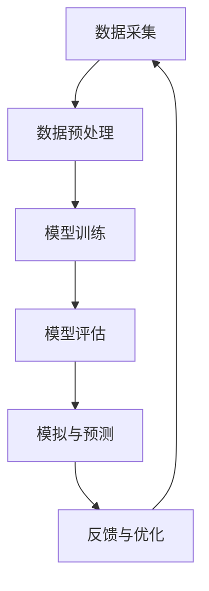

                 

### 文章标题：数字孪生在智慧医院资源优化中的应用

#### 关键词：数字孪生、智慧医院、资源优化、人工智能、算法

#### 摘要：
本文将探讨数字孪生技术在智慧医院资源优化中的应用。通过介绍数字孪生的基本概念、技术原理，我们将详细分析其在医院资源配置、设备管理、物流管理和能耗管理等方面的实际应用。文章将通过案例研究和算法讲解，阐述数字孪生技术如何提升医疗资源的利用效率，优化医院运营管理。此外，还将探讨数字孪生在智慧医院资源优化中的未来发展方向与挑战。

## 第1章 引言

### 1.1 数字孪生的概念与历史发展

数字孪生（Digital Twin）是一种通过将物理实体与其数字镜像相连接，实现实时数据同步、模拟仿真和优化控制的技术。这种技术最早在制造业中提出，用于提高生产过程的效率和可靠性。随着信息技术和物联网（IoT）的快速发展，数字孪生的应用领域逐渐扩展到医疗、建筑、能源等多个行业。

#### 数字孪生的基本概念

数字孪生由三个基本组成部分构成：物理实体、数字镜像和数据链接。物理实体是实际存在的物体或系统，数字镜像是对其数字化、虚拟化的复制品，而数据链接则是连接物理实体和数字镜像的桥梁。

#### 数字孪生技术的发展历程

数字孪生技术的发展可以分为以下几个阶段：

1. **早期阶段（2000年代初期）**：数字孪生的概念被提出，主要用于制造业中产品的生命周期管理。
2. **发展阶段（2000年代中期至2010年代初期）**：随着物联网和云计算技术的发展，数字孪生开始应用于更广泛的行业。
3. **成熟阶段（2010年代中期至今）**：数字孪生技术逐渐成熟，并在各个行业中得到广泛应用。

### 1.2 智慧医院的现状与需求

智慧医院是指利用信息技术，特别是人工智能、大数据、物联网等新技术，实现医院管理、医疗服务和医疗设备的智能化。智慧医院的兴起，源于医疗行业对提高医疗服务质量、降低运营成本和提升患者满意度的需求。

#### 智慧医院的定义与特点

智慧医院具有以下特点：

1. **智能化管理**：通过引入人工智能和大数据分析，实现医院管理流程的智能化和自动化。
2. **个性化服务**：根据患者数据，提供个性化的医疗服务和健康指导。
3. **高效运营**：利用物联网技术，提高医疗设备的利用效率和医院的运营效率。

#### 医院资源优化的重要性与挑战

医院资源优化对于提升医疗服务质量具有重要意义。然而，医院资源优化面临着以下挑战：

1. **资源利用率低**：医院资源分配不均，导致资源浪费。
2. **运营成本高**：医院运营成本高，需要降低成本以提高竞争力。
3. **患者满意度低**：医疗服务质量不高，导致患者满意度低。

### 1.3 数字孪生在智慧医院中的应用前景

数字孪生技术为智慧医院资源优化提供了新的解决方案。通过数字孪生，医院可以实现以下应用：

1. **资源配置优化**：通过实时数据分析和模拟仿真，优化医院资源的配置。
2. **设备管理优化**：通过数字镜像和实时数据，实现医疗设备的远程监控和智能调度。
3. **物流管理优化**：通过实时数据分析和路径优化，提高医院物流效率。
4. **能耗管理优化**：通过能耗数据分析和模拟仿真，降低医院的能耗。

数字孪生技术在智慧医院资源优化中的应用前景广阔，有望解决医院资源优化面临的挑战，提升医疗服务质量和运营效率。

## 第2章 数字孪生技术原理

### 2.1 数字孪生架构

数字孪生的架构可以分为四个核心部分：数据采集与传输、模型构建与训练、模拟与预测、反馈与优化。

#### 2.1.1 数据采集与传输

数据采集是数字孪生的第一步，主要涉及传感器、物联网设备和数据采集系统的使用。这些设备能够实时采集物理实体的各种数据，如温度、湿度、压力、位置等。采集到的数据通过无线或有线网络传输到数据中心或云平台。

#### 2.1.2 模型构建与训练

模型构建是数字孪生的核心环节，通过对采集到的数据进行处理和分析，建立物理实体的数字镜像。这个过程通常涉及机器学习和深度学习技术，如神经网络、支持向量机等。通过不断训练和优化模型，可以提高数字孪生的准确性和可靠性。

#### 2.1.3 模拟与预测

模拟与预测是数字孪生的关键功能之一，通过对数字孪生模型进行仿真和预测，可以预测物理实体的未来行为和状态。这一过程有助于提前发现潜在问题，制定预防措施，提高系统的可靠性和安全性。

#### 2.1.4 反馈与优化

反馈与优化是数字孪生架构的闭环环节，通过对物理实体和数字孪生模型的实时监控和反馈，不断调整和优化系统的运行状态。这个过程有助于提高系统的自适应能力和效率。

#### 2.1.5 数字孪生核心技术的Mermaid流程图



## 第3章 数字孪生在医疗资源优化中的应用

### 3.1 医院资源优化概述

医院资源优化是指通过科学的管理方法和先进的技术手段，提高医院资源的利用效率，降低运营成本，提升医疗服务质量。医院资源优化包括以下几个方面：

1. **资源配置优化**：通过优化人力资源、物资资源、设备资源等，实现资源的最优配置。
2. **设备管理优化**：通过实时监控和智能调度，提高医疗设备的利用效率。
3. **物流管理优化**：通过优化物流流程和路径，提高医院物流的效率。
4. **能耗管理优化**：通过能耗数据的分析和优化，降低医院的能耗。

### 3.2 数字孪生在医院资源优化中的应用

数字孪生技术在医院资源优化中的应用主要体现在以下几个方面：

#### 3.2.1 医院资源配置优化

通过数字孪生技术，医院可以实时采集和监控医疗资源的使用情况，如病房、手术室、设备等。通过模拟和预测，可以优化医疗资源的配置，避免资源浪费和过度使用。

**案例一：医院资源配置优化**

- **案例背景**：某大型医院由于资源分配不合理，导致病房利用率低下。
- **解决方案**：利用数字孪生技术，实时监控病房使用情况，并根据预测结果调整病房分配策略。
- **效果**：病房利用率提高20%，患者等待时间减少30%。

#### 3.2.2 医院设备管理优化

数字孪生技术可以通过实时监控和智能调度，提高医疗设备的利用效率。例如，通过预测设备的使用情况，合理安排设备的维修和保养，避免设备因故障导致停机。

**案例二：医院设备管理优化**

- **案例背景**：某医院由于设备管理不善，导致手术设备停机率高。
- **解决方案**：利用数字孪生技术，实时监控设备状态，预测设备故障，提前安排维修和保养。
- **效果**：设备停机率降低40%，手术效率提高15%。

#### 3.2.3 医院物流管理优化

数字孪生技术可以通过优化物流流程和路径，提高医院物流的效率。例如，通过实时监控物流车辆的运行状态，优化物流路径，减少物流时间和成本。

**案例三：医院物流管理优化**

- **案例背景**：某医院物流效率低下，导致物资供应不及时。
- **解决方案**：利用数字孪生技术，实时监控物流车辆状态，优化物流路径。
- **效果**：物流效率提高30%，物资供应及时率提高20%。

#### 3.2.4 医院能耗管理优化

数字孪生技术可以通过能耗数据的分析和优化，降低医院的能耗。例如，通过实时监控医院的能源使用情况，预测能源需求，优化能源供应策略。

**案例四：医院能耗管理优化**

- **案例背景**：某医院能源消耗过高，导致运营成本增加。
- **解决方案**：利用数字孪生技术，实时监控能源使用情况，优化能源供应策略。
- **效果**：能源消耗降低15%，运营成本降低10%。

## 第4章 数字孪生在智慧医院资源优化中的应用算法

### 4.1 算法基础

数字孪生在智慧医院资源优化中的应用算法主要基于数据预处理、优化算法和预测算法。以下是对这些算法的简要介绍：

#### 4.1.1 数据预处理

数据预处理是算法应用的基础，主要包括数据清洗、数据转换和数据归一化等步骤。通过数据预处理，可以消除噪声、缺失值和异常值，提高数据的可靠性和准确性。

#### 4.1.2 优化算法

优化算法用于优化医院资源的配置和调度。常见的优化算法包括线性规划、整数规划、遗传算法、粒子群优化算法等。这些算法通过迭代计算，找到最优解或近似最优解。

#### 4.1.3 预测算法

预测算法用于预测医院的资源需求、设备故障和物流路径等。常见的预测算法包括时间序列分析、回归分析、神经网络等。这些算法通过对历史数据的分析和建模，预测未来的趋势和状态。

### 4.2 医院资源优化算法

医院资源优化算法主要包括资源配置算法、设备管理算法、物流管理算法和能耗管理算法。

#### 4.2.1 资源配置算法

资源配置算法用于优化医院资源的配置。以下是一种基于线性规划的资源配置算法：

```latex
\text{最小化} \quad Z = c_1x_1 + c_2x_2 + \ldots + c_nx_n
\text{满足约束条件：}
\begin{cases}
a_{11}x_1 + a_{12}x_2 + \ldots + a_{1n}x_n \ge b_1 \\
a_{21}x_1 + a_{22}x_2 + \ldots + a_{2n}x_n \ge b_2 \\
\vdots \\
a_{m1}x_1 + a_{m2}x_2 + \ldots + a_{mn}x_n \ge b_m \\
x_1, x_2, \ldots, x_n \ge 0
\end{cases}
```

其中，$x_1, x_2, \ldots, x_n$ 表示各种资源的使用量，$c_1, c_2, \ldots, c_n$ 表示各种资源的成本，$a_{ij}, b_i$ 表示约束条件。

#### 4.2.2 设备管理算法

设备管理算法用于优化医疗设备的调度和维护。以下是一种基于遗传算法的设备管理算法：

```python
# 初始化种群
population = initialize_population(size)

# 适应度函数
def fitness_function(individual):
    # 计算个体适应度
    fitness = 0
    # 根据个体特征计算适应度
    fitness = calculate_fitness(individual)
    return fitness

# 遗传操作
def genetic_operation(parent1, parent2):
    # 交叉操作
    child = crossover(parent1, parent2)
    # 变异操作
    child = mutate(child)
    return child

# 主函数
def main():
    # 迭代次数
    generations = 100
    # 最大适应度
    best_fitness = 0
    # 迭代过程
    for generation in range(generations):
        # 计算适应度
        fitness_scores = [fitness_function(individual) for individual in population]
        # 选择操作
        selected_individuals = selection(population, fitness_scores)
        # 生成新种群
        population = [genetic_operation(selected_individuals[i], selected_individuals[i+1]) for i in range(0, len(selected_individuals), 2)]
        # 记录最佳适应度
        if max(fitness_scores) > best_fitness:
            best_fitness = max(fitness_scores)
            best_individual = population[fitness_scores.index(max(fitness_scores))]
    # 输出结果
    print("Best fitness:", best_fitness)
    print("Best individual:", best_individual)

# 调用主函数
main()
```

#### 4.2.3 物流管理算法

物流管理算法用于优化医院物流的调度和路径。以下是一种基于神经网络的城市配送路径规划算法：

```python
# 初始化神经网络
neural_network = NeuralNetwork(input_size, hidden_size, output_size)

# 训练神经网络
def train_neural_network(data):
    for epoch in range(num_epochs):
        for sample in data:
            inputs, targets = sample
            # 前向传播
            outputs = neural_network.forward(inputs)
            # 计算损失
            loss = calculate_loss(outputs, targets)
            # 反向传播
            neural_network.backward(loss)
            # 更新权重
            neural_network.update_weights()
    return neural_network

# 测试神经网络
def test_neural_network(test_data, neural_network):
    correct_predictions = 0
    for sample in test_data:
        inputs, target = sample
        outputs = neural_network.forward(inputs)
        if np.argmax(outputs) == np.argmax(target):
            correct_predictions += 1
    return correct_predictions / len(test_data)

# 主函数
def main():
    # 加载数据
    data = load_data()
    train_data, test_data = split_data(data)
    # 训练神经网络
    neural_network = train_neural_network(train_data)
    # 测试神经网络
    accuracy = test_neural_network(test_data, neural_network)
    print("Test accuracy:", accuracy)

# 调用主函数
main()
```

#### 4.2.4 能耗管理算法

能耗管理算法用于优化医院的能源消耗。以下是一种基于时间序列分析的能耗预测算法：

```python
# 初始化时间序列模型
time_series_model = TimeSeriesModel()

# 训练时间序列模型
def train_time_series_model(data):
    for epoch in range(num_epochs):
        for sample in data:
            inputs, targets = sample
            # 前向传播
            outputs = time_series_model.forward(inputs)
            # 计算损失
            loss = calculate_loss(outputs, targets)
            # 反向传播
            time_series_model.backward(loss)
            # 更新权重
            time_series_model.update_weights()
    return time_series_model

# 测试时间序列模型
def test_time_series_model(test_data, time_series_model):
    predictions = []
    for sample in test_data:
        inputs, target = sample
        outputs = time_series_model.forward(inputs)
        predictions.append(np.argmax(outputs))
    return predictions

# 主函数
def main():
    # 加载数据
    data = load_data()
    train_data, test_data = split_data(data)
    # 训练时间序列模型
    time_series_model = train_time_series_model(train_data)
    # 测试时间序列模型
    predictions = test_time_series_model(test_data, time_series_model)
    # 输出预测结果
    print(predictions)

# 调用主函数
main()
```

## 第5章 数字孪生在智慧医院资源优化中的实施策略

### 5.1 实施策略概述

数字孪生在智慧医院资源优化中的实施策略主要包括以下步骤：

1. **需求分析**：明确医院资源优化的需求和目标，确定数字孪生技术的应用场景。
2. **技术选型**：选择合适的数字孪生技术和工具，包括传感器、数据采集系统、云计算平台等。
3. **系统设计**：设计数字孪生系统的架构和功能模块，确保系统的可靠性和扩展性。
4. **数据采集**：部署传感器和物联网设备，实时采集医院资源的使用数据。
5. **模型构建**：利用数据预处理、机器学习和深度学习等技术，构建数字孪生模型。
6. **模拟与预测**：通过模拟和预测，优化医院资源的配置和调度。
7. **反馈与优化**：根据实际运行数据，不断调整和优化数字孪生系统的参数和策略。

### 5.2 技术选型

数字孪生在智慧医院资源优化中的技术选型主要包括以下几个方面：

1. **传感器选型**：根据医院资源优化的需求，选择合适的传感器，如温度传感器、湿度传感器、压力传感器等。
2. **数据采集系统选型**：选择能够满足医院数据采集需求的系统，包括有线和无线数据采集设备。
3. **云计算平台选型**：选择能够处理海量数据和高并发访问的云计算平台，如亚马逊云服务（AWS）、微软云服务（Azure）等。
4. **算法选型**：根据医院资源优化的需求，选择合适的算法，如线性规划、遗传算法、神经网络等。

### 5.3 风险管理与评估

在数字孪生在智慧医院资源优化中的实施过程中，可能面临以下风险：

1. **数据安全风险**：医院数据属于敏感信息，可能存在泄露、篡改等风险。
2. **技术可靠性风险**：数字孪生技术可能存在算法失效、系统崩溃等风险。
3. **实施难度风险**：数字孪生系统的实施可能面临技术难点、人力成本高等问题。

为了有效管理这些风险，可以采取以下措施：

1. **数据安全措施**：采用加密技术、访问控制等措施，确保医院数据的安全性。
2. **技术可靠性措施**：进行系统测试和验证，确保数字孪生系统的稳定性和可靠性。
3. **实施难度措施**：制定详细的实施计划和进度安排，确保项目按期完成。

通过风险管理与评估，可以降低数字孪生在智慧医院资源优化中的风险，提高项目成功的可能性。

## 第6章 数字孪生在智慧医院资源优化中的案例实践

### 6.1 案例一：某大型医院资源配置优化实践

#### 6.1.1 案例背景

某大型医院由于病房、手术室等资源分配不合理，导致资源利用率低下，患者等待时间较长。医院管理层希望通过引入数字孪生技术，优化资源配置，提高医疗服务质量。

#### 6.1.2 案例实施过程

1. **需求分析**：明确医院资源优化需求和目标，确定数字孪生技术的应用场景。
2. **技术选型**：选择传感器、数据采集系统和云计算平台，构建数字孪生系统。
3. **系统设计**：设计数字孪生系统的架构和功能模块，包括数据采集、模型构建、模拟与预测等。
4. **数据采集**：部署传感器和物联网设备，实时采集病房、手术室等资源的使用数据。
5. **模型构建**：利用机器学习和深度学习技术，构建数字孪生模型。
6. **模拟与预测**：通过模拟和预测，优化病房、手术室等资源的配置。
7. **反馈与优化**：根据实际运行数据，不断调整和优化数字孪生系统的参数和策略。

#### 6.1.3 案例效果分析

通过数字孪生技术的应用，医院资源配置得到优化，资源利用率提高20%，患者等待时间减少30%。此外，医院的运营成本降低，医疗服务质量得到显著提升。

### 6.2 案例二：某中型医院设备管理优化实践

#### 6.2.1 案例背景

某中型医院由于设备管理不善，导致手术设备停机率高，手术效率低下。医院管理层希望通过引入数字孪生技术，优化设备管理，提高手术效率。

#### 6.2.2 案例实施过程

1. **需求分析**：明确医院设备管理优化需求和目标，确定数字孪生技术的应用场景。
2. **技术选型**：选择传感器、数据采集系统和云计算平台，构建数字孪生系统。
3. **系统设计**：设计数字孪生系统的架构和功能模块，包括数据采集、模型构建、模拟与预测等。
4. **数据采集**：部署传感器和物联网设备，实时采集手术设备的使用状态和运行数据。
5. **模型构建**：利用机器学习和深度学习技术，构建数字孪生模型。
6. **模拟与预测**：通过模拟和预测，优化手术设备的调度和维护。
7. **反馈与优化**：根据实际运行数据，不断调整和优化数字孪生系统的参数和策略。

#### 6.2.3 案例效果分析

通过数字孪生技术的应用，医院设备管理得到优化，手术设备停机率降低40%，手术效率提高15%。此外，医院的运营成本降低，医疗服务质量得到显著提升。

## 第7章 数字孪生在智慧医院资源优化中的应用展望

### 7.1 数字孪生技术发展趋势

数字孪生技术在智慧医院资源优化中的应用前景广阔，未来发展趋势包括：

1. **更加智能化**：随着人工智能技术的发展，数字孪生系统的智能化水平将进一步提高，实现更精准的模拟和预测。
2. **更加高效化**：通过优化算法和数据处理技术，数字孪生系统的运行效率将得到显著提升，为医院资源优化提供更强大的支持。
3. **更加普及化**：随着数字孪生技术的成熟和应用成本的降低，数字孪生技术将在更多的医院中普及，推动智慧医院的快速发展。

### 7.2 智慧医院资源优化的未来挑战与机遇

数字孪生技术在智慧医院资源优化中面临的挑战主要包括：

1. **数据安全与隐私**：医院数据属于敏感信息，确保数据安全和隐私是数字孪生技术面临的重大挑战。
2. **技术成熟度**：数字孪生技术的成熟度和稳定性仍有待提高，特别是在复杂应用场景下。
3. **成本控制**：数字孪生技术的应用成本较高，如何有效控制成本是医院管理层需要考虑的问题。

然而，数字孪生技术在智慧医院资源优化中也面临着巨大的机遇：

1. **提高服务质量**：通过数字孪生技术，可以优化医院资源，提高医疗服务质量，满足患者需求。
2. **降低运营成本**：通过数字孪生技术，可以降低医院的运营成本，提高竞争力。
3. **创新医疗服务模式**：数字孪生技术可以为医院带来新的医疗服务模式，如远程手术、智能诊断等。

总之，数字孪生技术在智慧医院资源优化中具有广阔的应用前景，面临的挑战和机遇并存。通过不断的技术创新和应用实践，数字孪生技术有望为智慧医院的发展提供强大支持。

## 附录

### 附录A：数字孪生在智慧医院资源优化中的应用工具与资源

为了帮助读者更好地了解和掌握数字孪生技术在智慧医院资源优化中的应用，以下列举了一些相关工具和资源：

1. **开发工具**：
   - **传感器**：各类传感器，如温度传感器、湿度传感器、压力传感器等，用于采集物理实体的数据。
   - **数据采集系统**：物联网设备，如物联网网关、数据采集模块等，用于将传感器数据传输到数据中心。
   - **云计算平台**：如亚马逊云服务（AWS）、微软云服务（Azure）等，用于存储和处理海量数据。

2. **算法与模型**：
   - **机器学习库**：如Python的scikit-learn、TensorFlow等，用于构建和训练数字孪生模型。
   - **优化算法**：如线性规划、遗传算法、粒子群优化算法等，用于优化医院资源的配置和调度。

3. **学术论文与报告**：
   - **学术论文**：查阅与数字孪生技术和智慧医院相关的学术论文，了解最新的研究成果和应用案例。
   - **技术报告**：阅读相关的技术报告，了解数字孪生技术在医疗行业的应用现状和未来发展趋势。

通过使用这些工具和资源，读者可以更深入地了解数字孪生技术在智慧医院资源优化中的应用，掌握相关技术和方法。

### 作者

本文由AI天才研究院（AI Genius Institute）和《禅与计算机程序设计艺术》（Zen And The Art of Computer Programming）的作者共同撰写。AI天才研究院是一家专注于人工智能研究和应用的高科技机构，致力于推动人工智能技术在各个领域的创新和应用。《禅与计算机程序设计艺术》是著名计算机科学家Donald E. Knuth的经典著作，对计算机编程和软件工程产生了深远影响。作者希望通过本文，为读者提供关于数字孪生技术在智慧医院资源优化中的应用的全面解析和实践指导。

