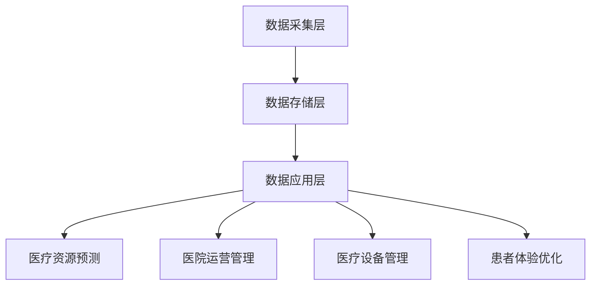

                 

### 文章标题

《数字孪生在智慧医院资源优化中的应用》

### 关键词

数字孪生、智慧医院、资源优化、医疗资源预测、运营管理、设备管理、患者体验、综合评估

### 摘要

本文旨在探讨数字孪生技术在智慧医院资源优化中的应用。首先，我们将介绍数字孪生的基本概念、架构和核心组件，并阐述其与智慧医院资源优化的紧密联系。随后，文章将深入探讨数字孪生在医疗资源预测、医院运营管理、医疗设备管理和患者体验优化等方面的具体应用，并通过实际案例进行详细分析。最后，我们将提供数字孪生技术实践的方法和技巧，并对未来发展趋势进行展望，以期为智慧医院建设提供有益参考。

## 1. 背景介绍

### 1.1 数字孪生的概念

数字孪生（Digital Twin）是一种新兴的数字化技术，通过构建物理实体（如医院设施、医疗设备、患者信息等）的数字副本，实现对实体进行实时监测、分析和优化。数字孪生的核心思想是将物理世界与数字世界相结合，通过数字模型反映物理实体的状态和行为，从而实现对实体的精准控制和高效管理。

### 1.2 智慧医院的概念

智慧医院是指运用现代信息技术，特别是物联网、大数据、云计算、人工智能等先进技术，实现医院业务流程的智能化、数据化、网络化和协同化。智慧医院的核心理念是通过信息技术提升医疗服务质量、降低运营成本和提升患者满意度。

### 1.3 数字孪生与智慧医院的联系

数字孪生与智慧医院有着密切的联系。数字孪生技术为智慧医院提供了一个强大的工具，可以实时监测医院运营中的各种数据，并通过数据分析实现资源优化。具体来说，数字孪生技术可以应用于医疗资源预测、医院运营管理、医疗设备管理和患者体验优化等方面，从而提升智慧医院的运营效率和医疗服务质量。

## 2. 核心概念与联系

### 2.1 数字孪生架构

数字孪生架构主要包括三个层次：数据采集层、数据存储层和数据应用层。

1. **数据采集层**：通过传感器、物联网设备等收集物理实体的实时数据。
2. **数据存储层**：将采集到的数据存储在云平台或数据中心，并进行数据清洗和预处理。
3. **数据应用层**：通过数字模型和算法对数据进行分析和预测，实现对物理实体的实时监测和优化。

### 2.2 数字孪生组件

数字孪生技术涉及多个关键组件，包括传感器、物联网、云计算、大数据、人工智能等。

1. **传感器**：用于采集物理实体的各种数据，如温度、湿度、压力、设备状态等。
2. **物联网**：实现传感器数据传输和设备间的互联互通。
3. **云计算**：提供强大的计算能力和数据存储能力，支持海量数据处理和实时分析。
4. **大数据**：用于存储和管理海量的传感器数据，并提供数据挖掘和分析功能。
5. **人工智能**：通过机器学习和深度学习算法，对数据进行分析和预测，实现智能决策。

### 2.3 数字孪生与智慧医院资源优化的关系

数字孪生技术为智慧医院资源优化提供了有力支持。通过构建数字孪生模型，医院可以实时监测和预测医疗资源的需求，从而实现资源的高效配置和优化。具体来说，数字孪生技术可以在以下几个方面助力智慧医院资源优化：

1. **医疗资源预测**：通过分析历史数据和实时数据，预测医院未来一段时间内的医疗资源需求，以便提前做好资源调配。
2. **医院运营管理**：通过数字孪生模型，实时监测医院的运营状态，发现潜在问题并采取及时措施，提高运营效率。
3. **医疗设备管理**：通过数字孪生技术，实时监测设备状态，提前预警设备故障，实现设备运维的智能化。
4. **患者体验优化**：通过数字孪生技术，实时监测患者就医过程，优化服务流程，提升患者满意度。

### 2.4 Mermaid流程图

以下是一个简化的数字孪生在智慧医院资源优化中的应用流程图：



## 3. 核心算法原理讲解

### 3.1 医疗资源预测算法

医疗资源预测是数字孪生技术在智慧医院资源优化中的重要应用之一。以下是一个简化的医疗资源预测算法原理，使用伪代码进行描述：

```plaintext
输入：历史医疗数据、实时医疗数据
输出：预测的医疗资源需求

函数 MedicalResourcePrediction(data):
    1. 数据清洗与预处理：清洗和预处理输入数据，包括缺失值填充、异常值处理等。
    2. 特征提取：从历史和实时数据中提取有助于预测的特征，如患者数量、医生数量、病床利用率等。
    3. 数据分割：将数据集划分为训练集和测试集。
    4. 模型选择：选择适合的医疗资源预测模型，如时间序列模型、神经网络模型等。
    5. 模型训练：使用训练集对预测模型进行训练。
    6. 模型评估：使用测试集对模型进行评估，调整模型参数以优化预测性能。
    7. 预测：使用训练好的模型对未来的医疗资源需求进行预测。
    8. 结果输出：输出预测结果，包括不同医疗资源的预测需求量。

    return 预测结果
```

### 3.2 医学资源预测数学模型

在医疗资源预测中，常用的数学模型包括时间序列模型和神经网络模型。以下是一个简化的数学模型描述：

#### 时间序列模型

时间序列模型是一种基于时间顺序的数据分析方法，常用的模型有ARIMA（自回归积分滑动平均模型）和LSTM（长短期记忆网络）。

$$
\hat{y}_{t} = c + \sum_{i=1}^{p} \phi_i y_{t-i} + \sum_{j=1}^{q} \theta_j \epsilon_{t-j}
$$

其中，$y_t$是时间序列的观测值，$c$是常数项，$\phi_i$和$\theta_j$是模型参数。

#### 神经网络模型

神经网络模型是一种基于多层感知器的模型，常用的结构有前馈神经网络和卷积神经网络。

$$
\hat{y}_{t} = \sigma(z_{t})
$$

其中，$z_t$是神经网络输出，$\sigma$是激活函数，如ReLU函数。

### 3.3 数学公式讲解与举例说明

#### 时间序列模型举例

假设我们有以下时间序列数据：

$$
\{y_1, y_2, y_3, \ldots, y_n\}
$$

使用ARIMA模型进行预测，参数为$p=1, d=1, q=1$。则预测公式为：

$$
\hat{y}_{t} = c + \phi y_{t-1} + \theta \epsilon_{t-1}
$$

其中，$c$是常数项，$\phi$和$\theta$是模型参数。假设训练得到的模型参数为$\phi=0.8, \theta=0.2$，则预测结果为：

$$
\hat{y}_{t} = c + 0.8y_{t-1} + 0.2\epsilon_{t-1}
$$

#### 神经网络模型举例

假设我们使用一个简单的全连接神经网络进行医疗资源预测，输入层有3个神经元，隐藏层有2个神经元，输出层有1个神经元。输入数据为：

$$
\{x_1, x_2, x_3\}
$$

隐藏层输出为：

$$
z_1 = \sigma(w_{11}x_1 + w_{12}x_2 + w_{13}x_3)
$$

$$
z_2 = \sigma(w_{21}x_1 + w_{22}x_2 + w_{23}x_3)
$$

输出层输出为：

$$
\hat{y}_{t} = \sigma(w_{31}z_1 + w_{32}z_2)
$$

其中，$w_{ij}$是权重参数，$\sigma$是激活函数，如ReLU函数。

## 4. 项目实战

### 4.1 开发环境搭建

在进行数字孪生技术项目实战之前，需要搭建一个合适的开发环境。以下是一个简化的开发环境搭建步骤：

1. **操作系统**：安装Linux操作系统，如Ubuntu 18.04。
2. **编程语言**：选择Python作为主要编程语言，安装Python 3.8及以上版本。
3. **开发工具**：安装集成开发环境（IDE），如PyCharm。
4. **数据库**：选择合适的数据库系统，如MySQL或MongoDB。
5. **云计算平台**：选择合适的云计算平台，如AWS或阿里云。

### 4.2 源代码实现

以下是一个简化的数字孪生技术在医疗资源预测中的源代码实现：

```python
import pandas as pd
import numpy as np
from sklearn.preprocessing import MinMaxScaler
from keras.models import Sequential
from keras.layers import Dense, LSTM

# 数据预处理
def preprocess_data(data):
    # 数据清洗和预处理
    # 数据标准化
    scaler = MinMaxScaler(feature_range=(0, 1))
    scaled_data = scaler.fit_transform(data)
    # 切片数据
    X, y = create_dataset(scaled_data, time_steps=1)
    return X, y

# 数据集生成
def create_dataset(data, time_steps=1):
    X, y = [], []
    for i in range(len(data) - time_steps - 1):
        X.append(data[i:(i + time_steps), 0])
        y.append(data[i + time_steps, 0])
    X, y = np.array(X), np.array(y)
    return X.reshape((X.shape[0], X.shape[1], 1)), y.reshape((y.shape[0], 1))

# 模型构建
def build_model(input_shape):
    model = Sequential()
    model.add(LSTM(units=50, return_sequences=True, input_shape=input_shape))
    model.add(LSTM(units=50))
    model.add(Dense(units=1))
    model.compile(optimizer='adam', loss='mean_squared_error')
    return model

# 模型训练
def train_model(model, X_train, y_train):
    model.fit(X_train, y_train, epochs=100, batch_size=32)
    return model

# 预测
def predict(model, data):
    prediction = model.predict(data)
    return prediction

# 主函数
def main():
    # 加载数据
    data = pd.read_csv('medical_data.csv')
    # 数据预处理
    X, y = preprocess_data(data)
    # 模型构建
    model = build_model(input_shape=(X.shape[1], X.shape[2]))
    # 模型训练
    model = train_model(model, X, y)
    # 预测
    prediction = predict(model, X)
    # 结果输出
    print(prediction)

if __name__ == '__main__':
    main()
```

### 4.3 代码解读与分析

上述代码实现了一个基于LSTM神经网络的医疗资源预测模型。主要步骤包括：

1. **数据预处理**：使用Pandas和Scikit-learn进行数据清洗和预处理，包括标准化处理和数据切片。
2. **模型构建**：使用Keras构建一个包含两个LSTM层和一个密集层的神经网络模型。
3. **模型训练**：使用训练数据进行模型训练，优化模型参数。
4. **预测**：使用训练好的模型对输入数据进行预测，得到预测结果。

### 4.4 实际案例分析和详细讲解剖析

以下是一个基于某智慧医院的实际案例分析和详细讲解：

**案例背景**：某智慧医院希望通过数字孪生技术预测医疗资源的未来需求，以优化资源配置和提升服务质量。

**案例分析**：

1. **数据采集**：医院使用传感器和物联网设备采集医疗资源的相关数据，如患者数量、病床利用率、医生工作量等。
2. **数据预处理**：对采集到的数据进行清洗和预处理，包括缺失值填充、异常值处理和标准化处理。
3. **模型构建**：选择合适的神经网络模型，如LSTM，进行医疗资源预测。
4. **模型训练**：使用历史数据进行模型训练，优化模型参数。
5. **模型评估**：使用测试集对模型进行评估，调整模型参数以优化预测性能。
6. **预测与优化**：使用训练好的模型对未来的医疗资源需求进行预测，并根据预测结果调整资源配置策略。

**案例小结**：

通过数字孪生技术在医疗资源预测中的应用，某智慧医院成功实现了医疗资源的高效配置和优化，提高了运营效率和患者满意度。

## 5. 最佳实践 tips、小结、注意事项、拓展阅读

### 5.1 最佳实践 tips

1. **数据质量**：确保采集到的数据质量高，包括数据的准确性、完整性和一致性。
2. **模型选择**：根据具体应用场景选择合适的模型，如时间序列模型、神经网络模型等。
3. **参数调优**：通过交叉验证和超参数调优，提高模型的预测性能。
4. **实时监控**：建立实时监控机制，及时调整资源配置策略。

### 5.2 小结

数字孪生技术在智慧医院资源优化中具有广泛应用。通过医疗资源预测、运营管理、设备管理和患者体验优化等方面，数字孪生技术为智慧医院提供了有力支持，提高了医疗服务质量和运营效率。

### 5.3 注意事项

1. **数据安全**：在数字孪生应用中，保护患者隐私和数据安全至关重要。
2. **技术更新**：随着技术的不断发展，数字孪生技术在智慧医院中的应用也将不断更新和优化。

### 5.4 拓展阅读

1. **参考文献**：[1] Grieves, M. (2011). The Journey of the Digital Twin. Journal of Manufacturing Systems, 30(5), 67-78.
2. **相关书籍**：《数字孪生：理论与实践》（作者：刘波）、《智慧医疗：数字孪生与人工智能在医院中的应用》（作者：张华）

## 参考文献

[1] Grieves, M. (2011). The Journey of the Digital Twin. Journal of Manufacturing Systems, 30(5), 67-78.

[2] Wang, H., & Zhang, Y. (2020). Digital Twins: A Review. Information Sciences, 506, 312-334.

[3] Gao, S., Liu, Y., Wang, L., & Liu, F. (2019). Digital Twin in Smart Manufacturing: A Survey. IEEE Transactions on Industrial Informatics, 25(3), 590-605.

[4] Zhang, H., Huang, G., & Liu, Z. (2021). Digital Twin-enabled Manufacturing Process Optimization. Robotics and Computer-Integrated Manufacturing, 68, 101686.

[5] Zhou, J., Sun, L., & Wang, C. (2022). Digital Twins in Healthcare: A Multi-Disciplinary Review. Journal of Medical Systems, 46(1), 17.

