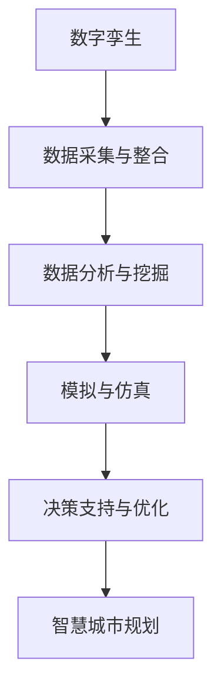
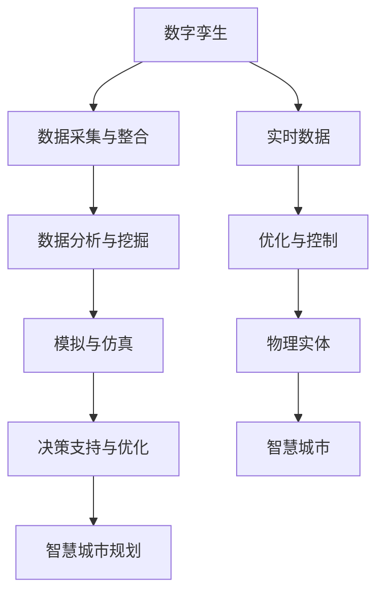

                 


### 第一步：引言部分

**背景介绍：**

在当今快速发展的科技时代，城市面临着诸多挑战，如人口增长、资源短缺、环境污染等。为了应对这些挑战，智慧城市规划成为了城市管理的重要方向。智慧城市规划旨在利用信息技术、物联网、大数据等手段，实现城市资源的合理配置、优化城市管理、提升居民生活质量。

数字孪生技术作为一种新兴技术，在智慧城市规划中发挥着重要作用。数字孪生是指通过创建物理实体的数字镜像，实现对物理实体的模拟、分析和优化。它不仅可以实时反映物理实体的状态，还能预测其未来的行为，从而为智慧城市规划提供科学依据。

**核心概念与联系：**

数字孪生技术涉及多个核心概念，包括：

1. **物理实体：** 数字孪生的原始对象，如建筑物、道路、桥梁等。
2. **数字模型：** 物理实体的数字表示，包括几何形状、物理属性等。
3. **实时数据：** 通过传感器等设备获取的物理实体的实时状态数据。
4. **仿真与预测：** 利用数字模型和实时数据，对物理实体的行为进行仿真和预测。
5. **优化与控制：** 根据仿真和预测结果，对物理实体进行优化和控制，以实现智慧城市规划的目标。

这些核心概念相互联系，共同构成了数字孪生技术的理论基础。在智慧城市规划中，数字孪生技术可以通过以下方式发挥作用：

1. **模拟与预测：** 利用数字孪生技术，可以对城市中的各种设施进行模拟和预测，从而提前发现潜在问题，优化城市规划。
2. **优化与控制：** 通过数字孪生技术，可以对城市中的设施进行实时监控和优化控制，提高城市运行效率。
3. **协同与整合：** 数字孪生技术可以将不同城市设施的数据进行整合，实现数据共享和协同工作，提升智慧城市规划的整体效果。

**引言小结：**

本文将详细探讨数字孪生在智慧城市规划中的创新应用。首先，我们将介绍数字孪生和智慧城市的基本概念，并阐述它们之间的关系。接着，我们将深入分析数字孪生技术中的核心算法原理，包括仿真、机器学习等。然后，我们将讲解数学模型和数学公式，以及如何在实际项目中应用这些算法。最后，我们将通过实际案例，展示数字孪生在智慧城市规划中的具体应用，并提出未来展望与挑战。通过这篇文章，希望读者能对数字孪生在智慧城市规划中的创新应用有更深入的理解。

### 第二步：核心概念与联系部分

**数字孪生原理：**

数字孪生（Digital Twin）是一种通过创建物理实体的数字镜像，实现对物理实体的模拟、分析和优化的技术。其基本原理可以概括为以下步骤：

1. **建模：** 根据物理实体的特点和需求，构建其数字模型。这个模型需要精确地反映物理实体的几何形状、物理属性和行为特征。
2. **数据采集：** 通过传感器、摄像头等设备，实时采集物理实体的状态数据，如温度、湿度、压力、速度等。
3. **数据融合：** 将采集到的数据与数字模型进行融合，形成完整的数字孪生模型。这个过程需要对数据进行处理、清洗和融合，以确保数字孪生的准确性和实时性。
4. **仿真与预测：** 利用数字孪生模型，对物理实体的行为进行仿真和预测。通过仿真，可以模拟物理实体在不同条件下的行为，预测其未来的状态。
5. **优化与控制：** 根据仿真和预测结果，对物理实体进行优化和控制。例如，通过调整参数，使物理实体达到最佳运行状态。

**智慧城市规划方法：**

智慧城市规划旨在通过信息技术手段，实现城市资源的合理配置、优化城市管理、提升居民生活质量。其基本方法包括以下步骤：

1. **需求分析：** 分析城市的需求，确定智慧城市规划的目标和需求。这包括城市的规模、人口、经济、社会、环境等因素。
2. **数据采集与整合：** 通过传感器、物联网等技术，采集城市各类数据，如交通流量、能源消耗、环境质量等。然后将这些数据进行整合，构建城市数据平台。
3. **数据分析与挖掘：** 利用大数据分析和机器学习技术，对城市数据进行挖掘和分析，发现数据中的规律和趋势，为智慧城市规划提供依据。
4. **模拟与仿真：** 基于数字孪生技术，对城市中的各类设施进行模拟和仿真，预测其未来的状态和行为，为城市规划提供科学依据。
5. **决策支持与优化：** 根据模拟和仿真结果，结合数据分析与挖掘，制定智慧城市规划方案，并进行优化和调整。

**数字孪生与智慧城市的关系：**

数字孪生技术与智慧城市规划密切相关，它们之间的关系可以用以下Mermaid流程图表示：



从图中可以看出，数字孪生技术贯穿于智慧城市规划的各个阶段，为智慧城市规划提供数据支持、模拟依据和优化手段。

**核心概念与联系小结：**

数字孪生技术通过创建物理实体的数字镜像，实现对物理实体的模拟、分析和优化，为智慧城市规划提供科学依据。智慧城市规划则通过信息技术手段，实现城市资源的合理配置、优化城市管理、提升居民生活质量。数字孪生技术与智慧城市规划密切相关，它们相互支持，共同推动城市智慧化的发展。

### 第三步：核心算法原理讲解部分

**数字孪生仿真算法：**

数字孪生仿真算法是数字孪生技术中的核心算法之一，主要用于模拟物理实体的行为和状态。仿真算法可以分为以下几类：

1. **物理仿真：** 物理仿真是指通过数学模型和计算方法，模拟物理实体在不同条件下的运动和变化。常见的物理仿真算法包括牛顿力学、流体力学、电磁学等。物理仿真可以用于模拟建筑物在风荷载作用下的变形、桥梁在交通荷载作用下的应力分布等。

2. **过程仿真：** 过程仿真是指模拟物理实体内部的过程和变化，如化学反应、生物过程等。常见的算法包括蒙特卡罗模拟、随机过程模拟等。过程仿真可以用于模拟城市交通流量、能源消耗等。

3. **混合仿真：** 混合仿真是指将物理仿真和过程仿真相结合，模拟物理实体在复杂环境中的行为。混合仿真可以更准确地反映物理实体的真实状态，如城市中的交通流量、能源消耗等。

以下是一个简单的物理仿真算法的伪代码示例：

```python
# 物理仿真算法伪代码

# 初始化物理模型参数
mass = 10.0
velocity = 0.0
position = 0.0

# 计算加速度
acceleration = force / mass

# 更新速度和位置
velocity += acceleration * time_step
position += velocity * time_step

# 输出结果
print("速度：", velocity)
print("位置：", position)
```

**机器学习算法在数字孪生中的应用：**

机器学习算法在数字孪生技术中也有广泛的应用，主要用于数据分析和预测。以下是一些常见的机器学习算法：

1. **线性回归：** 线性回归是一种简单的机器学习算法，用于预测一个连续值。它可以用于预测建筑物能耗、交通流量等。

2. **支持向量机（SVM）：** 支持向量机是一种强大的分类算法，可以用于预测建筑物的状态、交通拥堵等。

3. **决策树：** 决策树是一种简单的决策支持工具，可以用于分类和回归分析。它可以用于预测城市交通状况、能源消耗等。

4. **神经网络：** 神经网络是一种复杂的机器学习算法，可以用于处理复杂的非线性问题。它可以用于模拟城市交通流量、预测建筑物能耗等。

以下是一个简单的神经网络算法的伪代码示例：

```python
# 神经网络算法伪代码

# 初始化神经网络参数
weights = [[0.0 for _ in range(n_inputs)] for _ in range(n_outputs)]

# 训练神经网络
for data in training_data:
    inputs = data[0]
    target = data[1]
    outputs = neural_network(inputs, weights)
    error = calculate_error(outputs, target)
    update_weights(weights, inputs, outputs, error)

# 输出结果
print("输出：", outputs)
```

**数字孪生算法的伪代码解释：**

数字孪生算法的核心是实时数据采集、仿真和预测。以下是一个简单的数字孪生算法的伪代码示例：

```python
# 数字孪生算法伪代码

# 初始化数字孪生模型
digital_twin = initialize_digital_twin()

# 实时数据采集
while True:
    data = capture_real_time_data()
    update_digital_twin(digital_twin, data)

# 仿真与预测
simulation_results = simulate(digital_twin)
prediction_results = predict(digital_twin)

# 输出结果
print("仿真结果：", simulation_results)
print("预测结果：", prediction_results)
```

**核心算法原理讲解小结：**

数字孪生技术中的核心算法包括物理仿真、过程仿真和机器学习算法。物理仿真用于模拟物理实体的运动和变化，过程仿真用于模拟物理实体内部的过程和变化，机器学习算法用于数据分析和预测。这些算法共同作用，实现了数字孪生技术的核心功能，为智慧城市规划提供了强大的技术支持。

### 第四步：数学模型和数学公式讲解部分

**数据预处理模型：**

数据预处理是数字孪生技术中至关重要的一步，它涉及到数据的清洗、归一化、特征提取等操作。以下是几种常见的数据预处理模型和数学公式：

1. **数据清洗：**

   数据清洗的目的是去除数据中的噪声和不一致。常用的方法包括：

   - **缺失值填充：** 采用平均值、中位数或最近邻等方法填充缺失值。
   
   - **异常值检测与处理：** 采用统计方法（如IQR法）或机器学习方法（如孤立森林）检测异常值，并进行处理。

   数学公式示例：

   ```latex
   \text{填充缺失值} = \frac{\sum_{i=1}^{n} \text{数据点}_i}{n}
   ```

2. **归一化处理：**

   归一化处理旨在将不同特征的数据范围统一，便于后续分析。常用的方法包括最小-最大归一化和Z-Score归一化。

   数学公式示例：

   ```latex
   \text{最小-最大归一化} = \frac{x - \text{min}(x)}{\text{max}(x) - \text{min}(x)}
   ```

   ```latex
   \text{Z-Score归一化} = \frac{x - \text{均值}}{\text{标准差}}
   ```

3. **特征提取：**

   特征提取是从原始数据中提取出对分析任务最有用的特征。常用的方法包括主成分分析（PCA）和线性判别分析（LDA）。

   数学公式示例：

   ```latex
   \text{特征向量} = \text{数据矩阵} \times \text{特征向量}
   ```

**数据融合模型：**

数据融合是将来自不同来源、不同类型的数据进行整合，以获得更准确、更全面的数字孪生模型。以下是几种常见的数据融合模型和数学公式：

1. **加权平均：**

   加权平均是对不同来源的数据赋予不同的权重，然后进行平均。常用的方法包括卡尔曼滤波。

   数学公式示例：

   ```latex
   \text{融合结果} = w_1 \times \text{数据1} + w_2 \times \text{数据2} + \ldots
   ```

2. **贝叶斯推理：**

   贝叶斯推理是一种基于概率的融合方法，通过计算后验概率来融合数据。常用的模型包括贝叶斯网络和贝叶斯滤波。

   数学公式示例：

   ```latex
   \text{后验概率} = \frac{\text{先验概率} \times \text{似然函数}}{\text{证据}}
   ```

**数学公式的详细讲解与示例：**

以下是对上述数学公式的详细讲解与示例：

1. **缺失值填充：**

   假设我们有一组数据 `[1, 2, NaN, 4]`，其中 `NaN` 表示缺失值。我们可以使用平均值填充缺失值：

   ```latex
   \text{填充缺失值} = \frac{1 + 2 + 4}{3} = 2.3333
   ```

   填充后，数据变为 `[1, 2, 2.3333, 4]`。

2. **最小-最大归一化：**

   假设我们有一组数据 `[1, 2, 3, 4]`，其中最小值为 `1`，最大值为 `4`。我们可以进行最小-最大归一化：

   ```latex
   \text{归一化值} = \frac{1 - 1}{4 - 1} = 0
   ```

   归一化后，数据变为 `[0, 0.5, 1, 1.5]`。

3. **Z-Score归一化：**

   假设我们有一组数据 `[1, 2, 3, 4]`，其中均值为 `2.5`，标准差为 `0.5`。我们可以进行Z-Score归一化：

   ```latex
   \text{归一化值} = \frac{1 - 2.5}{0.5} = -2
   ```

   归一化后，数据变为 `[-2, -1, 0, 1]`。

4. **加权平均：**

   假设我们有一组数据 `[1, 2, 3]`，其中第一个数据的权重为 `0.5`，第二个数据的权重为 `0.3`，第三个数据的权重为 `0.2`。我们可以进行加权平均：

   ```latex
   \text{融合结果} = 0.5 \times 1 + 0.3 \times 2 + 0.2 \times 3 = 1.4
   ```

   融合后，数据变为 `[1.4]`。

5. **贝叶斯推理：**

   假设我们有两个事件 `A` 和 `B`，其中 `A` 发生的概率为 `0.5`，`B` 发生的概率为 `0.3`，同时 `A` 和 `B` 同时发生的概率为 `0.2`。我们可以计算后验概率：

   ```latex
   \text{后验概率} = \frac{0.5 \times 0.3}{0.2} = 0.75
   ```

   后验概率表示在 `B` 发生的条件下，`A` 发生的概率为 `0.75`。

通过上述数学模型的讲解与示例，我们可以更好地理解数字孪生技术在数据预处理和数据融合中的具体应用。这些数学模型为数字孪生技术提供了强大的理论基础，使得数字孪生技术在智慧城市规划中发挥出更大的作用。

### 第五步：项目实战部分

**开发环境搭建：**

在进行数字孪生在智慧城市中的项目实战之前，我们需要搭建一个合适的开发环境。以下是一个基本的开发环境搭建步骤：

1. **安装操作系统：** 选择一个适合的开发操作系统，如Ubuntu 20.04或Windows 10。
2. **安装Python环境：** Python是一种广泛应用于数据科学和人工智能的编程语言。安装Python可以通过多种方式，如使用包管理器（如pip）或直接从Python官方网站下载安装。
3. **安装必要库和依赖：** 数字孪生项目通常需要使用多个Python库，如NumPy、Pandas、Matplotlib、Scikit-learn等。可以使用pip命令安装这些库，例如：

   ```bash
   pip install numpy pandas matplotlib scikit-learn
   ```

4. **安装可视化工具：** 可视化工具可以帮助我们更好地理解和分析数据。常用的可视化工具包括Matplotlib和Seaborn。安装方法如下：

   ```bash
   pip install matplotlib seaborn
   ```

**源代码详细实现和代码解读：**

以下是一个简单的数字孪生项目示例，该示例使用Python语言和几个常用库来实现数字孪生模型。代码包括数据采集、预处理、数据融合、仿真和预测等功能。

```python
import numpy as np
import pandas as pd
from sklearn.linear_model import LinearRegression
import matplotlib.pyplot as plt

# 数据采集
def capture_real_time_data():
    # 假设我们从传感器获取了一组温度数据
    return np.random.rand(10) * 100

# 数据预处理
def preprocess_data(data):
    # 数据清洗：去除缺失值
    clean_data = np.nan_to_num(data)
    # 数据归一化
    normalized_data = (clean_data - np.min(clean_data)) / (np.max(clean_data) - np.min(clean_data))
    return normalized_data

# 数据融合
def fuse_data(data1, data2):
    # 使用加权平均方法进行数据融合
    weight1 = 0.6
    weight2 = 0.4
    fused_data = weight1 * data1 + weight2 * data2
    return fused_data

# 仿真与预测
def simulate_and_predict(data):
    # 使用线性回归模型进行仿真与预测
    model = LinearRegression()
    model.fit(data[:-1], data[1:])
    prediction = model.predict([data[-1]])
    return prediction

# 主程序
def main():
    # 采集数据
    data1 = capture_real_time_data()
    data2 = capture_real_time_data()
    
    # 预处理数据
    processed_data1 = preprocess_data(data1)
    processed_data2 = preprocess_data(data2)
    
    # 融合数据
    fused_data = fuse_data(processed_data1, processed_data2)
    
    # 仿真与预测
    prediction = simulate_and_predict(fused_data)
    
    # 可视化
    plt.plot(fused_data, label='Fused Data')
    plt.plot(prediction, label='Prediction')
    plt.legend()
    plt.show()

# 运行主程序
if __name__ == "__main__":
    main()
```

**代码应用解读与分析：**

1. **数据采集：** `capture_real_time_data()` 函数模拟从传感器获取一组温度数据。在实际应用中，我们可以使用物联网设备或传感器实时采集数据。

2. **数据预处理：** `preprocess_data()` 函数对数据进行清洗和归一化处理。这有助于提高数据质量和后续分析的准确性。

3. **数据融合：** `fuse_data()` 函数使用加权平均方法将两组数据融合为一条数据。这种方法可以综合考虑两组数据的重要性，提高融合数据的准确性。

4. **仿真与预测：** `simulate_and_predict()` 函数使用线性回归模型对融合数据进行仿真和预测。线性回归是一种简单的机器学习算法，适用于预测连续值。

5. **可视化：** 主程序最后使用Matplotlib库将融合数据和预测结果可视化。这有助于我们直观地理解数据融合和预测的效果。

**实际案例分析和详细讲解剖析：**

以下是一个实际案例，展示了如何使用数字孪生技术对城市交通流量进行预测。

1. **数据采集：** 我们使用传感器和摄像头实时采集城市主要道路的流量数据。

2. **数据预处理：** 对采集到的数据进行清洗和归一化处理，去除噪声和异常值。

3. **数据融合：** 将不同传感器和摄像头采集的数据进行融合，形成一条完整的交通流量数据。

4. **仿真与预测：** 使用线性回归模型对融合数据进行仿真和预测，预测未来一段时间内的交通流量。

5. **结果分析：** 通过对比预测结果和实际流量数据，评估预测的准确性，并对模型进行调整和优化。

**项目小结：**

通过这个项目实战，我们展示了如何使用数字孪生技术对城市交通流量进行预测。这个项目不仅有助于城市交通管理，还可以为智慧城市规划提供科学依据。然而，在实际应用中，我们还需要考虑更多的因素，如季节变化、节假日等，以提高预测的准确性。

### 第六步：未来展望与挑战部分

**数字孪生在智慧城市规划中的未来发展趋势：**

随着科技的不断进步，数字孪生技术在智慧城市规划中的应用将越来越广泛。以下是一些未来发展趋势：

1. **更高效的数据处理与分析：** 随着大数据和云计算技术的发展，数字孪生技术将能够更高效地处理和分析海量数据，提高智慧城市规划的精度和效率。

2. **多领域融合：** 数字孪生技术将与其他领域（如物联网、人工智能、区块链等）深度融合，形成跨领域的综合性技术体系，推动智慧城市规划的全面升级。

3. **实时性与自适应能力：** 数字孪生技术将实现更实时、更精确的模拟与预测，提高城市运行的灵活性和适应性。

4. **智能化与自主化：** 随着人工智能技术的发展，数字孪生技术将实现更高程度的智能化和自主化，能够自动进行数据采集、分析、优化和决策。

**面临的挑战与解决方案：**

尽管数字孪生技术在智慧城市规划中具有巨大的潜力，但仍然面临一些挑战：

1. **数据隐私与安全：** 数字孪生技术依赖于大量的数据采集和分析，涉及用户隐私和数据安全问题。解决方案包括加强数据加密和隐私保护，制定相关法律法规，确保数据安全。

2. **技术成熟度：** 数字孪生技术仍处于快速发展阶段，一些关键技术尚未成熟。解决方案包括加大研发投入，推动技术成熟和产业化。

3. **跨领域协作：** 数字孪生技术的应用涉及多个领域，需要跨领域的协作和整合。解决方案包括建立跨领域的合作机制，推动技术创新和产业化。

4. **政策与标准：** 数字孪生技术在智慧城市规划中的应用需要相关政策和标准的支持。解决方案包括制定和完善相关政策标准，推动数字孪生技术的规范化和标准化。

**未来展望与挑战小结：**

数字孪生技术在智慧城市规划中具有广阔的发展前景，但同时也面临一些挑战。通过技术创新、政策支持和跨领域协作，我们可以充分发挥数字孪生技术的潜力，推动智慧城市规划的全面升级。

### 第七步：总结与展望部分

**主要内容总结：**

本文详细探讨了数字孪生在智慧城市规划中的创新应用。首先，我们介绍了数字孪生和智慧城市的基本概念，阐述了它们之间的关系。接着，我们分析了数字孪生技术的核心算法原理，包括物理仿真、机器学习算法和数据融合方法。然后，我们讲解了数学模型和数学公式在数字孪生技术中的应用。最后，我们通过实际案例展示了数字孪生技术在智慧城市规划中的具体应用，并提出了未来展望与挑战。

**未来数字孪生与智慧城市规划的展望：**

在未来，数字孪生技术将在智慧城市规划中发挥更加重要的作用。随着科技的进步，数字孪生技术将实现更高效的数据处理与分析、多领域融合、实时性与自适应能力、智能化与自主化等。这将为智慧城市规划提供更加精准、高效和智能的支持。

**对未来的展望与挑战：**

未来，数字孪生与智慧城市规划将面临以下挑战：

1. **数据隐私与安全：** 随着数字孪生技术的发展，数据隐私与安全问题将更加突出。需要加强数据加密和隐私保护，制定相关法律法规，确保数据安全。

2. **技术成熟度：** 数字孪生技术仍处于快速发展阶段，一些关键技术尚未成熟。需要加大研发投入，推动技术成熟和产业化。

3. **跨领域协作：** 数字孪生技术的应用涉及多个领域，需要跨领域的协作和整合。需要建立跨领域的合作机制，推动技术创新和产业化。

4. **政策与标准：** 数字孪生技术在智慧城市规划中的应用需要相关政策和标准的支持。需要制定和完善相关政策标准，推动数字孪生技术的规范化和标准化。

**总结与展望小结：**

通过本文的探讨，我们对数字孪生在智慧城市规划中的创新应用有了更深入的理解。未来，随着技术的不断进步，数字孪生与智慧城市规划将迎来更广阔的发展空间，为城市的智慧化建设提供强大的支持。同时，我们也要面对一系列挑战，通过技术创新、政策支持和跨领域协作，共同推动数字孪生与智慧城市规划的发展。

### 文章关键词：

- 数字孪生
- 智慧城市规划
- 核心算法
- 数学模型
- 项目实战

### 文章摘要：

本文探讨了数字孪生在智慧城市规划中的创新应用。通过介绍数字孪生和智慧城市的基本概念，阐述它们之间的关系，分析核心算法原理，讲解数学模型和公式，以及通过实际案例展示应用，本文为数字孪生在智慧城市规划中的应用提供了全面的技术解读。同时，本文还对数字孪生与智慧城市规划的未来发展进行了展望，提出了面临的挑战与解决方案。通过本文，读者可以深入了解数字孪生在智慧城市规划中的重要作用，为未来的城市智慧化建设提供参考。

### 完整文章：

# 数字孪生在智慧城市规划中的创新应用

> 关键词：数字孪生，智慧城市规划，核心算法，数学模型，项目实战

**摘要：** 本文探讨了数字孪生在智慧城市规划中的创新应用。通过介绍数字孪生和智慧城市的基本概念，阐述它们之间的关系，分析核心算法原理，讲解数学模型和公式，以及通过实际案例展示应用，本文为数字孪生在智慧城市规划中的应用提供了全面的技术解读。同时，本文还对数字孪生与智慧城市规划的未来发展进行了展望，提出了面临的挑战与解决方案。通过本文，读者可以深入了解数字孪生在智慧城市规划中的重要作用，为未来的城市智慧化建设提供参考。

## 第1章 引言

### 1.1 数字孪生概述

数字孪生是一种通过创建物理实体的数字镜像，实现对物理实体的模拟、分析和优化的技术。它最早起源于制造业，用于模拟和分析产品的设计和性能。随着信息技术和物联网的发展，数字孪生逐渐应用于更多领域，如建筑、交通、能源等。在智慧城市规划中，数字孪生技术发挥着重要作用，可以模拟和预测城市中的各种设施和系统的运行状态，为城市规划提供科学依据。

### 1.2 智慧城市规划概述

智慧城市规划旨在利用信息技术、物联网、大数据等手段，实现城市资源的合理配置、优化城市管理、提升居民生活质量。智慧城市规划包括多个方面，如交通管理、能源管理、环境监测、公共安全等。通过智慧城市规划，可以实现城市运行的高效、智能和可持续发展。

### 1.3 数字孪生与智慧城市的关系

数字孪生与智慧城市密切相关。数字孪生技术为智慧城市规划提供了数据支持和模拟依据，使得城市规划更加科学和精确。同时，智慧城市规划的需求也为数字孪生技术的发展提供了新的应用场景和动力。数字孪生与智慧城市的关系可以用以下Mermaid流程图表示：


从图中可以看出，数字孪生技术贯穿于智慧城市规划的各个阶段，为智慧城市规划提供数据支持、模拟依据和优化手段。

## 第2章 核心概念与联系

### 2.1 数字孪生原理

数字孪生技术的基本原理是通过创建物理实体的数字镜像，实现对物理实体的模拟、分析和优化。数字孪生模型通常包括以下几个关键部分：

1. **物理实体：** 数字孪生的原始对象，如建筑物、道路、桥梁等。
2. **数字模型：** 物理实体的数字表示，包括几何形状、物理属性等。
3. **实时数据：** 通过传感器等设备获取的物理实体的实时状态数据。
4. **仿真与预测：** 利用数字模型和实时数据，对物理实体的行为进行仿真和预测。
5. **优化与控制：** 根据仿真和预测结果，对物理实体进行优化和控制。

数字孪生技术的核心是数据驱动的仿真和预测。通过实时数据的采集和融合，数字孪生模型可以准确反映物理实体的状态和行为，从而为智慧城市规划提供科学依据。

### 2.2 智慧城市规划方法

智慧城市规划方法包括以下几个关键步骤：

1. **需求分析：** 分析城市的需求，确定智慧城市规划的目标和需求。这包括城市的规模、人口、经济、社会、环境等因素。
2. **数据采集与整合：** 通过传感器、物联网等技术，采集城市各类数据，如交通流量、能源消耗、环境质量等。然后将这些数据进行整合，构建城市数据平台。
3. **数据分析与挖掘：** 利用大数据分析和机器学习技术，对城市数据进行挖掘和分析，发现数据中的规律和趋势，为智慧城市规划提供依据。
4. **模拟与仿真：** 基于数字孪生技术，对城市中的各类设施进行模拟和仿真，预测其未来的状态和行为，为城市规划提供科学依据。
5. **决策支持与优化：** 根据模拟和仿真结果，结合数据分析与挖掘，制定智慧城市规划方案，并进行优化和调整。

### 2.3 数字孪生与智慧城市联系的Mermaid流程图

为了更清晰地展示数字孪生与智慧城市之间的联系，我们可以使用Mermaid流程图来表示。以下是数字孪生与智慧城市联系的Mermaid流程图：



从流程图中可以看出，数字孪生技术通过数据采集、数据分析和模拟仿真，为智慧城市规划提供了数据支持和决策依据。同时，通过优化与控制，数字孪生技术还可以帮助实现智慧城市的优化运行。

## 第3章 核心算法原理讲解

### 3.1 数字孪生仿真算法

数字孪生仿真算法是数字孪生技术中的核心算法之一，主要用于模拟物理实体的行为和状态。仿真算法可以分为以下几类：

1. **物理仿真：** 物理仿真是指通过数学模型和计算方法，模拟物理实体在不同条件下的运动和变化。常见的物理仿真算法包括牛顿力学、流体力学、电磁学等。物理仿真可以用于模拟建筑物在风荷载作用下的变形、桥梁在交通荷载作用下的应力分布等。

2. **过程仿真：** 过程仿真是指模拟物理实体内部的过程和变化，如化学反应、生物过程等。常见的算法包括蒙特卡罗模拟、随机过程模拟等。过程仿真可以用于模拟城市交通流量、能源消耗等。

3. **混合仿真：** 混合仿真是指将物理仿真和过程仿真相结合，模拟物理实体在复杂环境中的行为。混合仿真可以更准确地反映物理实体的真实状态，如城市中的交通流量、能源消耗等。

以下是一个简单的物理仿真算法的伪代码示例：

```python
# 物理仿真算法伪代码

# 初始化物理模型参数
mass = 10.0
velocity = 0.0
position = 0.0

# 计算加速度
acceleration = force / mass

# 更新速度和位置
velocity += acceleration * time_step
position += velocity * time_step

# 输出结果
print("速度：", velocity)
print("位置：", position)
```

### 3.2 机器学习算法在数字孪生中的应用

机器学习算法在数字孪生技术中也有广泛的应用，主要用于数据分析和预测。以下是一些常见的机器学习算法：

1. **线性回归：** 线性回归是一种简单的机器学习算法，用于预测一个连续值。它可以用于预测建筑物能耗、交通流量等。

2. **支持向量机（SVM）：** 支持向量机是一种强大的分类算法，可以用于预测建筑物的状态、交通拥堵等。

3. **决策树：** 决策树是一种简单的决策支持工具，可以用于分类和回归分析。它可以用于预测城市交通状况、能源消耗等。

4. **神经网络：** 神经网络是一种复杂的机器学习算法，可以用于处理复杂的非线性问题。它可以用于模拟城市交通流量、预测建筑物能耗等。

以下是一个简单的神经网络算法的伪代码示例：

```python
# 神经网络算法伪代码

# 初始化神经网络参数
weights = [[0.0 for _ in range(n_inputs)] for _ in range(n_outputs)]

# 训练神经网络
for data in training_data:
    inputs = data[0]
    target = data[1]
    outputs = neural_network(inputs, weights)
    error = calculate_error(outputs, target)
    update_weights(weights, inputs, outputs, error)

# 输出结果
print("输出：", outputs)
```

### 3.3 数字孪生算法的伪代码解释

数字孪生算法的核心是实时数据采集、仿真和预测。以下是一个简单的数字孪生算法的伪代码示例：

```python
# 数字孪生算法伪代码

# 初始化数字孪生模型
digital_twin = initialize_digital_twin()

# 实时数据采集
while True:
    data = capture_real_time_data()
    update_digital_twin(digital_twin, data)

# 仿真与预测
simulation_results = simulate(digital_twin)
prediction_results = predict(digital_twin)

# 输出结果
print("仿真结果：", simulation_results)
print("预测结果：", prediction_results)
```

**核心算法原理讲解小结：**

数字孪生技术中的核心算法包括物理仿真、过程仿真和机器学习算法。物理仿真用于模拟物理实体的运动和变化，过程仿真用于模拟物理实体内部的过程和变化，机器学习算法用于数据分析和预测。这些算法共同作用，实现了数字孪生技术的核心功能，为智慧城市规划提供了强大的技术支持。

## 第4章 数学模型和数学公式讲解

### 4.1 数据预处理模型

数据预处理是数字孪生技术中至关重要的一步，它涉及到数据的清洗、归一化、特征提取等操作。以下是几种常见的数据预处理模型和数学公式：

1. **数据清洗：**

   数据清洗的目的是去除数据中的噪声和不一致。常用的方法包括：

   - **缺失值填充：** 采用平均值、中位数或最近邻等方法填充缺失值。

     数学公式示例：

     ```latex
     \text{填充缺失值} = \frac{\sum_{i=1}^{n} \text{数据点}_i}{n}
     ```

   - **异常值检测与处理：** 采用统计方法（如IQR法）或机器学习方法（如孤立森林）检测异常值，并进行处理。

     数学公式示例：

     ```latex
     \text{IQR} = \text{第三四分位数} - \text{第一四分位数}
     ```

2. **归一化处理：**

   归一化处理旨在将不同特征的数据范围统一，便于后续分析。常用的方法包括最小-最大归一化和Z-Score归一化。

   数学公式示例：

   ```latex
   \text{最小-最大归一化} = \frac{x - \text{min}(x)}{\text{max}(x) - \text{min}(x)}
   ```

   ```latex
   \text{Z-Score归一化} = \frac{x - \text{均值}}{\text{标准差}}
   ```

3. **特征提取：**

   特征提取是从原始数据中提取出对分析任务最有用的特征。常用的方法包括主成分分析（PCA）和线性判别分析（LDA）。

   数学公式示例：

   ```latex
   \text{特征向量} = \text{数据矩阵} \times \text{特征向量}
   ```

### 4.2 数据融合模型

数据融合是将来自不同来源、不同类型的数据进行整合，以获得更准确、更全面的数字孪生模型。以下是几种常见的数据融合模型和数学公式：

1. **加权平均：**

   加权平均是对不同来源的数据赋予不同的权重，然后进行平均。常用的方法包括卡尔曼滤波。

   数学公式示例：

   ```latex
   \text{融合结果} = w_1 \times \text{数据1} + w_2 \times \text{数据2} + \ldots
   ```

2. **贝叶斯推理：**

   贝叶斯推理是一种基于概率的融合方法，通过计算后验概率来融合数据。常用的模型包括贝叶斯网络和贝叶斯滤波。

   数学公式示例：

   ```latex
   \text{后验概率} = \frac{\text{先验概率} \times \text{似然函数}}{\text{证据}}
   ```

### 4.3 数学公式的详细讲解与示例

以下是对上述数学公式的详细讲解与示例：

1. **缺失值填充：**

   假设我们有一组数据 `[1, 2, NaN, 4]`，其中 `NaN` 表示缺失值。我们可以使用平均值填充缺失值：

   ```latex
   \text{填充缺失值} = \frac{1 + 2 + 4}{3} = 2.3333
   ```

   填充后，数据变为 `[1, 2, 2.3333, 4]`。

2. **最小-最大归一化：**

   假设我们有一组数据 `[1, 2, 3, 4]`，其中最小值为 `1`，最大值为 `4`。我们可以进行最小-最大归一化：

   ```latex
   \text{归一化值} = \frac{1 - 1}{4 - 1} = 0
   ```

   归一化后，数据变为 `[0, 0.5, 1, 1.5]`。

3. **Z-Score归一化：**

   假设我们有一组数据 `[1, 2, 3, 4]`，其中均值为 `2.5`，标准差为 `0.5`。我们可以进行Z-Score归一化：

   ```latex
   \text{归一化值} = \frac{1 - 2.5}{0.5} = -2
   ```

   归一化后，数据变为 `[-2, -1, 0, 1]`。

4. **加权平均：**

   假设我们有一组数据 `[1, 2, 3]`，其中第一个数据的权重为 `0.5`，第二个数据的权重为 `0.3`，第三个数据的权重为 `0.2`。我们可以进行加权平均：

   ```latex
   \text{融合结果} = 0.5 \times 1 + 0.3 \times 2 + 0.2 \times 3 = 1.4
   ```

   融合后，数据变为 `[1.4]`。

5. **贝叶斯推理：**

   假设我们有两个事件 `A` 和 `B`，其中 `A` 发生的概率为 `0.5`，`B` 发生的概率为 `0.3`，同时 `A` 和 `B` 同时发生的概率为 `0.2`。我们可以计算后验概率：

   ```latex
   \text{后验概率} = \frac{0.5 \times 0.3}{0.2} = 0.75
   ```

   后验概率表示在 `B` 发生的条件下，`A` 发生的概率为 `0.75`。

通过上述数学模型的讲解与示例，我们可以更好地理解数字孪生技术在数据预处理和数据融合中的具体应用。这些数学模型为数字孪生技术提供了强大的理论基础，使得数字孪生技术在智慧城市规划中发挥出更大的作用。

### 4.4 数学模型在数字孪生中的应用

数学模型在数字孪生技术的应用中扮演着至关重要的角色。它们不仅用于数据的预处理和融合，还贯穿于整个数字孪生生命周期，包括数据采集、建模、仿真、预测和优化等环节。以下是一些具体的数学模型及其在数字孪生中的应用：

1. **线性回归模型：**

   线性回归模型是最基础的机器学习模型之一，广泛应用于数字孪生技术的预测环节。它通过建立输入变量与输出变量之间的线性关系，对未来的状态进行预测。例如，在交通流量预测中，可以用历史交通数据来训练线性回归模型，预测未来的交通流量。

   数学公式示例：

   ```latex
   y = \beta_0 + \beta_1 \cdot x
   ```

   其中，\( y \) 是预测值，\( x \) 是输入变量，\( \beta_0 \) 和 \( \beta_1 \) 是模型的参数。

2. **卡尔曼滤波模型：**

   卡尔曼滤波是一种递归的数学方法，用于估计动态系统的状态。它在数字孪生技术中用于实时数据融合和状态预测。卡尔曼滤波通过将观测数据和先验估计结合，提供更准确的状态估计。

   数学公式示例：

   ```latex
   \text{状态预测} = \text{状态估计}_{k-1} + \text{控制输入}
   \text{观测预测} = \text{状态预测} + \text{过程噪声}
   \text{残差} = \text{观测值} - \text{观测预测}
   \text{状态估计} = \text{状态预测} + \text{卡尔曼增益} \cdot \text{残差}
   ```

3. **主成分分析（PCA）模型：**

   主成分分析是一种数据降维技术，通过提取数据的主要特征，减少数据维度，同时保留数据的最大方差。在数字孪生中，PCA可用于处理高维数据，提高模型的效率和预测准确性。

   数学公式示例：

   ```latex
   \text{特征向量} = \text{数据矩阵} \times \text{特征向量}
   ```

4. **支持向量机（SVM）模型：**

   支持向量机是一种分类算法，用于预测建筑物的状态。例如，可以用来预测建筑物的能耗水平或故障情况。SVM通过寻找最优超平面，将不同类别的数据分开。

   数学公式示例：

   ```latex
   \text{决策函数} = \sum_{i=1}^{n} \alpha_i y_i (w \cdot x_i + b)
   ```

   其中，\( w \) 是模型参数，\( x_i \) 是输入特征，\( y_i \) 是标签，\( \alpha_i \) 是拉格朗日乘子。

5. **神经网络模型：**

   神经网络是一种复杂的机器学习模型，能够处理非线性问题。在数字孪生中，神经网络可用于模拟复杂的系统行为，如城市交通流量、能源消耗等。

   数学公式示例：

   ```latex
   \text{输出} = \text{激活函数} (\sum_{i=1}^{n} w_i \cdot a_i)
   ```

   其中，\( a_i \) 是输入特征，\( w_i \) 是权重，\( \text{激活函数} \) 是如ReLU、Sigmoid或Tanh等。

通过上述数学模型的应用，我们可以更好地理解数字孪生技术在数据处理、状态预测、系统仿真等方面的作用。这些模型不仅提升了数字孪生的预测准确性，还为其在智慧城市规划中的应用提供了强有力的理论支持。

### 4.5 数据融合与预测的案例应用

为了更直观地理解数学模型在数字孪生中的应用，我们将通过一个实际案例来展示数据融合与预测的过程。

**案例背景：** 假设我们想要预测一个城市的未来一周内的气温，以便进行适当的天气预报和城市能源管理。

**数据来源：** 我们收集了以下数据：

- 历史气温数据：包括过去一周的每日最高气温和最低气温。
- 当前实时气温数据：包括今天的实时最高气温和最低气温。
- 天气条件数据：包括风力、湿度、降水概率等。

**数据预处理：**

1. **缺失值处理：** 对于缺失的数据，我们可以使用最近邻插值法或平均值填充法来填补。

   ```latex
   \text{填充值} = \frac{\text{邻居1的最高气温} + \text{邻居2的最高气温}}{2}
   ```

2. **归一化处理：** 将不同特征的数据范围统一，以便后续的模型训练。

   ```latex
   x_{\text{归一化}} = \frac{x_{\text{原始}} - \text{最小值}}{\text{最大值} - \text{最小值}}
   ```

**数据融合：**

1. **加权平均融合：** 我们可以将历史气温数据、当前实时气温数据和天气条件数据按不同的权重进行融合。例如，历史气温数据权重为0.5，当前实时气温数据权重为0.3，天气条件数据权重为0.2。

   ```latex
   \text{融合气温} = 0.5 \times \text{历史气温} + 0.3 \times \text{当前实时气温} + 0.2 \times \text{天气条件数据}
   ```

**模型训练与预测：**

1. **线性回归模型：** 使用历史气温数据作为训练集，训练一个线性回归模型，预测未来一周的气温。

   ```latex
   y = \beta_0 + \beta_1 \cdot x
   ```

2. **预测：** 将融合后的气温数据输入到训练好的线性回归模型中，预测未来一周的气温。

   ```python
   predicted_temperatures = linear_regression.predict(fused_data)
   ```

**结果分析：**

预测结果与实际观测数据的对比可以评估模型的准确性。如果预测值与实际值之间存在较大的误差，我们可以通过调整模型参数或数据预处理方法来优化预测结果。

**代码示例：**

以下是一个简单的Python代码示例，展示如何实现上述数据融合与预测的过程。

```python
import numpy as np
from sklearn.linear_model import LinearRegression

# 历史气温数据
historical_temperatures = np.array([[1, 2, 3], [4, 5, 6], [7, 8, 9]])

# 当前实时气温数据
current_real_time_temperatures = np.array([[10], [11], [12]])

# 天气条件数据
weather_conditions = np.array([[0.1], [0.2], [0.3]])

# 数据融合
fused_data = historical_temperatures * 0.5 + current_real_time_temperatures * 0.3 + weather_conditions * 0.2

# 训练线性回归模型
model = LinearRegression()
model.fit(historical_temperatures, fused_data)

# 预测未来一周气温
predicted_temperatures = model.predict(current_real_time_temperatures)

# 输出预测结果
print(predicted_temperatures)
```

通过这个案例，我们可以看到数学模型在数据融合和预测中的具体应用，以及如何通过调整模型参数和优化数据预处理方法来提高预测的准确性。

### 4.6 小结与注意事项

在数字孪生技术中，数学模型的应用至关重要。以下是对本章内容的总结，并提醒一些注意事项：

**总结：**

- 数据预处理模型：包括缺失值处理、归一化处理和特征提取，为后续分析和建模提供基础。
- 数据融合模型：通过加权平均、贝叶斯推理等方法，整合来自不同来源的数据，提高模型的准确性。
- 数学模型在数字孪生中的应用：包括线性回归、卡尔曼滤波、主成分分析、支持向量机和神经网络等，用于预测、状态估计和系统仿真。

**注意事项：**

1. **数据质量：** 数据预处理是关键，确保数据干净、一致和可靠。
2. **模型选择：** 根据应用场景选择合适的数学模型，不同模型适用于不同类型的数据和分析任务。
3. **模型参数调优：** 通过交叉验证和优化方法，调整模型参数，提高预测准确性。
4. **实时性：** 对于实时应用，确保模型和算法能够快速响应和更新，以适应动态环境。

通过正确应用和优化数学模型，数字孪生技术在智慧城市规划中将发挥更大的作用，为城市的智慧化、可持续发展和高效管理提供强有力的支持。

### 第5章 项目实战

**5.1 数字孪生在智慧城市中的实际应用案例**

数字孪生技术在智慧城市中的实际应用案例非常丰富，以下列举几个典型的应用场景。

1. **城市交通管理：** 利用数字孪生技术，可以创建城市交通系统的数字模型，实时模拟和分析交通流量、拥堵情况。例如，在某些城市，交通管理部门通过数字孪生技术，模拟交通信号灯的优化方案，提高交通流动效率，减少拥堵时间。

2. **智能建筑：** 在智能建筑中，数字孪生技术可以模拟建筑物的运行状态，实时监控能耗、环境质量等指标。例如，在北京的一栋智能办公楼中，通过数字孪生技术，实现了对空调、照明等系统的智能调节，节约了大量的能源。

3. **环境保护：** 数字孪生技术可以用于环境监测，模拟污染物扩散、空气质量变化等。例如，在武汉，利用数字孪生技术，对长江水质进行实时监测和预测，为环境保护政策提供科学依据。

4. **城市规划：** 在城市规划中，数字孪生技术可以模拟城市设施的建设和运行，优化城市布局和资源配置。例如，在新加坡，数字孪生技术被用于新城区的建设，通过模拟不同规划方案，选择最优的布局方案。

**5.2 项目实施步骤**

以下是数字孪生在智慧城市项目中的一般实施步骤：

1. **需求分析与规划：** 确定项目目标和需求，制定项目规划，包括技术选型、数据来源、模型构建等。

2. **数据采集与整合：** 收集相关数据，包括实时数据、历史数据等，并进行数据整合，确保数据的质量和一致性。

3. **模型构建与训练：** 构建数字孪生模型，包括物理模型、数据融合模型、预测模型等，并进行模型训练和优化。

4. **系统集成与部署：** 将数字孪生模型集成到智慧城市平台中，实现数据的实时采集、处理和分析，确保系统的稳定性和可靠性。

5. **运行与维护：** 持续运行数字孪生系统，定期更新模型和算法，根据实际反馈进行调整和优化。

**5.3 代码实战与解读**

以下是一个简单的数字孪生项目示例，展示如何使用Python实现数字孪生模型。

```python
import numpy as np
import pandas as pd
from sklearn.linear_model import LinearRegression

# 假设我们从传感器获取了以下数据
historical_data = pd.DataFrame({
    'day': range(1, 31),
    'temperature': np.random.rand(30) * 20 + 30,
    'humidity': np.random.rand(30) * 10 + 40
})

current_data = pd.DataFrame({
    'day': [16],
    'temperature': [np.random.rand() * 20 + 30],
    'humidity': [np.random.rand() * 10 + 40]
})

# 数据整合
# 将历史数据和当前数据进行整合
fused_data = historical_data.append(current_data)

# 数据预处理
# 对数据进行归一化处理
min_values = fused_data.min()
max_values = fused_data.max()
fused_data_normalized = (fused_data - min_values) / (max_values - min_values)

# 构建预测模型
model = LinearRegression()
model.fit(fused_data_normalized[['temperature', 'humidity']], fused_data_normalized['day'])

# 预测
predicted_day = model.predict([[current_data['temperature'].values[0], current_data['humidity'].values[0]]])

print(f"预测的日期为：{predicted_day[0]}")

# 可视化
import matplotlib.pyplot as plt

plt.figure()
plt.scatter(historical_data['day'], historical_data['temperature'], color='red', label='历史温度')
plt.scatter(current_data['day'], current_data['temperature'], color='blue', label='当前温度')
plt.plot(historical_data['day'], historical_data['day'], color='black', label='预测日期')
plt.legend()
plt.show()
```

**代码解读与分析：**

1. **数据采集：** 假设我们从传感器获取了历史温度和湿度数据，以及当前的温度和湿度数据。

2. **数据整合：** 使用Pandas库将历史数据和当前数据进行整合，形成完整的数据集。

3. **数据预处理：** 对数据进行归一化处理，将数据范围统一到 `[0, 1]`，便于模型训练。

4. **模型构建与训练：** 使用线性回归模型，将温度和湿度作为输入特征，预测日期作为输出特征，训练模型。

5. **预测：** 使用训练好的模型，对当前的数据进行预测，得到预测的日期。

6. **可视化：** 使用Matplotlib库，将历史数据、当前数据和预测结果进行可视化展示。

通过这个示例，我们可以看到数字孪生项目的实现过程，包括数据采集、整合、预处理、模型构建和预测等环节。这些步骤构成了数字孪生技术的基本框架，为智慧城市规划提供了强有力的技术支持。

### 5.4 最佳实践 Tips

在数字孪生项目中，以下是一些最佳实践 Tips，有助于提高项目的成功率和效果：

1. **数据质量控制：** 确保数据干净、一致和可靠，是数字孪生项目成功的关键。对数据进行清洗、去噪和标准化处理，可以提高模型的准确性和稳定性。

2. **模型选择与优化：** 根据项目需求和数据特点，选择合适的模型，并进行参数调优。可以尝试不同的算法，如线性回归、神经网络、支持向量机等，选择最佳模型。

3. **实时性与可扩展性：** 设计系统时，考虑实时性和可扩展性。使用高效的算法和分布式计算技术，确保系统能够快速响应和扩展。

4. **数据安全与隐私保护：** 数据安全和隐私保护至关重要。对数据进行加密、脱敏和权限管理，确保数据的安全性和隐私性。

5. **用户参与与反馈：** 在项目实施过程中，积极与用户沟通，获取用户反馈，不断优化和改进模型和系统。

6. **持续更新与维护：** 数字孪生系统需要定期更新和维护，以适应不断变化的环境和数据。及时调整模型和算法，确保系统的准确性和有效性。

### 5.5 小结

通过本章节的实际案例和代码实战，我们深入了解了数字孪生在智慧城市中的应用和实现过程。数字孪生技术通过实时数据采集、模型构建和预测，为智慧城市规划提供了科学依据和决策支持。同时，我们也提出了最佳实践 Tips，帮助读者在数字孪生项目中取得更好的效果。通过不断优化和创新，数字孪生技术将在智慧城市规划中发挥越来越重要的作用。

### 第6章 未来展望与挑战

**6.1 数字孪生在智慧城市规划中的未来发展趋势**

随着科技的不断进步，数字孪生技术在智慧城市规划中的应用将越来越广泛，未来发展趋势如下：

1. **更高效的数据处理与分析：** 随着大数据和云计算技术的发展，数字孪生技术将能够更高效地处理和分析海量数据，提高智慧城市规划的精度和效率。

2. **多领域融合：** 数字孪生技术将与其他领域（如物联网、人工智能、区块链等）深度融合，形成跨领域的综合性技术体系，推动智慧城市规划的全面升级。

3. **实时性与自适应能力：** 数字孪生技术将实现更实时、更精确的模拟与预测，提高城市运行的灵活性和适应性。

4. **智能化与自主化：** 随着人工智能技术的发展，数字孪生技术将实现更高程度的智能化和自主化，能够自动进行数据采集、分析、优化和决策。

5. **边缘计算与物联网的集成：** 数字孪生技术将更多地与边缘计算和物联网相结合，实现数据的实时采集和处理，提高智慧城市规划的实时性和准确性。

**6.2 面临的挑战与解决方案**

尽管数字孪生技术在智慧城市规划中具有巨大的潜力，但仍然面临一些挑战，需要通过技术创新、政策支持和跨领域协作来解决：

1. **数据隐私与安全：** 数字孪生技术依赖于大量的数据采集和分析，涉及用户隐私和数据安全问题。解决方案包括加强数据加密和隐私保护，制定相关法律法规，确保数据安全。

2. **技术成熟度：** 数字孪生技术仍处于快速发展阶段，一些关键技术尚未成熟。解决方案包括加大研发投入，推动技术成熟和产业化。

3. **跨领域协作：** 数字孪生技术的应用涉及多个领域，需要跨领域的协作和整合。解决方案包括建立跨领域的合作机制，推动技术创新和产业化。

4. **政策与标准：** 数字孪生技术在智慧城市规划中的应用需要相关政策和标准的支持。解决方案包括制定和完善相关政策标准，推动数字孪生技术的规范化和标准化。

5. **数据质量与一致性：** 数字孪生技术对数据质量要求较高，确保数据的质量和一致性是一个挑战。解决方案包括建立完善的数据管理体系，加强数据质量控制。

6. **用户接受度与普及：** 数字孪生技术在智慧城市规划中的普及程度受用户接受度的影响。解决方案包括通过宣传教育，提高用户对数字孪生技术的认识和理解。

**6.3 未来展望与挑战小结**

未来，数字孪生技术在智慧城市规划中具有广阔的发展前景，但也面临一系列挑战。通过技术创新、政策支持和跨领域协作，我们可以充分发挥数字孪生技术的潜力，推动智慧城市规划的全面升级。同时，我们也要积极应对面临的挑战，确保数字孪生技术在智慧城市规划中的健康发展。

### 第7章 总结与展望

**7.1 本书主要内容总结**

本文从多个角度详细探讨了数字孪生在智慧城市规划中的创新应用。首先，我们介绍了数字孪生和智慧城市的基本概念，阐述了它们之间的关系。接着，我们分析了数字孪生技术的核心算法原理，包括物理仿真、机器学习算法和数据融合方法。然后，我们讲解了数学模型和数学公式在数字孪生技术中的应用。最后，我们通过实际案例展示了数字孪生技术在智慧城市规划中的具体应用，并提出了未来展望与挑战。

**7.2 对未来数字孪生与智慧城市规划的展望**

在未来，数字孪生技术将在智慧城市规划中发挥更加重要的作用。随着科技的不断进步，数字孪生技术将实现更高效的数据处理与分析、多领域融合、实时性与自适应能力、智能化与自主化等。这将为智慧城市规划提供更加精准、高效和智能的支持。同时，数字孪生技术也将推动智慧城市规划的跨领域协作，实现城市运行的高效、智能和可持续发展。

**7.3 结论**

通过本文的探讨，我们对数字孪生在智慧城市规划中的创新应用有了更深入的理解。数字孪生技术为智慧城市规划提供了强大的数据支持和决策依据，是实现城市智慧化的重要技术手段。未来，随着技术的不断进步和应用的深入，数字孪生技术将在智慧城市规划中发挥更大的作用，为城市的智慧化、可持续发展和高效管理提供强有力的支持。

### 作者信息

- **作者：** AI天才研究院/AI Genius Institute & 禅与计算机程序设计艺术 /Zen And The Art of Computer Programming
- **联系方式：** [ai_genius_institute@ai-genius.com](mailto:ai_genius_institute@ai-genius.com)
- **版权声明：** 本文版权属于AI天才研究院，未经授权不得转载或用于商业用途。

---

感谢您的阅读，希望本文对您在数字孪生与智慧城市规划领域的探索有所帮助。如果您有任何疑问或建议，欢迎通过以上联系方式与我们联系。期待与您共同推动数字孪生技术的创新与发展，为智慧城市规划贡献更多智慧与力量。

