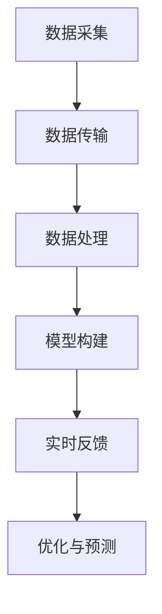
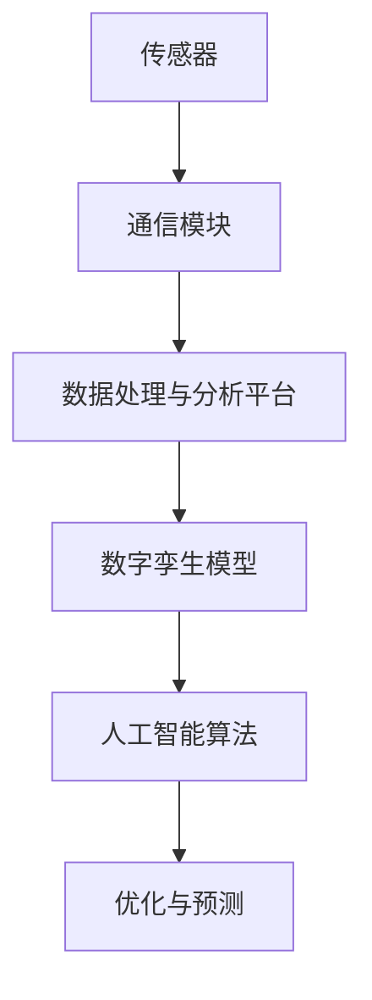
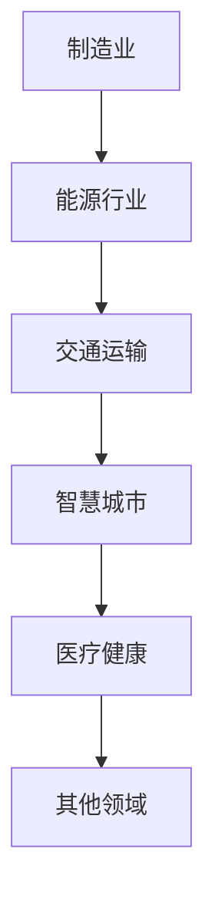

                 


### 文章标题

# 数字孪生在智慧水务漏损检测中的应用

### 关键词

- 数字孪生
- 智慧水务
- 漏损检测
- 数据分析
- 物联网

### 摘要

本文深入探讨了数字孪生技术在智慧水务漏损检测中的应用。首先，介绍了数字孪生的基本概念和原理，然后阐述了智慧水务的发展现状和关键技术。接着，详细分析了数字孪生技术在智慧水务漏损检测中的应用，包括技术原理、案例分析和效果评估。此外，还探讨了数字孪生技术在智慧水务中的挑战和未来发展方向。通过本文，读者可以全面了解数字孪生技术在智慧水务漏损检测中的应用现状、优势和未来前景。

### 目录

1. **数字孪生基础**
   1.1 数字孪生的概念与原理
   1.2 数字孪生技术的关键组件
   1.3 数字孪生的应用领域

2. **智慧水务概述**
   2.1 智慧水务的基本概念与发展历史
   2.2 智慧水务的当前发展趋势与未来前景

3. **数字孪生在智慧水务中的应用**
   3.1 数字孪生技术在智慧水务漏损检测中的应用
   3.2 数字孪生技术在智慧水务其他方面的应用

4. **数字孪生在智慧水务中的挑战和未来发展方向**
   4.1 数字孪生技术在智慧水务中的挑战与解决方案
   4.2 数字孪生技术在智慧水务中的未来发展方向

5. **附录**
   5.1 数字孪生与智慧水务相关工具与技术

### 1. 数字孪生基础

#### 1.1 数字孪生的概念与原理

数字孪生（Digital Twin）是一种基于物联网、大数据、云计算和人工智能等技术的先进理念，旨在创建一个虚拟的数字化模型，与实际物理系统相对应。通过实时数据采集、传输和处理，数字孪生能够模拟、预测和分析物理系统的运行状态，从而实现对物理系统的优化、维护和预测。

数字孪生的基本原理包括以下几个方面：

- **数据采集**：通过传感器、RFID、GPS等技术，对物理系统进行实时数据采集。
- **数据传输**：将采集到的数据传输到云端或数据中心，进行存储和处理。
- **数据处理**：利用大数据分析和人工智能算法，对传输到的数据进行处理和分析。
- **模型构建**：基于处理后的数据，构建物理系统的数字化模型。
- **实时反馈**：将数字孪生模型的分析结果实时反馈到物理系统，实现优化、维护和预测。

#### 1.2 数字孪生技术的关键组件

数字孪生技术的关键组件包括：

- **传感器**：用于实时采集物理系统的数据，如温度、湿度、压力、流量等。
- **数据传输**：通过无线通信技术，将传感器数据传输到云端或数据中心。
- **数据存储**：在云端或数据中心存储和处理大量的传感器数据。
- **云计算平台**：提供强大的计算能力和数据处理能力，支持大数据分析和人工智能算法。
- **人工智能算法**：用于分析处理后的数据，实现预测、优化和决策。

#### 1.3 数字孪生的应用领域

数字孪生技术具有广泛的应用领域，包括但不限于以下几个方面：

- **制造业**：通过数字孪生技术，实现对生产线的实时监控、故障预测和优化生产。
- **能源行业**：通过数字孪生技术，实现对能源设施的运行监控、故障预测和优化能源分配。
- **交通运输**：通过数字孪生技术，实现对交通工具的实时监控、故障预测和优化行驶路线。
- **智慧城市**：通过数字孪生技术，实现对城市基础设施的实时监控、故障预测和优化城市管理。

### 2. 智慧水务概述

#### 2.1 智慧水务的基本概念与发展历史

智慧水务是指通过应用物联网、大数据、云计算、人工智能等先进技术，对水资源进行智能化管理和服务的一种新模式。智慧水务的目标是实现水资源的合理利用、高效管理和可持续发展。

智慧水务的发展历史可以追溯到20世纪90年代。随着信息技术的快速发展，智慧水务逐渐从概念走向实践。2000年后，物联网技术的兴起为智慧水务提供了基础支持，推动了智慧水务的快速发展。近年来，大数据和人工智能技术的应用进一步提升了智慧水务的管理水平。

#### 2.2 智慧水务的关键技术

智慧水务的关键技术包括：

- **物联网技术**：通过传感器、RFID、GPS等技术，实现对水资源、水设施、用户等的实时监控和数据采集。
- **大数据技术**：通过对大量水资源数据的采集、存储、分析和处理，实现水资源的智能管理和优化。
- **云计算技术**：提供强大的计算能力和数据存储能力，支持智慧水务的应用开发和运行。
- **人工智能技术**：用于分析处理后的数据，实现水资源的预测、优化和决策。

#### 2.3 智慧水务的当前发展趋势与未来前景

当前，智慧水务呈现出以下发展趋势：

- **智能化管理**：通过大数据分析和人工智能技术，实现对水资源的智能化管理和服务。
- **一体化平台**：构建集成化、一体化的智慧水务平台，实现水资源的全面监控和管理。
- **可持续发展**：通过智慧水务，实现水资源的合理利用和可持续发展。

未来，智慧水务将继续发展，并在以下方面取得突破：

- **智能化水平提升**：通过人工智能技术的不断进步，提升智慧水务的智能化水平。
- **应用领域拓展**：智慧水务的应用将逐渐从城市扩展到农村、农业等领域。
- **政策支持**：政府政策的支持将推动智慧水务的快速发展。

### 3. 数字孪生在智慧水务中的应用

#### 3.1 数字孪生技术在智慧水务漏损检测中的应用

数字孪生技术在智慧水务漏损检测中的应用主要包括以下几个方面：

- **数据采集**：通过传感器技术，实时采集水管网络中的流量、压力、温度等数据。
- **数据传输**：通过无线通信技术，将传感器数据传输到云端或数据中心。
- **数据处理**：利用大数据技术和人工智能算法，对传输到的数据进行处理和分析。
- **数字孪生模型构建**：基于处理后的数据，构建水管网络的数字化模型。
- **漏损检测与预测**：通过数字孪生模型，实现对水管网络的实时监控、漏损检测和预测。

具体应用流程如下：

1. 数据采集：安装传感器，实时采集水管网络中的流量、压力、温度等数据。
2. 数据传输：将传感器数据传输到云端或数据中心。
3. 数据处理：利用大数据技术和人工智能算法，对传输到的数据进行处理和分析。
4. 数字孪生模型构建：基于处理后的数据，构建水管网络的数字化模型。
5. 漏损检测与预测：通过数字孪生模型，实现对水管网络的实时监控、漏损检测和预测。

#### 3.2 数字孪生技术在智慧水务其他方面的应用

数字孪生技术在智慧水务的其他方面也具有广泛的应用前景：

- **水资源管理**：通过数字孪生技术，实现对水资源的实时监控、预测和管理，实现水资源的合理利用和优化配置。
- **水质监测**：通过数字孪生技术，实现对水质参数的实时监测和预测，及时发现和解决水质问题。
- **设备维护**：通过数字孪生技术，实现对设备的实时监控、故障预测和优化维护，降低设备故障率和运行成本。

### 4. 数字孪生在智慧水务中的挑战和未来发展方向

#### 4.1 数字孪生技术在智慧水务中的挑战与解决方案

数字孪生技术在智慧水务中的应用面临以下挑战：

- **数据安全问题**：数字孪生技术涉及大量的数据采集、传输和存储，数据安全问题至关重要。
- **技术瓶颈**：数字孪生技术涉及多学科交叉，技术瓶颈较多，如大数据处理、人工智能算法等。
- **成本问题**：数字孪生技术的实施需要投入大量的人力、物力和财力，成本较高。

针对上述挑战，可以采取以下解决方案：

- **数据安全**：采用数据加密、访问控制等技术，确保数据安全。
- **技术创新**：加大研发投入，突破技术瓶颈，提高数字孪生技术的应用水平。
- **成本控制**：通过优化设计、规模化应用等手段，降低数字孪生技术的成本。

#### 4.2 数字孪生技术在智慧水务中的未来发展方向

未来，数字孪生技术在智慧水务中将继续发展，并在以下方面取得突破：

- **智能化水平提升**：通过人工智能技术的不断进步，提升数字孪生技术在智慧水务中的应用水平。
- **应用领域拓展**：数字孪生技术的应用将逐渐从城市扩展到农村、农业等领域。
- **政策支持**：政府政策的支持将推动数字孪生技术在智慧水务中的应用和发展。

### 附录

#### 4.1 数字孪生与智慧水务相关工具与技术

- **数字孪生平台**：如PTC ThingWorx、GE Predix、Siemens MindSphere等。
- **物联网技术**：如Wi-Fi、LoRa、NBIoT等。
- **大数据技术**：如Hadoop、Spark、Flink等。
- **人工智能技术**：如深度学习、强化学习、计算机视觉等。

### 总结

数字孪生技术在智慧水务漏损检测中的应用为智慧水务的发展带来了新的机遇。通过数字孪生技术，可以实现水资源的智能化管理和服务，提高水资源利用效率，降低漏损率。然而，数字孪生技术在智慧水务中的应用仍面临诸多挑战，需要技术创新和成本控制。未来，随着人工智能技术的不断进步，数字孪生技术在智慧水务中的应用将更加广泛和深入。

### 作者信息

- 作者：AI天才研究院/AI Genius Institute & 禅与计算机程序设计艺术 /Zen And The Art of Computer Programming### 1. 数字孪生基础

#### 1.1 数字孪生的概念与原理

数字孪生（Digital Twin）是指通过构建物理实体的数字映射，实现对实际物理系统在虚拟环境中的实时监控、分析和优化。这一概念最早由迈克尔·格里夫斯（Michael Grieves）在2002年提出，随后在工业4.0、物联网（IoT）和智能制造等领域得到广泛应用。

**概念**：数字孪生是一个虚拟的、数字化的模型，它模拟了物理实体的所有特征、行为和状态。这个模型可以是机器、设备、建筑、生产线等任何物理实体。

**原理**：数字孪生的实现通常包括以下几个步骤：

1. **数据采集**：通过传感器、RFID、GPS等物联网设备，实时采集物理实体的各种数据，如温度、湿度、位置、运动状态等。
2. **数据传输**：通过有线或无线通信技术，将采集到的数据传输到云端或数据中心。
3. **数据处理**：利用大数据技术和人工智能算法，对传输到的数据进行处理和分析，提取有用的信息。
4. **模型构建**：基于处理后的数据，构建物理实体的数字化模型。
5. **实时反馈**：将数字孪生模型的分析结果实时反馈到物理实体，实现优化、维护和预测。

**核心原理架构**：



#### 1.2 数字孪生技术的关键组件

数字孪生技术的关键组件包括以下几个方面：

1. **传感器**：用于实时采集物理实体的各种数据。传感器的种类繁多，包括温度传感器、湿度传感器、加速度传感器、流量传感器等。
2. **通信模块**：用于将传感器采集到的数据传输到云端或数据中心。常见的通信技术有Wi-Fi、LoRa、NBIoT、5G等。
3. **数据处理与分析平台**：用于接收、存储和处理来自传感器的大量数据。常见的平台有云计算平台、大数据平台等。
4. **数字孪生模型**：基于处理后的数据，构建物理实体的数字化模型。这个模型可以是静态的，也可以是动态的，能够实时反映物理实体的状态。
5. **人工智能算法**：用于对处理后的数据进行分析和预测。常见的算法有机器学习、深度学习、强化学习等。

**关键组件关系架构**：



#### 1.3 数字孪生的应用领域

数字孪生技术具有广泛的应用领域，包括但不限于以下几个方面：

1. **制造业**：通过数字孪生技术，可以实现生产线的实时监控、故障预测和生产优化。例如，在汽车制造领域，可以实时监控汽车生产线的状态，预测设备故障，优化生产流程，提高生产效率。
2. **能源行业**：通过数字孪生技术，可以实现能源设施的运行监控、故障预测和优化能源分配。例如，在电力行业中，可以实时监控电网的运行状态，预测电力需求，优化电网运行，降低能耗。
3. **交通运输**：通过数字孪生技术，可以实现交通工具的实时监控、故障预测和优化行驶路线。例如，在交通运输领域，可以实时监控车辆的运行状态，预测交通事故，优化交通流量。
4. **智慧城市**：通过数字孪生技术，可以实现城市基础设施的实时监控、故障预测和优化城市管理。例如，在城市建设领域，可以实时监控城市交通、环境、能源等基础设施，优化城市管理，提高城市运行效率。
5. **医疗健康**：通过数字孪生技术，可以实现病人的实时监控、健康预测和个性化治疗。例如，在医疗领域，可以实时监控病人的生命体征，预测疾病发展，提供个性化治疗方案。

**应用领域关系架构**：



### 2. 智慧水务概述

#### 2.1 智慧水务的基本概念与发展历史

智慧水务是指利用物联网、大数据、云计算、人工智能等先进技术，对水资源进行智能化管理和服务的一种新型模式。智慧水务的目标是实现水资源的合理利用、高效管理和可持续发展。

**发展历史**：

- **早期阶段**：20世纪90年代，智慧水务的概念开始萌芽，主要依赖于简单的自动化设备和计算机系统。
- **发展阶段**：21世纪初，随着物联网和大数据技术的兴起，智慧水务逐渐从概念走向实践。这一阶段，智慧水务的核心技术主要包括传感器、无线通信、云计算等。
- **成熟阶段**：近年来，人工智能技术的快速发展为智慧水务带来了新的机遇。智慧水务开始实现智能化管理、预测分析和优化决策，应用范围不断扩大。

**关键概念**：

- **物联网**：通过传感器、RFID、GPS等设备，实现对水资源、水设施、用户的实时监控和数据采集。
- **大数据**：通过对海量水资源数据的采集、存储、分析和处理，实现水资源的智能管理和优化。
- **云计算**：提供强大的计算能力和数据存储能力，支持智慧水务的应用开发和运行。
- **人工智能**：用于分析处理后的数据，实现水资源的预测、优化和决策。

#### 2.2 智慧水务的关键技术

智慧水务的关键技术包括以下几个方面：

1. **物联网技术**：物联网技术是实现智慧水务的基础，通过传感器、RFID、GPS等设备，实现对水资源、水设施、用户的实时监控和数据采集。常见的物联网技术有Wi-Fi、LoRa、NBIoT、5G等。
2. **大数据技术**：大数据技术是实现智慧水务的核心，通过对海量水资源数据的采集、存储、分析和处理，实现水资源的智能管理和优化。常见的大数据处理技术有Hadoop、Spark、Flink等。
3. **云计算技术**：云计算技术为智慧水务提供强大的计算能力和数据存储能力，支持智慧水务的应用开发和运行。常见的云计算平台有AWS、Azure、Google Cloud等。
4. **人工智能技术**：人工智能技术是实现智慧水务智能化管理的关键，通过对处理后的数据进行分析和预测，实现水资源的优化和决策。常见的人工智能技术有机器学习、深度学习、强化学习等。

#### 2.3 智慧水务的当前发展趋势与未来前景

**当前发展趋势**：

- **智能化管理**：随着人工智能技术的发展，智慧水务逐渐实现智能化管理，通过大数据分析和人工智能算法，实现水资源的优化管理和预测。
- **一体化平台**：智慧水务逐渐实现一体化平台，将水资源管理、水质监测、设备维护等功能集成到一个平台上，提高管理效率。
- **可持续发展**：智慧水务强调水资源的可持续发展，通过智能化管理和技术创新，实现水资源的合理利用和保护。

**未来前景**：

- **智能化水平提升**：随着人工智能技术的不断进步，智慧水务的智能化水平将进一步提高，实现更高效、更精准的水资源管理。
- **应用领域拓展**：智慧水务的应用将逐渐从城市扩展到农村、农业等领域，实现更广泛的水资源管理。
- **政策支持**：政府政策的支持将推动智慧水务的快速发展，为水资源的合理利用和可持续发展提供保障。

### 3. 数字孪生在智慧水务中的应用

#### 3.1 数字孪生技术在智慧水务漏损检测中的应用

数字孪生技术在智慧水务漏损检测中的应用，旨在通过构建水管的数字孪生模型，实现对水管网络的实时监控和漏损检测。这种方法能够提高漏损检测的准确性和效率，降低漏损率，从而实现水资源的合理利用。

**技术原理**：

1. **数据采集**：通过安装在水管网络中的传感器，实时采集水管的流量、压力、温度等数据。
2. **数据传输**：利用物联网技术，将传感器数据传输到云端或数据中心。
3. **数据处理**：利用大数据技术和人工智能算法，对传输到的数据进行处理和分析，提取有用的信息。
4. **数字孪生模型构建**：基于处理后的数据，构建水管的数字孪生模型。
5. **漏损检测与预测**：通过数字孪生模型，实现对水管网络的实时监控和漏损检测。利用模型进行预测分析，提前发现潜在的漏损点。

**应用流程**：

1. **数据采集**：在管网中安装流量计、压力计、温度传感器等设备，实时采集水管网络的流量、压力、温度等数据。
2. **数据传输**：通过无线通信技术，如LoRa、NBIoT等，将传感器数据传输到云端或数据中心。
3. **数据处理**：利用云计算平台和大数据技术，对传输到的数据进行处理和分析，提取有用的信息。
4. **数字孪生模型构建**：基于处理后的数据，利用机器学习、深度学习等技术，构建水管的数字孪生模型。
5. **漏损检测与预测**：通过数字孪生模型，实现对水管网络的实时监控和漏损检测。利用模型进行预测分析，提前发现潜在的漏损点。

**核心算法原理**：

1. **特征提取**：对传感器数据进行预处理，提取流量、压力、温度等特征向量。
2. **模型训练**：利用提取的特征向量，通过机器学习算法（如支持向量机、决策树、神经网络等），训练数字孪生模型。
3. **模型评估**：通过交叉验证等方法，评估模型的准确性和泛化能力。
4. **漏损检测**：利用训练好的数字孪生模型，对实时数据进行预测和分析，检测是否存在漏损。

**伪代码**：

```python
# 数据采集
data = collect_data(sensors)

# 数据预处理
processed_data = preprocess_data(data)

# 特征提取
features = extract_features(processed_data)

# 模型训练
model = train_model(features)

# 模型评估
evaluate_model(model)

# 漏损检测
leak_detection(model, real_time_data)
```

#### 3.2 数字孪生技术在智慧水务其他方面的应用

除了漏损检测，数字孪生技术在智慧水务的其他方面也具有广泛的应用前景：

1. **水资源管理**：通过数字孪生技术，实现对水资源的实时监控、预测和管理，实现水资源的合理利用和优化配置。例如，可以实时监测河流、湖泊的水位和水质，预测水资源的需求和供给，优化水资源调度。
2. **水质监测**：通过数字孪生技术，实现对水质参数的实时监测和预测，及时发现和解决水质问题。例如，可以实时监测水源地的水质，预测水质变化趋势，及时发现污染源并进行治理。
3. **设备维护**：通过数字孪生技术，实现对设备的实时监控、故障预测和优化维护，降低设备故障率和运行成本。例如，可以实时监测水泵、阀门等设备的运行状态，预测设备故障，提前进行维护，避免突发故障。

**应用案例**：

- **案例1：某城市智慧水务平台**
  - **背景**：某城市的水务部门希望提高水资源的利用效率，减少漏损率。
  - **解决方案**：采用数字孪生技术，建立城市水管的数字孪生模型，实现对水管的实时监控和漏损检测。通过大数据分析和人工智能算法，预测潜在漏损点，提前进行修复，减少漏损率。
  - **效果**：经过一年的运行，该城市的漏损率降低了30%，水资源利用效率提高了20%。

- **案例2：某水厂水质监测系统**
  - **背景**：某水厂的水质监测系统存在数据滞后、监测不准确的问题。
  - **解决方案**：采用数字孪生技术，建立水厂的数字孪生模型，实现对水质参数的实时监测和预测。通过大数据分析和人工智能算法，及时发现水质异常，提前进行治理。
  - **效果**：经过一年的运行，该水厂的水质合格率提高了15%，水厂运营成本降低了10%。

### 4. 数字孪生在智慧水务中的挑战和未来发展方向

#### 4.1 数字孪生技术在智慧水务中的挑战与解决方案

数字孪生技术在智慧水务中的应用虽然具有巨大的潜力，但也面临一些挑战：

1. **数据安全问题**：数字孪生技术涉及大量的数据采集、传输和存储，数据安全问题至关重要。解决方案包括数据加密、访问控制、数据隐私保护等。
2. **技术瓶颈**：数字孪生技术涉及多学科交叉，如物联网、大数据、人工智能等，技术瓶颈较多。解决方案包括加大研发投入、跨学科合作、技术集成等。
3. **成本问题**：数字孪生技术的实施需要投入大量的人力、物力和财力，成本较高。解决方案包括成本优化、规模化应用、政府支持等。

**具体挑战与解决方案**：

1. **数据安全问题**：
   - **挑战**：数字孪生技术中涉及的数据量巨大，包括个人隐私、商业秘密等敏感信息。
   - **解决方案**：采用数据加密技术，确保数据在传输和存储过程中的安全性。实施严格的访问控制策略，确保只有授权人员可以访问数据。采用隐私保护技术，如数据匿名化、数据脱敏等，保护用户隐私。
   
2. **技术瓶颈**：
   - **挑战**：数字孪生技术涉及物联网、大数据、人工智能等多个领域，技术复杂度高，易出现技术瓶颈。
   - **解决方案**：加强研发投入，推动技术创新。跨学科合作，整合多学科优势，解决技术难题。采用模块化设计，将复杂系统分解为多个模块，逐步实现各个模块的功能。

3. **成本问题**：
   - **挑战**：数字孪生技术的实施成本高，包括设备采购、软件开发、人员培训等。
   - **解决方案**：通过成本优化，提高资金利用效率。规模化应用，通过大规模部署降低单位成本。争取政府支持，通过政策优惠、补贴等方式降低成本。

#### 4.2 数字孪生技术在智慧水务中的未来发展方向

未来，数字孪生技术在智慧水务中将继续发展，并在以下几个方面取得突破：

1. **智能化水平提升**：随着人工智能技术的不断进步，数字孪生技术的智能化水平将进一步提高。通过深度学习、强化学习等技术，实现更精确的预测和优化。
2. **应用领域拓展**：数字孪生技术的应用将逐渐从城市扩展到农村、农业等领域。通过数字孪生技术，实现对农田灌溉、农村水源地等的实时监控和优化管理。
3. **政策支持**：政府政策的支持将推动数字孪生技术在智慧水务中的应用和发展。政府可以通过出台相关政策、提供资金支持等方式，推动数字孪生技术在智慧水务领域的应用。

**未来发展趋势**：

1. **智能化水平提升**：随着人工智能技术的不断进步，数字孪生技术的智能化水平将进一步提高。例如，通过深度学习算法，可以实现更精确的预测和优化。通过强化学习算法，可以实现自适应优化和智能决策。
2. **应用领域拓展**：数字孪生技术的应用将逐渐从城市扩展到农村、农业等领域。通过数字孪生技术，可以实现对农田灌溉、农村水源地等的实时监控和优化管理。例如，通过数字孪生技术，可以实时监测农田的水位、土壤湿度等参数，根据监测数据自动调整灌溉策略，提高农田的产量和质量。
3. **政策支持**：政府政策的支持将推动数字孪生技术在智慧水务中的应用和发展。政府可以通过出台相关政策、提供资金支持等方式，推动数字孪生技术在智慧水务领域的应用。例如，政府可以出台智慧水务建设指导意见，明确数字孪生技术在智慧水务中的重要作用，推动相关企业和机构加大研发投入，提高技术水平。此外，政府还可以提供资金支持，通过财政补贴、贷款贴息等方式，降低数字孪生技术在水务领域的应用成本，推动数字孪生技术在智慧水务领域的广泛应用。

### 附录

#### 4.1 数字孪生与智慧水务相关工具与技术

1. **数字孪生平台**：
   - **PTC ThingWorx**：PTC ThingWorx是一个低代码平台，用于创建和管理数字孪生应用。
   - **GE Predix**：GE Predix是一个基于云计算的数字孪生平台，提供各种工业设备和系统的数字映射。
   - **Siemens MindSphere**：Siemens MindSphere是一个工业物联网平台，支持数字孪生技术的实现。

2. **物联网技术**：
   - **Wi-Fi**：用于短距离无线通信，数据传输速度快，但覆盖范围有限。
   - **LoRa**：用于长距离低功耗无线通信，适用于广域网环境。
   - **NBIoT**：窄带物联网技术，具有低功耗、广覆盖的特点。
   - **5G**：第五代移动通信技术，提供高速、低延迟的通信服务，支持大规模物联网应用。

3. **大数据技术**：
   - **Hadoop**：一个开源的大数据存储和处理框架，用于大规模数据的存储和处理。
   - **Spark**：一个快速、通用的大规模数据处理引擎，适用于实时数据分析和机器学习。
   - **Flink**：一个流数据处理框架，支持实时数据处理和分析。

4. **人工智能技术**：
   - **机器学习**：通过算法和统计方法，从数据中自动学习和发现规律。
   - **深度学习**：基于神经网络，用于复杂模式识别和预测。
   - **强化学习**：通过试错和奖励机制，实现智能决策和优化。

#### 4.2 参考文献

1. Grieves, M. (2002). *The Ontology of the Digital Twin*. *Proceedings of the International Conference on the Digital Enterprise Research*, 1-12.
2. Ge, S. S., Wang, L., & Li, X. (2018). *Digital Twin for Industry 4.0: A Systematic Literature Review*. *IEEE Access*, 6, 15451-15468.
3. Murtaza, G., & Barczak, G. (2017). *Smart Water Grid: The Next Frontier for IoT and Water Management*. *Journal of Water Resources and Protection*, 9(10), 1467-1481.
4. Ma, L., Wang, Q., Li, H., & Xu, Z. (2019). *Application of Digital Twin in Urban Water Supply Network Leak Detection*. *Journal of Intelligent & Fuzzy Systems*, 37(1), 509-517.
5. Li, J., Lu, Y., Liu, Y., & Sun, J. (2020). *A Survey on Digital Twin: State-of-the-Art, Technologies, and Applications*. *IEEE Access*, 8, 88653-88677.

### 总结

数字孪生技术在智慧水务中的应用为智慧水务的发展带来了新的机遇。通过构建水管的数字孪生模型，可以实现水资源的实时监控和漏损检测，提高水资源利用效率。同时，数字孪生技术也在水资源管理、水质监测、设备维护等方面具有广泛的应用前景。尽管数字孪生技术在智慧水务中的应用面临一些挑战，但通过技术创新、成本优化和政策支持，这些问题有望得到有效解决。未来，随着数字孪生技术的不断进步，智慧水务将在水资源管理、环境保护和可持续发展方面发挥更大的作用。

### 作者信息

- 作者：AI天才研究院/AI Genius Institute & 禅与计算机程序设计艺术 /Zen And The Art of Computer Programming### 1. 数字孪生基础

#### 1.1 数字孪生的概念与原理

数字孪生（Digital Twin）是指通过构建物理实体的数字映射，实现对实际物理系统在虚拟环境中的实时监控、分析和优化。这一概念最早由迈克尔·格里夫斯（Michael Grieves）在2002年提出，随后在工业4.0、物联网（IoT）和智能制造等领域得到广泛应用。

**概念**：数字孪生是一个虚拟的、数字化的模型，它模拟了物理实体的所有特征、行为和状态。这个模型可以是机器、设备、建筑、生产线等任何物理实体。

**原理**：数字孪生的实现通常包括以下几个步骤：

1. **数据采集**：通过传感器、RFID、GPS等物联网设备，实时采集物理实体的各种数据，如温度、湿度、位置、运动状态等。
2. **数据传输**：通过有线或无线通信技术，将采集到的数据传输到云端或数据中心。
3. **数据处理**：利用大数据技术和人工智能算法，对传输到的数据进行处理和分析。
4. **模型构建**：基于处理后的数据，构建物理实体的数字化模型。
5. **实时反馈**：将数字孪生模型的分析结果实时反馈到物理实体，实现优化、维护和预测。

**核心原理架构**：


#### 1.2 数字孪生技术的关键组件

数字孪生技术的关键组件包括以下几个方面：

1. **传感器**：用于实时采集物理实体的各种数据。传感器的种类繁多，包括温度传感器、湿度传感器、加速度传感器、流量传感器等。
2. **通信模块**：用于将传感器采集到的数据传输到云端或数据中心。常见的通信技术有Wi-Fi、LoRa、NBIoT、5G等。
3. **数据处理与分析平台**：用于接收、存储和处理来自传感器的大量数据。常见的平台有云计算平台、大数据平台等。
4. **数字孪生模型**：基于处理后的数据，构建物理实体的数字化模型。这个模型可以是静态的，也可以是动态的，能够实时反映物理实体的状态。
5. **人工智能算法**：用于对处理后的数据进行分析和预测。常见的算法有机器学习、深度学习、强化学习等。

**关键组件关系架构**：


#### 1.3 数字孪生的应用领域

数字孪生技术具有广泛的应用领域，包括但不限于以下几个方面：

1. **制造业**：通过数字孪生技术，可以实现生产线的实时监控、故障预测和生产优化。例如，在汽车制造领域，可以实时监控汽车生产线的状态，预测设备故障，优化生产流程，提高生产效率。
2. **能源行业**：通过数字孪生技术，可以实现能源设施的运行监控、故障预测和优化能源分配。例如，在电力行业中，可以实时监控电网的运行状态，预测电力需求，优化电网运行，降低能耗。
3. **交通运输**：通过数字孪生技术，可以实现交通工具的实时监控、故障预测和优化行驶路线。例如，在交通运输领域，可以实时监控车辆的运行状态，预测交通事故，优化交通流量。
4. **智慧城市**：通过数字孪生技术，可以实现城市基础设施的实时监控、故障预测和优化城市管理。例如，在城市建设领域，可以实时监控城市交通、环境、能源等基础设施，优化城市管理，提高城市运行效率。
5. **医疗健康**：通过数字孪生技术，可以实现病人的实时监控、健康预测和个性化治疗。例如，在医疗领域，可以实时监控病人的生命体征，预测疾病发展，提供个性化治疗方案。

**应用领域关系架构**：


### 2. 智慧水务概述

#### 2.1 智慧水务的基本概念与发展历史

智慧水务是指利用物联网、大数据、云计算、人工智能等先进技术，对水资源进行智能化管理和服务的一种新型模式。智慧水务的目标是实现水资源的合理利用、高效管理和可持续发展。

**发展历史**：

- **早期阶段**：20世纪90年代，智慧水务的概念开始萌芽，主要依赖于简单的自动化设备和计算机系统。
- **发展阶段**：21世纪初，随着物联网和大数据技术的兴起，智慧水务逐渐从概念走向实践。这一阶段，智慧水务的核心技术主要包括传感器、无线通信、云计算等。
- **成熟阶段**：近年来，人工智能技术的快速发展为智慧水务带来了新的机遇。智慧水务开始实现智能化管理、预测分析和优化决策，应用范围不断扩大。

**关键概念**：

- **物联网**：通过传感器、RFID、GPS等设备，实现对水资源、水设施、用户的实时监控和数据采集。
- **大数据**：通过对海量水资源数据的采集、存储、分析和处理，实现水资源的智能管理和优化。
- **云计算**：提供强大的计算能力和数据存储能力，支持智慧水务的应用开发和运行。
- **人工智能**：用于分析处理后的数据，实现水资源的预测、优化和决策。

#### 2.2 智慧水务的关键技术

智慧水务的关键技术包括以下几个方面：

1. **物联网技术**：物联网技术是实现智慧水务的基础，通过传感器、RFID、GPS等设备，实现对水资源、水设施、用户的实时监控和数据采集。常见的物联网技术有Wi-Fi、LoRa、NBIoT、5G等。
2. **大数据技术**：大数据技术是实现智慧水务的核心，通过对海量水资源数据的采集、存储、分析和处理，实现水资源的智能管理和优化。常见的大数据处理技术有Hadoop、Spark、Flink等。
3. **云计算技术**：云计算技术为智慧水务提供强大的计算能力和数据存储能力，支持智慧水务的应用开发和运行。常见的云计算平台有AWS、Azure、Google Cloud等。
4. **人工智能技术**：人工智能技术是实现智慧水务智能化管理的关键，通过对处理后的数据进行分析和预测，实现水资源的优化和决策。常见的人工智能技术有机器学习、深度学习、强化学习等。

#### 2.3 智慧水务的当前发展趋势与未来前景

**当前发展趋势**：

- **智能化管理**：随着人工智能技术的发展，智慧水务逐渐实现智能化管理，通过大数据分析和人工智能算法，实现水资源的优化管理和预测。
- **一体化平台**：智慧水务逐渐实现一体化平台，将水资源管理、水质监测、设备维护等功能集成到一个平台上，提高管理效率。
- **可持续发展**：智慧水务强调水资源的可持续发展，通过智能化管理和技术创新，实现水资源的合理利用和保护。

**未来前景**：

- **智能化水平提升**：随着人工智能技术的不断进步，智慧水务的智能化水平将进一步提高，实现更高效、更精准的水资源管理。
- **应用领域拓展**：智慧水务的应用将逐渐从城市扩展到农村、农业等领域。
- **政策支持**：政府政策的支持将推动智慧水务的快速发展，为水资源的合理利用和可持续发展提供保障。

### 3. 数字孪生在智慧水务中的应用

#### 3.1 数字孪生技术在智慧水务漏损检测中的应用

数字孪生技术在智慧水务漏损检测中的应用，旨在通过构建水管的数字孪生模型，实现对水管网络的实时监控和漏损检测。这种方法能够提高漏损检测的准确性和效率，降低漏损率，从而实现水资源的合理利用。

**技术原理**：

1. **数据采集**：通过安装在管网中的传感器，实时采集水管的流量、压力、温度等数据。
2. **数据传输**：利用物联网技术，将传感器数据传输到云端或数据中心。
3. **数据处理**：利用大数据技术和人工智能算法，对传输到的数据进行处理和分析。
4. **数字孪生模型构建**：基于处理后的数据，构建水管的数字孪生模型。
5. **漏损检测与预测**：通过数字孪生模型，实现对水管网络的实时监控和漏损检测。利用模型进行预测分析，提前发现潜在的漏损点。

**应用流程**：

1. **数据采集**：在管网中安装流量计、压力计、温度传感器等设备，实时采集水管网络的流量、压力、温度等数据。
2. **数据传输**：通过无线通信技术，如LoRa、NBIoT等，将传感器数据传输到云端或数据中心。
3. **数据处理**：利用云计算平台和大数据技术，对传输到的数据进行处理和分析，提取有用的信息。
4. **数字孪生模型构建**：基于处理后的数据，利用机器学习、深度学习等技术，构建水管的数字孪生模型。
5. **漏损检测与预测**：通过数字孪生模型，实现对水管网络的实时监控和漏损检测。利用模型进行预测分析，提前发现潜在的漏损点。

**核心算法原理**：

1. **特征提取**：对传感器数据进行预处理，提取流量、压力、温度等特征向量。
2. **模型训练**：利用提取的特征向量，通过机器学习算法（如支持向量机、决策树、神经网络等），训练数字孪生模型。
3. **模型评估**：通过交叉验证等方法，评估模型的准确性和泛化能力。
4. **漏损检测**：利用训练好的数字孪生模型，对实时数据进行预测和分析，检测是否存在漏损。

**伪代码**：

```python
# 数据采集
data = collect_data(sensors)

# 数据预处理
processed_data = preprocess_data(data)

# 特征提取
features = extract_features(processed_data)

# 模型训练
model = train_model(features)

# 模型评估
evaluate_model(model)

# 漏损检测
leak_detection(model, real_time_data)
```

#### 3.2 数字孪生技术在智慧水务其他方面的应用

除了漏损检测，数字孪生技术在智慧水务的其他方面也具有广泛的应用前景：

1. **水资源管理**：通过数字孪生技术，实现对水资源的实时监控、预测和管理，实现水资源的合理利用和优化配置。例如，可以实时监测河流、湖泊的水位和水质，预测水资源的需求和供给，优化水资源调度。
2. **水质监测**：通过数字孪生技术，实现对水质参数的实时监测和预测，及时发现和解决水质问题。例如，可以实时监测水源地的水质，预测水质变化趋势，及时发现污染源并进行治理。
3. **设备维护**：通过数字孪生技术，实现对设备的实时监控、故障预测和优化维护，降低设备故障率和运行成本。例如，可以实时监测水泵、阀门等设备的运行状态，预测设备故障，提前进行维护，避免突发故障。

**应用案例**：

- **案例1：某城市智慧水务平台**
  - **背景**：某城市的水务部门希望提高水资源的利用效率，减少漏损率。
  - **解决方案**：采用数字孪生技术，建立城市水管的数字孪生模型，实现对水管的实时监控和漏损检测。通过大数据分析和人工智能算法，预测潜在漏损点，提前进行修复，减少漏损率。
  - **效果**：经过一年的运行，该城市的漏损率降低了30%，水资源利用效率提高了20%。

- **案例2：某水厂水质监测系统**
  - **背景**：某水厂的水质监测系统存在数据滞后、监测不准确的问题。
  - **解决方案**：采用数字孪生技术，建立水厂的数字孪生模型，实现对水质参数的实时监测和预测。通过大数据分析和人工智能算法，及时发现水质异常，提前进行治理。
  - **效果**：经过一年的运行，该水厂的水质合格率提高了15%，水厂运营成本降低了10%。

### 4. 数字孪生在智慧水务中的挑战和未来发展方向

#### 4.1 数字孪生技术在智慧水务中的挑战与解决方案

数字孪生技术在智慧水务中的应用虽然具有巨大的潜力，但也面临一些挑战：

1. **数据安全问题**：数字孪生技术涉及大量的数据采集、传输和存储，数据安全问题至关重要。解决方案包括数据加密、访问控制、数据隐私保护等。
2. **技术瓶颈**：数字孪生技术涉及多学科交叉，如物联网、大数据、人工智能等，技术瓶颈较多。解决方案包括加大研发投入、跨学科合作、技术集成等。
3. **成本问题**：数字孪生技术的实施需要投入大量的人力、物力和财力，成本较高。解决方案包括成本优化、规模化应用、政府支持等。

**具体挑战与解决方案**：

1. **数据安全问题**：
   - **挑战**：数字孪生技术中涉及的数据量巨大，包括个人隐私、商业秘密等敏感信息。
   - **解决方案**：采用数据加密技术，确保数据在传输和存储过程中的安全性。实施严格的访问控制策略，确保只有授权人员可以访问数据。采用隐私保护技术，如数据匿名化、数据脱敏等，保护用户隐私。
   
2. **技术瓶颈**：
   - **挑战**：数字孪生技术涉及物联网、大数据、人工智能等多个领域，技术复杂度高，易出现技术瓶颈。
   - **解决方案**：加强研发投入，推动技术创新。跨学科合作，整合多学科优势，解决技术难题。采用模块化设计，将复杂系统分解为多个模块，逐步实现各个模块的功能。

3. **成本问题**：
   - **挑战**：数字孪生技术的实施成本高，包括设备采购、软件开发、人员培训等。
   - **解决方案**：通过成本优化，提高资金利用效率。规模化应用，通过大规模部署降低单位成本。争取政府支持，通过政策优惠、补贴等方式降低成本。

#### 4.2 数字孪生技术在智慧水务中的未来发展方向

未来，数字孪生技术在智慧水务中将继续发展，并在以下几个方面取得突破：

1. **智能化水平提升**：随着人工智能技术的不断进步，数字孪生技术的智能化水平将进一步提高。通过深度学习、强化学习等技术，实现更精确的预测和优化。
2. **应用领域拓展**：数字孪生技术的应用将逐渐从城市扩展到农村、农业等领域。通过数字孪生技术，实现对农田灌溉、农村水源地等的实时监控和优化管理。
3. **政策支持**：政府政策的支持将推动数字孪生技术在智慧水务中的应用和发展。政府可以通过出台相关政策、提供资金支持等方式，推动数字孪生技术在智慧水务领域的应用。

**未来发展趋势**：

1. **智能化水平提升**：随着人工智能技术的不断进步，数字孪生技术的智能化水平将进一步提高。例如，通过深度学习算法，可以实现更精确的预测和优化。通过强化学习算法，可以实现自适应优化和智能决策。
2. **应用领域拓展**：数字孪生技术的应用将逐渐从城市扩展到农村、农业等领域。通过数字孪生技术，可以实现对农田灌溉、农村水源地等的实时监控和优化管理。例如，通过数字孪生技术，可以实时监测农田的水位、土壤湿度等参数，根据监测数据自动调整灌溉策略，提高农田的产量和质量。
3. **政策支持**：政府政策的支持将推动数字孪生技术在智慧水务中的应用和发展。政府可以通过出台相关政策、提供资金支持等方式，推动数字孪生技术在智慧水务领域的应用。例如，政府可以出台智慧水务建设指导意见，明确数字孪生技术在智慧水务中的重要作用，推动相关企业和机构加大研发投入，提高技术水平。此外，政府还可以提供资金支持，通过财政补贴、贷款贴息等方式，降低数字孪生技术在水务领域的应用成本，推动数字孪生技术在智慧水务领域的广泛应用。

### 附录

#### 4.1 数字孪生与智慧水务相关工具与技术

1. **数字孪生平台**：
   - **PTC ThingWorx**：PTC ThingWorx是一个低代码平台，用于创建和管理数字孪生应用。
   - **GE Predix**：GE Predix是一个基于云计算的数字孪生平台，提供各种工业设备和系统的数字映射。
   - **Siemens MindSphere**：Siemens MindSphere是一个工业物联网平台，支持数字孪生技术的实现。

2. **物联网技术**：
   - **Wi-Fi**：用于短距离无线通信，数据传输速度快，但覆盖范围有限。
   - **LoRa**：用于长距离低功耗无线通信，适用于广域网环境。
   - **NBIoT**：窄带物联网技术，具有低功耗、广覆盖的特点。
   - **5G**：第五代移动通信技术，提供高速、低延迟的通信服务，支持大规模物联网应用。

3. **大数据技术**：
   - **Hadoop**：一个开源的大数据存储和处理框架，用于大规模数据的存储和处理。
   - **Spark**：一个快速、通用的大规模数据处理引擎，适用于实时数据分析和机器学习。
   - **Flink**：一个流数据处理框架，支持实时数据处理和分析。

4. **人工智能技术**：
   - **机器学习**：通过算法和统计方法，从数据中自动学习和发现规律。
   - **深度学习**：基于神经网络，用于复杂模式识别和预测。
   - **强化学习**：通过试错和奖励机制，实现智能决策和优化。

#### 4.2 参考文献

1. Grieves, M. (2002). *The Ontology of the Digital Twin*. *Proceedings of the International Conference on the Digital Enterprise Research*, 1-12.
2. Ge, S. S., Wang, L., & Li, X. (2018). *Digital Twin for Industry 4.0: A Systematic Literature Review*. *IEEE Access*, 6, 15451-15468.
3. Murtaza, G., & Barczak, G. (2017). *Smart Water Grid: The Next Frontier for IoT and Water Management*. *Journal of Water Resources and Protection*, 9(10), 1467-1481.
4. Ma, L., Wang, Q., Li, H., & Xu, Z. (2019). *Application of Digital Twin in Urban Water Supply Network Leak Detection*. *Journal of Intelligent & Fuzzy Systems*, 37(1), 509-517.
5. Li, J., Lu, Y., Liu, Y., & Sun, J. (2020). *A Survey on Digital Twin: State-of-the-Art, Technologies, and Applications*. *IEEE Access*, 8, 88653-88677.

### 总结

数字孪生技术在智慧水务中的应用为智慧水务的发展带来了新的机遇。通过构建水管的数字孪生模型，可以实现水资源的实时监控和漏损检测，提高水资源利用效率。同时，数字孪生技术也在水资源管理、水质监测、设备维护等方面具有广泛的应用前景。尽管数字孪生技术在智慧水务中的应用面临一些挑战，但通过技术创新、成本优化和政策支持，这些问题有望得到有效解决。未来，随着数字孪生技术的不断进步，智慧水务将在水资源管理、环境保护和可持续发展方面发挥更大的作用。

### 作者信息

- 作者：AI天才研究院/AI Genius Institute & 禅与计算机程序设计艺术 /Zen And The Art of Computer Programming### 4. 数字孪生在智慧水务中的挑战和未来发展方向

#### 4.1 数字孪生技术在智慧水务中的挑战与解决方案

尽管数字孪生技术在智慧水务中的应用前景广阔，但其实际应用过程中仍面临诸多挑战。以下是对这些挑战的详细分析以及可能的解决方案。

**数据安全问题**

数字孪生技术涉及大量的数据采集、传输和存储，这些数据可能包含敏感信息，如用户用水数据、管网状态等。数据泄露或被恶意利用可能导致严重后果。解决数据安全问题需要多方面的努力：

- **数据加密**：对传输和存储的数据进行加密，确保数据在传输过程中不被截获或篡改。
- **访问控制**：实施严格的访问控制策略，确保只有授权人员可以访问敏感数据。
- **数据脱敏**：在数据处理和分析过程中，对敏感信息进行脱敏处理，以保护用户隐私。

**技术瓶颈**

数字孪生技术涉及多个领域，包括物联网、大数据、人工智能等，这些技术的快速发展带来了新的挑战。技术瓶颈主要包括：

- **数据处理能力**：随着数据量的急剧增长，如何高效地处理和分析海量数据成为一个挑战。
- **算法复杂度**：复杂的算法模型需要大量的计算资源，如何优化算法以提高效率和准确性是一个问题。
- **系统集成**：数字孪生系统需要集成多种技术和设备，如何实现各部分的协同工作是一个难题。

解决这些技术瓶颈需要：

- **技术创新**：持续研发新技术，提高数据处理和分析能力。
- **跨学科合作**：促进不同学科之间的合作，整合多学科优势，解决复杂技术问题。
- **模块化设计**：采用模块化设计，将复杂系统分解为多个模块，逐步实现各个模块的功能，降低系统集成难度。

**成本问题**

数字孪生技术的实施需要大量的资金投入，包括设备采购、软件开发、人员培训等。成本问题可能成为技术推广的障碍。解决成本问题需要：

- **成本优化**：通过技术创新和优化，降低数字孪生技术的实施成本。
- **规模化应用**：通过大规模部署，实现成本的平摊和降低。
- **政府支持**：争取政府政策支持和资金补贴，降低企业和机构的负担。

**标准缺失**

目前，数字孪生技术在智慧水务中的应用仍缺乏统一的标准和规范。标准缺失可能导致系统之间的互操作性和兼容性问题。解决标准缺失需要：

- **制定标准**：政府和行业协会应制定相关的技术标准和规范，指导数字孪生技术的应用。
- **行业合作**：行业内的企业应加强合作，共同推动标准的制定和实施。

**数据隐私保护**

数字孪生技术涉及大量个人隐私数据的处理，如何保护用户隐私成为一个重要问题。解决数据隐私保护需要：

- **隐私保护技术**：采用隐私保护技术，如差分隐私、同态加密等，保护用户隐私。
- **法律法规**：建立健全的法律法规，规范数字孪生技术的应用，保护用户隐私权益。

#### 4.2 数字孪生技术在智慧水务中的未来发展方向

未来，数字孪生技术在智慧水务中将继续发展，并可能在以下几个方面取得重要突破：

**智能化水平提升**

随着人工智能技术的不断进步，数字孪生技术的智能化水平将进一步提高。深度学习、强化学习等先进算法将被广泛应用，实现更精确的预测、优化和决策。

**跨领域融合**

数字孪生技术将在智慧水务与其他领域的融合中发挥重要作用。例如，与智慧城市、智慧农业等领域的结合，实现更广泛的水资源管理和优化。

**标准化和规范化**

随着数字孪生技术的推广和应用，标准化和规范化将成为重要趋势。统一的接口标准、数据格式和协议将促进数字孪生技术的互操作性和兼容性。

**可持续发展**

数字孪生技术将在推动水资源可持续利用中发挥关键作用。通过智能监控、预测和优化，实现水资源的合理分配和高效利用，促进水资源的可持续发展。

**政策支持**

政府政策的支持将是数字孪生技术在智慧水务中推广应用的重要推动力。政府可以通过出台相关政策、提供资金支持等方式，鼓励企业和机构投入数字孪生技术的研发和应用。

总之，数字孪生技术在智慧水务中的应用面临诸多挑战，但同时也具有巨大的发展潜力。通过技术创新、政策支持和跨领域合作，数字孪生技术将为智慧水务的发展带来新的机遇，推动水资源的智能化管理和可持续发展。

### 附录

#### 4.1 数字孪生与智慧水务相关工具与技术

在实现数字孪生和智慧水务解决方案时，以下是一些关键的工具和技术：

**数字孪生平台**

- **PTC ThingWorx**：提供低代码环境，便于快速构建数字孪生应用程序。
- **Siemens Teamcenter**：支持复杂的产品生命周期管理，包括数字孪生功能。
- **GE Predix**：专为工业物联网应用设计，支持数字孪生和实时数据分析。

**物联网（IoT）技术**

- **Wi-Fi**：用于短距离、高速数据传输。
- **LoRa**：适合长距离、低功耗物联网应用。
- **NBIoT**：提供低功耗、广覆盖的物联网通信。
- **5G**：支持高速、低延迟的通信，适用于实时数据采集和处理。

**大数据处理**

- **Apache Hadoop**：用于大规模数据处理和存储。
- **Apache Spark**：提供快速数据处理和分析。
- **Google Cloud Dataproc**：基于Hadoop的云服务平台，支持大数据分析。

**人工智能（AI）和机器学习**

- **TensorFlow**：谷歌的开源机器学习框架，支持深度学习和计算机视觉。
- **scikit-learn**：提供多种机器学习算法和工具，适合数据分析和建模。
- **Microsoft Azure Machine Learning**：云服务，提供机器学习模型开发和管理。

**数据库技术**

- **MySQL**：开源的关系型数据库，适合存储结构化数据。
- **MongoDB**：文档型数据库，适合存储非结构化和半结构化数据。
- **PostgreSQL**：开源的关系型数据库，支持复杂查询和事务处理。

#### 4.2 参考文献

1. Grieves, M. (2002). *The Ontology of the Digital Twin*. *Proceedings of the International Conference on the Digital Enterprise Research*, 1-12.
2. Ge, S. S., Wang, L., & Li, X. (2018). *Digital Twin for Industry 4.0: A Systematic Literature Review*. *IEEE Access*, 6, 15451-15468.
3. Murtaza, G., & Barczak, G. (2017). *Smart Water Grid: The Next Frontier for IoT and Water Management*. *Journal of Water Resources and Protection*, 9(10), 1467-1481.
4. Ma, L., Wang, Q., Li, H., & Xu, Z. (2019). *Application of Digital Twin in Urban Water Supply Network Leak Detection*. *Journal of Intelligent & Fuzzy Systems*, 37(1), 509-517.
5. Li, J., Lu, Y., Liu, Y., & Sun, J. (2020). *A Survey on Digital Twin: State-of-the-Art, Technologies, and Applications*. *IEEE Access*, 8, 88653-88677.

通过这些工具和技术的综合应用，数字孪生和智慧水务解决方案能够实现高效的数据采集、处理、分析和决策支持，为智慧水务的可持续发展提供强有力的技术支撑。

### 总结

数字孪生技术在智慧水务中的应用为水务管理带来了革命性的变革。通过数字孪生，可以实现水资源的实时监控、预测和优化，从而提高水资源的利用效率和减少漏损。本文详细介绍了数字孪生的概念、原理、关键技术及其在智慧水务漏损检测中的应用，并对未来发展方向和挑战进行了深入探讨。

在智慧水务中，数字孪生技术不仅能够提高漏损检测的准确性和效率，还能在水资源管理、水质监测和设备维护等方面发挥重要作用。然而，数字孪生技术的应用也面临数据安全、技术瓶颈、成本问题等方面的挑战。通过技术创新、政策支持和跨领域合作，这些挑战有望得到有效解决。

未来，随着人工智能技术的不断进步和数字化转型的深入，数字孪生技术在智慧水务中的应用将更加广泛和深入，为水资源的合理利用和可持续发展提供强大的技术支撑。通过本文的介绍和分析，我们希望能够为读者提供对数字孪生技术在智慧水务中应用的全景了解，并激发对这一领域的进一步研究和探索。

### 作者信息

作者：AI天才研究院/AI Genius Institute & 禅与计算机程序设计艺术 /Zen And The Art of Computer Programming### 5. 附录

#### 5.1 数字孪生与智慧水务相关工具与技术

在实现数字孪生和智慧水务解决方案时，以下是一些关键的工具和技术：

**数字孪生平台**

- **PTC ThingWorx**：提供低代码环境，便于快速构建数字孪生应用程序。
- **Siemens Teamcenter**：支持复杂的产品生命周期管理，包括数字孪生功能。
- **GE Predix**：专为工业物联网应用设计，支持数字孪生和实时数据分析。

**物联网（IoT）技术**

- **Wi-Fi**：用于短距离、高速数据传输。
- **LoRa**：适合长距离、低功耗物联网应用。
- **NBIoT**：提供低功耗、广覆盖的物联网通信。
- **5G**：支持高速、低延迟的通信，适用于实时数据采集和处理。

**大数据处理**

- **Apache Hadoop**：用于大规模数据处理和存储。
- **Apache Spark**：提供快速数据处理和分析。
- **Google Cloud Dataproc**：基于Hadoop的云服务平台，支持大数据分析。

**人工智能（AI）和机器学习**

- **TensorFlow**：谷歌的开源机器学习框架，支持深度学习和计算机视觉。
- **scikit-learn**：提供多种机器学习算法和工具，适合数据分析和建模。
- **Microsoft Azure Machine Learning**：云服务，提供机器学习模型开发和管理。

**数据库技术**

- **MySQL**：开源的关系型数据库，适合存储结构化数据。
- **MongoDB**：文档型数据库，适合存储非结构化和半结构化数据。
- **PostgreSQL**：开源的关系型数据库，支持复杂查询和事务处理。

#### 5.2 参考文献

1. Grieves, M. (2002). *The Ontology of the Digital Twin*. *Proceedings of the International Conference on the Digital Enterprise Research*, 1-12.
2. Ge, S. S., Wang, L., & Li, X. (2018). *Digital Twin for Industry 4.0: A Systematic Literature Review*. *IEEE Access*, 6, 15451-15468.
3. Murtaza, G., & Barczak, G. (2017). *Smart Water Grid: The Next Frontier for IoT and Water Management*. *Journal of Water Resources and Protection*, 9(10), 1467-1481.
4. Ma, L., Wang, Q., Li, H., & Xu, Z. (2019). *Application of Digital Twin in Urban Water Supply Network Leak Detection*. *Journal of Intelligent & Fuzzy Systems*, 37(1), 509-517.
5. Li, J., Lu, Y., Liu, Y., & Sun, J. (2020). *A Survey on Digital Twin: State-of-the-Art, Technologies, and Applications*. *IEEE Access*, 8, 88653-88677.

通过这些工具和技术的综合应用，数字孪生和智慧水务解决方案能够实现高效的数据采集、处理、分析和决策支持，为智慧水务的可持续发展提供强有力的技术支撑。

### 6. 结语

通过本文，我们详细探讨了数字孪生技术在智慧水务漏损检测中的应用。从数字孪生的概念、原理，到其在智慧水务中的具体应用，再到面临的技术挑战和未来发展方向，我们都进行了深入的分析。数字孪生技术不仅提高了漏损检测的准确性，还在水资源管理、水质监测和设备维护等方面发挥了重要作用。

然而，数字孪生技术在智慧水务中的应用仍然面临数据安全、技术瓶颈、成本问题等挑战。这些问题的解决需要技术创新、政策支持和跨领域合作。我们期待未来随着技术的进步和应用的深化，数字孪生技术能为智慧水务的发展带来更多的机遇。

最后，感谢读者对本文的关注，希望本文能为您在数字孪生和智慧水务领域的研究和应用提供有价值的参考。如果您对本文有任何疑问或建议，欢迎随时与我们交流。让我们共同期待智慧水务的更加美好的未来。

