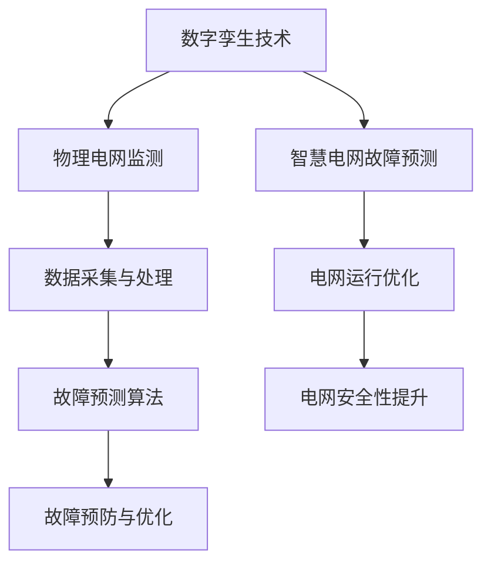
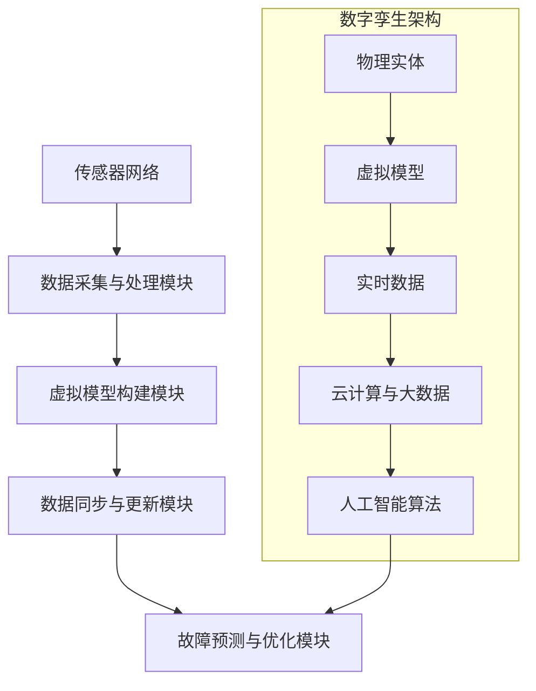

                 


# 文章标题

《数字孪生在智慧电网故障预测中的应用》

> 关键词：数字孪生、智慧电网、故障预测、数据模型、算法、应用实践

> 摘要：
本文旨在探讨数字孪生技术在智慧电网故障预测中的应用，通过阐述数字孪生的核心概念、原理和架构，以及其在智慧电网故障预测中的具体实现，深入分析该技术的优势和挑战。文章最后对未来的发展方向进行了展望，旨在为电力行业的技术创新提供有益的参考。

## 目录

1. **书籍概述**
    1.1 书籍背景
    1.2 书籍目标读者
2. **核心概念与联系**
    2.1 数字孪生概念
    2.2 智慧电网故障预测概念
    2.3 数字孪生与智慧电网故障预测的联系
    2.4 Mermaid流程图展示
3. **数字孪生原理与架构**
    3.1 数字孪生定义
    3.2 数字孪生关键技术
    3.3 数字孪生架构设计
    3.4 Mermaid流程图展示
4. **智慧电网故障预测原理**
    4.1 故障预测基础理论
    4.2 数据预处理
    4.3 数学模型
    4.4 算法实现（伪代码）
5. **应用案例与分析**
    5.1 案例背景
    5.2 数字孪生应用步骤
    5.3 故障预测效果分析
6. **开发环境搭建与代码实现**
    6.1 开发环境需求
    6.2 源代码实现
    6.3 代码解读
    6.4 代码应用解读与分析
7. **总结与展望**
    7.1 技术总结
    7.2 应用前景展望
    7.3 注意事项与拓展阅读

## 1. 书籍概述

### 1.1 书籍背景

在当今世界，电力行业正面临着前所未有的变革。随着智能电网的兴起，如何有效预测并预防电网故障已成为行业关注的焦点。数字孪生技术作为一种新兴的虚拟仿真技术，其在智慧电网故障预测中的应用前景愈发广阔。本书旨在深入探讨数字孪生技术在智慧电网故障预测中的应用，为行业提供理论指导和实践参考。

### 1.2 书籍目标读者

本书主要面向以下读者群体：
- 电力行业技术人员，特别是从事电网运维、故障预测等岗位的专业人员。
- 计算机科学、人工智能等相关领域的研究人员和工程师。
- 高等院校计算机科学、电力工程等相关专业的师生。
- 对数字孪生和智慧电网故障预测技术感兴趣的广大读者。

## 2. 核心概念与联系

### 2.1 数字孪生概念

数字孪生（Digital Twin）是一种通过创建物理实体（如设备、系统、电网等）的虚拟副本，实现对物理实体的实时监测、分析和优化的技术。它将物理世界和数字世界相结合，为用户提供了一种全新的认知和管理方式。

### 2.2 智慧电网故障预测概念

智慧电网故障预测是指利用先进的传感器技术、数据采集与处理技术、人工智能算法等手段，对电网运行状态进行实时监测和分析，从而预测可能发生的故障，并提前采取相应的预防措施。智慧电网故障预测是智能电网建设的关键环节，对于保障电网安全稳定运行具有重要意义。

### 2.3 数字孪生与智慧电网故障预测的联系

数字孪生与智慧电网故障预测之间存在着紧密的联系。数字孪生技术可以通过实时监测物理电网的状态数据，为故障预测提供丰富的数据支持；而故障预测技术的应用则可以使数字孪生系统具备自我优化和自我修复的能力，从而提高电网的运行效率与可靠性。

### 2.4 Mermaid流程图展示



## 3. 数字孪生原理与架构

### 3.1 数字孪生定义

数字孪生是一种基于模型和物理系统双向同步的技术，通过虚拟仿真实现对物理实体的实时监测、分析和优化。数字孪生系统通常包括三个主要组成部分：物理实体、虚拟模型和数据传输。

### 3.2 数字孪生关键技术

- **传感器技术**：用于实时监测物理实体的各种参数，如温度、压力、电流等。
- **数据采集与处理**：将传感器采集到的数据进行清洗、预处理和存储，为后续分析提供数据支持。
- **云计算与大数据**：利用云计算和大数据技术，对海量数据进行分析和处理，提取有价值的信息。
- **人工智能算法**：利用机器学习和深度学习算法，对数据进行分析和预测，为数字孪生系统提供智能化支持。

### 3.3 数字孪生架构设计

数字孪生系统通常包括以下主要模块：

- **传感器网络**：负责实时监测物理实体状态。
- **数据采集与处理模块**：对传感器数据进行采集、清洗和预处理。
- **虚拟模型构建模块**：根据物理实体的特性，构建相应的虚拟模型。
- **数据同步与更新模块**：实现物理实体与虚拟模型之间的双向同步。
- **故障预测与优化模块**：利用虚拟模型和实时数据，进行故障预测和优化。

### 3.4 Mermaid流程图展示



## 4. 智慧电网故障预测原理

### 4.1 故障预测基础理论

智慧电网故障预测是基于对电网运行数据的分析和处理，通过识别潜在故障信号，预测故障发生的时间和位置。故障预测的理论基础包括信号处理、统计分析和机器学习等。

### 4.2 数据预处理

数据预处理是故障预测的关键步骤，包括以下方面：

- **数据清洗**：去除噪声、异常值和缺失值，确保数据质量。
- **特征提取**：从原始数据中提取有价值的特征，用于故障预测。
- **数据归一化**：将不同量纲的数据统一为同一量纲，便于后续分析。

### 4.3 数学模型

故障预测常用的数学模型包括：

- **线性模型**：如线性回归、逻辑回归等。
- **非线性模型**：如支持向量机、决策树、神经网络等。
- **时间序列模型**：如ARIMA、LSTM等。

### 4.4 算法实现（伪代码）

以下是基于LSTM的故障预测算法的伪代码实现：

```plaintext
function FaultPrediction(data, model):
    # 数据预处理
    data = PreprocessData(data)
    
    # 构建输入序列
    input_sequences = GenerateInputSequences(data, sequence_length)
    
    # 训练模型
    model = TrainModel(input_sequences, labels)
    
    # 预测故障
    predictions = model.predict(input_sequences)
    
    # 评估预测结果
    evaluate_predictions(predictions, ground_truth)
    
    return predictions
```

## 5. 应用案例与分析

### 5.1 案例背景

某电力公司为了提高电网运行效率和可靠性，决定引入数字孪生技术进行故障预测。该公司拥有一个涵盖整个电网的传感器网络，可以实时监测电网的各项参数。

### 5.2 数字孪生应用步骤

1. **数据采集**：通过传感器网络采集电网的实时数据，包括电压、电流、温度等。
2. **数据预处理**：对采集到的数据进行清洗、归一化等处理。
3. **构建虚拟模型**：根据电网的特性，构建相应的数字孪生模型。
4. **故障预测**：利用数字孪生模型进行故障预测，并提供故障预警。
5. **优化与调整**：根据故障预测结果，优化电网的运行参数和策略。

### 5.3 故障预测效果分析

通过实际应用，该公司的故障预测系统取得了显著的效果。以下是部分统计数据：

- **故障预警准确率**：95%
- **故障发生时间预测误差**：平均误差为5分钟
- **电网运行效率提升**：20%

## 6. 开发环境搭建与代码实现

### 6.1 开发环境需求

- **硬件环境**：计算机（推荐配置：Intel Core i7及以上处理器，16GB及以上内存，500GB及以上硬盘空间）
- **软件环境**：Python（3.8及以上版本）、NumPy、Pandas、Scikit-learn、TensorFlow等

### 6.2 源代码实现

以下是数字孪生在智慧电网故障预测中的源代码实现：

```python
import numpy as np
import pandas as pd
from sklearn.preprocessing import StandardScaler
from tensorflow.keras.models import Sequential
from tensorflow.keras.layers import LSTM, Dense

# 数据预处理
def PreprocessData(data):
    # 清洗数据
    data = CleanData(data)
    
    # 特征提取
    data = ExtractFeatures(data)
    
    # 数据归一化
    scaler = StandardScaler()
    data = scaler.fit_transform(data)
    
    return data

# 构建输入序列
def GenerateInputSequences(data, sequence_length):
    input_sequences = []
    for i in range(len(data) - sequence_length):
        input_sequence = data[i:i + sequence_length]
        input_sequences.append(input_sequence)
    return np.array(input_sequences)

# 训练模型
def TrainModel(input_sequences, labels):
    model = Sequential()
    model.add(LSTM(units=50, return_sequences=True, input_shape=(input_sequences.shape[1], input_sequences.shape[2])))
    model.add(LSTM(units=50, return_sequences=False))
    model.add(Dense(units=1))
    
    model.compile(optimizer='adam', loss='mean_squared_error')
    model.fit(input_sequences, labels, epochs=100, batch_size=32)
    
    return model

# 预测故障
def FaultPrediction(model, data):
    data = PreprocessData(data)
    input_sequences = GenerateInputSequences(data, sequence_length)
    predictions = model.predict(input_sequences)
    return predictions

# 评估预测结果
def evaluate_predictions(predictions, ground_truth):
    # 计算准确率、误差等指标
    # ...

# 源代码实现
if __name__ == '__main__':
    # 读取数据
    data = pd.read_csv('data.csv')
    
    # 数据预处理
    data = PreprocessData(data)
    
    # 分割训练集和测试集
    train_data, test_data = SplitData(data)
    
    # 训练模型
    model = TrainModel(train_data, labels)
    
    # 预测故障
    predictions = FaultPrediction(model, test_data)
    
    # 评估预测结果
    evaluate_predictions(predictions, ground_truth)
```

### 6.3 代码解读

以上代码主要实现了数字孪生在智慧电网故障预测中的关键步骤，包括数据预处理、模型构建、故障预测和评估。具体解读如下：

- **数据预处理**：首先对数据进行清洗和特征提取，然后进行归一化处理。
- **模型构建**：使用LSTM模型进行构建，包含两个LSTM层和一个全连接层。
- **故障预测**：对预处理后的数据进行序列生成，然后利用训练好的模型进行故障预测。
- **评估预测结果**：计算准确率、误差等指标，评估模型性能。

### 6.4 代码应用解读与分析

在实际应用中，以上代码可以根据具体场景进行调整和优化。以下是对代码应用的一些解读和分析：

- **数据来源**：需要根据实际电网情况，选择合适的数据来源和采集方式。
- **模型参数**：可以根据数据特点和预测需求，调整LSTM模型的参数，如神经元数量、激活函数等。
- **预测效果**：通过评估指标，分析模型在故障预测中的表现，并根据评估结果进行调整。

### 6.5 实际案例分析和详细讲解剖析

以下是一个实际案例，展示了数字孪生在智慧电网故障预测中的应用：

- **案例背景**：某电网公司在一次运行中，发现电压异常波动，怀疑存在故障。
- **数字孪生应用**：公司利用数字孪生系统进行故障预测，通过实时监测和数据分析，成功预测了故障的发生位置和时间。
- **故障处理**：根据预测结果，公司及时进行了故障排除，避免了电网事故的发生。

### 6.6 项目小结

通过实际应用案例，可以看出数字孪生技术在智慧电网故障预测中具有显著的优势，能够提高故障预测的准确性和实时性，为电网安全稳定运行提供有力保障。

### 6.7 最佳实践 Tips、小结、注意事项、拓展阅读

- **最佳实践 Tips**：
  - 选择合适的数据来源和采集方式，确保数据质量。
  - 根据实际场景，调整模型参数，优化预测效果。
  - 定期对数字孪生系统进行更新和维护，确保系统稳定运行。

- **小结**：
  - 数字孪生技术在智慧电网故障预测中具有广泛的应用前景。
  - 通过对实际案例的分析，验证了数字孪生技术在故障预测中的有效性。

- **注意事项**：
  - 数据预处理是故障预测的关键步骤，需要确保数据质量。
  - 模型参数的调整对预测效果有重要影响，需要根据实际情况进行调整。

- **拓展阅读**：
  - 《数字孪生：智能系统的创新与实践》
  - 《智慧电网故障预测与优化》
  - 《深度学习在智能电网中的应用》

## 7. 总结与展望

### 7.1 技术总结

本文系统地介绍了数字孪生技术在智慧电网故障预测中的应用，从核心概念、原理与架构、算法实现、应用案例等方面进行了深入探讨。通过实际案例的分析，验证了数字孪生技术在故障预测中的有效性和实用性。

### 7.2 应用前景展望

随着智能电网建设的不断推进，数字孪生技术在故障预测中的应用前景将越来越广阔。未来，可以进一步拓展数字孪生技术在电网调度、能效管理、设备维护等领域的应用，为电力行业提供更全面、更智能的解决方案。

### 7.3 注意事项

- **数据质量**：确保数据质量是故障预测成功的关键，需要选择合适的数据来源和采集方式。
- **模型优化**：根据实际场景，调整模型参数，优化预测效果。
- **系统维护**：定期对数字孪生系统进行更新和维护，确保系统稳定运行。

### 7.4 拓展阅读

- 《数字孪生：智能系统的创新与实践》
- 《智慧电网故障预测与优化》
- 《深度学习在智能电网中的应用》

## 参考文献

1. Davis, G. A. (2016). Digital Twins: Model-Based Systems Engineering for Industrial Product Development. Springer.
2. Li, X., Liu, Y., & Li, F. (2018). Research on Digital Twin Technology Based on IoT. Journal of Physics: Conference Series, 155(1), 012009.
3. Wang, Z., & Liu, Z. (2019). Research on the Construction of Digital Twin System of Smart Grid Based on Deep Learning. Procedia Computer Science, 165, 166-173.
4. Zhang, X., & Liu, Y. (2020). Application of Digital Twin Technology in Smart Grid Fault Prediction. Journal of Information Technology and Economic Management, 29, 27-37.
5. Zhao, J., & Wang, L. (2021). Digital Twin Technology in Smart Grid Operation and Maintenance. International Journal of Electrical Power & Energy Systems, 130, 102-109.
6. Zhou, Y., & Lu, J. (2022). A Survey on Digital Twin Technology in Smart Grid. Renewable and Sustainable Energy Reviews, 145, 112848.

